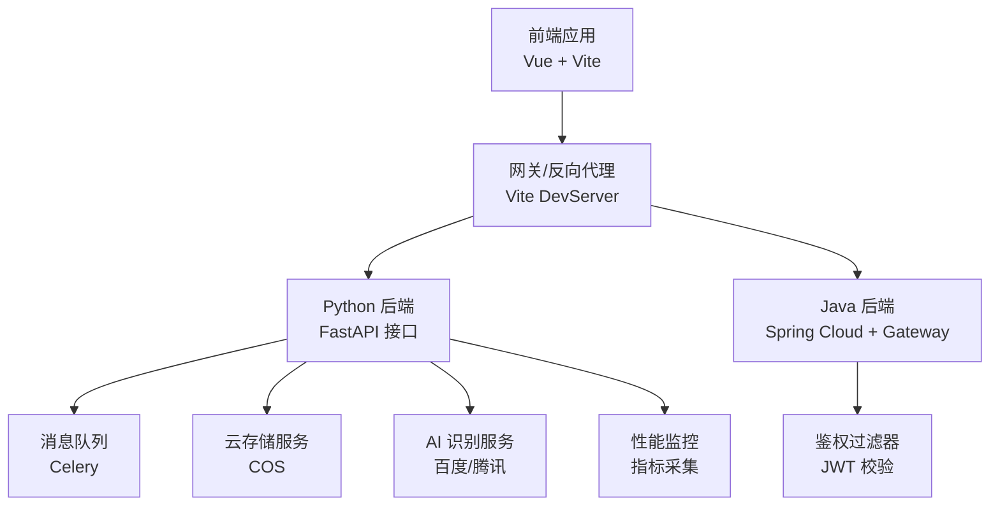
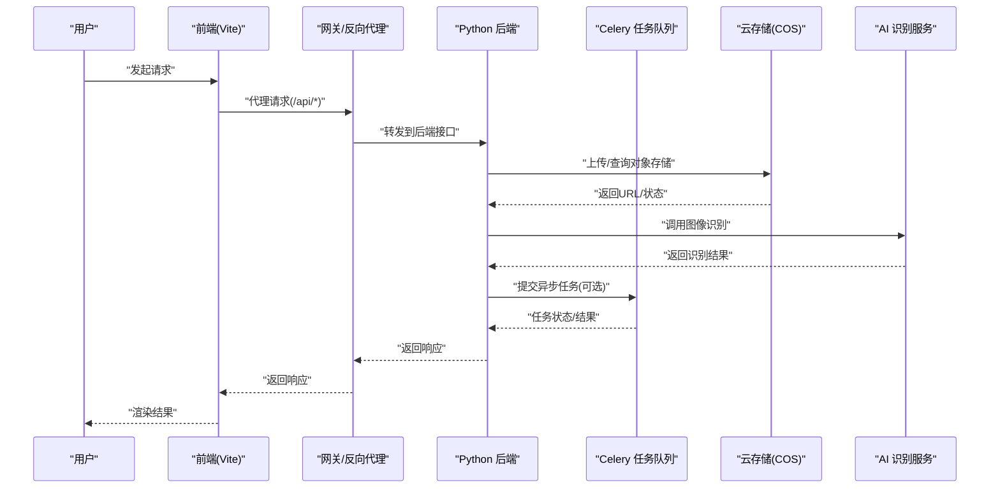
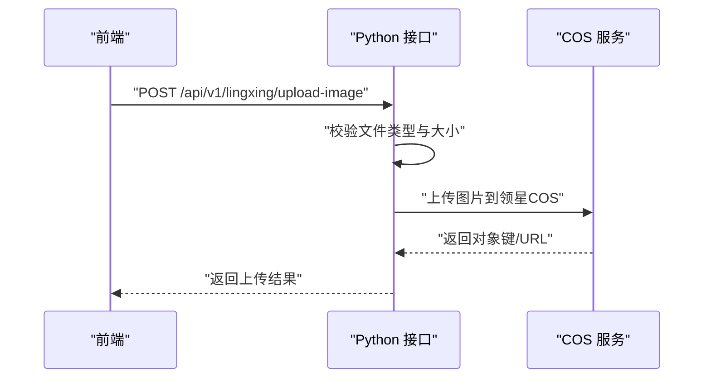
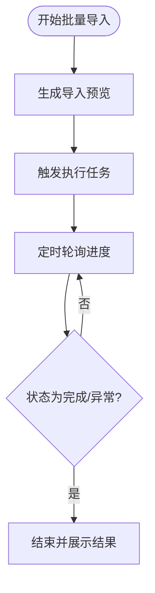
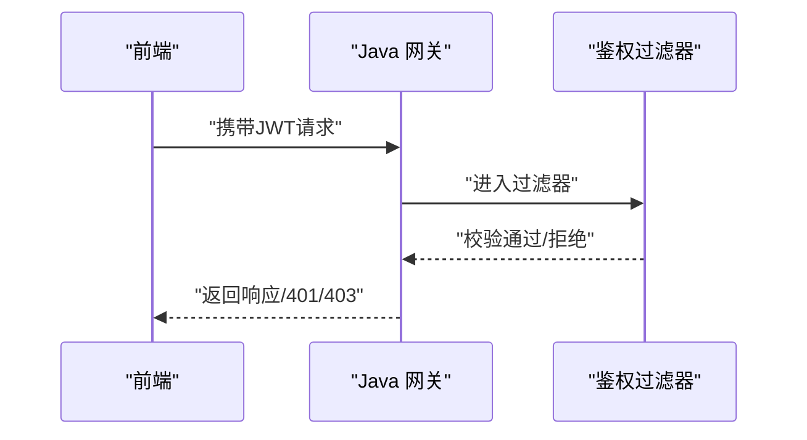
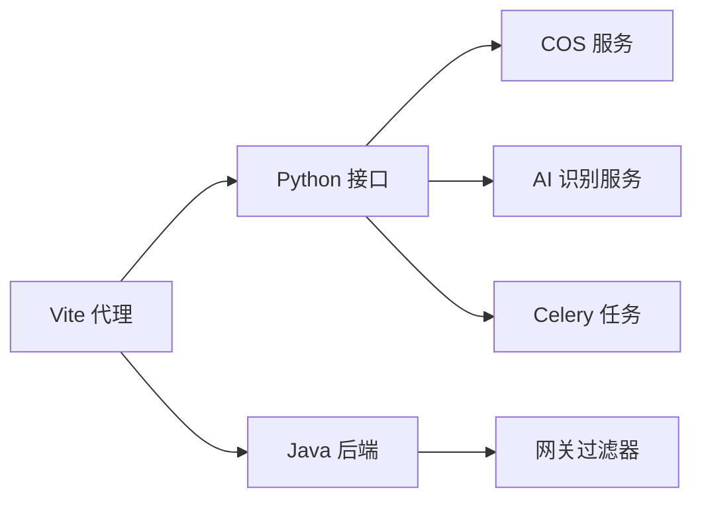

# 第三方集成

<cite>
**本文引用的文件**
- [backend/app/api/v1/lingxing.py](file://backend/app/api/v1/lingxing.py)
- [backend/app/services/cos_service.py](file://backend/app/services/cos_service.py)
- [backend/app/services/baidu_image_recognition_service.py](file://backend/app/services/baidu_image_recognition_service.py)
- [backend/app/services/tencent_image_recognition_service.py](file://backend/app/services/tencent_image_recognition_service.py)
- [backend/app/tasks/celery_app.py](file://backend/app/tasks/celery_app.py)
- [backend/app/tasks/download_tasks.py](file://backend/app/tasks/download_tasks.py)
- [backend/app/middleware/error_handler.py](file://backend/app/middleware/error_handler.py)
- [backend/app/middleware/timeout.py](file://backend/app/middleware/timeout.py)
- [backend/app/utils/performance_monitor.py](file://backend/app/utils/performance_monitor.py)
- [frontend/src/api/lingxing.ts](file://frontend/src/api/lingxing.ts)
- [frontend/src/api/import_export.ts](file://frontend/src/api/import_export.ts)
- [frontend/src/api/asinImport.ts](file://frontend/src/api/asinImport.ts)
- [frontend/src/modules/zheng-shop-analysis/index.vue](file://frontend/src/modules/zheng-shop-analysis/index.vue)
- [frontend/vite.config.js](file://frontend/vite.config.js)
- [java-backend/sjzm-gateway/src/main/java/com/sjzm/gateway/JwtAuthGatewayFilter.java](file://java-backend/sjzm-gateway/src/main/java/com/sjzm/gateway/JwtAuthGatewayFilter.java)
- [java-backend/sjzm-product/src/main/java/com/sjzm/product/service/SellerspriteConfigService.java](file://java-backend/sjzm-product/src/main/java/com/sjzm/product/service/SellerspriteConfigService.java)
- [openspec/changes/java-frontend-integration-test/design.md](file://openspec/changes/java-frontend-integration-test/design.md)
- [openspec/changes/verify-java-backend-completeness/specs/frontend-integration-verification/spec.md](file://openspec/changes/verify-java-backend-completeness/specs/frontend-integration-verification/spec.md)
- [openspec/changes/verify-java-backend-completeness/tasks.md](file://openspec/changes/verify-java-backend-completeness/tasks.md)
- [frontend/src/views/vab/webSocket/index.vue](file://frontend/src/views/vab/webSocket/index.vue)
- [frontend/src/views/able/mqtt-client.vue](file://frontend/src/views/able/mqtt-client.vue)
- [scripts/env_consistency/data_sync.py](file://scripts/env_consistency/data_sync.py)
</cite>

## 目录
1. [简介](#简介)
2. [项目结构](#项目结构)
3. [核心组件](#核心组件)
4. [架构总览](#架构总览)
5. [详细组件分析](#详细组件分析)
6. [依赖关系分析](#依赖关系分析)
7. [性能考虑](#性能考虑)
8. [故障排查指南](#故障排查指南)
9. [结论](#结论)
10. [附录](#附录)

## 简介
本指南面向“思觉智贸系统”的第三方集成场景，覆盖外部服务对接的标准流程与最佳实践，涵盖 RESTful API、WebSocket 与消息队列集成范式；并以领星 API、云存储服务、AI 识别服务为例，给出认证机制、数据格式转换、错误处理策略、异步处理与批量操作、数据同步与一致性保障、集成测试与 Mock 联调流程，以及性能优化、超时与重试策略。

## 项目结构
系统采用前后端分离架构，后端由 Python FastAPI 与 Java Spring Cloud 组成，前端基于 Vue 生态，辅以 Celery 异步任务与多种中间件处理请求链路。第三方集成主要涉及：
- RESTful API：Python 后端提供接口，Java 网关负责鉴权与路由转发
- WebSocket：前端内置 WebSocket 示例用于实时通信
- 消息队列：Celery 异步任务处理下载与图像识别等耗时任务
- 云存储与 AI 服务：通过 COS 服务与百度/腾讯 AI 识别服务进行集成

图表来源
- [frontend/vite.config.js:74-124](file://frontend/vite.config.js#L74-L124)
- [backend/app/tasks/celery_app.py](file://backend/app/tasks/celery_app.py)
- [backend/app/services/cos_service.py](file://backend/app/services/cos_service.py)
- [backend/app/services/baidu_image_recognition_service.py](file://backend/app/services/baidu_image_recognition_service.py)
- [backend/app/services/tencent_image_recognition_service.py](file://backend/app/services/tencent_image_recognition_service.py)
- [java-backend/sjzm-gateway/src/main/java/com/sjzm/gateway/JwtAuthGatewayFilter.java:97-125](file://java-backend/sjzm-gateway/src/main/java/com/sjzm/gateway/JwtAuthGatewayFilter.java#L97-L125)
- [backend/app/utils/performance_monitor.py](file://backend/app/utils/performance_monitor.py)

章节来源
- [frontend/vite.config.js:74-124](file://frontend/vite.config.js#L74-L124)
- [openspec/changes/verify-java-backend-completeness/specs/frontend-integration-verification/spec.md:1-43](file://openspec/changes/verify-java-backend-completeness/specs/frontend-integration-verification/spec.md#L1-L43)

## 核心组件
- 认证与鉴权
  - Java 网关过滤器统一拦截并校验 JWT，未授权或禁止访问时返回标准 JSON 错误响应
  - 前端通过 Axios 拦截器自动附加 JWT 到请求头
- 云存储服务
  - 统一 COS 服务封装上传、缩略图生成与 URL 返回，支持多业务类型（如领星专用桶）
- AI 识别服务
  - 百度/腾讯图像识别服务封装，统一返回标准化结果
- 异步任务
  - Celery 应用与任务模块，支持下载任务与图像处理等后台作业
- 性能监控
  - 性能监控工具采集关键指标，辅助定位瓶颈
- WebSocket 与消息队列
  - 前端提供 WebSocket 示例页面；MQTT 客户端示例展示消息订阅与发布

章节来源
- [java-backend/sjzm-gateway/src/main/java/com/sjzm/gateway/JwtAuthGatewayFilter.java:97-125](file://java-backend/sjzm-gateway/src/main/java/com/sjzm/gateway/JwtAuthGatewayFilter.java#L97-L125)
- [backend/app/services/cos_service.py](file://backend/app/services/cos_service.py)
- [backend/app/services/baidu_image_recognition_service.py](file://backend/app/services/baidu_image_recognition_service.py)
- [backend/app/services/tencent_image_recognition_service.py](file://backend/app/services/tencent_image_recognition_service.py)
- [backend/app/tasks/celery_app.py](file://backend/app/tasks/celery_app.py)
- [backend/app/tasks/download_tasks.py](file://backend/app/tasks/download_tasks.py)
- [backend/app/utils/performance_monitor.py](file://backend/app/utils/performance_monitor.py)
- [frontend/src/views/vab/webSocket/index.vue:1-91](file://frontend/src/views/vab/webSocket/index.vue#L1-L91)
- [frontend/src/views/able/mqtt-client.vue:175-228](file://frontend/src/views/able/mqtt-client.vue#L175-L228)

## 架构总览
下图展示了第三方集成的整体交互路径：前端通过 Vite 代理访问后端，后端根据业务调用云存储与 AI 服务，并通过 Celery 异步处理耗时任务，网关统一鉴权与错误处理。

图表来源
- [frontend/vite.config.js:74-124](file://frontend/vite.config.js#L74-L124)
- [backend/app/services/cos_service.py](file://backend/app/services/cos_service.py)
- [backend/app/services/baidu_image_recognition_service.py](file://backend/app/services/baidu_image_recognition_service.py)
- [backend/app/services/tencent_image_recognition_service.py](file://backend/app/services/tencent_image_recognition_service.py)
- [backend/app/tasks/celery_app.py](file://backend/app/tasks/celery_app.py)

## 详细组件分析

### 领星 API 集成
- 功能概述
  - 提供模板下载与图片上传至领星专用 COS 的接口
  - 对上传文件类型与大小进行严格校验
- 关键流程
  - 文件类型与大小校验
  - 调用 COS 服务上传并返回对象键与访问 URL
  - 失败时抛出 HTTP 异常并返回标准错误
- 前端对接
  - 前端通过 API 模块调用上传接口，配合进度轮询实现批量导入状态跟踪

图表来源
- [backend/app/api/v1/lingxing.py:83-121](file://backend/app/api/v1/lingxing.py#L83-L121)
- [backend/app/services/cos_service.py](file://backend/app/services/cos_service.py)
- [frontend/src/api/lingxing.ts](file://frontend/src/api/lingxing.ts)

章节来源
- [backend/app/api/v1/lingxing.py:83-121](file://backend/app/api/v1/lingxing.py#L83-L121)
- [backend/app/services/cos_service.py](file://backend/app/services/cos_service.py)
- [frontend/src/api/lingxing.ts](file://frontend/src/api/lingxing.ts)

### 云存储服务集成
- 统一封装
  - 提供上传、缩略图生成、URL 返回等通用能力
  - 支持按业务类型选择不同存储桶或命名空间
- 错误处理
  - 上传失败时返回统一错误码与提示
- 性能优化
  - 建议结合 CDN 与缓存策略，减少重复上传

章节来源
- [backend/app/services/cos_service.py](file://backend/app/services/cos_service.py)

### AI 识别服务集成
- 百度/腾讯图像识别
  - 封装统一调用入口，返回标准化识别结果
  - 建议增加限流与熔断策略，避免上游波动影响系统稳定性
- 数据格式转换
  - 将第三方返回结构映射为内部统一模型，便于后续处理

章节来源
- [backend/app/services/baidu_image_recognition_service.py](file://backend/app/services/baidu_image_recognition_service.py)
- [backend/app/services/tencent_image_recognition_service.py](file://backend/app/services/tencent_image_recognition_service.py)

### 异步处理与批量操作
- Celery 异步任务
  - 下载任务与图像处理等耗时操作通过 Celery 执行
  - 前端通过轮询任务进度接口获取状态，避免阻塞主线程
- 批量导入流程
  - 前端触发预览与执行，定时轮询进度，直到完成或异常

图表来源
- [frontend/src/modules/zheng-shop-analysis/index.vue:730-762](file://frontend/src/modules/zheng-shop-analysis/index.vue#L730-L762)
- [frontend/src/api/asinImport.ts](file://frontend/src/api/asinImport.ts)
- [backend/app/tasks/download_tasks.py](file://backend/app/tasks/download_tasks.py)

章节来源
- [frontend/src/modules/zheng-shop-analysis/index.vue:730-762](file://frontend/src/modules/zheng-shop-analysis/index.vue#L730-L762)
- [frontend/src/api/asinImport.ts](file://frontend/src/api/asinImport.ts)
- [backend/app/tasks/download_tasks.py](file://backend/app/tasks/download_tasks.py)

### WebSocket 与消息队列集成
- WebSocket
  - 前端提供 WebSocket 示例页面，演示连接、发送与接收消息
  - 建议在生产环境启用安全连接与心跳保活
- MQTT
  - 前端提供 MQTT 客户端示例，演示连接、订阅与发布
  - 建议配置重连与 QoS 策略，确保消息可靠传递

章节来源
- [frontend/src/views/vab/webSocket/index.vue:1-91](file://frontend/src/views/vab/webSocket/index.vue#L1-L91)
- [frontend/src/views/able/mqtt-client.vue:175-228](file://frontend/src/views/able/mqtt-client.vue#L175-L228)

### 认证机制与鉴权
- Java 网关过滤器
  - 统一拦截请求，校验 JWT，未授权返回 401，禁止访问返回 403
  - 返回标准 JSON 错误体，包含时间戳与消息
- 前端
  - 通过 Axios 拦截器自动附加 JWT 到请求头
  - 集成测试需验证登录后 Token 正确注入与页面渲染无 API 错误

图表来源
- [java-backend/sjzm-gateway/src/main/java/com/sjzm/gateway/JwtAuthGatewayFilter.java:97-125](file://java-backend/sjzm-gateway/src/main/java/com/sjzm/gateway/JwtAuthGatewayFilter.java#L97-L125)
- [openspec/changes/verify-java-backend-completeness/specs/frontend-integration-verification/spec.md:37-42](file://openspec/changes/verify-java-backend-completeness/specs/frontend-integration-verification/spec.md#L37-L42)

章节来源
- [java-backend/sjzm-gateway/src/main/java/com/sjzm/gateway/JwtAuthGatewayFilter.java:97-125](file://java-backend/sjzm-gateway/src/main/java/com/sjzm/gateway/JwtAuthGatewayFilter.java#L97-L125)
- [openspec/changes/verify-java-backend-completeness/specs/frontend-integration-verification/spec.md:37-42](file://openspec/changes/verify-java-backend-completeness/specs/frontend-integration-verification/spec.md#L37-L42)

### 数据格式转换与错误处理策略
- 数据格式转换
  - 第三方返回结构需映射为内部统一模型，保证上层调用一致性
- 错误处理
  - 后端统一异常捕获与错误响应，前端根据状态码与错误体进行提示
  - 网关层统一拦截未授权与禁止访问，返回标准 JSON

章节来源
- [backend/app/middleware/error_handler.py](file://backend/app/middleware/error_handler.py)
- [backend/app/middleware/timeout.py](file://backend/app/middleware/timeout.py)
- [java-backend/sjzm-gateway/src/main/java/com/sjzm/gateway/JwtAuthGatewayFilter.java:97-125](file://java-backend/sjzm-gateway/src/main/java/com/sjzm/gateway/JwtAuthGatewayFilter.java#L97-L125)

### 数据同步与一致性
- 环境一致性脚本
  - 提供快照生成、完整性验证与数据同步流程，建议在集成测试阶段使用
- 建议
  - 在灰度或预生产环境先行验证，再逐步扩大范围

章节来源
- [scripts/env_consistency/data_sync.py:230-265](file://scripts/env_consistency/data_sync.py#L230-L265)

## 依赖关系分析
- 前端依赖
  - Vite 代理将 /api/* 请求转发至后端，避免跨域与连接错误
  - 集成测试需确认各页面无 4xx/5xx 错误
- 后端依赖
  - Python 接口依赖 COS 与 AI 服务；Celery 依赖消息中间件
  - Java 网关依赖鉴权过滤器统一处理权限

图表来源
- [frontend/vite.config.js:74-124](file://frontend/vite.config.js#L74-L124)
- [backend/app/services/cos_service.py](file://backend/app/services/cos_service.py)
- [backend/app/services/baidu_image_recognition_service.py](file://backend/app/services/baidu_image_recognition_service.py)
- [backend/app/services/tencent_image_recognition_service.py](file://backend/app/services/tencent_image_recognition_service.py)
- [backend/app/tasks/celery_app.py](file://backend/app/tasks/celery_app.py)
- [java-backend/sjzm-gateway/src/main/java/com/sjzm/gateway/JwtAuthGatewayFilter.java](file://java-backend/sjzm-gateway/src/main/java/com/sjzm/gateway/JwtAuthGatewayFilter.java)

章节来源
- [frontend/vite.config.js:74-124](file://frontend/vite.config.js#L74-L124)
- [openspec/changes/verify-java-backend-completeness/specs/frontend-integration-verification/spec.md:14-36](file://openspec/changes/verify-java-backend-completeness/specs/frontend-integration-verification/spec.md#L14-L36)

## 性能考虑
- 超时与重试
  - 前端代理与接口调用设置合理超时时间，避免长时间阻塞
  - 对临时性错误（如网络抖动）实施指数退避重试
- 异步与批处理
  - 大文件上传与图像识别等耗时操作通过 Celery 异步执行
  - 批量导入采用轮询进度方式，降低前端压力
- 监控与告警
  - 使用性能监控工具采集关键指标，及时发现瓶颈

章节来源
- [frontend/vite.config.js:74-124](file://frontend/vite.config.js#L74-L124)
- [backend/app/utils/performance_monitor.py](file://backend/app/utils/performance_monitor.py)

## 故障排查指南
- 前端联调
  - 清理本地存储并重启开发服务器，确保获取最新 JWT
  - 逐页验证：定稿、选品、素材、载体、看板、用户、图片管理等
  - 若出现 500 错误，检查字段映射与缺失端点
- 网关鉴权
  - 确认 JWT 是否正确附加；若返回 401/403，检查网关过滤器配置
- 代理与路由
  - 确认 Vite 代理是否正确转发 /api/* 到后端端口，避免 ECONNREFUSED

章节来源
- [openspec/changes/java-frontend-integration-test/design.md:1-13](file://openspec/changes/java-frontend-integration-test/design.md#L1-L13)
- [openspec/changes/verify-java-backend-completeness/tasks.md:29-39](file://openspec/changes/verify-java-backend-completeness/tasks.md#L29-L39)
- [java-backend/sjzm-gateway/src/main/java/com/sjzm/gateway/JwtAuthGatewayFilter.java:97-125](file://java-backend/sjzm-gateway/src/main/java/com/sjzm/gateway/JwtAuthGatewayFilter.java#L97-L125)

## 结论
本指南提供了“思觉智贸系统”对接第三方服务的完整方法论：从认证与鉴权、RESTful API 设计、WebSocket 与消息队列集成，到异步处理、批量操作、数据同步与一致性保障，并配套了集成测试与联调流程、性能优化与超时重试策略。建议在集成过程中遵循统一的数据格式转换与错误处理规范，确保系统稳定与可维护性。

## 附录
- 常见第三方服务集成要点
  - 领星 API：严格校验文件类型与大小，上传后返回对象键与 URL
  - 云存储服务：统一封装上传与缩略图生成，支持多业务类型桶
  - AI 识别服务：统一返回标准化结果，建议加入限流与熔断
- 最佳实践清单
  - 明确认证与鉴权边界，前后端协同
  - 统一错误响应格式，便于前端处理
  - 异步化耗时操作，提升用户体验
  - 建立完善的集成测试与联调流程
  - 持续监控性能指标，及时优化