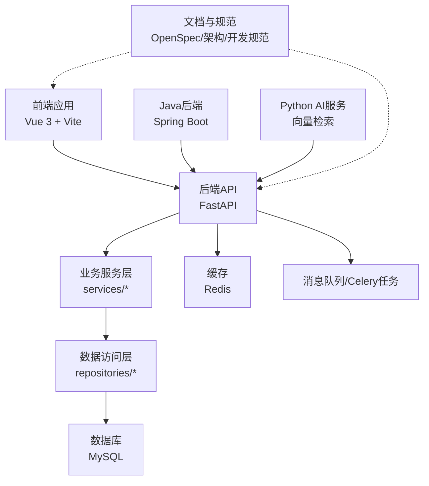
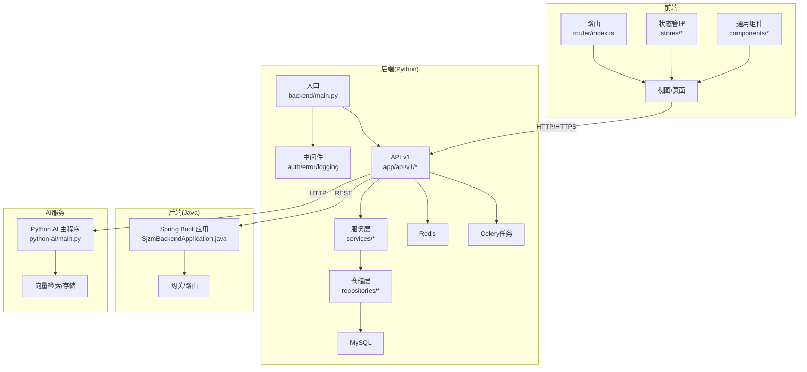
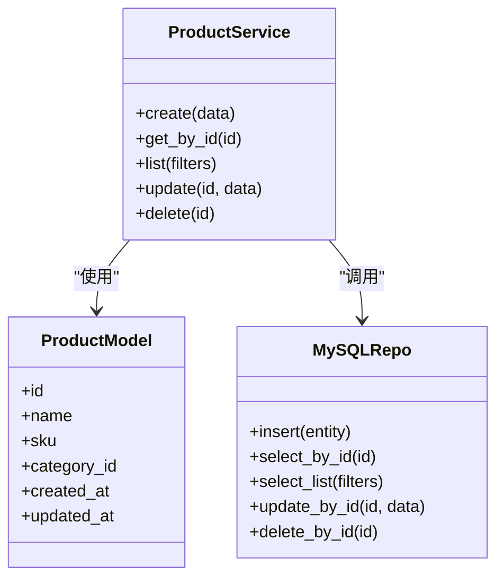
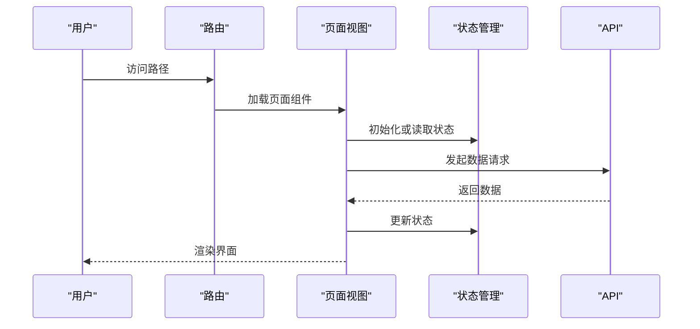
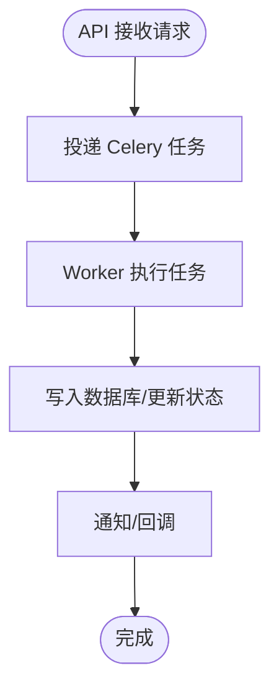
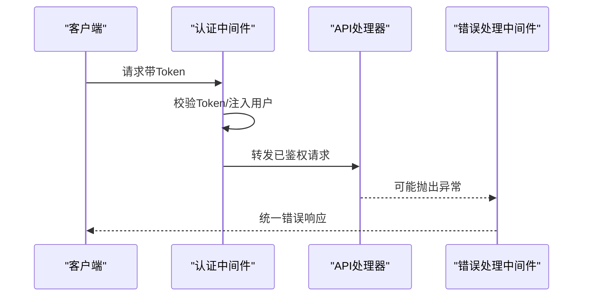
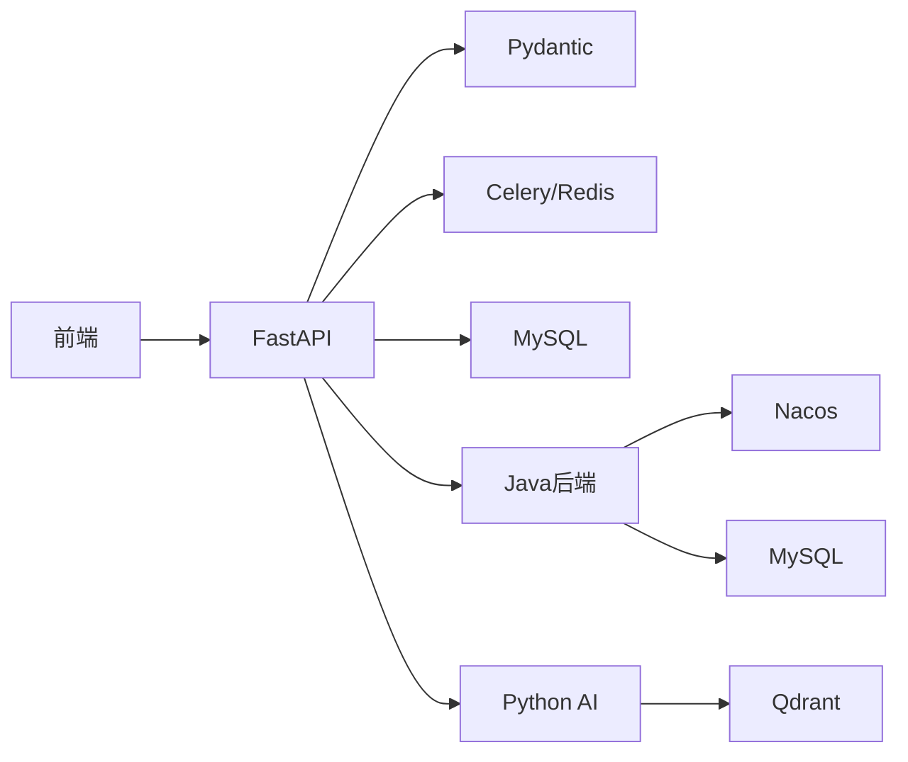

# 自定义功能开发

<cite>
**本文引用的文件**
- [README.md](file://README.md)
- [backend/main.py](file://backend/main.py)
- [backend/app/api/v1/products.py](file://backend/app/api/v1/products.py)
- [backend/app/models/product.py](file://backend/app/models/product.py)
- [backend/app/services/product_service.py](file://backend/app/services/product_service.py)
- [backend/app/repositories/mysql_repo.py](file://backend/app/repositories/mysql_repo.py)
- [backend/app/middleware/auth_middleware.py](file://backend/app/middleware/auth_middleware.py)
- [backend/app/middleware/error_handler.py](file://backend/app/middleware/error_handler.py)
- [backend/app/tasks/celery_app.py](file://backend/app/tasks/celery_app.py)
- [backend/app/utils/jwt_utils.py](file://backend/app/utils/jwt_utils.py)
- [backend/config.py](file://backend/config.py)
- [backend/requirements.txt](file://backend/requirements.txt)
- [frontend/src/router/index.ts](file://frontend/src/router/index.ts)
- [frontend/src/stores/user.ts](file://frontend/src/stores/user.ts)
- [frontend/src/views/ProductManagement/index.vue](file://frontend/src/views/ProductManagement/index.vue)
- [frontend/src/components/UniversalList/index.vue](file://frontend/src/components/UniversalList/index.vue)
- [frontend/src/types/product.ts](file://frontend/src/types/product.ts)
- [frontend/package.json](file://frontend/package.json)
- [frontend/vitest.config.ts](file://frontend/vitest.config.ts)
- [frontend/src/test/setup.ts](file://frontend/src/test/setup.ts)
- [docs/development/standards.md](file://docs/development/standards.md)
- [docs/开发流程.md](file://docs/开发流程.md)
- [docs/生产部署检查清单.md](file://docs/生产部署检查清单.md)
- [scripts/deployment/canary_deployment.py](file://scripts/deployment/canary_deployment.py)
- [scripts/deployment/blue_green_deployment.py](file://scripts/deployment/blue_green_deployment.py)
- [scripts/deployment/sync_dev_to_prod.py](file://scripts/deployment/sync_dev_to_prod.py)
- [scripts/deployment/monitor_deployment.py](file://scripts/deployment/monitor_deployment.py)
- [scripts/startup/start_prod_multiprocess.py](file://scripts/startup/start_prod_multiprocess.py)
- [java-backend/src/main/java/com/sjzm/SjzmBackendApplication.java](file://java-backend/src/main/java/com/sjzm/SjzmBackendApplication.java)
- [java-backend/pom.xml](file://java-backend/pom.xml)
- [python-ai/main.py](file://python-ai/main.py)
- [python-ai/requirements.txt](file://python-ai/requirements.txt)
- [openspec/specs/entity-schema-alignment/spec.md](file://openspec/specs/entity-schema-alignment/spec.md)
- [openspec/changes/microservices-migration/.openspec.yaml](file://openspec/changes/microservices-migration/.openspec.yaml)
- [openspec/changes/shop-name-lookup/.openspec.yaml](file://openspec/changes/shop-name-lookup/.openspec.yaml)
- [openspec/changes/verify-java-backend-completeness/.openspec.yaml](file://openspec/changes/verify-java-backend-completeness/.openspec.yaml)
- [openspec/changes/java-frontend-integration-test/.openspec.yaml](file://openspec/changes/java-frontend-integration-test/.openspec.yaml)
- [docs/RBAC设计.md](file://docs/RBAC设计.md)
- [docs/架构/ARCHITECTURE.md](file://docs/架构/ARCHITECTURE.md)
- [docs/架构/Docker生产环境独立部署方案.md](file://docs/架构/Docker生产环境独立部署方案.md)
- [docs/架构/网关.md](file://docs/架构/网关.md)
- [docs/架构/后续优化.md](file://docs/架构/后续优化.md)
- [docs/架构/端口.md](file://docs/架构/端口.md)
- [docs/架构/简历可写.md](file://docs/架构/简历可写.md)
- [docs/架构/微服务分离方案.md](file://docs/架构/微服务分离方案.md)
- [docs/项目逻辑/微服务/Gateway.md](file://docs/项目逻辑/微服务/Gateway.md)
- [docs/项目逻辑/系统设置/备份功能.md](file://docs/项目逻辑/系统设置/备份功能.md)
- [docs/项目逻辑/选品/获取asin数据流程.md](file://docs/项目逻辑/选品/获取asin数据流程.md)
- [docs/问题记录/模块化开发踩坑记录.md](file://docs/问题记录/模块化开发踩坑记录.md)
- [docs/问题记录/生产数据库误删事故.md](file://docs/问题记录/生产数据库误删事故.md)
- [docs/问题记录/生产环境图片加载失败-COS_BUCKET配置错误.md](file://docs/问题记录/生产环境图片加载失败-COS_BUCKET配置错误.md)
- [docs/问题记录/生产环境登录失败-数据库密码hash不一致.md](file://docs/问题记录/生产环境登录失败-数据库密码hash不一致.md)
- [TEAM_WORKFLOW.md](file://TEAM_WORKFLOW.md)
- [.github/workflows/ci.yml](file://.github/workflows/ci.yml)
</cite>

## 目录
1. [简介](#简介)
2. [项目结构](#项目结构)
3. [核心组件](#核心组件)
4. [架构总览](#架构总览)
5. [详细组件分析](#详细组件分析)
6. [依赖关系分析](#依赖关系分析)
7. [性能考虑](#性能考虑)
8. [故障排查指南](#故障排查指南)
9. [结论](#结论)
10. [附录](#附录)

## 简介
本指南面向需要在“思觉智贸系统”中开发自定义功能的团队与个人，提供从需求分析、技术方案设计、开发与测试、到部署与运维的全流程方法论。系统采用前后端分离架构：前端基于 Vue 3 + Vite，后端采用 Python FastAPI（主站）与 Java Spring Boot（部分网关/服务），并辅以 Celery 异步任务、Redis 缓存、MySQL 数据库存储、以及 OpenSpec 规范驱动的变更管理。文档同时覆盖代码规范、Git 工作流、代码审查流程、单元/集成/端到端测试策略、灰度发布与回滚机制，以及上线后的用户文档与维护支持建议。

## 项目结构
系统由以下主要子项目构成：
- 后端（Python FastAPI）：提供 REST API、业务服务、数据访问层、中间件与任务队列
- 前端（Vue 3）：单页应用，包含视图、组件、状态管理、类型定义与测试
- Java 后端（Spring Boot）：网关与部分微服务模块
- Python AI：向量检索与 AI 能力服务
- 文档与脚本：开发规范、架构文档、部署脚本、CI/CD 流水线
- OpenSpec：规范化的变更与设计文档管理

图表来源
- [backend/main.py](file://backend/main.py)
- [java-backend/src/main/java/com/sjzm/SjzmBackendApplication.java](file://java-backend/src/main/java/com/sjzm/SjzmBackendApplication.java)
- [python-ai/main.py](file://python-ai/main.py)
- [docs/架构/ARCHITECTURE.md](file://docs/架构/ARCHITECTURE.md)

章节来源
- [README.md](file://README.md)
- [docs/架构/ARCHITECTURE.md](file://docs/架构/ARCHITECTURE.md)

## 核心组件
- 后端 API 层：以版本化路由组织接口，如 v1/products.py，统一处理鉴权、错误处理与响应格式
- 业务服务层：封装领域逻辑，如 product_service.py，协调仓储与外部服务
- 数据访问层：抽象数据库操作，如 mysql_repo.py，支持事务与索引优化
- 中间件：认证、错误处理、超时与日志等横切关注点
- 任务队列：Celery 异步执行下载、图像处理等耗时任务
- 前端路由与状态：router/index.ts、stores/* 管理页面导航与全局状态
- 组件体系：通用组件（UniversalList 等）与页面视图解耦
- 文档与规范：OpenSpec 变更规范、开发流程与架构文档

章节来源
- [backend/app/api/v1/products.py](file://backend/app/api/v1/products.py)
- [backend/app/services/product_service.py](file://backend/app/services/product_service.py)
- [backend/app/repositories/mysql_repo.py](file://backend/app/repositories/mysql_repo.py)
- [backend/app/middleware/auth_middleware.py](file://backend/app/middleware/auth_middleware.py)
- [backend/app/middleware/error_handler.py](file://backend/app/middleware/error_handler.py)
- [backend/app/tasks/celery_app.py](file://backend/app/tasks/celery_app.py)
- [frontend/src/router/index.ts](file://frontend/src/router/index.ts)
- [frontend/src/stores/user.ts](file://frontend/src/stores/user.ts)
- [frontend/src/components/UniversalList/index.vue](file://frontend/src/components/UniversalList/index.vue)
- [openspec/specs/entity-schema-alignment/spec.md](file://openspec/specs/entity-schema-alignment/spec.md)

## 架构总览
系统采用多语言混合架构：
- Python FastAPI 提供核心 API，负责鉴权、数据模型、业务编排与对外接口
- Java Spring Boot 提供网关与部分微服务，实现路由、权限与服务治理
- Celery + Redis 支持异步任务与缓存加速
- OpenSpec 管理设计与变更，确保前后端契约一致
- 前端通过 Axios 请求 API，使用 Pinia/Vuex 风格的状态管理与组件化开发

图表来源
- [backend/main.py](file://backend/main.py)
- [backend/app/middleware/auth_middleware.py](file://backend/app/middleware/auth_middleware.py)
- [backend/app/middleware/error_handler.py](file://backend/app/middleware/error_handler.py)
- [backend/app/tasks/celery_app.py](file://backend/app/tasks/celery_app.py)
- [java-backend/src/main/java/com/sjzm/SjzmBackendApplication.java](file://java-backend/src/main/java/com/sjzm/SjzmBackendApplication.java)
- [python-ai/main.py](file://python-ai/main.py)
- [frontend/src/router/index.ts](file://frontend/src/router/index.ts)

## 详细组件分析

### 后端 API 设计与数据模型
- API 版本化：v1 路由下按资源划分模块，如 products.py、selection.py、statistics.py 等
- 鉴权与错误处理：中间件统一拦截请求，校验令牌与异常转换
- 数据模型：models/product.py 定义实体属性与约束；schemas 对外 DTO 进行序列化
- 服务编排：services/* 将复杂业务拆分为可复用的服务函数
- 仓储抽象：repositories/* 封装 SQL 与连接池，支持迁移脚本与索引优化

图表来源
- [backend/app/models/product.py](file://backend/app/models/product.py)
- [backend/app/services/product_service.py](file://backend/app/services/product_service.py)
- [backend/app/repositories/mysql_repo.py](file://backend/app/repositories/mysql_repo.py)

章节来源
- [backend/app/api/v1/products.py](file://backend/app/api/v1/products.py)
- [backend/app/models/product.py](file://backend/app/models/product.py)
- [backend/app/services/product_service.py](file://backend/app/services/product_service.py)
- [backend/app/repositories/mysql_repo.py](file://backend/app/repositories/mysql_repo.py)

### 前端界面组件与路由
- 路由：router/index.ts 定义页面级路由，支持懒加载与权限控制
- 页面视图：views/* 下按功能域组织页面，如 ProductManagement、FinalDraft、Statistics
- 通用组件：components/* 提供可复用 UI，如 UniversalList、ThumbnailViewer
- 类型系统：types/* 定义 API 响应与表单数据结构，保障 TS 类型安全
- 状态管理：stores/* 管理用户、产品数据、系统配置等全局状态

图表来源
- [frontend/src/router/index.ts](file://frontend/src/router/index.ts)
- [frontend/src/views/ProductManagement/index.vue](file://frontend/src/views/ProductManagement/index.vue)
- [frontend/src/stores/user.ts](file://frontend/src/stores/user.ts)
- [frontend/src/types/product.ts](file://frontend/src/types/product.ts)

章节来源
- [frontend/src/router/index.ts](file://frontend/src/router/index.ts)
- [frontend/src/views/ProductManagement/index.vue](file://frontend/src/views/ProductManagement/index.vue)
- [frontend/src/components/UniversalList/index.vue](file://frontend/src/components/UniversalList/index.vue)
- [frontend/src/types/product.ts](file://frontend/src/types/product.ts)

### 任务与异步处理
- Celery 应用：tasks/celery_app.py 配置 broker/结果后端与任务注册
- 任务模块：download_tasks.py、image_tasks.py 等实现具体异步逻辑
- 与 API 的协作：API 接收请求后投递任务，客户端轮询或订阅事件获取结果

图表来源
- [backend/app/tasks/celery_app.py](file://backend/app/tasks/celery_app.py)
- [backend/app/api/v1/download_tasks.py](file://backend/app/api/v1/download_tasks.py)

章节来源
- [backend/app/tasks/celery_app.py](file://backend/app/tasks/celery_app.py)

### 中间件与安全
- 认证中间件：校验 JWT，注入用户上下文
- 错误处理中间件：捕获异常，返回统一错误格式
- 超时与日志：限制请求时长，记录访问日志便于审计

图表来源
- [backend/app/middleware/auth_middleware.py](file://backend/app/middleware/auth_middleware.py)
- [backend/app/middleware/error_handler.py](file://backend/app/middleware/error_handler.py)

章节来源
- [backend/app/middleware/auth_middleware.py](file://backend/app/middleware/auth_middleware.py)
- [backend/app/middleware/error_handler.py](file://backend/app/middleware/error_handler.py)

### OpenSpec 规范与变更管理
- 规范文档：spec.md 定义实体与接口契约
- 变更提案：.openspec.yaml 描述设计目标、任务与验收标准
- 与开发流程衔接：变更驱动设计，确保前后端一致性

章节来源
- [openspec/specs/entity-schema-alignment/spec.md](file://openspec/specs/entity-schema-alignment/spec.md)
- [openspec/changes/microservices-migration/.openspec.yaml](file://openspec/changes/microservices-migration/.openspec.yaml)
- [openspec/changes/shop-name-lookup/.openspec.yaml](file://openspec/changes/shop-name-lookup/.openspec.yaml)
- [openspec/changes/verify-java-backend-completeness/.openspec.yaml](file://openspec/changes/verify-java-backend-completeness/.openspec.yaml)
- [openspec/changes/java-frontend-integration-test/.openspec.yaml](file://openspec/changes/java-frontend-integration-test/.openspec.yaml)

## 依赖关系分析
- 后端依赖：FastAPI、SQLAlchemy/PyMySQL、Celery、Redis、Pydantic（DTO）、uvicorn（ASGI）
- 前端依赖：Vue 3、Element Plus、Axios、Pinia、Vitest（测试）
- Java 后端：Spring Boot、Nacos（配置/注册中心）、MyBatis/MySQL
- Python AI：Qdrant、NumPy/Pandas、FastAPI（对外服务）

图表来源
- [backend/requirements.txt](file://backend/requirements.txt)
- [frontend/package.json](file://frontend/package.json)
- [java-backend/pom.xml](file://java-backend/pom.xml)
- [python-ai/requirements.txt](file://python-ai/requirements.txt)

章节来源
- [backend/requirements.txt](file://backend/requirements.txt)
- [frontend/package.json](file://frontend/package.json)
- [java-backend/pom.xml](file://java-backend/pom.xml)
- [python-ai/requirements.txt](file://python-ai/requirements.txt)

## 性能考虑
- 数据库层面：索引优化、批量写入、分页查询、只读副本
- 缓存策略：热点数据缓存、TTL 管理、缓存预热、失效策略
- 异步任务：耗时操作下沉至 Celery，避免阻塞主线程
- 前端性能：组件懒加载、虚拟列表、图片懒加载与缩略图
- 监控与告警：埋点与指标上报，结合 Prometheus/Grafana

## 故障排查指南
常见问题与定位要点：
- 生产数据库误删：核查备份策略与恢复流程
- 图片加载失败（COS_BUCKET 配置错误）：核对环境变量与桶权限
- 登录失败（数据库密码 hash 不一致）：确认密码加密算法与迁移脚本
- 模块化开发踩坑：遵循 OpenSpec 契约，避免前后端不一致

章节来源
- [docs/问题记录/生产数据库误删事故.md](file://docs/问题记录/生产数据库误删事故.md)
- [docs/问题记录/生产环境图片加载失败-COS_BUCKET配置错误.md](file://docs/问题记录/生产环境图片加载失败-COS_BUCKET配置错误.md)
- [docs/问题记录/生产环境登录失败-数据库密码hash不一致.md](file://docs/问题记录/生产环境登录失败-数据库密码hash不一致.md)
- [docs/问题记录/模块化开发踩坑记录.md](file://docs/问题记录/模块化开发踩坑记录.md)

## 结论
通过规范化的需求分析、OpenSpec 驱动的设计与契约管理、严格的代码规范与 Git 工作流、完善的测试体系与灰度发布机制，以及清晰的用户文档与运维支持，团队可以在“思觉智贸系统”上高效、稳定地交付自定义功能。建议在每个阶段均输出可追溯的文档与变更记录，确保系统演进的可维护性与可扩展性。

## 附录

### 功能需求分析与技术方案设计方法
- 需求梳理：使用 OpenSpec 变更提案，明确背景、目标、范围与验收
- 技术选型：评估前后端改动面、性能影响与风险，确定是否引入新服务或复用现有模块
- 接口设计：先定契约（OpenSpec），再实现 API 与前端组件
- 数据模型：先设计实体与关系，再映射到数据库与 DTO

章节来源
- [openspec/specs/entity-schema-alignment/spec.md](file://openspec/specs/entity-schema-alignment/spec.md)
- [docs/开发流程.md](file://docs/开发流程.md)

### 开发计划制定
- 分层推进：需求 → 设计 → 前端组件/路由 → 后端 API/服务/仓储 → 测试 → 部署
- 并行协同：前端与后端并行开发，通过 Mock 或 OpenAPI 保持对接
- 迭代节奏：小步快跑，每日站会与里程碑评审

章节来源
- [docs/开发流程.md](file://docs/开发流程.md)

### 代码规范与 Git 工作流
- 代码风格：Python 使用 Black/Flake8，前端使用 ESLint/Prettier
- 提交规范：Conventional Commits，配合 commitlint
- 分支策略：主干保护、特性分支、PR 审查、冲突解决流程
- 代码审查：至少一名 reviewer，关注安全性、性能与可维护性

章节来源
- [docs/development/standards.md](file://docs/development/standards.md)
- [TEAM_WORKFLOW.md](file://TEAM_WORKFLOW.md)
- [.github/workflows/ci.yml](file://.github/workflows/ci.yml)

### 测试策略
- 单元测试：后端 Pydantic/Service 层，前端 Vitest 组件测试
- 集成测试：API 端点测试，数据库/缓存交互验证
- 端到端测试：OpenAPI 集成测试，覆盖关键业务流程
- 测试配置：vitest.config.ts、setup.ts 与后端测试脚本

章节来源
- [frontend/vitest.config.ts](file://frontend/vitest.config.ts)
- [frontend/src/test/setup.ts](file://frontend/src/test/setup.ts)

### 部署、灰度发布与回滚
- 部署流水线：Docker 化构建与多环境部署
- 灰度发布：canary_deployment.py 实现流量切分与健康检查
- 蓝绿部署：blue_green_deployment.py 切换新旧版本
- 回滚机制：同步脚本 sync_dev_to_prod.py 与监控脚本 monitor_deployment.py

章节来源
- [scripts/deployment/canary_deployment.py](file://scripts/deployment/canary_deployment.py)
- [scripts/deployment/blue_green_deployment.py](file://scripts/deployment/blue_green_deployment.py)
- [scripts/deployment/sync_dev_to_prod.py](file://scripts/deployment/sync_dev_to_prod.py)
- [scripts/deployment/monitor_deployment.py](file://scripts/deployment/monitor_deployment.py)
- [docs/生产部署检查清单.md](file://docs/生产部署检查清单.md)

### 用户文档与培训
- 用户手册：基于功能页面与 API 文档生成
- 培训材料：操作视频、FAQ、常见问题解答
- 上线后支持：监控告警、用户反馈收集与快速修复

章节来源
- [docs/项目逻辑/系统设置/备份功能.md](file://docs/项目逻辑/系统设置/备份功能.md)
- [docs/架构/Docker生产环境独立部署方案.md](file://docs/架构/Docker生产环境独立部署方案.md)