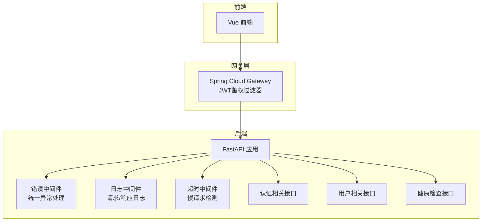
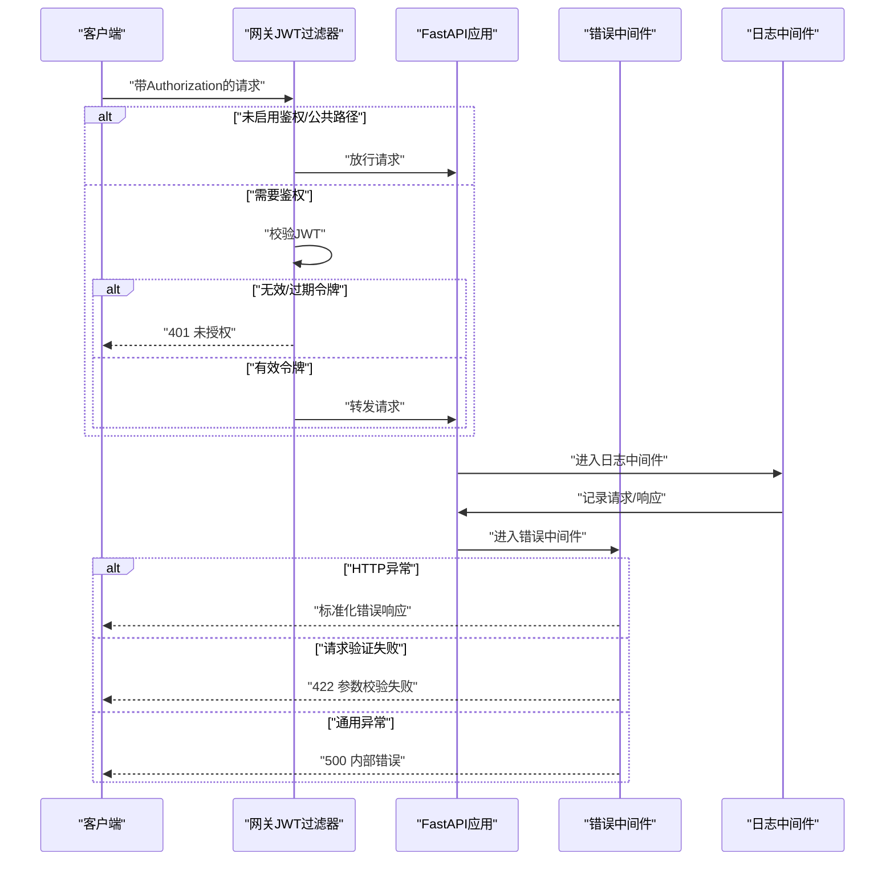
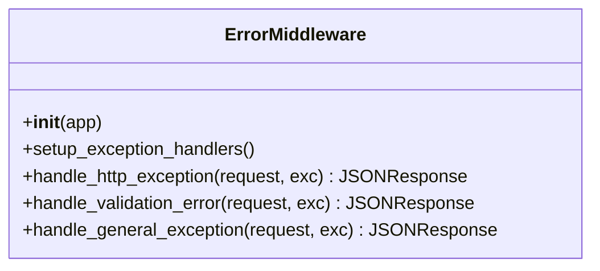
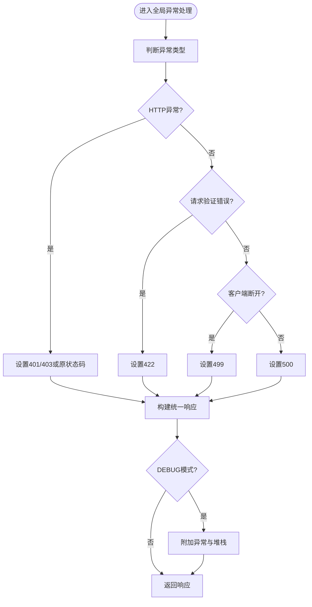
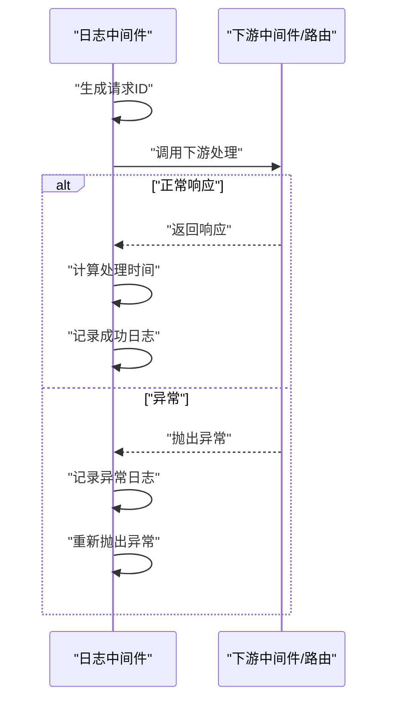
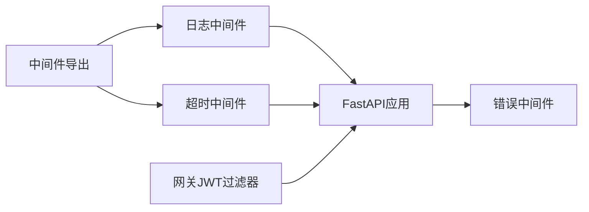

# API错误处理

<cite>
**本文引用的文件**
- [error_middleware.py](file://backend/app/middleware/error_middleware.py)
- [error_handler.py](file://backend/app/middleware/error_handler.py)
- [logging.py](file://backend/app/middleware/logging.py)
- [timeout.py](file://backend/app/middleware/timeout.py)
- [jwt_utils.py](file://backend/app/utils/jwt_utils.py)
- [JwtAuthGatewayFilter.java](file://java-backend/sjzm-gateway/src/main/java/com/sjzm/gateway/JwtAuthGatewayFilter.java)
- [spec.md（分布式鉴权需求）](file://openspec/changes/microservices-migration/specs/distributed-auth/spec.md)
- [spec.md（认证需求变更）](file://openspec/changes/microservices-migration/specs/auth/spec.md)
- [auth.py](file://backend/app/api/v1/auth.py)
- [users.py](file://backend/app/api/v1/users.py)
- [health.py](file://backend/app/api/v1/health.py)
- [__init__.py（中间件导出）](file://backend/app/middleware/__init__.py)
</cite>

## 目录
1. [简介](#简介)
2. [项目结构](#项目结构)
3. [核心组件](#核心组件)
4. [架构概览](#架构概览)
5. [详细组件分析](#详细组件分析)
6. [依赖关系分析](#依赖关系分析)
7. [性能考虑](#性能考虑)
8. [故障排查指南](#故障排查指南)
9. [结论](#结论)
10. [附录](#附录)

## 简介
本指南面向“思觉智贸系统”的API错误处理与故障排查，覆盖以下主题：
- HTTP错误状态码的含义与响应格式
- 错误响应统一结构与异常处理机制
- 参数校验失败、认证授权错误、业务逻辑异常、系统内部错误的诊断方法
- 错误日志分析技巧、堆栈跟踪与异常信息提取
- 客户端错误处理最佳实践、API版本兼容性问题与跨域请求问题的解决方案

## 项目结构
后端采用FastAPI框架，错误处理由中间件统一接管；网关层负责JWT认证与鉴权；前端通过Axios等HTTP客户端调用后端接口。

图表来源
- [error_middleware.py:1-170](file://backend/app/middleware/error_middleware.py#L1-L170)
- [logging.py:1-165](file://backend/app/middleware/logging.py#L1-L165)
- [timeout.py:200-239](file://backend/app/middleware/timeout.py#L200-L239)
- [JwtAuthGatewayFilter.java:1-72](file://java-backend/sjzm-gateway/src/main/java/com/sjzm/gateway/JwtAuthGatewayFilter.java#L1-L72)
- [auth.py](file://backend/app/api/v1/auth.py)
- [users.py](file://backend/app/api/v1/users.py)
- [health.py](file://backend/app/api/v1/health.py)

章节来源
- [error_middleware.py:1-170](file://backend/app/middleware/error_middleware.py#L1-L170)
- [logging.py:1-165](file://backend/app/middleware/logging.py#L1-L165)
- [timeout.py:200-239](file://backend/app/middleware/timeout.py#L200-L239)
- [JwtAuthGatewayFilter.java:1-72](file://java-backend/sjzm-gateway/src/main/java/com/sjzm/gateway/JwtAuthGatewayFilter.java#L1-L72)

## 核心组件
- 错误中间件：统一捕获HTTP异常、请求验证错误与通用异常，输出标准化JSON响应。
- 错误处理器：提供全局异常处理函数，按异常类型映射状态码与消息，并在调试模式下附加堆栈信息。
- 日志中间件：记录请求/响应、处理时间、请求ID，便于问题定位与审计。
- 超时中间件：检测慢请求并按阈值记录日志。
- 网关JWT过滤器：在网关层进行JWT验证与权限控制，保护下游服务。
- JWT工具：Python后端用于解析token（不验证签名），配合网关鉴权。

章节来源
- [error_middleware.py:1-170](file://backend/app/middleware/error_middleware.py#L1-L170)
- [error_handler.py:1-100](file://backend/app/middleware/error_handler.py#L1-L100)
- [logging.py:1-165](file://backend/app/middleware/logging.py#L1-L165)
- [timeout.py:200-239](file://backend/app/middleware/timeout.py#L200-L239)
- [jwt_utils.py:1-29](file://backend/app/utils/jwt_utils.py#L1-L29)
- [JwtAuthGatewayFilter.java:1-72](file://java-backend/sjzm-gateway/src/main/java/com/sjzm/gateway/JwtAuthGatewayFilter.java#L1-L72)

## 架构概览
错误处理在“网关层 → 后端中间件 → 接口实现”链路中逐级收敛，确保对外呈现一致的错误语义与结构。

图表来源
- [JwtAuthGatewayFilter.java:50-72](file://java-backend/sjzm-gateway/src/main/java/com/sjzm/gateway/JwtAuthGatewayFilter.java#L50-L72)
- [error_middleware.py:31-54](file://backend/app/middleware/error_middleware.py#L31-L54)
- [logging.py:40-124](file://backend/app/middleware/logging.py#L40-L124)

## 详细组件分析

### 错误中间件（统一异常处理）
- 职责：注册多种异常处理器，对HTTP异常、Starlette HTTP异常、请求验证错误、通用异常分别处理。
- 输出格式：统一JSON结构，包含状态码、消息、数据与错误详情对象。
- 特性：记录警告/错误日志，便于审计与排障。

图表来源
- [error_middleware.py:18-170](file://backend/app/middleware/error_middleware.py#L18-L170)

章节来源
- [error_middleware.py:31-54](file://backend/app/middleware/error_middleware.py#L31-L54)
- [error_middleware.py:55-87](file://backend/app/middleware/error_middleware.py#L55-L87)
- [error_middleware.py:88-127](file://backend/app/middleware/error_middleware.py#L88-L127)
- [error_middleware.py:129-159](file://backend/app/middleware/error_middleware.py#L129-L159)

### 错误处理器（全局异常处理）
- 职责：提供全局异常处理函数，根据异常类型映射状态码与消息。
- 调试增强：在DEBUG模式下返回异常类型、消息与堆栈跟踪。
- 兼容性：对特定HTTP状态码（如405）给出更友好的提示。

图表来源
- [error_handler.py:25-85](file://backend/app/middleware/error_handler.py#L25-L85)

章节来源
- [error_handler.py:25-85](file://backend/app/middleware/error_handler.py#L25-L85)

### 日志中间件（请求/响应日志）
- 职责：记录请求ID、方法、路径、状态码、处理时间；异常时记录堆栈。
- 响应头：注入X-Request-ID与X-Process-Time，便于跨服务追踪。
- 路径过滤：默认跳过健康检查与指标端点。

图表来源
- [logging.py:40-124](file://backend/app/middleware/logging.py#L40-L124)

章节来源
- [logging.py:40-124](file://backend/app/middleware/logging.py#L40-L124)

### 超时中间件（慢请求检测）
- 职责：统计处理时间，超过阈值时按配置的日志级别记录慢请求。
- 场景：定位性能瓶颈与潜在阻塞点。

章节来源
- [timeout.py:200-239](file://backend/app/middleware/timeout.py#L200-L239)

### 网关JWT过滤器（鉴权与权限）
- 职责：在网关层校验JWT，支持公共路径白名单、开发环境开关、权限服务集成。
- 返回：无效令牌直接返回401，无需转发至下游服务。

章节来源
- [JwtAuthGatewayFilter.java:29-72](file://java-backend/sjzm-gateway/src/main/java/com/sjzm/gateway/JwtAuthGatewayFilter.java#L29-L72)
- [spec.md（分布式鉴权需求）:1-35](file://openspec/changes/microservices-migration/specs/distributed-auth/spec.md#L1-L35)
- [spec.md（认证需求变更）:1-20](file://openspec/changes/microservices-migration/specs/auth/spec.md#L1-L20)

### JWT工具（Python后端）
- 职责：解析token（不验证签名），用于后端部分接口（如/me、/logout）。
- 安全性：仅用于解析，不参与签名验证。

章节来源
- [jwt_utils.py:19-29](file://backend/app/utils/jwt_utils.py#L19-L29)

## 依赖关系分析
- 中间件导出：中间件包导出日志、超时等中间件，供应用装配。
- 网关与后端：网关负责鉴权，后端负责业务与错误统一处理。
- 前端与后端：前端通过Axios等HTTP客户端发起请求，遵循后端统一错误响应格式。

图表来源
- [__init__.py（中间件导出）:1-10](file://backend/app/middleware/__init__.py#L1-L10)
- [logging.py:1-165](file://backend/app/middleware/logging.py#L1-L165)
- [timeout.py:200-239](file://backend/app/middleware/timeout.py#L200-L239)
- [JwtAuthGatewayFilter.java:1-72](file://java-backend/sjzm-gateway/src/main/java/com/sjzm/gateway/JwtAuthGatewayFilter.java#L1-L72)
- [error_middleware.py:1-170](file://backend/app/middleware/error_middleware.py#L1-L170)

章节来源
- [__init__.py（中间件导出）:1-10](file://backend/app/middleware/__init__.py#L1-L10)

## 性能考虑
- 慢请求检测：通过超时中间件识别长尾请求，结合日志中间件的处理时间统计进行分析。
- 日志成本：请求体/响应体日志仅在调试环境启用，避免生产环境性能损耗。
- 网关前置：在网关层拦截无效请求，减少下游压力。

## 故障排查指南

### 一、HTTP错误状态码与响应格式
- 400 Bad Request：请求参数格式错误或缺失，后端通常以422返回详细校验错误。
- 401 Unauthorized：未提供有效JWT或令牌无效/过期，网关直接拒绝。
- 403 Forbidden：令牌有效但无访问权限，需检查角色与资源权限。
- 404 Not Found：资源不存在或路径错误。
- 405 Method Not Allowed：请求方法不被允许，检查URL与方法。
- 422 Unprocessable Entity：参数校验失败，响应包含具体字段错误列表。
- 499 Client Closed Request：客户端主动中断连接。
- 500 Internal Server Error：服务器内部错误，响应包含通用错误描述。

章节来源
- [error_middleware.py:55-87](file://backend/app/middleware/error_middleware.py#L55-L87)
- [error_middleware.py:88-127](file://backend/app/middleware/error_middleware.py#L88-L127)
- [error_middleware.py:129-159](file://backend/app/middleware/error_middleware.py#L129-L159)
- [error_handler.py:43-64](file://backend/app/middleware/error_handler.py#L43-L64)
- [JwtAuthGatewayFilter.java:58-61](file://java-backend/sjzm-gateway/src/main/java/com/sjzm/gateway/JwtAuthGatewayFilter.java#L58-L61)

### 二、错误响应格式
统一响应结构包含：
- code：HTTP状态码
- message：人类可读的错误信息
- data：始终为null（错误场景）
- error：错误详情对象（含type、status_code、detail、errors等）
- timestamp：可选（在某些处理器中）

章节来源
- [error_middleware.py:69-78](file://backend/app/middleware/error_middleware.py#L69-L78)
- [error_middleware.py:109-119](file://backend/app/middleware/error_middleware.py#L109-L119)
- [error_middleware.py:141-150](file://backend/app/middleware/error_middleware.py#L141-L150)
- [error_handler.py:66-71](file://backend/app/middleware/error_handler.py#L66-L71)

### 三、常见错误场景与诊断

#### 1. 请求参数验证失败（422）
- 现象：响应code为422，error.errors包含字段级错误列表。
- 诊断要点：核对请求体schema、必填字段、类型与范围约束。
- 处置建议：前端根据errors逐项修正输入。

章节来源
- [error_middleware.py:88-127](file://backend/app/middleware/error_middleware.py#L88-L127)

#### 2. 认证授权错误
- 401未授权：网关未收到有效Bearer令牌或令牌无效/过期。
- 403禁止访问：令牌有效但角色/权限不足。
- 诊断要点：检查Authorization头格式、令牌有效期、角色声明；确认网关白名单与权限策略。

章节来源
- [JwtAuthGatewayFilter.java:58-72](file://java-backend/sjzm-gateway/src/main/java/com/sjzm/gateway/JwtAuthGatewayFilter.java#L58-L72)
- [spec.md（分布式鉴权需求）:10-28](file://openspec/changes/microservices-migration/specs/distributed-auth/spec.md#L10-L28)
- [spec.md（认证需求变更）:6-12](file://openspec/changes/microservices-migration/specs/auth/spec.md#L6-L12)

#### 3. 业务逻辑异常
- 现象：接口抛出业务异常，被错误中间件捕获并返回500。
- 诊断要点：查看日志中的堆栈信息与请求ID，定位具体业务逻辑。

章节来源
- [error_middleware.py:129-159](file://backend/app/middleware/error_middleware.py#L129-L159)
- [logging.py:108-123](file://backend/app/middleware/logging.py#L108-L123)

#### 4. 系统内部错误（500）
- 现象：服务器内部错误，响应包含通用错误描述。
- 诊断要点：检查DEBUG模式下的堆栈信息，关注异常类型与上下文。

章节来源
- [error_handler.py:61-64](file://backend/app/middleware/error_handler.py#L61-L64)
- [error_handler.py:154-155](file://backend/app/middleware/error_handler.py#L154-L155)

### 四、错误日志分析技巧
- 关联请求ID：从响应头X-Request-ID或日志中提取，串联请求/响应与异常。
- 处理时间：利用X-Process-Time或日志中的处理时间，识别慢请求。
- 堆栈跟踪：在DEBUG模式下，错误响应包含stack_trace；同时日志中间件记录异常堆栈。
- 路径过滤：健康检查与指标端点默认不记录请求体，避免噪音。

章节来源
- [logging.py:94-123](file://backend/app/middleware/logging.py#L94-L123)
- [error_handler.py:36-40](file://backend/app/middleware/error_handler.py#L36-L40)

### 五、异常信息提取方法
- 响应体：解析统一响应的error对象，提取type、status_code、detail与errors。
- 日志：结合请求ID与时间戳，定位具体异常发生位置。
- 调试信息：DEBUG模式下，错误响应包含异常类型、消息与堆栈。

章节来源
- [error_middleware.py:113-118](file://backend/app/middleware/error_middleware.py#L113-L118)
- [error_handler.py:76-80](file://backend/app/middleware/error_handler.py#L76-L80)

### 六、客户端错误处理最佳实践
- 重试策略：对幂等GET请求可适度重试，POST等非幂等需谨慎。
- 退避算法：指数退避+抖动，避免雪崩效应。
- 降级与熔断：对下游不稳定接口实施快速失败与降级。
- 用户提示：展示友好错误文案，避免泄露内部细节。
- 参数校验：前端先行校验，减少无效请求。

### 七、API版本兼容性问题
- 版本策略：后端通过URL前缀区分版本（如/v1），保持向后兼容或明确迁移路径。
- 迁移策略：逐步淘汰旧版本，提供迁移指引与过渡期。

### 八、跨域请求问题
- CORS配置：确保网关或后端正确配置CORS头（Origin、Access-Control-Allow-*）。
- 预检请求：OPTIONS预检需放行，避免405错误。
- 安全性：仅允许必要域名，避免通配符导致安全风险。

## 结论
通过网关层鉴权与后端中间件统一错误处理，系统实现了清晰、一致且可追踪的错误处理机制。结合日志中间件与超时中间件，能够高效定位问题并优化性能。建议在生产环境中严格区分调试与生产日志级别，完善客户端错误处理策略，并持续优化API版本演进与跨域配置。

## 附录

### A. 常见问题速查
- 401/403频繁出现：检查令牌颁发与网关鉴权配置，确认角色与权限。
- 422过多：前端完善表单校验，后端补充字段级错误提示。
- 500偶发：关注慢请求与异常堆栈，排查资源竞争与外部依赖。
- 405：核对URL末尾斜杠与请求方法。

### B. 相关接口与文件索引
- 认证接口：/api/v1/auth/*
- 用户接口：/api/v1/users/*
- 健康检查：/api/v1/health

章节来源
- [auth.py](file://backend/app/api/v1/auth.py)
- [users.py](file://backend/app/api/v1/users.py)
- [health.py](file://backend/app/api/v1/health.py)