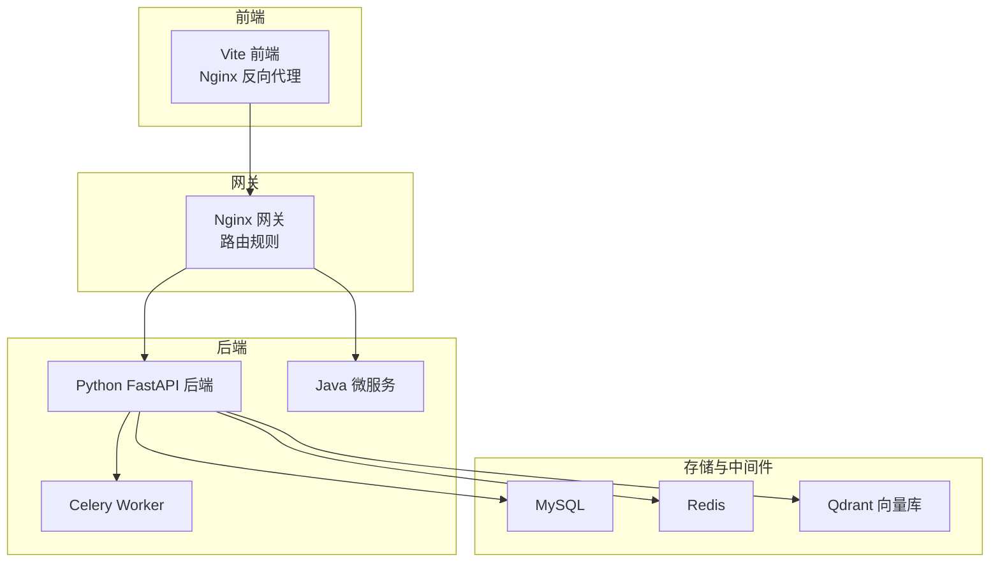
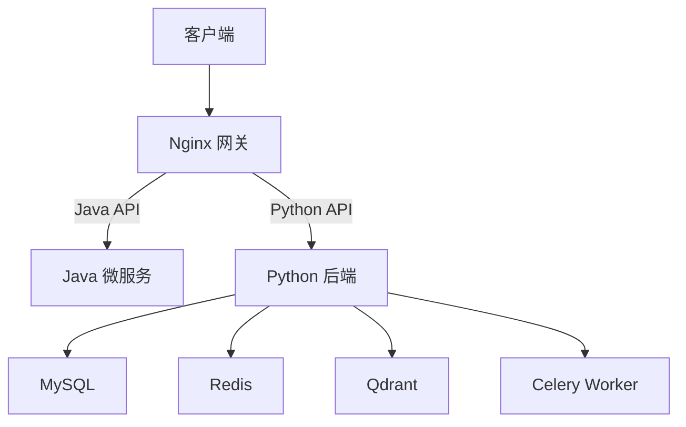
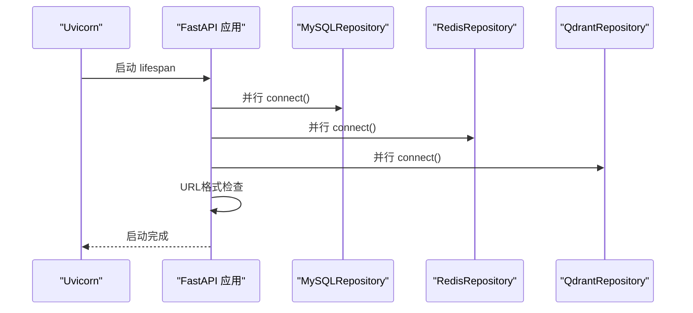
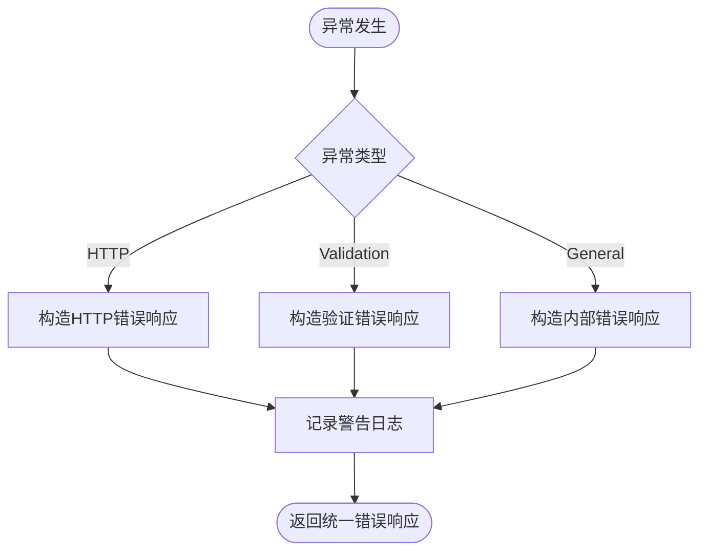
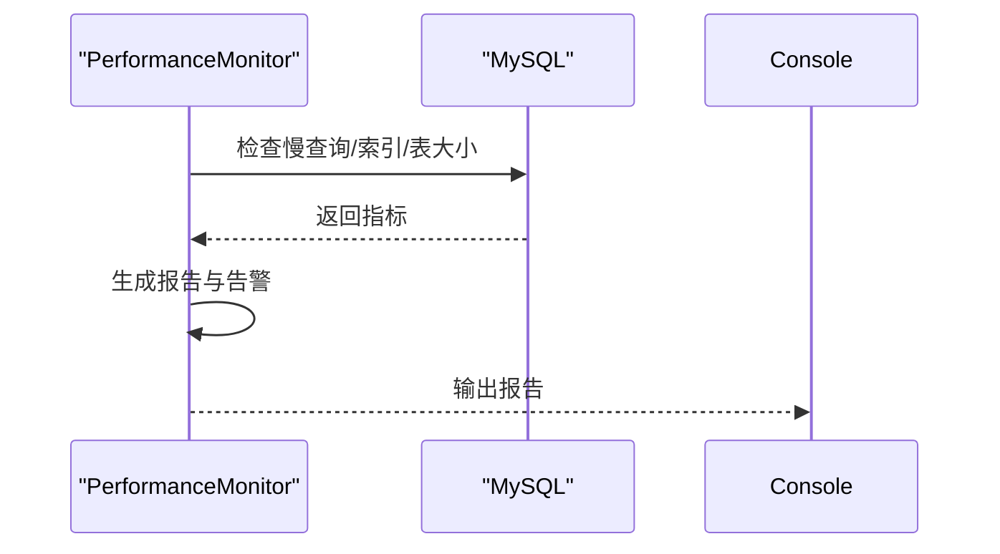
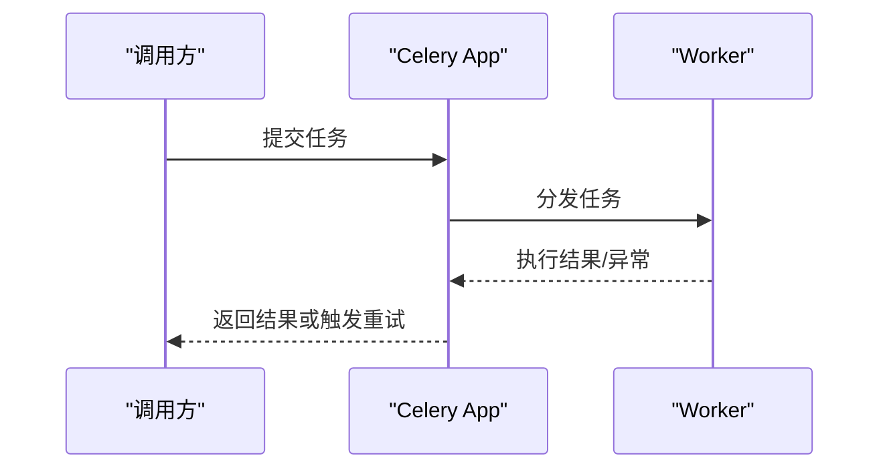
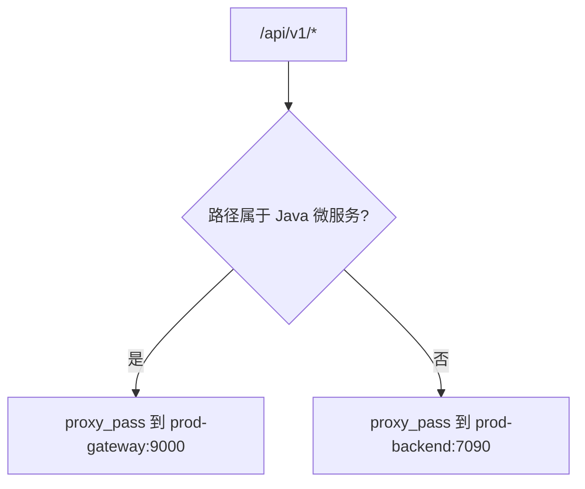
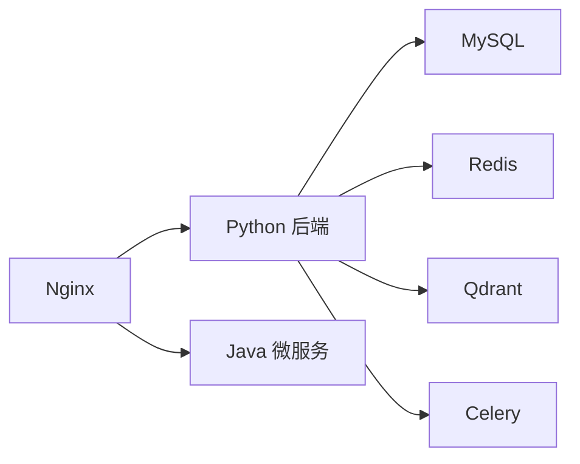

# 故障排查指南

<cite>
**本文引用的文件**
- [backend/app/main.py](file://backend/app/main.py)
- [backend/app/config.py](file://backend/app/config.py)
- [backend/app/middleware/error_middleware.py](file://backend/app/middleware/error_middleware.py)
- [backend/app/services/monitoring_service.py](file://backend/app/services/monitoring_service.py)
- [backend/app/tasks/celery_app.py](file://backend/app/tasks/celery_app.py)
- [backend/start_celery.py](file://backend/start_celery.py)
- [backend/app/repositories/redis_repo.py](file://backend/app/repositories/redis_repo.py)
- [scripts/monitoring/performance_monitor.py](file://scripts/monitoring/performance_monitor.py)
- [scripts/deployment/monitor_deployment.py](file://scripts/deployment/monitor_deployment.py)
- [scripts/deployment/canary_deployment.py](file://scripts/deployment/canary_deployment.py)
- [scripts/startup/start_prod_multiprocess.py](file://scripts/startup/start_prod_multiprocess.py)
- [scripts/environment/setup_dev_environment.py](file://scripts/environment/setup_dev_environment.py)
- [backend/app/api/v1/system_config.py](file://backend/app/api/v1/system_config.py)
- [backend/app/services/backup_service.py](file://backend/app/services/backup_service.py)
- [frontend/nginx.conf](file://frontend/nginx.conf)
- [frontend/nginx.prod.conf](file://frontend/nginx.prod.conf)
- [docs/docker使用经验/README.md](file://docs/docker使用经验/README.md)
- [docs/docker使用经验/docker命令经验.md](file://docs/docker使用经验/docker命令经验.md)
- [DOCKER_DEPLOY.md](file://DOCKER_DEPLOY.md)
- [docs/问题记录/nginx路由规则问题记录.md](file://docs/问题记录/nginx路由规则问题记录.md)
</cite>

## 目录
1. [简介](#简介)
2. [项目结构](#项目结构)
3. [核心组件](#核心组件)
4. [架构总览](#架构总览)
5. [详细组件分析](#详细组件分析)
6. [依赖关系分析](#依赖关系分析)
7. [性能考虑](#性能考虑)
8. [故障排查指南](#故障排查指南)
9. [结论](#结论)
10. [附录](#附录)

## 简介
本指南面向技术支持与运维工程师，聚焦“思觉智贸系统”的故障排查与应急处置。内容涵盖环境配置问题、服务启动失败、数据库连接异常、Nginx路由错误、缓存与异步任务异常、监控与告警、性能调优、紧急预案与回滚策略、数据恢复流程，并提供开发与生产环境差异化排查方法。

## 项目结构
系统采用多语言混合架构：Python FastAPI 后端负责核心业务 API；Java Spring Boot 微服务负责部分业务域；Nginx 作为反向代理网关；Redis、MySQL、Qdrant 作为基础设施；Celery 负责异步任务；Docker Compose 管理容器编排。

图表来源
- [frontend/nginx.conf:1-46](file://frontend/nginx.conf#L1-L46)
- [frontend/nginx.prod.conf:1-35](file://frontend/nginx.prod.conf#L1-L35)
- [backend/app/main.py:314-475](file://backend/app/main.py#L314-L475)
- [backend/app/tasks/celery_app.py:1-54](file://backend/app/tasks/celery_app.py#L1-L54)

章节来源
- [backend/app/main.py:314-475](file://backend/app/main.py#L314-L475)
- [frontend/nginx.conf:1-46](file://frontend/nginx.conf#L1-L46)
- [frontend/nginx.prod.conf:1-35](file://frontend/nginx.prod.conf#L1-L35)

## 核心组件
- 应用入口与生命周期：负责启动阶段并行初始化数据库、缓存、向量库，执行轻量级健康检查与清理任务。
- 配置中心：集中管理环境变量、连接池、缓存、COS、日志、安全与性能参数。
- 错误处理中间件：统一异常捕获与响应格式，便于定位问题。
- 监控与告警：内置告警服务与性能监控脚本，支持慢查询与资源使用分析。
- 异步任务：Celery 任务队列，支持重试、限流与队列路由。
- Nginx 网关：按路径将请求分发至 Python 后端或 Java 网关。

章节来源
- [backend/app/main.py:44-312](file://backend/app/main.py#L44-L312)
- [backend/app/config.py:23-258](file://backend/app/config.py#L23-L258)
- [backend/app/middleware/error_middleware.py:18-171](file://backend/app/middleware/error_middleware.py#L18-L171)
- [backend/app/services/monitoring_service.py:23-228](file://backend/app/services/monitoring_service.py#L23-L228)
- [backend/app/tasks/celery_app.py:1-54](file://backend/app/tasks/celery_app.py#L1-L54)

## 架构总览
系统采用“Python 后端 + Java 微服务 + Nginx 网关”的混合架构。Nginx 根据路径将 API 分发到不同后端；Python 后端负责业务 API 与异步任务；Java 微服务负责特定领域；Redis/MySQL/Qdrant 提供缓存、持久化与向量检索能力。

图表来源
- [frontend/nginx.prod.conf:18-35](file://frontend/nginx.prod.conf#L18-L35)
- [backend/app/main.py:314-475](file://backend/app/main.py#L314-L475)
- [backend/app/tasks/celery_app.py:1-54](file://backend/app/tasks/celery_app.py#L1-L54)

## 详细组件分析

### 应用启动与健康检查
- 启动阶段并行初始化 MySQL、Redis、Qdrant，记录耗时与结果。
- 轻量级 URL 格式检查，发现异常时输出修复建议。
- 生命周期结束时并行清理资源，确保优雅关停。

图表来源
- [backend/app/main.py:44-262](file://backend/app/main.py#L44-L262)

章节来源
- [backend/app/main.py:44-262](file://backend/app/main.py#L44-L262)

### 错误处理与统一响应
- 捕获 HTTP 异常、请求验证错误与通用异常，统一返回结构，便于前端与监控系统消费。
- 记录详细日志与堆栈，支持根因分析。

图表来源
- [backend/app/middleware/error_middleware.py:55-159](file://backend/app/middleware/error_middleware.py#L55-L159)

章节来源
- [backend/app/middleware/error_middleware.py:18-171](file://backend/app/middleware/error_middleware.py#L18-L171)

### 监控与告警
- 监控服务支持冷却机制、控制台与日志告警输出，可用于 URL 格式等异常的告警。
- 性能监控脚本可扫描慢查询、索引使用与表大小，生成报告并输出告警。

图表来源
- [scripts/monitoring/performance_monitor.py:200-228](file://scripts/monitoring/performance_monitor.py#L200-L228)

章节来源
- [backend/app/services/monitoring_service.py:23-228](file://backend/app/services/monitoring_service.py#L23-L228)
- [scripts/monitoring/performance_monitor.py:117-236](file://scripts/monitoring/performance_monitor.py#L117-L236)

### 异步任务与重试
- Celery 配置包含序列化、结果过期、重试延迟与并发控制。
- 任务失败时自动重试，达到上限后返回失败结果。

图表来源
- [backend/app/tasks/celery_app.py:17-52](file://backend/app/tasks/celery_app.py#L17-L52)
- [backend/start_celery.py:21-54](file://backend/start_celery.py#L21-L54)

章节来源
- [backend/app/tasks/celery_app.py:1-54](file://backend/app/tasks/celery_app.py#L1-L54)
- [backend/start_celery.py:1-54](file://backend/start_celery.py#L1-L54)

### Nginx 路由与网关
- 生产环境 Nginx 将 Java 微服务路径定向到网关，其余 Python API 走后端直连。
- 曾出现将 Python 接口误加入网关正则导致 500/401 的问题，需核对路由分类。

图表来源
- [frontend/nginx.prod.conf:18-35](file://frontend/nginx.prod.conf#L18-L35)
- [docs/问题记录/nginx路由规则问题记录.md:18-44](file://docs/问题记录/nginx路由规则问题记录.md#L18-L44)

章节来源
- [frontend/nginx.prod.conf:1-35](file://frontend/nginx.prod.conf#L1-L35)
- [docs/问题记录/nginx路由规则问题记录.md:1-79](file://docs/问题记录/nginx路由规则问题记录.md#L1-L79)

## 依赖关系分析
- Python 后端依赖 MySQL、Redis、Qdrant 与 Celery；Nginx 作为网关进行路由。
- Java 微服务通过网关暴露 API；前端通过 Nginx 访问后端。
- 部署层面使用 Docker Compose，区分开发与生产环境。

图表来源
- [backend/app/main.py:314-475](file://backend/app/main.py#L314-L475)
- [frontend/nginx.conf:17-27](file://frontend/nginx.conf#L17-L27)

章节来源
- [backend/app/main.py:314-475](file://backend/app/main.py#L314-L475)
- [frontend/nginx.conf:1-46](file://frontend/nginx.conf#L1-L46)

## 性能考虑
- 数据库优化
  - 使用性能监控脚本定期扫描慢查询与索引使用情况，生成报告并输出告警。
  - 建议根据报告增加必要索引、优化慢查询语句。
- 缓存策略
  - 后端配置了多级缓存 TTL 与键前缀；Redis 提供短期与长期缓存管理。
  - 前端具备缓存监控与优化建议，可清理过期与低频缓存。
- API 响应时间
  - 启动中间件配置了请求超时与慢请求阈值；针对大文件下载与批量接口设置了更高超时。
  - Nginx 对上游读取超时进行了合理配置。

章节来源
- [scripts/monitoring/performance_monitor.py:117-236](file://scripts/monitoring/performance_monitor.py#L117-L236)
- [backend/app/config.py:158-202](file://backend/app/config.py#L158-L202)
- [backend/app/main.py:337-371](file://backend/app/main.py#L337-L371)
- [frontend/nginx.conf:24-26](file://frontend/nginx.conf#L24-L26)

## 故障排查指南

### 一、环境配置问题
- 环境变量缺失或不一致
  - 确认 .env 文件与 Docker 环境变量注入一致；开发与生产环境隔离。
  - 使用启动脚本检查环境状态与数据库路径设置。
- 端口冲突与网络不通
  - 使用 Docker 命令查看容器状态与端口映射，确认网络命名空间与卷挂载正确。
- 配置差异
  - 对照部署文档，核对开发/生产端口、数据库名、Redis DB、Qdrant 集合等差异。

章节来源
- [docs/docker使用经验/README.md:22-46](file://docs/docker使用经验/README.md#L22-L46)
- [docs/docker使用经验/docker命令经验.md:196-238](file://docs/docker使用经验/docker命令经验.md#L196-L238)
- [DOCKER_DEPLOY.md:20-32](file://DOCKER_DEPLOY.md#L20-L32)
- [scripts/startup/start_prod_multiprocess.py:1943-1976](file://scripts/startup/start_prod_multiprocess.py#L1943-L1976)

### 二、服务启动失败
- 启动阶段并行初始化失败
  - 检查 MySQL/Redis/Qdrant 连接日志；若某组件失败，应用会降级使用（缓存/向量功能不可用）。
- 目录创建与权限
  - 确认上传、缩略图、模型缓存与日志目录存在且可写。
- 热重载与 Workers
  - 开发环境开启热重载与多进程；生产环境关闭热重载并设置合适 workers 数量。

章节来源
- [backend/app/main.py:63-116](file://backend/app/main.py#L63-L116)
- [backend/app/main.py:213-223](file://backend/app/main.py#L213-L223)
- [backend/app/config.py:227-239](file://backend/app/config.py#L227-L239)

### 三、数据库连接异常
- 连接池参数
  - 核对主机、端口、用户名、密码、池大小、回收时间与超时。
- 连接失败降级
  - 若 MySQL 连接失败，应用仍可运行但数据库功能不可用；检查日志定位原因。
- URL 格式问题
  - 启动时执行轻量级 URL 格式检查，发现异常给出修复建议。

章节来源
- [backend/app/config.py:48-61](file://backend/app/config.py#L48-L61)
- [backend/app/main.py:63-82](file://backend/app/main.py#L63-L82)
- [backend/app/main.py:118-158](file://backend/app/main.py#L118-L158)

### 四、Nginx 路由错误
- 症状
  - Python 接口被错误路由到 Java 网关，导致 500 或 401。
- 处理
  - 从网关正则中移除 Python 接口路径，使其走后端直连。
  - 修改后热重载 Nginx 配置。

章节来源
- [docs/问题记录/nginx路由规则问题记录.md:18-44](file://docs/问题记录/nginx路由规则问题记录.md#L18-L44)
- [frontend/nginx.prod.conf:18-42](file://frontend/nginx.prod.conf#L18-L42)

### 五、缓存与 Redis 异常
- 缓存不可用
  - Redis 连接失败时，应用会降级不使用缓存功能；检查 Redis 连接参数与网络。
- 缓存清理与过期
  - 后端会清理过期缩略图；前端具备缓存监控与优化建议。
- 键空间与 TTL
  - 检查键前缀与 TTL 设置，避免缓存雪崩与击穿。

章节来源
- [backend/app/main.py:84-99](file://backend/app/main.py#L84-L99)
- [backend/app/repositories/redis_repo.py:482-526](file://backend/app/repositories/redis_repo.py#L482-L526)
- [backend/app/config.py:158-167](file://backend/app/config.py#L158-L167)
- [frontend/src/utils/cacheManager.ts:234-284](file://frontend/src/utils/cacheManager.ts#L234-L284)

### 六、异步任务与 Celery 异常
- 启动与配置
  - 确认 Broker/Backend 地址、并发数、结果过期与重试策略。
- 任务失败重试
  - 达到最大重试次数后返回失败结果；检查任务日志与上游依赖。
- 队列与限流
  - 任务路由到指定队列，避免热点队列阻塞。

章节来源
- [backend/app/tasks/celery_app.py:17-52](file://backend/app/tasks/celery_app.py#L17-L52)
- [backend/start_celery.py:21-54](file://backend/start_celery.py#L21-L54)
- [backend/app/tasks/image_tasks.py:116-128](file://backend/app/tasks/image_tasks.py#L116-L128)

### 七、日志分析与错误解读
- 日志级别与输出
  - 开发环境使用 DEBUG，生产环境使用 INFO；日志同时输出到控制台与文件。
- 错误响应格式
  - 统一包含 code、message、data、error.type/status_code/detail/errors 等字段，便于前端与监控系统解析。
- 告警通道
  - 控制台与日志告警；可扩展邮件/企业微信等通道。

章节来源
- [backend/app/config.py:169-174](file://backend/app/config.py#L169-L174)
- [backend/app/middleware/error_middleware.py:69-86](file://backend/app/middleware/error_middleware.py#L69-L86)
- [backend/app/services/monitoring_service.py:126-176](file://backend/app/services/monitoring_service.py#L126-L176)

### 八、监控指标与告警处理
- 指标采集
  - 部署脚本可从 Prometheus 获取错误率、响应时间、QPS、延迟分位等指标。
- 健康检查
  - 检查 Kubernetes Endpoints 与 Pod 资源使用，判断服务可用性。
- 告警处理
  - 告警冷却机制避免重复告警；记录历史并输出控制台摘要。

章节来源
- [scripts/deployment/monitor_deployment.py:177-262](file://scripts/deployment/monitor_deployment.py#L177-L262)
- [backend/app/services/monitoring_service.py:36-93](file://backend/app/services/monitoring_service.py#L36-L93)

### 九、性能调优指南
- 数据库
  - 使用性能监控脚本定期扫描慢查询与索引使用，生成报告并输出告警。
- 缓存
  - 合理设置 TTL 与键前缀；前端定期清理过期与低频缓存。
- API
  - 针对大文件与批量接口设置更高超时；优化上游 Nginx 超时配置。

章节来源
- [scripts/monitoring/performance_monitor.py:117-236](file://scripts/monitoring/performance_monitor.py#L117-L236)
- [backend/app/config.py:158-202](file://backend/app/config.py#L158-L202)
- [frontend/nginx.conf:24-26](file://frontend/nginx.conf#L24-L26)

### 十、紧急故障处理预案
- 快速止损
  - 临时关闭速率限制、放宽超时、暂停高负载任务。
- 降级策略
  - Redis/Qdrant 不可用时，关闭缓存与向量功能；MySQL 不可用时，禁用相关接口。
- 回滚策略
  - 使用蓝绿/金丝雀发布；监控错误率与响应时间，异常时立即回滚。
- 数据恢复
  - 本地备份与 COS 备份双轨；通过系统配置接口下载本地备份文件或获取 COS 下载 URL。

章节来源
- [backend/app/config.py:196-202](file://backend/app/config.py#L196-L202)
- [scripts/deployment/canary_deployment.py:163-198](file://scripts/deployment/canary_deployment.py#L163-L198)
- [backend/app/api/v1/system_config.py:480-517](file://backend/app/api/v1/system_config.py#L480-L517)
- [backend/app/services/backup_service.py:466-517](file://backend/app/services/backup_service.py#L466-L517)

### 十一、开发与生产环境差异化排查
- 端口与数据库
  - 开发使用 sijuelishi_dev，生产使用 sijuelishi；核对端口与 Redis DB 差异。
- 热重载与速率限制
  - 开发开启热重载与较低速率限制；生产开启速率限制与严格 CORS。
- 配置注入
  - 生产环境敏感信息通过环境变量注入，避免硬编码。

章节来源
- [DOCKER_DEPLOY.md:20-32](file://DOCKER_DEPLOY.md#L20-L32)
- [docs/docker使用经验/README.md:22-46](file://docs/docker使用经验/README.md#L22-L46)
- [backend/app/config.py:227-239](file://backend/app/config.py#L227-L239)

## 结论
本指南提供了从环境配置、服务启动、数据库连接、Nginx 路由、缓存与异步任务到监控告警与性能调优的完整排查路径。建议在生产环境中严格执行配置隔离、发布监控与回滚策略，并建立标准化的故障响应流程，以降低故障影响面与恢复时间。

## 附录
- 常用命令
  - 查看容器状态与日志、热重载 Nginx、强制重建容器等。
- 配置核对清单
  - 环境变量、端口、数据库名、Redis DB、Qdrant 集合、COS 配置、日志级别与保留策略。

章节来源
- [docs/docker使用经验/docker命令经验.md:196-238](file://docs/docker使用经验/docker命令经验.md#L196-L238)
- [DOCKER_DEPLOY.md:20-32](file://DOCKER_DEPLOY.md#L20-L32)