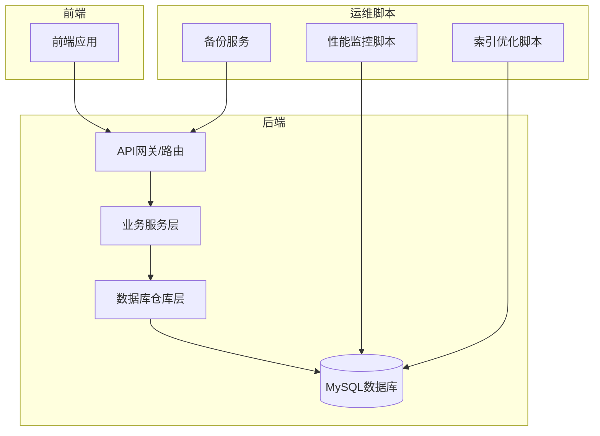
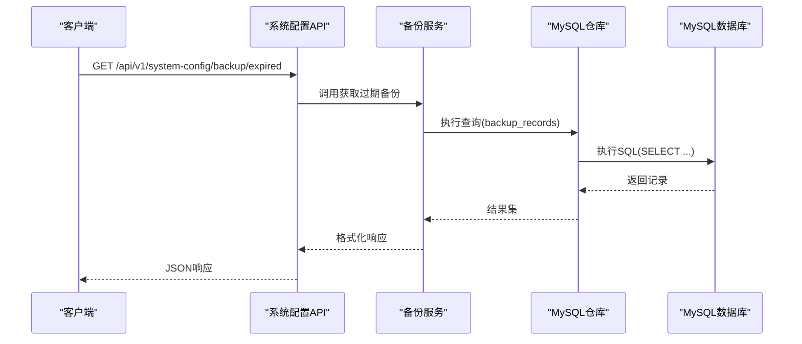
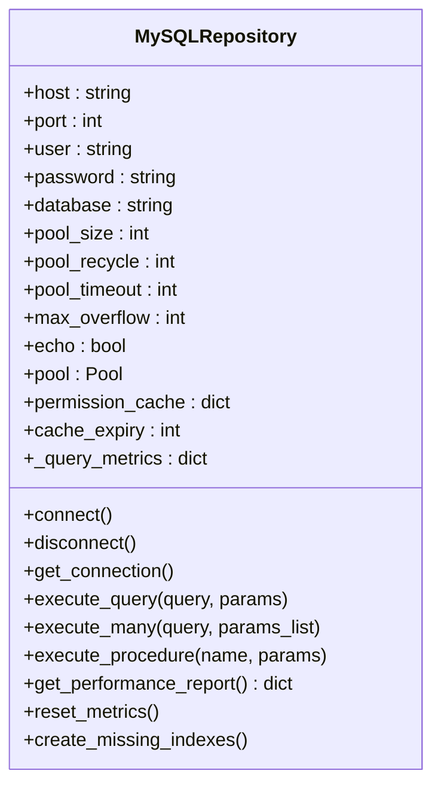
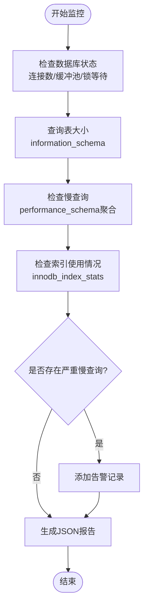
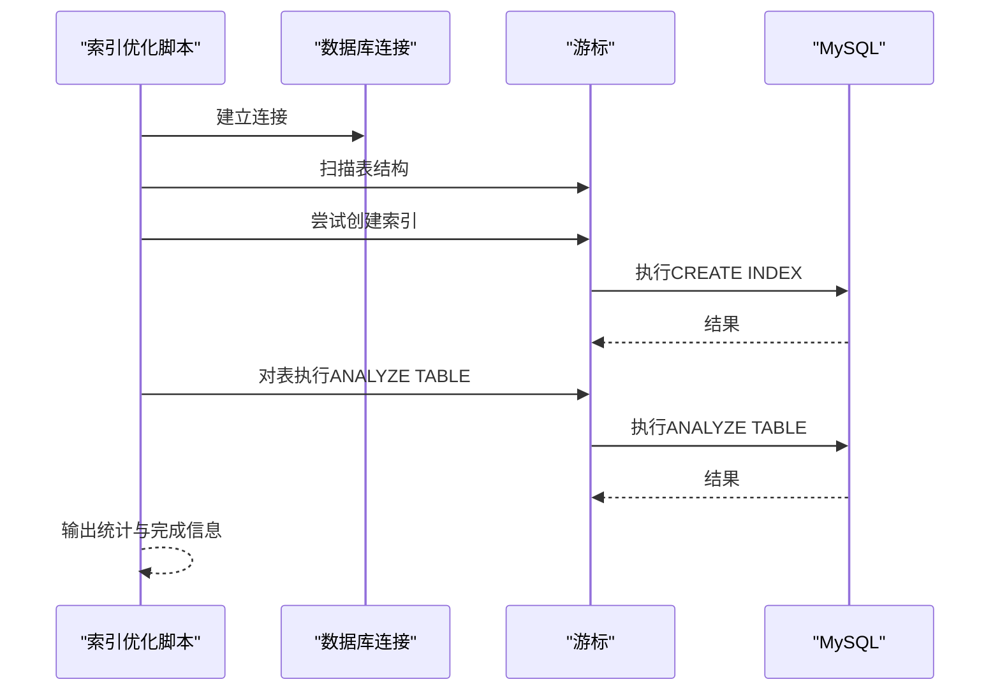
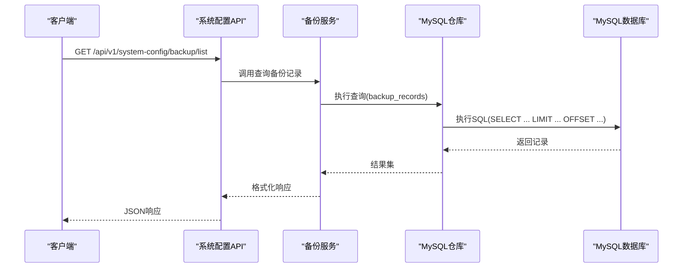
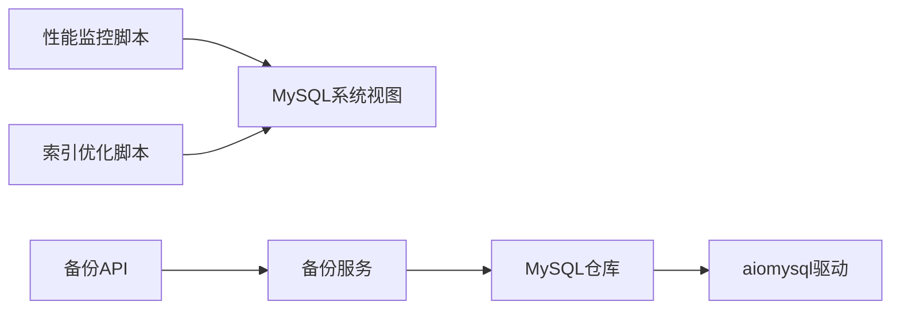

# 数据库性能问题排查指南

<cite>
**本文档引用的文件**
- [mysql_repo.py](file://backend/app/repositories/mysql_repo.py)
- [performance_monitor.py](file://scripts/monitoring/performance_monitor.py)
- [add_performance_indexes.py](file://scripts/database/add_performance_indexes.py)
- [backup_service.py](file://backend/app/services/backup_service.py)
- [system_config.py](file://backend/app/api/v1/system_config.py)
- [001_create_backup_records_table.sql](file://backend/migrations/001_create_backup_records_table.sql)
- [add_images_index.sql](file://backend/migrations/add_images_index.sql)
- [add_role_indexes.sql](file://backend/migrations/add_role_indexes.sql)
- [init_database.sql](file://backend/migrations/init_database.sql)
</cite>

## 目录
1. [简介](#简介)
2. [项目结构](#项目结构)
3. [核心组件](#核心组件)
4. [架构概览](#架构概览)
5. [详细组件分析](#详细组件分析)
6. [依赖关系分析](#依赖关系分析)
7. [性能考量](#性能考量)
8. [故障排除指南](#故障排除指南)
9. [结论](#结论)
10. [附录](#附录)

## 简介
本指南面向思觉智贸系统的数据库性能问题排查，聚焦慢查询分析、索引优化策略、连接池配置与数据库锁等待诊断。文档基于实际代码实现，提供MySQL性能监控指标解读、查询执行计划分析方法、表结构优化建议以及数据迁移性能问题处理方案，并涵盖连接池调优、事务隔离级别选择、批量操作优化、备份恢复流程、数据一致性检查与容量规划建议。

## 项目结构
系统采用前后端分离架构，数据库访问通过异步连接池实现，监控脚本与索引优化脚本位于Python脚本目录，备份服务集成在后端API中。

**图表来源**
- [mysql_repo.py:81-300](file://backend/app/repositories/mysql_repo.py#L81-L300)
- [performance_monitor.py:200-236](file://scripts/monitoring/performance_monitor.py#L200-L236)
- [add_performance_indexes.py:147-157](file://scripts/database/add_performance_indexes.py#L147-L157)

**章节来源**
- [mysql_repo.py:81-300](file://backend/app/repositories/mysql_repo.py#L81-L300)
- [performance_monitor.py:1-236](file://scripts/monitoring/performance_monitor.py#L1-L236)

## 核心组件
- 异步MySQL连接池：封装连接参数、生命周期管理、性能指标统计与事务隔离级别设置。
- 性能监控脚本：定期采集数据库状态、表大小、慢查询与索引使用情况，生成JSON报告并触发告警。
- 索引优化脚本：自动检测缺失索引并创建，随后对目标表执行统计信息分析。
- 备份服务：提供备份记录查询、下载URL生成、过期备份清理等能力。

**章节来源**
- [mysql_repo.py:51-386](file://backend/app/repositories/mysql_repo.py#L51-L386)
- [performance_monitor.py:38-236](file://scripts/monitoring/performance_monitor.py#L38-L236)
- [add_performance_indexes.py:110-157](file://scripts/database/add_performance_indexes.py#L110-L157)
- [backup_service.py:325-577](file://backend/app/services/backup_service.py#L325-L577)

## 架构概览
系统通过异步连接池统一管理数据库连接，业务服务通过仓库层执行SQL，监控脚本与运维脚本独立运行，备份服务通过API暴露给前端管理界面。

**图表来源**
- [system_config.py:543-577](file://backend/app/api/v1/system_config.py#L543-L577)
- [backup_service.py:518-577](file://backend/app/services/backup_service.py#L518-L577)
- [mysql_repo.py:385-450](file://backend/app/repositories/mysql_repo.py#L385-L450)

## 详细组件分析

### 异步MySQL连接池组件
该组件负责：
- 连接池参数配置：池大小、回收时间、超时、溢出连接数、SQL回显开关。
- 生命周期管理：连接池创建、获取连接、释放连接、关闭。
- 性能指标统计：总查询数、慢查询数、中等查询数、总耗时、按查询类型统计。
- 事务隔离级别：默认设置为READ COMMITTED，确保读取最新提交数据。
- 索引创建辅助：扫描表结构并尝试创建缺失索引（失败不影响启动）。

**图表来源**
- [mysql_repo.py:51-386](file://backend/app/repositories/mysql_repo.py#L51-L386)

**章节来源**
- [mysql_repo.py:51-386](file://backend/app/repositories/mysql_repo.py#L51-L386)

### 性能监控组件
该组件负责：
- 数据库状态检查：连接数、缓冲池、锁等待、慢查询阈值。
- 表大小与行数统计：基于information_schema筛选特定表前缀。
- 慢查询识别：通过performance_schema聚合最近慢查询，记录平均/最大延迟。
- 索引使用情况检查：读取innodb_index_stats统计信息。
- 告警机制：对严重慢查询（平均延迟>5s）发出告警。
- 报告生成：将监控结果保存为JSON文件。

**图表来源**
- [performance_monitor.py:50-178](file://scripts/monitoring/performance_monitor.py#L50-L178)

**章节来源**
- [performance_monitor.py:38-236](file://scripts/monitoring/performance_monitor.py#L38-L236)

### 索引优化组件
该组件负责：
- 自动索引创建：扫描目标表，尝试为常用查询列创建索引。
- 统计信息更新：对创建索引后的表执行ANALYZE TABLE。
- 错误处理：索引创建失败不影响整体流程，仅记录警告。

**图表来源**
- [add_performance_indexes.py:110-157](file://scripts/database/add_performance_indexes.py#L110-L157)

**章节来源**
- [add_performance_indexes.py:110-157](file://scripts/database/add_performance_indexes.py#L110-L157)

### 备份服务组件
该组件负责：
- 备份记录查询：支持条件过滤、分页、排序。
- 下载URL生成：根据存储位置返回对应下载地址。
- 过期备份清理：查询超过3天的备份记录。
- 错误处理：捕获异常并返回标准化错误信息。

**图表来源**
- [system_config.py:480-541](file://backend/app/api/v1/system_config.py#L480-L541)
- [backup_service.py:325-352](file://backend/app/services/backup_service.py#L325-L352)
- [mysql_repo.py:385-450](file://backend/app/repositories/mysql_repo.py#L385-L450)

**章节来源**
- [backup_service.py:325-577](file://backend/app/services/backup_service.py#L325-L577)
- [system_config.py:512-577](file://backend/app/api/v1/system_config.py#L512-L577)

## 依赖关系分析
- 仓库层依赖异步MySQL驱动，提供连接池与SQL执行接口。
- 监控脚本直接连接数据库，读取系统视图与统计表。
- 索引优化脚本与监控脚本共享数据库配置，但职责分离。
- 备份服务通过API对外提供查询与清理能力。

**图表来源**
- [mysql_repo.py:81-300](file://backend/app/repositories/mysql_repo.py#L81-L300)
- [performance_monitor.py:18-36](file://scripts/monitoring/performance_monitor.py#L18-L36)
- [add_performance_indexes.py:126-145](file://scripts/database/add_performance_indexes.py#L126-L145)

**章节来源**
- [mysql_repo.py:81-300](file://backend/app/repositories/mysql_repo.py#L81-L300)
- [performance_monitor.py:18-36](file://scripts/monitoring/performance_monitor.py#L18-L36)
- [add_performance_indexes.py:126-145](file://scripts/database/add_performance_indexes.py#L126-L145)

## 性能考量
- 连接池配置
  - 池大小：根据并发请求数与数据库承载能力平衡，避免过大导致资源争用或过小导致排队。
  - 回收时间：合理设置连接回收周期，防止长时间占用导致内存泄漏。
  - 超时时间：连接获取超时应与业务请求超时匹配，避免长时间阻塞。
  - 溢出连接：限制最大溢出连接数，防止突发流量导致系统崩溃。
  - SQL回显：生产环境建议关闭，避免性能开销与敏感信息泄露风险。
- 事务隔离级别
  - 默认READ COMMITTED可避免脏读，同时允许较高并发；如需更强一致性可考虑REPEATABLE READ或SERIALIZABLE，但会降低并发。
- 慢查询识别
  - 使用performance_schema聚合慢查询，关注平均延迟与执行次数，优先优化高影响查询。
- 索引优化
  - 基于查询模式创建复合索引，避免过度索引导致写入性能下降。
  - 定期执行ANALYZE TABLE更新统计信息，确保执行计划最优。
- 批量操作
  - 使用批量插入/更新减少往返次数；合理分批处理大数据集，避免长事务锁表。
- 监控指标
  - 关注连接数峰值、缓冲池命中率、锁等待时间、慢查询比例与平均响应时间。

[本节为通用性能指导，无需具体文件分析]

## 故障排除指南

### 慢查询分析步骤
1. 使用性能监控脚本收集慢查询摘要，定位平均延迟最高的查询。
2. 在MySQL中查看执行计划，确认是否使用了预期索引。
3. 分析WHERE、JOIN、ORDER BY子句，评估索引覆盖度。
4. 优化查询条件，避免函数作用于列导致索引失效。
5. 调整批量大小与分页策略，减少单次查询负载。

**章节来源**
- [performance_monitor.py:107-151](file://scripts/monitoring/performance_monitor.py#L107-L151)

### 索引优化策略
1. 运行索引优化脚本，自动创建缺失索引。
2. 对频繁查询的列建立合适索引，注意维护成本。
3. 定期分析表统计信息，确保执行计划稳定。
4. 避免冗余索引，清理长期未使用的索引。

**章节来源**
- [add_performance_indexes.py:110-157](file://scripts/database/add_performance_indexes.py#L110-L157)

### 连接池配置与调优
1. 根据业务并发调整池大小与超时参数。
2. 监控连接池利用率与等待时间，避免长时间排队。
3. 合理设置回收时间，防止连接老化导致性能下降。
4. 生产环境关闭SQL回显，避免性能与安全风险。

**章节来源**
- [mysql_repo.py:51-80](file://backend/app/repositories/mysql_repo.py#L51-L80)

### 数据库锁等待诊断
1. 检查锁等待与事务隔离级别设置。
2. 分析长事务与热点数据更新，必要时拆分事务。
3. 优化写入策略，减少锁竞争。
4. 使用性能监控脚本观察锁等待指标变化。

**章节来源**
- [mysql_repo.py:376-384](file://backend/app/repositories/mysql_repo.py#L376-L384)

### 查询执行计划分析
1. 使用EXPLAIN/EXPLAIN ANALYZE查看执行计划。
2. 关注全表扫描、临时表与文件排序。
3. 评估索引选择性与覆盖度，必要时重建索引。
4. 调整查询结构或添加合适的索引。

**章节来源**
- [performance_monitor.py:120-132](file://scripts/monitoring/performance_monitor.py#L120-L132)

### 表结构优化建议
1. 清理冗余字段与重复索引。
2. 对大字段使用压缩或外部存储，减少行长度。
3. 合理选择数据类型，避免浪费空间。
4. 对历史数据进行归档，保持热数据表精简。

**章节来源**
- [add_images_index.sql:1-50](file://backend/migrations/add_images_index.sql#L1-L50)
- [add_role_indexes.sql:1-50](file://backend/migrations/add_role_indexes.sql#L1-L50)

### 数据迁移性能问题
1. 使用批量操作与事务分片，避免单次大事务。
2. 预先创建索引，迁移后再分析统计信息。
3. 监控迁移过程中的锁等待与缓冲池命中率。
4. 选择低峰时段执行大规模迁移。

**章节来源**
- [add_performance_indexes.py:123-143](file://scripts/database/add_performance_indexes.py#L123-L143)

### 备份恢复流程
1. 通过备份API查询备份记录与下载URL。
2. 对过期备份执行清理，释放存储空间。
3. 恢复前验证备份完整性与版本兼容性。
4. 恢复后执行一致性检查与性能回归测试。

**章节来源**
- [backup_service.py:325-577](file://backend/app/services/backup_service.py#L325-L577)
- [system_config.py:543-577](file://backend/app/api/v1/system_config.py#L543-L577)

### 数据一致性检查
1. 对关键表执行校验查询，比对主从数据差异。
2. 检查索引完整性与唯一约束。
3. 验证业务逻辑一致性，如计数、汇总字段。
4. 建立自动化一致性检查任务。

**章节来源**
- [init_database.sql:1-100](file://backend/migrations/init_database.sql#L1-L100)

### 容量规划建议
1. 基于表增长趋势与备份保留策略估算存储需求。
2. 评估索引与统计信息对磁盘与内存的影响。
3. 规划连接池规模与数据库实例规格。
4. 制定定期容量审查与优化计划。

**章节来源**
- [performance_monitor.py:85-106](file://scripts/monitoring/performance_monitor.py#L85-L106)

## 结论
通过异步连接池、性能监控脚本、索引优化脚本与备份服务的协同工作，可以系统性地识别与解决数据库性能问题。建议建立常态化的监控与优化流程，结合业务特点持续调优连接池参数、索引策略与查询模式，确保系统在高并发场景下的稳定性与高性能。

[本节为总结性内容，无需具体文件分析]

## 附录

### 关键SQL与脚本
- 备份记录表创建：用于存储备份元数据与状态。
- 图片索引迁移：优化图片相关查询性能。
- 角色索引迁移：提升用户权限查询效率。
- 初始化数据库：系统基础表结构与初始数据。

**章节来源**
- [001_create_backup_records_table.sql:1-100](file://backend/migrations/001_create_backup_records_table.sql#L1-L100)
- [add_images_index.sql:1-50](file://backend/migrations/add_images_index.sql#L1-L50)
- [add_role_indexes.sql:1-50](file://backend/migrations/add_role_indexes.sql#L1-L50)
- [init_database.sql:1-100](file://backend/migrations/init_database.sql#L1-L100)