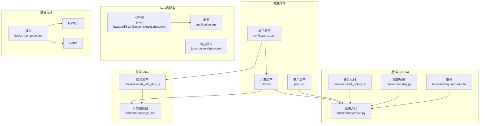
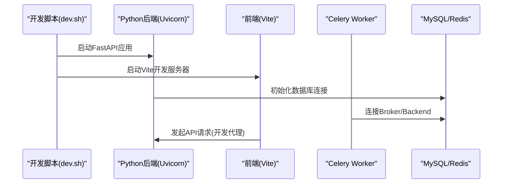
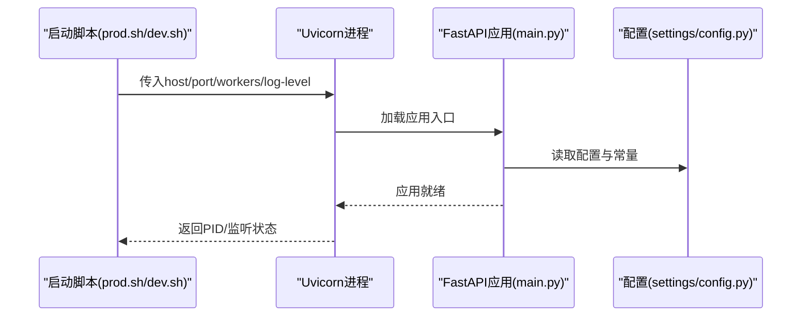
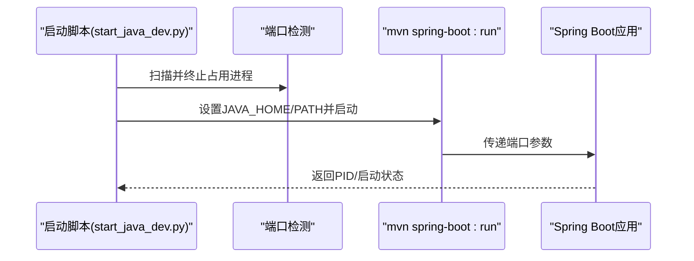
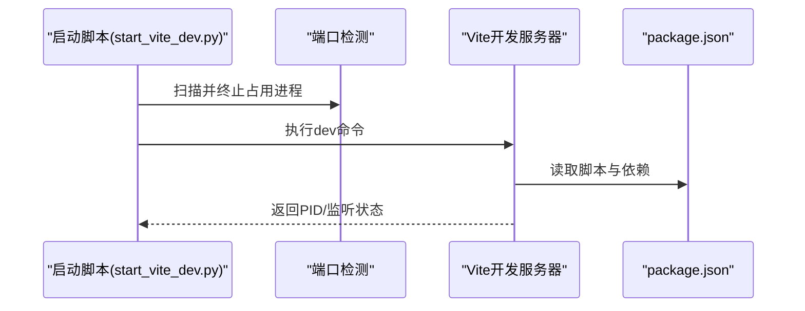
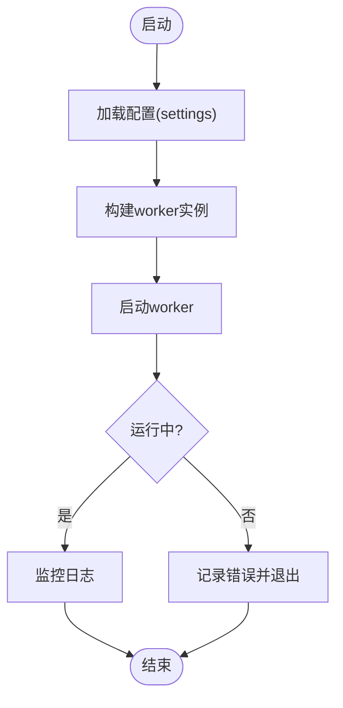
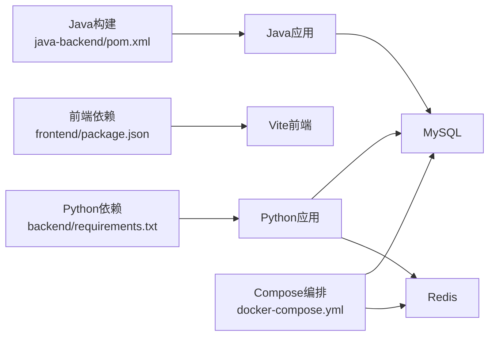

# 服务启动失败

<cite>
**本文引用的文件**
- [dev.sh](file://dev.sh)
- [prod.sh](file://prod.sh)
- [backend/start_celery.py](file://backend/start_celery.py)
- [backend/start_java_dev.py](file://backend/start_java_dev.py)
- [backend/start_vite_dev.py](file://backend/start_vite_dev.py)
- [docker-compose.yml](file://docker-compose.yml)
- [backend/config.py](file://backend/config.py)
- [config/ports.json](file://config/ports.json)
- [backend/app/main.py](file://backend/app/main.py)
- [backend/Dockerfile](file://backend/Dockerfile)
- [backend/Dockerfile.dev](file://backend/Dockerfile.dev)
- [java-backend/src/main/resources/application.yml](file://java-backend/src/main/resources/application.yml)
- [java-backend/src/main/java/com/sjzm/SjzmBackendApplication.java](file://java-backend/src/main/java/com/sjzm/SjzmBackendApplication.java)
- [frontend/package.json](file://frontend/package.json)
- [backend/requirements.txt](file://backend/requirements.txt)
- [python-ai/requirements.txt](file://python-ai/requirements.txt)
</cite>

## 目录
1. [简介](#简介)
2. [项目结构](#项目结构)
3. [核心组件](#核心组件)
4. [架构总览](#架构总览)
5. [详细组件分析](#详细组件分析)
6. [依赖关系分析](#依赖关系分析)
7. [性能考虑](#性能考虑)
8. [故障排查指南](#故障排查指南)
9. [结论](#结论)
10. [附录](#附录)

## 简介
本指南聚焦“服务启动失败”问题，覆盖以下场景：
- Python后端服务启动失败（uvicorn ASGI应用）
- Java微服务启动异常（Spring Boot应用）
- 前端开发服务器无法启动（Vite）
- 进程启动日志分析、依赖包版本冲突检查、端口占用排查、进程权限问题
- 服务启动顺序检查、依赖服务健康状态验证、启动超时处理
- 启动脚本调试技巧与常见启动错误的快速修复方案

目标是帮助开发者快速定位并解决问题，缩短排障时间。

## 项目结构
系统采用多语言分层：Python后端（FastAPI+Uvicorn）、Java微服务（Spring Boot）、前端（Vite）、数据库与缓存（MySQL/Redis）通过Compose编排；另有独立的Python AI服务。

图表来源
- [dev.sh:1-45](file://dev.sh#L1-L45)
- [prod.sh:1-58](file://prod.sh#L1-L58)
- [config/ports.json:1-15](file://config/ports.json#L1-L15)
- [backend/app/main.py](file://backend/app/main.py)
- [backend/start_celery.py:1-55](file://backend/start_celery.py#L1-L55)
- [backend/config.py:1-62](file://backend/config.py#L1-L62)
- [backend/requirements.txt](file://backend/requirements.txt)
- [backend/start_vite_dev.py:1-33](file://backend/start_vite_dev.py#L1-L33)
- [java-backend/src/main/java/com/sjzm/SjzmBackendApplication.java](file://java-backend/src/main/java/com/sjzm/SjzmBackendApplication.java)
- [java-backend/src/main/resources/application.yml](file://java-backend/src/main/resources/application.yml)
- [docker-compose.yml:1-36](file://docker-compose.yml#L1-L36)

章节来源
- [dev.sh:1-45](file://dev.sh#L1-L45)
- [prod.sh:1-58](file://prod.sh#L1-L58)
- [config/ports.json:1-15](file://config/ports.json#L1-L15)
- [docker-compose.yml:1-36](file://docker-compose.yml#L1-L36)

## 核心组件
- Python后端应用入口负责启动Uvicorn服务，监听指定主机与端口，并加载配置与中间件。
- Java微服务通过Spring Boot引导类启动，读取配置文件中的端口与数据库连接参数。
- 前端开发服务器由Vite提供，支持热更新与代理转发。
- Celery Worker用于异步任务处理，需正确连接消息代理与结果后端。
- Compose编排MySQL与Redis，提供健康检查保障依赖服务可用性。

章节来源
- [backend/app/main.py](file://backend/app/main.py)
- [java-backend/src/main/java/com/sjzm/SjzmBackendApplication.java](file://java-backend/src/main/java/com/sjzm/SjzmBackendApplication.java)
- [frontend/package.json](file://frontend/package.json)
- [backend/start_celery.py:1-55](file://backend/start_celery.py#L1-L55)
- [docker-compose.yml:1-36](file://docker-compose.yml#L1-L36)

## 架构总览
下图展示开发与生产两种启动路径的关键节点与交互：

图表来源
- [dev.sh:24-44](file://dev.sh#L24-L44)
- [backend/app/main.py](file://backend/app/main.py)
- [backend/start_celery.py:21-55](file://backend/start_celery.py#L21-L55)
- [docker-compose.yml:7-36](file://docker-compose.yml#L7-L36)

## 详细组件分析

### Python后端启动流程
- 启动方式：通过uvicorn以ASGI应用入口启动，绑定主机与端口。
- 日志输出：标准输出重定向并带颜色前缀，便于区分后端日志。
- 配置来源：应用内部通过settings加载环境变量与配置常量。
- 依赖管理：requirements.txt声明依赖，确保版本一致性。

图表来源
- [prod.sh:36-43](file://prod.sh#L36-L43)
- [dev.sh:27-34](file://dev.sh#L27-L34)
- [backend/app/main.py](file://backend/app/main.py)
- [backend/config.py:1-62](file://backend/config.py#L1-L62)

章节来源
- [prod.sh:1-58](file://prod.sh#L1-L58)
- [dev.sh:1-45](file://dev.sh#L1-L45)
- [backend/app/main.py](file://backend/app/main.py)
- [backend/config.py:1-62](file://backend/config.py#L1-L62)
- [backend/requirements.txt](file://backend/requirements.txt)

### Java微服务启动流程
- 启动方式：通过Maven插件spring-boot:run启动，指定端口参数。
- 端口占用：启动前扫描并终止占用端口的进程，避免冲突。
- 环境变量：显式设置JAVA_HOME与PATH，确保可执行文件可用。
- 引导类：SjzmBackendApplication作为应用入口，加载配置。

图表来源
- [backend/start_java_dev.py:1-39](file://backend/start_java_dev.py#L1-L39)
- [java-backend/src/main/java/com/sjzm/SjzmBackendApplication.java](file://java-backend/src/main/java/com/sjzm/SjzmBackendApplication.java)
- [java-backend/src/main/resources/application.yml](file://java-backend/src/main/resources/application.yml)

章节来源
- [backend/start_java_dev.py:1-39](file://backend/start_java_dev.py#L1-L39)
- [java-backend/src/main/java/com/sjzm/SjzmBackendApplication.java](file://java-backend/src/main/java/com/sjzm/SjzmBackendApplication.java)
- [java-backend/src/main/resources/application.yml](file://java-backend/src/main/resources/application.yml)

### 前端开发服务器启动流程
- 启动方式：通过npm run dev启动Vite开发服务器。
- 端口占用：启动前扫描并终止占用端口的进程。
- 工作目录：切换至frontend目录执行，确保依赖解析正确。

图表来源
- [backend/start_vite_dev.py:1-33](file://backend/start_vite_dev.py#L1-L33)
- [frontend/package.json](file://frontend/package.json)

章节来源
- [backend/start_vite_dev.py:1-33](file://backend/start_vite_dev.py#L1-L33)
- [frontend/package.json](file://frontend/package.json)

### Celery Worker启动流程
- 启动方式：直接调用celery worker命令行，传入并发数与池类型。
- 日志配置：同时输出到stdout与文件，便于排障。
- 错误处理：捕获异常并退出码返回，便于上层监控。

图表来源
- [backend/start_celery.py:21-55](file://backend/start_celery.py#L21-L55)

章节来源
- [backend/start_celery.py:1-55](file://backend/start_celery.py#L1-L55)

## 依赖关系分析
- Python后端依赖：通过requirements.txt统一管理，建议使用虚拟环境隔离。
- Java微服务依赖：通过Maven管理，确保JDK与Maven版本匹配。
- 前端依赖：通过package.json管理，注意Node版本与包管理器一致性。
- 基础设施依赖：MySQL与Redis通过Compose提供，健康检查确保可用性。

图表来源
- [backend/requirements.txt](file://backend/requirements.txt)
- [java-backend/pom.xml](file://java-backend/pom.xml)
- [frontend/package.json](file://frontend/package.json)
- [docker-compose.yml:7-36](file://docker-compose.yml#L7-L36)

章节来源
- [backend/requirements.txt](file://backend/requirements.txt)
- [python-ai/requirements.txt](file://python-ai/requirements.txt)
- [docker-compose.yml:1-36](file://docker-compose.yml#L1-L36)

## 性能考虑
- Python后端生产模式使用多worker提升吞吐，但需关注内存占用与并发模型。
- Celery并发数应与CPU核数匹配，避免过度竞争导致上下文切换开销。
- 前端开发模式启用热更新，生产环境建议构建产物交由Nginx服务。
- 基础设施健康检查间隔与超时应合理设置，避免误报或延迟发现故障。

## 故障排查指南

### 一、Python后端启动失败
常见症状
- 进程启动即退出
- 端口被占用
- 依赖缺失或版本冲突
- 配置加载失败

排查步骤
1. 检查端口占用
   - 使用脚本自带的端口扫描与终止逻辑，确认端口未被占用。
   - 参考：[dev.sh:27](file://dev.sh#L27)、[prod.sh:40](file://prod.sh#L40)
2. 分析启动日志
   - 后端日志带颜色前缀，便于识别错误堆栈与初始化失败原因。
   - 参考：[dev.sh:27](file://dev.sh#L27)、[prod.sh:42](file://prod.sh#L42)
3. 校验依赖版本
   - 在虚拟环境中安装requirements.txt，避免全局污染。
   - 参考：[backend/requirements.txt](file://backend/requirements.txt)
4. 验证配置加载
   - 确认settings加载顺序与环境变量覆盖关系。
   - 参考：[backend/config.py:14-31](file://backend/config.py#L14-L31)、[backend/app/main.py](file://backend/app/main.py)
5. 检查Dockerfile与镜像
   - 确保构建阶段依赖安装完整，运行时环境变量正确。
   - 参考：[backend/Dockerfile](file://backend/Dockerfile)、[backend/Dockerfile.dev](file://backend/Dockerfile.dev)

快速修复
- 若端口冲突，修改端口或释放占用进程。
- 若依赖缺失，重新安装虚拟环境并执行requirements.txt。
- 若配置错误，检查环境变量与配置文件优先级。

章节来源
- [dev.sh:24-44](file://dev.sh#L24-L44)
- [prod.sh:36-51](file://prod.sh#L36-L51)
- [backend/config.py:14-31](file://backend/config.py#L14-L31)
- [backend/requirements.txt](file://backend/requirements.txt)
- [backend/Dockerfile](file://backend/Dockerfile)
- [backend/Dockerfile.dev](file://backend/Dockerfile.dev)

### 二、Java微服务启动异常
常见症状
- 启动卡顿或超时
- 端口已被占用
- JDK/Maven路径错误
- 配置文件加载失败

排查步骤
1. 端口占用检查与清理
   - 启动前扫描并终止占用8090的进程。
   - 参考：[backend/start_java_dev.py:4-13](file://backend/start_java_dev.py#L4-L13)
2. 环境变量校验
   - 显式设置JAVA_HOME与PATH，确保mvn.cmd可执行。
   - 参考：[backend/start_java_dev.py:29-31](file://backend/start_java_dev.py#L29-L31)
3. 配置文件验证
   - application.yml中的端口、数据库连接等参数是否正确。
   - 参考：[java-backend/src/main/resources/application.yml](file://java-backend/src/main/resources/application.yml)
4. 启动超时处理
   - 若启动缓慢，适当增加超时或优化依赖加载。
   - 参考：[backend/start_java_dev.py:6](file://backend/start_java_dev.py#L6)

快速修复
- 修正JAVA_HOME与PATH指向正确的JDK/Maven安装目录。
- 修改端口或释放占用进程。
- 检查application.yml中的数据库与服务地址。

章节来源
- [backend/start_java_dev.py:1-39](file://backend/start_java_dev.py#L1-L39)
- [java-backend/src/main/resources/application.yml](file://java-backend/src/main/resources/application.yml)

### 三、前端开发服务器无法启动
常见症状
- 端口被占用
- 依赖安装不完整
- Node版本不兼容

排查步骤
1. 端口占用检查与清理
   - 启动前扫描并终止占用5175的进程。
   - 参考：[backend/start_vite_dev.py:4-13](file://backend/start_vite_dev.py#L4-L13)
2. 依赖完整性检查
   - 确认frontend/package.json存在且依赖已安装。
   - 参考：[frontend/package.json](file://frontend/package.json)
3. Node版本与包管理器
   - 确保Node版本与项目要求一致，必要时使用nvm切换。
4. 工作目录与命令
   - 确保在frontend目录执行dev命令，避免相对路径问题。
   - 参考：[backend/start_vite_dev.py:29-30](file://backend/start_vite_dev.py#L29-L30)

快速修复
- 释放5175端口或修改端口。
- 重新安装依赖或清理缓存后重装。
- 切换到兼容的Node版本。

章节来源
- [backend/start_vite_dev.py:1-33](file://backend/start_vite_dev.py#L1-L33)
- [frontend/package.json](file://frontend/package.json)

### 四、进程启动日志分析
- Python后端：日志带“[API]”前缀，便于区分；生产模式可调整log-level。
  - 参考：[dev.sh:27](file://dev.sh#L27)、[prod.sh:42](file://prod.sh#L42)
- Java微服务：启动日志输出到控制台，关注端口绑定与配置加载。
  - 参考：[backend/start_java_dev.py:33-37](file://backend/start_java_dev.py#L33-L37)
- 前端：Vite启动日志输出到控制台，关注端口与代理配置。
  - 参考：[backend/start_vite_dev.py:29-32](file://backend/start_vite_dev.py#L29-L32)

章节来源
- [dev.sh:27-34](file://dev.sh#L27-L34)
- [prod.sh:38-43](file://prod.sh#L38-L43)
- [backend/start_java_dev.py:33-37](file://backend/start_java_dev.py#L33-L37)
- [backend/start_vite_dev.py:29-32](file://backend/start_vite_dev.py#L29-L32)

### 五、依赖包版本冲突检查
- Python：在虚拟环境中安装requirements.txt，避免全局包影响。
  - 参考：[backend/requirements.txt](file://backend/requirements.txt)
- Java：确保JDK与Maven版本匹配，pom.xml中依赖版本一致。
  - 参考：[java-backend/pom.xml](file://java-backend/pom.xml)
- 前端：使用package-lock.json锁定版本，避免不同机器差异。
  - 参考：[frontend/package.json](file://frontend/package.json)

章节来源
- [backend/requirements.txt](file://backend/requirements.txt)
- [python-ai/requirements.txt](file://python-ai/requirements.txt)
- [java-backend/pom.xml](file://java-backend/pom.xml)
- [frontend/package.json](file://frontend/package.json)

### 六、端口占用排查
- 统一端口配置：参考ports.json中的基础、开发、生产端口映射。
  - 参考：[config/ports.json:1-15](file://config/ports.json#L1-L15)
- 启动前清理：各启动脚本均包含端口扫描与终止逻辑。
  - 参考：[backend/start_java_dev.py:4-13](file://backend/start_java_dev.py#L4-L13)、[backend/start_vite_dev.py:4-13](file://backend/start_vite_dev.py#L4-L13)

章节来源
- [config/ports.json:1-15](file://config/ports.json#L1-L15)
- [backend/start_java_dev.py:4-13](file://backend/start_java_dev.py#L4-L13)
- [backend/start_vite_dev.py:4-13](file://backend/start_vite_dev.py#L4-L13)

### 七、进程权限问题解决
- Windows：以管理员权限运行命令行，确保taskkill与端口访问权限。
- Linux/macOS：确保用户对端口范围有绑定权限（非特权端口），或使用sudo。
- 文件权限：确保日志文件与缓存目录具备读写权限。

### 八、服务启动顺序检查
- 基础设施优先：先启动MySQL与Redis，再启动后端应用。
  - 参考：[docker-compose.yml:7-36](file://docker-compose.yml#L7-L36)
- 后端依赖：数据库与缓存健康后再启动Python后端。
- 异步任务：Celery Worker应在Broker可用后启动。
  - 参考：[backend/start_celery.py:21-55](file://backend/start_celery.py#L21-L55)

章节来源
- [docker-compose.yml:7-36](file://docker-compose.yml#L7-L36)
- [backend/start_celery.py:21-55](file://backend/start_celery.py#L21-L55)

### 九、依赖服务健康状态验证
- Compose健康检查：MySQL与Redis提供健康检查指令与超时参数。
  - 参考：[docker-compose.yml:17-31](file://docker-compose.yml#L17-L31)
- 自检脚本：可编写简单探针脚本轮询健康端点，确认可用性。

章节来源
- [docker-compose.yml:17-31](file://docker-compose.yml#L17-L31)

### 十、启动超时问题处理
- 调整超时：在启动脚本中增加超时等待时间，或优化依赖加载。
- 分步启动：先启动轻量服务（如数据库），再启动重量级服务（如后端）。
- 日志定位：通过日志前缀与级别快速定位阻塞点。

### 十一、启动脚本调试技巧
- 输出重定向：将标准输出与错误输出合并，统一收集日志。
  - 参考：[dev.sh:27](file://dev.sh#L27)、[prod.sh:42](file://prod.sh#L42)
- 颜色前缀：为不同服务添加颜色前缀，便于区分。
  - 参考：[dev.sh:8-11](file://dev.sh#L8-L11)、[prod.sh:8-11](file://prod.sh#L8-L11)
- 信号处理：使用trap捕获中断信号，优雅关闭子进程。
  - 参考：[dev.sh:13-22](file://dev.sh#L13-L22)、[prod.sh:13-22](file://prod.sh#L13-L22)

章节来源
- [dev.sh:8-22](file://dev.sh#L8-L22)
- [prod.sh:13-22](file://prod.sh#L13-L22)

## 结论
通过规范化的启动脚本、清晰的日志输出、严格的端口与权限管理，以及完善的依赖与健康检查机制，可以显著降低服务启动失败的概率。遇到问题时，建议按“端口—日志—依赖—配置—顺序”的顺序逐项排查，结合本文提供的图示与路径指引，快速定位并解决问题。

## 附录
- 快速检查清单
  - 端口是否被占用？是否已清理？
  - 依赖是否完整安装？版本是否匹配？
  - 配置文件是否正确加载？环境变量是否覆盖预期？
  - 基础设施是否健康？MySQL/Redis是否通过健康检查？
  - 启动顺序是否正确？异步任务是否在Broker可用后启动？