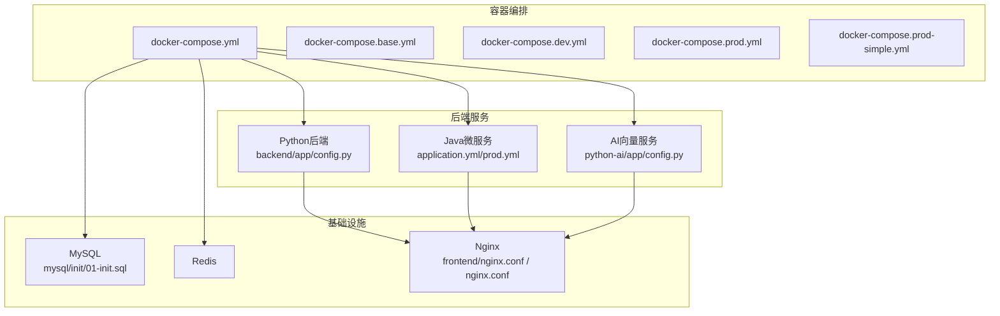
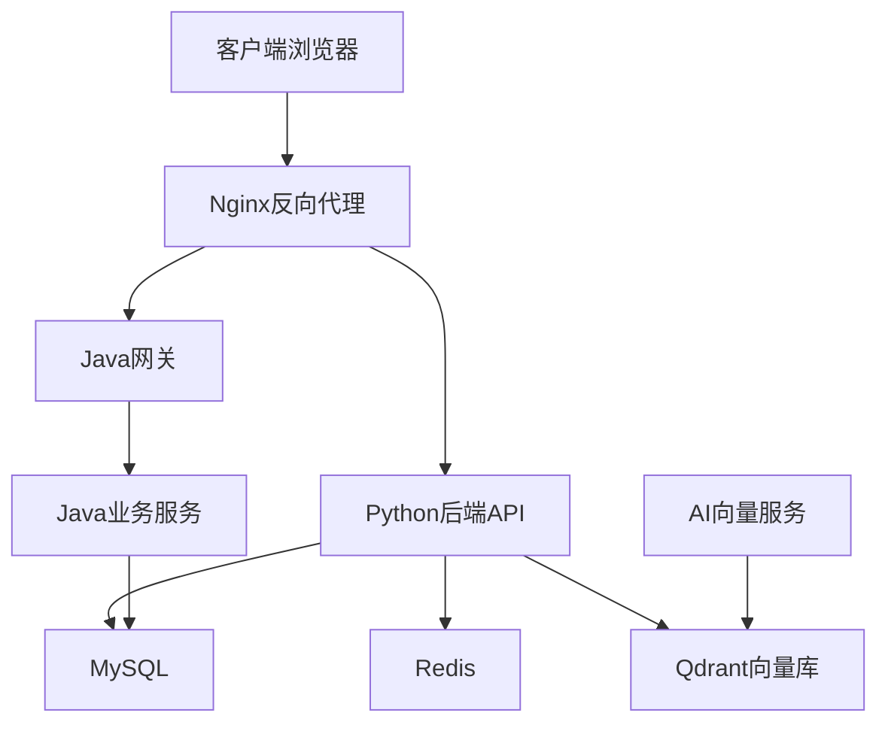
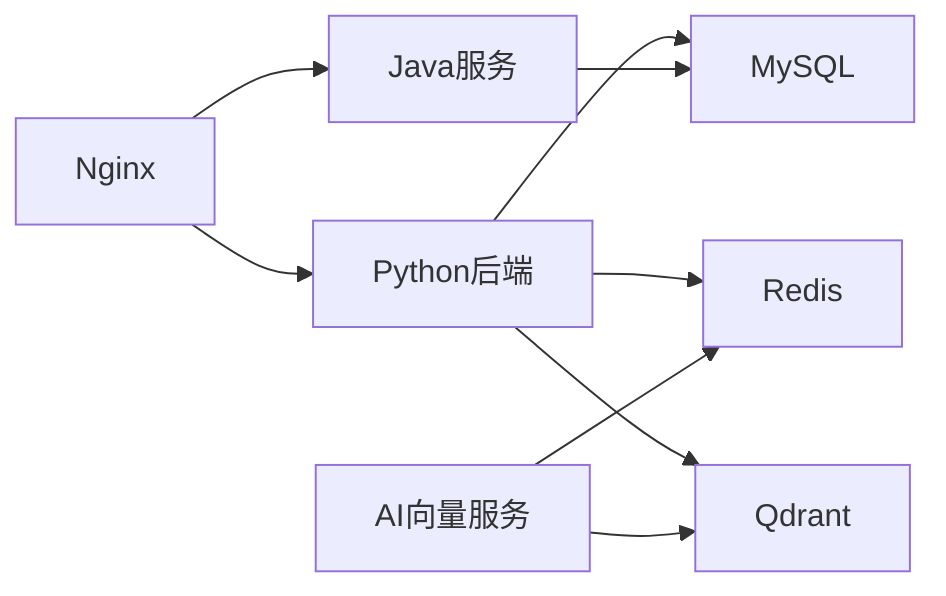

# 环境配置问题

<cite>
**本文引用的文件**
- [docker-compose.yml](file://docker-compose.yml)
- [docker-compose.base.yml](file://docker-compose.base.yml)
- [docker-compose.dev.yml](file://docker-compose.dev.yml)
- [docker-compose.prod.yml](file://docker-compose.prod.yml)
- [docker-compose.prod-simple.yml](file://docker-compose.prod-simple.yml)
- [backend/app/config.py](file://backend/app/config.py)
- [backend/config.py](file://backend/config.py)
- [python-ai/app/config.py](file://python-ai/app/config.py)
- [java-backend/src/main/resources/application.yml](file://java-backend/src/main/resources/application.yml)
- [java-backend/src/main/resources/application-prod.yml](file://java-backend/src/main/resources/application-prod.yml)
- [frontend/nginx.conf](file://frontend/nginx.conf)
- [frontend/nginx.prod.conf](file://frontend/nginx.prod.conf)
- [nginx.conf](file://nginx.conf)
- [config/ports.json](file://config/ports.json)
- [mysql/init/01-init.sql](file://mysql/init/01-init.sql)
- [docs/生产部署检查清单.md](file://docs/生产部署检查清单.md)
- [docs/Docker部署问题报告_20260510.md](file://docs/Docker部署问题报告_20260510.md)
- [docs/架构/Docker生产环境独立部署方案.md](file://docs/架构/Docker生产环境独立部署方案.md)
- [docs/问题记录/nginx路由规则问题记录.md](file://docs/问题记录/nginx路由规则问题记录.md)
- [docs/生产环境图片加载失败-COS_BUCKET配置错误.md](file://docs/问题记录/生产环境图片加载失败-COS_BUCKET配置错误.md)
- [docs/生产环境登录失败-数据库密码hash不一致.md](file://docs/问题记录/生产环境登录失败-数据库密码hash不一致.md)
- [scripts/startup/start_prod_multiprocess.py](file://scripts/startup/start_prod_multiprocess.py)
- [scripts/environment/setup_dev_environment.py](file://scripts/environment/setup_dev_environment.py)
</cite>

## 目录
1. [简介](#简介)
2. [项目结构](#项目结构)
3. [核心组件](#核心组件)
4. [架构概览](#架构概览)
5. [详细组件分析](#详细组件分析)
6. [依赖关系分析](#依赖关系分析)
7. [性能考虑](#性能考虑)
8. [故障排查指南](#故障排查指南)
9. [结论](#结论)
10. [附录](#附录)

## 简介
本指南聚焦于思觉智贸系统的环境配置问题排查，覆盖Docker容器启动失败、数据库连接异常、Redis连接超时、Nginx代理配置错误等常见问题。文档基于仓库中的实际配置文件与部署脚本，提供从环境变量、网络连通性、端口冲突到依赖服务健康检查的完整排查路径，并给出开发与生产环境的差异化检查清单，以及常见配置错误的识别与修复步骤。

## 项目结构
系统采用多语言混合架构：Python后端（FastAPI）、Java微服务网关与业务模块、前端Vue应用、AI向量服务（Python）、数据库（MySQL）与缓存（Redis）。容器编排通过docker-compose实现，支持开发与生产两种模式；Nginx负责静态资源与反向代理。

**图表来源**
- [docker-compose.yml](file://docker-compose.yml)
- [docker-compose.base.yml](file://docker-compose.base.yml)
- [docker-compose.dev.yml](file://docker-compose.dev.yml)
- [docker-compose.prod.yml](file://docker-compose.prod.yml)
- [docker-compose.prod-simple.yml](file://docker-compose.prod-simple.yml)
- [backend/app/config.py](file://backend/app/config.py)
- [backend/config.py](file://backend/config.py)
- [python-ai/app/config.py](file://python-ai/app/config.py)
- [java-backend/src/main/resources/application.yml](file://java-backend/src/main/resources/application.yml)
- [java-backend/src/main/resources/application-prod.yml](file://java-backend/src/main/resources/application-prod.yml)
- [frontend/nginx.conf](file://frontend/nginx.conf)
- [frontend/nginx.prod.conf](file://frontend/nginx.prod.conf)
- [nginx.conf](file://nginx.conf)
- [mysql/init/01-init.sql](file://mysql/init/01-init.sql)

**章节来源**
- [docker-compose.yml](file://docker-compose.yml)
- [docker-compose.base.yml](file://docker-compose.base.yml)
- [docker-compose.dev.yml](file://docker-compose.dev.yml)
- [docker-compose.prod.yml](file://docker-compose.prod.yml)
- [docker-compose.prod-simple.yml](file://docker-compose.prod-simple.yml)

## 核心组件
- Python后端配置：集中于后端目录下的配置文件，定义数据库连接、缓存、日志、外部API等参数。
- Java微服务配置：Spring Boot应用的application.yml与生产专用配置，管理服务注册、网关路由、数据库连接池等。
- AI向量服务配置：独立的Python服务，负责向量检索与模型缓存，需与Qdrant/Redis等依赖协同。
- Nginx配置：前端静态资源与后端API代理，区分开发与生产环境配置。
- 数据库初始化：MySQL初始化脚本，用于创建必要表结构与基础数据。
- 端口映射：统一的端口配置文件，便于排查端口冲突与服务暴露问题。

**章节来源**
- [backend/app/config.py](file://backend/app/config.py)
- [backend/config.py](file://backend/config.py)
- [python-ai/app/config.py](file://python-ai/app/config.py)
- [java-backend/src/main/resources/application.yml](file://java-backend/src/main/resources/application.yml)
- [java-backend/src/main/resources/application-prod.yml](file://java-backend/src/main/resources/application-prod.yml)
- [frontend/nginx.conf](file://frontend/nginx.conf)
- [frontend/nginx.prod.conf](file://frontend/nginx.prod.conf)
- [nginx.conf](file://nginx.conf)
- [config/ports.json](file://config/ports.json)
- [mysql/init/01-init.sql](file://mysql/init/01-init.sql)

## 架构概览
系统通过docker-compose编排，后端服务（Python、Java、AI）与数据库、缓存、Nginx共同构成完整的运行环境。生产环境强调独立部署与高可用，开发环境强调快速迭代与本地联调。

**图表来源**
- [docker-compose.yml](file://docker-compose.yml)
- [backend/app/config.py](file://backend/app/config.py)
- [python-ai/app/config.py](file://python-ai/app/config.py)
- [java-backend/src/main/resources/application.yml](file://java-backend/src/main/resources/application.yml)
- [frontend/nginx.conf](file://frontend/nginx.conf)

## 详细组件分析

### Python后端配置分析
- 关键点：数据库连接字符串、Redis连接参数、日志级别、外部API密钥、文件存储路径等。
- 排查要点：确认连接串格式正确、主机名/端口可达、认证凭据有效、网络策略允许访问。
- 常见错误：数据库密码或主机变更未同步、Redis超时阈值过低、COS/OSS等对象存储桶名错误。

**章节来源**
- [backend/app/config.py](file://backend/app/config.py)
- [backend/config.py](file://backend/config.py)

### Java微服务配置分析
- 关键点：服务端口、数据库连接池配置、网关路由规则、服务注册发现、生产专用参数。
- 排查要点：连接池大小与超时、事务隔离级别、健康检查端点、跨域配置。
- 常见错误：数据库驱动版本不匹配、连接池耗尽导致请求阻塞、路由前缀不一致导致404。

**章节来源**
- [java-backend/src/main/resources/application.yml](file://java-backend/src/main/resources/application.yml)
- [java-backend/src/main/resources/application-prod.yml](file://java-backend/src/main/resources/application-prod.yml)

### AI向量服务配置分析
- 关键点：向量维度、索引参数、模型下载与缓存、Redis/Qdrant连接参数。
- 排查要点：向量维度一致性、Redis连接超时、Qdrant节点状态、磁盘空间与内存占用。
- 常见错误：模型文件缺失或权限不足、Redis未启用ACL导致鉴权失败、Qdrant网络不可达。

**章节来源**
- [python-ai/app/config.py](file://python-ai/app/config.py)

### Nginx代理配置分析
- 关键点：静态资源根目录、后端API上游、路由规则、SSL证书、超时与缓冲区。
- 排查要点：路径前缀与后端路由是否一致、CORS与安全头、gzip压缩与缓存策略。
- 常见错误：location块正则不匹配、proxy_pass末尾斜杠导致重定向、HTTPS证书链不完整。

**章节来源**
- [frontend/nginx.conf](file://frontend/nginx.conf)
- [frontend/nginx.prod.conf](file://frontend/nginx.prod.conf)
- [nginx.conf](file://nginx.conf)

### 数据库初始化与连接分析
- 关键点：初始化SQL脚本、用户权限、字符集与排序规则、外键约束。
- 排查要点：数据库实例可达性、账号密码、网络ACL、防火墙放行。
- 常见错误：字符集不一致导致排序异常、初始化脚本执行失败、权限不足。

**章节来源**
- [mysql/init/01-init.sql](file://mysql/init/01-init.sql)

## 依赖关系分析
后端服务对数据库、缓存、向量库存在直接依赖；Nginx作为统一入口，将请求分发至不同后端；AI服务独立运行但共享缓存与向量存储。

**图表来源**
- [backend/app/config.py](file://backend/app/config.py)
- [python-ai/app/config.py](file://python-ai/app/config.py)
- [java-backend/src/main/resources/application.yml](file://java-backend/src/main/resources/application.yml)
- [frontend/nginx.conf](file://frontend/nginx.conf)

**章节来源**
- [backend/app/config.py](file://backend/app/config.py)
- [python-ai/app/config.py](file://python-ai/app/config.py)
- [java-backend/src/main/resources/application.yml](file://java-backend/src/main/resources/application.yml)
- [frontend/nginx.conf](file://frontend/nginx.conf)

## 性能考虑
- 连接池：合理设置数据库连接池大小与超时，避免并发高峰下的连接争用。
- 缓存：Redis作为热点数据缓存，需关注内存上限与淘汰策略，防止雪崩。
- 网络：Nginx与后端服务间保持合理的超时与重试策略，避免级联故障。
- 存储：对象存储（COS/OSS）上传与CDN加速，减少后端带宽压力。

## 故障排查指南

### Docker容器启动失败
- 症状：容器启动即退出、健康检查失败、日志报端口占用。
- 排查步骤：
  1) 查看容器日志，定位首次启动错误。
  2) 检查端口映射与宿主机端口冲突，核对端口配置文件。
  3) 确认依赖服务（MySQL、Redis、Qdrant）已就绪并可访问。
  4) 校验环境变量与挂载卷权限。
- 修复建议：调整端口映射、确保依赖服务先启动、修正环境变量拼写。

**章节来源**
- [docker-compose.yml](file://docker-compose.yml)
- [docker-compose.base.yml](file://docker-compose.base.yml)
- [config/ports.json](file://config/ports.json)

### 数据库连接异常
- 症状：应用启动时报连接超时、认证失败、SQL执行异常。
- 排查步骤：
  1) 使用命令行工具从容器内测试连接，确认主机名/端口可达。
  2) 核对数据库初始化脚本执行情况与用户权限。
  3) 检查防火墙与网络策略，确保容器可访问数据库。
- 修复建议：修正连接串、授权账户、放行网络策略。

**章节来源**
- [backend/app/config.py](file://backend/app/config.py)
- [mysql/init/01-init.sql](file://mysql/init/01-init.sql)

### Redis连接超时
- 症状：缓存读写失败、任务队列堆积、会话丢失。
- 排查步骤：
  1) 从应用容器ping Redis主机，检查网络连通性。
  2) 核对Redis连接参数（主机、端口、密码、数据库号）。
  3) 检查Redis内存与慢查询日志。
- 修复建议：提升超时阈值、优化键空间、启用持久化与备份。

**章节来源**
- [backend/app/config.py](file://backend/app/config.py)
- [python-ai/app/config.py](file://python-ai/app/config.py)

### Nginx代理配置错误
- 症状：页面空白、接口404、跨域失败、静态资源404。
- 排查步骤：
  1) 对比开发与生产Nginx配置差异，确认location块与proxy_pass。
  2) 检查后端服务健康检查端点与响应头。
  3) 校验SSL证书与安全头设置。
- 修复建议：统一路由前缀、补齐CORS头、完善HTTPS配置。

**章节来源**
- [frontend/nginx.conf](file://frontend/nginx.conf)
- [frontend/nginx.prod.conf](file://frontend/nginx.prod.conf)
- [nginx.conf](file://nginx.conf)
- [docs/问题记录/nginx路由规则问题记录.md](file://docs/问题记录/nginx路由规则问题记录.md)

### 环境变量配置
- 检查项：数据库连接串、Redis连接参数、外部API密钥、对象存储桶名与凭证、日志级别。
- 常见错误：变量名拼写错误、未在对应环境文件中声明、权限不足导致读取失败。
- 修复步骤：统一命名规范、在compose文件中显式声明、校验文件权限与挂载路径。

**章节来源**
- [backend/app/config.py](file://backend/app/config.py)
- [backend/config.py](file://backend/config.py)
- [python-ai/app/config.py](file://python-ai/app/config.py)
- [java-backend/src/main/resources/application.yml](file://java-backend/src/main/resources/application.yml)

### 网络连接测试
- 方法：使用curl或wget从容器内访问后端API与依赖服务，验证DNS解析与端口开放。
- 工具：nslookup/dig验证域名解析，telnet/netstat验证端口连通。
- 结果判定：成功返回HTTP 200或数据库连接建立即为正常。

**章节来源**
- [docker-compose.yml](file://docker-compose.yml)

### 端口冲突排查
- 步骤：核对端口配置文件与各服务监听端口，使用netstat/ss查看占用进程。
- 修复：修改映射端口或释放宿主机占用端口。

**章节来源**
- [config/ports.json](file://config/ports.json)

### 依赖服务健康检查
- Python后端：访问健康检查端点，确认数据库、Redis、对象存储可用。
- Java微服务：检查Actuator健康页与数据库连接池状态。
- AI服务：验证向量索引与Redis/Qdrant连通性。

**章节来源**
- [backend/app/config.py](file://backend/app/config.py)
- [python-ai/app/config.py](file://python-ai/app/config.py)
- [java-backend/src/main/resources/application.yml](file://java-backend/src/main/resources/application.yml)

### 开发环境与生产环境检查清单
- 开发环境
  - 端口映射：核对ports.json与compose文件一致
  - 依赖服务：MySQL、Redis、Nginx按需启动
  - 日志级别：INFO或DEBUG便于调试
  - 热重启：后端支持热加载，前端Vite热更新
- 生产环境
  - 独立部署：参考生产部署方案，确保服务解耦
  - 资源限制：CPU/内存限额与健康检查
  - 安全加固：HTTPS、CORS、WAF、密钥轮换
  - 监控告警：Prometheus、日志聚合、链路追踪

**章节来源**
- [docs/生产部署检查清单.md](file://docs/生产部署检查清单.md)
- [docs/架构/Docker生产环境独立部署方案.md](file://docs/架构/Docker生产环境独立部署方案.md)
- [docker-compose.prod.yml](file://docker-compose.prod.yml)
- [docker-compose.prod-simple.yml](file://docker-compose.prod-simple.yml)

### 常见配置错误与修复
- 对象存储桶名错误：导致图片加载失败，需核对COS_BUCKET配置并重新部署。
- 登录失败（数据库密码hash不一致）：需同步密码哈希算法与存储格式。
- Nginx路由规则不匹配：导致API 404，需统一location与后端前缀。
- Docker启动即退出：检查依赖服务是否先于应用启动，修正环境变量。

**章节来源**
- [docs/问题记录/生产环境图片加载失败-COS_BUCKET配置错误.md](file://docs/问题记录/生产环境图片加载失败-COS_BUCKET配置错误.md)
- [docs/问题记录/生产环境登录失败-数据库密码hash不一致.md](file://docs/问题记录/生产环境登录失败-数据库密码hash不一致.md)
- [docs/问题记录/nginx路由规则问题记录.md](file://docs/问题记录/nginx路由规则问题记录.md)
- [docker-compose.yml](file://docker-compose.yml)

## 结论
环境配置问题通常源于依赖服务不可达、端口冲突、配置参数错误与网络策略不当。建议以“先依赖、后端口、再配置”的顺序排查，并结合开发与生产环境的差异化检查清单进行逐项验证。通过标准化的配置管理与健康检查机制，可显著降低故障率并提升恢复效率。

## 附录

### 端口与服务映射对照
- 参考端口配置文件，核对各服务容器对外暴露端口与宿主机映射关系。

**章节来源**
- [config/ports.json](file://config/ports.json)

### 启动与运维脚本
- 生产多进程启动：用于生产环境的多服务并行启动与监控。
- 开发环境搭建：一键初始化数据库与开发依赖。

**章节来源**
- [scripts/startup/start_prod_multiprocess.py](file://scripts/startup/start_prod_multiprocess.py)
- [scripts/environment/setup_dev_environment.py](file://scripts/environment/setup_dev_environment.py)