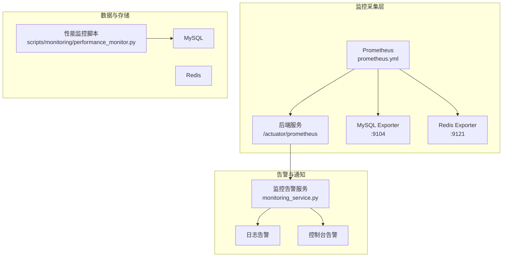
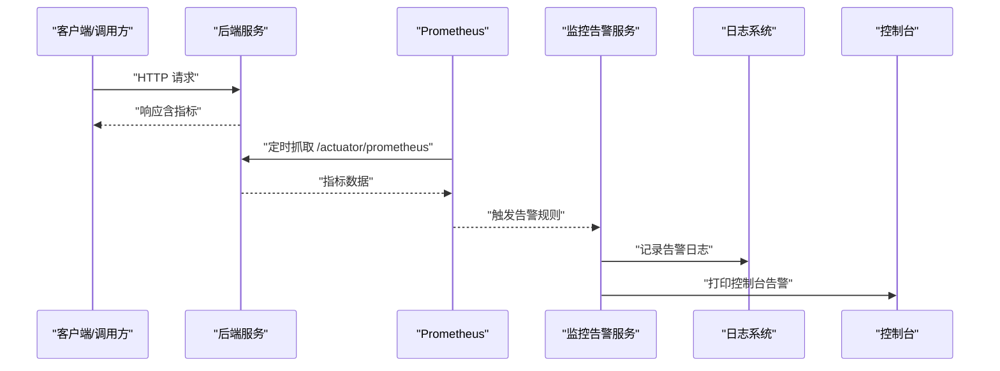
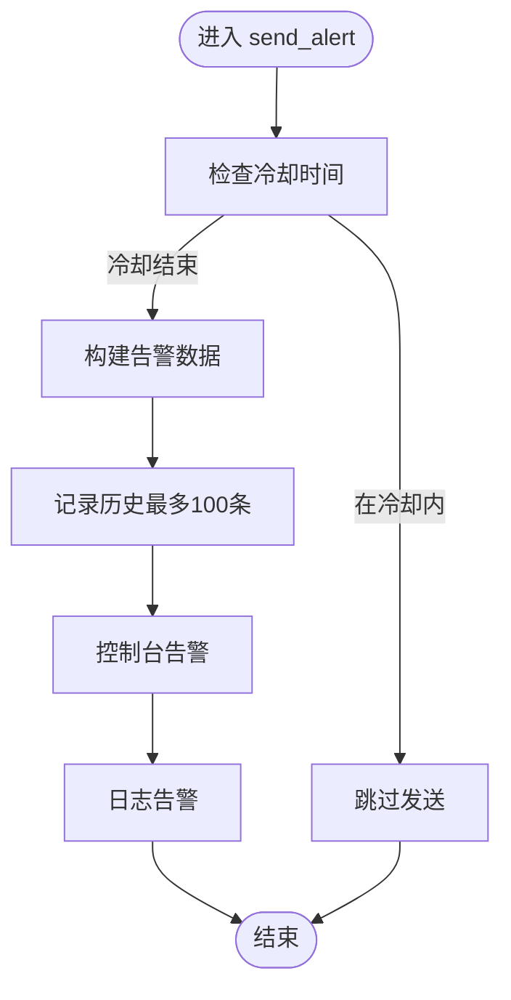
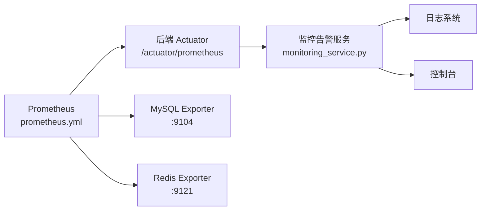

# 监控告警处理

<cite>
**本文引用的文件**
- [prometheus.yml](file://prometheus/prometheus.yml)
- [monitoring_service.py](file://backend/app/services/monitoring_service.py)
- [performance_monitor.py（后端工具）](file://backend/app/utils/performance_monitor.py)
- [performance_monitor.py（脚本）](file://scripts/monitoring/performance_monitor.py)
- [生产部署检查清单.md](file://docs/生产部署检查清单.md)
- [ports.json](file://config/ports.json)
- [backend-deployment.yaml](file://k8s/backend-deployment.yaml)
- [application.yml（Java后端）](file://java-backend/src/main/resources/application.yml)
</cite>

## 目录
1. [简介](#简介)
2. [项目结构](#项目结构)
3. [核心组件](#核心组件)
4. [架构总览](#架构总览)
5. [详细组件分析](#详细组件分析)
6. [依赖关系分析](#依赖关系分析)
7. [性能考量](#性能考量)
8. [故障排查指南](#故障排查指南)
9. [结论](#结论)
10. [附录](#附录)

## 简介
本指南面向“思觉智贸系统”的监控与告警运维，覆盖以下目标：
- Prometheus 监控指标采集配置与告警规则设计
- 告警通知机制与消峰、抑制、升级策略
- 系统性能指标与业务指标的监控与解读
- 仪表板设计思路与趋势分析技巧
- 告警消峰策略、告警抑制规则与告警升级机制

本指南基于仓库中现有的 Prometheus 配置、Python 后端监控服务、数据库性能监控脚本与相关文档进行整理与扩展。

## 项目结构
与监控告警直接相关的文件与位置如下：
- Prometheus 配置：prometheus/prometheus.yml
- 后端监控服务：backend/app/services/monitoring_service.py
- 性能监控工具（后端）：backend/app/utils/performance_monitor.py
- 数据库性能监控脚本：scripts/monitoring/performance_monitor.py
- 生产部署检查清单（含 Prometheus 告警规则示例）：docs/生产部署检查清单.md
- 端口映射配置：config/ports.json
- Kubernetes 部署（后端）：k8s/backend-deployment.yaml
- Java 后端配置（Actuator/Micrometer 指标导出）：java-backend/src/main/resources/application.yml

图表来源
- [prometheus.yml:1-33](file://prometheus/prometheus.yml#L1-L33)
- [monitoring_service.py:1-228](file://backend/app/services/monitoring_service.py#L1-L228)
- [performance_monitor.py（脚本）:1-237](file://scripts/monitoring/performance_monitor.py#L1-L237)

章节来源
- [prometheus.yml:1-33](file://prometheus/prometheus.yml#L1-L33)
- [monitoring_service.py:1-228](file://backend/app/services/monitoring_service.py#L1-L228)
- [performance_monitor.py（脚本）:1-237](file://scripts/monitoring/performance_monitor.py#L1-L237)

## 核心组件
- Prometheus 采集配置：定义抓取目标（后端 Actuator 指标、MySQL/Redis Exporter）、抓取间隔与外部标签。
- 后端监控告警服务：统一告警入口，支持冷却、历史记录、控制台与日志告警；预留邮件/企业微信通道。
- 性能监控工具（后端）：提供同步/异步阶段耗时监控、摘要输出与热重载耗时记录。
- 数据库性能监控脚本：定期检查连接数、表大小、慢查询与索引使用，并生成告警与报告。
- 生产部署检查清单：提供 Prometheus 告警规则 YAML 示例（CPU、内存、JVM、延迟、错误率、服务宕机）。

章节来源
- [prometheus.yml:1-33](file://prometheus/prometheus.yml#L1-L33)
- [monitoring_service.py:1-228](file://backend/app/services/monitoring_service.py#L1-L228)
- [performance_monitor.py（后端工具）:1-158](file://backend/app/utils/performance_monitor.py#L1-L158)
- [performance_monitor.py（脚本）:1-237](file://scripts/monitoring/performance_monitor.py#L1-L237)
- [生产部署检查清单.md:197-249](file://docs/生产部署检查清单.md#L197-L249)

## 架构总览
下图展示从指标采集到告警通知的关键流转：

图表来源
- [prometheus.yml:9-16](file://prometheus/prometheus.yml#L9-L16)
- [monitoring_service.py:36-92](file://backend/app/services/monitoring_service.py#L36-L92)

章节来源
- [prometheus.yml:1-33](file://prometheus/prometheus.yml#L1-L33)
- [monitoring_service.py:1-228](file://backend/app/services/monitoring_service.py#L1-L228)

## 详细组件分析

### Prometheus 指标采集配置
- 抓取目标
  - 后端：通过 /actuator/prometheus 暴露 Micrometer 指标，抓取间隔 10s。
  - MySQL：通过 mysql-exporter :9104 抓取。
  - Redis：通过 redis-exporter :9121 抓取。
  - Prometheus 自身：本地 :9090。
- 全局参数
  - scrape_interval 与 evaluation_interval 设置为 15s。
  - external_labels 注入 cluster 与 environment 标签，便于多集群/多环境区分。

章节来源
- [prometheus.yml:1-33](file://prometheus/prometheus.yml#L1-L33)

### 后端监控告警服务
- 功能要点
  - 统一告警入口：send_alert，支持 severity（info/warning/error/critical）。
  - 冷却机制：按告警类型记录最近一次告警时间，低于冷却时间（默认 3600s）则跳过。
  - 历史记录：最多保留 100 条，支持按需查询。
  - 通知渠道：控制台与日志；预留邮件/企业微信接口。
  - 业务告警：check_url_format_errors 用于检测 URL 格式错误并告警。
- 关键流程（发送告警）

图表来源
- [monitoring_service.py:36-92](file://backend/app/services/monitoring_service.py#L36-L92)
- [monitoring_service.py:94-124](file://backend/app/services/monitoring_service.py#L94-L124)

章节来源
- [monitoring_service.py:1-228](file://backend/app/services/monitoring_service.py#L1-L228)

### 性能监控工具（后端）
- 能力概述
  - start/end：记录同步阶段耗时。
  - async_start：包装异步协程，记录执行耗时与异常。
  - log_summary：输出阶段耗时与占比摘要。
  - reset：清空监控数据，支持新周期。
  - measure_function / measure_async_function：装饰器方式自动测量函数耗时。
- 应用场景
  - 热重载耗时分析、关键路径耗时定位、性能瓶颈识别。

章节来源
- [performance_monitor.py（后端工具）:1-158](file://backend/app/utils/performance_monitor.py#L1-L158)

### 数据库性能监控脚本
- 能力概述
  - 检查数据库连接数、最大使用连接数、运行中线程数。
  - 统计 product_data_* 表的数据/索引大小与行数。
  - 检测慢查询（基于 performance_schema），对平均延迟超阈（示例 >5s）产生严重告警。
  - 输出 JSON 报告并汇总告警。
- 告警阈值（示例）
  - 连接数 >80：警告
  - 慢查询平均延迟 >5s：严重告警

章节来源
- [performance_monitor.py（脚本）:1-237](file://scripts/monitoring/performance_monitor.py#L1-L237)

### Prometheus 告警规则（示例）
- 规则组：sjzm-alerts
- 常见规则
  - HighCPUUsage：容器 CPU 使用率阈值
  - HighMemoryUsage：容器内存使用率阈值
  - JVMHeapUsageHigh：JVM 堆使用率阈值
  - HighLatency：HTTP 请求 P99 延迟阈值
  - HighErrorRate：HTTP 5xx 错误率阈值
  - ServiceDown：服务不可达
- 建议
  - 为不同规则设置合理的持续时间（for）与严重等级（severity）。
  - 结合 external_labels（cluster/environment）进行分组与抑制。

章节来源
- [生产部署检查清单.md:197-249](file://docs/生产部署检查清单.md#L197-L249)

## 依赖关系分析
- 指标来源
  - 后端 Actuator 指标：由 Java 后端配置启用（Micrometer + Actuator），Prometheus 通过 /actuator/prometheus 抓取。
  - MySQL/Redis：通过各自 Exporter 暴露指标，Prometheus 抓取。
- 告警链路
  - Prometheus 规则触发 → 告警管理器 → 接收器（此处由后端监控服务负责记录与控制台输出）。
- 部署与端口
  - 端口映射：MySQL/Redis 端口、前后端端口等在 config/ports.json 中集中管理。
  - Kubernetes 部署：k8s/backend-deployment.yaml 定义后端容器暴露与资源。

图表来源
- [prometheus.yml:8-32](file://prometheus/prometheus.yml#L8-L32)
- [monitoring_service.py:36-92](file://backend/app/services/monitoring_service.py#L36-L92)

章节来源
- [prometheus.yml:1-33](file://prometheus/prometheus.yml#L1-L33)
- [monitoring_service.py:1-228](file://backend/app/services/monitoring_service.py#L1-L228)
- [ports.json:1-15](file://config/ports.json#L1-L15)
- [backend-deployment.yaml](file://k8s/backend-deployment.yaml)

## 性能考量
- 指标采集频率
  - Prometheus 全局 scrape_interval 与 evaluation_interval 为 15s；后端 job 的 scrape_interval 为 10s，建议与业务峰值时段错峰。
- 指标基数控制
  - 避免高基数标签（如用户 ID、SKU 等）作为标签，防止指标爆炸。
- 告警消峰
  - 使用冷却时间（默认 3600s）避免重复告警风暴；对高频瞬时异常设置较长持续时间（for）。
- 性能监控
  - 使用后端性能监控工具定位热点路径；对关键函数/异步任务使用装饰器自动测量。
  - 定期运行数据库性能监控脚本，关注慢查询与连接数异常。

章节来源
- [prometheus.yml:1-7](file://prometheus/prometheus.yml#L1-L7)
- [monitoring_service.py:32-34](file://backend/app/services/monitoring_service.py#L32-L34)
- [performance_monitor.py（后端工具）:121-158](file://backend/app/utils/performance_monitor.py#L121-L158)
- [performance_monitor.py（脚本）:74-79](file://scripts/monitoring/performance_monitor.py#L74-L79)

## 故障排查指南

### 1) 指标无法采集
- 检查 Prometheus 抓取配置
  - 后端指标路径是否为 /actuator/prometheus
  - MySQL/Redis Exporter 地址与端口是否可达
- 检查后端 Actuator 配置
  - Micrometer 与 Actuator 是否启用，端口是否正确
- 检查网络连通性与防火墙
- 检查外部标签 cluster/environment 是否与实际环境一致

章节来源
- [prometheus.yml:9-32](file://prometheus/prometheus.yml#L9-L32)
- [application.yml（Java后端）](file://java-backend/src/main/resources/application.yml)

### 2) 告警频繁或不触发
- 冷却时间设置
  - 若告警过于频繁，适当提高冷却时间；若告警被抑制，缩短冷却时间以便快速恢复通知
- 规则阈值与持续时间
  - 调整 HighCPUUsage/HighMemoryUsage/JVMHeapUsageHigh/HighLatency/HighErrorRate 的阈值与 for 时间
- 告警抑制
  - 对同一指标的多个告警使用抑制规则，避免重复通知

章节来源
- [monitoring_service.py:32-34](file://backend/app/services/monitoring_service.py#L32-L34)
- [生产部署检查清单.md:197-249](file://docs/生产部署检查清单.md#L197-L249)

### 3) 数据库性能异常
- 连接数过高
  - 若连接数超过阈值（示例 >80），优先检查连接池配置与慢查询
- 慢查询
  - 关注平均延迟 >5s 的慢查询，必要时加索引或改写 SQL
- 表膨胀
  - 定期清理与归档历史数据，避免表过大影响查询性能

章节来源
- [performance_monitor.py（脚本）:74-79](file://scripts/monitoring/performance_monitor.py#L74-L79)
- [performance_monitor.py（脚本）:144-148](file://scripts/monitoring/performance_monitor.py#L144-L148)

### 4) 告警通知渠道缺失
- 控制台与日志
  - 默认已开启控制台与日志告警，可在日志系统中检索 [ALERT] 关键字
- 邮件/企业微信
  - 在监控告警服务中实现相应通道（预留方法），并配置相应凭证

章节来源
- [monitoring_service.py:126-197](file://backend/app/services/monitoring_service.py#L126-L197)

### 5) 仪表板与趋势分析
- 指标选择
  - CPU/内存/磁盘 IO、请求延迟（P99）、错误率、连接数、慢查询数、热重载耗时
- 趋势分析
  - 关注指标的周期性波动与异常尖峰，结合业务高峰时段定位问题
- 仪表板设计建议
  - 分区展示：系统资源、应用层指标、业务层指标
  - 使用分组与过滤器（cluster/environment）进行多环境对比

章节来源
- [生产部署检查清单.md:197-249](file://docs/生产部署检查清单.md#L197-L249)

## 结论
本指南基于现有仓库配置与实现，给出了 Prometheus 指标采集、告警规则、通知机制与性能监控的实践路径。建议在生产环境中：
- 明确阈值与持续时间，合理设置冷却与抑制规则
- 定期运行数据库性能监控脚本，保持慢查询与连接数健康
- 使用后端性能监控工具定位热点，持续优化关键路径
- 完善邮件/企业微信等通知渠道，确保告警闭环

## 附录

### A. Prometheus 告警规则（摘录）
- 规则组：sjzm-alerts
- 规则示例
  - HighCPUUsage：容器 CPU 使用率阈值
  - HighMemoryUsage：容器内存使用率阈值
  - JVMHeapUsageHigh：JVM 堆使用率阈值
  - HighLatency：HTTP 请求 P99 延迟阈值
  - HighErrorRate：HTTP 5xx 错误率阈值
  - ServiceDown：服务不可达

章节来源
- [生产部署检查清单.md:197-249](file://docs/生产部署检查清单.md#L197-L249)

### B. 端口与部署参考
- 端口映射：MySQL/Redis 端口、前后端端口
- Kubernetes 部署：后端容器暴露与资源定义

章节来源
- [ports.json:1-15](file://config/ports.json#L1-L15)
- [backend-deployment.yaml](file://k8s/backend-deployment.yaml)