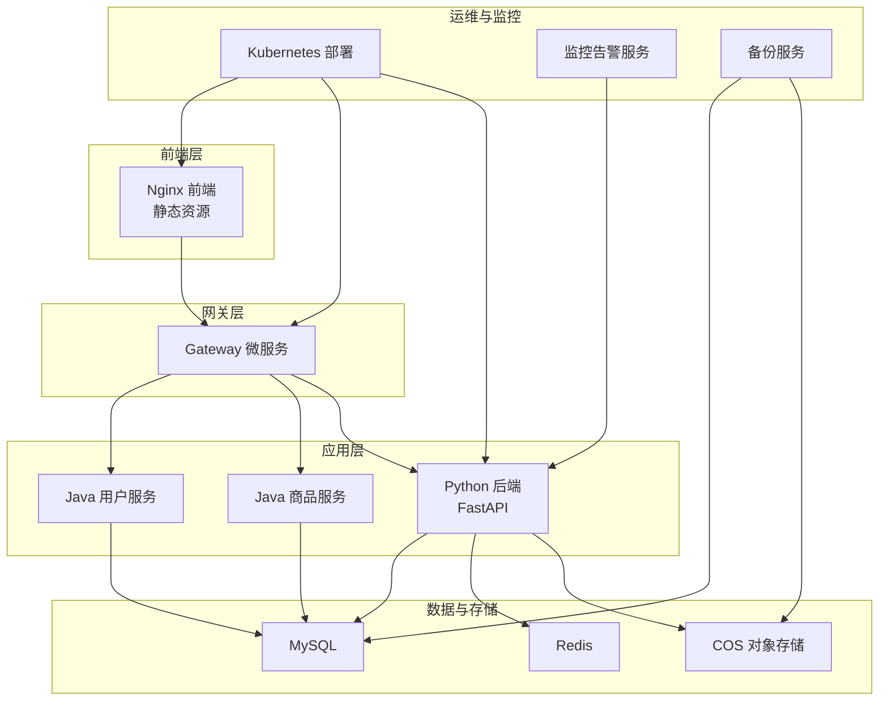
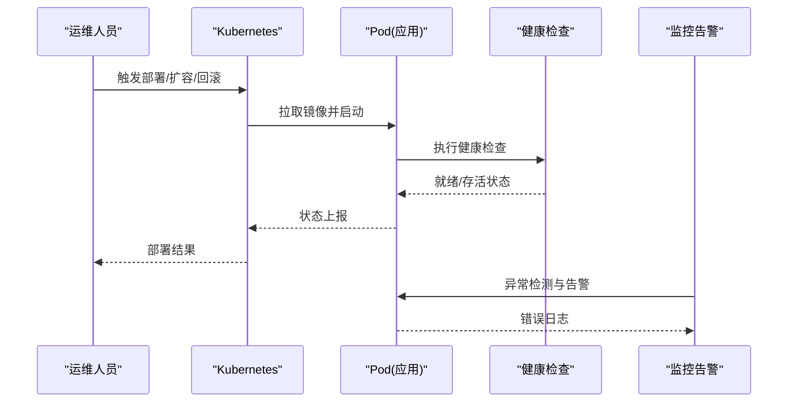
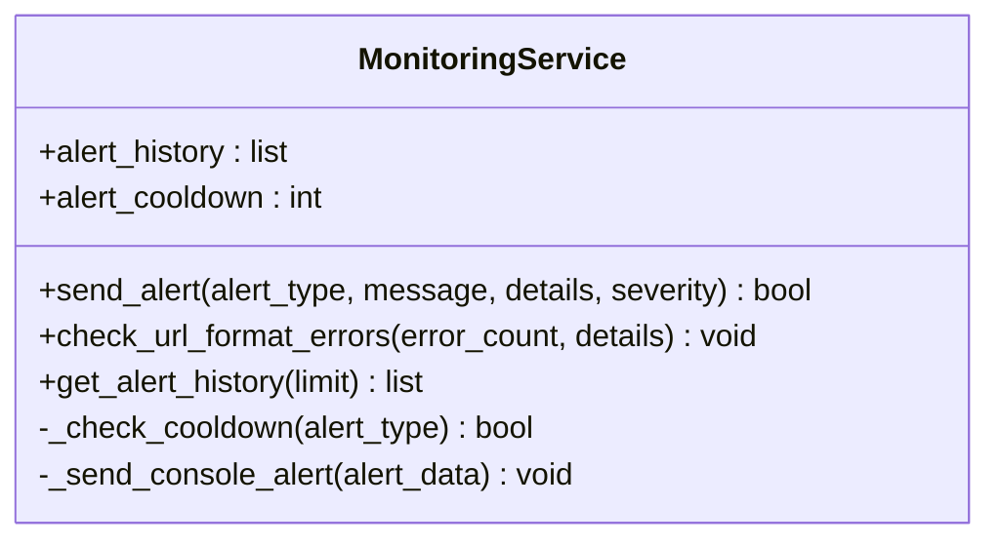
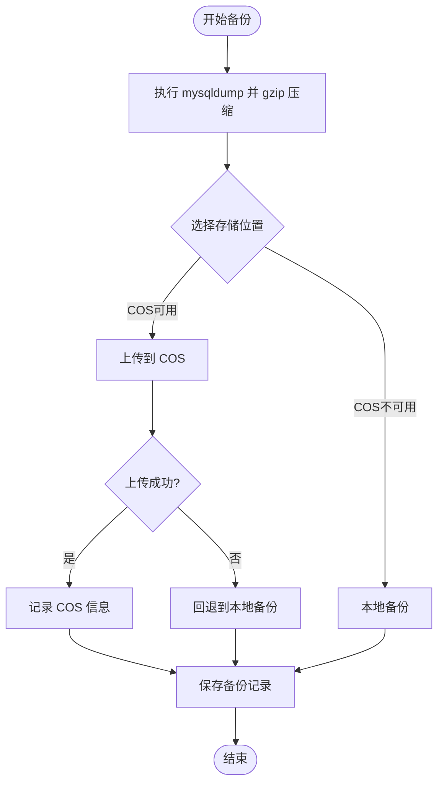
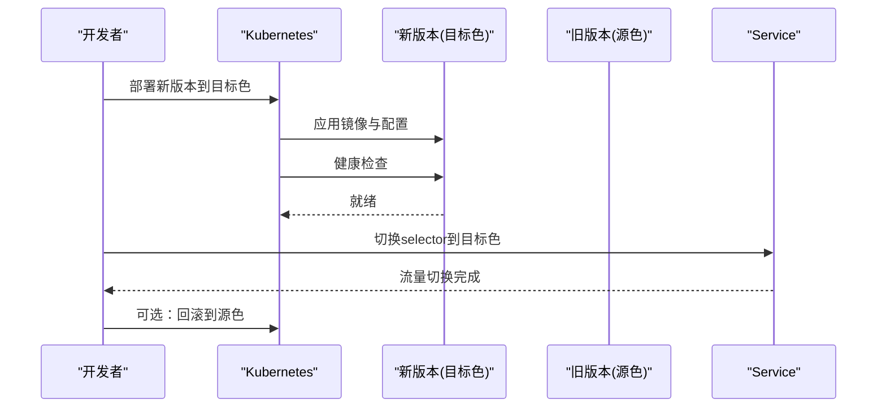
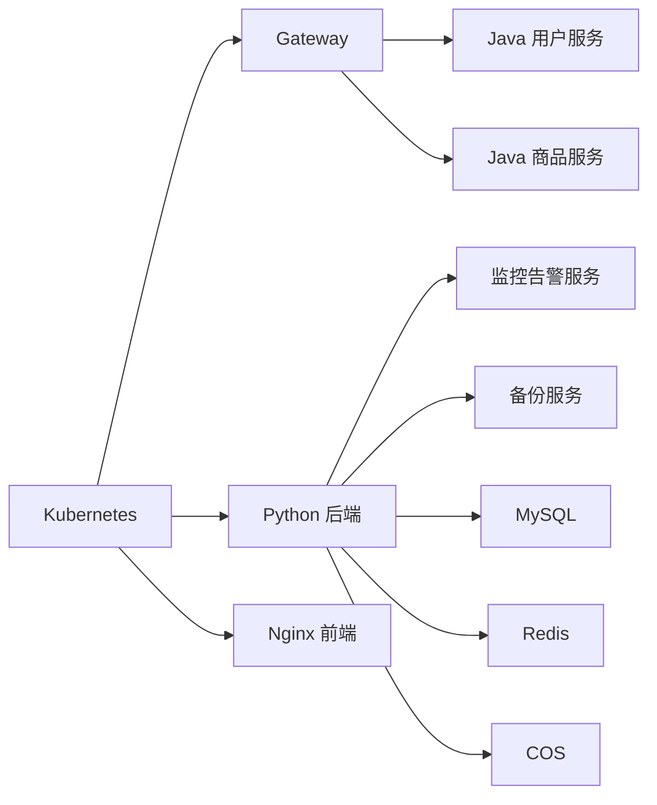

# 紧急故障处理

<cite>
**本文引用的文件**
- [Docker生产环境独立部署方案.md](file://docs/架构/Docker生产环境独立部署方案.md)
- [生产部署检查清单.md](file://docs/生产部署检查清单.md)
- [备份功能.md](file://docs/项目逻辑/系统设置/备份功能.md)
- [backup_service.py](file://backend/app/services/backup_service.py)
- [monitoring_service.py](file://backend/app/services/monitoring_service.py)
- [error_handler.py](file://backend/app/middleware/error_handler.py)
- [error_middleware.py](file://backend/app/middleware/error_middleware.py)
- [blue_green_deployment.py](file://scripts/deployment/blue_green_deployment.py)
- [canary_deployment.py](file://scripts/deployment/canary_deployment.py)
- [sync_dev_to_prod.py](file://scripts/deployment/sync_dev_to_prod.py)
- [docker-compose.prod-simple.yml](file://docker-compose.prod-simple.yml)
- [backend-deployment.yaml](file://k8s/backend-deployment.yaml)
- [system_config.py](file://backend/app/api/v1/system_config.py)
- [alert_system.py](file://scripts/env_consistency/alert_system.py)
</cite>

## 目录
1. [简介](#简介)
2. [项目结构](#项目结构)
3. [核心组件](#核心组件)
4. [架构概览](#架构概览)
5. [详细组件分析](#详细组件分析)
6. [依赖分析](#依赖分析)
7. [性能考虑](#性能考虑)
8. [故障排查指南](#故障排查指南)
9. [结论](#结论)
10. [附录](#附录)

## 简介
本手册面向思觉智贸系统生产环境的紧急故障处理，提供标准化的应急响应流程、故障分级与优先级、系统宕机恢复、数据丢失处理、服务降级策略、灾难恢复程序、故障定位方法、影响范围评估、业务连续性保障、回滚策略、热修复发布流程、紧急扩容操作、故障报告模板、根因分析方法与预防措施制定。内容基于仓库现有架构与脚本，确保可操作、可追溯。

## 项目结构
系统采用多语言混合架构：Python 后端（FastAPI）、Java 微服务（用户/商品/Gateway）、前端（Vue/Nginx）、数据库（MySQL）、缓存（Redis）、消息队列（Celery）、对象存储（COS）以及容器编排（Docker/Kubernetes）。生产部署通过独立镜像构建与健康检查保障稳定性。

图示来源
- [Docker生产环境独立部署方案.md:1-50](file://docs/架构/Docker生产环境独立部署方案.md#L1-L50)
- [backend-deployment.yaml](file://k8s/backend-deployment.yaml)
- [monitoring_service.py:23-93](file://backend/app/services/monitoring_service.py#L23-L93)
- [backup_service.py:111-133](file://backend/app/services/backup_service.py#L111-L133)

章节来源
- [Docker生产环境独立部署方案.md:1-50](file://docs/架构/Docker生产环境独立部署方案.md#L1-L50)
- [生产部署检查清单.md:120-196](file://docs/生产部署检查清单.md#L120-L196)

## 核心组件
- 监控告警服务：统一发送告警、冷却控制、历史记录查询，支持多种渠道扩展。
- 备份服务：支持本地与COS双备份，记录管理与异常回退。
- 错误处理中间件：统一捕获异常、记录日志、返回标准化错误响应。
- 部署脚本：蓝绿/金丝雀发布、快速部署、变更验证与备份。
- 健康检查与资源限制：Docker/K8s 健康检查、JVM参数与容器资源配额。

章节来源
- [monitoring_service.py:23-93](file://backend/app/services/monitoring_service.py#L23-L93)
- [backup_service.py:111-133](file://backend/app/services/backup_service.py#L111-L133)
- [error_handler.py](file://backend/app/middleware/error_handler.py)
- [error_middleware.py](file://backend/app/middleware/error_middleware.py)
- [blue_green_deployment.py:74-140](file://scripts/deployment/blue_green_deployment.py#L74-L140)
- [canary_deployment.py](file://scripts/deployment/canary_deployment.py)
- [docker-compose.prod-simple.yml](file://docker-compose.prod-simple.yml)
- [backend-deployment.yaml](file://k8s/backend-deployment.yaml)

## 架构概览
生产环境采用独立镜像构建，避免宿主机依赖；容器使用命名卷持久化关键数据；健康检查与资源限制保障稳定性；监控与备份贯穿全链路。

图示来源
- [Docker生产环境独立部署方案.md:1-50](file://docs/架构/Docker生产环境独立部署方案.md#L1-L50)
- [production-deployment-healthcheck:184-193](file://docs/生产部署检查清单.md#L184-L193)

## 详细组件分析

### 监控告警服务
- 功能要点：冷却控制、历史记录、多渠道扩展（控制台/邮件/企业微信）。
- 使用方式：通过服务实例发送告警，按类型与严重级别区分。
- 建议：在错误中间件与关键业务处集成，形成闭环告警。

图示来源
- [monitoring_service.py:23-93](file://backend/app/services/monitoring_service.py#L23-L93)

章节来源
- [monitoring_service.py:23-93](file://backend/app/services/monitoring_service.py#L23-L93)

### 备份服务
- 功能要点：mysqldump + gzip + 记录管理；优先COS上传，失败回退本地；支持删除与过期备份查询。
- 已知问题：配置缺失导致AttributeError；本地备份无法直接下载；同步备份阻塞；进度条不实时；无自动过期清理。
- 建议：补齐配置项、增加异步备份与进度上报、完善自动清理与下载机制。

图示来源
- [backup_service.py:111-133](file://backend/app/services/backup_service.py#L111-L133)

章节来源
- [backup_service.py:111-133](file://backend/app/services/backup_service.py#L111-L133)
- [备份功能.md:57-158](file://docs/项目逻辑/系统设置/备份功能.md#L57-L158)

### 错误处理中间件
- 功能要点：捕获异常、记录日志、返回标准化错误响应，避免敏感信息泄露。
- 建议：与监控服务联动，对高频错误触发告警。

章节来源
- [error_handler.py](file://backend/app/middleware/error_handler.py)
- [error_middleware.py](file://backend/app/middleware/error_middleware.py)

### 蓝绿/金丝雀发布
- 蓝绿：准备两套环境，切换服务selector实现零停机切换。
- 金丝雀：按比例切流，逐步扩大流量，降低风险。
- 建议：配合健康检查与监控阈值，失败自动回滚。

图示来源
- [blue_green_deployment.py:74-140](file://scripts/deployment/blue_green_deployment.py#L74-L140)

章节来源
- [blue_green_deployment.py:74-140](file://scripts/deployment/blue_green_deployment.py#L74-L140)
- [canary_deployment.py](file://scripts/deployment/canary_deployment.py)

### 环境一致性告警
- 功能要点：对比开发/生产配置文件、依赖版本、环境变量，生成差异报告并告警。
- 建议：纳入发布前检查清单，避免配置漂移引发故障。

章节来源
- [alert_system.py:160-168](file://scripts/env_consistency/alert_system.py#L160-L168)

## 依赖分析
- 组件耦合：监控与备份服务与后端API紧密耦合；部署脚本依赖Kubernetes CLI与镜像仓库。
- 外部依赖：MySQL/Redis/COS/对象存储；容器编排与健康检查；JVM参数与资源限制。
- 潜在风险：同步备份阻塞、COS配置缺失、本地备份下载限制、健康检查CMD展开问题。

图示来源
- [Docker生产环境独立部署方案.md:1-50](file://docs/架构/Docker生产环境独立部署方案.md#L1-L50)
- [monitoring_service.py:23-93](file://backend/app/services/monitoring_service.py#L23-L93)
- [backup_service.py:111-133](file://backend/app/services/backup_service.py#L111-L133)

章节来源
- [Docker生产环境独立部署方案.md:113-155](file://docs/架构/Docker生产环境独立部署方案.md#L113-L155)
- [docker-compose.prod-simple.yml](file://docker-compose.prod-simple.yml)

## 性能考虑
- JVM参数与容器资源：合理设置堆大小、GC策略、容器内存/CPU限制，避免OOM与资源争抢。
- 健康检查：缩短检查间隔与超时，提高故障感知速度。
- 备份策略：异步化与增量备份，减少对生产的影响。

章节来源
- [生产部署检查清单.md:120-196](file://docs/生产部署检查清单.md#L120-L196)

## 故障排查指南

### 系统宕机恢复
- 快速检查：确认容器健康状态、日志滚动与磁盘空间、数据库连接、Redis连通性。
- 重启策略：先重启不稳定组件，再逐步恢复上游依赖；必要时回滚至上一稳定版本。
- 资源核查：核对CPU/内存/磁盘配额，调整K8s资源请求/限制。

章节来源
- [Docker生产环境独立部署方案.md:113-155](file://docs/架构/Docker生产环境独立部署方案.md#L113-L155)
- [backend-deployment.yaml](file://k8s/backend-deployment.yaml)

### 数据丢失处理
- 立即评估：确认备份可用性与时间点，优先从COS或本地备份恢复。
- 恢复流程：停止写入、恢复到指定时间点、校验完整性、重新上线。
- 预防：补齐配置项、完善自动清理与下载机制、异步备份与进度上报。

章节来源
- [backup_service.py:111-133](file://backend/app/services/backup_service.py#L111-L133)
- [备份功能.md:57-158](file://docs/项目逻辑/系统设置/备份功能.md#L57-L158)

### 服务降级策略
- 网关层：对非关键接口降级或熔断，保证核心路径可用。
- 应用层：关闭非关键任务（如图片分析、统计报表），释放资源。
- 存储层：优先保证MySQL/Redis可用，COS降级为只读或延迟同步。

### 灾难恢复程序
- RTO/RPO：明确恢复时间与数据丢失容忍度，定期演练。
- 多活/异地：跨机房部署，自动化切换与回切。
- 验证：恢复后进行冒烟测试与性能回归。

### 故障定位快速方法
- 日志聚合：查看容器日志、错误中间件输出、监控告警。
- 健康检查：定位不健康Pod，检查探针配置与CMD展开问题。
- 配置一致性：使用环境一致性脚本比对配置差异。

章节来源
- [error_middleware.py](file://backend/app/middleware/error_middleware.py)
- [monitoring_service.py:23-93](file://backend/app/services/monitoring_service.py#L23-L93)
- [Docker生产环境独立部署方案.md:113-155](file://docs/架构/Docker生产环境独立部署方案.md#L113-L155)
- [alert_system.py:160-168](file://scripts/env_consistency/alert_system.py#L160-L168)

### 影响范围评估
- 业务影响：根据用户数、交易量、数据量评估影响面。
- 技术影响：涉及服务、存储、网络与第三方依赖。
- 传播路径：从前端到网关再到后端服务逐层排查。

### 业务连续性保障
- 快速恢复：优先恢复核心功能，再逐步完善。
- 降级开关：提供可配置的降级策略与开关。
- 备份与监控：确保备份可用与告警及时。

### 回滚策略制定
- 蓝绿回滚：切换selector回到旧版本，立即生效。
- 版本标记：镜像标签与部署标签保持一致，便于追溯。
- 自动化：结合脚本与CI/CD流水线，减少人为失误。

章节来源
- [blue_green_deployment.py:122-140](file://scripts/deployment/blue_green_deployment.py#L122-L140)

### 热修复发布流程
- 快速部署：跳过测试的快速部署脚本，适用于紧急修复。
- 变更验证：先在预生产验证，再灰度发布。
- 回滚预案：热修复失败立即回滚，确保业务稳定。

章节来源
- [sync_dev_to_prod.py:191-210](file://scripts/deployment/sync_dev_to_prod.py#L191-L210)

### 紧急扩容操作
- 手动扩容：通过K8s扩副本数，观察资源与健康检查。
- 自动伸缩：配置HPA，基于CPU/内存/自定义指标弹性伸缩。
- 资源上限：避免过度扩容导致资源争抢。

章节来源
- [backend-deployment.yaml](file://k8s/backend-deployment.yaml)
- [生产部署检查清单.md:184-193](file://docs/生产部署检查清单.md#L184-L193)

### 故障报告模板
- 基本信息：时间、地点、事件、影响范围、负责人。
- 现象描述：现象、时间线、影响评估。
- 根因分析：技术原因、传播路径、关联因素。
- 处理过程：处置步骤、回滚/扩容/降级、验证结果。
- 预防措施：修复方案、配置修正、流程改进、培训。

### 根因分析方法
- 5 Whys：层层追问，找到本质原因。
- 因果图：梳理人/机/料/法/环。
- 复盘会议：全员参与，形成改进清单。

### 预防措施制定
- 配置治理：使用一致性脚本定期检查，禁止手工修改生产配置。
- 发布规范：强制测试、灰度发布、回滚预案。
- 监控完善：补充缺失的监控指标与告警阈值。
- 文档更新：将最佳实践固化为SOP。

## 结论
通过标准化的应急响应流程、完善的监控与备份体系、可靠的发布与回滚机制，以及严格的配置治理与预防措施，思觉智贸系统可在生产环境中快速应对各类紧急故障，最大限度保障业务连续性与数据安全。

## 附录

### 故障分级与优先级
- P0：系统全面瘫痪、数据丢失、核心业务中断
- P1：重要功能不可用、大量用户受影响
- P2：一般功能异常、部分用户受影响
- P3：轻微问题、不影响使用

### 常用命令与入口
- 蓝绿部署：更新镜像与标签、等待就绪、切换流量
- 金丝雀发布：按百分比切流、观察指标
- 备份管理：启动备份、查询记录、删除过期备份
- 健康检查：查看容器健康状态、修复CMD展开问题

章节来源
- [blue_green_deployment.py:74-140](file://scripts/deployment/blue_green_deployment.py#L74-L140)
- [system_config.py:512-577](file://backend/app/api/v1/system_config.py#L512-L577)
- [Docker生产环境独立部署方案.md:113-155](file://docs/架构/Docker生产环境独立部署方案.md#L113-L155)