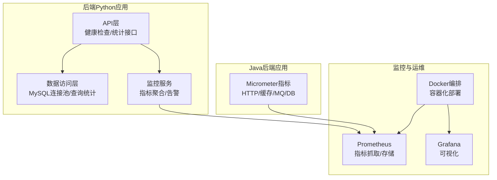
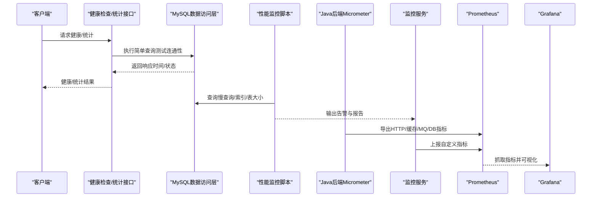
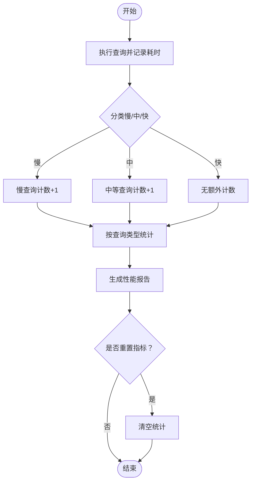
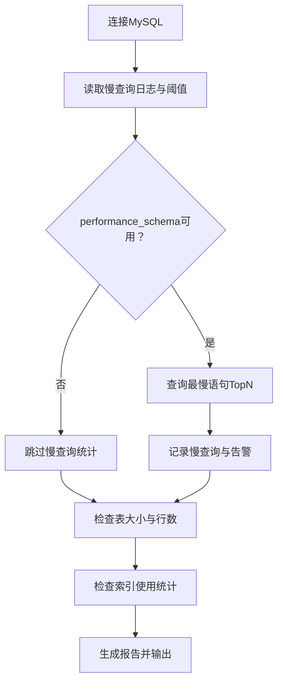
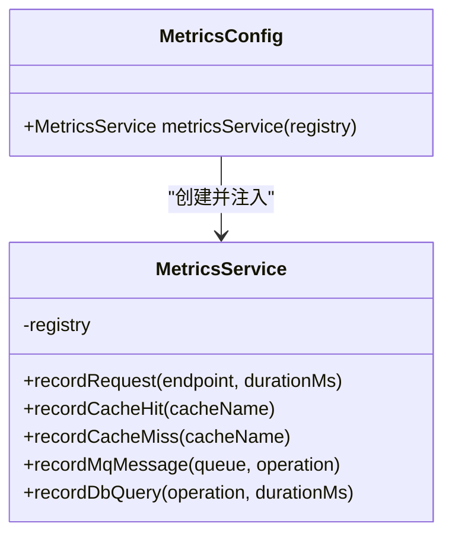
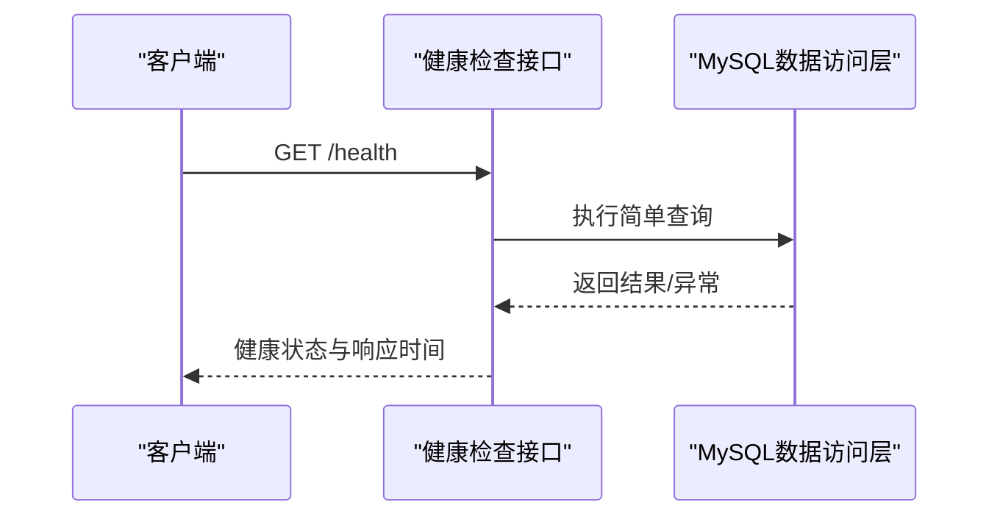
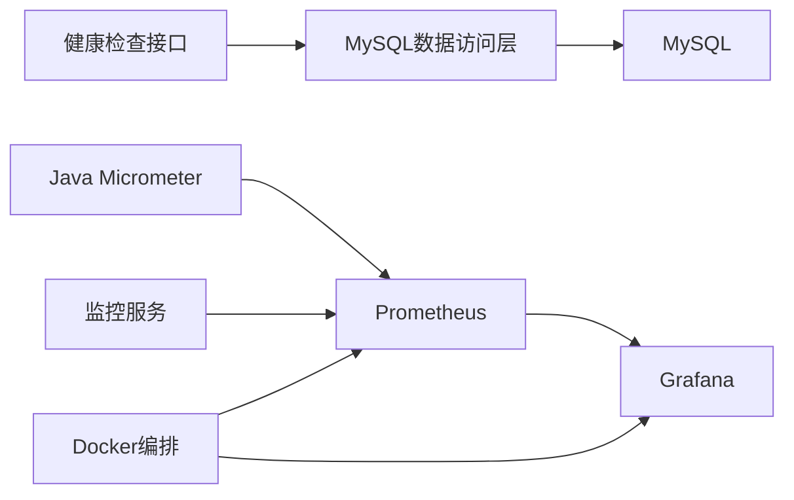

# 性能监控

<cite>
**本文引用的文件**
- [mysql_repo.py](file://backend/app/repositories/mysql_repo.py)
- [performance_monitor.py（脚本）](file://scripts/monitoring/performance_monitor.py)
- [MetricsConfig.java](file://java-backend/src/main/java/com/sjzm/config/MetricsConfig.java)
- [health.py（后端健康检查）](file://backend/app/api/v1/health.py)
- [statistics.py（统计接口）](file://backend/app/api/v1/statistics.py)
- [performance_monitor.py（系统工具）](file://scripts/utils/system/performance_monitor.py)
- [monitoring_service.py](file://backend/app/services/monitoring_service.py)
- [prometheus.yml](file://prometheus/prometheus.yml)
- [docker-compose.prod.yml](file://docker-compose.prod.yml)
- [docker-compose.yml](file://docker-compose.yml)
- [Dockerfile](file://backend/Dockerfile)
- [application.yml](file://java-backend/src/main/resources/application.yml)
</cite>

## 目录
1. [简介](#简介)
2. [项目结构](#项目结构)
3. [核心组件](#核心组件)
4. [架构总览](#架构总览)
5. [详细组件分析](#详细组件分析)
6. [依赖关系分析](#依赖关系分析)
7. [性能考量](#性能考量)
8. [故障排查指南](#故障排查指南)
9. [结论](#结论)
10. [附录](#附录)

## 简介
本文件面向运维与开发团队，构建“思觉智贸”数据库性能监控的完整体系文档，涵盖查询响应时间、连接数、缓存命中率、慢查询分析、执行计划诊断、资源使用与存储空间、网络延迟、性能基线与趋势分析、容量规划以及监控数据采集、存储与可视化方案。文档以仓库现有实现为基础，结合最佳实践，提供可操作的配置与优化建议。

## 项目结构
围绕数据库性能监控的关键位置与职责如下：
- 后端Python应用
  - 数据访问层：MySQL连接池与查询统计
  - 健康检查与统计接口：数据库连通性与基础指标
  - 监控服务：统一指标上报与告警
- Java后端应用
  - Micrometer指标导出：HTTP请求、缓存、消息队列、数据库查询等
- 脚本与工具
  - MySQL性能监控脚本：慢查询、索引使用、表大小
  - 系统级性能监控脚本：CPU/内存/IO/网络
- 运维编排与监控
  - Prometheus配置与容器编排
  - Docker镜像与运行参数

图表来源
- [health.py（后端健康检查）:56-88](file://backend/app/api/v1/health.py#L56-L88)
- [mysql_repo.py:315-386](file://backend/app/repositories/mysql_repo.py#L315-L386)
- [MetricsConfig.java:45-75](file://java-backend/src/main/java/com/sjzm/config/MetricsConfig.java#L45-L75)
- [docker-compose.yml:1-200](file://docker-compose.yml#L1-L200)
- [prometheus.yml:1-200](file://prometheus/prometheus.yml#L1-L200)

章节来源
- [docker-compose.yml:1-200](file://docker-compose.yml#L1-L200)
- [prometheus.yml:1-200](file://prometheus/prometheus.yml#L1-L200)

## 核心组件
- MySQL查询统计与性能报告
  - 在数据访问层对查询执行时间进行统计，按慢/中/快分级，并按查询类型聚合，支持生成性能报告与重置指标。
- 慢查询与索引使用检查脚本
  - 通过information_schema与performance_schema检查慢查询、索引使用与表大小，输出告警并生成报告。
- Micrometer指标导出（Java后端）
  - 通过MeterRegistry记录HTTP请求、缓存命中/未命中、MQ消息、数据库查询耗时等指标。
- 健康检查与统计接口
  - 健康检查接口对数据库连通性与响应时间进行探测；统计接口提供基础业务指标。
- 监控服务
  - 统一指标聚合与告警，支持与Prometheus集成。
- 系统级性能监控脚本
  - 收集CPU/内存/IO/网络等系统指标，辅助定位数据库性能瓶颈。

章节来源
- [mysql_repo.py:315-386](file://backend/app/repositories/mysql_repo.py#L315-L386)
- [performance_monitor.py（脚本）:85-185](file://scripts/monitoring/performance_monitor.py#L85-L185)
- [MetricsConfig.java:45-75](file://java-backend/src/main/java/com/sjzm/config/MetricsConfig.java#L45-L75)
- [health.py（后端健康检查）:56-88](file://backend/app/api/v1/health.py#L56-L88)
- [statistics.py（统计接口）:82-117](file://backend/app/api/v1/statistics.py#L82-L117)
- [monitoring_service.py:1-200](file://backend/app/services/monitoring_service.py#L1-L200)
- [performance_monitor.py（系统工具）:1-200](file://scripts/utils/system/performance_monitor.py#L1-L200)

## 架构总览
下图展示了数据库性能监控在系统中的位置与交互：

图表来源
- [health.py（后端健康检查）:56-88](file://backend/app/api/v1/health.py#L56-L88)
- [mysql_repo.py:315-386](file://backend/app/repositories/mysql_repo.py#L315-L386)
- [performance_monitor.py（脚本）:85-185](file://scripts/monitoring/performance_monitor.py#L85-L185)
- [MetricsConfig.java:45-75](file://java-backend/src/main/java/com/sjzm/config/MetricsConfig.java#L45-L75)
- [monitoring_service.py:1-200](file://backend/app/services/monitoring_service.py#L1-L200)
- [prometheus.yml:1-200](file://prometheus/prometheus.yml#L1-L200)

## 详细组件分析

### MySQL查询统计与性能报告
- 功能要点
  - 统计查询总数、总耗时、平均耗时、慢查询比例与中等查询比例。
  - 按查询类型（如SELECT/INSERT/UPDATE/DELETE）统计次数、总耗时与慢查询次数。
  - 提供性能报告与指标重置能力。
- 关键阈值
  - 慢查询阈值：超过特定毫秒数视为慢查询。
  - 中等查询阈值：用于区分慢/中等级别。
- 使用场景
  - 运行时性能观测、接口调优、慢查询定位与优化效果验证。

图表来源
- [mysql_repo.py:315-386](file://backend/app/repositories/mysql_repo.py#L315-L386)

章节来源
- [mysql_repo.py:315-386](file://backend/app/repositories/mysql_repo.py#L315-L386)

### 慢查询与索引使用检查脚本
- 功能要点
  - 检查慢查询日志状态与阈值，提取performance_schema中最慢的若干语句。
  - 统计表大小（数据/索引）、行数，输出告警（如平均延迟超过阈值）。
  - 检查索引使用统计（基于innodb_index_stats），辅助判断索引有效性。
- 告警策略
  - 当慢查询平均延迟超过设定阈值时，生成严重告警。
- 报告输出
  - 控制台打印与文件落盘，便于归档与趋势分析。

图表来源
- [performance_monitor.py（脚本）:85-185](file://scripts/monitoring/performance_monitor.py#L85-L185)

章节来源
- [performance_monitor.py（脚本）:85-185](file://scripts/monitoring/performance_monitor.py#L85-L185)

### Micrometer指标导出（Java后端）
- 指标类型
  - HTTP服务器请求计时器（endpoint/status维度）。
  - 缓存命中/未命中计数器（cache维度）。
  - MQ消息计数器（queue/operation维度）。
  - 数据库查询计时器（operation维度）。
- 集成方式
  - 通过Spring配置注册MetricsService，统一记录指标。
  - 结合Prometheus导出器，Prometheus定时抓取。

图表来源
- [MetricsConfig.java:45-75](file://java-backend/src/main/java/com/sjzm/config/MetricsConfig.java#L45-L75)

章节来源
- [MetricsConfig.java:45-75](file://java-backend/src/main/java/com/sjzm/config/MetricsConfig.java#L45-L75)

### 健康检查与统计接口
- 健康检查
  - 执行简单查询测试数据库连通性，记录响应时间，异常时返回unhealthy并附错误信息。
- 统计接口
  - 提供产品、图片、用户等基础统计与存储估算，辅助容量规划。

图表来源
- [health.py（后端健康检查）:56-88](file://backend/app/api/v1/health.py#L56-L88)

章节来源
- [health.py（后端健康检查）:56-88](file://backend/app/api/v1/health.py#L56-L88)
- [statistics.py（统计接口）:82-117](file://backend/app/api/v1/statistics.py#L82-L117)

### 监控服务与指标聚合
- 职责
  - 聚合来自不同组件的指标，统一上报至Prometheus。
  - 提供告警规则与通知通道配置入口。
- 建议
  - 将数据库连接池状态、查询类型分布、慢查询比例等纳入统一视图。

章节来源
- [monitoring_service.py:1-200](file://backend/app/services/monitoring_service.py#L1-L200)

### 系统级性能监控脚本
- 能力
  - 收集CPU/内存/IO/网络等系统指标，辅助定位数据库性能瓶颈。
- 应用
  - 与数据库实例所在主机或容器监控结合，形成端到端画像。

章节来源
- [performance_monitor.py（系统工具）:1-200](file://scripts/utils/system/performance_monitor.py#L1-L200)

## 依赖关系分析
- 组件耦合
  - Python后端的健康检查依赖数据访问层；数据访问层依赖MySQL连接池。
  - Java后端通过Micrometer导出指标，Prometheus统一抓取。
  - 监控服务作为聚合层，向上游组件提供统一指标出口。
- 外部依赖
  - Prometheus负责指标抓取与存储。
  - Grafana负责可视化展示。
  - Docker编排负责容器化部署与扩缩容。

图表来源
- [health.py（后端健康检查）:56-88](file://backend/app/api/v1/health.py#L56-L88)
- [mysql_repo.py:315-386](file://backend/app/repositories/mysql_repo.py#L315-L386)
- [MetricsConfig.java:45-75](file://java-backend/src/main/java/com/sjzm/config/MetricsConfig.java#L45-L75)
- [monitoring_service.py:1-200](file://backend/app/services/monitoring_service.py#L1-L200)
- [prometheus.yml:1-200](file://prometheus/prometheus.yml#L1-L200)
- [docker-compose.yml:1-200](file://docker-compose.yml#L1-L200)

章节来源
- [docker-compose.yml:1-200](file://docker-compose.yml#L1-L200)
- [prometheus.yml:1-200](file://prometheus/prometheus.yml#L1-L200)

## 性能考量
- 查询响应时间
  - 通过健康检查接口与数据访问层统计，持续跟踪平均响应时间与慢查询比例。
  - 建立基线：在稳定期记录平均响应时间与慢查询占比，作为阈值设定依据。
- 连接数
  - 监控连接池使用率与峰值，避免连接泄漏与超限。
  - 建议：根据并发请求峰值与慢查询占比，动态调整连接池大小。
- 缓存命中率
  - 通过Micrometer记录缓存命中/未命中，结合业务热点数据评估命中率。
  - 建议：针对低命中率场景引入预热策略与热点数据驻留。
- 存储空间管理
  - 使用监控脚本统计表大小与行数，识别增长异常的表。
  - 建议：定期清理历史数据、分区归档与索引维护。
- 网络延迟
  - 通过系统级脚本与容器网络监控，识别跨主机/跨区域延迟。
  - 建议：就近部署、连接复用与批量处理降低RTT影响。
- 指标收集与存储
  - Prometheus默认保留策略与压缩参数需结合数据规模与保留周期进行调优。
- 可视化展示
  - Grafana仪表盘应包含：响应时间趋势、慢查询TopN、连接池使用率、缓存命中率、存储增长曲线、系统资源占用。

## 故障排查指南
- 数据库连通性问题
  - 使用健康检查接口快速验证；若失败，检查连接字符串、认证信息与网络连通性。
- 慢查询定位
  - 使用监控脚本查看performance_schema中的慢查询摘要，结合业务SQL进行优化。
  - 关注索引使用情况，必要时新增或重构索引。
- 连接池耗尽
  - 观察连接池指标，排查长事务、未释放连接与高并发短连接风暴。
- 缓存抖动
  - 关注缓存命中率波动，核对预热策略与热点数据更新频率。
- 存储增长异常
  - 通过表大小统计识别异常增长，配合归档与清理策略。
- 网络抖动
  - 使用系统级监控脚本与容器网络指标，定位跨节点/跨地域链路问题。

章节来源
- [health.py（后端健康检查）:56-88](file://backend/app/api/v1/health.py#L56-L88)
- [performance_monitor.py（脚本）:85-185](file://scripts/monitoring/performance_monitor.py#L85-L185)
- [mysql_repo.py:315-386](file://backend/app/repositories/mysql_repo.py#L315-L386)

## 结论
本监控体系以“健康检查+查询统计+慢查询分析+指标导出+可视化”为主线，结合系统级监控与容量规划，形成闭环的数据库性能治理方案。建议在生产环境中持续运行健康检查与慢查询扫描，建立性能基线与告警阈值，配合容量规划与优化迭代，保障系统稳定与高性能。

## 附录

### 监控指标与阈值建议
- 查询响应时间
  - P95/P99目标：根据业务SLA设定；异常：连续时段超过基线上限。
- 慢查询比例
  - 建议阈值：单类查询慢查询占比超过10%触发调查。
- 连接池使用率
  - 建议阈值：超过80%预警，90%告警。
- 缓存命中率
  - 建议阈值：低于85%需优化热点与预热。
- 存储增长速率
  - 建议阈值：月环比超过30%需审查数据保留策略。
- 网络延迟
  - 建议阈值：P95超过20ms需排查链路。

### 配置与部署要点
- Prometheus抓取间隔与保留策略
  - 根据数据量与查询复杂度调整抓取间隔与保留天数。
- Docker编排
  - 确保Prometheus/Grafana与后端服务在同一网络，合理映射端口与持久化卷。
- Java后端Micrometer
  - 确认导出器启用与端点可达，Prometheus正确配置job与target。

章节来源
- [prometheus.yml:1-200](file://prometheus/prometheus.yml#L1-L200)
- [docker-compose.yml:1-200](file://docker-compose.yml#L1-L200)
- [application.yml:1-200](file://java-backend/src/main/resources/application.yml#L1-L200)
- [Dockerfile:1-200](file://backend/Dockerfile#L1-L200)