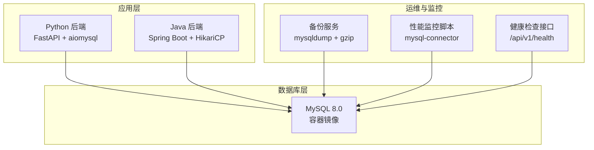
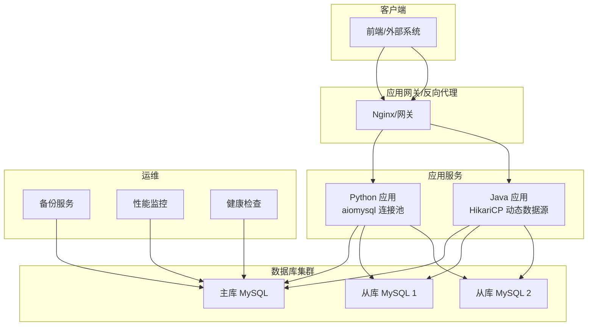
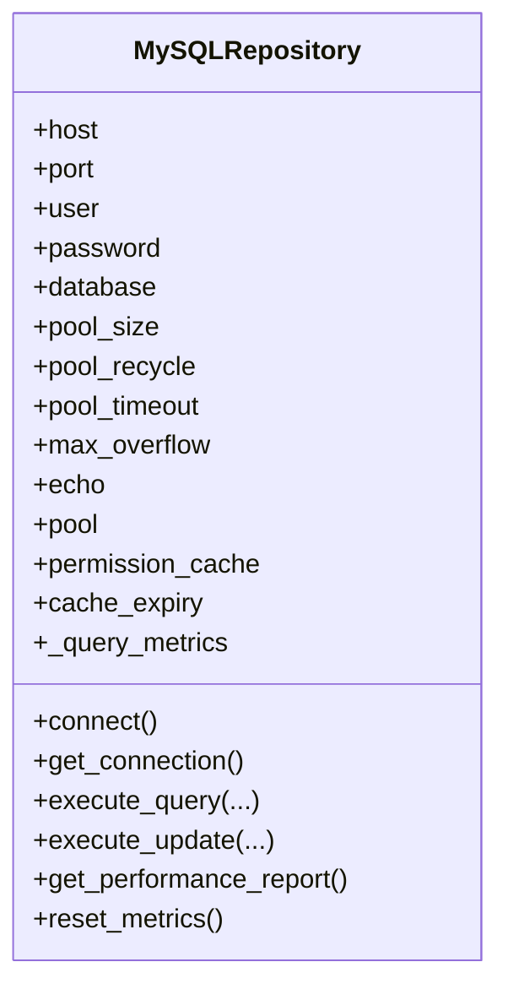
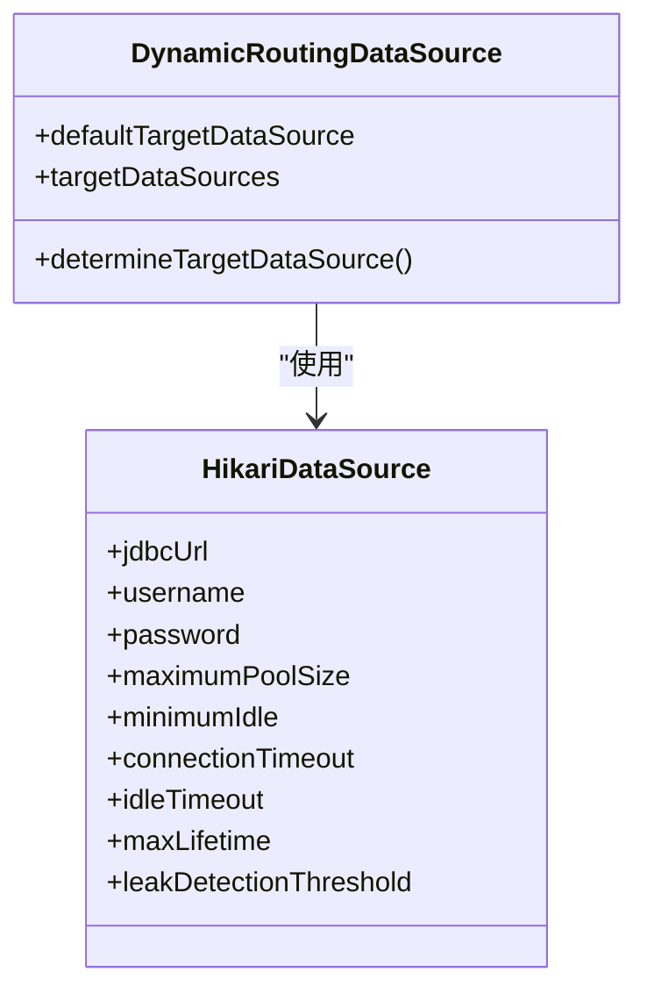
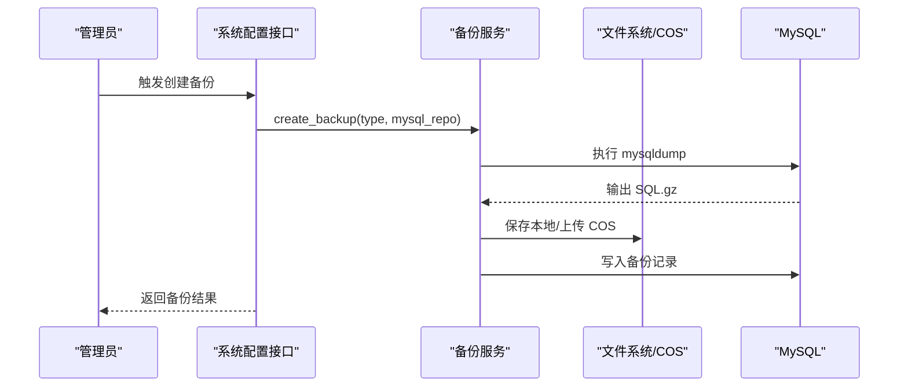
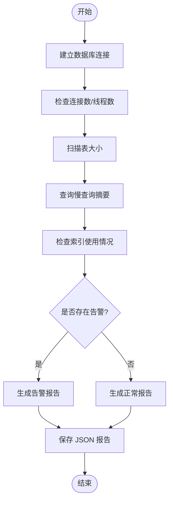
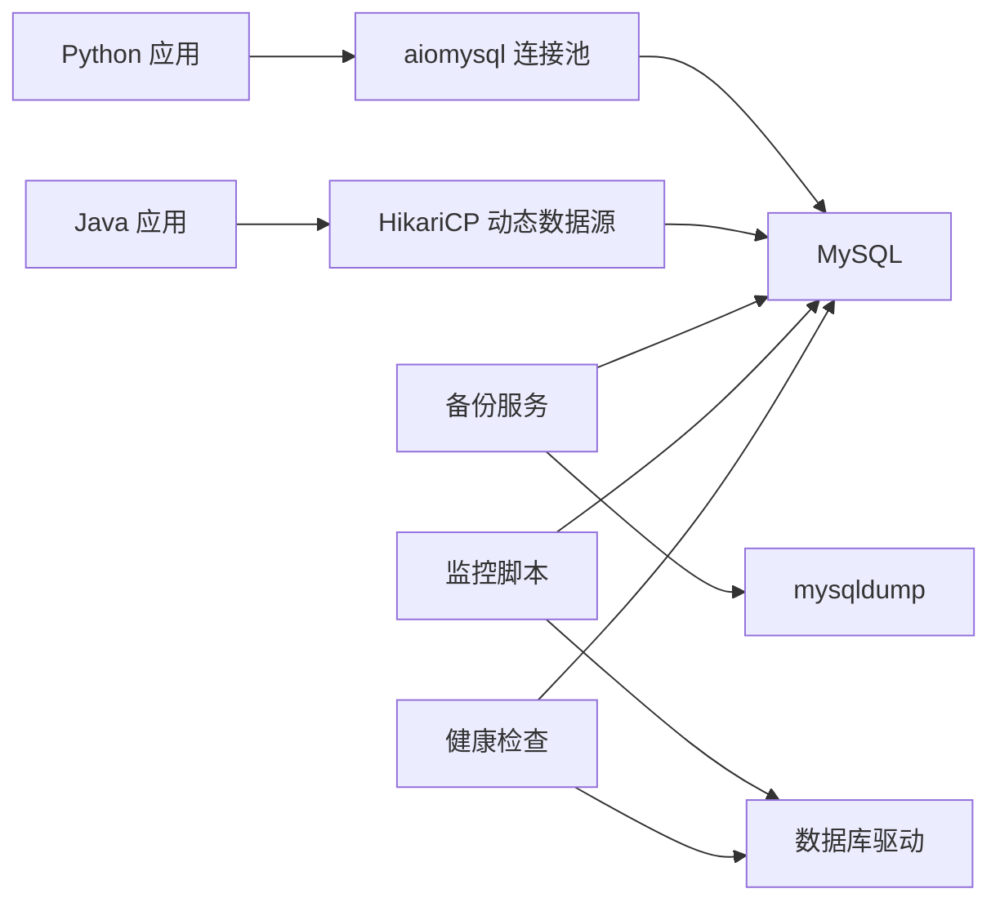

# 数据库架构

<cite>
**本文引用的文件**
- [docker-compose.yml](file://docker-compose.yml)
- [mysql_repo.py](file://backend/app/repositories/mysql_repo.py)
- [DynamicDataSourceConfig.java](file://java-backend/src/main/java/com/sjzm/config/DynamicDataSourceConfig.java)
- [backup_service.py](file://backend/app/services/backup_service.py)
- [performance_monitor.py](file://scripts/monitoring/performance_monitor.py)
- [01-init.sql](file://mysql/init/01-init.sql)
- [docker-compose.prod.yml](file://docker-compose.prod.yml)
- [docker-compose.prod-simple.yml](file://docker-compose.prod-simple.yml)
- [system_config.py](file://backend/app/api/v1/system_config.py)
- [health.py](file://backend/app/api/v1/health.py)
</cite>

## 目录
1. [引言](#引言)
2. [项目结构](#项目结构)
3. [核心组件](#核心组件)
4. [架构总览](#架构总览)
5. [详细组件分析](#详细组件分析)
6. [依赖关系分析](#依赖关系分析)
7. [性能考虑](#性能考虑)
8. [故障排查指南](#故障排查指南)
9. [结论](#结论)
10. [附录](#附录)

## 引言
本文件面向 DBA 与开发团队，系统化阐述“思觉智贸”项目的数据库架构设计与运维实践。重点覆盖以下方面：
- 整体设计思路与技术决策
- 连接池配置、事务管理与并发控制
- 主从复制、读写分离与高可用设计
- 服务器配置、内存与存储优化
- 备份恢复与灾难恢复策略
- 性能监控指标与调优建议
- 数据一致性保障机制

## 项目结构
数据库相关基础设施主要由容器编排、Python 异步连接池、Java 动态数据源路由以及备份与监控脚本构成。下图展示数据库在整体系统中的位置与交互。

图表来源
- [docker-compose.yml:7-35](file://docker-compose.yml#L7-L35)
- [mysql_repo.py:88-110](file://backend/app/repositories/mysql_repo.py#L88-L110)
- [DynamicDataSourceConfig.java:74-88](file://java-backend/src/main/java/com/sjzm/config/DynamicDataSourceConfig.java#L74-L88)
- [backup_service.py:43-133](file://backend/app/services/backup_service.py#L43-L133)
- [performance_monitor.py:200-236](file://scripts/monitoring/performance_monitor.py#L200-L236)
- [health.py:37-79](file://backend/app/api/v1/health.py#L37-L79)

章节来源
- [docker-compose.yml:1-35](file://docker-compose.yml#L1-L35)

## 核心组件
- Python 异步连接池（aiomysql）：提供高性能异步连接池，支持池大小、回收周期、超时与溢出配置，并内置查询性能统计。
- Java 动态数据源路由（HikariCP + 自定义路由）：通过动态数据源实现读写分离，支持主从切换与连接池参数精细化配置。
- 备份服务：基于 mysqldump 的全量备份，支持本地与云端（COS）存储，自动记录备份元数据。
- 性能监控脚本：采集连接数、表大小、慢查询与索引使用情况，生成 JSON 报告并触发告警。
- 健康检查接口：对数据库执行轻量查询，返回响应时间与健康状态。

章节来源
- [mysql_repo.py:55-80](file://backend/app/repositories/mysql_repo.py#L55-L80)
- [mysql_repo.py:88-110](file://backend/app/repositories/mysql_repo.py#L88-L110)
- [mysql_repo.py:368-384](file://backend/app/repositories/mysql_repo.py#L368-L384)
- [DynamicDataSourceConfig.java:65-94](file://java-backend/src/main/java/com/sjzm/config/DynamicDataSourceConfig.java#L65-L94)
- [backup_service.py:27-42](file://backend/app/services/backup_service.py#L27-L42)
- [performance_monitor.py:38-48](file://scripts/monitoring/performance_monitor.py#L38-L48)
- [health.py:37-79](file://backend/app/api/v1/health.py#L37-L79)

## 架构总览
下图展示数据库访问链路与高可用设计要点：

图表来源
- [mysql_repo.py:88-110](file://backend/app/repositories/mysql_repo.py#L88-L110)
- [DynamicDataSourceConfig.java:65-94](file://java-backend/src/main/java/com/sjzm/config/DynamicDataSourceConfig.java#L65-L94)
- [backup_service.py:43-133](file://backend/app/services/backup_service.py#L43-L133)
- [performance_monitor.py:200-236](file://scripts/monitoring/performance_monitor.py#L200-L236)
- [health.py:37-79](file://backend/app/api/v1/health.py#L37-L79)

## 详细组件分析

### Python 异步连接池（aiomysql）
- 连接池参数
  - 池大小、回收周期、超时与最大溢出数，用于平衡吞吐与资源占用。
  - 支持按需创建与释放连接，避免阻塞。
- 事务与隔离
  - 在获取连接时设置会话隔离级别为“已提交读”，确保能读取到最新提交数据，降低脏读风险。
- 性能统计
  - 统计总查询数、慢查询比例、中等查询比例与各类查询类型的耗时分布，便于定位热点与异常。

图表来源
- [mysql_repo.py:55-80](file://backend/app/repositories/mysql_repo.py#L55-L80)
- [mysql_repo.py:88-110](file://backend/app/repositories/mysql_repo.py#L88-L110)
- [mysql_repo.py:315-351](file://backend/app/repositories/mysql_repo.py#L315-L351)

章节来源
- [mysql_repo.py:55-80](file://backend/app/repositories/mysql_repo.py#L55-L80)
- [mysql_repo.py:88-110](file://backend/app/repositories/mysql_repo.py#L88-L110)
- [mysql_repo.py:315-351](file://backend/app/repositories/mysql_repo.py#L315-L351)

### Java 动态数据源路由（HikariCP）
- 动态路由
  - 通过自定义路由数据源将“默认”指向主库，“目标数据源”映射多个从库，实现读写分离。
- 连接池参数
  - 最大池大小、最小空闲、连接超时、空闲超时、最大生存时间、泄漏检测阈值，保障稳定性与资源回收。
- JDBC 驱动
  - 使用 MySQL Connector/J，确保兼容性与性能。

图表来源
- [DynamicDataSourceConfig.java:65-94](file://java-backend/src/main/java/com/sjzm/config/DynamicDataSourceConfig.java#L65-L94)

章节来源
- [DynamicDataSourceConfig.java:65-94](file://java-backend/src/main/java/com/sjzm/config/DynamicDataSourceConfig.java#L65-L94)

### 备份与恢复
- 备份策略
  - 全量备份：mysqldump + gzip，生成带时间戳的 SQL 文件。
  - 存储：本地目录与云端 COS 双通道；支持上传失败回退至本地。
  - 记录：将备份名称、类型、大小、状态、存储位置、创建时间等写入数据库。
- 恢复流程
  - 本地恢复：直接执行 SQL 文件。
  - 云端恢复：先下载对象到本地再执行。
- 过期清理
  - 提供接口查询超过阈值（如 3 天）的过期备份记录，便于自动化清理。

图表来源
- [backup_service.py:43-133](file://backend/app/services/backup_service.py#L43-L133)
- [system_config.py:480-561](file://backend/app/api/v1/system_config.py#L480-L561)

章节来源
- [backup_service.py:27-42](file://backend/app/services/backup_service.py#L27-L42)
- [backup_service.py:43-133](file://backend/app/services/backup_service.py#L43-L133)
- [system_config.py:480-561](file://backend/app/api/v1/system_config.py#L480-L561)

### 性能监控与健康检查
- 性能监控
  - 关键指标：当前连接数、最大使用连接数、运行中线程、表大小、慢查询、索引使用率。
  - 告警：连接数过高、慢查询阈值越界触发警告。
  - 报告：生成 JSON 文件，便于归档与趋势分析。
- 健康检查
  - 接口对数据库执行轻量查询，返回状态与响应时间，作为服务健康度的一部分。

图表来源
- [performance_monitor.py:50-149](file://scripts/monitoring/performance_monitor.py#L50-L149)
- [health.py:37-79](file://backend/app/api/v1/health.py#L37-L79)

章节来源
- [performance_monitor.py:38-48](file://scripts/monitoring/performance_monitor.py#L38-L48)
- [performance_monitor.py:50-149](file://scripts/monitoring/performance_monitor.py#L50-L149)
- [health.py:37-79](file://backend/app/api/v1/health.py#L37-L79)

### 数据库初始化与基础配置
- 初始化脚本
  - 提供基础表结构与初始数据，确保首次部署快速就绪。
- 容器编排
  - MySQL 8.0 容器，设置字符集与校对规则，持久化数据卷，健康检查探针。

章节来源
- [01-init.sql:1-50](file://mysql/init/01-init.sql#L1-L50)
- [docker-compose.yml:7-35](file://docker-compose.yml#L7-L35)

## 依赖关系分析
- Python 应用依赖 aiomysql 连接池，通过统一仓库封装查询与更新。
- Java 应用依赖 HikariCP 与动态数据源路由，实现读写分离。
- 备份服务依赖 mysqldump 与存储后端（本地/COS），并写回备份记录。
- 监控脚本与健康检查接口依赖数据库驱动与配置参数。

图表来源
- [mysql_repo.py:88-110](file://backend/app/repositories/mysql_repo.py#L88-L110)
- [DynamicDataSourceConfig.java:74-88](file://java-backend/src/main/java/com/sjzm/config/DynamicDataSourceConfig.java#L74-L88)
- [backup_service.py:43-133](file://backend/app/services/backup_service.py#L43-L133)
- [performance_monitor.py:200-236](file://scripts/monitoring/performance_monitor.py#L200-L236)
- [health.py:37-79](file://backend/app/api/v1/health.py#L37-L79)

## 性能考虑
- 连接池优化
  - 根据 QPS 与并发请求峰值调整池大小与超时参数，避免连接争用与泄漏。
  - 合理设置回收周期，防止连接老化导致的性能抖动。
- 事务与隔离
  - 已设置“已提交读”隔离级别，兼顾一致性与并发性；对于强一致场景可评估升级为“可重复读”。
- 索引与查询
  - 结合慢查询日志与监控报告，定期审查缺失索引与低效查询，必要时添加复合索引或改写 SQL。
- 存储与 IO
  - 将数据与日志分离到不同卷，使用 SSD 提升随机 IO；合理设置 innodb_buffer_pool_size 与 log_file_size。
- 监控与告警
  - 建议将监控脚本纳入定时任务，持续跟踪连接数、慢查询与表增长趋势，提前预警。

## 故障排查指南
- 连接池耗尽
  - 现象：请求堆积、超时异常。
  - 排查：查看连接池指标与慢查询报告，核对池大小与超时配置，检查是否存在长事务或未释放连接。
- 读写冲突
  - 现象：写入延迟高、读取阻塞。
  - 排查：确认读写分离路由是否正确，检查从库同步延迟与只读权限。
- 备份失败
  - 现象：备份记录为空或上传失败。
  - 排查：检查备份目录权限、mysqldump 可用性、COS 凭证与网络连通性。
- 健康检查异常
  - 现象：接口返回异常或响应时间过长。
  - 排查：执行轻量查询验证连通性，结合监控报告定位瓶颈。

章节来源
- [mysql_repo.py:368-384](file://backend/app/repositories/mysql_repo.py#L368-L384)
- [backup_service.py:110-133](file://backend/app/services/backup_service.py#L110-L133)
- [health.py:37-79](file://backend/app/api/v1/health.py#L37-L79)

## 结论
本架构以容器化 MySQL 为基础，配合 Python 异步连接池与 Java 动态数据源路由，实现了高并发下的稳定访问；通过完善的备份与监控体系，保障了数据安全与可观测性。建议在生产环境中进一步完善主从复制拓扑、引入负载均衡与自动故障转移，并持续优化索引与查询，以获得更佳的吞吐与延迟表现。

## 附录

### 数据库服务器配置要点
- 字符集与排序规则：建议使用 utf8mb4 与对应校对规则，确保多语言与表情符号兼容。
- 存储引擎：InnoDB 为主，合理设置缓冲池大小与日志组大小。
- 日志：开启慢查询日志与二进制日志，配合备份策略实现增量恢复。
- 网络：限制最大连接数与超时时间，避免资源被滥用。

### 备份与恢复策略
- 全量备份：每日执行，保留 N 天；超过阈值自动清理。
- 增量/二进制日志：结合全量备份实现点-in-time 恢复。
- 验证：定期抽样恢复演练，验证备份文件完整性与可恢复性。

### 高可用与灾备
- 主从复制：至少一主两从，跨机房部署，减少单点风险。
- 读写分离：写操作走主库，读操作分摊至从库，提升整体吞吐。
- 自动切换：结合外部代理或中间件实现故障自动切换与流量重定向。

### 监控指标建议
- 连接层：连接数、连接等待时间、连接失败率。
- 查询层：慢查询数量与占比、平均响应时间、查询类型分布。
- 存储层：表大小、索引使用率、磁盘 IO、缓冲池命中率。
- 健康层：服务可用性、响应时间、错误率。