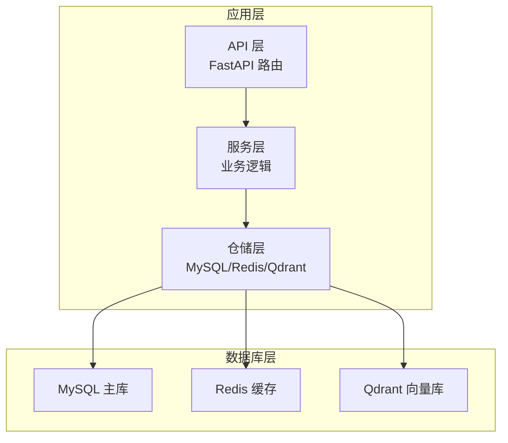
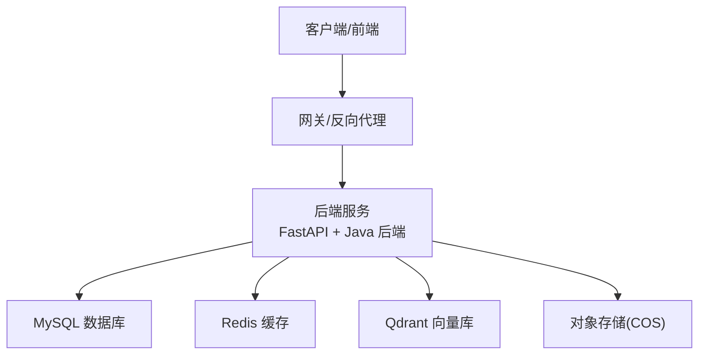
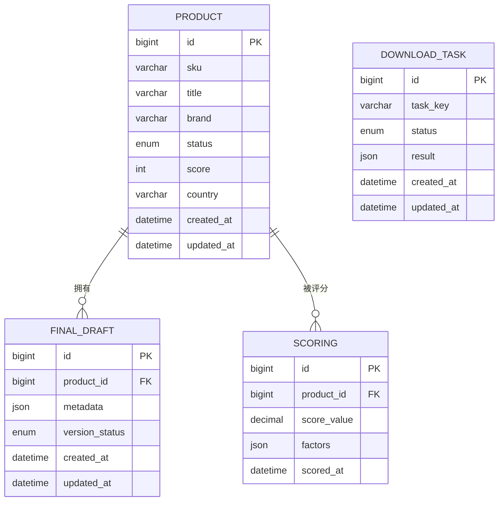
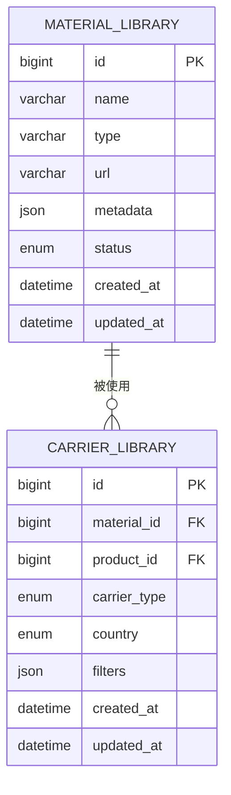
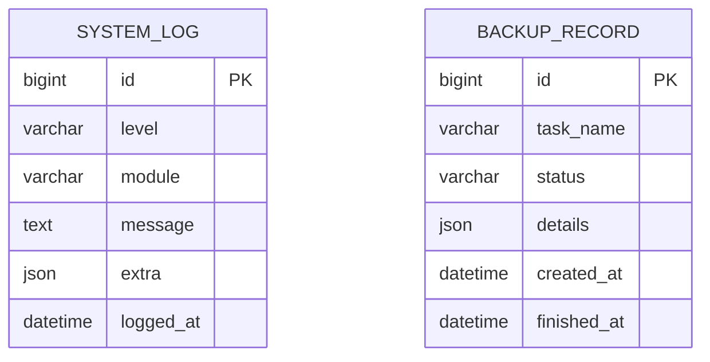
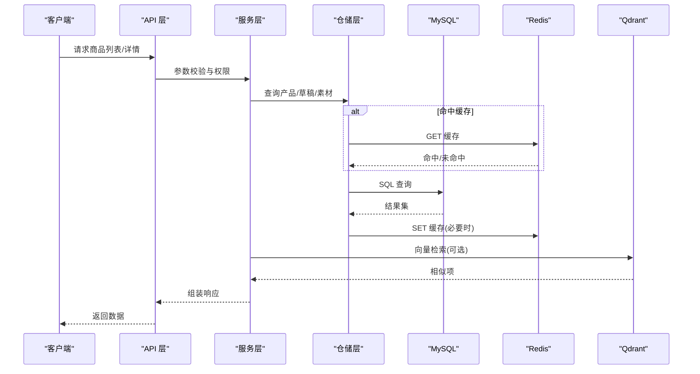
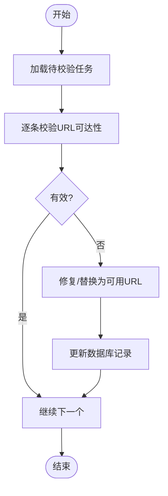
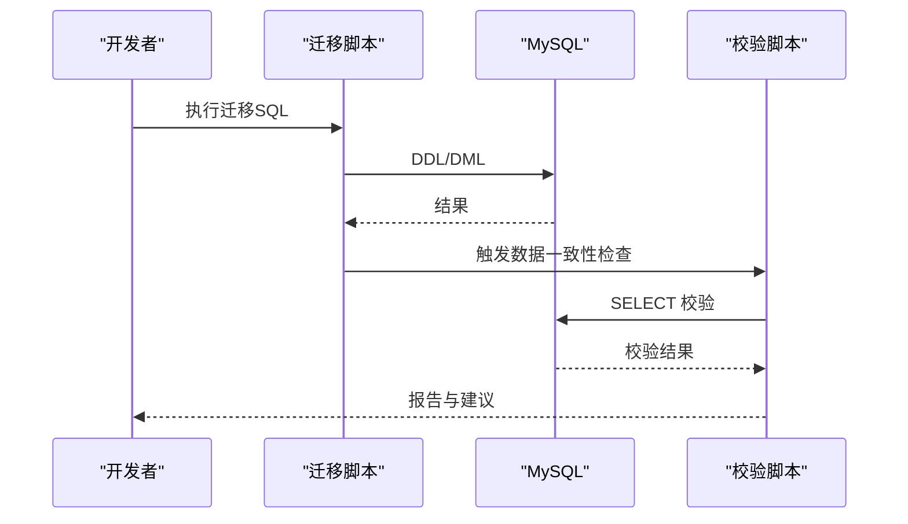
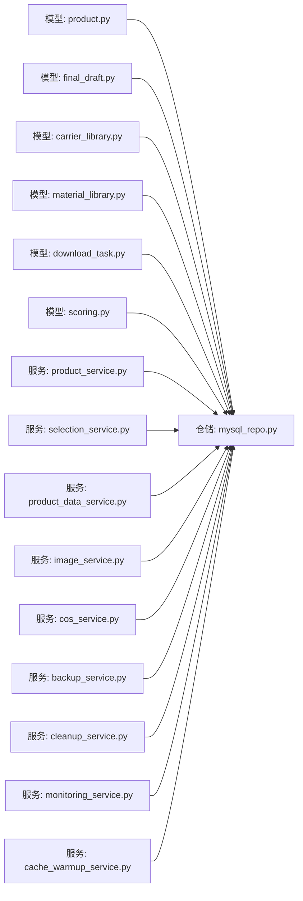

# 数据库设计

<cite>
**本文引用的文件**
- [init_database.sql](file://backend/migrations/init_database.sql)
- [init_database_dev.sql](file://backend/migrations/init_database_dev.sql)
- [create_final_drafts_table.sql](file://backend/migrations/create_final_drafts_table.sql)
- [create_material_carrier_tables.sql](file://backend/migrations/create_material_carrier_tables.sql)
- [add_download_tasks_table.sql](file://backend/migrations/add_download_tasks_table.sql)
- [add_scoring_fields.sql](file://backend/migrations/add_scoring_fields.sql)
- [create_scoring_tables.sql](file://backend/migrations/create_scoring_tables.sql)
- [add_images_index.sql](file://backend/migrations/add_images_index.sql)
- [add_role_indexes.sql](file://backend/migrations/add_role_indexes.sql)
- [add_country_and_filter_mode.sql](file://backend/migrations/add_country_and_filter_mode.sql)
- [add_original_image_metadata.sql](file://backend/migrations/add_original_image_metadata.sql)
- [add_original_zip_fields.sql](file://backend/migrations/add_original_zip_fields.sql)
- [add_thumbnail_columns.sql](file://backend/migrations/add_thumbnail_columns.sql)
- [add_image_storage_fields.sql](file://backend/migrations/add_image_storage_fields.sql)
- [add_infringement_label.sql](file://backend/migrations/add_infringement_label.sql)
- [system_log_tables.sql](file://backend/migrations/system_log_tables.sql)
- [001_create_backup_records_table.sql](file://backend/migrations/001_create_backup_records_table.sql)
- [create_final_drafts_table.sql（应用迁移）](file://backend/app/db/migrations/create_final_drafts_table.sql)
- [product.py](file://backend/app/models/product.py)
- [final_draft.py](file://backend/app/models/final_draft.py)
- [carrier_library.py](file://backend/app/models/carrier_library.py)
- [material_library.py](file://backend/app/models/material_library.py)
- [download_task.py](file://backend/app/models/download_task.py)
- [scoring.py](file://backend/app/models/scoring.py)
- [mysql_repo.py](file://backend/app/repositories/mysql_repo.py)
- [file_link_repository.py](file://backend/app/repositories/file_link_repository.py)
- [create_file_link_tables.py](file://backend/app/repositories/create_file_link_tables.py)
- [create_selection_tables.py](file://backend/app/repositories/create_selection_tables.py)
- [migrate_products_table.py](file://backend/app/repositories/migrate_products_table.py)
- [migrate_selection_tables.py](file://backend/app/repositories/migrate_selection_tables.py)
- [product_service.py](file://backend/app/services/product_service.py)
- [selection_service.py](file://backend/app/services/selection_service.py)
- [product_data_service.py](file://backend/app/services/product_data_service.py)
- [image_service.py](file://backend/app/services/image_service.py)
- [cos_service.py](file://backend/app/services/cos_service.py)
- [backup_service.py](file://backend/app/services/backup_service.py)
- [cleanup_service.py](file://backend/app/services/cleanup_service.py)
- [monitoring_service.py](file://backend/app/services/monitoring_service.py)
- [cache_warmup_service.py](file://backend/app/services/cache_warmup_service.py)
- [redis_repo.py](file://backend/app/repositories/redis_repo.py)
- [qdrant_repo.py](file://backend/app/repositories/qdrant_repo.py)
- [check_product_data_tables.py](file://backend/scripts/check_product_data_tables.py)
- [check_final_draft_tables.py](file://backend/scripts/check_final_draft_tables.py)
- [execute_sql_migration.py](file://backend/scripts/execute_sql_migration.py)
- [data_migration.py](file://backend/scripts/data_migration.py)
- [url_check_scheduler.py](file://backend/scripts/url_check_scheduler.py)
- [url_maintenance.py](file://backend/scripts/url_maintenance.py)
- [fix_scoring.py](file://backend/scripts/fix_scoring.py)
- [fix_image_urls.py](file://backend/scripts/fix_image_urls.py)
- [update_existing_data.sql](file://backend/migrations/update_existing_data.sql)
- [update_material_library_table.sql](file://backend/migrations/update_material_library_table.sql)
- [update_material_library_table.py](file://backend/scripts/update_material_library_table.py)
- [check_data.sql](file://backend/migrations/check_data.sql)
- [check_columns.sql](file://backend/migrations/check_columns.sql)
- [check_country_values.sql](file://backend/migrations/check_country_values.sql)
- [check_source.sql](file://backend/migrations/check_source.sql)
- [check_uk_source.sql](file://backend/migrations/check_uk_source.sql)
- [check_product_type.sql](file://backend/migrations/check_product_type.sql)
- [fix_carrier_sku.sql](file://backend/migrations/fix_carrier_sku.sql)
- [remove_carrier_sku.sql](file://backend/migrations/remove_carrier_sku.sql)
- [add_missing_fields.sql](file://backend/migrations/add_missing_fields.sql)
- [add_grade_fields.sql](file://backend/migrations/add_grade_fields.sql)
- [add_grade_fields_fixed.sql](file://backend/migrations/add_grade_fields_fixed.sql)
- [add_original_image_metadata_single.sql](file://backend/migrations/add_original_image_metadata_single.sql)
- [add_country_and_filter_mode_to_recycle_bin.sql](file://backend/migrations/add_country_and_filter_mode_to_recycle_bin.sql)
- [add_image_storage_fields_sijuelishi.sql](file://backend/migrations/add_image_storage_fields_sijuelishi.sql)
- [add_cos_fields.sql](file://backend/migrations/add_cos_fields.sql)
- [add_local_thumbnail_fields.sql](file://backend/scripts/add_local_thumbnail_fields.sql)
- [check_local_images.py](file://backend/scripts/check_local_images.py)
- [check_database_tables.py](file://backend/scripts/check_database_tables.py)
- [cos_migration.py](file://backend/scripts/cos_migration.py)
- [create_file_links_folder.py](file://backend/scripts/create_file_links_folder.py)
- [trigger_scoring.py](file://backend/scripts/trigger_scoring.py)
- [update_existing_drafts.py](file://backend/scripts/update_existing_drafts.py)
- [verify_sku_24.py](file://backend/scripts/verify_sku_24.py)
- [config.py](file://backend/config.py)
- [config.py（Java）](file://java-backend/src/main/resources/application.yml)
- [docker-compose.yml](file://docker-compose.yml)
- [docker-compose.prod.yml](file://docker-compose.prod.yml)
- [docker-compose.dev.yml](file://docker-compose.dev.yml)
- [Dockerfile](file://backend/Dockerfile)
- [Dockerfile.base](file://backend/Dockerfile.base)
- [Dockerfile.dev](file://backend/Dockerfile.dev)
- [mysql_init_01-init.sql](file://mysql/init/01-init.sql)
- [README.md（数据库）](file://docs/database/README.md)
- [RBAC设计.md](file://docs/项目逻辑/RBAC设计.md)
- [生产环境启动计划.md](file://documents/生产环境启动计划.md)
- [MySQL跨环境数据复制.md](file://docs/docker使用经验/MySQL跨环境数据复制.md)
</cite>

## 目录
1. [简介](#简介)
2. [项目结构](#项目结构)
3. [核心组件](#核心组件)
4. [架构总览](#架构总览)
5. [详细组件分析](#详细组件分析)
6. [依赖分析](#依赖分析)
7. [性能考量](#性能考量)
8. [故障排查指南](#故障排查指南)
9. [结论](#结论)
10. [附录](#附录)

## 简介
本文件面向“思觉智贸数据库设计”，基于仓库中的迁移脚本、模型定义与服务实现，系统性梳理MySQL数据库的架构设计、表结构、实体关系、索引策略、性能优化、数据访问模式、缓存与向量存储集成、数据生命周期与迁移路径，并给出运维与安全建议。目标读者包括数据库管理员与开发者。

## 项目结构
后端采用Python（FastAPI）+ MySQL为主的数据层，配合Redis与Qdrant用于缓存与向量检索；同时存在Java后端模块与网关，形成多语言微服务架构。数据库初始化与演进通过SQL迁移脚本管理，模型与仓储层解耦，服务层封装业务逻辑。

图表来源
- [docker-compose.yml](file://docker-compose.yml)
- [docker-compose.prod.yml](file://docker-compose.prod.yml)
- [docker-compose.dev.yml](file://docker-compose.dev.yml)
- [Dockerfile](file://backend/Dockerfile)
- [Dockerfile.base](file://backend/Dockerfile.base)
- [Dockerfile.dev](file://backend/Dockerfile.dev)

章节来源
- [docker-compose.yml](file://docker-compose.yml)
- [docker-compose.prod.yml](file://docker-compose.prod.yml)
- [docker-compose.dev.yml](file://docker-compose.dev.yml)
- [Dockerfile](file://backend/Dockerfile)
- [Dockerfile.base](file://backend/Dockerfile.base)
- [Dockerfile.dev](file://backend/Dockerfile.dev)

## 核心组件
- 数据库初始化与演进：通过一系列SQL迁移脚本完成，覆盖产品、草稿、素材载体、下载任务、评分、日志、备份等核心主题。
- ORM模型与仓储：以Pydantic/SQLAlchemy风格的模型定义表结构，仓储层负责数据持久化与查询。
- 服务层：封装业务流程，协调MySQL、Redis、Qdrant与对象存储（COS）。
- 运维脚本：提供校验、修复、迁移、清理、监控等工具。

章节来源
- [init_database.sql](file://backend/migrations/init_database.sql)
- [init_database_dev.sql](file://backend/migrations/init_database_dev.sql)
- [product.py](file://backend/app/models/product.py)
- [final_draft.py](file://backend/app/models/final_draft.py)
- [carrier_library.py](file://backend/app/models/carrier_library.py)
- [material_library.py](file://backend/app/models/material_library.py)
- [download_task.py](file://backend/app/models/download_task.py)
- [scoring.py](file://backend/app/models/scoring.py)
- [mysql_repo.py](file://backend/app/repositories/mysql_repo.py)
- [redis_repo.py](file://backend/app/repositories/redis_repo.py)
- [qdrant_repo.py](file://backend/app/repositories/qdrant_repo.py)

## 架构总览
下图展示数据库相关模块在系统中的位置与交互：

图表来源
- [docker-compose.yml](file://docker-compose.yml)
- [config.py](file://backend/config.py)
- [config.py（Java）](file://java-backend/src/main/resources/application.yml)

章节来源
- [docker-compose.yml](file://docker-compose.yml)
- [config.py](file://backend/config.py)
- [config.py（Java）](file://java-backend/src/main/resources/application.yml)

## 详细组件分析

### 产品与草稿数据模型
- 产品表：承载商品基础信息、状态、评分、国家/站点维度字段等。
- 草稿表：存放最终定稿数据，支持多版本与状态流转。
- 下载任务表：记录批量下载任务的状态与结果。
- 评分体系：独立评分表与字段，支撑AI打分与人工复核。

图表来源
- [product.py](file://backend/app/models/product.py)
- [final_draft.py](file://backend/app/models/final_draft.py)
- [download_task.py](file://backend/app/models/download_task.py)
- [scoring.py](file://backend/app/models/scoring.py)
- [create_final_drafts_table.sql](file://backend/migrations/create_final_drafts_table.sql)
- [add_scoring_fields.sql](file://backend/migrations/add_scoring_fields.sql)
- [create_scoring_tables.sql](file://backend/migrations/create_scoring_tables.sql)
- [add_download_tasks_table.sql](file://backend/migrations/add_download_tasks_table.sql)

章节来源
- [product.py](file://backend/app/models/product.py)
- [final_draft.py](file://backend/app/models/final_draft.py)
- [download_task.py](file://backend/app/models/download_task.py)
- [scoring.py](file://backend/app/models/scoring.py)
- [create_final_drafts_table.sql](file://backend/migrations/create_final_drafts_table.sql)
- [add_scoring_fields.sql](file://backend/migrations/add_scoring_fields.sql)
- [create_scoring_tables.sql](file://backend/migrations/create_scoring_tables.sql)
- [add_download_tasks_table.sql](file://backend/migrations/add_download_tasks_table.sql)

### 素材与载体数据模型
- 素材库：存储图片、视频、文件等资源元数据与URL。
- 载体库：与产品/素材关联，支持筛选、标签、国家维度。

图表来源
- [material_library.py](file://backend/app/models/material_library.py)
- [carrier_library.py](file://backend/app/models/carrier_library.py)
- [create_material_carrier_tables.sql](file://backend/migrations/create_material_carrier_tables.sql)

章节来源
- [material_library.py](file://backend/app/models/material_library.py)
- [carrier_library.py](file://backend/app/models/carrier_library.py)
- [create_material_carrier_tables.sql](file://backend/migrations/create_material_carrier_tables.sql)

### 日志与备份数据模型
- 系统日志：记录操作审计、异常与性能指标。
- 备份记录：记录备份任务、对象存储归档与恢复。

图表来源
- [system_log_tables.sql](file://backend/migrations/system_log_tables.sql)
- [001_create_backup_records_table.sql](file://backend/migrations/001_create_backup_records_table.sql)

章节来源
- [system_log_tables.sql](file://backend/migrations/system_log_tables.sql)
- [001_create_backup_records_table.sql](file://backend/migrations/001_create_backup_records_table.sql)

### 数据访问模式与缓存策略
- 访问模式：服务层通过仓储层进行CRUD与聚合查询；复杂检索结合Redis缓存热点数据与Qdrant向量相似度检索。
- 缓存策略：热点产品详情、筛选预设、图片URL短链等使用Redis缓存；定时预热与失效策略由缓存预热服务驱动。
- 向量检索：图片特征向量入库Qdrant，服务层按需检索TopK相似项。

图表来源
- [product_service.py](file://backend/app/services/product_service.py)
- [selection_service.py](file://backend/app/services/selection_service.py)
- [product_data_service.py](file://backend/app/services/product_data_service.py)
- [mysql_repo.py](file://backend/app/repositories/mysql_repo.py)
- [redis_repo.py](file://backend/app/repositories/redis_repo.py)
- [qdrant_repo.py](file://backend/app/repositories/qdrant_repo.py)

章节来源
- [product_service.py](file://backend/app/services/product_service.py)
- [selection_service.py](file://backend/app/services/selection_service.py)
- [product_data_service.py](file://backend/app/services/product_data_service.py)
- [mysql_repo.py](file://backend/app/repositories/mysql_repo.py)
- [redis_repo.py](file://backend/app/repositories/redis_repo.py)
- [qdrant_repo.py](file://backend/app/repositories/qdrant_repo.py)

### 关键流程与算法示意

#### 图片URL一致性校验与修复

图表来源
- [fix_image_urls.py](file://backend/scripts/fix_image_urls.py)
- [url_check_scheduler.py](file://backend/scripts/url_check_scheduler.py)
- [url_maintenance.py](file://backend/scripts/url_maintenance.py)

章节来源
- [fix_image_urls.py](file://backend/scripts/fix_image_urls.py)
- [url_check_scheduler.py](file://backend/scripts/url_check_scheduler.py)
- [url_maintenance.py](file://backend/scripts/url_maintenance.py)

#### 数据迁移与补丁

图表来源
- [execute_sql_migration.py](file://backend/scripts/execute_sql_migration.py)
- [data_migration.py](file://backend/scripts/data_migration.py)
- [check_data.sql](file://backend/migrations/check_data.sql)
- [check_columns.sql](file://backend/migrations/check_columns.sql)
- [check_country_values.sql](file://backend/migrations/check_country_values.sql)
- [check_source.sql](file://backend/migrations/check_source.sql)
- [check_uk_source.sql](file://backend/migrations/check_uk_source.sql)
- [check_product_type.sql](file://backend/migrations/check_product_type.sql)

章节来源
- [execute_sql_migration.py](file://backend/scripts/execute_sql_migration.py)
- [data_migration.py](file://backend/scripts/data_migration.py)
- [check_data.sql](file://backend/migrations/check_data.sql)
- [check_columns.sql](file://backend/migrations/check_columns.sql)
- [check_country_values.sql](file://backend/migrations/check_country_values.sql)
- [check_source.sql](file://backend/migrations/check_source.sql)
- [check_uk_source.sql](file://backend/migrations/check_uk_source.sql)
- [check_product_type.sql](file://backend/migrations/check_product_type.sql)

## 依赖分析
- 模型到仓储：各模型类通过仓储层访问MySQL，避免直接SQL散落。
- 服务到仓储：服务层编排业务，统一调用MySQL/Redis/Qdrant。
- 脚本到迁移：迁移脚本与校验脚本共同保证演进过程的正确性与可追溯性。

图表来源
- [product.py](file://backend/app/models/product.py)
- [final_draft.py](file://backend/app/models/final_draft.py)
- [carrier_library.py](file://backend/app/models/carrier_library.py)
- [material_library.py](file://backend/app/models/material_library.py)
- [download_task.py](file://backend/app/models/download_task.py)
- [scoring.py](file://backend/app/models/scoring.py)
- [mysql_repo.py](file://backend/app/repositories/mysql_repo.py)
- [product_service.py](file://backend/app/services/product_service.py)
- [selection_service.py](file://backend/app/services/selection_service.py)
- [product_data_service.py](file://backend/app/services/product_data_service.py)
- [image_service.py](file://backend/app/services/image_service.py)
- [cos_service.py](file://backend/app/services/cos_service.py)
- [backup_service.py](file://backend/app/services/backup_service.py)
- [cleanup_service.py](file://backend/app/services/cleanup_service.py)
- [monitoring_service.py](file://backend/app/services/monitoring_service.py)
- [cache_warmup_service.py](file://backend/app/services/cache_warmup_service.py)

章节来源
- [product.py](file://backend/app/models/product.py)
- [final_draft.py](file://backend/app/models/final_draft.py)
- [carrier_library.py](file://backend/app/models/carrier_library.py)
- [material_library.py](file://backend/app/models/material_library.py)
- [download_task.py](file://backend/app/models/download_task.py)
- [scoring.py](file://backend/app/models/scoring.py)
- [mysql_repo.py](file://backend/app/repositories/mysql_repo.py)
- [product_service.py](file://backend/app/services/product_service.py)
- [selection_service.py](file://backend/app/services/selection_service.py)
- [product_data_service.py](file://backend/app/services/product_data_service.py)
- [image_service.py](file://backend/app/services/image_service.py)
- [cos_service.py](file://backend/app/services/cos_service.py)
- [backup_service.py](file://backend/app/services/backup_service.py)
- [cleanup_service.py](file://backend/app/services/cleanup_service.py)
- [monitoring_service.py](file://backend/app/services/monitoring_service.py)
- [cache_warmup_service.py](file://backend/app/services/cache_warmup_service.py)

## 性能考量
- 索引策略
  - 用户/角色相关：角色索引提升鉴权与权限查询效率。
  - 图片/素材：对URL、状态、国家等常用过滤字段建立索引。
  - 评分与筛选：对评分值、国家、站点、状态等建立复合索引或单列索引。
- 索引示例来源
  - [add_images_index.sql](file://backend/migrations/add_images_index.sql)
  - [add_role_indexes.sql](file://backend/migrations/add_role_indexes.sql)
  - [add_country_and_filter_mode.sql](file://backend/migrations/add_country_and_filter_mode.sql)
- 缓存与预热
  - 使用Redis缓存高频读取数据，结合预热服务定期填充热点。
  - 参考：[cache_warmup_service.py](file://backend/app/services/cache_warmup_service.py)
- 向量检索
  - 图片向量入库Qdrant，按需检索TopK，降低全表扫描成本。
  - 参考：[qdrant_repo.py](file://backend/app/repositories/qdrant_repo.py)
- 数据分页与限制
  - 列表查询默认分页与最大返回条数限制，避免大结果集。
- 异步处理
  - 大批量任务（下载、评分、清理）通过Celery异步执行，降低阻塞。

章节来源
- [add_images_index.sql](file://backend/migrations/add_images_index.sql)
- [add_role_indexes.sql](file://backend/migrations/add_role_indexes.sql)
- [add_country_and_filter_mode.sql](file://backend/migrations/add_country_and_filter_mode.sql)
- [cache_warmup_service.py](file://backend/app/services/cache_warmup_service.py)
- [qdrant_repo.py](file://backend/app/repositories/qdrant_repo.py)

## 故障排查指南
- 常见问题定位
  - 数据一致性：使用校验脚本与迁移脚本配套验证。
    - [check_data.sql](file://backend/migrations/check_data.sql)
    - [check_columns.sql](file://backend/migrations/check_columns.sql)
    - [check_country_values.sql](file://backend/migrations/check_country_values.sql)
    - [check_source.sql](file://backend/migrations/check_source.sql)
    - [check_uk_source.sql](file://backend/migrations/check_uk_source.sql)
    - [check_product_type.sql](file://backend/migrations/check_product_type.sql)
  - 图片URL异常：运行URL修复与调度脚本。
    - [fix_image_urls.py](file://backend/scripts/fix_image_urls.py)
    - [url_check_scheduler.py](file://backend/scripts/url_check_scheduler.py)
    - [url_maintenance.py](file://backend/scripts/url_maintenance.py)
  - 评分异常：触发评分修复脚本。
    - [fix_scoring.py](file://backend/scripts/fix_scoring.py)
- 迁移与回滚
  - 执行迁移脚本前先备份，失败时回滚至最近稳定版本。
  - 参考：[execute_sql_migration.py](file://backend/scripts/execute_sql_migration.py)
- 清理与归档
  - 定期清理过期缓存与临时文件，归档历史日志与备份。
  - 参考：[cleanup_service.py](file://backend/app/services/cleanup_service.py)，[backup_service.py](file://backend/app/services/backup_service.py)

章节来源
- [check_data.sql](file://backend/migrations/check_data.sql)
- [check_columns.sql](file://backend/migrations/check_columns.sql)
- [check_country_values.sql](file://backend/migrations/check_country_values.sql)
- [check_source.sql](file://backend/migrations/check_source.sql)
- [check_uk_source.sql](file://backend/migrations/check_uk_source.sql)
- [check_product_type.sql](file://backend/migrations/check_product_type.sql)
- [fix_image_urls.py](file://backend/scripts/fix_image_urls.py)
- [url_check_scheduler.py](file://backend/scripts/url_check_scheduler.py)
- [url_maintenance.py](file://backend/scripts/url_maintenance.py)
- [fix_scoring.py](file://backend/scripts/fix_scoring.py)
- [execute_sql_migration.py](file://backend/scripts/execute_sql_migration.py)
- [cleanup_service.py](file://backend/app/services/cleanup_service.py)
- [backup_service.py](file://backend/app/services/backup_service.py)

## 结论
本设计以SQL迁移脚本为版本基石，结合模型-仓储-服务三层架构，实现了产品、草稿、素材、载体、评分、日志与备份等核心主题的完整数据模型。通过索引、缓存与向量检索优化查询性能，借助脚本化校验与修复保障数据质量，配合异步任务与对象存储满足高并发与海量数据场景。建议在生产环境中持续完善监控与告警、定期进行容量与性能评估，并严格执行变更审批与回滚预案。

## 附录

### 数据库初始化与演进
- 初始化脚本
  - [init_database.sql](file://backend/migrations/init_database.sql)
  - [init_database_dev.sql](file://backend/migrations/init_database_dev.sql)
- 应用迁移
  - [create_final_drafts_table.sql（应用迁移）](file://backend/app/db/migrations/create_final_drafts_table.sql)
- 版本演进要点
  - 新增字段：国家/站点、侵权标签、缩略图、原图元数据、本地缩略图等。
  - 新增索引：图片索引、角色索引、筛选模式索引。
  - 新增表：评分表、下载任务表、备份记录表、系统日志表。
  - 参考脚本：
    - [add_country_and_filter_mode.sql](file://backend/migrations/add_country_and_filter_mode.sql)
    - [add_infringement_label.sql](file://backend/migrations/add_infringement_label.sql)
    - [add_thumbnail_columns.sql](file://backend/migrations/add_thumbnail_columns.sql)
    - [add_original_image_metadata.sql](file://backend/migrations/add_original_image_metadata.sql)
    - [add_original_zip_fields.sql](file://backend/migrations/add_original_zip_fields.sql)
    - [add_images_index.sql](file://backend/migrations/add_images_index.sql)
    - [add_role_indexes.sql](file://backend/migrations/add_role_indexes.sql)
    - [add_download_tasks_table.sql](file://backend/migrations/add_download_tasks_table.sql)
    - [create_scoring_tables.sql](file://backend/migrations/create_scoring_tables.sql)
    - [system_log_tables.sql](file://backend/migrations/system_log_tables.sql)
    - [001_create_backup_records_table.sql](file://backend/migrations/001_create_backup_records_table.sql)

章节来源
- [init_database.sql](file://backend/migrations/init_database.sql)
- [init_database_dev.sql](file://backend/migrations/init_database_dev.sql)
- [create_final_drafts_table.sql（应用迁移）](file://backend/app/db/migrations/create_final_drafts_table.sql)
- [add_country_and_filter_mode.sql](file://backend/migrations/add_country_and_filter_mode.sql)
- [add_infringement_label.sql](file://backend/migrations/add_infringement_label.sql)
- [add_thumbnail_columns.sql](file://backend/migrations/add_thumbnail_columns.sql)
- [add_original_image_metadata.sql](file://backend/migrations/add_original_image_metadata.sql)
- [add_original_zip_fields.sql](file://backend/migrations/add_original_zip_fields.sql)
- [add_images_index.sql](file://backend/migrations/add_images_index.sql)
- [add_role_indexes.sql](file://backend/migrations/add_role_indexes.sql)
- [add_download_tasks_table.sql](file://backend/migrations/add_download_tasks_table.sql)
- [create_scoring_tables.sql](file://backend/migrations/create_scoring_tables.sql)
- [system_log_tables.sql](file://backend/migrations/system_log_tables.sql)
- [001_create_backup_records_table.sql](file://backend/migrations/001_create_backup_records_table.sql)

### 数据访问与缓存
- 仓储接口
  - [mysql_repo.py](file://backend/app/repositories/mysql_repo.py)
  - [redis_repo.py](file://backend/app/repositories/redis_repo.py)
  - [qdrant_repo.py](file://backend/app/repositories/qdrant_repo.py)
- 服务接口
  - [product_service.py](file://backend/app/services/product_service.py)
  - [selection_service.py](file://backend/app/services/selection_service.py)
  - [product_data_service.py](file://backend/app/services/product_data_service.py)
  - [image_service.py](file://backend/app/services/image_service.py)
  - [cos_service.py](file://backend/app/services/cos_service.py)
  - [cache_warmup_service.py](file://backend/app/services/cache_warmup_service.py)

章节来源
- [mysql_repo.py](file://backend/app/repositories/mysql_repo.py)
- [redis_repo.py](file://backend/app/repositories/redis_repo.py)
- [qdrant_repo.py](file://backend/app/repositories/qdrant_repo.py)
- [product_service.py](file://backend/app/services/product_service.py)
- [selection_service.py](file://backend/app/services/selection_service.py)
- [product_data_service.py](file://backend/app/services/product_data_service.py)
- [image_service.py](file://backend/app/services/image_service.py)
- [cos_service.py](file://backend/app/services/cos_service.py)
- [cache_warmup_service.py](file://backend/app/services/cache_warmup_service.py)

### 数据迁移与版本管理
- 迁移执行
  - [execute_sql_migration.py](file://backend/scripts/execute_sql_migration.py)
  - [data_migration.py](file://backend/scripts/data_migration.py)
- 表结构校验
  - [check_product_data_tables.py](file://backend/scripts/check_product_data_tables.py)
  - [check_final_draft_tables.py](file://backend/scripts/check_final_draft_tables.py)
- 数据修复
  - [fix_scoring.py](file://backend/scripts/fix_scoring.py)
  - [fix_image_urls.py](file://backend/scripts/fix_image_urls.py)
  - [update_existing_data.sql](file://backend/migrations/update_existing_data.sql)
  - [update_material_library_table.sql](file://backend/migrations/update_material_library_table.sql)
  - [update_material_library_table.py](file://backend/scripts/update_material_library_table.py)

章节来源
- [execute_sql_migration.py](file://backend/scripts/execute_sql_migration.py)
- [data_migration.py](file://backend/scripts/data_migration.py)
- [check_product_data_tables.py](file://backend/scripts/check_product_data_tables.py)
- [check_final_draft_tables.py](file://backend/scripts/check_final_draft_tables.py)
- [fix_scoring.py](file://backend/scripts/fix_scoring.py)
- [fix_image_urls.py](file://backend/scripts/fix_image_urls.py)
- [update_existing_data.sql](file://backend/migrations/update_existing_data.sql)
- [update_material_library_table.sql](file://backend/migrations/update_material_library_table.sql)
- [update_material_library_table.py](file://backend/scripts/update_material_library_table.py)

### 数据生命周期与归档
- 生命周期
  - 产品数据：上架/下架状态管理、评分周期性重评。
  - 草稿数据：版本控制与归档策略，保留历史快照。
  - 日志与备份：按天/周归档，保留审计与恢复所需周期。
- 归档规则
  - 历史日志与备份记录定期归档至对象存储，数据库仅保留近期活跃数据。
  - 参考：[backup_service.py](file://backend/app/services/backup_service.py)，[cos_service.py](file://backend/app/services/cos_service.py)

章节来源
- [backup_service.py](file://backend/app/services/backup_service.py)
- [cos_service.py](file://backend/app/services/cos_service.py)

### 安全、隐私与访问控制
- RBAC设计：基于角色的权限控制，限制对敏感数据与关键操作的访问。
  - 参考：[RBAC设计.md](file://docs/项目逻辑/RBAC设计.md)
- 数据脱敏：对日志与导出数据进行敏感字段脱敏处理。
- 传输加密：生产环境启用TLS，确保数据库与对象存储通信安全。
- 配置与密钥：数据库连接参数与对象存储凭证通过环境变量注入，避免硬编码。

章节来源
- [RBAC设计.md](file://docs/项目逻辑/RBAC设计.md)

### 运维与部署
- 容器化与编排
  - [docker-compose.yml](file://docker-compose.yml)
  - [docker-compose.prod.yml](file://docker-compose.prod.yml)
  - [docker-compose.dev.yml](file://docker-compose.dev.yml)
  - [Dockerfile](file://backend/Dockerfile)
  - [Dockerfile.base](file://backend/Dockerfile.base)
  - [Dockerfile.dev](file://backend/Dockerfile.dev)
- 初始化脚本
  - [mysql_init_01-init.sql](file://mysql/init/01-init.sql)
- 启动计划
  - [生产环境启动计划.md](file://documents/生产环境启动计划.md)
- 跨环境数据复制
  - [MySQL跨环境数据复制.md](file://docs/docker使用经验/MySQL跨环境数据复制.md)

章节来源
- [docker-compose.yml](file://docker-compose.yml)
- [docker-compose.prod.yml](file://docker-compose.prod.yml)
- [docker-compose.dev.yml](file://docker-compose.dev.yml)
- [Dockerfile](file://backend/Dockerfile)
- [Dockerfile.base](file://backend/Dockerfile.base)
- [Dockerfile.dev](file://backend/Dockerfile.dev)
- [mysql_init_01-init.sql](file://mysql/init/01-init.sql)
- [生产环境启动计划.md](file://documents/生产环境启动计划.md)
- [MySQL跨环境数据复制.md](file://docs/docker使用经验/MySQL跨环境数据复制.md)