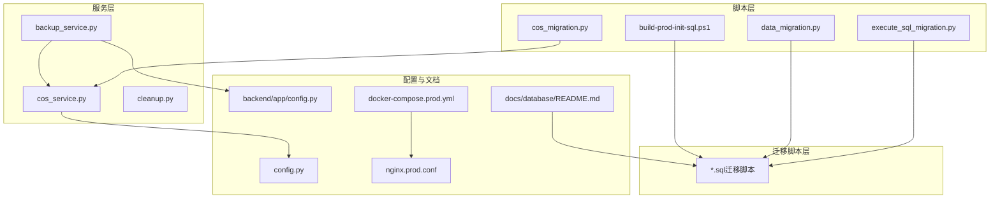
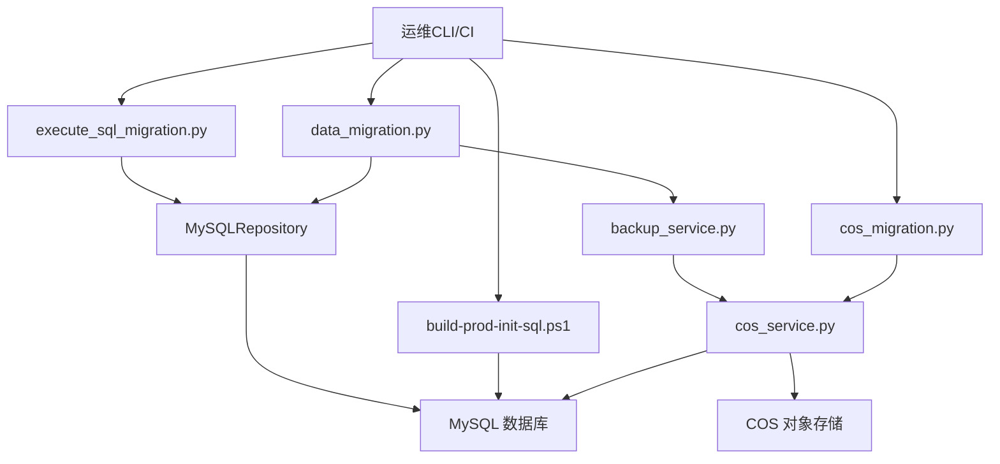
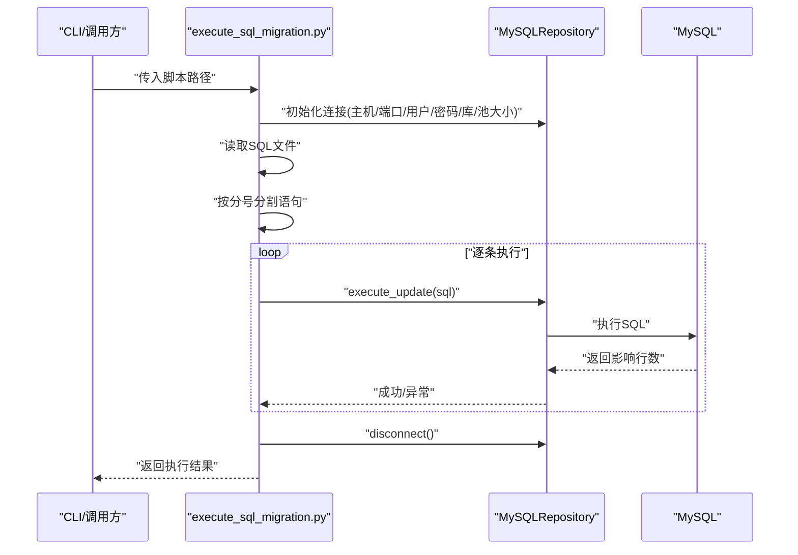
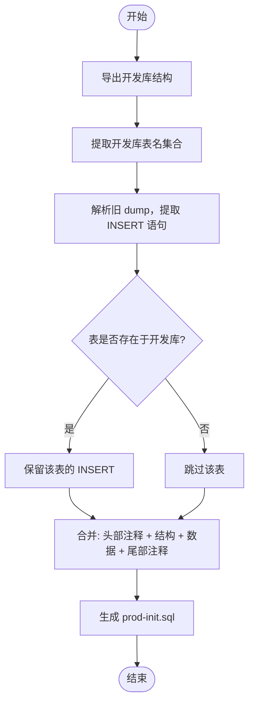
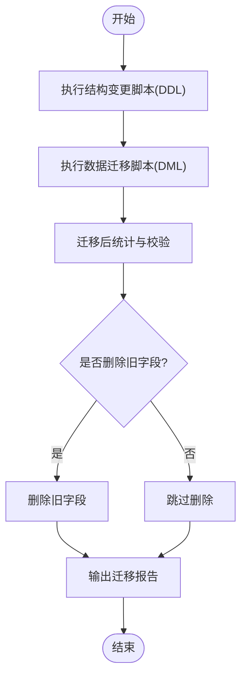
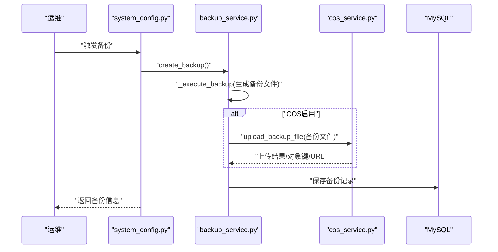
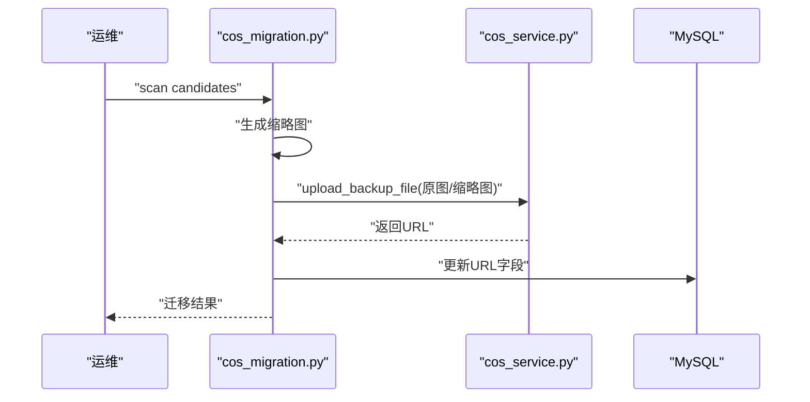
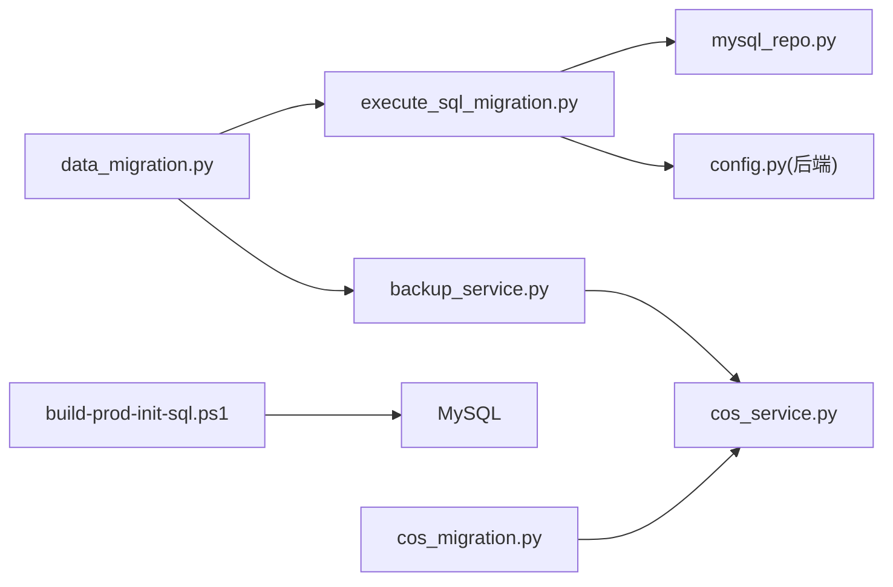

# 数据迁移

<cite>
**本文引用的文件**
- [execute_sql_migration.py](file://backend/scripts/execute_sql_migration.py)
- [build-prod-init-sql.ps1](file://scripts/build-prod-init-sql.ps1)
- [data_migration.py](file://backend/scripts/data_migration.py)
- [migrate_selection_tables.py](file://backend/app/repositories/migrate_selection_tables.py)
- [README.md（数据库）](file://docs/database/README.md)
- [backup_service.py](file://backend/app/services/backup_service.py)
- [system_config.py](file://backend/app/api/v1/system_config.py)
- [cos_service.py](file://backend/app/services/cos_service.py)
- [cos_migration.py](file://backend/scripts/cos_migration.py)
- [mysql_repo.py](file://backend/app/repositories/mysql_repo.py)
- [config.py（后端）](file://backend/app/config.py)
- [config.py（根目录）](file://config.py)
- [add_country_and_filter_mode.sql](file://backend/migrations/add_country_and_filter_mode.sql)
- [init_database.sql](file://backend/migrations/init_database.sql)
- [init_database_dev.sql](file://backend/migrations/init_database_dev.sql)
- [create_final_drafts_table.sql](file://backend/migrations/create_final_drafts_table.sql)
- [create_material_carrier_tables.sql](file://backend/migrations/create_material_carrier_tables.sql)
- [create_scoring_tables.sql](file://backend/migrations/create_scoring_tables.sql)
- [system_log_tables.sql](file://backend/migrations/system_log_tables.sql)
- [add_download_tasks_table.sql](file://backend/migrations/add_download_tasks_table.sql)
- [add_image_storage_fields.sql](file://backend/migrations/add_image_storage_fields.sql)
- [check_data.sql](file://backend/migrations/check_data.sql)
- [check_product_type.sql](file://backend/migrations/check_product_type.sql)
- [check_source.sql](file://backend/migrations/check_source.sql)
- [check_uk_source.sql](file://backend/migrations/check_uk_source.sql)
- [fix_carrier_sku.sql](file://backend/migrations/fix_carrier_sku.sql)
- [remove_carrier_sku.sql](file://backend/migrations/remove_carrier_sku.sql)
- [update_existing_data.sql](file://backend/migrations/update_existing_data.sql)
- [update_material_library_table.sql](file://backend/migrations/update_material_library_table.sql)
- [check_columns.sql](file://backend/migrations/check_columns.sql)
- [check_country_values.sql](file://backend/migrations/check_country_values.sql)
- [check_db_urls.py](file://backend/scripts/check_db_urls.py)
- [check_final_draft_tables.py](file://backend/scripts/check_final_draft_tables.py)
- [check_local_images.py](file://backend/scripts/check_local_images.py)
- [check_product_data_tables.py](file://backend/scripts/check_product_data_tables.py)
- [check_table_structure.py](file://scripts/database/check_table_structure.py)
- [create_aggregation_tables.py](file://scripts/database/create_aggregation_tables.py)
- [extract_categories.py](file://scripts/database/extract_categories.py)
- [fix_image_urls.py](file://backend/scripts/fix_image_urls.py)
- [fix_scoring.py](file://backend/scripts/fix_scoring.py)
- [update_existing_drafts.py](file://backend/scripts/update_existing_drafts.py)
- [update_material_library_table.py](file://backend/scripts/update_material_library_table.py)
- [url_check_scheduler.py](file://backend/scripts/url_check_scheduler.py)
- [url_maintenance.py](file://backend/scripts/url_maintenance.py)
- [verify_sku_24.py](file://backend/scripts/verify_sku_24.py)
- [cleanup.py](file://backend/scripts/cleanup.py)
- [cleanup_production_frontend.bat](file://scripts/cleanup/cleanup_production_frontend.bat)
- [cleanup_production_frontend_source.bat](file://scripts/cleanup/cleanup_production_frontend_source.bat)
- [prod.sh](file://prod.sh)
- [docker-compose.prod.yml](file://docker-compose.prod.yml)
- [docker-compose.prod-simple.yml](file://docker-compose.prod-simple.yml)
- [Dockerfile](file://Dockerfile)
- [Dockerfile.dev](file://Dockerfile.dev)
- [nginx.conf](file://nginx.conf)
- [nginx.prod.conf](file://nginx.prod.conf)
- [mysql代码工作区](file://主系统-mysql.code-workspace)
</cite>

## 目录
1. [简介](#简介)
2. [项目结构](#项目结构)
3. [核心组件](#核心组件)
4. [架构总览](#架构总览)
5. [详细组件分析](#详细组件分析)
6. [依赖关系分析](#依赖关系分析)
7. [性能考虑](#性能考虑)
8. [故障排除指南](#故障排除指南)
9. [结论](#结论)
10. [附录](#附录)

## 简介
本文件面向运维工程师与开发工程师，系统化梳理“思觉智贸”的数据迁移管理策略与实践，覆盖数据库版本控制、迁移脚本编写规范、执行顺序管理、增量与全量迁移、结构变更处理、跨数据库迁移、数据格式转换与兼容性、一致性与并发控制、备份与回滚、异常处理以及迁移前后验证流程。文档基于仓库现有脚本与服务实现，提供可落地的操作手册与排障指引。

## 项目结构
围绕数据迁移与备份恢复，项目在以下层次组织：
- 后端脚本层：提供 SQL 迁移执行器、数据迁移流程、图片/COS 迁移工具等
- 迁移脚本层：按 DDL/结构变更与 DML/数据变更分类，统一命名规范
- 服务层：备份服务、COS 存储服务、清理服务
- 文档与配置：数据库设计文档、容器编排与生产配置

图表来源
- [execute_sql_migration.py](file://backend/scripts/execute_sql_migration.py)
- [data_migration.py](file://backend/scripts/data_migration.py)
- [cos_migration.py](file://backend/scripts/cos_migration.py)
- [build-prod-init-sql.ps1](file://scripts/build-prod-init-sql.ps1)
- [backup_service.py](file://backend/app/services/backup_service.py)
- [cos_service.py](file://backend/app/services/cos_service.py)
- [config.py（后端）](file://backend/app/config.py)
- [config.py（根目录）](file://config.py)
- [README.md（数据库）](file://docs/database/README.md)
- [docker-compose.prod.yml](file://docker-compose.prod.yml)
- [nginx.prod.conf](file://nginx.prod.conf)

章节来源
- [README.md（数据库）](file://docs/database/README.md)
- [docker-compose.prod.yml](file://docker-compose.prod.yml)
- [nginx.prod.conf](file://nginx.prod.conf)

## 核心组件
- SQL 迁移执行器：封装数据库连接、脚本读取、语句分割与逐条执行、异常处理与连接回收
- 数据迁移流程：定义结构变更与数据迁移的阶段、校验与回滚点、最终确认与收尾
- 备份与回滚：支持本地与 COS 的备份、过期清理、下载与删除、回滚入口
- 跨数据库迁移：通过 PowerShell 脚本从旧 dump 中筛选目标表的 INSERT，合并 dev 结构生成生产初始化 SQL
- 图片/COS 迁移：批量扫描候选、生成缩略图、上传至 COS 并更新 URL
- 验证与修复：提供多类检查脚本与修复脚本，保障迁移后一致性

章节来源
- [execute_sql_migration.py](file://backend/scripts/execute_sql_migration.py)
- [data_migration.py](file://backend/scripts/data_migration.py)
- [backup_service.py](file://backend/app/services/backup_service.py)
- [cos_service.py](file://backend/app/services/cos_service.py)
- [cos_migration.py](file://backend/scripts/cos_migration.py)
- [build-prod-init-sql.ps1](file://scripts/build-prod-init-sql.ps1)

## 架构总览
下图展示迁移与备份的整体交互：迁移脚本通过执行器在目标数据库上运行；结构变更与数据变更分别由不同脚本负责；备份服务负责生成与持久化备份，并支持 COS 上传；COS 迁移工具负责图片与缩略图的迁移。

图表来源
- [execute_sql_migration.py](file://backend/scripts/execute_sql_migration.py)
- [data_migration.py](file://backend/scripts/data_migration.py)
- [backup_service.py](file://backend/app/services/backup_service.py)
- [cos_service.py](file://backend/app/services/cos_service.py)
- [cos_migration.py](file://backend/scripts/cos_migration.py)
- [build-prod-init-sql.ps1](file://scripts/build-prod-init-sql.ps1)

## 详细组件分析

### 组件A：SQL 迁移执行器
- 功能要点
  - 通过配置注入数据库连接参数，建立连接池
  - 读取 SQL 文件，按分号分割语句，逐条执行
  - 支持 DDL/DML，遇到异常立即停止并返回失败
  - 执行完成后关闭连接，避免资源泄露
- 关键流程

图表来源
- [execute_sql_migration.py](file://backend/scripts/execute_sql_migration.py)
- [mysql_repo.py](file://backend/app/repositories/mysql_repo.py)

章节来源
- [execute_sql_migration.py](file://backend/scripts/execute_sql_migration.py)

### 组件B：跨数据库全量迁移（生产初始化 SQL 生成）
- 策略
  - 使用开发库结构（DDL）与旧生产 dump（INSERT）合并，生成生产初始化 SQL
  - 仅保留开发库中存在的表，过滤废弃表
  - 生成文件包含头部注释、SET 命令、结构、数据与尾部注释
- 关键流程

图表来源
- [build-prod-init-sql.ps1](file://scripts/build-prod-init-sql.ps1)

章节来源
- [build-prod-init-sql.ps1](file://scripts/build-prod-init-sql.ps1)

### 组件C：数据迁移流程（结构变更 + 数据迁移）
- 流程说明
  - 先执行结构变更（DDL），再执行数据迁移（DML）
  - 迁移过程中进行阶段性统计与校验
  - 迁移完成后询问是否删除旧字段，作为最终确认
- 关键流程

图表来源
- [data_migration.py](file://backend/scripts/data_migration.py)

章节来源
- [data_migration.py](file://backend/scripts/data_migration.py)

### 组件D：备份与回滚（本地/COS）
- 备份流程
  - 生成备份文件，记录备份元数据
  - 若启用 COS，则上传并记录对象键与访问 URL
  - 保存备份记录到数据库
- 回滚思路
  - 通过备份记录下载备份文件，按需恢复
  - 结合迁移脚本的幂等性与索引/约束处理，尽量减少回滚成本
- 关键流程

图表来源
- [system_config.py](file://backend/app/api/v1/system_config.py)
- [backup_service.py](file://backend/app/services/backup_service.py)
- [cos_service.py](file://backend/app/services/cos_service.py)

章节来源
- [system_config.py](file://backend/app/api/v1/system_config.py)
- [backup_service.py](file://backend/app/services/backup_service.py)
- [cos_service.py](file://backend/app/services/cos_service.py)

### 组件E：图片与缩略图迁移（COS）
- 功能要点
  - 扫描迁移候选，生成缩略图
  - 批量上传至 COS，更新数据库 URL
  - 支持单图与批量迁移
- 关键流程

图表来源
- [cos_migration.py](file://backend/scripts/cos_migration.py)
- [cos_service.py](file://backend/app/services/cos_service.py)

章节来源
- [cos_migration.py](file://backend/scripts/cos_migration.py)
- [cos_service.py](file://backend/app/services/cos_service.py)

### 组件F：迁移脚本编写规范与执行顺序
- 规范
  - 迁移文件仅包含 DDL，禁止在迁移文件中写入 DML
  - 字段变更脚本以 add_/fix_/update_/remove_ 前缀命名
  - 迁移顺序：先在开发库验证，再应用到生产库
- 示例脚本类型
  - 初始化脚本：init_database.sql、init_database_dev.sql
  - 结构脚本：create_final_drafts_table.sql、create_material_carrier_tables.sql、create_scoring_tables.sql、system_log_tables.sql、add_download_tasks_table.sql
  - 字段变更脚本：add_country_and_filter_mode.sql、add_image_storage_fields.sql、update_existing_data.sql、update_material_library_table.sql、check_* 系列、fix_* 系列
- 执行顺序建议
  - 结构变更（DDL）优先于数据变更（DML）
  - 依赖表先迁移，被依赖表后迁移
  - 建议在维护窗口执行，配合备份与监控

章节来源
- [README.md（数据库）](file://docs/database/README.md)
- [add_country_and_filter_mode.sql](file://backend/migrations/add_country_and_filter_mode.sql)
- [init_database.sql](file://backend/migrations/init_database.sql)
- [init_database_dev.sql](file://backend/migrations/init_database_dev.sql)
- [create_final_drafts_table.sql](file://backend/migrations/create_final_drafts_table.sql)
- [create_material_carrier_tables.sql](file://backend/migrations/create_material_carrier_tables.sql)
- [create_scoring_tables.sql](file://backend/migrations/create_scoring_tables.sql)
- [system_log_tables.sql](file://backend/migrations/system_log_tables.sql)
- [add_download_tasks_table.sql](file://backend/migrations/add_download_tasks_table.sql)
- [add_image_storage_fields.sql](file://backend/migrations/add_image_storage_fields.sql)
- [update_existing_data.sql](file://backend/migrations/update_existing_data.sql)
- [update_material_library_table.sql](file://backend/migrations/update_material_library_table.sql)
- [check_data.sql](file://backend/migrations/check_data.sql)
- [check_product_type.sql](file://backend/migrations/check_product_type.sql)
- [check_source.sql](file://backend/migrations/check_source.sql)
- [check_uk_source.sql](file://backend/migrations/check_uk_source.sql)
- [fix_carrier_sku.sql](file://backend/migrations/fix_carrier_sku.sql)
- [remove_carrier_sku.sql](file://backend/migrations/remove_carrier_sku.sql)

## 依赖关系分析
- 组件耦合
  - execute_sql_migration.py 依赖 MySQLRepository 与配置项
  - 备份服务依赖 COS 服务与数据库连接
  - 数据迁移脚本依赖结构变更脚本与备份服务
  - 跨数据库初始化脚本依赖 Docker 与 mysqldump
- 外部依赖
  - MySQL、COS、Docker、PowerShell

图表来源
- [execute_sql_migration.py](file://backend/scripts/execute_sql_migration.py)
- [mysql_repo.py](file://backend/app/repositories/mysql_repo.py)
- [config.py（后端）](file://backend/app/config.py)
- [data_migration.py](file://backend/scripts/data_migration.py)
- [backup_service.py](file://backend/app/services/backup_service.py)
- [cos_service.py](file://backend/app/services/cos_service.py)
- [build-prod-init-sql.ps1](file://scripts/build-prod-init-sql.ps1)
- [cos_migration.py](file://backend/scripts/cos_migration.py)

章节来源
- [execute_sql_migration.py](file://backend/scripts/execute_sql_migration.py)
- [data_migration.py](file://backend/scripts/data_migration.py)
- [backup_service.py](file://backend/app/services/backup_service.py)
- [cos_service.py](file://backend/app/services/cos_service.py)
- [build-prod-init-sql.ps1](file://scripts/build-prod-init-sql.ps1)
- [cos_migration.py](file://backend/scripts/cos_migration.py)

## 性能考虑
- 连接池与超时
  - 使用连接池减少连接开销，合理设置池大小与回收周期
- 批量与分页
  - 大表迁移采用分批处理，避免长事务与锁竞争
- 索引与约束
  - 迁移前评估索引数量与唯一性约束，必要时临时禁用以提升写入性能，迁移后再重建
- IO 与网络
  - 大文件备份与上传使用流式处理，避免内存峰值
- 监控与告警
  - 在 CI/CD 中集成迁移耗时与失败告警

## 故障排除指南
- 迁移执行失败
  - 检查数据库连接参数与网络连通性
  - 查看具体失败语句与异常日志
  - 确认脚本是否包含 DML（应仅含 DDL）
- 备份失败
  - 检查本地磁盘空间与权限
  - 若启用 COS，检查密钥与桶权限
  - 通过备份记录接口查看上传状态
- 图片迁移中断
  - 重试失败批次，关注网络抖动与限速
  - 校验缩略图生成与 URL 更新
- 回滚与恢复
  - 通过备份记录下载备份文件，按需恢复
  - 恢复后验证关键表结构与数据完整性

章节来源
- [execute_sql_migration.py](file://backend/scripts/execute_sql_migration.py)
- [backup_service.py](file://backend/app/services/backup_service.py)
- [cos_service.py](file://backend/app/services/cos_service.py)
- [system_config.py](file://backend/app/api/v1/system_config.py)

## 结论
本文件基于仓库现有实现，给出了“思觉智贸”数据迁移的完整管理框架：从脚本规范、执行顺序、结构与数据分离、跨数据库初始化、备份与回滚，到图片迁移与一致性校验。建议在生产环境中严格遵循“先开发验证、后生产执行”的流程，并在维护窗口内执行，配合完善的监控与回滚预案，确保迁移安全可控。

## 附录

### A. 数据迁移操作手册（运维）
- 准备阶段
  - 确认数据库连接参数与权限
  - 备份生产库（可通过备份 API 或 mysqldump）
  - 在开发库验证迁移脚本
- 执行阶段
  - 先执行结构变更脚本（DDL）
  - 再执行数据迁移脚本（DML）
  - 如涉及图片，执行 COS 迁移脚本
- 验证阶段
  - 运行检查脚本，核对表结构与数据
  - 对比迁移前后统计指标
  - 确认索引与约束状态
- 收尾阶段
  - 询问是否删除旧字段
  - 生成迁移报告并归档

章节来源
- [README.md（数据库）](file://docs/database/README.md)
- [data_migration.py](file://backend/scripts/data_migration.py)
- [cos_migration.py](file://backend/scripts/cos_migration.py)
- [check_table_structure.py](file://scripts/database/check_table_structure.py)
- [check_product_data_tables.py](file://backend/scripts/check_product_data_tables.py)
- [check_final_draft_tables.py](file://backend/scripts/check_final_draft_tables.py)
- [check_local_images.py](file://backend/scripts/check_local_images.py)

### B. 数据备份策略与回滚机制
- 备份策略
  - 定期自动备份与手动触发备份相结合
  - 支持本地与 COS 两种存储，具备容灾能力
  - 自动清理过期备份，默认保留最近若干份
- 回滚机制
  - 通过备份记录定位备份文件
  - 支持下载与删除备份
  - 结合迁移脚本幂等性与索引/约束处理，快速回滚

章节来源
- [backup_service.py](file://backend/app/services/backup_service.py)
- [cos_service.py](file://backend/app/services/cos_service.py)
- [system_config.py](file://backend/app/api/v1/system_config.py)
- [cleanup.py](file://backend/scripts/cleanup.py)

### C. 跨数据库迁移与数据格式转换
- 跨数据库迁移
  - 使用 PowerShell 脚本从旧 dump 中筛选目标表的 INSERT
  - 合并开发库结构，生成生产初始化 SQL
- 数据格式转换与兼容性
  - 统一字符集与外键检查开关
  - 通过检查脚本验证字段类型、默认值与取值范围
  - 对国家/地区等枚举值进行校验与修正

章节来源
- [build-prod-init-sql.ps1](file://scripts/build-prod-init-sql.ps1)
- [check_country_values.sql](file://backend/migrations/check_country_values.sql)
- [check_data.sql](file://backend/migrations/check_data.sql)
- [check_product_type.sql](file://backend/migrations/check_product_type.sql)
- [check_source.sql](file://backend/migrations/check_source.sql)
- [check_uk_source.sql](file://backend/migrations/check_uk_source.sql)

### D. 数据一致性保证与并发控制
- 事务与隔离
  - 迁移过程使用事务包裹关键 DML，失败回滚
  - 避免在迁移期间进行大规模写入，必要时限制并发
- 锁与阻塞
  - 避免长事务，拆分为小批次
  - 迁移前评估热点表与索引，必要时调整
- 并发控制
  - 在维护窗口执行，暂停写入或降级写入
  - 使用只读副本进行校验，减少对主库压力

### E. 迁移前准备与迁移后验证清单
- 迁移前
  - 备份生产库
  - 在开发库验证脚本
  - 评估索引与约束，制定临时禁用/重建策略
  - 准备回滚预案与回滚脚本
- 迁移后
  - 校验表结构与数据完整性
  - 对比关键指标（如销售/店铺数据量）
  - 验证索引与查询性能
  - 清理临时文件与过期备份

章节来源
- [README.md（数据库）](file://docs/database/README.md)
- [data_migration.py](file://backend/scripts/data_migration.py)
- [check_db_urls.py](file://backend/scripts/check_db_urls.py)
- [url_check_scheduler.py](file://backend/scripts/url_check_scheduler.py)
- [url_maintenance.py](file://backend/scripts/url_maintenance.py)