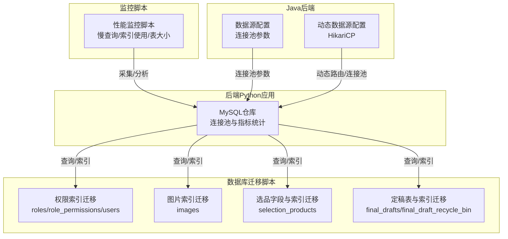
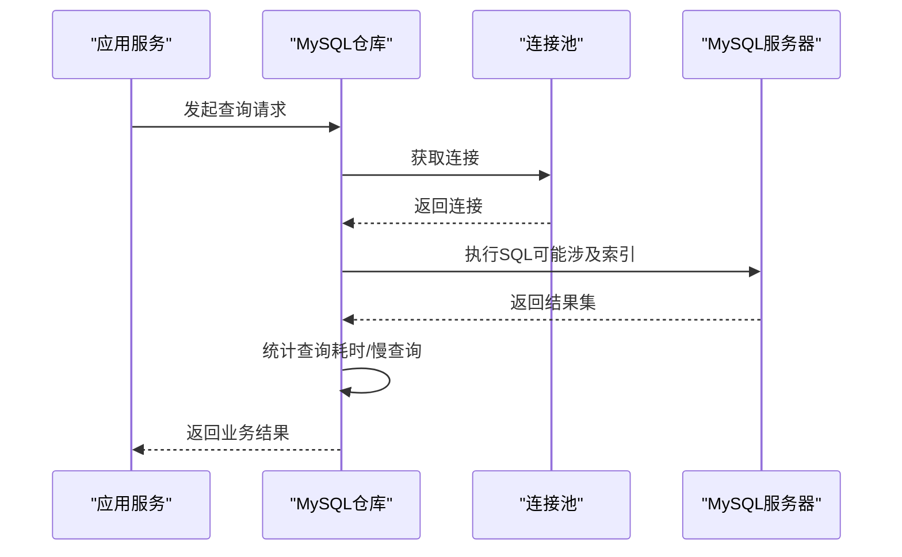
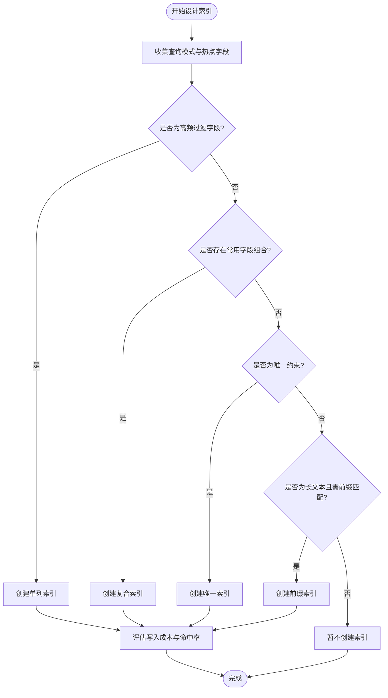
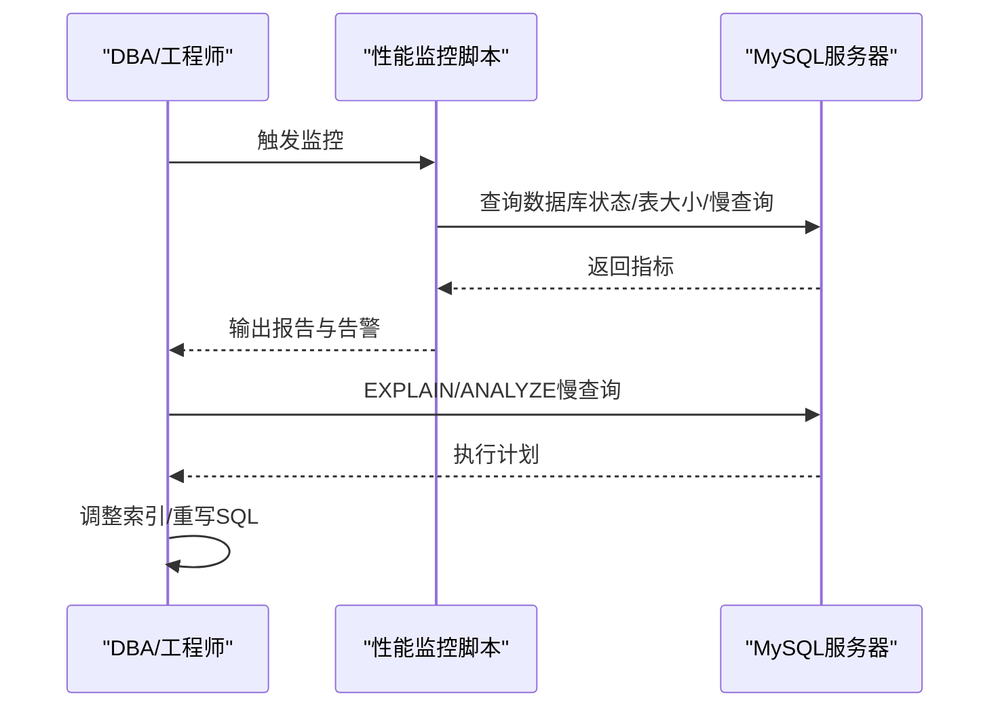
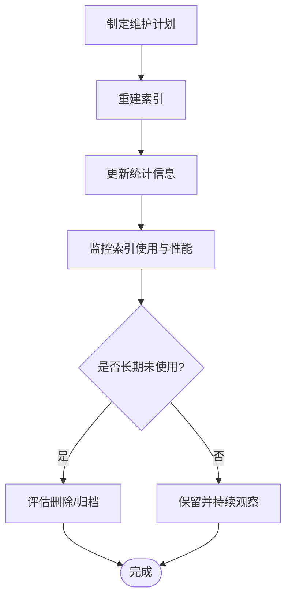
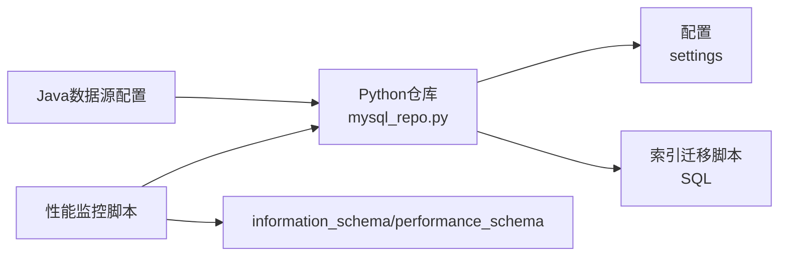

# 索引优化

<cite>
**本文引用的文件**
- [add_performance_indexes.py](file://scripts/database/add_performance_indexes.py)
- [performance_monitor.py](file://scripts/monitoring/performance_monitor.py)
- [mysql_repo.py](file://backend/app/repositories/mysql_repo.py)
- [add_images_index.sql](file://backend/migrations/add_images_index.sql)
- [add_role_indexes.sql](file://backend/migrations/add_role_indexes.sql)
- [add_grade_fields_fixed.sql](file://backend/migrations/add_grade_fields_fixed.sql)
- [create_final_drafts_table.sql](file://backend/migrations/create_final_drafts_table.sql)
- [application.yml](file://java-backend/src/main/resources/application.yml)
- [DynamicDataSourceConfig.java](file://java-backend/src/main/java/com/sjzm/config/DynamicDataSourceConfig.java)
</cite>

## 目录
1. [简介](#简介)
2. [项目结构](#项目结构)
3. [核心组件](#核心组件)
4. [架构总览](#架构总览)
5. [详细组件分析](#详细组件分析)
6. [依赖关系分析](#依赖关系分析)
7. [性能考量](#性能考量)
8. [故障排查指南](#故障排查指南)
9. [结论](#结论)
10. [附录](#附录)

## 简介
本文件面向数据库管理员与后端工程师，围绕“思觉智贸”数据库在高并发与海量数据场景下的索引优化实践，系统阐述索引设计原则、查询性能分析方法、慢查询优化技巧、执行计划分析、索引维护策略、分区表与全局/局部索引的应用场景，并给出针对现有代码库中的索引实现与监控脚本的实操建议与最佳实践。

## 项目结构
本项目的数据库相关实现主要分布在以下位置：
- 后端Python应用的数据库仓库层负责连接池管理、查询性能指标统计与必要索引的自动创建。
- SQL迁移脚本用于为特定表添加索引或字段，覆盖权限体系、定稿表、图片表等。
- 监控脚本用于定期采集数据库状态、表大小、慢查询与索引使用情况，形成性能报告。
- Java后端的数据源配置展示了连接池参数与预编译语句优化，间接影响索引使用效果。

图表来源
- [mysql_repo.py:81-116](file://backend/app/repositories/mysql_repo.py#L81-L116)
- [add_role_indexes.sql:1-17](file://backend/migrations/add_role_indexes.sql#L1-L17)
- [add_images_index.sql:1-33](file://backend/migrations/add_images_index.sql#L1-L33)
- [add_grade_fields_fixed.sql:45-81](file://backend/migrations/add_grade_fields_fixed.sql#L45-L81)
- [create_final_drafts_table.sql:1-39](file://backend/migrations/create_final_drafts_table.sql#L1-L39)
- [performance_monitor.py:200-227](file://scripts/monitoring/performance_monitor.py#L200-L227)
- [application.yml:42-85](file://java-backend/src/main/resources/application.yml#L42-L85)
- [DynamicDataSourceConfig.java:74-94](file://java-backend/src/main/java/com/sjzm/config/DynamicDataSourceConfig.java#L74-L94)

章节来源
- [mysql_repo.py:81-116](file://backend/app/repositories/mysql_repo.py#L81-L116)
- [performance_monitor.py:200-227](file://scripts/monitoring/performance_monitor.py#L200-L227)
- [application.yml:42-85](file://java-backend/src/main/resources/application.yml#L42-L85)
- [DynamicDataSourceConfig.java:74-94](file://java-backend/src/main/java/com/sjzm/config/DynamicDataSourceConfig.java#L74-L94)

## 核心组件
- MySQL仓库与连接池：负责建立连接池、执行查询、统计慢查询比例与平均耗时，并在初始化阶段尝试创建必要索引。
- 索引迁移脚本：按需为权限、图片、选品、定稿等表添加单列/复合/唯一索引，提升典型查询效率。
- 性能监控脚本：周期性采集数据库状态、表大小、慢查询与索引使用情况，生成JSON报告并触发告警。
- Java后端数据源配置：通过连接池参数与预编译语句优化，降低网络往返与解析开销，间接提升索引命中率与整体吞吐。

章节来源
- [mysql_repo.py:81-116](file://backend/app/repositories/mysql_repo.py#L81-L116)
- [mysql_repo.py:301-351](file://backend/app/repositories/mysql_repo.py#L301-L351)
- [add_role_indexes.sql:1-17](file://backend/migrations/add_role_indexes.sql#L1-L17)
- [add_images_index.sql:1-33](file://backend/migrations/add_images_index.sql#L1-L33)
- [add_grade_fields_fixed.sql:45-81](file://backend/migrations/add_grade_fields_fixed.sql#L45-L81)
- [create_final_drafts_table.sql:1-39](file://backend/migrations/create_final_drafts_table.sql#L1-L39)
- [performance_monitor.py:107-178](file://scripts/monitoring/performance_monitor.py#L107-L178)
- [application.yml:42-85](file://java-backend/src/main/resources/application.yml#L42-L85)
- [DynamicDataSourceConfig.java:74-94](file://java-backend/src/main/java/com/sjzm/config/DynamicDataSourceConfig.java#L74-L94)

## 架构总览
下图展示从应用到数据库的查询链路，以及索引在其中的关键作用：应用侧通过连接池发起SQL，数据库根据执行计划选择索引，返回结果；监控脚本定期采集并反馈性能指标。

图表来源
- [mysql_repo.py:81-116](file://backend/app/repositories/mysql_repo.py#L81-L116)
- [mysql_repo.py:301-351](file://backend/app/repositories/mysql_repo.py#L301-L351)

## 详细组件分析

### 组件A：索引设计与迁移策略
- 设计原则
  - 单列索引：优先为高频过滤字段（如日期、ASIN、国家、商店、开发者、状态、创建时间）建立单列索引，提升等值/范围查询效率。
  - 复合索引：为常见查询组合（如“日期+分类”、“日期+商店”、“日期+国家”、“日期+开发者”、“ASIN+分类”、“日期+ASIN”）建立复合索引，减少回表与排序成本。
  - 唯一索引：对唯一约束字段（如SKU、主键）建立唯一索引，确保数据一致性并加速去重与关联。
  - 前缀索引：对长文本字段（如URL前缀）采用前缀索引，平衡索引大小与区分度。
- 实践案例
  - 图片表：为对象键与URL前缀建立索引，显著降低定稿下载时的查询耗时。
  - 权限表：为角色名、父级ID、用户角色、权限组合建立索引，提升RBAC查询性能。
  - 选品表：为等级、评分、周标签、是否本周字段建立索引，支撑筛选与聚合。
  - 定稿表：为SKU、批次、开发者、载体、状态、创建时间建立索引，满足多维查询需求。
- 选择策略
  - 基于查询模式：优先覆盖WHERE、JOIN、ORDER BY、GROUP BY中出现的字段。
  - 基于基数：高基数字段更利于区分，适合优先建索引。
  - 基于写入成本：权衡写入时的索引维护开销，避免冗余索引。

章节来源
- [add_images_index.sql:1-33](file://backend/migrations/add_images_index.sql#L1-L33)
- [add_role_indexes.sql:1-17](file://backend/migrations/add_role_indexes.sql#L1-L17)
- [add_grade_fields_fixed.sql:45-81](file://backend/migrations/add_grade_fields_fixed.sql#L45-L81)
- [create_final_drafts_table.sql:1-39](file://backend/migrations/create_final_drafts_table.sql#L1-L39)
- [add_performance_indexes.py:34-52](file://scripts/database/add_performance_indexes.py#L34-L52)

### 组件B：查询性能分析与慢查询优化
- 慢查询识别
  - 使用性能监控脚本检查慢查询阈值与最近慢查询摘要，关注平均延迟与执行次数。
  - 结合数据库慢查询日志变量，定位超过阈值的SQL。
- 执行计划分析
  - 在MySQL中使用EXPLAIN/EXPLAIN ANALYZE查看执行计划，确认是否使用了预期索引、是否存在全表扫描或临时表。
  - 关注回表次数、排序与临时表大小，针对性调整索引或改写SQL。
- 优化技巧
  - 将过滤条件尽量前置到WHERE子句，使索引选择性最大化。
  - 对IN列表进行去重与限制，避免索引失效。
  - 使用覆盖索引减少回表，或将JOIN改写为EXISTS以降低中间结果集。
  - 合理拆分复杂查询，利用物化视图或汇总表承载高频聚合。

图表来源
- [performance_monitor.py:107-178](file://scripts/monitoring/performance_monitor.py#L107-L178)
- [mysql_repo.py:301-351](file://backend/app/repositories/mysql_repo.py#L301-L351)

章节来源
- [performance_monitor.py:107-178](file://scripts/monitoring/performance_monitor.py#L107-L178)
- [mysql_repo.py:301-351](file://backend/app/repositories/mysql_repo.py#L301-L351)

### 组件C：索引维护策略与统计信息更新
- 定期重建
  - 对碎片化严重的索引进行重建（REBUILD/REORGANIZE），恢复索引顺序与页利用率。
  - 在低峰期批量执行，避免阻塞线上流量。
- 统计信息更新
  - 使用ANALYZE TABLE更新表与索引统计信息，帮助优化器做出更准确的成本估算。
  - 结合监控脚本的表分析流程，自动化执行。
- 索引健康检查
  - 通过innodb_index_stats与性能监控脚本的索引使用情况，识别长期未使用的索引并评估归档或删除风险。

章节来源
- [add_performance_indexes.py:123-146](file://scripts/database/add_performance_indexes.py#L123-L146)
- [performance_monitor.py:153-178](file://scripts/monitoring/performance_monitor.py#L153-L178)

### 组件D：分区表、全局索引与局部索引
- 分区表设计
  - 建议按时间维度（如年月）对历史数据量巨大的表进行分区，降低扫描范围。
  - 对分区键进行合理选择，确保查询能下推到具体分区。
- 全局索引与局部索引
  - 全局索引：跨分区的唯一/非唯一索引，便于跨分区查询，但维护成本较高。
  - 局部索引：每个分区维护独立索引，写入成本更低，但跨分区查询需额外处理。
- 应用场景
  - 高频按时间过滤的报表/分析表：优先考虑分区+局部索引，配合物化汇总表。
  - 强一致性的唯一约束：优先全局唯一索引，牺牲部分写入性能换取查询简单性。

（本节为概念性说明，无需代码来源）

### 组件E：索引对写入性能的影响与平衡策略
- 影响因素
  - 写入放大：INSERT/UPDATE/DELETE会触发索引维护，导致额外IO与锁竞争。
  - 并发冲突：高并发写入时，索引页分裂与自适应哈希竞争可能成为瓶颈。
- 平衡策略
  - 读多写少场景：适度增加索引密度，提升查询性能。
  - 写多读少场景：减少非必要索引，合并写操作，使用批量提交。
  - 业务削峰：通过消息队列异步落库，错峰写入数据库。
  - 连接池与预编译：优化连接池参数与预编译语句，减少网络与解析开销，间接提升整体吞吐。

章节来源
- [application.yml:42-85](file://java-backend/src/main/resources/application.yml#L42-L85)
- [DynamicDataSourceConfig.java:74-94](file://java-backend/src/main/java/com/sjzm/config/DynamicDataSourceConfig.java#L74-L94)

## 依赖关系分析
- 应用层依赖
  - Python仓库层依赖连接池与配置，负责查询统计与索引创建。
  - Java后端依赖数据源配置，通过连接池参数与预编译优化影响索引使用效果。
- 数据层依赖
  - 迁移脚本定义了各表的索引策略，直接影响查询执行计划。
  - 监控脚本依赖information_schema与performance_schema，采集索引使用与慢查询信息。

图表来源
- [mysql_repo.py:81-116](file://backend/app/repositories/mysql_repo.py#L81-L116)
- [application.yml:42-85](file://java-backend/src/main/resources/application.yml#L42-L85)
- [performance_monitor.py:107-178](file://scripts/monitoring/performance_monitor.py#L107-L178)

章节来源
- [mysql_repo.py:81-116](file://backend/app/repositories/mysql_repo.py#L81-L116)
- [application.yml:42-85](file://java-backend/src/main/resources/application.yml#L42-L85)
- [performance_monitor.py:107-178](file://scripts/monitoring/performance_monitor.py#L107-L178)

## 性能考量
- 查询路径优化
  - 优先使用覆盖索引，减少回表。
  - 将选择性高的过滤条件放在WHERE前部，提升索引选择性。
- 写入路径优化
  - 合理设置连接池大小与超时，避免连接争用。
  - 使用批量插入与事务合并，降低索引维护频率。
- 监控与预警
  - 建议每5分钟运行一次性能监控脚本，关注慢查询与索引使用异常。
  - 对平均延迟超过阈值的查询及时介入，必要时调整索引或SQL。

（本节提供通用指导，无需代码来源）

## 故障排查指南
- 常见问题
  - 慢查询增多：检查是否有新表未分析、索引未覆盖、SQL未命中索引。
  - 写入延迟上升：检查索引数量是否过多、连接池是否饱和、是否存在热点写入。
  - 索引失效：确认SQL谓词是否导致索引下推失败，或是否被函数包裹。
- 排查步骤
  - 使用性能监控脚本导出报告，定位慢查询与索引使用异常。
  - 在MySQL中执行EXPLAIN/ANALYZE，核对执行计划与索引选择。
  - 对碎片化严重或长期未使用的索引进行重建或删除评估。
  - 检查连接池参数与预编译配置，避免不必要的网络与解析开销。

章节来源
- [performance_monitor.py:107-178](file://scripts/monitoring/performance_monitor.py#L107-L178)
- [mysql_repo.py:301-351](file://backend/app/repositories/mysql_repo.py#L301-L351)

## 结论
通过对现有迁移脚本与监控脚本的梳理，可以形成一套“设计—实施—监控—优化”的闭环：先基于查询模式设计索引，再通过迁移脚本落地，最后用监控脚本持续观测与预警。在此基础上，结合分区表、全局/局部索引策略与写入路径优化，能够有效平衡查询性能与写入成本，支撑“思觉智贸”在高并发与大数据场景下的稳定运行。

## 附录
- 常用查询语句与索引设计方案（示意）
  - 按日期与分类筛选：建议复合索引(date, main_category_rank)，并确保统计信息更新。
  - 按ASIN与日期组合查询：建议复合索引(asin, date)。
  - 按SKU精确查找：建议索引(sku)或唯一索引。
  - 按状态与创建时间排序：建议索引(status, create_time)。
  - 按商店/国家/开发者过滤：分别建立单列索引以支持等值/范围查询。
- 索引维护清单
  - 每周：运行ANALYZE TABLE，导出性能报告。
  - 每月：评估未使用索引，清理冗余索引。
  - 季度：对热点表进行索引重建，核对执行计划变化。

（本节为概念性说明，无需代码来源）