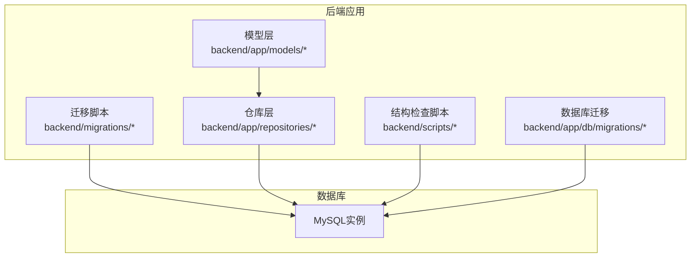
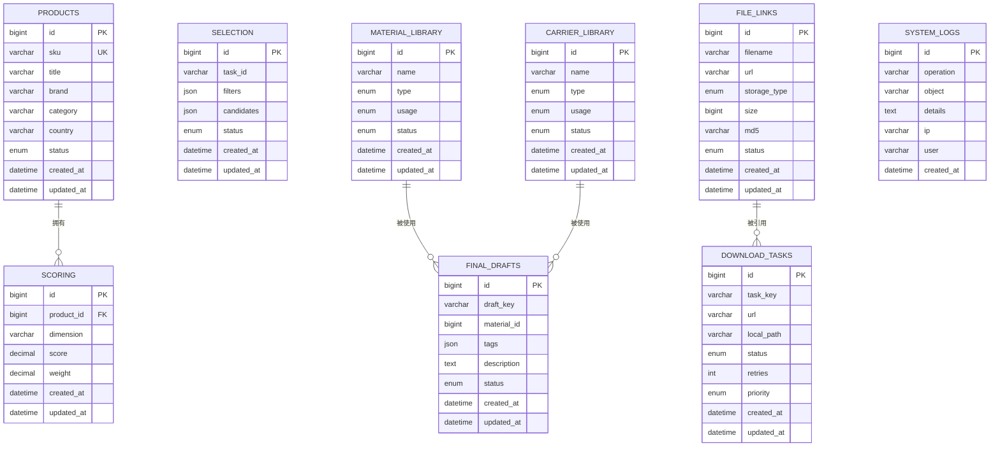
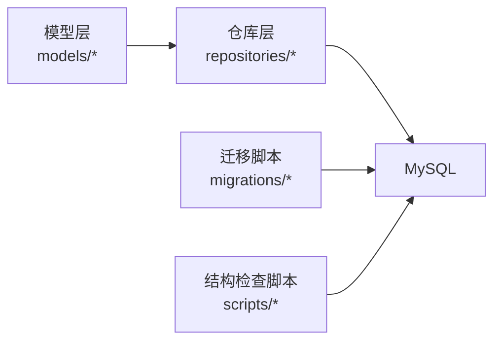

# 表结构设计

<cite>
**本文引用的文件**
- [mysql_repo.py](file://backend/app/repositories/mysql_repo.py)
- [check_database_tables.py](file://backend/scripts/check_database_tables.py)
- [check_table_structure.py](file://scripts/database/check_table_structure.py)
- [check_product_data_tables.py](file://backend/scripts/check_product_data_tables.py)
- [create_final_drafts_table.sql](file://backend/app/db/migrations/create_final_drafts_table.sql)
- [add_download_tasks_table.sql](file://backend/migrations/add_download_tasks_table.sql)
- [init_database.sql](file://backend/migrations/init_database.sql)
- [init_scoring_system.sql](file://backend/migrations/init_scoring_system.sql)
- [create_scoring_tables.sql](file://backend/migrations/create_scoring_tables.sql)
- [create_material_carrier_tables.sql](file://backend/migrations/create_material_carrier_tables.sql)
- [add_scoring_fields.sql](file://backend/migrations/add_scoring_fields.sql)
- [add_grade_fields.sql](file://backend/migrations/add_grade_fields.sql)
- [add_grade_fields_fixed.sql](file://backend/migrations/add_grade_fields_fixed.sql)
- [add_infringement_label.sql](file://backend/migrations/add_infringement_label.sql)
- [add_country_and_filter_mode.sql](file://backend/migrations/add_country_and_filter_mode.sql)
- [add_country_and_filter_mode_to_recycle_bin.sql](file://backend/migrations/add_country_and_filter_mode_to_recycle_bin.sql)
- [add_missing_fields.sql](file://backend/migrations/add_missing_fields.sql)
- [add_original_image_metadata.sql](file://backend/migrations/add_original_image_metadata.sql)
- [add_original_zip_fields.sql](file://backend/migrations/add_original_zip_fields.sql)
- [add_image_storage_fields.sql](file://backend/migrations/add_image_storage_fields.sql)
- [add_thumbnail_columns.sql](file://backend/migrations/add_thumbnail_columns.sql)
- [add_images_index.sql](file://backend/migrations/add_images_index.sql)
- [system_log_tables.sql](file://backend/migrations/system_log_tables.sql)
- [create_backup_records_table.sql](file://backend/migrations/001_create_backup_records_table.sql)
- [product.py](file://backend/app/models/product.py)
- [selection.py](file://backend/app/models/selection.py)
- [download_task.py](file://backend/app/models/download_task.py)
- [final_draft.py](file://backend/app/models/final_draft.py)
- [scoring.py](file://backend/app/models/scoring.py)
- [material_library.py](file://backend/app/models/material_library.py)
- [carrier_library.py](file://backend/app/models/carrier_library.py)
- [file_link.py](file://backend/app/models/file_link.py)
- [system_log.py](file://backend/app/models/system_log.py)
</cite>

## 目录
1. [简介](#简介)
2. [项目结构](#项目结构)
3. [核心组件](#核心组件)
4. [架构总览](#架构总览)
5. [详细组件分析](#详细组件分析)
6. [依赖分析](#依赖分析)
7. [性能考虑](#性能考虑)
8. [故障排查指南](#故障排查指南)
9. [结论](#结论)
10. [附录](#附录)

## 简介
本文件面向数据库设计者与开发者，系统性梳理“思觉智贸”项目的核心业务表结构，覆盖字段类型、长度限制、约束条件、主键设计、外键关系与参照完整性，并给出各表用途、数据字典与字段释义。重点涵盖产品表、选品表、下载任务表、终稿表、评分表、素材库/载体库、文件链接表以及系统日志等。同时提供表间关系图与ER图，帮助快速理解数据模型与业务流转。

## 项目结构
后端采用Python+MySQL架构，通过迁移脚本管理数据库演进，模型层位于backend/app/models，仓库层封装数据库访问，脚本用于结构检查与数据校验。迁移脚本集中于backend/migrations与backend/app/db/migrations目录；结构检查脚本位于backend/scripts与根目录scripts/database。

**图表来源**
- [mysql_repo.py](file://backend/app/repositories/mysql_repo.py)
- [check_database_tables.py](file://backend/scripts/check_database_tables.py)
- [init_database.sql](file://backend/migrations/init_database.sql)
- [create_final_drafts_table.sql](file://backend/app/db/migrations/create_final_drafts_table.sql)

**章节来源**
- [mysql_repo.py](file://backend/app/repositories/mysql_repo.py)
- [check_database_tables.py](file://backend/scripts/check_database_tables.py)
- [init_database.sql](file://backend/migrations/init_database.sql)

## 核心组件
本节从数据模型视角，对关键业务表进行结构定义与约束说明，统一遵循以下设计原则：
- 主键：优先使用自增整型或UUID，确保全局唯一且有序（如适用）
- 外键：明确关联关系，保持参照完整性；非强依赖场景可使用逻辑外键
- 约束：NOT NULL、ENUM枚举、默认值、长度限制
- 索引：在高频过滤/排序/关联字段建立索引，兼顾写入性能
- 时间戳：统一使用DATETIME并启用自动更新

以下为核心业务表的结构要点与用途概览（字段与约束以实际迁移脚本为准）：

- 产品表（products）
  - 用途：承载平台商品基础信息，支持筛选、评分、选品等流程
  - 关键字段：主键、SKU、标题、品牌、类目、国家/站点、状态、评分字段、侵权标签、原图/缩略图元数据、创建/更新时间
  - 约束：SKU唯一；多字段枚举/状态；默认时间戳
  - 设计考虑：SKU作为业务关键标识，需唯一且稳定；国家/站点字段用于多市场隔离；侵权标签用于合规控制

- 选品表（selection）
  - 用途：保存用户选品任务与候选集，支持历史回溯与重试
  - 关键字段：主键、任务ID、ASIN集合、筛选条件、命中结果、状态、创建/更新时间
  - 约束：任务状态枚举；JSON字段存储复杂条件
  - 设计考虑：条件JSON便于灵活扩展；状态机驱动流程推进

- 下载任务表（download_tasks）
  - 用途：记录图片/资源下载任务，支持并发与断点续传
  - 关键字段：主键、任务标识、目标URL、本地路径、状态、重试次数、优先级、创建/更新时间
  - 约束：状态枚举；优先级枚举；默认时间戳
  - 设计考虑：优先级用于调度；重试次数防止无限循环；状态机保证幂等

- 终稿表（final_drafts）
  - 用途：保存最终定稿的素材与标注信息
  - 关键字段：主键、终稿标识、素材ID、标签、描述、状态、创建/更新时间
  - 约束：状态枚举；默认时间戳
  - 设计考虑：与素材库解耦，便于版本化管理

- 评分表（scoring）
  - 用途：存储产品评分维度与得分，支撑AI打分与人工复核
  - 关键字段：主键、产品ID、评分维度、得分、权重、创建/更新时间
  - 约束：维度唯一性；得分范围校验；默认时间戳
  - 设计考虑：维度化评分利于A/B与趋势分析

- 素材库/载体库（material_library、carrier_library）
  - 用途：素材与载体（如包装、背景）的统一管理
  - 关键字段：主键、名称、类型、用途、状态、创建/更新时间
  - 约束：类型/状态枚举；默认时间戳
  - 设计考虑：类型区分素材类别；用途限定使用场景

- 文件链接表（file_links）
  - 用途：记录文件上传/下载链接与元数据
  - 关键字段：主键、文件名、URL、存储类型、大小、MD5、状态、创建/更新时间
  - 约束：唯一索引（文件名/MD5）；状态枚举；默认时间戳
  - 设计考虑：MD5用于去重与一致性校验

- 系统日志表（system_logs）
  - 用途：记录系统运行日志与审计轨迹
  - 关键字段：主键、操作类型、对象、详情、IP、用户、时间
  - 约束：默认时间戳
  - 设计考虑：结构化日志便于检索与统计

**章节来源**
- [product.py](file://backend/app/models/product.py)
- [selection.py](file://backend/app/models/selection.py)
- [download_task.py](file://backend/app/models/download_task.py)
- [final_draft.py](file://backend/app/models/final_draft.py)
- [scoring.py](file://backend/app/models/scoring.py)
- [material_library.py](file://backend/app/models/material_library.py)
- [carrier_library.py](file://backend/app/models/carrier_library.py)
- [file_link.py](file://backend/app/models/file_link.py)
- [system_log.py](file://backend/app/models/system_log.py)

## 架构总览
下图展示核心业务表与系统日志表之间的关系，体现数据流向与依赖关系。

**图表来源**
- [product.py](file://backend/app/models/product.py)
- [selection.py](file://backend/app/models/selection.py)
- [download_task.py](file://backend/app/models/download_task.py)
- [final_draft.py](file://backend/app/models/final_draft.py)
- [scoring.py](file://backend/app/models/scoring.py)
- [material_library.py](file://backend/app/models/material_library.py)
- [carrier_library.py](file://backend/app/models/carrier_library.py)
- [file_link.py](file://backend/app/models/file_link.py)
- [system_log.py](file://backend/app/models/system_log.py)

## 详细组件分析

### 产品表（products）
- 字段设计要点
  - 主键：自增ID
  - SKU：唯一索引，作为业务主键
  - 标题/品牌/类目：字符串，长度依据业务需要设定
  - 国家/站点：字符串，用于多市场隔离
  - 状态：枚举，如draft/published/archived等
  - 评分字段：用于AI或人工评分
  - 侵权标签：布尔或枚举，用于合规控制
  - 原图/缩略图元数据：JSON或独立列，记录URL、尺寸、MD5等
  - 时间戳：创建/更新时间
- 约束与索引
  - SKU唯一
  - 国家/站点+SKU组合索引（如需联合过滤）
  - 标题/品牌/类目建立前缀索引（如需模糊匹配）
- 业务规则
  - SKU不可重复；状态机驱动发布/归档流程
  - 侵权标签触发下架流程

**章节来源**
- [product.py](file://backend/app/models/product.py)
- [add_scoring_fields.sql](file://backend/migrations/add_scoring_fields.sql)
- [add_infringement_label.sql](file://backend/migrations/add_infringement_label.sql)
- [add_original_image_metadata.sql](file://backend/migrations/add_original_image_metadata.sql)
- [add_thumbnail_columns.sql](file://backend/migrations/add_thumbnail_columns.sql)

### 选品表（selection）
- 字段设计要点
  - 主键：自增ID
  - 任务ID：唯一标识一次选品任务
  - 筛选条件：JSON，支持多维条件组合
  - 候选集：JSON，存储命中的产品ID/ASIN
  - 状态：枚举，如pending/processing/completed/failed
  - 时间戳：创建/更新时间
- 约束与索引
  - 任务ID唯一
  - 条件JSON中常用字段建立虚拟列+索引（如需）
- 业务规则
  - 条件JSON支持动态扩展；完成后可导出候选集

**章节来源**
- [selection.py](file://backend/app/models/selection.py)
- [add_country_and_filter_mode.sql](file://backend/migrations/add_country_and_filter_mode.sql)

### 下载任务表（download_tasks）
- 字段设计要点
  - 主键：自增ID
  - 任务键：唯一标识任务
  - URL/本地路径：字符串
  - 状态：枚举，如pending/in_progress/completed/failed
  - 重试次数：整型
  - 优先级：枚举，如high/medium/low
  - 时间戳：创建/更新时间
- 约束与索引
  - 任务键唯一
  - 状态+优先级复合索引
- 业务规则
  - 优先级决定调度顺序；失败达到阈值进入失败队列

**章节来源**
- [download_task.py](file://backend/app/models/download_task.py)
- [add_download_tasks_table.sql](file://backend/migrations/add_download_tasks_table.sql)

### 终稿表（final_drafts）
- 字段设计要点
  - 主键：自增ID
  - 终稿键：唯一标识终稿
  - 素材ID：关联素材库
  - 标签：JSON，支持多维标签
  - 描述：文本
  - 状态：枚举
  - 时间戳：创建/更新时间
- 约束与索引
  - 终稿键唯一
  - 素材ID建立索引
- 业务规则
  - 终稿与素材库解耦，支持版本化与回滚

**章节来源**
- [final_draft.py](file://backend/app/models/final_draft.py)
- [create_final_drafts_table.sql](file://backend/app/db/migrations/create_final_drafts_table.sql)

### 评分表（scoring）
- 字段设计要点
  - 主键：自增ID
  - 产品ID：外键关联产品
  - 维度：字符串，唯一性约束
  - 得分：数值型，带精度
  - 权重：数值型，用于加权计算
  - 时间戳：创建/更新时间
- 约束与索引
  - 产品ID+维度唯一
  - 产品ID索引
- 业务规则
  - 维度化评分便于A/B实验与趋势分析

**章节来源**
- [scoring.py](file://backend/app/models/scoring.py)
- [init_scoring_system.sql](file://backend/migrations/init_scoring_system.sql)
- [create_scoring_tables.sql](file://backend/migrations/create_scoring_tables.sql)
- [add_grade_fields.sql](file://backend/migrations/add_grade_fields.sql)
- [add_grade_fields_fixed.sql](file://backend/migrations/add_grade_fields_fixed.sql)

### 素材库/载体库（material_library、carrier_library）
- 字段设计要点
  - 主键：自增ID
  - 名称：字符串
  - 类型：枚举，区分素材类别
  - 用途：枚举，限定使用场景
  - 状态：枚举，如active/suspended
  - 时间戳：创建/更新时间
- 约束与索引
  - 名称+类型组合索引（如需）
- 业务规则
  - 类型与用途共同决定可用性

**章节来源**
- [material_library.py](file://backend/app/models/material_library.py)
- [carrier_library.py](file://backend/app/models/carrier_library.py)
- [create_material_carrier_tables.sql](file://backend/migrations/create_material_carrier_tables.sql)

### 文件链接表（file_links）
- 字段设计要点
  - 主键：自增ID
  - 文件名：字符串
  - URL：字符串
  - 存储类型：枚举，如local/cos等
  - 大小：整型（字节）
  - MD5：字符串，唯一性
  - 状态：枚举
  - 时间戳：创建/更新时间
- 约束与索引
  - 文件名唯一
  - MD5唯一
- 业务规则
  - MD5用于去重与一致性校验；状态机驱动生命周期

**章节来源**
- [file_link.py](file://backend/app/models/file_link.py)
- [add_image_storage_fields.sql](file://backend/migrations/add_image_storage_fields.sql)
- [add_original_zip_fields.sql](file://backend/migrations/add_original_zip_fields.sql)

### 系统日志表（system_logs）
- 字段设计要点
  - 主键：自增ID
  - 操作类型：字符串
  - 对象：字符串
  - 详情：文本
  - IP：字符串
  - 用户：字符串
  - 时间戳：创建时间
- 约束与索引
  - 按时间倒序查询频繁，建议时间索引
- 业务规则
  - 结构化日志便于审计与问题定位

**章节来源**
- [system_log.py](file://backend/app/models/system_log.py)
- [system_log_tables.sql](file://backend/migrations/system_log_tables.sql)

## 依赖分析
- 模型层与仓库层
  - 模型定义字段与约束，仓库层负责执行SQL与事务；两者通过迁移脚本保持一致
- 迁移脚本与数据库
  - 迁移脚本定义表结构、索引与约束；运行后数据库结构即刻生效
- 脚本与工具
  - 结构检查脚本用于批量查看表与字段，辅助验证迁移结果

**图表来源**
- [mysql_repo.py](file://backend/app/repositories/mysql_repo.py)
- [check_database_tables.py](file://backend/scripts/check_database_tables.py)
- [init_database.sql](file://backend/migrations/init_database.sql)

**章节来源**
- [mysql_repo.py](file://backend/app/repositories/mysql_repo.py)
- [check_database_tables.py](file://backend/scripts/check_database_tables.py)

## 性能考虑
- 索引策略
  - 在SKU、任务键、产品ID、文件名、MD5等唯一字段上建立唯一索引
  - 在状态+优先级、国家/站点+状态等高频过滤字段上建立复合索引
  - 对JSON字段中常用键建立虚拟列+索引（如需）
- 写入优化
  - 批量插入与事务提交，减少往返开销
  - 控制单表行宽，避免超长TEXT/JSON影响IO
- 读取优化
  - 使用覆盖索引减少回表
  - 分页查询使用索引扫描，避免ORDER BY + LIMIT导致的文件排序
- 存储与归档
  - 历史数据定期归档至冷存储，降低热表规模

## 故障排查指南
- 表结构缺失或字段不一致
  - 使用结构检查脚本列出所有表与字段，比对预期结构
  - 参考迁移脚本逐条执行，确认索引与约束已创建
- 数据异常
  - 使用数据校验脚本检查product_data_2025XX系列表是否存在数据
  - 核对SKU/任务键/文件名唯一性冲突
- 日志与审计
  - 通过系统日志表定位异常操作与错误上下文
- 常见问题
  - SKU重复：检查唯一索引与导入流程
  - 下载任务卡死：检查状态机与重试阈值
  - 评分维度重复：检查产品ID+维度唯一约束

**章节来源**
- [check_database_tables.py](file://backend/scripts/check_database_tables.py)
- [check_table_structure.py](file://scripts/database/check_table_structure.py)
- [check_product_data_tables.py](file://backend/scripts/check_product_data_tables.py)
- [system_log.py](file://backend/app/models/system_log.py)

## 结论
本设计文档基于迁移脚本与模型层定义，给出了核心业务表的结构、约束与关系图，明确了主键、外键与索引策略，并提供了性能与故障排查建议。建议在后续演进中持续通过迁移脚本与结构检查脚本维护数据库一致性，确保业务稳定增长。

## 附录
- 字段命名规范
  - 采用下划线分隔，如task_key、created_at
  - 时间戳统一使用created_at/updated_at
  - 枚举字段使用enum前缀或显式枚举类型
- 数据类型选择
  - 唯一标识：bigint或uuid
  - 文本：varchar(255)或text，按需选择
  - 数值：decimal(p,s)用于金额/评分；int用于计数
  - JSON：用于动态结构，配合虚拟列与索引
- 业务规则约束
  - 唯一性：SKU、任务键、文件名、MD5
  - 枚举：状态、类型、用途、优先级等
  - 默认值：时间戳默认CURRENT_TIMESTAMP
  - 空值：严格控制NOT NULL，必要时提供默认值