# 产品CRUD操作

<cite>
**本文引用的文件**   
- [products.py](file://backend/app/api/v1/products.py)
- [product.py](file://backend/app/models/product.py)
- [product_service.py](file://backend/app/services/product_service.py)
- [product_data.py](file://backend/app/api/v1/product_data.py)
- [product_data.py](file://backend/app/schemas/product_data.py)
- [product_sales.py](file://backend/app/api/v1/product_sales.py)
- [product_sales_service.py](file://backend/app/services/product_sales_service.py)
- [product_recycle.py](file://backend/app/api/v1/product_recycle.py)
- [product_recycle_service.py](file://backend/app/services/product_recycle_service.py)
- [recycle_bin.py](file://backend/app/api/v1/recycle_bin.py)
- [selection.py](file://backend/app/api/v1/selection.py)
- [selection_service.py](file://backend/app/services/selection_service.py)
- [selection_recycle.py](file://backend/app/api/v1/selection_recycle.py)
- [selection_recycle_service.py](file://backend/app/services/selection_recycle_service.py)
- [product.ts](file://frontend/src/api/product.ts)
- [productData.ts](file://frontend/src/api/productData.ts)
- [product.ts](file://frontend/src/types/product.ts)
- [productData.ts](file://frontend/src/types/productData.ts)
- [ProductManagement.vue](file://frontend/src/views/ProductManagement/index.vue)
- [ProductDetailDialog.vue](file://frontend/src/components/ProductDetailDialog/index.vue)
- [FilterConfigPanel/index.vue](file://frontend/src/components/FilterConfigPanel/index.vue)
- [FilterPresetSelector/index.vue](file://frontend/src/components/FilterPresetSelector/index.vue)
- [UniversalList/index.vue](file://frontend/src/components/UniversalList/index.vue)
- [VirtualList/index.vue](file://frontend/src/components/VirtualList/index.vue)
- [product.ts](file://frontend/src/stores/productData.ts)
- [product.ts](file://frontend/src/stores/user.ts)
- [auth_middleware.py](file://backend/app/middleware/auth_middleware.py)
- [error_handler.py](file://backend/app/middleware/error_handler.py)
- [error_middleware.py](file://backend/app/middleware/error_middleware.py)
- [logging.py](file://backend/app/middleware/logging.py)
- [timeout.py](file://backend/app/middleware/timeout.py)
- [jwt_utils.py](file://backend/app/utils/jwt_utils.py)
- [download_utils.py](file://backend/app/utils/download_utils.py)
- [image_loader.py](file://backend/app/utils/image_loader.py)
- [image_processor.py](file://backend/app/utils/image_processor.py)
- [product_search.py](file://scripts/utils/search/product_search.py)
- [composite_product_validator.py](file://scripts/utils/validation/composite_product_validator.py)
- [backup_service.py](file://backend/app/services/backup_service.py)
- [monitoring_service.py](file://backend/app/services/monitoring_service.py)
- [cos_service.py](file://backend/app/services/cos_service.py)
- [file_upload_service.py](file://backend/app/services/file_upload_service.py)
- [export.py](file://backend/app/api/v1/export.py)
- [import_.py](file://backend/app/api/v1/import_.py)
- [import_export.ts](file://frontend/src/api/import_export.ts)
- [statistics.py](file://backend/app/api/v1/statistics.py)
- [statistics.ts](file://frontend/src/api/statistics.ts)
- [report.ts](file://frontend/src/api/report.ts)
- [report.ts](file://frontend/src/types/report.ts)
- [system_config.py](file://backend/app/api/v1/system_config.py)
- [system_config.ts](file://frontend/src/api/system_config.ts)
- [tags.py](file://backend/app/api/v1/tags.py)
- [tag.ts](file://frontend/src/api/tag.ts)
- [categories.py](file://backend/app/api/v1/categories.py)
- [category.ts](file://frontend/src/api/category.ts)
- [users.py](file://backend/app/api/v1/users.py)
- [user.ts](file://frontend/src/api/user.ts)
</cite>

## 目录
1. [简介](#简介)
2. [项目结构](#项目结构)
3. [核心组件](#核心组件)
4. [架构总览](#架构总览)
5. [详细组件分析](#详细组件分析)
6. [依赖关系分析](#依赖关系分析)
7. [性能考量](#性能考量)
8. [故障排查指南](#故障排查指南)
9. [结论](#结论)
10. [附录](#附录)

## 简介
本技术文档围绕产品CRUD操作展开，覆盖从后端API到前端界面的完整链路，包括RESTful接口设计、实体模型、数据流、交互流程、搜索过滤、批量操作以及错误处理机制。文档以仓库中现有的Python FastAPI后端与Vue前端实现为基础，结合Java后端迁移现状进行说明，并提供最佳实践与排障建议。

## 项目结构
后端采用FastAPI + MySQL + Redis架构，产品相关的核心模块位于backend/app目录下，前端位于frontend/src目录下。产品CRUD涉及以下关键层次：
- API层：定义RESTful接口与路由
- 服务层：封装业务逻辑与数据访问
- 模型层：定义数据结构与校验规则
- 前端API与视图：对接接口并实现用户交互
- 中间件：鉴权、日志、异常与超时处理
- 工具与脚本：搜索、校验、上传、导出等辅助能力

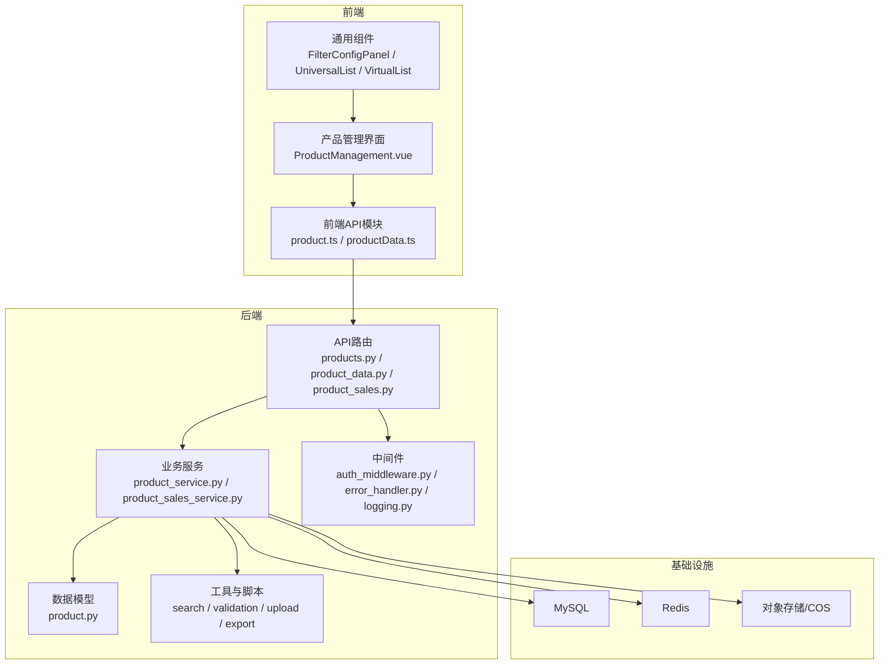

图表来源
- [products.py](file://backend/app/api/v1/products.py)
- [product_service.py](file://backend/app/services/product_service.py)
- [product.py](file://backend/app/models/product.py)
- [auth_middleware.py](file://backend/app/middleware/auth_middleware.py)
- [error_handler.py](file://backend/app/middleware/error_handler.py)
- [logging.py](file://backend/app/middleware/logging.py)

章节来源
- [products.py:1-479](file://backend/app/api/v1/products.py#L1-L479)
- [product.py](file://backend/app/models/product.py)
- [product_service.py](file://backend/app/services/product_service.py)

## 核心组件
- 产品API（Python后端）：提供创建、读取、更新、删除、列表、统计、分类统计、批量更新等接口，当前该模块标注为“待废弃”，最终将迁移到Java后端。
- 产品服务：封装产品数据访问与业务逻辑，负责与数据库、缓存及外部存储交互。
- 产品模型：定义产品实体的数据结构、字段类型、校验规则与业务约束。
- 前端API与视图：通过Axios对接后端接口，实现产品管理界面的增删改查、搜索过滤、批量操作与状态反馈。
- 中间件：统一鉴权、异常处理、日志记录与超时控制。
- 搜索与校验：提供关键词搜索、复合校验等能力，支撑产品筛选与数据质量保障。

章节来源
- [products.py:53-479](file://backend/app/api/v1/products.py#L53-L479)
- [product_service.py](file://backend/app/services/product_service.py)
- [product.py](file://backend/app/models/product.py)
- [product.ts](file://frontend/src/api/product.ts)
- [ProductManagement.vue](file://frontend/src/views/ProductManagement/index.vue)

## 架构总览
产品CRUD在后端由FastAPI路由驱动，服务层协调数据库与缓存，前端通过API模块调用后端接口，中间件贯穿请求生命周期。整体架构强调清晰分层与可扩展性。

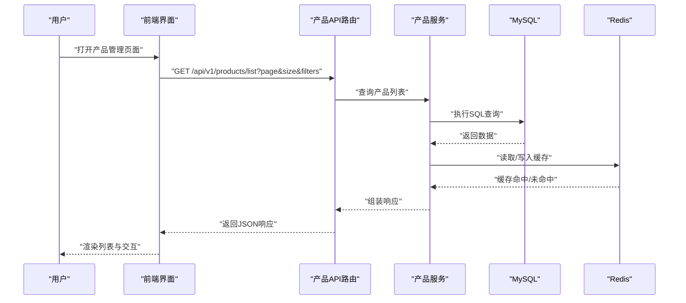

图表来源
- [products.py:88-160](file://backend/app/api/v1/products.py#L88-L160)
- [product_service.py](file://backend/app/services/product_service.py)
- [auth_middleware.py](file://backend/app/middleware/auth_middleware.py)

## 详细组件分析

### 1) 产品实体模型与数据结构
产品实体模型定义了字段、类型、默认值与约束，用于API输入输出与数据库映射。核心字段包括但不限于：标识、名称、类型、描述、分类、标签、价格、库存、图片等。模型还包含查询参数、列表响应、统计响应等配套结构，确保前后端契约一致。

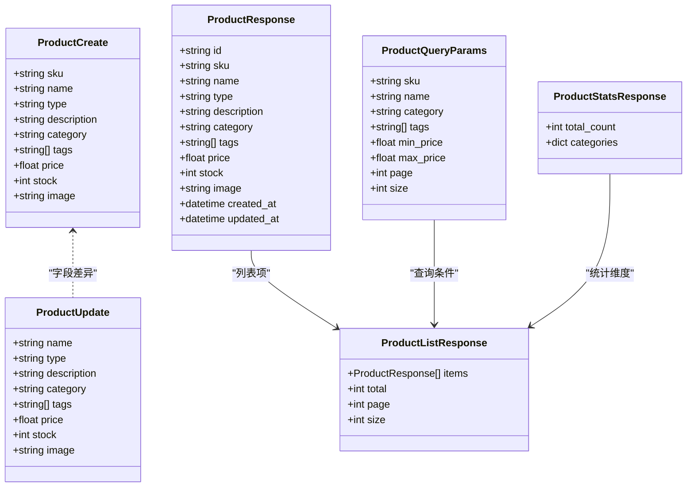

图表来源
- [product.py](file://backend/app/models/product.py)

章节来源
- [product.py](file://backend/app/models/product.py)

### 2) RESTful API接口设计规范
- HTTP方法与URL模式
  - 创建产品：POST /api/v1/products
  - 获取列表：GET /api/v1/products/list
  - 获取详情：GET /api/v1/products/{sku}
  - 更新产品：PUT /api/v1/products/{sku}
  - 删除产品：DELETE /api/v1/products/{sku}
  - 批量更新：PUT /api/v1/products/batch
  - 统计信息：GET /api/v1/products/stats
  - 分类统计：GET /api/v1/products/categories
  - 回收站相关：回收站列表、恢复、永久删除等（见回收站模块）

- 请求与响应格式
  - 统一响应结构：包含code、message、data三段式结构，便于前端统一处理
  - 查询参数：支持分页、关键词、分类、标签、价格区间等多维过滤
  - 错误处理：捕获异常并返回标准错误信息，状态码遵循REST约定

- 鉴权与安全
  - 路由依赖鉴权中间件，确保仅授权用户可访问敏感操作
  - JWT工具与会话管理贯穿认证流程

章节来源
- [products.py:53-479](file://backend/app/api/v1/products.py#L53-L479)
- [auth_middleware.py](file://backend/app/middleware/auth_middleware.py)
- [jwt_utils.py](file://backend/app/utils/jwt_utils.py)

### 3) CRUD流程详解

#### 3.1 创建产品
- 前端：表单收集字段，触发创建请求
- 后端：接收ProductCreate对象，调用产品服务创建
- 数据库：持久化产品记录；缓存：更新相关索引或统计
- 响应：返回创建成功的标准化响应

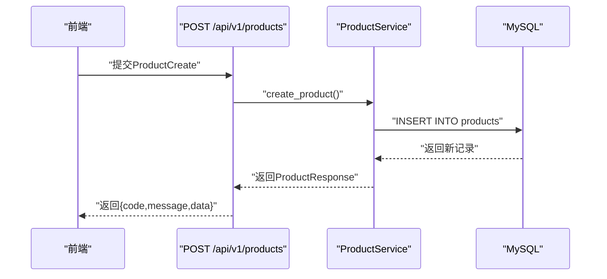

图表来源
- [products.py:53-86](file://backend/app/api/v1/products.py#L53-L86)
- [product_service.py](file://backend/app/services/product_service.py)

章节来源
- [products.py:53-86](file://backend/app/api/v1/products.py#L53-L86)

#### 3.2 读取产品
- 列表查询：支持分页与多维过滤，返回列表与总数
- 详情查询：按SKU精确匹配，返回完整产品信息
- 统计与分类：提供全局统计与分类分布

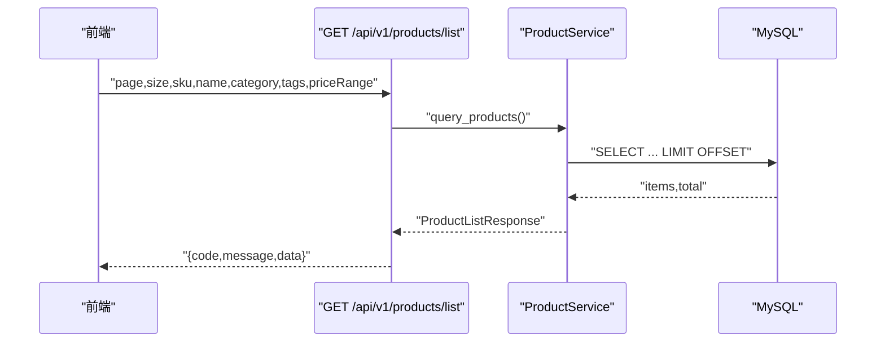

图表来源
- [products.py:88-160](file://backend/app/api/v1/products.py#L88-L160)
- [product_service.py](file://backend/app/services/product_service.py)

章节来源
- [products.py:88-160](file://backend/app/api/v1/products.py#L88-L160)

#### 3.3 更新产品
- 前端：编辑表单，提交ProductUpdate
- 后端：按SKU定位记录，部分字段更新
- 缓存：失效或刷新相关缓存键
- 响应：返回更新后的数据或成功状态

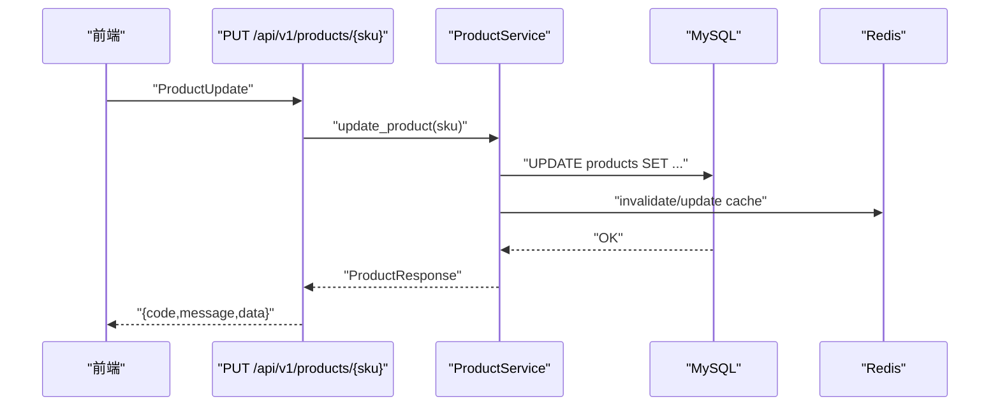

图表来源
- [products.py:259-310](file://backend/app/api/v1/products.py#L259-L310)
- [product_service.py](file://backend/app/services/product_service.py)

章节来源
- [products.py:259-310](file://backend/app/api/v1/products.py#L259-L310)

#### 3.4 删除产品
- 软删除策略：产品进入回收站，保留历史与审计轨迹
- 永久删除：支持批量或单项永久删除
- 回收站管理：提供恢复与清理流程

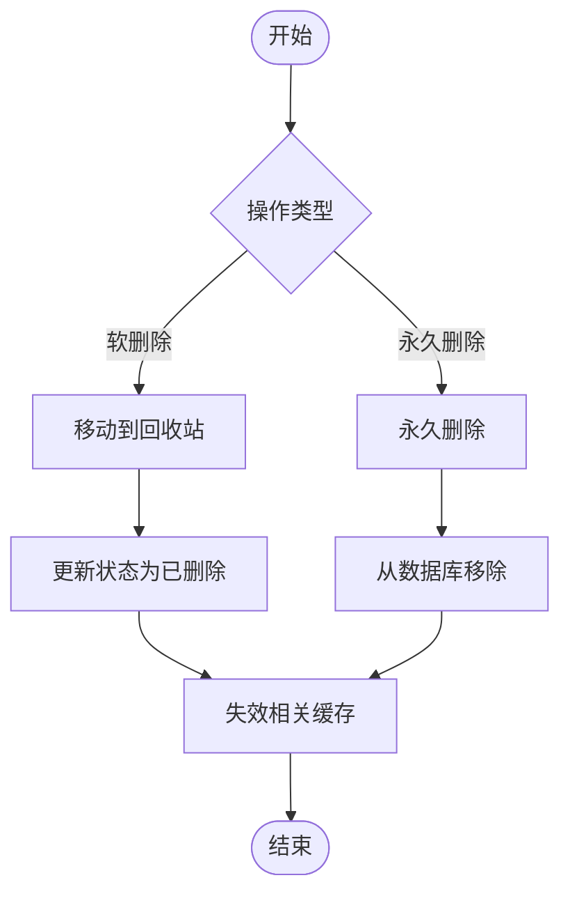

图表来源
- [product_recycle.py](file://backend/app/api/v1/product_recycle.py)
- [product_recycle_service.py](file://backend/app/services/product_recycle_service.py)
- [recycle_bin.py](file://backend/app/api/v1/recycle_bin.py)

章节来源
- [product_recycle.py](file://backend/app/api/v1/product_recycle.py)
- [product_recycle_service.py](file://backend/app/services/product_recycle_service.py)
- [recycle_bin.py](file://backend/app/api/v1/recycle_bin.py)

### 4) 产品管理界面交互流程
- 表单验证：前端对必填字段、格式与范围进行即时校验
- 数据提交：调用对应API完成CRUD操作
- 状态反馈：统一提示消息与错误弹窗
- 错误提示：基于后端返回的code/message进行友好展示

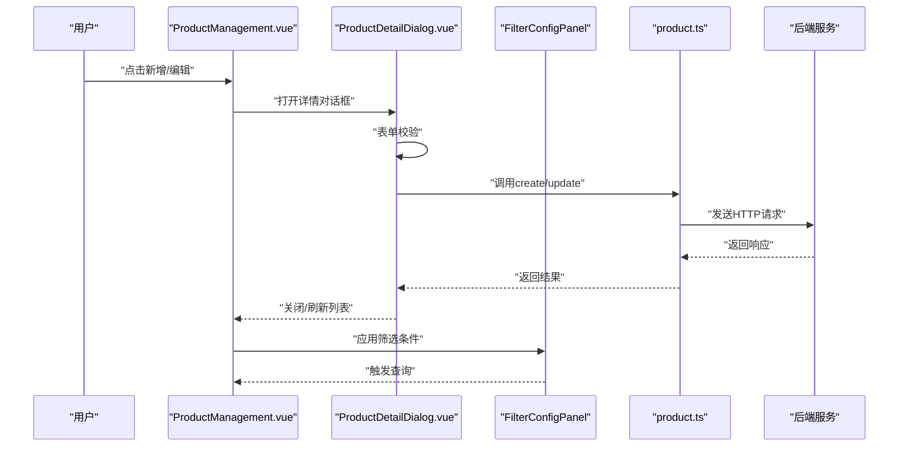

图表来源
- [ProductManagement.vue](file://frontend/src/views/ProductManagement/index.vue)
- [ProductDetailDialog.vue](file://frontend/src/components/ProductDetailDialog/index.vue)
- [FilterConfigPanel/index.vue](file://frontend/src/components/FilterConfigPanel/index.vue)
- [product.ts](file://frontend/src/api/product.ts)

章节来源
- [ProductManagement.vue](file://frontend/src/views/ProductManagement/index.vue)
- [ProductDetailDialog.vue](file://frontend/src/components/ProductDetailDialog/index.vue)
- [FilterConfigPanel/index.vue](file://frontend/src/components/FilterConfigPanel/index.vue)
- [product.ts](file://frontend/src/api/product.ts)

### 5) 产品搜索与过滤
- 关键词搜索：支持SKU、名称等字段模糊匹配
- 分类筛选：按分类维度聚合与过滤
- 标签过滤：多标签交集/并集组合
- 高级查询：价格区间、时间范围、状态等复合条件
- 前端组件：FilterConfigPanel与FilterPresetSelector提供可视化配置与预设保存

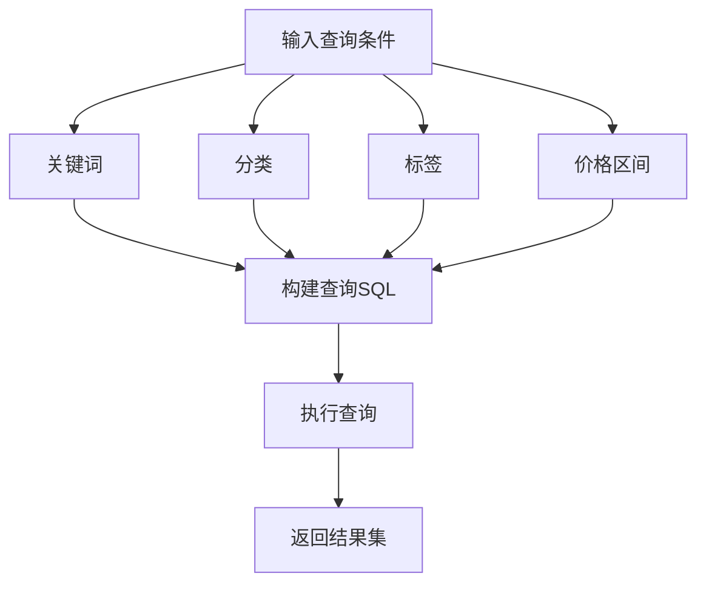

图表来源
- [FilterConfigPanel/index.vue](file://frontend/src/components/FilterConfigPanel/index.vue)
- [FilterPresetSelector/index.vue](file://frontend/src/components/FilterPresetSelector/index.vue)
- [product_search.py](file://scripts/utils/search/product_search.py)

章节来源
- [FilterConfigPanel/index.vue](file://frontend/src/components/FilterConfigPanel/index.vue)
- [FilterPresetSelector/index.vue](file://frontend/src/components/FilterPresetSelector/index.vue)
- [product_search.py](file://scripts/utils/search/product_search.py)

### 6) 批量操作
- 批量选择：列表页支持多选与全选
- 批量删除：软删除至回收站
- 批量更新：统一修改字段（如价格、分类、标签）
- 批量导出：生成报表并下载

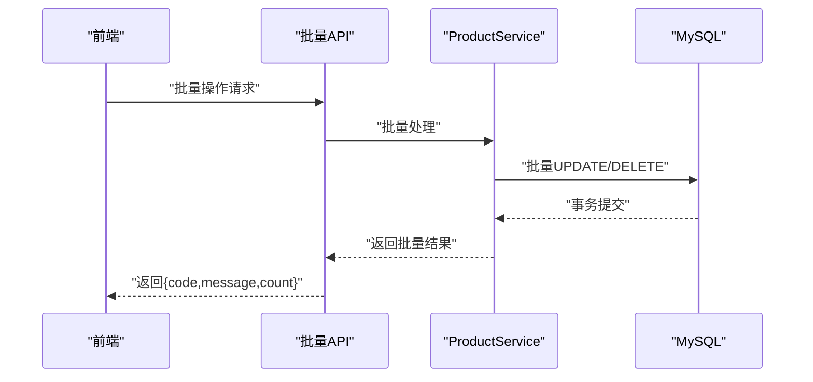

图表来源
- [products.py:471-520](file://backend/app/api/v1/products.py#L471-L520)
- [product_service.py](file://backend/app/services/product_service.py)

章节来源
- [products.py:471-520](file://backend/app/api/v1/products.py#L471-L520)

### 7) 数据关联与扩展
- 产品数据仪表盘：产品数据API与类型定义支撑可视化与报表
- 产品销售：销售数据API与服务，支持销量、趋势等分析
- 选择与回收：与Selection与Recycle模块协同，保证数据一致性

章节来源
- [product_data.py](file://backend/app/api/v1/product_data.py)
- [product_data.py](file://backend/app/schemas/product_data.py)
- [product_sales.py](file://backend/app/api/v1/product_sales.py)
- [product_sales_service.py](file://backend/app/services/product_sales_service.py)
- [selection.py](file://backend/app/api/v1/selection.py)
- [selection_service.py](file://backend/app/services/selection_service.py)
- [selection_recycle.py](file://backend/app/api/v1/selection_recycle.py)
- [selection_recycle_service.py](file://backend/app/services/selection_recycle_service.py)

## 依赖关系分析
- 组件耦合
  - API层依赖服务层；服务层依赖模型与数据源；前端依赖API模块
  - 中间件横切关注点，统一处理鉴权、异常与日志
- 外部依赖
  - 数据库：MySQL（持久化）、Redis（缓存加速）
  - 存储：COS/对象存储（图片与文件）
  - 工具：搜索、校验、上传、导出脚本与服务

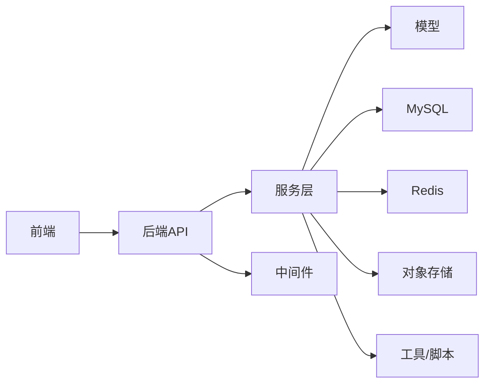

图表来源
- [products.py](file://backend/app/api/v1/products.py)
- [product_service.py](file://backend/app/services/product_service.py)
- [auth_middleware.py](file://backend/app/middleware/auth_middleware.py)
- [cos_service.py](file://backend/app/services/cos_service.py)

章节来源
- [products.py](file://backend/app/api/v1/products.py)
- [product_service.py](file://backend/app/services/product_service.py)
- [auth_middleware.py](file://backend/app/middleware/auth_middleware.py)
- [cos_service.py](file://backend/app/services/cos_service.py)

## 性能考量
- 缓存策略：热点数据与列表分页结果缓存，降低数据库压力
- 分页与索引：合理使用LIMIT/OFFSET与必要索引，避免全表扫描
- 并发与事务：批量操作使用事务，减少锁竞争
- 异步任务：图片处理、导出等耗时操作异步化
- 监控与告警：通过监控服务与日志中间件及时发现性能瓶颈

## 故障排查指南
- 鉴权失败：确认JWT有效与权限范围
- 数据库连接：检查连接池配置与超时设置
- 缓存异常：验证Redis连通性与键空间
- 文件上传：检查COS配置与权限
- 日志定位：通过日志中间件与错误处理器定位异常堆栈

章节来源
- [auth_middleware.py](file://backend/app/middleware/auth_middleware.py)
- [error_handler.py](file://backend/app/middleware/error_handler.py)
- [error_middleware.py](file://backend/app/middleware/error_middleware.py)
- [logging.py](file://backend/app/middleware/logging.py)
- [timeout.py](file://backend/app/middleware/timeout.py)

## 结论
产品CRUD体系以清晰的分层架构与标准化接口为核心，配合前端组件化与中间件横切能力，实现了从创建到回收站管理的全生命周期闭环。当前Python后端的API模块标注为“待废弃”，后续将迁移至Java后端，但现有实现为迁移提供了稳定的契约基础。建议在迁移过程中保持接口兼容与数据一致性，并持续完善搜索、校验与导出等能力。

## 附录
- 前端API与类型
  - 产品API：[product.ts](file://frontend/src/api/product.ts)
  - 产品数据API：[productData.ts](file://frontend/src/api/productData.ts)
  - 类型定义：[product.ts](file://frontend/src/types/product.ts)、[productData.ts](file://frontend/src/types/productData.ts)
- 前端视图与组件
  - 产品管理：[ProductManagement.vue](file://frontend/src/views/ProductManagement/index.vue)
  - 详情对话框：[ProductDetailDialog.vue](file://frontend/src/components/ProductDetailDialog/index.vue)
  - 过滤面板：[FilterConfigPanel/index.vue](file://frontend/src/components/FilterConfigPanel/index.vue)、[FilterPresetSelector/index.vue](file://frontend/src/components/FilterPresetSelector/index.vue)
  - 列表组件：[UniversalList/index.vue](file://frontend/src/components/UniversalList/index.vue)、[VirtualList/index.vue](file://frontend/src/components/VirtualList/index.vue)
- 前端状态与用户
  - 产品状态：[product.ts](file://frontend/src/stores/productData.ts)
  - 用户状态：[product.ts](file://frontend/src/stores/user.ts)
- 前端其他相关模块
  - 导入导出：[import_export.ts](file://frontend/src/api/import_export.ts)
  - 统计与报表：[statistics.ts](file://frontend/src/api/statistics.ts)、[report.ts](file://frontend/src/api/report.ts)
  - 系统配置：[system_config.ts](file://frontend/src/api/system_config.ts)
  - 标签与分类：[tag.ts](file://frontend/src/api/tag.ts)、[category.ts](file://frontend/src/api/category.ts)
  - 用户管理：[user.ts](file://frontend/src/api/user.ts)