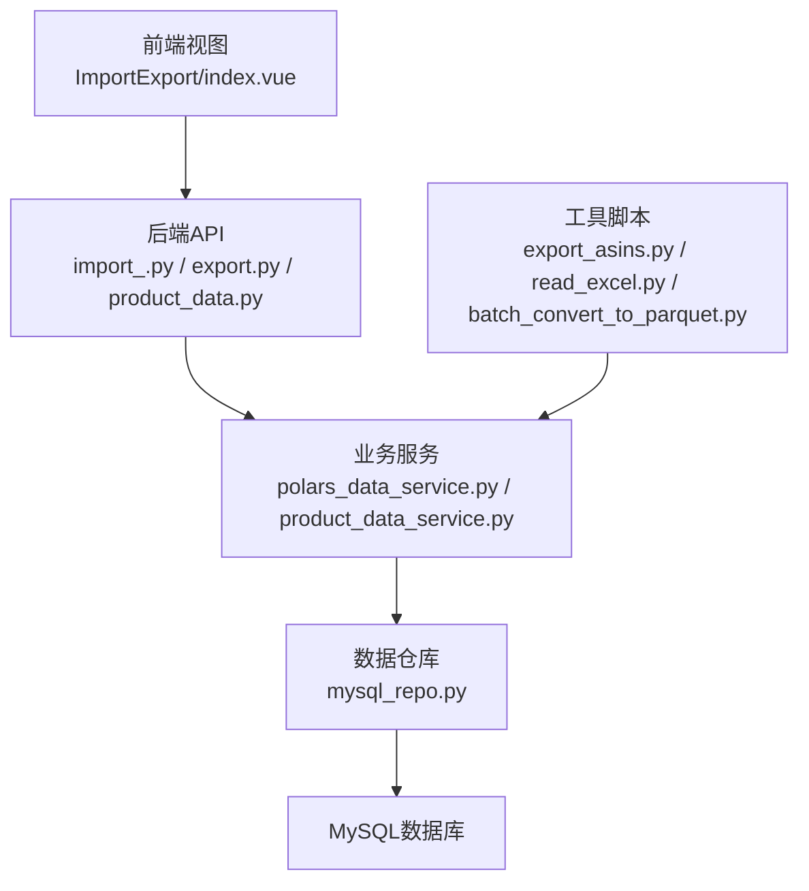
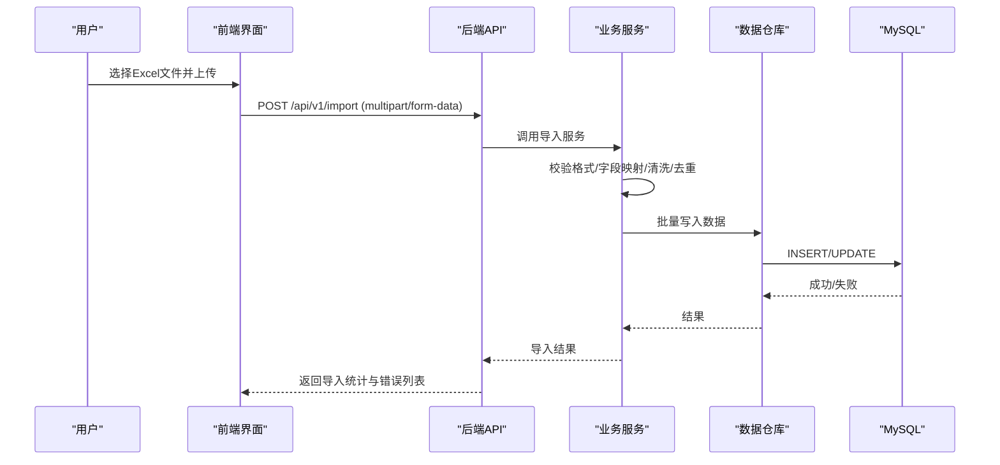
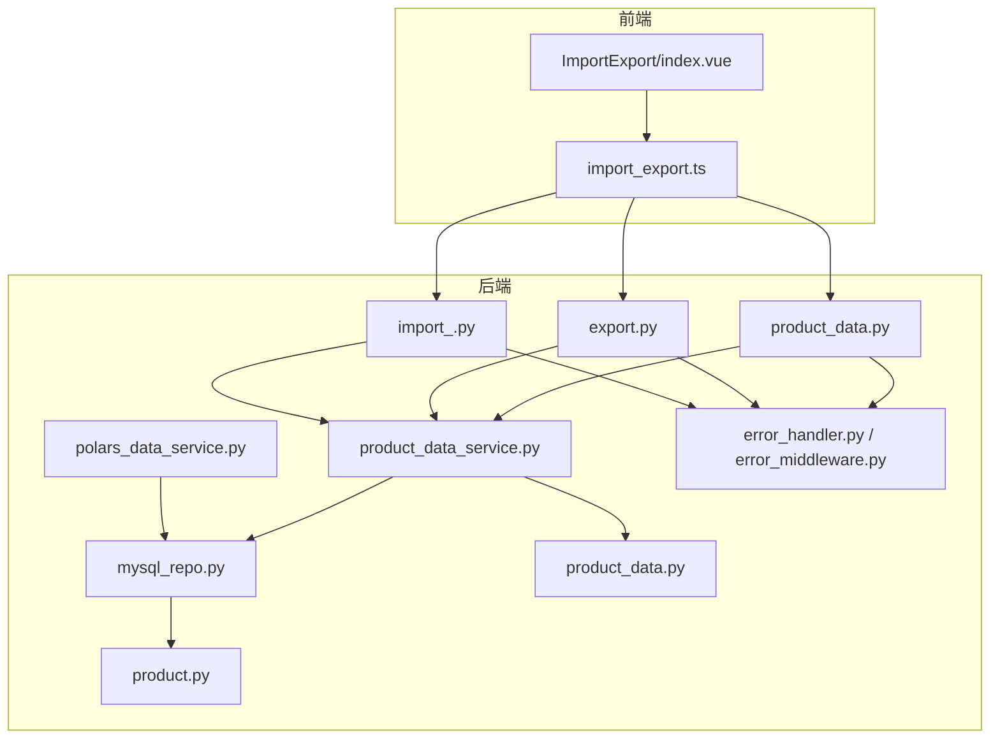

# 产品数据导入导出

<cite>
**本文引用的文件**
- [backend/app/api/v1/import_.py](file://backend/app/api/v1/import_.py)
- [backend/app/api/v1/export.py](file://backend/app/api/v1/export.py)
- [backend/app/api/v1/product_data.py](file://backend/app/api/v1/product_data.py)
- [backend/app/services/polars_data_service.py](file://backend/app/services/polars_data_service.py)
- [backend/app/services/product_data_service.py](file://backend/app/services/product_data_service.py)
- [backend/app/repositories/mysql_repo.py](file://backend/app/repositories/mysql_repo.py)
- [backend/app/models/product.py](file://backend/app/models/product.py)
- [backend/app/schemas/product_data.py](file://backend/app/schemas/product_data.py)
- [backend/app/utils/performance_monitor.py](file://backend/app/utils/performance_monitor.py)
- [frontend/src/views/ImportExport/index.vue](file://frontend/src/views/ImportExport/index.vue)
- [frontend/src/api/import_export.ts](file://frontend/src/api/import_export.ts)
- [scripts/export_asins.py](file://scripts/export_asins.py)
- [scripts/read_excel.py](file://scripts/read_excel.py)
- [scripts/batch_convert_to_parquet.py](file://scripts/batch_convert_to_parquet.py)
- [backend/app/middleware/error_handler.py](file://backend/app/middleware/error_handler.py)
- [backend/app/middleware/error_middleware.py](file://backend/app/middleware/error_middleware.py)
</cite>

## 目录
1. [简介](#简介)
2. [项目结构](#项目结构)
3. [核心组件](#核心组件)
4. [架构概览](#架构概览)
5. [详细组件分析](#详细组件分析)
6. [依赖关系分析](#依赖关系分析)
7. [性能考虑](#性能考虑)
8. [故障排除指南](#故障排除指南)
9. [结论](#结论)
10. [附录](#附录)

## 简介
本技术文档围绕产品数据导入导出功能进行全面阐述，涵盖Excel/CSV格式的文件上传、格式验证、数据解析、批量入库流程；数据导入的预处理步骤（字段映射、数据清洗、重复检测、冲突处理）；批量导出的查询筛选、数据格式转换与文件生成；以及在大数据量场景下使用Polars进行性能优化的策略。同时提供导入导出模板设计规范、错误处理机制、完整的API接口文档与使用示例，帮助开发者快速集成。

## 项目结构
后端采用FastAPI框架，前端使用Vue3 + Element Plus，整体遵循前后端分离架构。导入导出功能主要涉及以下模块：
- 前端视图：导入导出页面与API封装
- 后端API层：导入/导出接口定义
- 业务服务层：数据处理与入库逻辑
- 数据仓库层：MySQL持久化
- 工具脚本：离线数据处理与转换

**图表来源**
- [frontend/src/views/ImportExport/index.vue:1-431](file://frontend/src/views/ImportExport/index.vue#L1-L431)
- [backend/app/api/v1/import_.py](file://backend/app/api/v1/import_.py)
- [backend/app/api/v1/export.py](file://backend/app/api/v1/export.py)
- [backend/app/api/v1/product_data.py:74-103](file://backend/app/api/v1/product_data.py#L74-L103)
- [backend/app/services/polars_data_service.py](file://backend/app/services/polars_data_service.py)
- [backend/app/services/product_data_service.py](file://backend/app/services/product_data_service.py)
- [backend/app/repositories/mysql_repo.py](file://backend/app/repositories/mysql_repo.py)

**章节来源**
- [frontend/src/views/ImportExport/index.vue:1-431](file://frontend/src/views/ImportExport/index.vue#L1-L431)
- [backend/app/api/v1/import_.py](file://backend/app/api/v1/import_.py)
- [backend/app/api/v1/export.py](file://backend/app/api/v1/export.py)
- [backend/app/api/v1/product_data.py:74-103](file://backend/app/api/v1/product_data.py#L74-L103)

## 核心组件
- 前端导入导出界面：支持Excel文件拖拽上传、模板下载、导入状态展示与错误提示。
- 后端导入接口：接收Excel文件，执行格式校验与数据解析，调用服务层进行入库。
- 后端导出接口：根据查询参数筛选数据，生成CSV或Excel文件并流式返回。
- Polars数据服务：在大数据量场景下使用Polars进行高效数据处理与转换。
- 产品数据服务：封装查询、导出、入库等业务逻辑。
- MySQL仓库：提供数据持久化能力。
- 错误处理中间件：统一捕获异常并返回标准化错误响应。

**章节来源**
- [frontend/src/views/ImportExport/index.vue:1-431](file://frontend/src/views/ImportExport/index.vue#L1-L431)
- [backend/app/api/v1/import_.py](file://backend/app/api/v1/import_.py)
- [backend/app/api/v1/export.py](file://backend/app/api/v1/export.py)
- [backend/app/services/polars_data_service.py](file://backend/app/services/polars_data_service.py)
- [backend/app/services/product_data_service.py](file://backend/app/services/product_data_service.py)
- [backend/app/repositories/mysql_repo.py](file://backend/app/repositories/mysql_repo.py)
- [backend/app/middleware/error_handler.py](file://backend/app/middleware/error_handler.py)
- [backend/app/middleware/error_middleware.py](file://backend/app/middleware/error_middleware.py)

## 架构概览
导入导出功能的整体架构如下：

**图表来源**
- [frontend/src/views/ImportExport/index.vue:413-425](file://frontend/src/views/ImportExport/index.vue#L413-L425)
- [backend/app/api/v1/import_.py](file://backend/app/api/v1/import_.py)
- [backend/app/services/product_data_service.py](file://backend/app/services/product_data_service.py)
- [backend/app/repositories/mysql_repo.py](file://backend/app/repositories/mysql_repo.py)

## 详细组件分析

### 前端导入导出界面
- 功能特性
  - 支持拖拽上传Excel文件（.xlsx/.xls），自动校验MIME类型。
  - 展示已选文件信息，支持移除操作。
  - 导入按钮禁用/启用状态管理，加载态提示。
  - 模板下载入口，便于用户按规范准备数据。
- 用户交互流程
  - 文件选择 -> 格式校验 -> 显示文件信息 -> 点击导入 -> 展示导入结果。
- 错误提示
  - 非Excel文件类型时弹出错误消息。
  - 导入过程中根据服务端返回的错误列表进行展示。

**章节来源**
- [frontend/src/views/ImportExport/index.vue:1-431](file://frontend/src/views/ImportExport/index.vue#L1-L431)
- [frontend/src/api/import_export.ts](file://frontend/src/api/import_export.ts)

### 后端导入接口
- 接口定义
  - 方法：POST
  - 路径：/api/v1/import
  - 参数：文件（Excel）、用户认证信息
  - 返回：导入统计（成功/失败计数）与错误详情列表
- 处理流程
  - 接收文件 -> 校验文件类型 -> 解析Excel -> 字段映射与清洗 -> 重复检测 -> 冲突处理 -> 批量入库 -> 返回结果
- 错误处理
  - 格式不兼容、网络中断、数据库异常等均通过中间件统一捕获并返回标准错误码。

**章节来源**
- [backend/app/api/v1/import_.py](file://backend/app/api/v1/import_.py)

### 后端导出接口
- CSV导出
  - 方法：GET
  - 路径：/api/v1/product_data/export
  - 查询参数：起止日期、店铺、国家、类目、月份、开发者、关键词、字段列表
  - 返回：CSV文件流，支持UTF-8-BOM编码
- Excel导出
  - 方法：GET
  - 路径：/api/v1/products/export
  - 查询参数：同上
  - 返回：Excel文件流（.xlsx）

**章节来源**
- [backend/app/api/v1/product_data.py:74-103](file://backend/app/api/v1/product_data.py#L74-L103)
- [backend/app/api/v1/export.py](file://backend/app/api/v1/export.py)

### Polars数据处理服务
- 设计目标
  - 在大数据量场景下提升解析、过滤、转换效率，减少内存占用与CPU消耗。
- 关键策略
  - 使用LazyFrame延迟计算，按需执行，避免不必要的中间结果。
  - 列裁剪与谓词下推，仅加载必要列并提前过滤。
  - 分块读取与批处理写入，降低峰值内存压力。
  - 并行化与向量化操作，充分利用多核CPU。
- 性能监控
  - 集成性能监控工具，记录关键阶段耗时，便于定位瓶颈。

**章节来源**
- [backend/app/services/polars_data_service.py](file://backend/app/services/polars_data_service.py)
- [backend/app/utils/performance_monitor.py](file://backend/app/utils/performance_monitor.py)

### 产品数据服务
- 导入服务
  - 字段映射：将Excel列名映射到模型字段，支持别名与默认值。
  - 数据清洗：去除空值、异常值、重复行，统一数据格式。
  - 重复检测：基于唯一键（如SKU）检测重复，支持跳过或更新策略。
  - 冲突处理：当新旧数据冲突时，依据配置决定保留策略。
  - 批量入库：使用事务与批量INSERT/UPSERT，确保一致性与性能。
- 导出服务
  - 查询筛选：根据传入参数动态构建SQL/Polars查询计划。
  - 字段选择：支持指定导出字段列表，避免冗余列。
  - 格式转换：将数据转换为CSV或Excel格式，处理特殊字符与编码。
  - 文件生成：流式输出，避免大文件内存溢出。

**章节来源**
- [backend/app/services/product_data_service.py](file://backend/app/services/product_data_service.py)
- [backend/app/models/product.py](file://backend/app/models/product.py)
- [backend/app/schemas/product_data.py](file://backend/app/schemas/product_data.py)

### 数据仓库层
- MySQL仓库
  - 提供通用的CRUD操作与批量写入接口。
  - 支持事务管理，保证导入过程的原子性。
  - 索引与约束设计，保障查询与数据完整性。

**章节来源**
- [backend/app/repositories/mysql_repo.py](file://backend/app/repositories/mysql_repo.py)

### 工具脚本
- 导出ASIN数据：用于离线导出特定维度的ASIN列表，便于下游分析。
- 读取Excel：提供基础的Excel读取与列提取能力，辅助导入前的数据预览。
- 批量转换Parquet：将历史数据转换为Parquet格式，提升查询与分析性能。

**章节来源**
- [scripts/export_asins.py](file://scripts/export_asins.py)
- [scripts/read_excel.py](file://scripts/read_excel.py)
- [scripts/batch_convert_to_parquet.py](file://scripts/batch_convert_to_parquet.py)

## 依赖关系分析
导入导出功能的组件依赖关系如下：

**图表来源**
- [frontend/src/views/ImportExport/index.vue:1-431](file://frontend/src/views/ImportExport/index.vue#L1-L431)
- [frontend/src/api/import_export.ts](file://frontend/src/api/import_export.ts)
- [backend/app/api/v1/import_.py](file://backend/app/api/v1/import_.py)
- [backend/app/api/v1/export.py](file://backend/app/api/v1/export.py)
- [backend/app/api/v1/product_data.py:74-103](file://backend/app/api/v1/product_data.py#L74-L103)
- [backend/app/services/polars_data_service.py](file://backend/app/services/polars_data_service.py)
- [backend/app/services/product_data_service.py](file://backend/app/services/product_data_service.py)
- [backend/app/repositories/mysql_repo.py](file://backend/app/repositories/mysql_repo.py)
- [backend/app/models/product.py](file://backend/app/models/product.py)
- [backend/app/schemas/product_data.py](file://backend/app/schemas/product_data.py)
- [backend/app/middleware/error_handler.py](file://backend/app/middleware/error_handler.py)
- [backend/app/middleware/error_middleware.py](file://backend/app/middleware/error_middleware.py)

## 性能考虑
- Polars优化策略
  - 延迟计算：使用LazyFrame避免立即执行，减少中间结果内存占用。
  - 列裁剪：仅读取必要列，降低I/O与内存压力。
  - 谓词下推：在读取阶段就进行过滤，减少后续处理数据量。
  - 分块处理：对超大数据集进行分块读取与写入，控制峰值内存。
  - 并行化：利用多核CPU进行向量化与并行计算。
- 导入性能
  - 批量写入：使用批量INSERT/UPSERT，减少往返次数。
  - 事务控制：将多次写入放入单个事务，提高一致性与吞吐量。
  - 去重与冲突处理：在入库前完成，避免重复写入与回滚。
- 导出性能
  - 流式输出：避免一次性加载全部数据到内存，降低内存峰值。
  - 编码处理：CSV使用UTF-8-BOM，确保中文与特殊字符正确显示。
  - 字段裁剪：仅导出需要的字段，减少文件体积与传输时间。

**章节来源**
- [backend/app/services/polars_data_service.py](file://backend/app/services/polars_data_service.py)
- [backend/app/utils/performance_monitor.py](file://backend/app/utils/performance_monitor.py)

## 故障排除指南
- 数据校验失败
  - 现象：导入失败，返回错误列表。
  - 处理：检查字段映射、数据类型、必填项是否满足模板要求。
- 格式不兼容
  - 现象：上传非Excel文件或版本不兼容。
  - 处理：确认文件扩展名与MIME类型，使用推荐的Excel版本。
- 网络中断
  - 现象：上传中断、导入超时。
  - 处理：前端重试上传，后端设置合理的超时与重试策略。
- 数据库异常
  - 现象：批量写入失败、事务回滚。
  - 处理：检查唯一键冲突、索引状态、连接池配置；必要时分批重试。
- 中间件错误处理
  - 统一捕获异常并返回标准化错误响应，便于前端展示与日志追踪。

**章节来源**
- [backend/app/middleware/error_handler.py](file://backend/app/middleware/error_handler.py)
- [backend/app/middleware/error_middleware.py](file://backend/app/middleware/error_middleware.py)

## 结论
产品数据导入导出功能通过前后端协作、Polars高性能处理与完善的错误处理机制，实现了从文件上传、格式验证、数据解析到批量入库与导出的完整闭环。在大数据量场景下，Polars的延迟计算、列裁剪与分块处理显著提升了性能。建议在实际部署中结合监控指标持续优化，并完善模板与校验规则，以提升用户体验与数据质量。

## 附录

### 导入导出模板设计规范
- 字段定义
  - 必填字段：SKU、名称、类目、价格、库存等。
  - 可选字段：品牌、颜色、尺寸、描述等。
- 数据类型要求
  - 数值型：整数/浮点数，避免文本与特殊字符。
  - 文本型：UTF-8编码，避免不可见字符。
  - 日期型：YYYY-MM-DD格式，确保解析正确。
- 格式示例
  - Excel：.xlsx/.xls，首行为标题行，无合并单元格。
  - CSV：UTF-8-BOM编码，逗号分隔，字段用双引号包裹特殊字符。

### API接口文档
- 导入产品
  - 方法：POST
  - 路径：/api/v1/import
  - 请求体：multipart/form-data，字段file为Excel文件
  - 响应：导入统计与错误列表
- 导出产品（CSV）
  - 方法：GET
  - 路径：/api/v1/product_data/export
  - 查询参数：start_date、end_date、store、country、category、month、developer、search_keyword、fields
  - 响应：CSV文件流
- 导出产品（Excel）
  - 方法：GET
  - 路径：/api/v1/products/export
  - 查询参数：同上
  - 响应：Excel文件流

**章节来源**
- [backend/app/api/v1/import_.py](file://backend/app/api/v1/import_.py)
- [backend/app/api/v1/product_data.py:74-103](file://backend/app/api/v1/product_data.py#L74-L103)
- [backend/app/api/v1/export.py](file://backend/app/api/v1/export.py)

### 使用示例
- 前端调用
  - 选择文件 -> 触发上传 -> 监听导入状态 -> 展示结果与错误列表
- 后端调用
  - 通过API网关注入请求，服务层完成数据处理与入库，返回结果给前端

**章节来源**
- [frontend/src/views/ImportExport/index.vue:413-425](file://frontend/src/views/ImportExport/index.vue#L413-L425)
- [frontend/src/api/import_export.ts](file://frontend/src/api/import_export.ts)