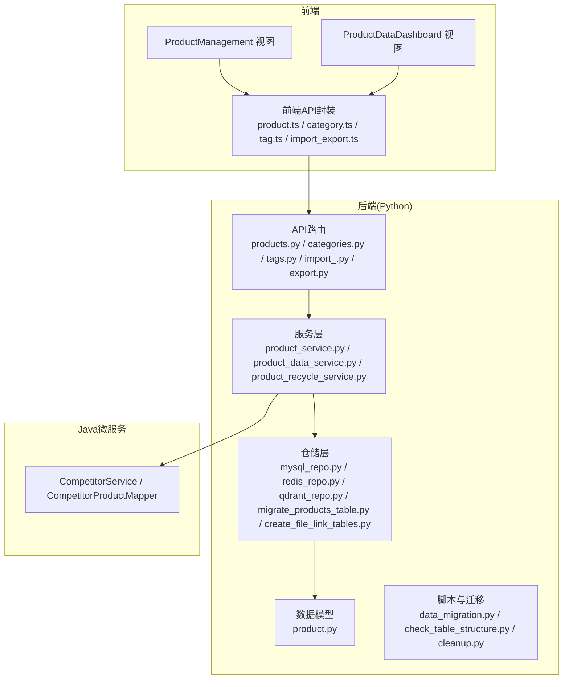
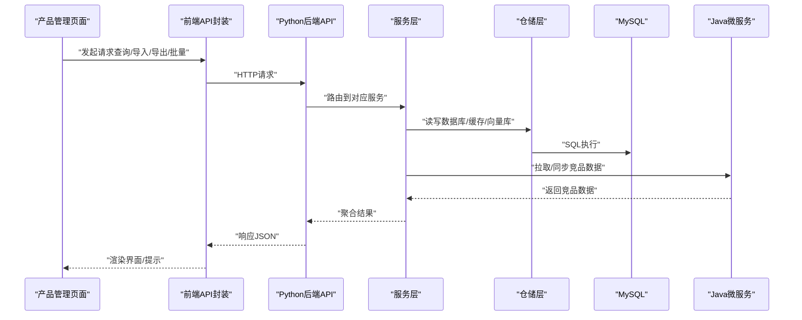
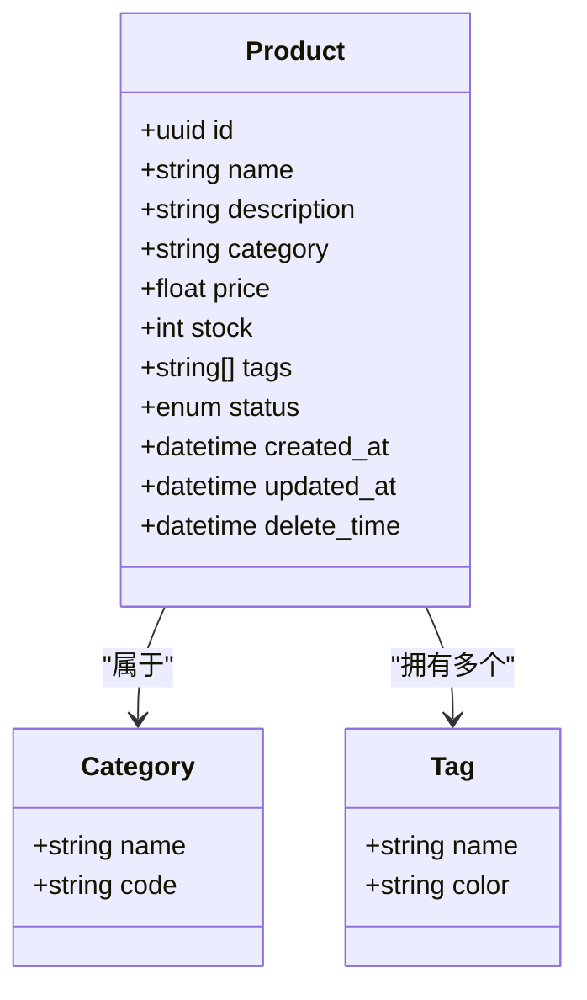
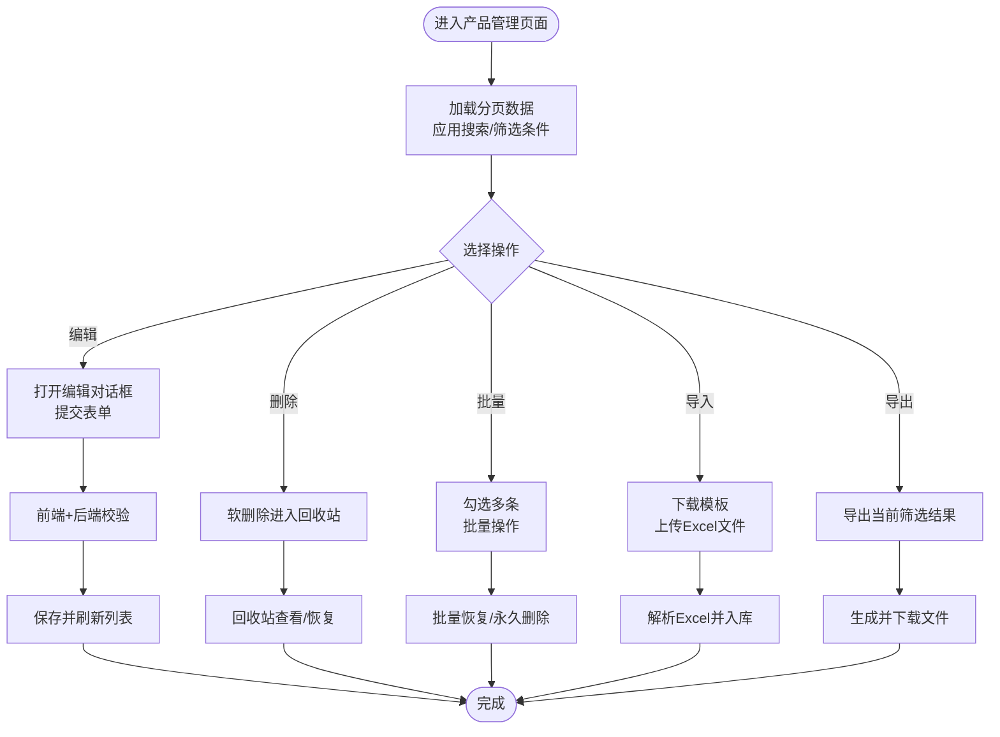
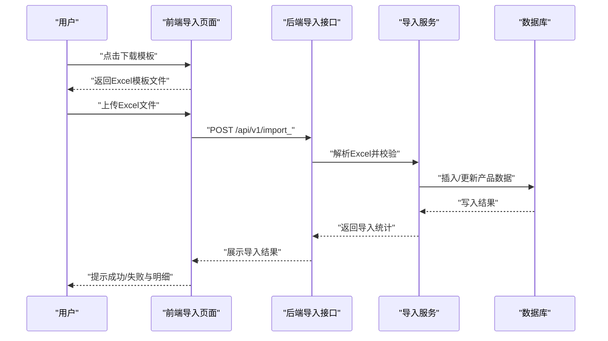
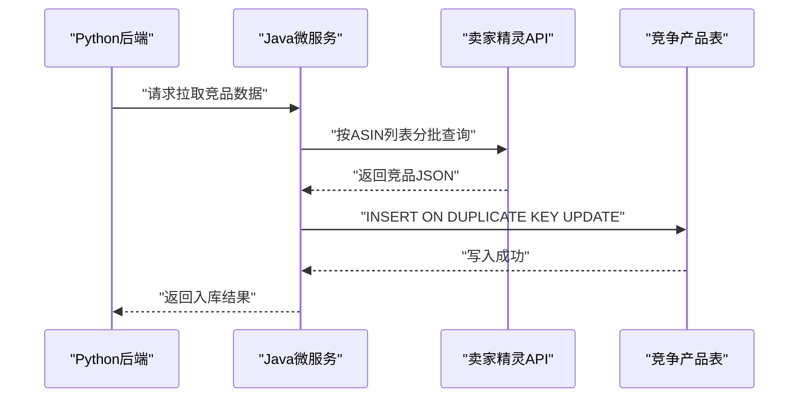
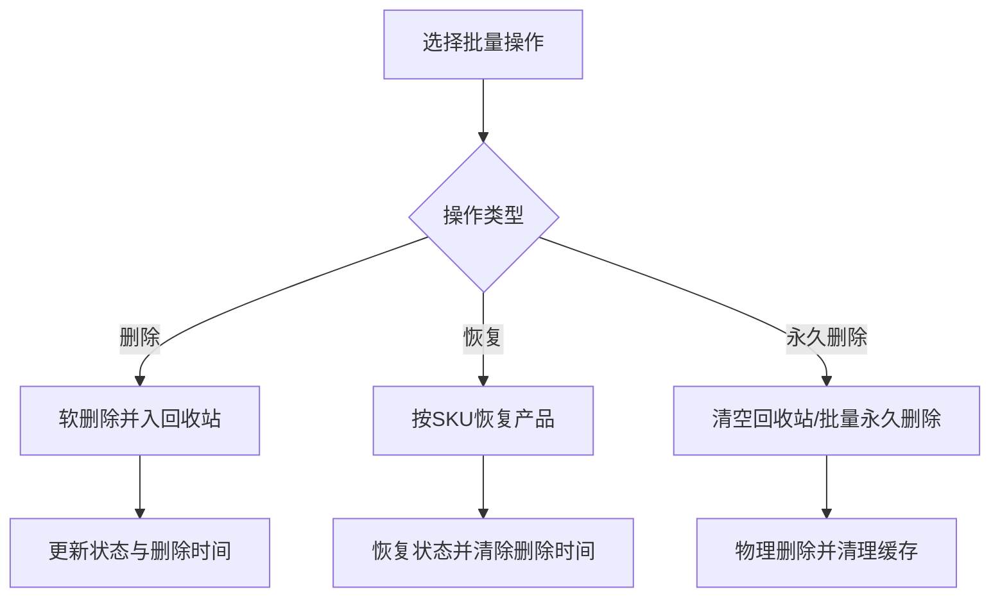
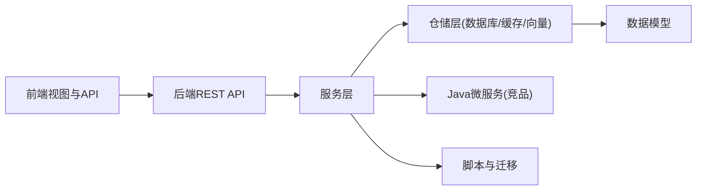

# 产品管理模块

<cite>
**本文引用的文件**
- [backend/app/models/product.py](file://backend/app/models/product.py)
- [backend/app/api/v1/products.py](file://backend/app/api/v1/products.py)
- [backend/app/api/v1/categories.py](file://backend/app/api/v1/categories.py)
- [backend/app/api/v1/tags.py](file://backend/app/api/v1/tags.py)
- [backend/app/api/v1/import_.py](file://backend/app/api/v1/import_.py)
- [backend/app/api/v1/export.py](file://backend/app/api/v1/export.py)
- [backend/app/services/product_service.py](file://backend/app/services/product_service.py)
- [backend/app/services/product_data_service.py](file://backend/app/services/product_data_service.py)
- [backend/app/services/product_recycle_service.py](file://backend/app/services/product_recycle_service.py)
- [backend/app/repositories/migrate_products_table.py](file://backend/app/repositories/migrate_products_table.py)
- [backend/app/repositories/create_file_link_tables.py](file://backend/app/repositories/create_file_link_tables.py)
- [backend/app/repositories/qdrant_repo.py](file://backend/app/repositories/qdrant_repo.py)
- [backend/app/repositories/redis_repo.py](file://backend/app/repositories/redis_repo.py)
- [backend/app/repositories/mysql_repo.py](file://backend/app/repositories/mysql_repo.py)
- [backend/app/schemas/product_data.py](file://backend/app/schemas/product_data.py)
- [backend/app/utils/performance_monitor.py](file://backend/app/utils/performance_monitor.py)
- [backend/scripts/data_migration.py](file://backend/scripts/data_migration.py)
- [backend/scripts/check_table_structure.py](file://backend/scripts/check_table_structure.py)
- [backend/scripts/cleanup.py](file://backend/scripts/cleanup.py)
- [backend/migrations/system_log_tables.sql](file://backend/migrations/system_log_tables.sql)
- [frontend/src/views/ProductManagement/index.vue](file://frontend/src/views/ProductManagement/index.vue)
- [frontend/src/views/ProductDataDashboard/index.vue](file://frontend/src/views/ProductDataDashboard/index.vue)
- [frontend/src/api/product.ts](file://frontend/src/api/product.ts)
- [frontend/src/api/category.ts](file://frontend/src/api/category.ts)
- [frontend/src/api/tag.ts](file://frontend/src/api/tag.ts)
- [frontend/src/api/import_export.ts](file://frontend/src/api/import_export.ts)
- [frontend/openapi.json](file://frontend/openapi.json)
- [docs/项目逻辑/选品/竞品数据.md](file://docs/项目逻辑/选品/竞品数据.md)
- [docs/项目逻辑/系统设置/备份功能.md](file://docs/项目逻辑/系统设置/备份功能.md)
- [java-backend/sjzm-product/src/main/java/com/sjzm/product/service/CompetitorService.java](file://java-backend/sjzm-product/src/main/java/com/sjzm/product/service/CompetitorService.java)
- [java-backend/sjzm-product/src/main/java/com/sjzm/product/mapper/CompetitorProductMapper.java](file://java-backend/sjzm-product/src/main/java/com/sjzm/product/mapper/CompetitorProductMapper.java)
- [java-backend/sql/add_scoring_to_competitor_products.sql](file://java-backend/sql/add_scoring_to_competitor_products.sql)
</cite>

## 目录
1. [简介](#简介)
2. [项目结构](#项目结构)
3. [核心组件](#核心组件)
4. [架构总览](#架构总览)
5. [详细组件分析](#详细组件分析)
6. [依赖关系分析](#依赖关系分析)
7. [性能考虑](#性能考虑)
8. [故障排查指南](#故障排查指南)
9. [结论](#结论)
10. [附录](#附录)

## 简介
本文件面向产品经理与运营人员，系统性梳理产品管理模块的功能范围、数据模型、业务规则、验证逻辑、界面操作流程、搜索过滤配置、数据导入导出、产品与竞品数据关系、数据同步与冲突处理、批量操作、版本与备份恢复等。文档以仓库现有代码与文档为依据，提供可执行的操作步骤与最佳实践建议。

## 项目结构
产品管理模块由“前端视图与API调用”、“后端REST接口与服务层”、“数据模型与仓储层”、“脚本与迁移工具”四部分组成，并通过Java微服务对接外部竞品数据源。

**图表来源**
- [frontend/src/views/ProductManagement/index.vue](file://frontend/src/views/ProductManagement/index.vue)
- [frontend/src/views/ProductDataDashboard/index.vue](file://frontend/src/views/ProductDataDashboard/index.vue)
- [frontend/src/api/product.ts](file://frontend/src/api/product.ts)
- [backend/app/api/v1/products.py](file://backend/app/api/v1/products.py)
- [backend/app/services/product_service.py](file://backend/app/services/product_service.py)
- [backend/app/repositories/mysql_repo.py](file://backend/app/repositories/mysql_repo.py)
- [backend/app/models/product.py](file://backend/app/models/product.py)
- [java-backend/sjzm-product/src/main/java/com/sjzm/product/service/CompetitorService.java](file://java-backend/sjzm-product/src/main/java/com/sjzm/product/service/CompetitorService.java)

**章节来源**
- [frontend/src/views/ProductManagement/index.vue](file://frontend/src/views/ProductManagement/index.vue)
- [frontend/src/views/ProductDataDashboard/index.vue](file://frontend/src/views/ProductDataDashboard/index.vue)
- [backend/app/api/v1/products.py](file://backend/app/api/v1/products.py)

## 核心组件
- 产品数据模型与仓储：定义产品实体、索引与迁移脚本，支撑增删改查、搜索过滤、导入导出。
- 产品服务层：封装业务规则、软删除与回收站、批量操作、性能监控。
- 前端界面：产品管理与产品数据看板，提供搜索、筛选、分页、批量勾选与操作。
- 竞品数据对接：Java微服务负责从外部API拉取竞品数据并入库，支持评分与等级字段。
- 数据导入导出：提供Excel模板下载、批量导入、数据导出能力。
- 备份与恢复：支持本地与云端备份、恢复与清理。

**章节来源**
- [backend/app/models/product.py](file://backend/app/models/product.py)
- [backend/app/services/product_service.py](file://backend/app/services/product_service.py)
- [backend/app/api/v1/import_.py](file://backend/app/api/v1/import_.py)
- [backend/app/api/v1/export.py](file://backend/app/api/v1/export.py)
- [docs/项目逻辑/系统设置/备份功能.md](file://docs/项目逻辑/系统设置/备份功能.md)

## 架构总览
产品管理模块采用前后端分离架构，前端通过OpenAPI生成的接口封装调用后端Python REST API；后端提供产品、分类、标签、导入导出等接口；服务层协调仓储层与第三方系统（如Java微服务）完成数据同步与处理；脚本与迁移工具保障数据库结构演进与数据一致性。

**图表来源**
- [frontend/src/api/product.ts](file://frontend/src/api/product.ts)
- [backend/app/api/v1/products.py](file://backend/app/api/v1/products.py)
- [backend/app/services/product_service.py](file://backend/app/services/product_service.py)
- [backend/app/repositories/mysql_repo.py](file://backend/app/repositories/mysql_repo.py)
- [java-backend/sjzm-product/src/main/java/com/sjzm/product/service/CompetitorService.java](file://java-backend/sjzm-product/src/main/java/com/sjzm/product/service/CompetitorService.java)

## 详细组件分析

### 产品数据模型与业务规则
- 数据模型：产品实体包含基础属性（名称、描述、分类、标签、价格、库存等），以及状态、创建/更新时间、软删除标记等。
- 业务规则：
  - 软删除：删除时仅更新状态与删除时间，保留回收站以便恢复。
  - 分类与标签：支持多对多关联，提供查询与批量更新。
  - 性能：仓储层提供索引与查询优化，服务层进行批量操作与缓存清理。
- 验证逻辑：前端OpenAPI定义了查询参数与字段约束（如分类长度、价格非负、标签数组等），后端服务层进一步校验与转换。

**图表来源**
- [backend/app/models/product.py](file://backend/app/models/product.py)
- [frontend/openapi.json](file://frontend/openapi.json)

**章节来源**
- [backend/app/models/product.py](file://backend/app/models/product.py)
- [frontend/openapi.json](file://frontend/openapi.json)

### 产品管理界面与操作流程
- 产品管理页面：支持分页、搜索、筛选、批量勾选、批量删除/恢复、查看详情等。
- 产品数据看板：展示产品明细、统计与趋势，支持导出。
- 操作流程要点：
  - 列表加载：分页参数与查询条件（名称、分类、标签、状态）组合查询。
  - 编辑/新增：表单校验（OpenAPI约束）+后端服务校验。
  - 删除：软删除进入回收站；支持批量恢复与永久删除。
  - 导入/导出：下载模板、上传Excel、后台解析入库；导出当前筛选结果。

**图表来源**
- [frontend/src/views/ProductManagement/index.vue](file://frontend/src/views/ProductManagement/index.vue)
- [frontend/src/views/ProductDataDashboard/index.vue](file://frontend/src/views/ProductDataDashboard/index.vue)
- [frontend/src/api/import_export.ts](file://frontend/src/api/import_export.ts)

**章节来源**
- [frontend/src/views/ProductManagement/index.vue](file://frontend/src/views/ProductManagement/index.vue)
- [frontend/src/views/ProductDataDashboard/index.vue](file://frontend/src/views/ProductDataDashboard/index.vue)
- [frontend/src/api/import_export.ts](file://frontend/src/api/import_export.ts)

### 产品分类管理
- 分类接口：提供分类列表、详情、创建、更新、删除与统计。
- 使用场景：产品录入时选择分类，支持按分类筛选与统计分析。
- 前端调用：通过category.ts封装的API进行CRUD与查询。

**章节来源**
- [backend/app/api/v1/categories.py](file://backend/app/api/v1/categories.py)
- [frontend/src/api/category.ts](file://frontend/src/api/category.ts)

### 产品标签系统
- 标签接口：提供标签列表、详情、创建、更新、删除、绑定产品、批量更新。
- 使用场景：为产品打标签便于分组与筛选；支持按标签查询产品。
- 前端调用：通过tag.ts封装的API进行CRUD与查询。

**章节来源**
- [backend/app/api/v1/tags.py](file://backend/app/api/v1/tags.py)
- [frontend/src/api/tag.ts](file://frontend/src/api/tag.ts)

### 数据导入导出
- 导入：
  - 模板下载：提供标准Excel模板，字段与后端校验一致。
  - 文件上传：支持multipart/form-data，后端解析并入库。
  - 冲突处理：根据SKU/唯一键进行跳过/覆盖策略（由后端服务决定）。
- 导出：
  - 支持按当前筛选条件导出，生成Excel文件供下载。

**图表来源**
- [backend/app/api/v1/import_.py](file://backend/app/api/v1/import_.py)
- [backend/app/api/v1/export.py](file://backend/app/api/v1/export.py)
- [frontend/src/api/import_export.ts](file://frontend/src/api/import_export.ts)

**章节来源**
- [backend/app/api/v1/import_.py](file://backend/app/api/v1/import_.py)
- [backend/app/api/v1/export.py](file://backend/app/api/v1/export.py)
- [frontend/src/api/import_export.ts](file://frontend/src/api/import_export.ts)

### 产品与竞品数据关系、同步与冲突处理
- 竞品数据来源：Java微服务通过卖家精灵API拉取竞品数据，入库到竞争产品表，包含市场区、ASIN、月份等维度。
- 同步机制：
  - 按月聚合：以(市场区+ASIN+月份)唯一键入库，支持重复时更新。
  - 批量写入：分批处理，避免超大事务。
- 冲突处理：
  - 唯一键冲突：ON DUPLICATE KEY UPDATE，避免重复记录。
  - 历史趋势：按父ASIN去重，取BSR最低的变体作为代表。
- 评分与等级：新增评分字段与等级阈值，用于竞品质量评估。

**图表来源**
- [java-backend/sjzm-product/src/main/java/com/sjzm/product/service/CompetitorService.java](file://java-backend/sjzm-product/src/main/java/com/sjzm/product/service/CompetitorService.java)
- [java-backend/sjzm-product/src/main/java/com/sjzm/product/mapper/CompetitorProductMapper.java](file://java-backend/sjzm-product/src/main/java/com/sjzm/product/mapper/CompetitorProductMapper.java)
- [docs/项目逻辑/选品/竞品数据.md](file://docs/项目逻辑/选品/竞品数据.md)

**章节来源**
- [java-backend/sjzm-product/src/main/java/com/sjzm/product/service/CompetitorService.java](file://java-backend/sjzm-product/src/main/java/com/sjzm/product/service/CompetitorService.java)
- [java-backend/sjzm-product/src/main/java/com/sjzm/product/mapper/CompetitorProductMapper.java](file://java-backend/sjzm-product/src/main/java/com/sjzm/product/mapper/CompetitorProductMapper.java)
- [docs/项目逻辑/选品/竞品数据.md](file://docs/项目逻辑/选品/竞品数据.md)

### 批量操作与回收站
- 批量操作：支持批量删除、批量恢复、批量永久删除。
- 回收站：
  - 软删除后进入回收站，保留30天，到期自动清理。
  - 支持按SKU恢复与清空回收站。
- 服务层实现：检查存在性、更新状态、清理缓存、记录日志。

**图表来源**
- [backend/app/services/product_recycle_service.py](file://backend/app/services/product_recycle_service.py)
- [backend/app/services/product_service.py](file://backend/app/services/product_service.py)

**章节来源**
- [backend/app/services/product_recycle_service.py](file://backend/app/services/product_recycle_service.py)
- [backend/app/services/product_service.py](file://backend/app/services/product_service.py)

### 版本控制与数据备份恢复
- 备份功能：支持本地与云端备份，提供备份列表、创建、下载、删除。
- 恢复流程：选择备份文件，执行恢复脚本，确保数据库一致性。
- 脚本工具：提供数据迁移、表结构检查、清理任务等辅助工具。

**章节来源**
- [docs/项目逻辑/系统设置/备份功能.md](file://docs/项目逻辑/系统设置/备份功能.md)
- [backend/scripts/data_migration.py](file://backend/scripts/data_migration.py)
- [backend/scripts/check_table_structure.py](file://backend/scripts/check_table_structure.py)
- [backend/scripts/cleanup.py](file://backend/scripts/cleanup.py)

## 依赖关系分析
- 前端依赖后端OpenAPI定义的接口契约，确保字段与参数一致。
- 后端服务层依赖仓储层（MySQL/Redis/Qdrant）与Java微服务。
- 数据模型与迁移脚本保证数据库结构演进与兼容性。
- 脚本工具贯穿开发、测试、运维阶段，保障数据质量与系统稳定性。

**图表来源**
- [frontend/openapi.json](file://frontend/openapi.json)
- [backend/app/api/v1/products.py](file://backend/app/api/v1/products.py)
- [backend/app/services/product_service.py](file://backend/app/services/product_service.py)
- [backend/app/repositories/mysql_repo.py](file://backend/app/repositories/mysql_repo.py)
- [java-backend/sjzm-product/src/main/java/com/sjzm/product/service/CompetitorService.java](file://java-backend/sjzm-product/src/main/java/com/sjzm/product/service/CompetitorService.java)

**章节来源**
- [frontend/openapi.json](file://frontend/openapi.json)
- [backend/app/api/v1/products.py](file://backend/app/api/v1/products.py)

## 性能考虑
- 查询优化：仓储层提供索引与分页，服务层进行批量操作与缓存清理。
- 导入性能：分批写入、批量忽略重复、减少事务开销。
- 竞品数据：分批查询与入库，避免一次性超大数据集导致阻塞。
- 监控：服务层集成性能监控工具，便于定位瓶颈。

**章节来源**
- [backend/app/utils/performance_monitor.py](file://backend/app/utils/performance_monitor.py)
- [backend/app/services/product_service.py](file://backend/app/services/product_service.py)
- [java-backend/sjzm-product/src/main/java/com/sjzm/product/service/CompetitorService.java](file://java-backend/sjzm-product/src/main/java/com/sjzm/product/service/CompetitorService.java)

## 故障排查指南
- 导入失败：
  - 检查模板字段与Excel格式是否匹配。
  - 查看后端导入接口返回的错误信息与统计。
- 删除/恢复异常：
  - 确认SKU是否存在且处于回收站状态。
  - 检查服务层日志与数据库状态更新。
- 竞品数据不同步：
  - 核查Java微服务调用日志与数据库写入情况。
  - 检查唯一键冲突与分批入库逻辑。
- 备份/恢复问题：
  - 确认备份文件完整性与权限。
  - 使用脚本工具检查数据库结构与数据一致性。

**章节来源**
- [backend/app/services/product_recycle_service.py](file://backend/app/services/product_recycle_service.py)
- [backend/app/api/v1/import_.py](file://backend/app/api/v1/import_.py)
- [java-backend/sjzm-product/src/main/java/com/sjzm/product/service/CompetitorService.java](file://java-backend/sjzm-product/src/main/java/com/sjzm/product/service/CompetitorService.java)
- [docs/项目逻辑/系统设置/备份功能.md](file://docs/项目逻辑/系统设置/备份功能.md)

## 结论
产品管理模块以清晰的分层架构实现了产品数据的全生命周期管理，涵盖CRUD、分类标签、导入导出、回收站、竞品数据对接与备份恢复。通过OpenAPI契约与服务层封装，前端能够稳定地调用后端能力；Java微服务补充了竞品数据的采集与评分能力。建议在日常运营中遵循批量操作规范、定期检查备份与清理任务，并基于搜索/筛选能力持续优化产品数据质量。

## 附录
- 关键接口与路径（节选）：
  - 产品：GET/POST/PUT/DELETE /api/v1/products
  - 分类：GET/POST/PUT/DELETE /api/v1/categories
  - 标签：GET/POST/PUT/DELETE /api/v1/tags
  - 导入：POST /api/v1/import_
  - 导出：GET /api/v1/export
- 数据模型字段与约束：参见OpenAPI Schema与产品模型定义。
- 竞品数据表结构与评分字段：参见Java侧SQL与Mapper定义。