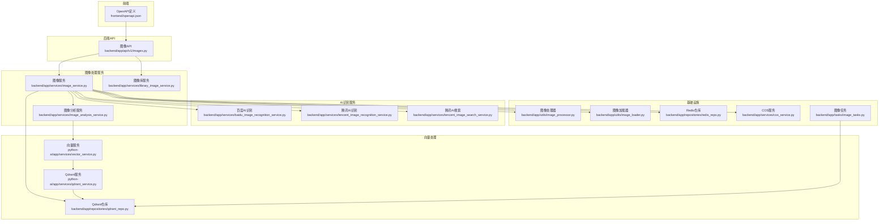
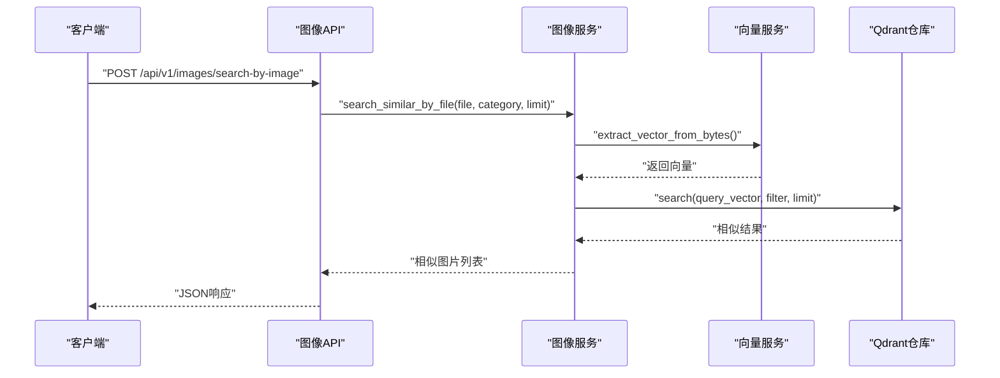
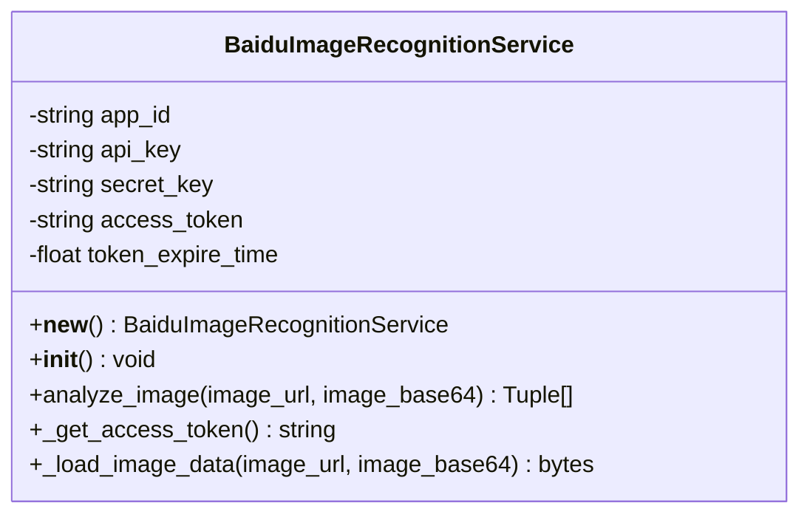
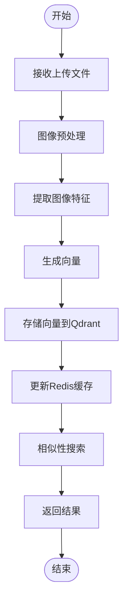
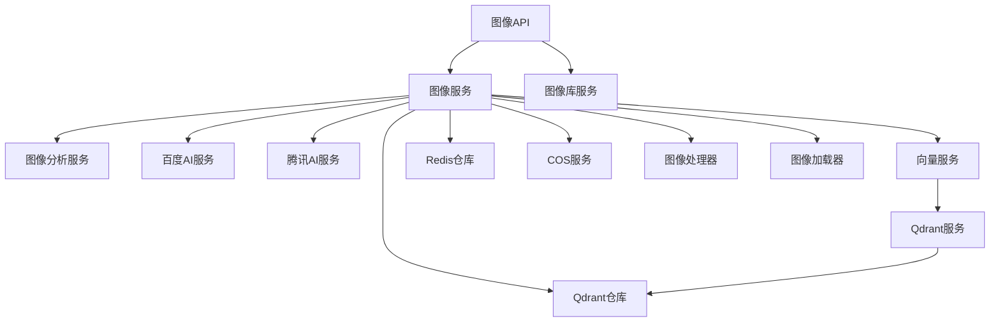

# 图像处理模块

<cite>
**本文引用的文件**
- [baidu_image_recognition_service.py](file://backend/app/services/baidu_image_recognition_service.py)
- [tencent_image_recognition_service.py](file://backend/app/services/tencent_image_recognition_service.py)
- [tencent_image_search_service.py](file://backend/app/services/tencent_image_search_service.py)
- [image_analysis_service.py](file://backend/app/services/image_analysis_service.py)
- [image_service.py](file://backend/app/services/image_service.py)
- [library_image_service.py](file://backend/app/services/library_image_service.py)
- [qdrant_repo.py](file://backend/app/repositories/qdrant_repo.py)
- [vector_service.py](file://python-ai/app/services/vector_service.py)
- [qdrant_service.py](file://python-ai/app/services/qdrant_service.py)
- [images.py](file://backend/app/api/v1/images.py)
- [image_tasks.py](file://backend/app/tasks/image_tasks.py)
- [image_processor.py](file://backend/app/utils/image_processor.py)
- [image_loader.py](file://backend/app/utils/image_loader.py)
- [cos_service.py](file://backend/app/services/cos_service.py)
- [redis_repo.py](file://backend/app/repositories/redis_repo.py)
- [check_model_cache.py](file://backend/app/services/ai_vector_processing/check_model_cache.py)
- [download_model.py](file://backend/app/services/ai_vector_processing/download_model.py)
- [ai_vector_processor.py](file://backend/app/services/ai_vector_processing/ai_vector_processor.py)
- [openapi.json](file://frontend/openapi.json)
</cite>

## 目录
1. [简介](#简介)
2. [项目结构](#项目结构)
3. [核心组件](#核心组件)
4. [架构概览](#架构概览)
5. [详细组件分析](#详细组件分析)
6. [依赖关系分析](#依赖关系分析)
7. [性能考虑](#性能考虑)
8. [故障排除指南](#故障排除指南)
9. [结论](#结论)
10. [附录](#附录)

## 简介
本文件为图像处理模块的完整技术文档，涵盖图像识别服务、相似性分析、图像质量评估、图像库管理等核心功能。文档详细说明与百度AI和腾讯AI服务的集成方式、API调用参数与响应处理；阐述图像上传、预处理、特征提取、相似性匹配与结果展示的完整流程；解释图像识别算法原理、准确率评估与误判处理机制；提供图像质量检测、色彩分析与视觉效果评估功能；包含图像库的分类管理、标签标注与检索功能；详细说明图像缓存策略、压缩优化与CDN加速配置；解释与向量数据库的集成方式、相似图像检索与聚类分析；为图像分析师和技术人员提供完整的图像处理与分析工具。

## 项目结构
图像处理模块由后端Python服务、前端OpenAPI定义、向量处理服务与任务调度组成，采用分层架构：
- API层：提供REST接口，支持图像上传、相似性搜索、批量操作等
- 服务层：封装业务逻辑，包括图像识别、相似性分析、库管理等
- 工具层：图像预处理、加载、缓存等通用工具
- 存储层：MySQL数据库、Qdrant向量数据库、Redis缓存、COS对象存储
- AI处理层：独立的Python AI服务，负责向量提取与向量数据库交互

**图表来源**
- [images.py:522-559](file://backend/app/api/v1/images.py#L522-L559)
- [image_service.py:214-663](file://backend/app/services/image_service.py#L214-L663)
- [baidu_image_recognition_service.py:48-449](file://backend/app/services/baidu_image_recognition_service.py#L48-L449)
- [tencent_image_recognition_service.py](file://backend/app/services/tencent_image_recognition_service.py)
- [tencent_image_search_service.py](file://backend/app/services/tencent_image_search_service.py)
- [vector_service.py:38-95](file://python-ai/app/services/vector_service.py#L38-L95)
- [qdrant_repo.py:14-52](file://backend/app/repositories/qdrant_repo.py#L14-L52)
- [qdrant_service.py:1-3](file://python-ai/app/services/qdrant_service.py#L1-L3)
- [image_processor.py](file://backend/app/utils/image_processor.py)
- [image_loader.py](file://backend/app/utils/image_loader.py)
- [cos_service.py](file://backend/app/services/cos_service.py)
- [redis_repo.py](file://backend/app/repositories/redis_repo.py)
- [image_tasks.py:268-303](file://backend/app/tasks/image_tasks.py#L268-L303)

**章节来源**
- [images.py:522-559](file://backend/app/api/v1/images.py#L522-L559)
- [image_service.py:214-663](file://backend/app/services/image_service.py#L214-L663)

## 核心组件
本模块的核心组件包括：
- 图像识别服务：集成百度AI与腾讯AI，支持多场景识别与货币识别
- 相似性分析：基于向量数据库的图像相似性检索与聚类分析
- 图像质量评估：图像尺寸、格式、质量与元数据检测
- 图像库管理：分类、标签、SKU生成与批量操作
- 缓存与存储：Redis缓存、COS对象存储与本地文件系统
- 向量处理：CLIP模型向量提取与Qdrant向量检索

**章节来源**
- [baidu_image_recognition_service.py:48-449](file://backend/app/services/baidu_image_recognition_service.py#L48-L449)
- [image_service.py:214-663](file://backend/app/services/image_service.py#L214-L663)
- [qdrant_repo.py:14-52](file://backend/app/repositories/qdrant_repo.py#L14-L52)
- [vector_service.py:38-95](file://python-ai/app/services/vector_service.py#L38-L95)

## 架构概览
图像处理模块采用分层架构，前端通过OpenAPI定义与后端交互，后端API调用相应的服务层实现具体功能。AI识别服务与向量处理服务相对独立，通过统一的服务接口进行集成。

**图表来源**
- [images.py:551-559](file://backend/app/api/v1/images.py#L551-L559)
- [image_service.py:584-649](file://backend/app/services/image_service.py#L584-L649)
- [vector_service.py:46-95](file://python-ai/app/services/vector_service.py#L46-L95)
- [qdrant_repo.py:14-52](file://backend/app/repositories/qdrant_repo.py#L14-L52)

## 详细组件分析

### 百度AI图像识别服务
百度AI图像识别服务提供动物识别、菜品识别、地标识别、货币识别等能力，采用单例模式管理访问令牌，支持URL与Base64两种输入方式。

**图表来源**
- [baidu_image_recognition_service.py:48-449](file://backend/app/services/baidu_image_recognition_service.py#L48-L449)

**章节来源**
- [baidu_image_recognition_service.py:48-449](file://backend/app/services/baidu_image_recognition_service.py#L48-L449)

### 腾讯AI图像识别与搜索服务
腾讯AI提供图像识别与相似性搜索能力，支持多种识别场景与高级搜索功能。

**章节来源**
- [tencent_image_recognition_service.py](file://backend/app/services/tencent_image_recognition_service.py)
- [tencent_image_search_service.py](file://backend/app/services/tencent_image_search_service.py)

### 图像分析服务
图像分析服务负责图像质量评估、色彩分析与视觉效果评估，提供详细的图像元数据与统计信息。

**章节来源**
- [image_analysis_service.py](file://backend/app/services/image_analysis_service.py)

### 图像服务
图像服务是核心业务层，负责图像上传、预处理、向量提取、相似性搜索与缓存管理。

**图表来源**
- [image_service.py:214-663](file://backend/app/services/image_service.py#L214-L663)

**章节来源**
- [image_service.py:214-663](file://backend/app/services/image_service.py#L214-L663)

### 图像库服务
图像库服务提供材料库与载体库的统一管理，支持SKU自动生成、分类管理与批量操作。

**章节来源**
- [library_image_service.py:416-462](file://backend/app/services/library_image_service.py#L416-L462)

### 向量数据库集成
Qdrant向量数据库提供高效的相似性搜索能力，支持向量插入、更新、删除与混合查询。

**章节来源**
- [qdrant_repo.py:14-52](file://backend/app/repositories/qdrant_repo.py#L14-L52)
- [qdrant_service.py:1-3](file://python-ai/app/services/qdrant_service.py#L1-L3)

### 向量处理服务
向量处理服务基于CLIP模型提取图像特征向量，提供向量归一化与模拟向量生成机制。

**章节来源**
- [vector_service.py:38-95](file://python-ai/app/services/vector_service.py#L38-L95)

### API接口定义
图像API提供完整的图像管理接口，包括相似性搜索、批量上传与分类管理。

**章节来源**
- [images.py:522-559](file://backend/app/api/v1/images.py#L522-L559)
- [openapi.json:514-14030](file://frontend/openapi.json#L514-L14030)

### 图像任务处理
图像任务负责向量索引的重建与维护，确保向量数据库的完整性与性能。

**章节来源**
- [image_tasks.py:268-303](file://backend/app/tasks/image_tasks.py#L268-L303)

## 依赖关系分析

**图表来源**
- [images.py:522-559](file://backend/app/api/v1/images.py#L522-L559)
- [image_service.py:214-663](file://backend/app/services/image_service.py#L214-L663)
- [vector_service.py:38-95](file://python-ai/app/services/vector_service.py#L38-L95)
- [qdrant_repo.py:14-52](file://backend/app/repositories/qdrant_repo.py#L14-L52)

**章节来源**
- [images.py:522-559](file://backend/app/api/v1/images.py#L522-L559)
- [image_service.py:214-663](file://backend/app/services/image_service.py#L214-L663)

## 性能考虑
- 向量检索优化：Qdrant支持多种距离度量方式，建议根据数据分布选择合适的距离计算方法
- 缓存策略：Redis缓存热点数据，减少重复计算与数据库查询
- 并发处理：Celery异步任务处理大规模向量索引重建
- 存储优化：COS对象存储提供高可靠性的图片存储与CDN加速
- 模型缓存：AI模型本地缓存减少加载开销

## 故障排除指南
- 百度AI访问令牌失效：服务自动检测令牌过期并重新获取
- 向量数据库连接异常：检查Qdrant服务状态与网络连通性
- 图像上传失败：验证文件格式、大小限制与存储权限
- 相似性搜索无结果：确认向量索引已建立且数据完整
- 缓存失效：检查Redis连接状态与键空间清理策略

**章节来源**
- [baidu_image_recognition_service.py:77-83](file://backend/app/services/baidu_image_recognition_service.py#L77-L83)
- [image_service.py:580-582](file://backend/app/services/image_service.py#L580-L582)

## 结论
图像处理模块通过集成多家AI服务与向量数据库，提供了完整的图像识别、相似性分析与管理功能。模块采用分层架构设计，具备良好的扩展性与可维护性。通过合理的缓存策略与存储优化，能够满足大规模图像处理的需求。建议在生产环境中重点关注向量数据库的性能调优与AI服务的稳定性保障。

## 附录

### API接口规范
- 相似图片搜索：GET /api/v1/images/{image_id}/similar
- 以图搜图：POST /api/v1/images/search-by-image
- 批量上传图片：POST /api/v1/images/batch_upload

**章节来源**
- [images.py:522-559](file://backend/app/api/v1/images.py#L522-L559)
- [openapi.json:514-14030](file://frontend/openapi.json#L514-L14030)

### 配置参数
- SIMILAR_LIMIT_MAX：相似图片搜索最大返回数量
- SIMILAR_LIMIT_DEFAULT：相似图片搜索默认返回数量
- QDRANT_VECTOR_SIZE：向量维度大小
- BAIDU_AI_CONFIG：百度AI服务配置

**章节来源**
- [images.py:522-559](file://backend/app/api/v1/images.py#L522-L559)
- [baidu_image_recognition_service.py:68-75](file://backend/app/services/baidu_image_recognition_service.py#L68-L75)