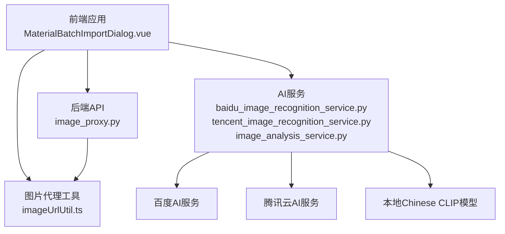
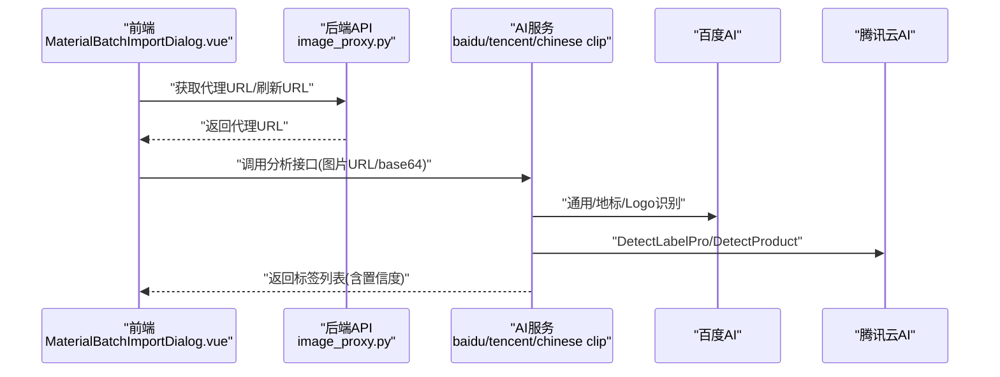
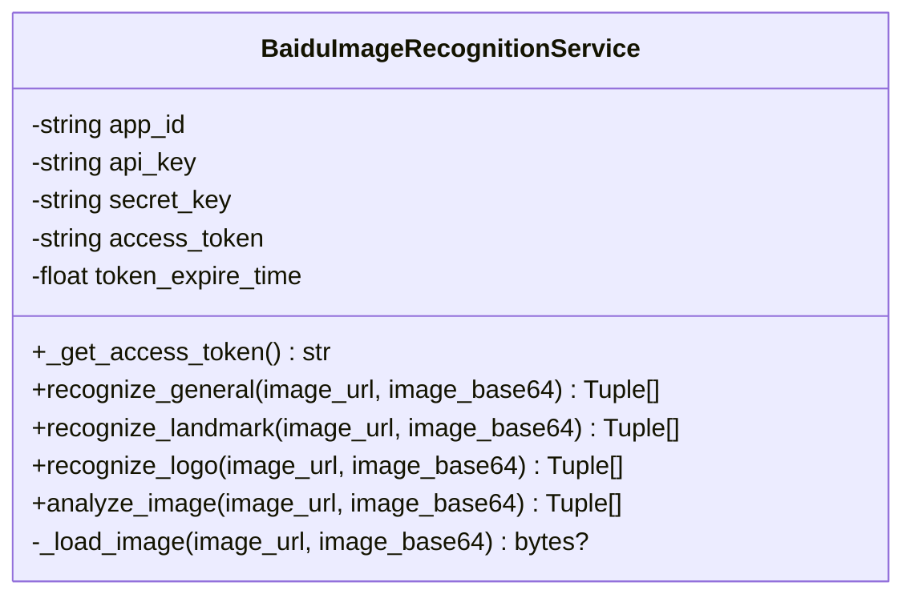
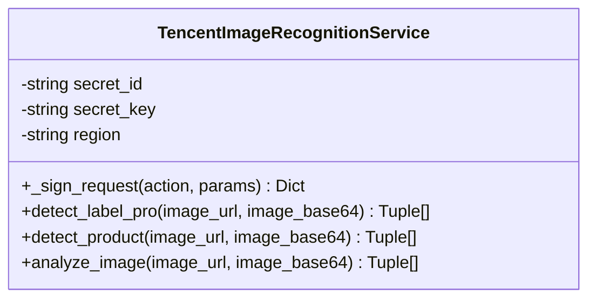
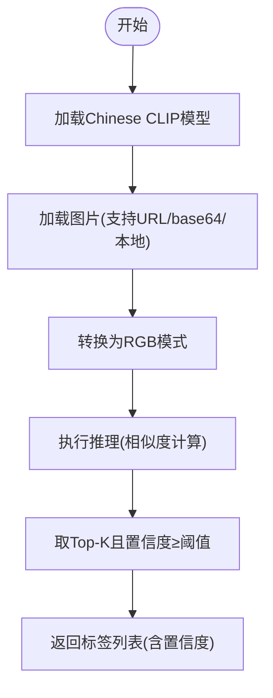
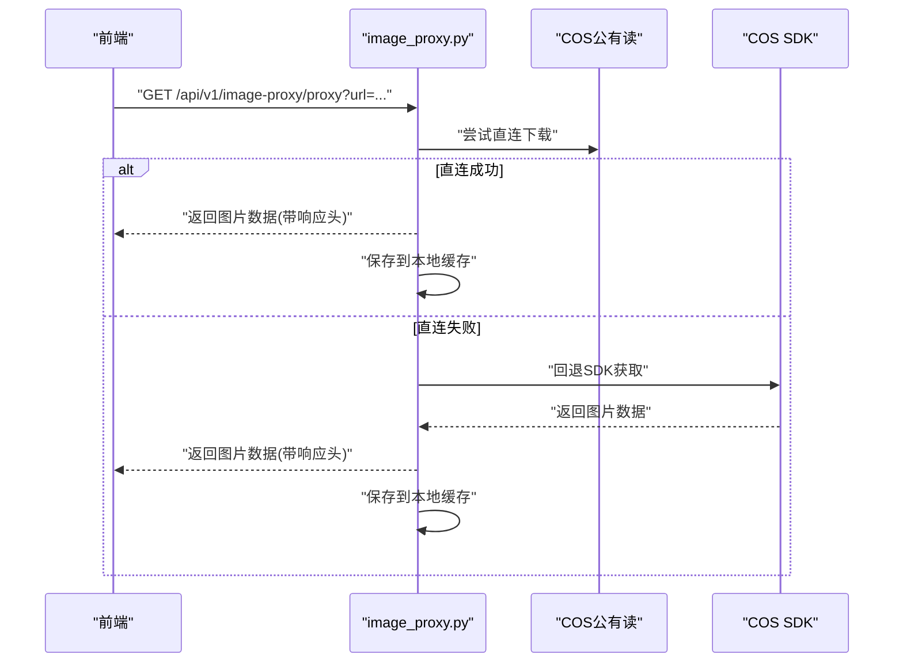
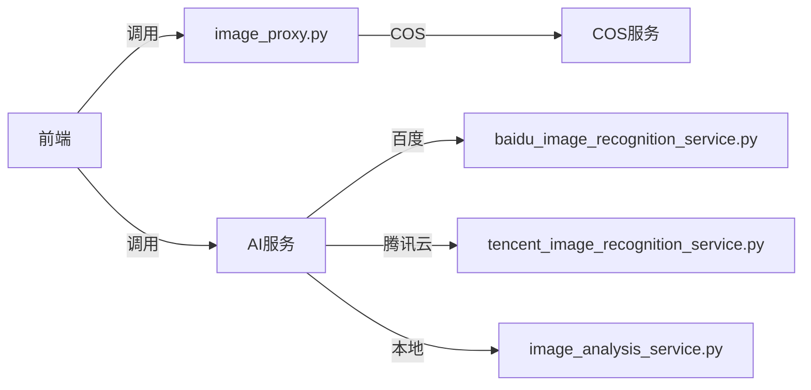

# 图像识别服务

<cite>
**本文引用的文件**
- [baidu_image_recognition_service.py](file://backend/app/services/baidu_image_recognition_service.py)
- [tencent_image_recognition_service.py](file://backend/app/services/tencent_image_recognition_service.py)
- [image_analysis_service.py](file://backend/app/services/image_analysis_service.py)
- [image_proxy.py](file://backend/app/api/v1/image_proxy.py)
- [statistics.py](file://backend/app/api/v1/statistics.py)
- [system_config.py](file://backend/app/api/v1/system_config.py)
- [image_loader.py](file://backend/app/utils/image_loader.py)
- [image_processor.py](file://backend/app/utils/image_processor.py)
- [MaterialBatchImportDialog.vue](file://frontend/src/views/MaterialLibrary/components/MaterialBatchImportDialog.vue)
- [imageUrlUtil.ts](file://frontend/src/utils/imageUrlUtil.ts)
- [openapi.json](file://frontend/openapi.json)
</cite>

## 目录
1. [简介](#简介)
2. [项目结构](#项目结构)
3. [核心组件](#核心组件)
4. [架构总览](#架构总览)
5. [详细组件分析](#详细组件分析)
6. [依赖分析](#依赖分析)
7. [性能考虑](#性能考虑)
8. [故障排除指南](#故障排除指南)
9. [结论](#结论)
10. [附录](#附录)

## 简介
本技术文档面向图像识别服务，系统性阐述图像识别的核心算法与实现原理，涵盖与百度AI和腾讯云AI服务的集成方式；详细说明图像预处理流程、特征提取算法与识别精度评估机制；解释API调用参数配置、响应数据解析与错误处理策略；并提供图像质量检测、色彩分析与视觉效果评估的具体实现建议。最后给出配置选项、性能优化与故障排除指南，并提供完整的集成与使用示例。

## 项目结构
图像识别服务由三层组成：
- 前端：负责图片上传、URL代理与调用后端分析接口
- 后端API：提供统一的图像代理与统计接口
- AI服务：封装百度AI与腾讯云AI的能力，以及本地Chinese CLIP模型分析

图表来源
- [image_proxy.py:134-183](file://backend/app/api/v1/image_proxy.py#L134-L183)
- [baidu_image_recognition_service.py:33-75](file://backend/app/services/baidu_image_recognition_service.py#L33-L75)
- [tencent_image_recognition_service.py:52-82](file://backend/app/services/tencent_image_recognition_service.py#L52-L82)
- [image_analysis_service.py:29-58](file://backend/app/services/image_analysis_service.py#L29-L58)

章节来源
- [image_proxy.py:134-183](file://backend/app/api/v1/image_proxy.py#L134-L183)
- [baidu_image_recognition_service.py:33-75](file://backend/app/services/baidu_image_recognition_service.py#L33-L75)
- [tencent_image_recognition_service.py:52-82](file://backend/app/services/tencent_image_recognition_service.py#L52-L82)
- [image_analysis_service.py:29-58](file://backend/app/services/image_analysis_service.py#L29-L58)

## 核心组件
- 百度AI图像识别服务：封装百度AI开放平台的多类识别能力，支持通用物体、地标、Logo、植物、动物、菜品、货币识别；内置访问令牌管理与图片加载。
- 腾讯云图像识别服务：封装腾讯云TIAAPI，支持DetectLabelPro（通用标签）、DetectProduct（商品识别）；内置签名生成与图片格式适配。
- 本地Chinese CLIP图像分析服务：使用Transformer CLIP模型，动态加载元素词库，返回带置信度的标签列表；支持CPU/GPU加速。
- 图片代理服务：统一处理COS公有读URL直连、SDK回退、本地缓存与响应头设置；提供URL刷新与统计接口。
- 图像质量统计：提供图片分辨率分布统计接口，辅助质量评估。
- 图像设置：提供最大图片大小、卡片尺寸等配置项。

章节来源
- [baidu_image_recognition_service.py:40-52](file://backend/app/services/baidu_image_recognition_service.py#L40-L52)
- [tencent_image_recognition_service.py:59-61](file://backend/app/services/tencent_image_recognition_service.py#L59-L61)
- [image_analysis_service.py:50-58](file://backend/app/services/image_analysis_service.py#L50-L58)
- [image_proxy.py:134-183](file://backend/app/api/v1/image_proxy.py#L134-L183)
- [statistics.py:246-283](file://backend/app/api/v1/statistics.py#L246-L283)
- [system_config.py:244-296](file://backend/app/api/v1/system_config.py#L244-L296)

## 架构总览
图像识别服务采用“前端触发—后端代理—AI服务调用—结果聚合”的链路。前端通过材料库批量导入对话框触发AI分析，后端提供图片代理与刷新能力，AI服务分别对接百度与腾讯云，并可选使用本地Chinese CLIP模型进行二次分析。

图表来源
- [MaterialBatchImportDialog.vue:401-443](file://frontend/src/views/MaterialLibrary/components/MaterialBatchImportDialog.vue#L401-L443)
- [image_proxy.py:134-183](file://backend/app/api/v1/image_proxy.py#L134-L183)
- [baidu_image_recognition_service.py:172-228](file://backend/app/services/baidu_image_recognition_service.py#L172-L228)
- [tencent_image_recognition_service.py:203-301](file://backend/app/services/tencent_image_recognition_service.py#L203-L301)

## 详细组件分析

### 百度AI图像识别服务
- 单例模式与令牌管理：自动获取与刷新access_token，过期前5分钟刷新，避免频繁请求。
- 多类型识别：通用物体、地标、Logo、植物、动物、菜品、货币识别；组合多种识别结果并去重排序。
- 图片加载：支持URL、本地路径与base64；对本地路径自动拼接后端端口。
- 结果解析：将返回的关键词、概率、置信度转换为统一的(标签, 百分比置信度)列表。

图表来源
- [baidu_image_recognition_service.py:33-75](file://backend/app/services/baidu_image_recognition_service.py#L33-L75)
- [baidu_image_recognition_service.py:122-171](file://backend/app/services/baidu_image_recognition_service.py#L122-L171)
- [baidu_image_recognition_service.py:307-354](file://backend/app/services/baidu_image_recognition_service.py#L307-L354)

章节来源
- [baidu_image_recognition_service.py:77-121](file://backend/app/services/baidu_image_recognition_service.py#L77-L121)
- [baidu_image_recognition_service.py:172-228](file://backend/app/services/baidu_image_recognition_service.py#L172-L228)
- [baidu_image_recognition_service.py:307-354](file://backend/app/services/baidu_image_recognition_service.py#L307-L354)
- [baidu_image_recognition_service.py:355-414](file://backend/app/services/baidu_image_recognition_service.py#L355-L414)

### 腾讯云图像识别服务
- 签名生成：实现TC3-HMAC-SHA256签名，构造标准请求头，支持DetectLabelPro与DetectProduct。
- 图片预处理：检测并转换不支持的图片格式为JPEG，保证API兼容性。
- 结果解析：组合分类与标签，返回带置信度的标签列表；商品识别返回固定置信度。

图表来源
- [tencent_image_recognition_service.py:84-165](file://backend/app/services/tencent_image_recognition_service.py#L84-L165)
- [tencent_image_recognition_service.py:203-301](file://backend/app/services/tencent_image_recognition_service.py#L203-L301)
- [tencent_image_recognition_service.py:358-406](file://backend/app/services/tencent_image_recognition_service.py#L358-L406)

章节来源
- [tencent_image_recognition_service.py:84-165](file://backend/app/services/tencent_image_recognition_service.py#L84-L165)
- [tencent_image_recognition_service.py:203-301](file://backend/app/services/tencent_image_recognition_service.py#L203-L301)
- [tencent_image_recognition_service.py:358-406](file://backend/app/services/tencent_image_recognition_service.py#L358-L406)

### 本地Chinese CLIP图像分析服务
- 模型加载：异步加载Chinese CLIP模型，优先使用本地缓存路径，否则从网络下载；自动选择GPU/CPU设备。
- 元素词库：动态加载元素词库文件，支持热更新；推理时计算图片与文本嵌入相似度，返回Top-K且高于阈值的标签。
- 输入支持：支持URL、相对路径（经后端代理）、本地文件路径与base64；统一转换为RGB模式。

图表来源
- [image_analysis_service.py:60-84](file://backend/app/services/image_analysis_service.py#L60-L84)
- [image_analysis_service.py:151-211](file://backend/app/services/image_analysis_service.py#L151-L211)
- [image_analysis_service.py:285-321](file://backend/app/services/image_analysis_service.py#L285-L321)
- [image_analysis_service.py:347-405](file://backend/app/services/image_analysis_service.py#L347-L405)

章节来源
- [image_analysis_service.py:60-84](file://backend/app/services/image_analysis_service.py#L60-L84)
- [image_analysis_service.py:151-211](file://backend/app/services/image_analysis_service.py#L151-L211)
- [image_analysis_service.py:285-321](file://backend/app/services/image_analysis_service.py#L285-L321)
- [image_analysis_service.py:347-405](file://backend/app/services/image_analysis_service.py#L347-L405)

### 图片代理服务
- 公有读直连：优先使用COS公有读URL直连下载，提升性能。
- SDK回退：直连失败时回退至COS SDK获取。
- 本地缓存：成功后保存到本地缓存目录，减少重复下载。
- URL刷新：提供刷新接口，返回新的公有读URL；前端可据此更新缓存。

图表来源
- [image_proxy.py:134-183](file://backend/app/api/v1/image_proxy.py#L134-L183)
- [image_proxy.py:186-273](file://backend/app/api/v1/image_proxy.py#L186-L273)
- [image_proxy.py:276-296](file://backend/app/api/v1/image_proxy.py#L276-L296)

章节来源
- [image_proxy.py:134-183](file://backend/app/api/v1/image_proxy.py#L134-L183)
- [image_proxy.py:186-273](file://backend/app/api/v1/image_proxy.py#L186-L273)
- [image_proxy.py:276-296](file://backend/app/api/v1/image_proxy.py#L276-L296)

### 图像质量统计与设置
- 分辨率分布统计：按区间统计图片分辨率分布，辅助质量评估。
- 图片设置：提供最大图片大小、产品卡片宽高等配置项，便于前端渲染与后端限制。

章节来源
- [statistics.py:246-283](file://backend/app/api/v1/statistics.py#L246-L283)
- [system_config.py:244-296](file://backend/app/api/v1/system_config.py#L244-L296)

## 依赖分析
- AI服务依赖：
  - 百度AI：访问令牌获取、HTTP异步请求、base64编码。
  - 腾讯云AI：签名生成、HTTP异步请求、图片格式检测与转换。
  - 本地Chinese CLIP：Transformers、PIL、torch、设备选择。
- 图片代理依赖：
  - COS服务：公有读URL构建、SDK获取。
  - 本地缓存：文件系统写入与统计。
- 前端依赖：
  - 图片代理URL工具：支持COS对象键与HTTP URL代理、刷新URL。
  - 批量导入对话框：触发AI分析并展示结果。

图表来源
- [image_proxy.py:23-25](file://backend/app/api/v1/image_proxy.py#L23-L25)
- [baidu_image_recognition_service.py:18-21](file://backend/app/services/baidu_image_recognition_service.py#L18-L21)
- [tencent_image_recognition_service.py:17-19](file://backend/app/services/tencent_image_recognition_service.py#L17-L19)
- [image_analysis_service.py:10-15](file://backend/app/services/image_analysis_service.py#L10-L15)

章节来源
- [image_proxy.py:23-25](file://backend/app/api/v1/image_proxy.py#L23-L25)
- [baidu_image_recognition_service.py:18-21](file://backend/app/services/baidu_image_recognition_service.py#L18-L21)
- [tencent_image_recognition_service.py:17-19](file://backend/app/services/tencent_image_recognition_service.py#L17-L19)
- [image_analysis_service.py:10-15](file://backend/app/services/image_analysis_service.py#L10-L15)

## 性能考虑
- 异步I/O：百度与腾讯云均使用aiohttp异步请求，降低阻塞。
- 模型加载优化：Chinese CLIP模型异步加载并在后台线程执行推理，避免阻塞事件循环。
- 设备选择：优先使用GPU（CUDA），否则回退CPU，减少推理延迟。
- 缓存策略：图片代理服务将成功下载的图片保存到本地缓存目录，显著降低重复请求成本。
- 图片格式适配：腾讯云服务在调用前检测并转换不支持的格式为JPEG，避免API失败重试。
- 响应头优化：设置Cache-Control、Content-Length、X-Process-Time等响应头，便于前端缓存与监控。

章节来源
- [baidu_image_recognition_service.py:96-120](file://backend/app/services/baidu_image_recognition_service.py#L96-L120)
- [tencent_image_recognition_service.py:178-201](file://backend/app/services/tencent_image_recognition_service.py#L178-L201)
- [image_analysis_service.py:60-84](file://backend/app/services/image_analysis_service.py#L60-L84)
- [image_proxy.py:110-127](file://backend/app/api/v1/image_proxy.py#L110-L127)

## 故障排除指南
- 百度AI访问令牌失败
  - 现象：获取access_token失败或返回错误码。
  - 排查：检查app_id、api_key、secret_key配置；确认网络可达；查看日志中的错误文本。
  - 处理：重新初始化服务或手动刷新令牌。
- 腾讯云API签名错误
  - 现象：Response.Error返回错误信息。
  - 排查：核对secret_id、secret_key、region配置；检查时间戳与签名生成逻辑。
  - 处理：修正配置后重试。
- 图片代理返回占位图
  - 现象：返回SVG占位图，表示图片不可用。
  - 排查：检查object_key或URL是否正确；确认COS对象存在；验证公有读URL可访问。
  - 处理：使用刷新接口获取新URL或回退SDK获取。
- 本地Chinese CLIP模型加载失败
  - 现象：模型未加载，分析失败。
  - 排查：确认缓存目录存在且可写；检查网络连通性；查看设备可用性。
  - 处理：清理缓存后重试，或切换到CPU设备。
- 图片质量统计异常
  - 现象：统计接口报错。
  - 排查：检查数据库连接与images表结构；确认width字段存在。
  - 处理：修复表结构或调整查询语句。

章节来源
- [baidu_image_recognition_service.py:96-120](file://backend/app/services/baidu_image_recognition_service.py#L96-L120)
- [tencent_image_recognition_service.py:191-201](file://backend/app/services/tencent_image_recognition_service.py#L191-L201)
- [image_proxy.py:182-183](file://backend/app/api/v1/image_proxy.py#L182-L183)
- [image_analysis_service.py:82-84](file://backend/app/services/image_analysis_service.py#L82-L84)
- [statistics.py:281-283](file://backend/app/api/v1/statistics.py#L281-L283)

## 结论
本图像识别服务通过统一的图片代理与多源AI能力（百度、腾讯云、本地Chinese CLIP），实现了高可靠、高性能的图像识别与分析。前端通过材料库批量导入对话框触发分析，后端提供代理与刷新能力，配合质量统计与配置管理，形成完整的图像识别闭环。建议在生产环境中结合缓存策略与设备选择，持续优化识别精度与响应速度。

## 附录

### API调用参数与响应解析
- 百度AI识别
  - 参数：image_url或image_base64二选一；部分识别类型支持额外参数。
  - 响应：返回(标签, 置信度)列表，按置信度降序排列。
- 腾讯云识别
  - 参数：DetectLabelPro支持ImageBase64；DetectProduct支持ImageUrl或ImageBase64。
  - 响应：通用标签含分类与置信度；商品识别返回商品类别。
- 本地Chinese CLIP
  - 参数：image_url或image_base64或本地路径。
  - 响应：返回(标签, 置信度)列表，受top_k与最小置信度阈值限制。

章节来源
- [baidu_image_recognition_service.py:172-228](file://backend/app/services/baidu_image_recognition_service.py#L172-L228)
- [tencent_image_recognition_service.py:203-301](file://backend/app/services/tencent_image_recognition_service.py#L203-L301)
- [image_analysis_service.py:151-211](file://backend/app/services/image_analysis_service.py#L151-L211)

### 图像质量检测与视觉效果评估
- 分辨率统计：通过统计数据表中width字段的分布，评估图片分辨率质量。
- 建议扩展：可增加清晰度、对比度、色彩饱和度等指标，结合前端可视化展示。

章节来源
- [statistics.py:246-283](file://backend/app/api/v1/statistics.py#L246-L283)

### 集成与使用示例
- 前端批量导入触发AI分析
  - 逻辑：根据图片URL是否为blob决定传入image_url或image_base64；调用后端分析接口并展示结果。
- 图片代理与刷新
  - 逻辑：前端通过imageUrlUtil工具获取代理URL；当URL过期时调用刷新接口获取新URL并更新缓存。

章节来源
- [MaterialBatchImportDialog.vue:401-443](file://frontend/src/views/MaterialLibrary/components/MaterialBatchImportDialog.vue#L401-L443)
- [imageUrlUtil.ts:833-917](file://frontend/src/utils/imageUrlUtil.ts#L833-L917)
- [openapi.json:12490-12494](file://frontend/openapi.json#L12490-L12494)