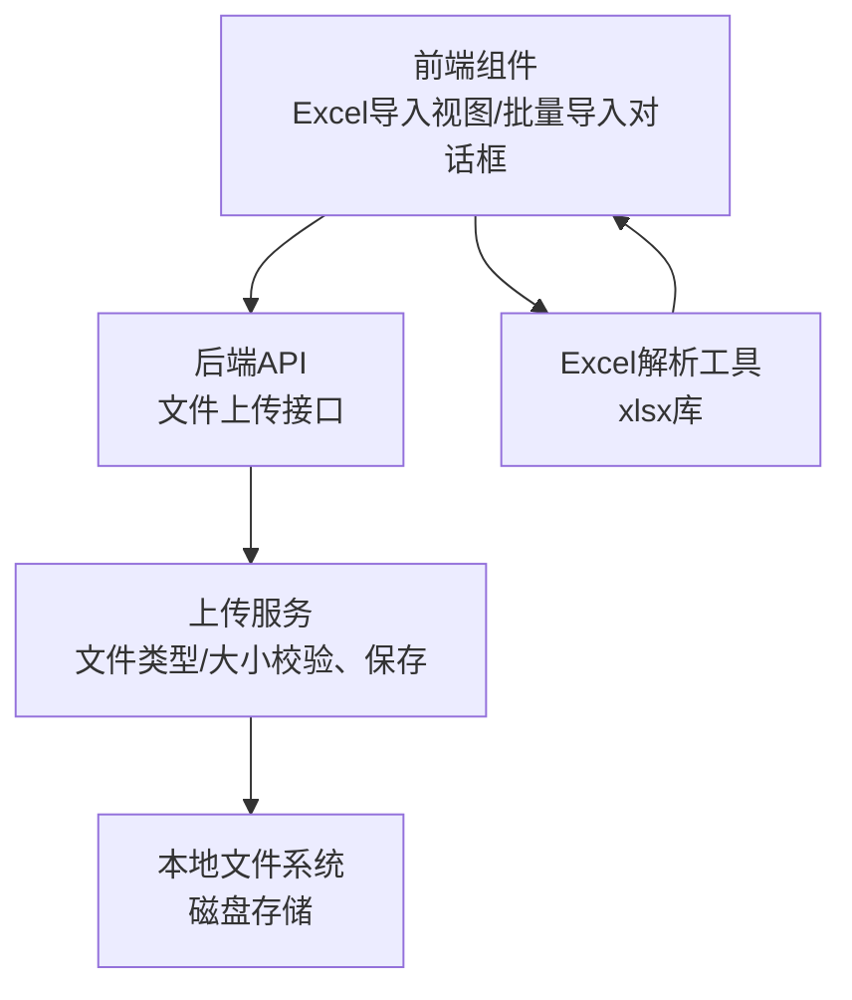
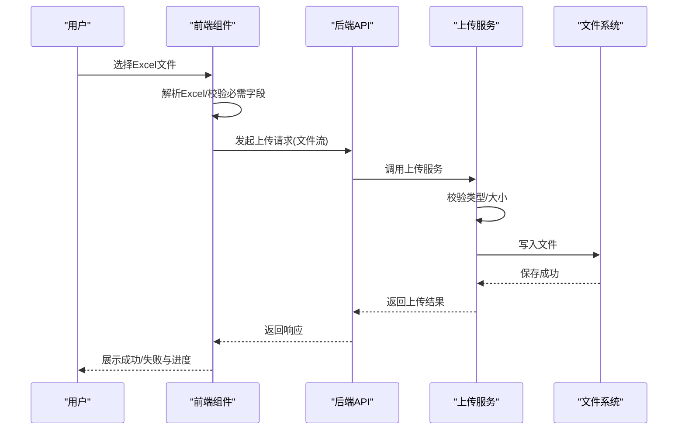
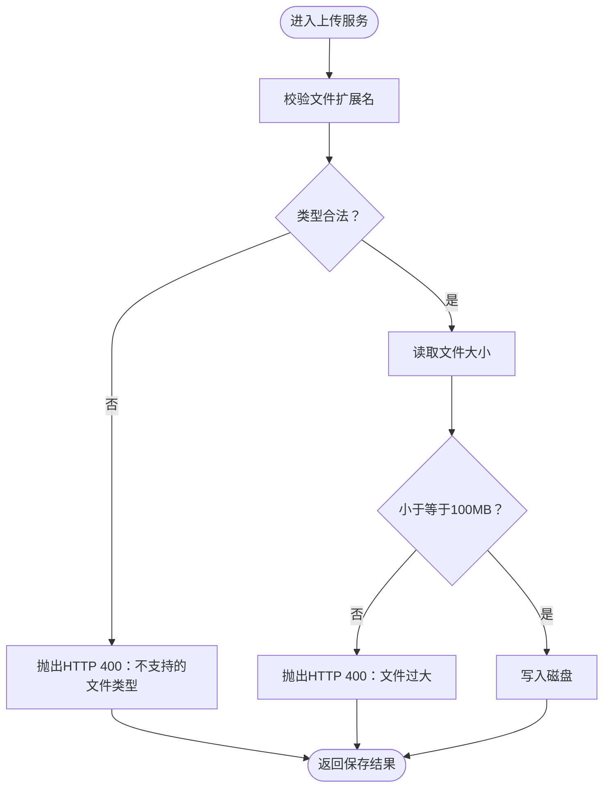
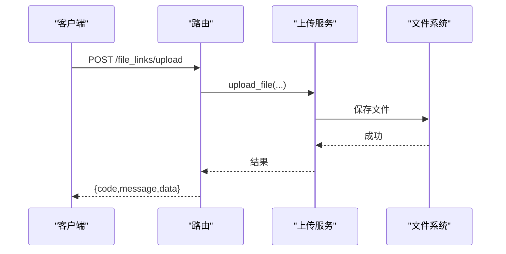
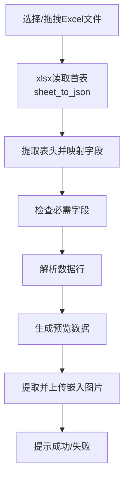
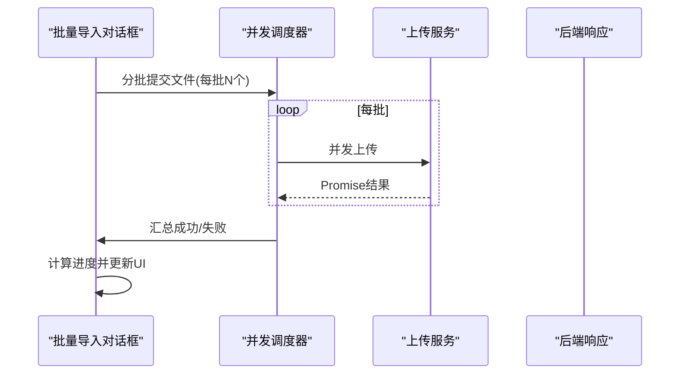
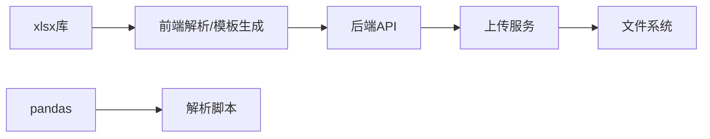

# 文件上传功能

<cite>
**本文引用的文件**
- [file_upload_service.py](file://backend/app/services/file_upload_service.py)
- [file_links.py](file://backend/app/api/v1/file_links.py)
- [import_.py](file://backend/app/api/v1/import_.py)
- [index.vue（领星导入）](file://frontend/src/views/Lingxing/Import/index.vue)
- [excelGenerator.ts](file://frontend/src/views/Lingxing/Import/utils/excelGenerator.ts)
- [CarrierBatchImportDialog.vue](file://frontend/src/views/CarrierLibrary/components/CarrierBatchImportDialog.vue)
- [MaterialBatchImportDialog.vue](file://frontend/src/views/MaterialLibrary/components/MaterialBatchImportDialog.vue)
- [DraftDialog.vue](file://frontend/src/views/FinalDraft/components/DraftDialog.vue)
- [read_excel.py](file://scripts/read_excel.py)
</cite>

## 目录
1. [简介](#简介)
2. [项目结构](#项目结构)
3. [核心组件](#核心组件)
4. [架构总览](#架构总览)
5. [详细组件分析](#详细组件分析)
6. [依赖关系分析](#依赖关系分析)
7. [性能考量](#性能考量)
8. [故障排查指南](#故障排查指南)
9. [结论](#结论)
10. [附录](#附录)

## 简介
本技术文档围绕“文件上传”功能展开，重点覆盖Excel文件上传的完整流程：文件类型验证（.xlsx/.xls格式检查）、文件大小限制、上传进度监控；文件接收处理、内存管理优化与并发上传控制；上传文件的格式验证规则、必需字段检查与数据完整性验证；错误处理策略、异常捕获与用户反馈机制；以及完整的API接口说明、请求参数、响应格式与错误码定义。同时，提供前端文件选择组件、拖拽上传支持与文件预览的实现要点，并给出集成指南与最佳实践建议。

## 项目结构
文件上传功能在后端由服务层与API层协作实现，在前端由多个业务视图组件负责文件选择、预览与上传交互。整体采用“前端选择与预览 + 后端校验与落盘”的分层架构。

图表来源
- [file_upload_service.py:177-194](file://backend/app/services/file_upload_service.py#L177-L194)
- [file_links.py:257-340](file://backend/app/api/v1/file_links.py#L257-L340)
- [index.vue（领星导入）:538-579](file://frontend/src/views/Lingxing/Import/index.vue#L538-L579)

章节来源
- [file_upload_service.py:157-194](file://backend/app/services/file_upload_service.py#L157-L194)
- [file_links.py:257-340](file://backend/app/api/v1/file_links.py#L257-L340)
- [index.vue（领星导入）:538-579](file://frontend/src/views/Lingxing/Import/index.vue#L538-L579)

## 核心组件
- 后端上传服务：负责文件类型与大小校验、文件保存、并发控制与统计查询。
- 后端API：提供单文件上传、批量上传、上传统计等接口。
- 前端Excel导入视图：负责Excel文件选择、表头映射、必需字段检查、数据解析与预览。
- 前端批量导入对话框：负责图片/文件的并发上传、进度更新与错误回滚。
- Excel解析工具：基于xlsx库进行表头识别、数据抽取与图片提取。

章节来源
- [file_upload_service.py:157-194](file://backend/app/services/file_upload_service.py#L157-L194)
- [file_links.py:257-340](file://backend/app/api/v1/file_links.py#L257-L340)
- [index.vue（领星导入）:436-490](file://frontend/src/views/Lingxing/Import/index.vue#L436-L490)
- [CarrierBatchImportDialog.vue:566-616](file://frontend/src/views/CarrierLibrary/components/CarrierBatchImportDialog.vue#L566-L616)
- [excelGenerator.ts:1-56](file://frontend/src/views/Lingxing/Import/utils/excelGenerator.ts#L1-L56)

## 架构总览
后端通过FastAPI路由暴露上传接口，调用上传服务执行文件校验与保存；前端通过表单或拖拽选择文件，进行Excel解析与预览，随后发起上传请求并展示进度与结果。

图表来源
- [file_links.py:257-340](file://backend/app/api/v1/file_links.py#L257-L340)
- [file_upload_service.py:157-194](file://backend/app/services/file_upload_service.py#L157-L194)

## 详细组件分析

### 后端上传服务（文件类型与大小校验、保存）
- 文件类型验证：仅允许特定扩展名（含.xlsx、.xls、.csv等），若不匹配抛出HTTP 400。
- 文件大小限制：最大100MB，超限抛出HTTP 400。
- 文件保存：异步读取文件内容，写入磁盘路径，返回字节长度。
- 并发控制：服务层未显式实现并发队列，建议在API层或上层中间件增加速率限制与并发上限。
- 统计查询：提供上传统计接口，便于监控与审计。

图表来源
- [file_upload_service.py:157-194](file://backend/app/services/file_upload_service.py#L157-L194)

章节来源
- [file_upload_service.py:157-194](file://backend/app/services/file_upload_service.py#L157-L194)

### 后端API（单文件/批量上传与统计）
- 单文件上传接口：接收文件、标题、库类型、描述、标签、分类等参数，返回统一响应结构（code/message/data）。
- 批量上传接口：接收文件列表，逐个调用上传服务，聚合结果并返回数量与明细。
- 上传统计接口：返回上传统计信息，便于前端展示与运营监控。
- 错误处理：对HTTP异常透传，其他异常统一包装为HTTP 500。

图表来源
- [file_links.py:257-340](file://backend/app/api/v1/file_links.py#L257-L340)

章节来源
- [file_links.py:257-340](file://backend/app/api/v1/file_links.py#L257-L340)

### 前端Excel导入视图（文件选择、拖拽、预览与校验）
- 文件选择与拖拽：支持点击选择与拖拽上传，触发解析流程。
- Excel解析：使用xlsx库读取首张工作表，转换为二维数组。
- 表头映射与必需字段检查：根据表头识别字段并校验必需字段是否齐全。
- 数据解析与预览：按字段映射解析数据行，生成预览列表，提示解析条数。
- 图片提取与上传：尝试从Excel中提取嵌入图片并上传，提升导入体验。

图表来源
- [index.vue（领星导入）:538-579](file://frontend/src/views/Lingxing/Import/index.vue#L538-L579)

章节来源
- [index.vue（领星导入）:436-490](file://frontend/src/views/Lingxing/Import/index.vue#L436-L490)
- [index.vue（领星导入）:538-579](file://frontend/src/views/Lingxing/Import/index.vue#L538-L579)

### 前端批量导入对话框（并发上传与进度）
- 并发控制：固定并发数（如5），将文件切分为批次，逐批Promise.allSettled并发上传。
- 进度计算：按批次累计上传数量，映射到整体进度（例如图片上传占30%）。
- 结果处理：收集成功与失败文件，统一展示并支持错误回滚。
- 响应兼容：兼容多种后端响应格式（url/cos_url/filepath），确保URL提取稳定。

图表来源
- [CarrierBatchImportDialog.vue:566-616](file://frontend/src/views/CarrierLibrary/components/CarrierBatchImportDialog.vue#L566-L616)
- [MaterialBatchImportDialog.vue:728-794](file://frontend/src/views/MaterialLibrary/components/MaterialBatchImportDialog.vue#L728-L794)

章节来源
- [CarrierBatchImportDialog.vue:566-616](file://frontend/src/views/CarrierLibrary/components/CarrierBatchImportDialog.vue#L566-L616)
- [MaterialBatchImportDialog.vue:728-794](file://frontend/src/views/MaterialLibrary/components/MaterialBatchImportDialog.vue#L728-L794)
- [DraftDialog.vue:858-893](file://frontend/src/views/FinalDraft/components/DraftDialog.vue#L858-L893)

### Excel解析与模板生成（辅助导入）
- 解析脚本：使用pandas读取Excel，清理列名，输出列名与前几行数据的JSON模板，便于前端字段映射。
- 模板生成：基于xlsx库生成符合后端导入规范的Excel模板，支持可选模板URL加载。

章节来源
- [read_excel.py:1-34](file://scripts/read_excel.py#L1-L34)
- [excelGenerator.ts:1-56](file://frontend/src/views/Lingxing/Import/utils/excelGenerator.ts#L1-L56)

## 依赖关系分析
- 前端依赖xlsx库进行Excel解析与模板生成；依赖Element Plus进行消息提示与交互。
- 后端依赖FastAPI框架与UploadFile流式接收；文件系统用于持久化。
- 服务层与API层解耦，便于扩展与测试；并发控制建议在API或中间件层增强。

图表来源
- [excelGenerator.ts:1-56](file://frontend/src/views/Lingxing/Import/utils/excelGenerator.ts#L1-L56)
- [read_excel.py:1-34](file://scripts/read_excel.py#L1-L34)
- [file_links.py:257-340](file://backend/app/api/v1/file_links.py#L257-L340)
- [file_upload_service.py:157-194](file://backend/app/services/file_upload_service.py#L157-L194)

章节来源
- [excelGenerator.ts:1-56](file://frontend/src/views/Lingxing/Import/utils/excelGenerator.ts#L1-L56)
- [read_excel.py:1-34](file://scripts/read_excel.py#L1-L34)
- [file_links.py:257-340](file://backend/app/api/v1/file_links.py#L257-L340)
- [file_upload_service.py:157-194](file://backend/app/services/file_upload_service.py#L157-L194)

## 性能考量
- 内存管理：后端采用异步读取文件内容，避免一次性加载大文件至内存；建议在高并发场景下限制单次请求体大小与连接数。
- 并发上传：前端以固定并发数（如5）分批上传，降低网络拥塞与后端压力；可根据带宽与后端限流策略调整。
- 进度监控：前端按批次累计进度，避免频繁重绘；建议结合节流/防抖优化UI更新频率。
- 存储策略：建议结合对象存储（如COS）替代本地磁盘，提升扩展性与可靠性。

## 故障排查指南
- 文件类型错误：确认扩展名为.xlsx/.xls/.csv之一，否则返回HTTP 400。
- 文件过大：单文件不得超过100MB，超限返回HTTP 400。
- 必需字段缺失：Excel表头必须包含所需字段映射，否则提示缺失字段并终止解析。
- 上传失败：检查后端日志与网络状态；前端根据响应message提示具体原因。
- 并发上传异常：关注Promise.allSettled的失败项，记录失败文件名与原因，必要时回滚UI状态。

章节来源
- [file_upload_service.py:157-194](file://backend/app/services/file_upload_service.py#L157-L194)
- [index.vue（领星导入）:538-579](file://frontend/src/views/Lingxing/Import/index.vue#L538-L579)
- [CarrierBatchImportDialog.vue:566-616](file://frontend/src/views/CarrierLibrary/components/CarrierBatchImportDialog.vue#L566-L616)

## 结论
该文件上传功能在后端实现了基础的类型与大小校验、磁盘落盘与批量统计；在前端提供了Excel解析、字段映射与并发上传能力。建议后续在API层引入更细粒度的并发控制与速率限制、完善对象存储接入与断点续传能力，并统一错误码与响应结构，以进一步提升稳定性与可维护性。

## 附录

### API 接口说明
- 单文件上传
  - 方法与路径：POST /file_links/upload
  - 请求参数（multipart/form-data）：
    - file: 上传的文件（必填）
    - title: 文件标题（必填）
    - library_type: 所属库类型（必填）
    - description: 文件描述（可选）
    - tags: 标签列表（可选）
    - category: 分类（可选）
  - 响应格式：
    - code: 200表示成功，非200为失败
    - message: 描述信息
    - data: 上传结果详情
  - 错误码：
    - 400：文件类型不支持、文件过大、参数缺失
    - 500：服务器内部错误

- 批量上传
  - 方法与路径：POST /file_links/batch-upload
  - 请求参数（multipart/form-data）：
    - files: 文件列表（必填）
    - library_type: 所属库类型（必填）
    - category: 分类（可选）
  - 响应格式：
    - code: 200表示成功
    - message: 成功上传的数量提示
    - data: 上传结果列表
  - 错误码：
    - 400：文件列表为空、参数缺失
    - 500：服务器内部错误

- 上传统计
  - 方法与路径：GET /file_links/upload/stats
  - 响应格式：
    - code: 200表示成功
    - message: 获取成功
    - data: 统计信息
  - 错误码：
    - 500：服务器内部错误

章节来源
- [file_links.py:257-340](file://backend/app/api/v1/file_links.py#L257-L340)

### 前端集成指南与最佳实践
- 文件选择与拖拽：使用HTML input[type=file]与拖拽事件监听，结合Element Plus的消息提示。
- Excel解析：使用xlsx库读取首表，进行表头映射与必需字段校验，再解析数据行。
- 并发上传：固定并发数（如5），分批Promise.allSettled并发上传，实时更新进度。
- 错误处理：统一捕获异常，区分业务错误与网络错误，向用户展示明确提示并支持重试。
- 最佳实践：
  - 在上传前进行本地格式与大小预检；
  - 对于大文件建议采用分片上传或对象存储直传；
  - 统一响应结构与错误码，便于前后端协同；
  - 前端保留上传历史与失败重试机制。

章节来源
- [index.vue（领星导入）:436-490](file://frontend/src/views/Lingxing/Import/index.vue#L436-L490)
- [CarrierBatchImportDialog.vue:566-616](file://frontend/src/views/CarrierLibrary/components/CarrierBatchImportDialog.vue#L566-L616)
- [MaterialBatchImportDialog.vue:728-794](file://frontend/src/views/MaterialLibrary/components/MaterialBatchImportDialog.vue#L728-L794)
- [DraftDialog.vue:858-893](file://frontend/src/views/FinalDraft/components/DraftDialog.vue#L858-L893)