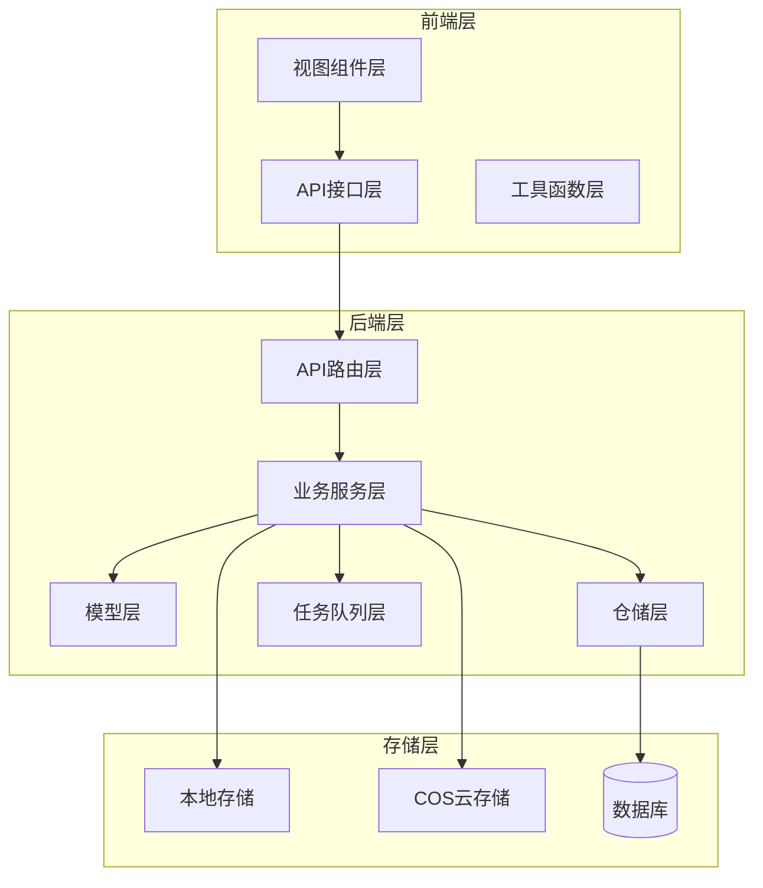
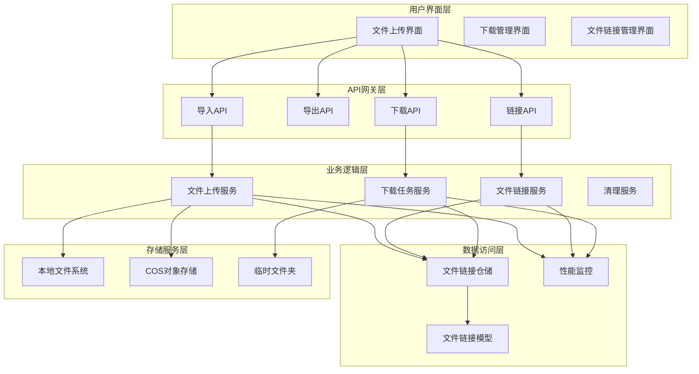
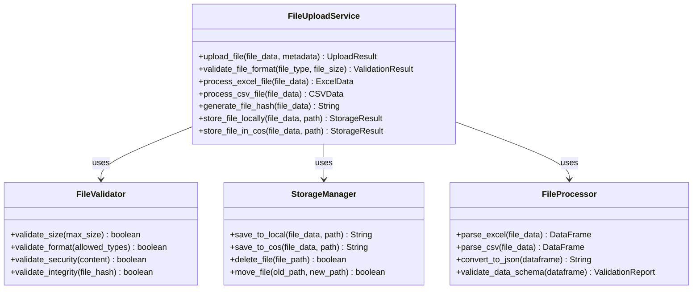
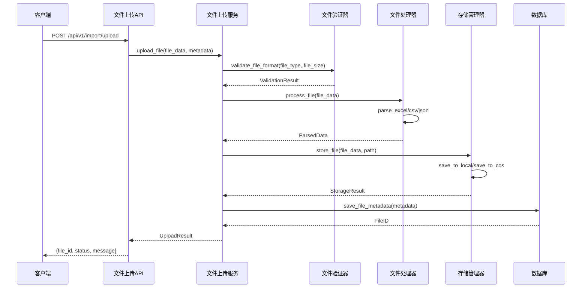
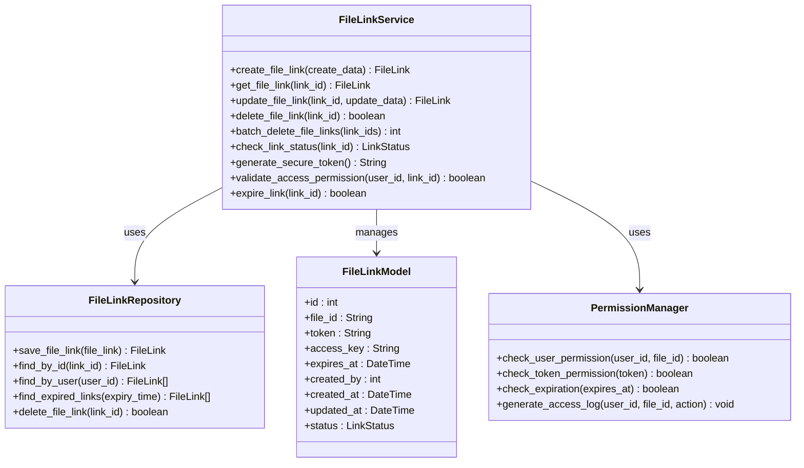
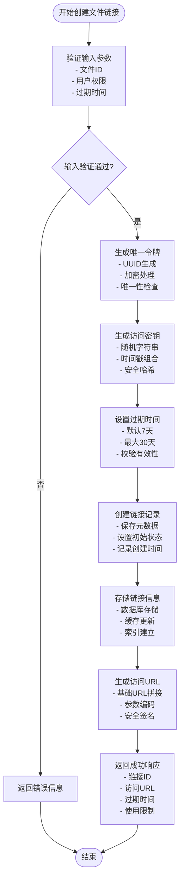
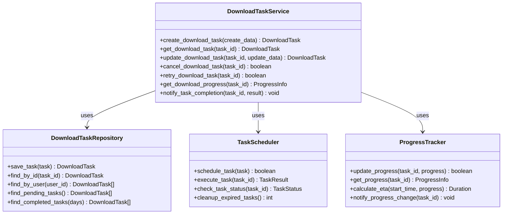
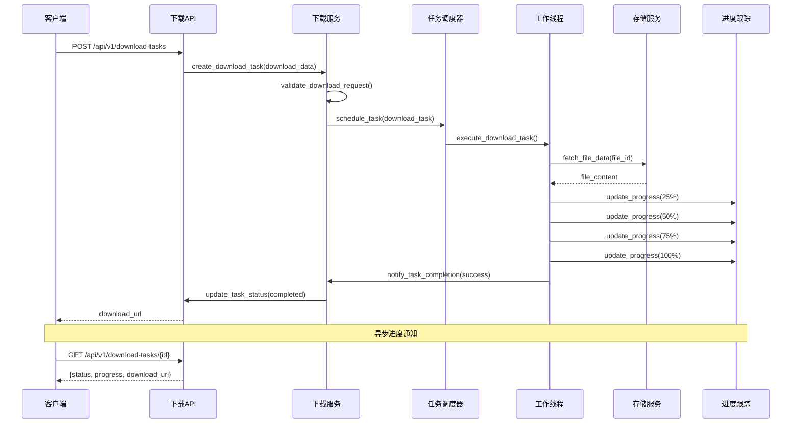
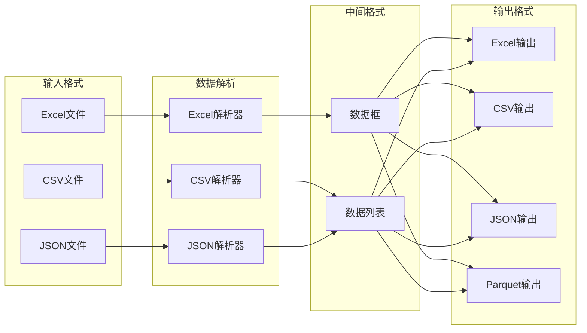

# 文件处理模块

<cite>
**本文引用的文件**
- [backend/app/api/v1/import_.py](file://backend/app/api/v1/import_.py)
- [backend/app/api/v1/export.py](file://backend/app/api/v1/export.py)
- [backend/app/api/v1/download_tasks.py](file://backend/app/api/v1/download_tasks.py)
- [backend/app/api\v1\file_links.py](file://backend/app/api/v1/file_links.py)
- [backend/app/services/file_upload_service.py](file://backend/app/services/file_upload_service.py)
- [backend/app/services/file_link_service.py](file://backend/app/services/file_link_service.py)
- [backend/app/models/file_link.py](file://backend/app/models/file_link.py)
- [backend/app/repositories/file_link_repository.py](file://backend/app/repositories/file_link_repository.py)
- [backend/app/tasks/download_tasks.py](file://backend/app/tasks/download_tasks.py)
- [backend/app/utils/performance_monitor.py](file://backend/app/utils/performance_monitor.py)
- [backend/app/services/cleanup_service.py](file://backend/app/services/cleanup_service.py)
- [backend/app/services/local_file_service.py](file://backend/app/services/local_file_service.py)
- [backend/app/services/cos_service.py](file://backend/app/services/cos_service.py)
- [frontend/src/api/import_export.ts](file://frontend/src/api/import_export.ts)
- [frontend/src/views/ImportExport/index.vue](file://frontend/src/views/ImportExport/index.vue)
- [frontend/src/api/fileLink.ts](file://frontend/src/api/fileLink.ts)
- [frontend/src/views/FileLinkManagement/index.vue](file://frontend/src/views/FileLinkManagement/index.vue)
- [frontend/openapi.json](file://frontend/openapi.json)
- [scripts/read_excel.py](file://scripts/read_excel.py)
- [frontend/src/views/Lingxing/Import/index.vue](file://frontend/src/views/Lingxing/Import/index.vue)
</cite>

## 目录
1. [简介](#简介)
2. [项目结构](#项目结构)
3. [核心组件](#核心组件)
4. [架构概览](#架构概览)
5. [详细组件分析](#详细组件分析)
6. [依赖关系分析](#依赖关系分析)
7. [性能考虑](#性能考虑)
8. [故障排除指南](#故障排除指南)
9. [结论](#结论)
10. [附录](#附录)

## 简介
文件处理模块是系统中的核心数据导入导出子系统，负责处理批量文件上传、数据格式转换、文件下载管理和文件链接生成等关键功能。该模块支持多种文件格式（Excel、CSV、JSON等），提供完整的文件处理流程，包括文件接收、格式验证、数据解析、批量导入和状态跟踪。同时，模块实现了文件链接的生成机制、访问权限控制和过期策略，并提供了完整的API接口说明和错误处理机制。

## 项目结构
文件处理模块采用前后端分离的架构设计，后端使用Python FastAPI框架，前端使用Vue.js技术栈。模块主要分为以下几个层次：

**图表来源**
- [backend/app/api/v1/import_.py:1-50](file://backend/app/api/v1/import_.py#L1-L50)
- [backend/app/services/file_upload_service.py:1-50](file://backend/app/services/file_upload_service.py#L1-L50)
- [frontend/src/api/import_export.ts:1-50](file://frontend/src/api/import_export.ts#L1-L50)

**章节来源**
- [backend/app/api/v1/import_.py:1-100](file://backend/app/api/v1/import_.py#L1-L100)
- [backend/app/api/v1/export.py:1-100](file://backend/app/api/v1/export.py#L1-L100)
- [frontend/src/api/import_export.ts:1-80](file://frontend/src/api/import_export.ts#L1-L80)

## 核心组件
文件处理模块包含以下核心组件：

### 1. 文件上传组件
- **文件上传服务**：处理文件接收、格式验证和存储
- **文件类型识别**：支持Excel、CSV、JSON等多种格式
- **大小限制控制**：实现文件大小限制和安全检查

### 2. 数据处理组件
- **数据解析器**：将文件数据转换为系统内部格式
- **批量导入器**：处理大量数据的高效导入
- **格式转换器**：在不同数据格式间进行转换

### 3. 文件链接组件
- **链接生成器**：创建安全的文件访问链接
- **权限控制器**：管理文件访问权限
- **过期管理器**：处理链接过期和清理

### 4. 下载管理组件
- **下载任务调度**：管理异步下载任务
- **进度跟踪器**：监控下载进度
- **状态管理器**：维护下载状态

**章节来源**
- [backend/app/services/file_upload_service.py:1-150](file://backend/app/services/file_upload_service.py#L1-L150)
- [backend/app/services/file_link_service.py:1-150](file://backend/app/services/file_link_service.py#L1-L150)
- [backend/app/api/v1/file_links.py:1-100](file://backend/app/api/v1/file_links.py#L1-L100)

## 架构概览
文件处理模块采用分层架构设计，确保了良好的可维护性和扩展性：

**图表来源**
- [backend/app/api/v1/import_.py:1-200](file://backend/app/api/v1/import_.py#L1-L200)
- [backend/app/api/v1/file_links.py:1-250](file://backend/app/api/v1/file_links.py#L1-L250)
- [backend/app/services/file_upload_service.py:1-200](file://backend/app/services/file_upload_service.py#L1-L200)

## 详细组件分析

### 文件上传服务分析
文件上传服务是文件处理模块的核心组件，负责处理各种类型的文件上传请求。

**图表来源**
- [backend/app/services/file_upload_service.py:1-300](file://backend/app/services/file_upload_service.py#L1-L300)
- [backend/app/api/v1/import_.py:1-200](file://backend/app/api/v1/import_.py#L1-L200)

#### 文件上传流程
文件上传服务实现了完整的文件处理流程：

**图表来源**
- [backend/app/api/v1/import_.py:1-150](file://backend/app/api/v1/import_.py#L1-L150)
- [backend/app/services/file_upload_service.py:1-250](file://backend/app/services/file_upload_service.py#L1-L250)

**章节来源**
- [backend/app/services/file_upload_service.py:1-350](file://backend/app/services/file_upload_service.py#L1-L350)
- [backend/app/api/v1/import_.py:1-200](file://backend/app/api/v1/import_.py#L1-L200)

### 文件链接服务分析
文件链接服务负责生成和管理文件访问链接，提供安全的文件分享机制。

**图表来源**
- [backend/app/services/file_link_service.py:1-300](file://backend/app/services/file_link_service.py#L1-L300)
- [backend/app/models/file_link.py:1-150](file://backend/app/models/file_link.py#L1-L150)
- [backend/app/repositories/file_link_repository.py:1-150](file://backend/app/repositories/file_link_repository.py#L1-L150)

#### 文件链接生成流程
文件链接服务实现了安全的链接生成和管理机制：

**图表来源**
- [backend/app/services/file_link_service.py:1-250](file://backend/app/services/file_link_service.py#L1-L250)
- [backend/app/api/v1/file_links.py:1-200](file://backend/app/api/v1/file_links.py#L1-L200)

**章节来源**
- [backend/app/services/file_link_service.py:1-350](file://backend/app/services/file_link_service.py#L1-L350)
- [backend/app/api/v1/file_links.py:1-250](file://backend/app/api/v1/file_links.py#L1-L250)

### 下载任务服务分析
下载任务服务负责管理异步文件下载任务，提供进度跟踪和状态管理功能。

**图表来源**
- [backend/app/api/v1/download_tasks.py:1-200](file://backend/app/api/v1/download_tasks.py#L1-L200)
- [backend/app/tasks/download_tasks.py:1-200](file://backend/app/tasks/download_tasks.py#L1-L200)

#### 下载任务执行流程
下载任务服务实现了可靠的异步任务执行机制：

**图表来源**
- [backend/app/api/v1/download_tasks.py:1-150](file://backend/app/api/v1/download_tasks.py#L1-L150)
- [backend/app/tasks/download_tasks.py:1-150](file://backend/app/tasks/download_tasks.py#L1-L150)

**章节来源**
- [backend/app/api/v1/download_tasks.py:1-200](file://backend/app/api/v1/download_tasks.py#L1-L200)
- [backend/app/tasks/download_tasks.py:1-200](file://backend/app/tasks/download_tasks.py#L1-L200)

### 数据格式转换分析
系统支持多种数据格式的转换和处理，主要包括Excel、CSV和JSON格式。

**图表来源**
- [scripts/read_excel.py:1-50](file://scripts/read_excel.py#L1-L50)
- [frontend/src/views/Lingxing/Import/index.vue:538-579](file://frontend/src/views/Lingxing/Import/index.vue#L538-L579)

**章节来源**
- [scripts/read_excel.py:1-50](file://scripts/read_excel.py#L1-L50)
- [frontend/src/views/Lingxing/Import/index.vue:538-579](file://frontend/src/views/Lingxing/Import/index.vue#L538-L579)

## 依赖关系分析
文件处理模块的依赖关系体现了清晰的分层架构和职责分离：

```mermaid
graph TB
subgraph "外部依赖"
PANDAS[pandas]
XLSX[xlsx]
OPENPYXL[openpyxl]
NUMPY[numpy]
FASTAPI[fastapi]
PYDANTIC[pydantic]
CELERY[celery]
REDIS[redis]
MYSQL[mysql-connector]
end
subgraph "内部模块"
IMPORT_API[import_.py]
EXPORT_API[export.py]
FILE_LINK_API[file_links.py]
DOWNLOAD_API[download_tasks.py]
UPLOAD_SERVICE[file_upload_service.py]
LINK_SERVICE[file_link_service.py]
DOWNLOAD_SERVICE[download_tasks.py]
CLEANUP_SERVICE[cleanup_service.py]
LOCAL_SERVICE[local_file_service.py]
COS_SERVICE[cos_service.py]
end
subgraph "工具类"
PERF_MONITOR[performance_monitor.py]
VALIDATOR[validation_utils]
LOGGER[logging_utils]
end
IMPORT_API --> UPLOAD_SERVICE
EXPORT_API --> UPLOAD_SERVICE
FILE_LINK_API --> LINK_SERVICE
DOWNLOAD_API --> DOWNLOAD_SERVICE
UPLOAD_SERVICE --> LOCAL_SERVICE
UPLOAD_SERVICE --> COS_SERVICE
LINK_SERVICE --> CLEANUP_SERVICE
UPLOAD_SERVICE --> PANDAS
UPLOAD_SERVICE --> XLSX
UPLOAD_SERVICE --> OPENPYXL
DOWNLOAD_SERVICE --> CELERY
DOWNLOAD_SERVICE --> REDIS
IMPORT_API --> FASTAPI
IMPORT_API --> PYDANTIC
UPLOAD_SERVICE --> PERF_MONITOR
LINK_SERVICE --> PERF_MONITOR
DOWNLOAD_SERVICE --> PERF_MONITOR
```

**图表来源**
- [backend/app/services/file_upload_service.py:1-100](file://backend/app/services/file_upload_service.py#L1-L100)
- [backend/app/api/v1/import_.py:1-50](file://backend/app/api/v1/import_.py#L1-L50)

**章节来源**
- [backend/app/services/file_upload_service.py:1-200](file://backend/app/services/file_upload_service.py#L1-L200)
- [backend/app/api/v1/import_.py:1-100](file://backend/app/api/v1/import_.py#L1-L100)

## 性能考虑
文件处理模块在设计时充分考虑了性能优化和资源管理：

### 并发控制
- **任务队列管理**：使用Celery实现异步任务处理，避免阻塞主线程
- **连接池管理**：数据库连接和存储服务连接使用连接池复用
- **并发限制**：对同时进行的文件处理任务数量进行限制

### 内存优化
- **流式处理**：大文件采用流式读取，避免一次性加载到内存
- **分块处理**：大批量数据按批次处理，减少内存占用
- **及时释放**：处理完成后及时释放临时资源和缓存

### 性能监控
- **指标收集**：记录文件大小、处理时间、内存使用等关键指标
- **告警机制**：当性能指标异常时自动触发告警
- **优化建议**：基于监控数据提供性能优化建议

**章节来源**
- [backend/app/utils/performance_monitor.py:1-150](file://backend/app/utils/performance_monitor.py#L1-L150)
- [backend/app/services/cleanup_service.py:1-150](file://backend/app/services/cleanup_service.py#L1-L150)

## 故障排除指南
文件处理模块提供了完善的错误处理和故障排除机制：

### 常见错误类型
1. **文件格式错误**：文件类型不支持或格式损坏
2. **文件大小超限**：超过系统设定的最大文件大小
3. **权限不足**：用户没有足够的权限访问目标文件
4. **存储空间不足**：本地或云端存储空间不足
5. **网络超时**：文件传输过程中网络连接中断

### 错误处理策略
- **优雅降级**：在部分功能失效时保持核心功能可用
- **重试机制**：对临时性错误提供自动重试机会
- **详细日志**：记录详细的错误信息便于排查
- **用户友好提示**：向用户提供清晰的错误说明

### 调试工具
- **性能分析器**：监控系统性能瓶颈
- **内存监控器**：检测内存泄漏和过度使用
- **网络监控器**：跟踪网络请求和响应时间
- **存储监控器**：监控磁盘空间和存储使用情况

**章节来源**
- [backend/app/api/v1/import_.py:150-250](file://backend/app/api/v1/import_.py#L150-L250)
- [backend/app/api/v1/file_links.py:200-250](file://backend/app/api/v1/file_links.py#L200-L250)

## 结论
文件处理模块是一个功能完善、架构清晰的文件管理子系统。它提供了完整的文件导入导出功能，支持多种数据格式，实现了安全的文件链接管理和高效的下载任务处理。模块采用现代化的技术栈和最佳实践，具有良好的可扩展性和维护性。通过合理的性能优化和错误处理机制，确保了系统的稳定性和用户体验。

对于数据管理员和系统运维人员，该模块提供了直观的界面和完善的API接口，可以轻松地进行文件管理操作。同时，详细的日志记录和监控功能有助于及时发现和解决问题。

## 附录

### 支持的文件格式
- **Excel格式**：.xlsx、.xls（支持OpenPyXL引擎）
- **CSV格式**：.csv（UTF-8编码支持）
- **JSON格式**：.json（标准JSON格式）
- **其他格式**：根据具体需求可扩展支持更多格式

### 文件大小限制
- **默认限制**：10MB（可根据需求调整）
- **最大限制**：50MB（系统上限）
- **临时文件**：最多保留7天自动清理

### API接口说明
模块提供RESTful API接口，支持标准的HTTP方法和状态码。所有接口都遵循统一的响应格式，包含状态码、消息和数据体。

### 存储策略
- **本地存储**：适合小文件和临时文件
- **云存储**：COS对象存储，适合大文件和长期存储
- **混合策略**：根据文件大小和访问频率选择最优存储方案