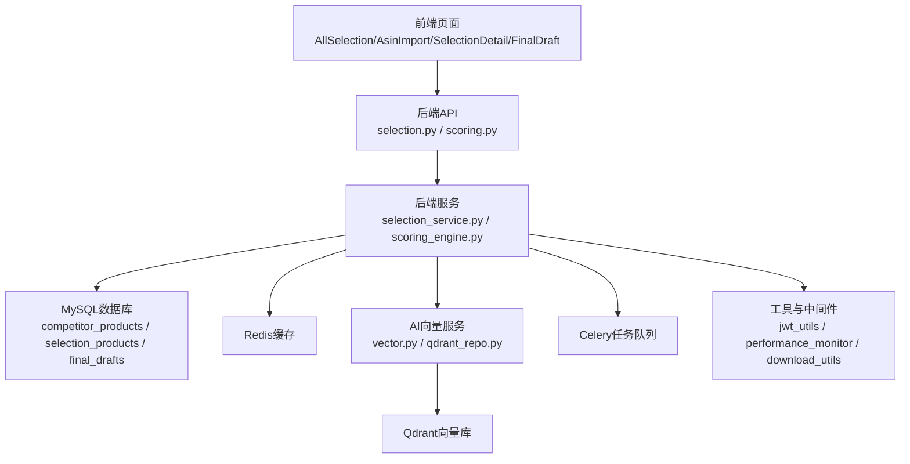
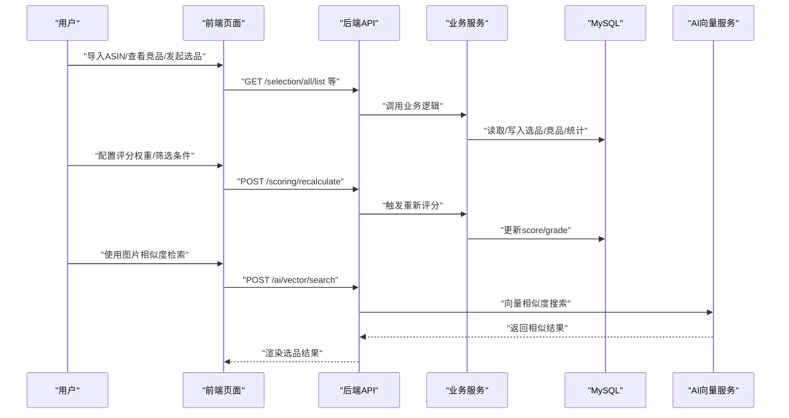
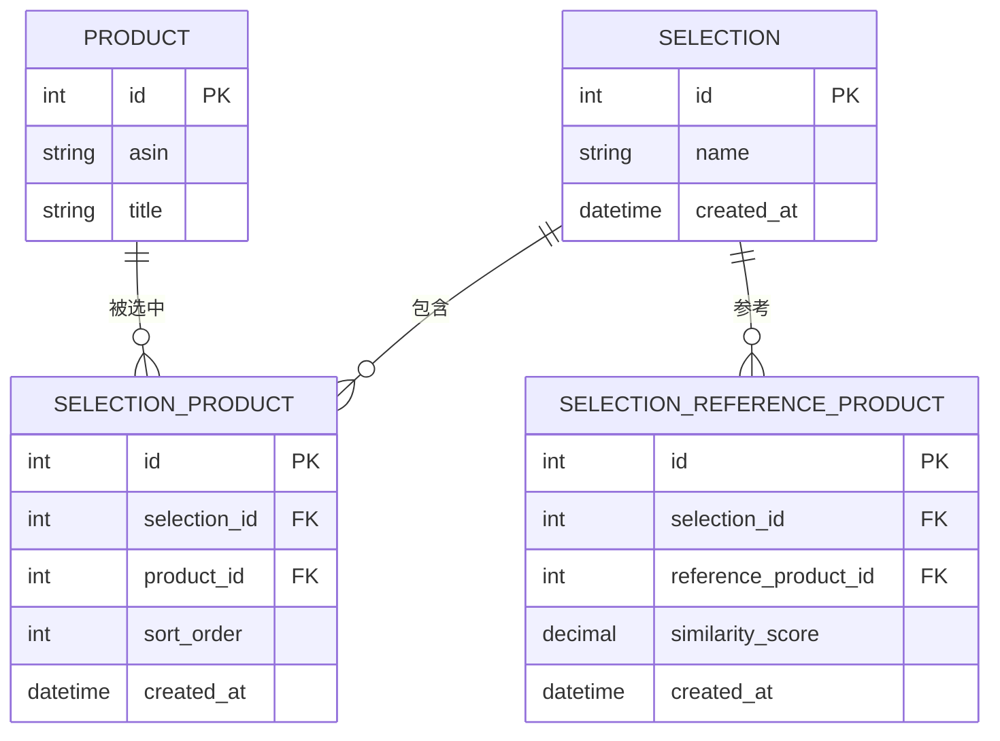
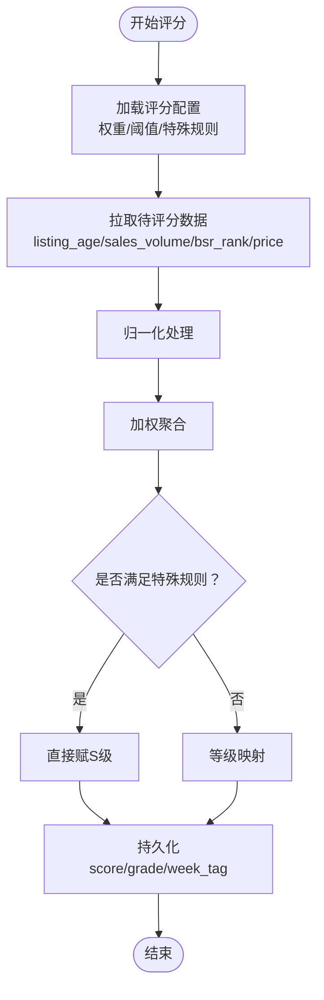
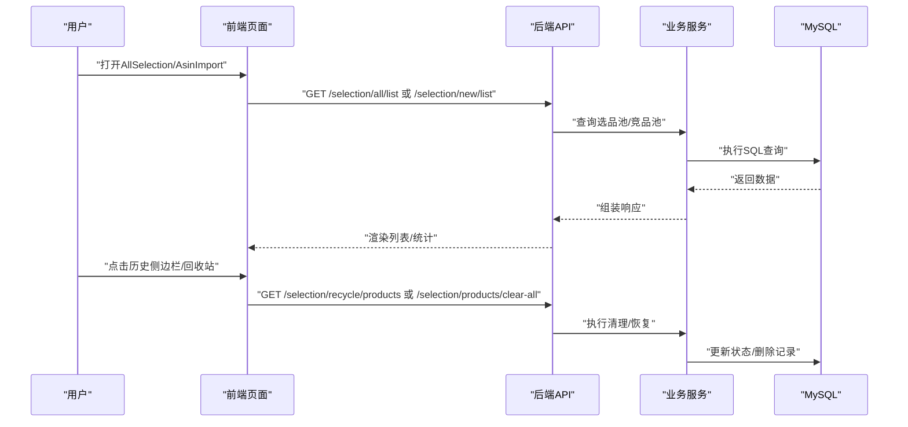
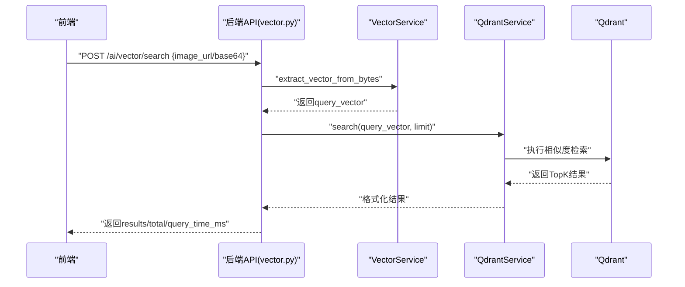
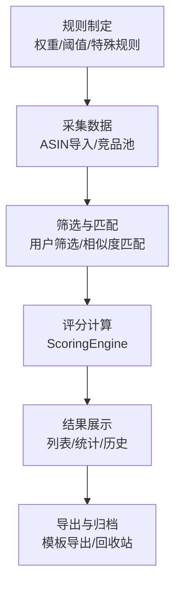
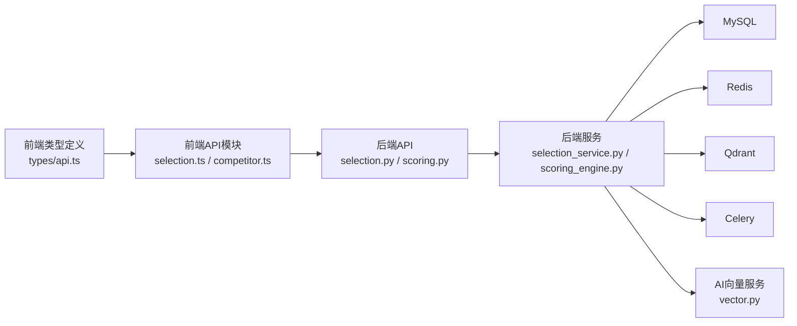

# 智能选品模块

<cite>
**本文引用的文件**
- [AI选品×系统深度结合方案.md](file://docs/ai结合分析/02-系统结合/AI选品×系统深度结合方案.md)
- [selection.ts](file://frontend/src/api/selection.ts)
- [selection.vue](file://frontend/src/views/SelectionDetail/index.vue)
- [selection.vue](file://frontend/src/views/AllSelection/index.vue)
- [selection.vue](file://frontend/src/views/AsinImport/index.vue)
- [selection.vue](file://frontend/src/views/FinalDraft/index.vue)
- [selection.vue](file://frontend/src/views/SelectionDetail/HistorySidebar.vue)
- [selection.vue](file://frontend/src/views/AsinImport/HistorySidebar.vue)
- [selection.vue](file://frontend/src/views/AllSelection/ScoringConfigPanel.vue)
- [selection.vue](file://frontend/src/views/AllSelection/test-button.vue)
- [selection.py](file://backend/app/api/v1/selection.py)
- [selection.py](file://backend/app/models/selection.py)
- [selection_service.py](file://backend/app/services/selection_service.py)
- [scoring_engine.py](file://backend/app/services/scoring_engine.py)
- [scoring.py](file://backend/app/api/v1/scoring.py)
- [scoring.py](file://backend/app/models/scoring.py)
- [scoring.py](file://backend/migrations/init_scoring_system.sql)
- [init_database_dev.sql](file://backend/migrations/init_database_dev.sql)
- [fix_scoring.py](file://backend/scripts/fix_scoring.py)
- [vector.py](file://python-ai/app/api/v1/vector.py)
- [qdrant_repo.py](file://python-ai/app/repositories/qdrant_repo.py)
- [qdrant_service.py](file://python-ai/app/services/qdrant_service.py)
- [vector_service.py](file://python-ai/app/services/vector_service.py)
- [vector_processing.py](file://backend/app/services/ai_vector_processing/ai_vector_processor.py)
- [check_model_cache.py](file://backend/app/services/ai_vector_processing/check_model_cache.py)
- [download_model.py](file://backend/app/services/ai_vector_processing/download_model.py)
- [competitor.ts](file://frontend/src/api/competitor.ts)
- [competitor.ts](file://frontend/src/types/api.ts)
- [selection_recycle.py](file://backend/app/api/v1/selection_recycle.py)
- [selection_recycle_service.py](file://backend/app/services/selection_recycle_service.py)
- [selection_recycle.py](file://backend/migrations/create_selection_tables.sql)
- [selection_recycle.py](file://backend/migrations/migrate_selection_tables.py)
- [selection_recycle.py](file://backend/app/repositories/create_selection_tables.py)
- [selection_recycle.py](file://backend/app/repositories/migrate_selection_tables.py)
- [selection_recycle.py](file://backend/app/repositories/mysql_repo.py)
- [selection_recycle.py](file://backend/app/repositories/qdrant_repo.py)
- [selection_recycle.py](file://backend/app/repositories/redis_repo.py)
- [selection_recycle.py](file://backend/tasks/celery_app.py)
- [selection_recycle.py](file://backend/tasks/download_tasks.py)
- [selection_recycle.py](file://backend/tasks/image_tasks.py)
- [selection_recycle.py](file://backend/utils/performance_monitor.py)
- [selection_recycle.py](file://backend/utils/jwt_utils.py)
- [selection_recycle.py](file://backend/utils/image_loader.py)
- [selection_recycle.py](file://backend/utils/image_processor.py)
- [selection_recycle.py](file://backend/utils/download_utils.py)
- [selection_recycle.py](file://backend/middleware/auth_middleware.py)
- [selection_recycle.py](file://backend/middleware/error_handler.py)
- [selection_recycle.py](file://backend/middleware/error_middleware.py)
- [selection_recycle.py](file://backend/middleware/logging.py)
- [selection_recycle.py](file://backend/middleware/timeout.py)
- [selection_recycle.py](file://backend/config.py)
- [selection_recycle.py](file://backend/main.py)
</cite>

## 目录
1. [简介](#简介)
2. [项目结构](#项目结构)
3. [核心组件](#核心组件)
4. [架构总览](#架构总览)
5. [详细组件分析](#详细组件分析)
6. [依赖关系分析](#依赖关系分析)
7. [性能考虑](#性能考虑)
8. [故障排查指南](#故障排查指南)
9. [结论](#结论)
10. [附录](#附录)

## 简介
本文件面向选品分析师与决策者，系统化阐述智能选品模块的全生命周期：从规则制定、数据采集、算法计算、结果展示到历史记录与回收站管理；覆盖评分引擎、竞品分析、AI向量化检索与相似性匹配、选品报告与趋势分析等关键能力。文档同时提供可视化流程图、类图与序列图，帮助非技术读者快速理解系统运作机制。

## 项目结构
智能选品模块由“前端页面 + 后端API与服务 + AI向量服务”三层构成，并通过数据库与任务调度协同工作。核心数据表包括竞品池、选品池、终稿池与回收站，贯穿选品全流程。

图表来源
- [selection.py](file://backend/app/api/v1/selection.py)
- [scoring_engine.py](file://backend/app/services/scoring_engine.py)
- [vector.py](file://python-ai/app/api/v1/vector.py)
- [qdrant_repo.py](file://python-ai/app/repositories/qdrant_repo.py)

章节来源
- [AI选品×系统深度结合方案.md](file://docs/ai结合分析/02-系统结合/AI选品×系统深度结合方案.md)
- [init_database_dev.sql](file://backend/migrations/init_database_dev.sql)

## 核心组件
- 选品数据模型与API：定义选品池、参考产品、统计与回收站操作，提供列表、详情、批量操作、清空与回收站恢复等接口。
- 评分引擎：基于多维特征（上架时长、销量、BSR、价格）的可配置评分与等级划分，支持一键重新评分与统计。
- 竞品分析：以竞品池为核心，提供按品牌、国家、FBA/FBM等维度的筛选与分析。
- AI向量化检索：基于CLIP图像特征提取与Qdrant向量相似度检索，支持图片上传/URL查询与索引。
- 任务与工具：Celery异步任务、性能监控、下载工具、缓存预热等支撑能力。
- 前端交互：选品视图切换、评分配置面板、历史侧边栏、模板导出、回收站管理等。

章节来源
- [selection.py](file://backend/app/models/selection.py)
- [selection.py](file://backend/app/api/v1/selection.py)
- [selection_service.py](file://backend/app/services/selection_service.py)
- [scoring_engine.py](file://backend/app/services/scoring_engine.py)
- [scoring.py](file://backend/app/api/v1/scoring.py)
- [vector.py](file://python-ai/app/api/v1/vector.py)
- [qdrant_repo.py](file://python-ai/app/repositories/qdrant_repo.py)

## 架构总览
智能选品系统采用前后端分离与微服务化思路，后端通过FastAPI提供REST接口，AI服务独立部署并通过HTTP交互。数据流从外部ASIN导入进入竞品池，经用户筛选进入选品池，再进入终稿池并最终落地生产。

图表来源
- [selection.ts](file://frontend/src/api/selection.ts)
- [selection.py](file://backend/app/api/v1/selection.py)
- [scoring.py](file://backend/app/api/v1/scoring.py)
- [vector.py](file://python-ai/app/api/v1/vector.py)

## 详细组件分析

### 1) 选品数据模型与API
- 数据模型：选品池、参考产品、统计信息、回收站条目等，包含主键、外键、唯一索引与常用查询索引。
- API能力：列表查询（新品榜/参考榜/全部）、详情、新增/更新/删除、批量删除、统计汇总、商店列表、模板导出、清空与回收站恢复/删除/清空。

图表来源
- [init_database_dev.sql](file://backend/migrations/init_database_dev.sql)

章节来源
- [selection.py](file://backend/app/models/selection.py)
- [selection.py](file://backend/app/api/v1/selection.py)
- [selection.ts](file://frontend/src/api/selection.ts)

### 2) 评分引擎与规则配置
- 评分维度：上架时长、销量、BSR、价格；支持特殊规则（如FBM直接S级）。
- 等级划分：S（≥90）、A（≥80）、B（≥65）、C（≥50）、D（<50）。
- 权重配置：通过评分配置表实现可调权重；支持一键重新评分与统计。
- 周标记：当前周标记与周标签用于周期性分析。

图表来源
- [scoring_engine.py](file://backend/app/services/scoring_engine.py)
- [scoring.py](file://backend/app/api/v1/scoring.py)
- [scoring.py](file://backend/migrations/init_scoring_system.sql)

章节来源
- [AI选品×系统深度结合方案.md](file://docs/ai结合分析/02-系统结合/AI选品×系统深度结合方案.md)
- [scoring_engine.py](file://backend/app/services/scoring_engine.py)
- [scoring.py](file://backend/app/api/v1/scoring.py)
- [fix_scoring.py](file://backend/scripts/fix_scoring.py)

### 3) 竞品分析与选品历史管理
- 竞品池：原始大数据池，支持按国家、品牌、FBA/FBM等筛选。
- 选品池：用户筛选后的候选集，支持参考产品相似度匹配。
- 历史与回收站：支持历史侧边栏查看、批量恢复与清空回收站。

图表来源
- [selection.ts](file://frontend/src/api/selection.ts)
- [selection.py](file://backend/app/api/v1/selection.py)
- [selection_recycle.py](file://backend/app/api/v1/selection_recycle.py)

章节来源
- [selection_recycle.py](file://backend/app/api/v1/selection_recycle.py)
- [selection_recycle_service.py](file://backend/app/services/selection_recycle_service.py)

### 4) AI向量化检索与相似性匹配
- 图像特征提取：基于CLIP模型提取图片向量。
- 向量存储与检索：Qdrant集合管理，支持Upsert、Search、Delete与集合信息查询。
- API接口：支持URL或Base64输入，返回相似结果与查询耗时；提供健康检查接口。

图表来源
- [vector.py](file://python-ai/app/api/v1/vector.py)
- [qdrant_repo.py](file://python-ai/app/repositories/qdrant_repo.py)
- [qdrant_service.py](file://python-ai/app/services/qdrant_service.py)
- [vector_service.py](file://python-ai/app/services/vector_service.py)

章节来源
- [vector.py](file://python-ai/app/api/v1/vector.py)
- [qdrant_repo.py](file://python-ai/app/repositories/qdrant_repo.py)

### 5) 选品流程生命周期
- 规则制定：在前端评分配置面板设置权重与阈值，保存至配置表。
- 数据采集：ASIN导入进入竞品池，用户在AllSelection页面筛选进入选品池。
- 算法计算：触发重新评分，系统根据配置自动更新score/grade。
- 结果展示：前端渲染选品列表、统计与历史侧边栏。
- 历史记录：支持模板导出、回收站管理与清空。

图表来源
- [AI选品×系统深度结合方案.md](file://docs/ai结合分析/02-系统结合/AI选品×系统深度结合方案.md)
- [selection.vue](file://frontend/src/views/AllSelection/index.vue)
- [selection.vue](file://frontend/src/views/AllSelection/ScoringConfigPanel.vue)
- [selection.vue](file://frontend/src/views/AllSelection/test-button.vue)

章节来源
- [AI选品×系统深度结合方案.md](file://docs/ai结合分析/02-系统结合/AI选品×系统深度结合方案.md)
- [selection.vue](file://frontend/src/views/AllSelection/index.vue)
- [selection.vue](file://frontend/src/views/AllSelection/ScoringConfigPanel.vue)
- [selection.vue](file://frontend/src/views/AllSelection/test-button.vue)

### 6) 选品报告与趋势分析
- 报告生成：前端提供模板导出能力，便于生成Excel/CSV报告。
- 趋势分析：利用周标记与统计接口，进行周维度趋势观察。
- 效果评估：通过评分分布、等级统计与回收站清理情况评估选品质量。

章节来源
- [selection.ts](file://frontend/src/api/selection.ts)
- [selection.py](file://backend/app/api/v1/selection.py)

## 依赖关系分析
- 前端依赖后端API与类型定义，通过selection.ts、competitor.ts等模块进行数据交互。
- 后端服务依赖MySQL、Redis、Qdrant与Celery；评分与选品逻辑耦合紧密但职责清晰。
- AI服务独立于后端，仅通过HTTP接口交互，降低耦合度。

图表来源
- [selection.ts](file://frontend/src/api/selection.ts)
- [competitor.ts](file://frontend/src/api/competitor.ts)
- [selection.py](file://backend/app/api/v1/selection.py)
- [scoring.py](file://backend/app/api/v1/scoring.py)
- [vector.py](file://python-ai/app/api/v1/vector.py)

章节来源
- [selection.ts](file://frontend/src/api/selection.ts)
- [competitor.ts](file://frontend/src/api/competitor.ts)
- [selection.py](file://backend/app/api/v1/selection.py)
- [scoring.py](file://backend/app/api/v1/scoring.py)
- [vector.py](file://python-ai/app/api/v1/vector.py)

## 性能考虑
- 向量检索：合理设置limit与过滤条件，避免超大返回集；启用Qdrant索引与向量压缩策略。
- 评分计算：批量评分时分页处理，避免单次超大数据集；利用Redis缓存热点数据。
- 前端渲染：虚拟列表与懒加载提升大数据量下的交互体验。
- 异步任务：评分与图片处理放入Celery队列，避免阻塞主线程。

## 故障排查指南
- 评分异常：检查评分配置是否正确、特殊规则是否生效；通过一键重新评分修复；核对统计接口返回。
- 向量检索失败：确认AI服务健康检查接口可用；检查Qdrant连接与集合是否存在；验证模型加载状态。
- 数据不一致：核对竞品池与选品池字段；检查回收站恢复/清空流程；关注周标记与统计更新。
- 导出失败：确认模板接口返回blob；检查浏览器下载权限与网络状况。

章节来源
- [fix_scoring.py](file://backend/scripts/fix_scoring.py)
- [vector.py](file://python-ai/app/api/v1/vector.py)

## 结论
智能选品模块通过“规则配置 + 数据采集 + 算法计算 + 可视化展示 + 历史管理”的闭环，结合AI向量化检索与评分引擎，为选品分析师与决策者提供了高效、可追溯、可扩展的智能选品解决方案。建议持续优化权重与阈值、完善相似度匹配策略，并加强监控与告警，确保系统稳定运行与持续改进。

## 附录
- 前端页面与交互要点
  - AllSelection：新品榜/参考榜/总选品三类视图，支持筛选与评分配置。
  - AsinImport：ASIN导入与历史侧边栏。
  - SelectionDetail：选品详情与历史记录。
  - FinalDraft：终稿池与生产对接。
- 后端接口与服务要点
  - selection.py：选品池与参考产品管理。
  - scoring_engine.py：评分引擎实现。
  - vector.py：AI向量搜索API。
  - qdrant_repo.py：向量存储封装。
- 数据库与迁移
  - init_database_dev.sql：选品相关表结构。
  - init_scoring_system.sql：评分系统初始化脚本。

章节来源
- [selection.vue](file://frontend/src/views/AllSelection/index.vue)
- [selection.vue](file://frontend/src/views/AsinImport/index.vue)
- [selection.vue](file://frontend/src/views/SelectionDetail/index.vue)
- [selection.vue](file://frontend/src/views/FinalDraft/index.vue)
- [selection.py](file://backend/app/api/v1/selection.py)
- [scoring_engine.py](file://backend/app/services/scoring_engine.py)
- [vector.py](file://python-ai/app/api/v1/vector.py)
- [qdrant_repo.py](file://python-ai/app/repositories/qdrant_repo.py)
- [init_database_dev.sql](file://backend/migrations/init_database_dev.sql)
- [scoring.py](file://backend/migrations/init_scoring_system.sql)