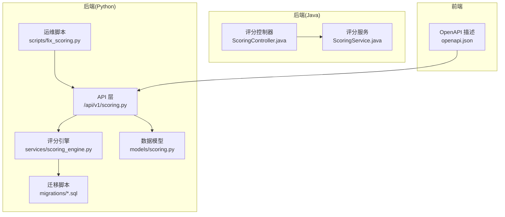
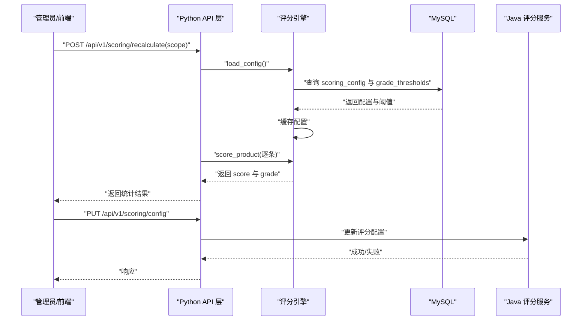
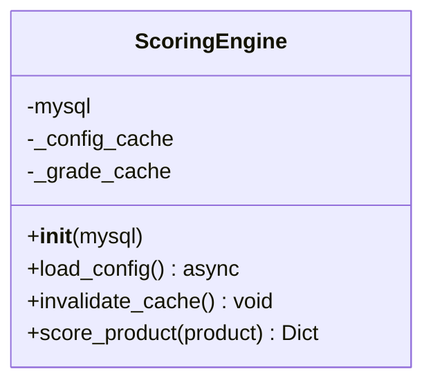
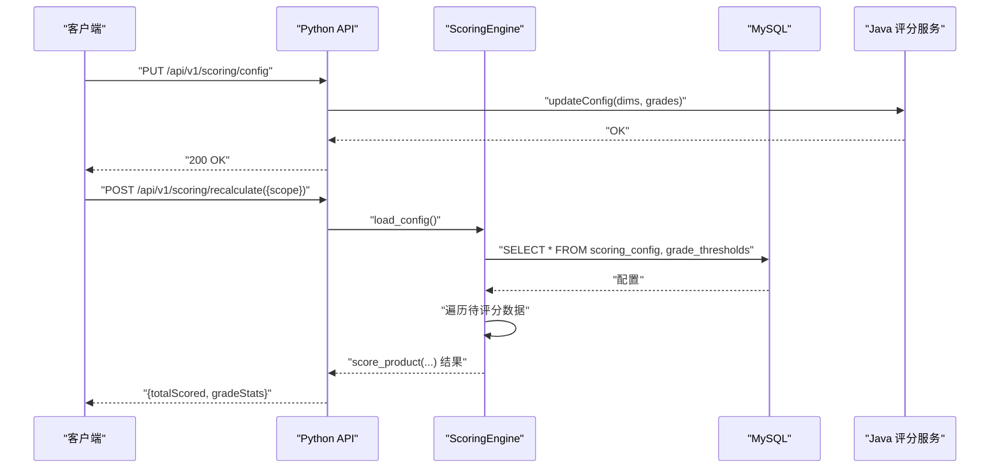
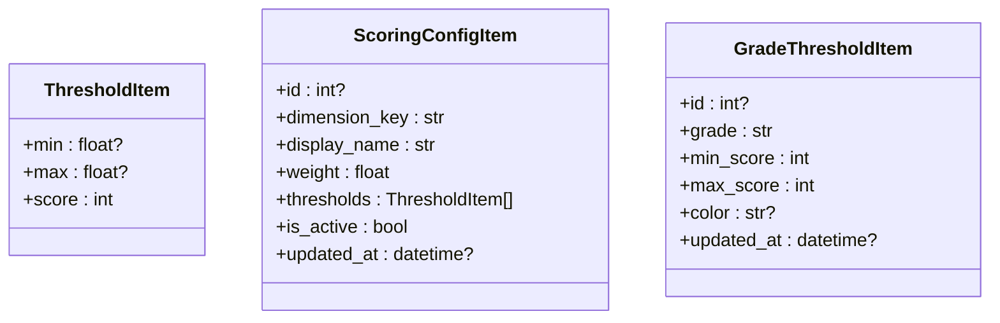
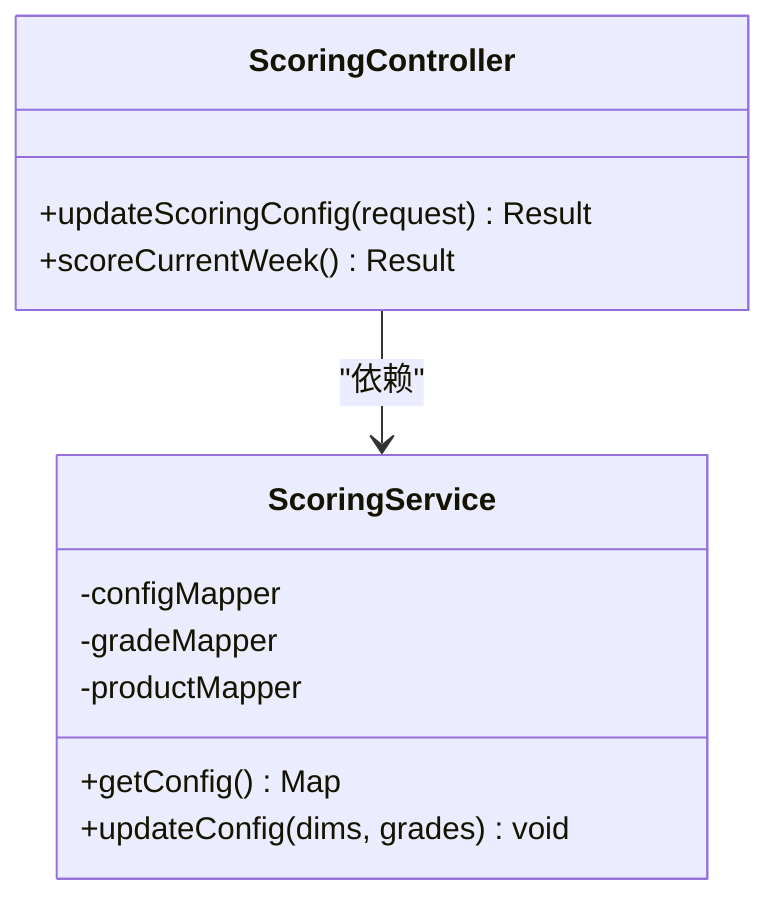
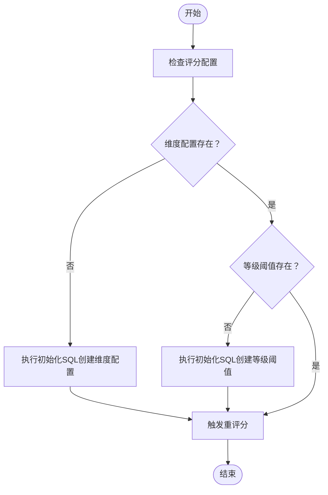
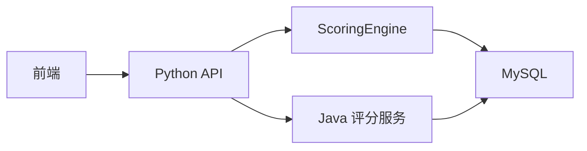

# 评分引擎系统

<cite>
**本文引用的文件**
- [scoring_engine.py](file://backend/app/services/scoring_engine.py)
- [scoring.py](file://backend/app/api/v1/scoring.py)
- [scoring.py](file://backend/app/models/scoring.py)
- [init_scoring_system.sql](file://backend/migrations/init_scoring_system.sql)
- [create_scoring_tables.sql](file://backend/migrations/create_scoring_tables.sql)
- [fix_scoring.py](file://backend/scripts/fix_scoring.py)
- [ScoringService.java](file://java-backend/sjzm-product/src/main/java/com/sjzm/product/service/ScoringService.java)
- [ScoringController.java](file://java-backend/sjzm-product/src/main/java/com/sjzm/product/controller/ScoringController.java)
- [openapi.json](file://frontend/openapi.json)
</cite>

## 目录
1. [简介](#简介)
2. [项目结构](#项目结构)
3. [核心组件](#核心组件)
4. [架构总览](#架构总览)
5. [详细组件分析](#详细组件分析)
6. [依赖关系分析](#依赖关系分析)
7. [性能考虑](#性能考虑)
8. [故障排除指南](#故障排除指南)
9. [结论](#结论)
10. [附录](#附录)

## 简介
本技术文档面向系统管理员与开发者，全面阐述评分引擎系统的设计原理、配置管理、数据流、扩展接口与维护方法。系统支持多维度评分、权重分配、等级阈值与动态调整，并提供批量评分、统计与修复工具，确保评分一致性与可维护性。

## 项目结构
评分引擎相关代码主要分布在以下位置：
- 后端Python服务：评分引擎实现、API接口、模型定义与迁移脚本
- Java后端：评分配置的持久化与更新
- 前端：OpenAPI描述评分相关接口
- 运维脚本：评分系统修复与触发工具

**图表来源**
- [scoring.py:43-213](file://backend/app/api/v1/scoring.py#L43-L213)
- [scoring_engine.py:1-42](file://backend/app/services/scoring_engine.py#L1-L42)
- [scoring.py:1-32](file://backend/app/models/scoring.py#L1-L32)
- [init_scoring_system.sql:33-46](file://backend/migrations/init_scoring_system.sql#L33-L46)
- [fix_scoring.py:45-159](file://backend/scripts/fix_scoring.py#L45-L159)
- [ScoringService.java:1-38](file://java-backend/sjzm-product/src/main/java/com/sjzm/product/service/ScoringService.java#L1-L38)
- [ScoringController.java:37-67](file://java-backend/sjzm-product/src/main/java/com/sjzm/product/controller/ScoringController.java#L37-L67)
- [openapi.json:13299-13439](file://frontend/openapi.json#L13299-L13439)

**章节来源**
- [scoring.py:43-213](file://backend/app/api/v1/scoring.py#L43-L213)
- [scoring_engine.py:1-42](file://backend/app/services/scoring_engine.py#L1-L42)
- [scoring.py:1-32](file://backend/app/models/scoring.py#L1-L32)
- [init_scoring_system.sql:33-46](file://backend/migrations/init_scoring_system.sql#L33-L46)
- [fix_scoring.py:45-159](file://backend/scripts/fix_scoring.py#L45-L159)
- [ScoringService.java:1-38](file://java-backend/sjzm-product/src/main/java/com/sjzm/product/service/ScoringService.java#L1-L38)
- [ScoringController.java:37-67](file://java-backend/sjzm-product/src/main/java/com/sjzm/product/controller/ScoringController.java#L37-L67)
- [openapi.json:13299-13439](file://frontend/openapi.json#L13299-L13439)

## 核心组件
- 评分引擎（Python）：负责加载配置、缓存维度与等级阈值、计算单个商品评分与等级
- API层（Python）：提供评分配置查询、批量重评分、本周评分、等级统计等接口
- 数据模型（Python）：定义评分维度与等级阈值的Pydantic模型
- Java评分服务：提供配置读取与更新、批量评分等能力
- 运维脚本：检查配置、触发重评分、统计评分状态
- 前端OpenAPI：暴露评分相关REST接口

**章节来源**
- [scoring_engine.py:8-37](file://backend/app/services/scoring_engine.py#L8-L37)
- [scoring.py:43-213](file://backend/app/api/v1/scoring.py#L43-L213)
- [scoring.py:6-32](file://backend/app/models/scoring.py#L6-L32)
- [ScoringService.java:33-67](file://java-backend/sjzm-product/src/main/java/com/sjzm/product/service/ScoringService.java#L33-L67)
- [fix_scoring.py:45-159](file://backend/scripts/fix_scoring.py#L45-L159)
- [openapi.json:13299-13439](file://frontend/openapi.json#L13299-L13439)

## 架构总览
评分引擎采用“配置驱动 + 缓存 + 批量计算”的架构：
- 配置来源：MySQL中scoring_config与grade_thresholds两张表
- 引擎侧缓存：维度与等级阈值在内存缓存，避免重复查询
- 计算流程：按维度加权求和，映射到等级区间得到最终等级
- 接口层：提供查询配置、更新配置、批量重评分、本周评分、等级统计
- Java后端：补充配置更新与批量评分能力

**图表来源**
- [scoring.py:160-193](file://backend/app/api/v1/scoring.py#L160-L193)
- [scoring_engine.py:20-37](file://backend/app/services/scoring_engine.py#L20-L37)
- [ScoringService.java:33-67](file://java-backend/sjzm-product/src/main/java/com/sjzm/product/service/ScoringService.java#L33-L67)

## 详细组件分析

### 评分引擎（Python）
- 职责：加载并缓存评分配置；对单个商品计算score与grade
- 关键点：
  - 配置加载：从scoring_config与grade_thresholds读取维度与等级阈值
  - 缓存失效：提供invalidate_cache以支持动态调整后的重新加载
  - 计算入口：score_product(product)返回包含score与grade的结果

**图表来源**
- [scoring_engine.py:8-37](file://backend/app/services/scoring_engine.py#L8-L37)

**章节来源**
- [scoring_engine.py:8-37](file://backend/app/services/scoring_engine.py#L8-L37)

### API层（Python）
- 配置查询：GET /api/v1/scoring/config，返回维度列表与等级阈值列表
- 配置更新：PUT /api/v1/scoring/config，接收维度与等级阈值数组，调用Java服务更新
- 批量重评分：POST /api/v1/scoring/recalculate，按scope触发重评分
- 本周评分：POST /api/v1/scoring/score-current-week，对本周未评分数据评分
- 等级统计：GET /api/v1/scoring/grade-stats，按范围统计等级分布

**图表来源**
- [scoring.py:43-77](file://backend/app/api/v1/scoring.py#L43-L77)
- [scoring.py:160-193](file://backend/app/api/v1/scoring.py#L160-L193)
- [ScoringController.java:37-67](file://java-backend/sjzm-product/src/main/java/com/sjzm/product/controller/ScoringController.java#L37-L67)

**章节来源**
- [scoring.py:43-213](file://backend/app/api/v1/scoring.py#L43-L213)

### 数据模型（Python）
- 维度配置项：包含维度键、显示名、权重、阈值数组、启用状态与更新时间
- 等级阈值项：包含等级（S/A/B/C/D）、最低分、最高分与颜色
- 阈值项：包含最小值、最大值与对应分数

**图表来源**
- [scoring.py:6-32](file://backend/app/models/scoring.py#L6-L32)

**章节来源**
- [scoring.py:6-32](file://backend/app/models/scoring.py#L6-L32)

### Java评分服务与控制器
- ScoringService：读取评分配置与等级阈值，支持更新配置
- ScoringController：接收前端请求，转换为后端实体，调用服务更新配置与触发评分

**图表来源**
- [ScoringService.java:33-67](file://java-backend/sjzm-product/src/main/java/com/sjzm/product/service/ScoringService.java#L33-L67)
- [ScoringController.java:37-67](file://java-backend/sjzm-product/src/main/java/com/sjzm/product/controller/ScoringController.java#L37-L67)

**章节来源**
- [ScoringService.java:33-67](file://java-backend/sjzm-product/src/main/java/com/sjzm/product/service/ScoringService.java#L33-L67)
- [ScoringController.java:37-67](file://java-backend/sjzm-product/src/main/java/com/sjzm/product/controller/ScoringController.java#L37-L67)

### 配置管理与迁移
- 初始化SQL：创建评分配置与等级阈值表，并插入默认等级阈值（S/A/B/C/D）
- 迁移脚本：提供评分系统初始化与修复工具，支持检查配置与触发重评分

**图表来源**
- [init_scoring_system.sql:33-46](file://backend/migrations/init_scoring_system.sql#L33-L46)
- [fix_scoring.py:136-159](file://backend/scripts/fix_scoring.py#L136-L159)

**章节来源**
- [init_scoring_system.sql:33-46](file://backend/migrations/init_scoring_system.sql#L33-L46)
- [create_scoring_tables.sql](file://backend/migrations/create_scoring_tables.sql)
- [fix_scoring.py:136-159](file://backend/scripts/fix_scoring.py#L136-L159)

### 批量评分与动态调整
- 动态调整：通过PUT更新评分配置，随后invalidate_cache使引擎在下一次计算时重新加载
- 批量评分：支持按范围（如全部、本周）触发重评分，返回评分总数与等级统计
- 本周评分：自动更新周标签并评分本周未评分数据

**章节来源**
- [scoring_engine.py:33-37](file://backend/app/services/scoring_engine.py#L33-L37)
- [scoring.py:160-193](file://backend/app/api/v1/scoring.py#L160-L193)
- [scoring.py:195-213](file://backend/app/api/v1/scoring.py#L195-L213)

## 依赖关系分析
- API层依赖评分引擎与数据库
- 评分引擎依赖MySQL读取配置
- Java后端提供配置更新与批量评分能力
- 前端通过OpenAPI调用后端接口

**图表来源**
- [scoring.py:43-213](file://backend/app/api/v1/scoring.py#L43-L213)
- [scoring_engine.py:15-37](file://backend/app/services/scoring_engine.py#L15-L37)
- [ScoringService.java:28-31](file://java-backend/sjzm-product/src/main/java/com/sjzm/product/service/ScoringService.java#L28-L31)

**章节来源**
- [scoring.py:43-213](file://backend/app/api/v1/scoring.py#L43-L213)
- [scoring_engine.py:15-37](file://backend/app/services/scoring_engine.py#L15-L37)
- [ScoringService.java:28-31](file://java-backend/sjzm-product/src/main/java/com/sjzm/product/service/ScoringService.java#L28-L31)

## 性能考虑
- 配置缓存：评分引擎对维度与等级阈值进行内存缓存，减少数据库查询开销
- 批量处理：API层提供批量重评分接口，降低频繁请求带来的压力
- 分页与范围：支持按范围（如本周）评分，避免全量扫描
- 数据库索引：建议在评分相关字段上建立合适索引以提升查询性能

## 故障排除指南
- 配置检查：使用修复脚本检查维度与等级阈值是否存在，必要时执行初始化SQL
- 重评分触发：通过修复脚本或API触发重评分，观察返回的统计信息
- 日志与异常：关注API层的HTTP异常与日志输出，定位具体错误原因
- 前端接口：确认OpenAPI中评分相关接口路径与参数正确

**章节来源**
- [fix_scoring.py:136-159](file://backend/scripts/fix_scoring.py#L136-L159)
- [scoring.py:188-193](file://backend/app/api/v1/scoring.py#L188-L193)
- [openapi.json:13299-13439](file://frontend/openapi.json#L13299-L13439)

## 结论
评分引擎系统通过清晰的配置驱动与缓存机制，实现了灵活的多维度评分与等级划分。配合Java后端的配置更新与批量评分能力，以及前端OpenAPI与运维脚本，满足了管理员与开发者在配置维护与批量处理方面的需求。建议在生产环境中结合索引优化与监控告警，持续保障评分一致性与系统稳定性。

## 附录
- 接口概览（来自OpenAPI）
  - GET /api/v1/scoring/config：获取评分维度与等级阈值
  - PUT /api/v1/scoring/config：更新评分配置
  - POST /api/v1/scoring/recalculate：批量重评分
  - POST /api/v1/scoring/score-current-week：评分本周数据
  - GET /api/v1/scoring/grade-stats：等级统计

**章节来源**
- [openapi.json:13299-13439](file://frontend/openapi.json#L13299-L13439)