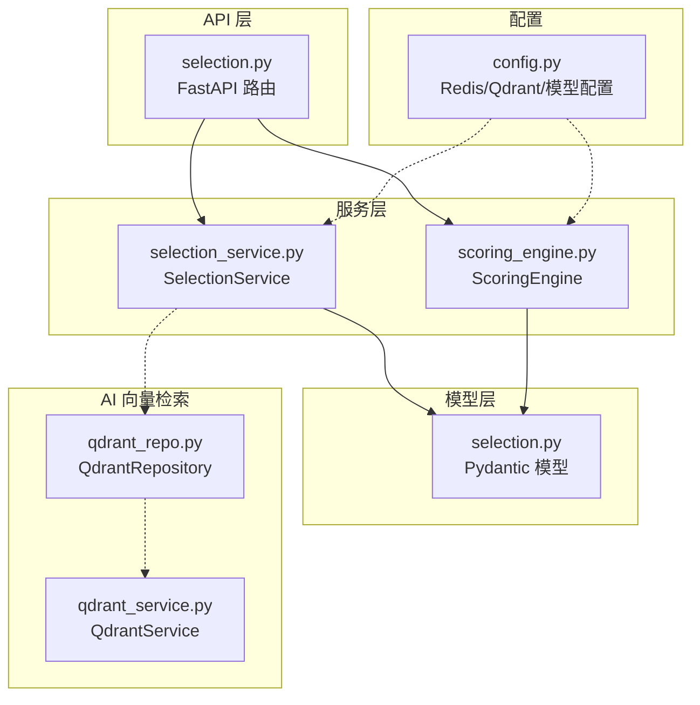
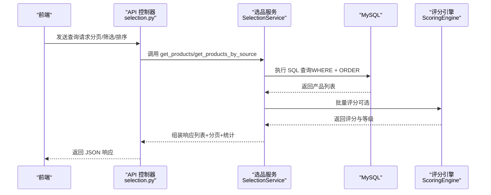
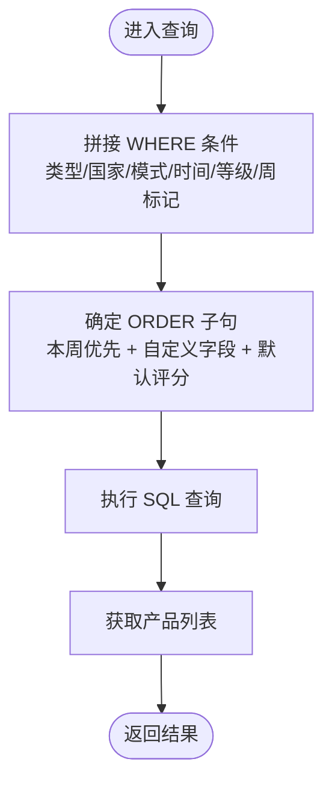
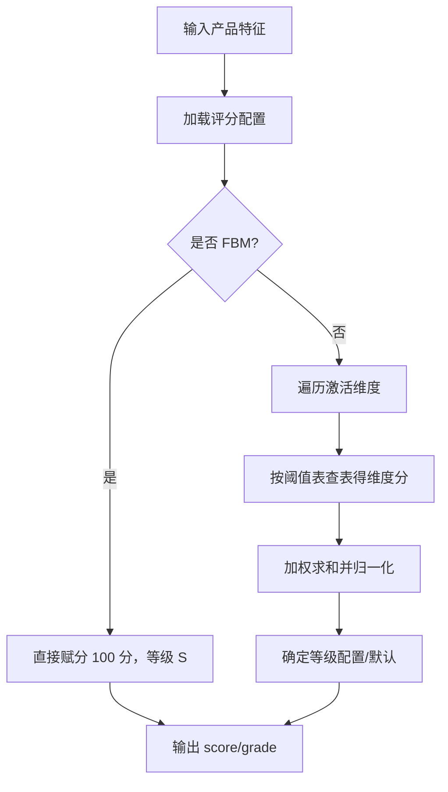
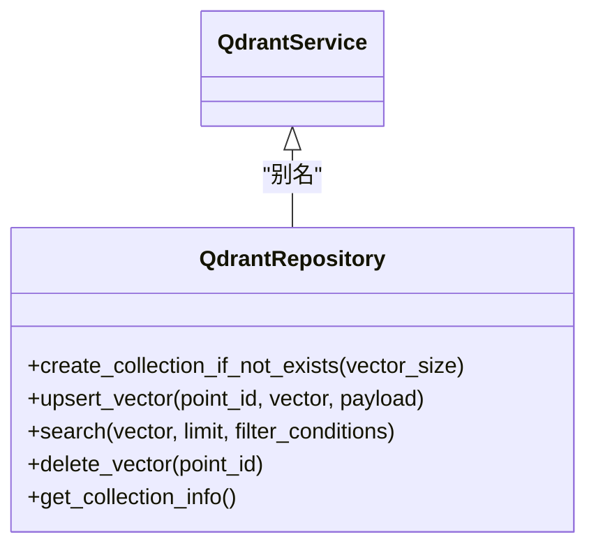
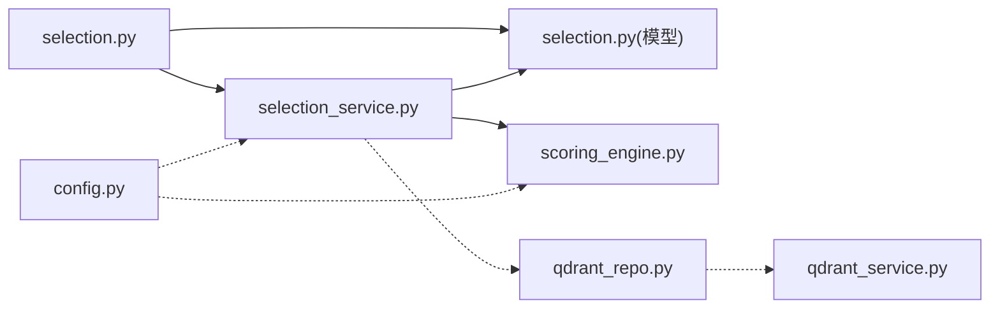

# 选品算法逻辑

<cite>
**本文引用的文件**
- [selection_service.py](file://backend/app/services/selection_service.py)
- [selection.py](file://backend/app/api/v1/selection.py)
- [selection.py](file://backend/app/models/selection.py)
- [scoring_engine.py](file://backend/app/services/scoring_engine.py)
- [AI选品×系统深度结合方案.md](file://docs/ai结合分析/02-系统结合/AI选品×系统深度结合方案.md)
- [Python-AI服务创建计划.md](file://docs/Python-AI服务创建计划.md)
- [qdrant_repo.py](file://python-ai/app/repositories/qdrant_repo.py)
- [qdrant_service.py](file://python-ai/app/services/qdrant_service.py)
- [config.py](file://backend/config.py)
</cite>

## 目录
1. [引言](#引言)
2. [项目结构](#项目结构)
3. [核心组件](#核心组件)
4. [架构概览](#架构概览)
5. [详细组件分析](#详细组件分析)
6. [依赖分析](#依赖分析)
7. [性能考虑](#性能考虑)
8. [故障排查指南](#故障排查指南)
9. [结论](#结论)
10. [附录](#附录)

## 引言
本技术文档围绕“选品算法逻辑”展开，系统阐述后端选品服务的数据流、评分与排序机制、参数配置与权重设定、以及与AI向量检索系统的集成方案。文档同时给出性能优化、缓存与并发处理建议，并提供调优指南、参数校验与异常处理策略，帮助开发者进行扩展与定制。

## 项目结构
与选品算法直接相关的后端模块主要分布在以下位置：
- API 层：提供选品数据的增删改查、列表查询、统计等接口
- 服务层：封装业务逻辑，负责数据筛选、排序、评分与持久化
- 模型层：定义输入输出数据结构与校验规则
- 评分引擎：基于配置动态计算产品评分与等级
- AI 向量检索：通过 Qdrant 提供向量相似度检索能力

图表来源
- [selection.py:1-800](file://backend/app/api/v1/selection.py#L1-L800)
- [selection_service.py:1-800](file://backend/app/services/selection_service.py#L1-L800)
- [selection.py:1-184](file://backend/app/models/selection.py#L1-L184)
- [scoring_engine.py:1-229](file://backend/app/services/scoring_engine.py#L1-L229)
- [qdrant_repo.py:1-221](file://python-ai/app/repositories/qdrant_repo.py#L1-L221)
- [qdrant_service.py:1-3](file://python-ai/app/services/qdrant_service.py#L1-L3)
- [config.py:41-62](file://backend/config.py#L41-L62)

章节来源
- [selection.py:1-800](file://backend/app/api/v1/selection.py#L1-L800)
- [selection_service.py:1-800](file://backend/app/services/selection_service.py#L1-L800)
- [selection.py:1-184](file://backend/app/models/selection.py#L1-L184)
- [scoring_engine.py:1-229](file://backend/app/services/scoring_engine.py#L1-L229)
- [qdrant_repo.py:1-221](file://python-ai/app/repositories/qdrant_repo.py#L1-L221)
- [qdrant_service.py:1-3](file://python-ai/app/services/qdrant_service.py#L1-L3)
- [config.py:41-62](file://backend/config.py#L41-L62)

## 核心组件
- 选品服务（SelectionService）：负责产品 CRUD、列表查询与筛选、排序、软删除与回收站迁移、批量导入等
- 评分引擎（ScoringEngine）：基于配置动态计算产品评分与等级，支持缓存与批量评分
- API 控制器（selection.py）：提供 REST 接口，接收前端参数并调用服务层
- 模型定义（selection.py）：统一输入输出结构与字段校验
- AI 向量检索（QdrantRepository/QdrantService）：提供向量集合管理、相似度检索、向量写入与删除
- 配置中心（config.py）：提供 Redis、Qdrant、模型缓存等运行时配置

章节来源
- [selection_service.py:18-800](file://backend/app/services/selection_service.py#L18-L800)
- [scoring_engine.py:8-229](file://backend/app/services/scoring_engine.py#L8-L229)
- [selection.py:1-800](file://backend/app/api/v1/selection.py#L1-L800)
- [selection.py:1-184](file://backend/app/models/selection.py#L1-L184)
- [qdrant_repo.py:1-221](file://python-ai/app/repositories/qdrant_repo.py#L1-L221)
- [qdrant_service.py:1-3](file://python-ai/app/services/qdrant_service.py#L1-L3)
- [config.py:41-62](file://backend/config.py#L41-L62)

## 架构概览
选品算法的总体流程如下：
- 数据入口：API 接收前端查询参数，构造查询条件
- 数据筛选：按产品类型（new/reference）、国家、数据筛选模式、上架时间、等级、周标记等条件过滤
- 排序策略：默认按“本周数据优先 + 评分降序 + 创建时间降序”，支持前端自定义排序字段
- 评分计算：ScoringEngine 基于配置动态计算 score 与 grade
- 结果返回：返回带评分与等级的产品列表，支持分页与统计

图表来源
- [selection.py:94-730](file://backend/app/api/v1/selection.py#L94-L730)
- [selection_service.py:118-296](file://backend/app/services/selection_service.py#L118-L296)
- [scoring_engine.py:176-198](file://backend/app/services/scoring_engine.py#L176-L198)

## 详细组件分析

### 1) 数据预处理与筛选
- 产品类型区分：支持 new（新品榜）与 reference（竞品店铺），可通过 source 关键词或 product_type 参数筛选
- 国家与数据筛选模式：支持按国家（如英国/德国）与数据筛选模式（模式一/模式二）过滤
- 时间范围与等级：支持 listing_date_start/listing_date_end 与 grade 多选（逗号分隔）
- 周标记与本周优先：is_current 字段用于区分本周与往期，排序默认将本周置前
- 字段映射与排序：前端字段名映射到数据库字段，支持排序方向校验与默认排序策略

图表来源
- [selection_service.py:135-230](file://backend/app/services/selection_service.py#L135-L230)
- [selection_service.py:321-420](file://backend/app/services/selection_service.py#L321-L420)

章节来源
- [selection_service.py:118-296](file://backend/app/services/selection_service.py#L118-L296)
- [selection_service.py:302-487](file://backend/app/services/selection_service.py#L302-L487)
- [selection.py:114-137](file://backend/app/models/selection.py#L114-L137)

### 2) 特征提取与评分机制
- 特征来源：delivery_method、listing_date、sales_volume、main_category_rank、price 等
- 特征处理：
  - listing_age：从 listing_date 计算至今的天数
  - 销量与价格：直接取值并转为数值
  - BSR 排名：取 main_category_rank
- 评分计算：
  - 从数据库加载维度配置（维度键、显示名、权重、阈值、是否启用）
  - 对每个激活维度，按阈值表查表得到维度分，加权求和并归一化到 0-100
  - FBM 配送方式特殊处理：直接给 S 级 100 分
- 等级划分：从 grade_thresholds 表按分数区间映射，若未命中则使用默认阈值

图表来源
- [scoring_engine.py:38-95](file://backend/app/services/scoring_engine.py#L38-L95)
- [scoring_engine.py:97-175](file://backend/app/services/scoring_engine.py#L97-L175)

章节来源
- [scoring_engine.py:8-229](file://backend/app/services/scoring_engine.py#L8-L229)
- [selection.py:1-184](file://backend/app/models/selection.py#L1-L184)

### 3) 相似性计算与排序机制
- 当前后端实现：基于 SQL 的筛选与排序，未见显式的向量相似度计算逻辑
- AI 向量检索集成：通过 QdrantRepository/QdrantService 提供向量集合管理与相似度检索能力，可用于后续扩展“基于向量的相似性计算”
- 排序字段：支持按销量、价格、上架时间、创建时间、评分等排序；默认“本周优先 + 评分降序”

图表来源
- [qdrant_repo.py:1-221](file://python-ai/app/repositories/qdrant_repo.py#L1-L221)
- [qdrant_service.py:1-3](file://python-ai/app/services/qdrant_service.py#L1-L3)

章节来源
- [qdrant_repo.py:1-221](file://python-ai/app/repositories/qdrant_repo.py#L1-L221)
- [qdrant_service.py:1-3](file://python-ai/app/services/qdrant_service.py#L1-L3)
- [selection_service.py:213-229](file://backend/app/services/selection_service.py#L213-L229)

### 4) 选品规则构建与参数配置
- 规则维度（来自文档）：
  - 快速起量：listing_days < 60 且 bsr < 2000
  - 低配高卖：ebc = 0 且 video = 0 且 ratings < 50 且 units > 50
  - FBM 可行：fulfillment = 'FBM' 且 units > 30
  - 高溢价：price > (品类均价 × 1.4) 且 units > 20
  - 评分洼地：rating < 4.0 且 units > 30
  - 无品牌：brand 为空或未品牌
- 排序组合：final_score = product_score × 0.6 + category_score × 0.4，取 Top 30
- 记录表：ai_recommend_log（不含 selection_products），支持 status 与 recommend_batch 等字段

章节来源
- [AI选品×系统深度结合方案.md:305-341](file://docs/ai结合分析/02-系统结合/AI选品×系统深度结合方案.md#L305-L341)
- [AI选品×系统深度结合方案.md:538-557](file://docs/ai结合分析/02-系统结合/AI选品×系统深度结合方案.md#L538-L557)

### 5) 参数配置、权重设置与阈值调整
- 维度权重与阈值：从 scoring_config 与 grade_thresholds 表加载，支持缓存与失效
- 配置变更：invalidate_cache 可主动刷新缓存，保证配置热更新
- 默认阈值：若未命中配置表，则采用默认等级区间

章节来源
- [scoring_engine.py:20-36](file://backend/app/services/scoring_engine.py#L20-L36)
- [scoring_engine.py:157-175](file://backend/app/services/scoring_engine.py#L157-L175)

### 6) 国家地区过滤与数据筛选模式
- 国家过滤：country 字段支持英国/德国等筛选
- 数据筛选模式：data_filter_mode 支持模式一/模式二，用于区分数据来源与清洗策略
- 产品类型：product_type 支持 new/reference/zheng，分别对应新品榜、竞品店铺与整店

章节来源
- [selection.py:33-34](file://backend/app/models/selection.py#L33-L34)
- [selection.py](file://backend/app/models/selection.py#L47)
- [selection_service.py:162-172](file://backend/app/services/selection_service.py#L162-L172)

### 7) 并发处理与事务保障
- 事务：软删除采用事务，先写入回收站再删除原表，失败自动回滚
- 并发安全：API 层依赖注入服务实例，服务层通过 MySQL 仓库执行 SQL，遵循单请求单连接原则

章节来源
- [selection_service.py:717-780](file://backend/app/services/selection_service.py#L717-L780)

## 依赖分析
- API 依赖服务层：selection.py 通过依赖注入获取 SelectionService 实例
- 服务层依赖模型层：统一输入输出结构与字段校验
- 评分引擎独立：ScoringEngine 仅依赖 MySQL 仓库，便于复用与测试
- AI 向量检索：QdrantRepository/QdrantService 与后端服务解耦，便于扩展

图表来源
- [selection.py:37-51](file://backend/app/api/v1/selection.py#L37-L51)
- [selection_service.py:25-34](file://backend/app/services/selection_service.py#L25-L34)
- [scoring_engine.py:15-18](file://backend/app/services/scoring_engine.py#L15-L18)
- [qdrant_repo.py:1-221](file://python-ai/app/repositories/qdrant_repo.py#L1-L221)
- [qdrant_service.py:1-3](file://python-ai/app/services/qdrant_service.py#L1-L3)
- [config.py:41-62](file://backend/config.py#L41-L62)

章节来源
- [selection.py:37-51](file://backend/app/api/v1/selection.py#L37-L51)
- [selection_service.py:25-34](file://backend/app/services/selection_service.py#L25-L34)
- [scoring_engine.py:15-18](file://backend/app/services/scoring_engine.py#L15-L18)
- [qdrant_repo.py:1-221](file://python-ai/app/repositories/qdrant_repo.py#L1-L221)
- [qdrant_service.py:1-3](file://python-ai/app/services/qdrant_service.py#L1-L3)
- [config.py:41-62](file://backend/config.py#L41-L62)

## 性能考虑
- 查询优化
  - 使用索引：对常用筛选字段（如 country、data_filter_mode、listing_date、grade、is_current）建立合适索引
  - 分页与排序：LIMIT/OFFSET 已实现，建议结合复合索引减少排序成本
- 缓存策略
  - 评分配置缓存：ScoringEngine 已内置配置与等级缓存，建议在配置变更时主动失效
  - Redis 缓存：config.py 中提供 Redis 配置项，可用于缓存热点查询结果或会话数据
- 并发与事务
  - 事务：软删除使用事务保障一致性
  - 批量导入：API 层限制批量删除数量，避免超大事务
- AI 向量检索
  - Qdrant 集合管理：create_collection_if_not_exists 与 upsert_vector 支持批量写入
  - 搜索限制：search 支持 limit 控制返回数量，避免过量数据传输

章节来源
- [scoring_engine.py:20-36](file://backend/app/services/scoring_engine.py#L20-L36)
- [selection_service.py:333-346](file://backend/app/services/selection_service.py#L333-L346)
- [config.py:55-58](file://backend/config.py#L55-L58)
- [qdrant_repo.py:183-221](file://python-ai/app/repositories/qdrant_repo.py#L183-L221)

## 故障排查指南
- 常见异常
  - 创建/更新失败：捕获异常并记录日志，返回统一 HTTP 错误
  - 产品不存在：更新时抛出 ValueError，删除时返回 False 并记录警告
  - 批量删除上限：超过限制时返回 400 错误
- 日志与监控
  - API 层与服务层均记录详细错误日志，便于定位问题
  - SQL 调试：服务层记录实际执行的 SQL，有助于排查筛选条件与排序问题
- 参数校验
  - Pydantic 模型对输入字段进行长度、范围与格式校验
  - 排序方向强制校验（ASC/DESC）

章节来源
- [selection.py:89-91](file://backend/app/api/v1/selection.py#L89-L91)
- [selection_service.py:114-116](file://backend/app/services/selection_service.py#L114-L116)
- [selection_service.py:574-687](file://backend/app/services/selection_service.py#L574-L687)
- [selection_service.py:714-715](file://backend/app/services/selection_service.py#L714-L715)
- [selection.py:1-184](file://backend/app/models/selection.py#L1-L184)

## 结论
本选品算法以“可配置评分 + 多维筛选 + 默认优先排序”为核心，具备良好的扩展性与可维护性。评分引擎通过配置驱动实现灵活调整；API 与服务层清晰分离职责；AI 向量检索能力为后续引入“基于向量的相似性计算”预留了接口。建议在生产环境中完善索引、缓存与监控体系，并结合业务需求逐步引入 AI 推荐与相似性排序。

## 附录

### A. 算法调优指南
- 评分维度调优
  - 动态调整维度权重与阈值，观察对 Top 候选的影响
  - 配置变更后调用 invalidate_cache 刷新缓存
- 筛选参数调优
  - 根据国家/模式/时间窗口调整筛选条件，平衡召回与精度
  - 周标记 is_current 与本周优先策略影响排序权重
- 排序字段与方向
  - 根据业务目标调整默认排序字段与方向，必要时允许前端自定义

章节来源
- [scoring_engine.py:20-36](file://backend/app/services/scoring_engine.py#L20-L36)
- [selection_service.py:213-229](file://backend/app/services/selection_service.py#L213-L229)
- [selection.py:133-134](file://backend/app/models/selection.py#L133-L134)

### B. 参数验证与异常处理清单
- 输入参数
  - ASIN/标题长度与格式、价格非负、销量非负、排序方向枚举校验
- 运行时异常
  - 数据库连接异常、SQL 执行异常、事务回滚、批量上限限制
- 建议
  - 统一异常包装与日志记录，便于前端展示与定位

章节来源
- [selection.py:12-34](file://backend/app/models/selection.py#L12-L34)
- [selection.py:333-346](file://backend/app/api/v1/selection.py#L333-L346)
- [selection_service.py:114-116](file://backend/app/services/selection_service.py#L114-L116)

### C. AI 向量检索扩展建议
- 向量入库
  - 使用 QdrantRepository.upsert_vector 写入产品向量与元数据
- 相似度检索
  - 使用 QdrantRepository.search 执行向量相似度检索，限制返回数量
- 集合管理
  - create_collection_if_not_exists 确保集合存在；定期清理无效向量

章节来源
- [qdrant_repo.py:194-208](file://python-ai/app/repositories/qdrant_repo.py#L194-L208)
- [Python-AI服务创建计划.md:163-221](file://docs/Python-AI服务创建计划.md#L163-L221)