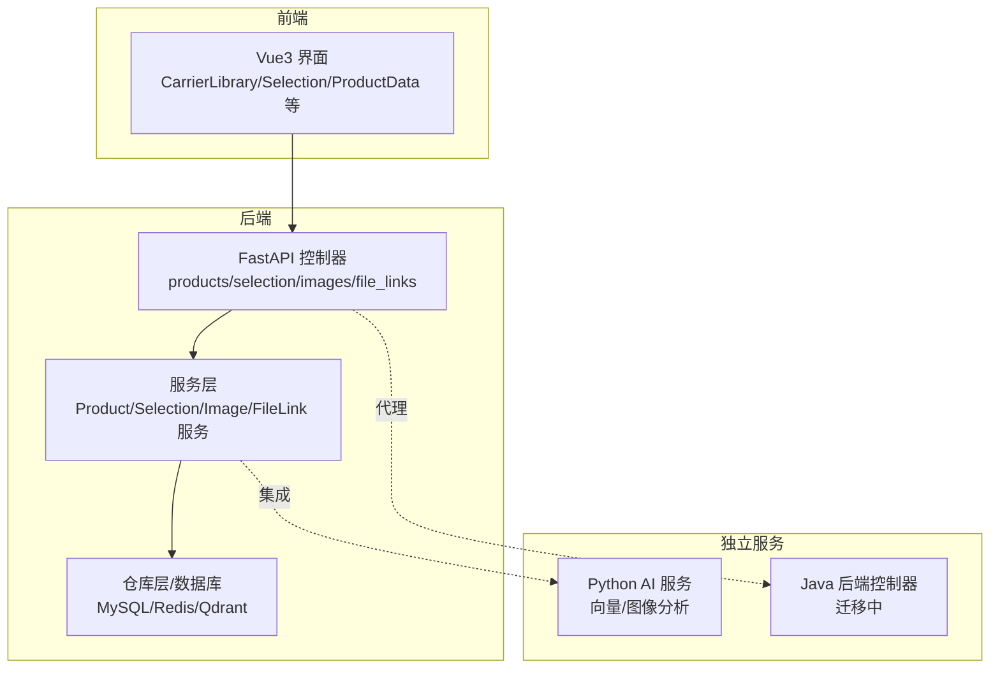
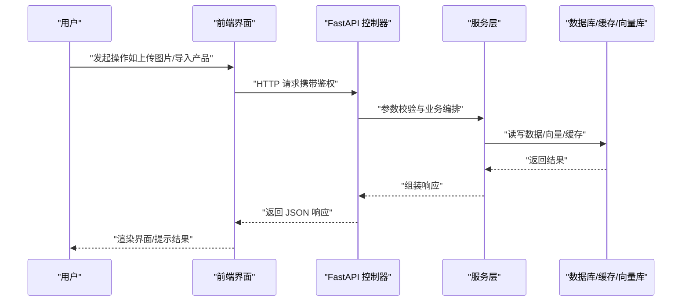
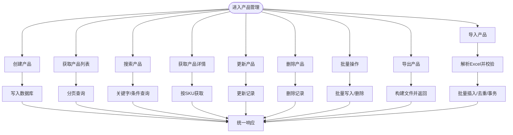
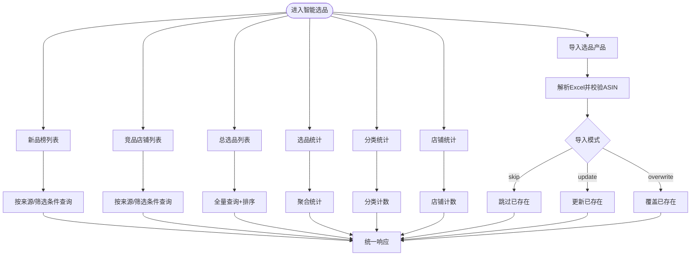
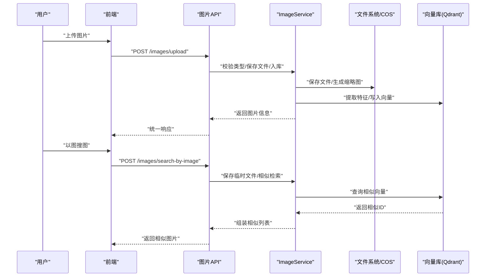
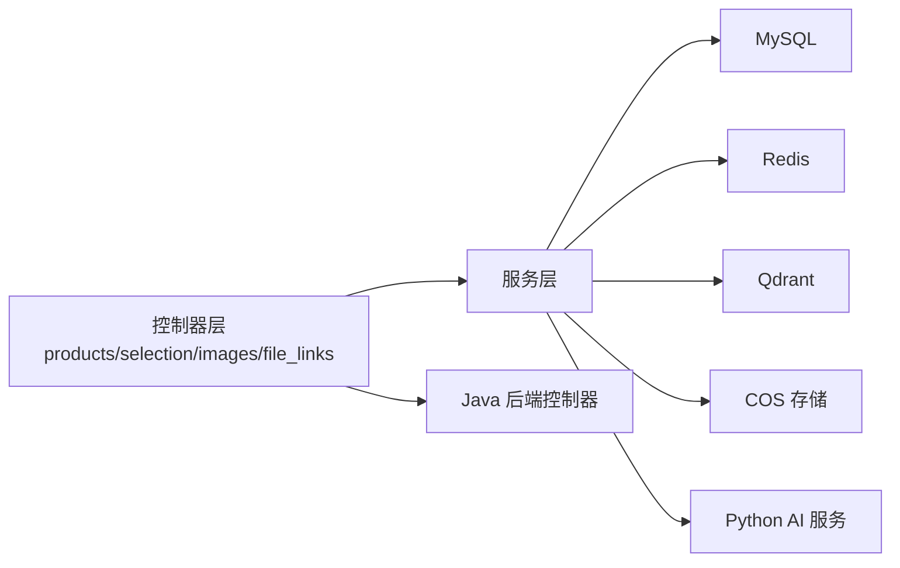

# 核心功能模块

<cite>
**本文引用的文件**
- [backend/app/api/v1/products.py](file://backend/app/api/v1/products.py)
- [backend/app/api/v1/selection.py](file://backend/app/api/v1/selection.py)
- [backend/app/api/v1/images.py](file://backend/app/api/v1/images.py)
- [backend/app/api/v1/file_links.py](file://backend/app/api/v1/file_links.py)
- [backend/app/services/image_analysis_service.py](file://backend/app/services/image_analysis_service.py)
- [backend/migrations/init_database_dev.sql](file://backend/migrations/init_database_dev.sql)
- [docs/ai结合分析/02-系统结合/AI选品×系统深度结合方案.md](file://docs/ai结合分析/02-系统结合/AI选品×系统深度结合方案.md)
- [frontend/src/views/CarrierLibrary/index.vue](file://frontend/src/views/CarrierLibrary/index.vue)
- [frontend/src/api/downloadTask.ts](file://frontend/src/api/downloadTask.ts)
- [frontend/openapi.json](file://frontend/openapi.json)
</cite>

## 目录
1. [引言](#引言)
2. [项目结构](#项目结构)
3. [核心组件](#核心组件)
4. [架构总览](#架构总览)
5. [详细组件分析](#详细组件分析)
6. [依赖分析](#依赖分析)
7. [性能考量](#性能考量)
8. [故障排查指南](#故障排查指南)
9. [结论](#结论)
10. [附录](#附录)

## 引言
本文件面向产品经理、开发者与最终用户，系统梳理“思觉智贸”的核心功能模块，重点覆盖产品管理、智能选品、文件处理与图像处理四大板块。文档从架构、数据流、业务流程、API 接口、UI 操作到模块间依赖与集成方式进行全景式说明，并提供配置项、参数与返回值规范、使用示例与最佳实践，帮助各角色快速理解与高效使用。

## 项目结构
后端采用 FastAPI + MySQL/Redis/Qdrant 架构，提供 REST API；前端 Vue3 + TypeScript 提供可视化界面；另有独立 Python AI 服务与 Java 后端控制器（迁移中）。核心模块分布如下：
- 产品管理：提供产品 CRUD、导入导出、统计与分类统计
- 智能选品：提供选品产品管理、新品榜/竞品店铺/总选品列表、统计与导入
- 图像处理：提供图片上传、缩略图、相似检索、以图搜图、向量检索
- 文件处理：提供文件链接管理、上传、批量上传、状态检查与统计

图表来源
- [backend/app/api/v1/products.py:1-795](file://backend/app/api/v1/products.py#L1-L795)
- [backend/app/api/v1/selection.py:1-800](file://backend/app/api/v1/selection.py#L1-L800)
- [backend/app/api/v1/images.py:1-800](file://backend/app/api/v1/images.py#L1-L800)
- [backend/app/api/v1/file_links.py:1-340](file://backend/app/api/v1/file_links.py#L1-L340)

章节来源
- [backend/app/api/v1/products.py:1-795](file://backend/app/api/v1/products.py#L1-L795)
- [backend/app/api/v1/selection.py:1-800](file://backend/app/api/v1/selection.py#L1-L800)
- [backend/app/api/v1/images.py:1-800](file://backend/app/api/v1/images.py#L1-L800)
- [backend/app/api/v1/file_links.py:1-340](file://backend/app/api/v1/file_links.py#L1-L340)

## 核心组件
- 产品管理模块：提供产品创建、查询、更新、删除、批量操作、导入导出、统计与分类统计等能力，支持 SKU/名称/类型/分类等多维筛选与分页。
- 智能选品模块：提供选品产品管理（ASIN/标题/价格/图片/店铺/分类/标签/备注）、新品榜/竞品店铺/总选品列表、统计与导入（Excel），支持国家/筛选模式/上架日期/等级/是否本周等多维筛选。
- 图像处理模块：提供图片上传/批量上传、获取图片/文件/缩略图、相似检索/以图搜图、更新/删除、批量删除、统计与批量获取等能力，支持 COS 与本地文件双通道。
- 文件处理模块：提供文件链接创建/查询/更新/删除、批量删除、状态检查、分类获取、文件上传/批量上传、上传统计等能力，支持飞书/标准链接类型与资源库/提示词库分类。

章节来源
- [backend/app/api/v1/products.py:53-795](file://backend/app/api/v1/products.py#L53-L795)
- [backend/app/api/v1/selection.py:54-800](file://backend/app/api/v1/selection.py#L54-L800)
- [backend/app/api/v1/images.py:46-800](file://backend/app/api/v1/images.py#L46-L800)
- [backend/app/api/v1/file_links.py:28-340](file://backend/app/api/v1/file_links.py#L28-L340)

## 架构总览
系统采用前后端分离与多服务协同架构：
- 前端通过 API 调用后端控制器，控制器调用服务层，服务层访问数据库与外部向量/存储服务。
- 图像分析与向量检索由独立 Python AI 服务提供，后端服务通过客户端或任务队列集成。
- 部分控制器已迁移至 Java 后端，前端仍保留部分直连后端的实现，注意兼容与过渡策略。

图表来源
- [backend/app/api/v1/images.py:46-800](file://backend/app/api/v1/images.py#L46-L800)
- [backend/app/api/v1/products.py:53-795](file://backend/app/api/v1/products.py#L53-L795)

## 详细组件分析

### 产品管理模块
- 业务逻辑
  - 支持单产品创建、列表查询、关键字搜索、详情获取、更新、删除、批量删除、批量更新、导出（Excel/CSV）、导入（Excel）。
  - 提供产品统计与分类统计，支持 SKU/名称/类型/分类等多维筛选与分页。
- 用户界面
  - 前端提供产品管理页面，支持分页列表、搜索、批量操作、导入导出。
- API 接口
  - 创建产品、获取列表、搜索、获取详情、更新、删除、批量删除、批量更新、导出、导入等。
- 数据流
  - 前端提交请求 → 控制器参数校验 → 服务层执行业务 → 数据库存取 → 返回统一结构。

图表来源
- [backend/app/api/v1/products.py:53-795](file://backend/app/api/v1/products.py#L53-L795)

章节来源
- [backend/app/api/v1/products.py:53-795](file://backend/app/api/v1/products.py#L53-L795)

### 智能选品模块
- 业务逻辑
  - 选品产品管理（ASIN/标题/价格/图片/店铺/分类/标签/备注/类型/国家/筛选模式等）。
  - 提供新品榜、竞品店铺、总选品列表，支持多维筛选（国家/筛选模式/上架日期/等级/是否本周/排序）。
  - 支持清空、删除、批量删除、导入（Excel，支持 skip/update/overwrite 模式）。
  - 提供统计与分类统计、店铺统计。
- 用户界面
  - 前端 AllSelection 页面展示新品榜/竞品/总选品，支持筛选、排序、批量操作。
- API 接口
  - 选品产品 CRUD、列表查询、清空、删除、批量删除、导入、统计、分类统计、店铺统计等。
- 数据流
  - 前端提交请求 → 控制器参数校验 → 服务层执行业务 → 数据库存取 → 返回统一结构。

图表来源
- [backend/app/api/v1/selection.py:54-800](file://backend/app/api/v1/selection.py#L54-L800)

章节来源
- [backend/app/api/v1/selection.py:54-800](file://backend/app/api/v1/selection.py#L54-L800)

### 图像处理模块
- 业务逻辑
  - 图片上传/批量上传（校验类型、生成唯一文件名、保存到本地/上传到 COS）。
  - 获取图片信息、文件（原图/COS/本地转换 PNG）、缩略图（本地/COS/自动修复）。
  - 相似图片检索（基于向量）、以图搜图（上传文件进行相似检索）。
  - 更新/删除图片、批量删除、统计、批量获取。
- 用户界面
  - 前端提供图片管理页面，支持上传、查看、相似检索、批量操作。
- API 接口
  - 上传、批量上传、获取图片、获取文件、获取缩略图、相似检索、以图搜图、更新、删除、批量删除、统计、批量获取等。
- 数据流
  - 前端提交请求 → 控制器参数校验 → 服务层处理文件/向量 → 存储/向量库 → 返回统一结构。

图表来源
- [backend/app/api/v1/images.py:46-800](file://backend/app/api/v1/images.py#L46-L800)
- [backend/app/services/image_analysis_service.py:151-452](file://backend/app/services/image_analysis_service.py#L151-L452)

章节来源
- [backend/app/api/v1/images.py:46-800](file://backend/app/api/v1/images.py#L46-L800)
- [backend/app/services/image_analysis_service.py:151-452](file://backend/app/services/image_analysis_service.py#L151-L452)

### 文件处理模块
- 业务逻辑
  - 文件链接管理：创建/查询/更新/删除、批量删除、状态检查、分类获取。
  - 文件上传/批量上传：支持标题、库类型、描述、标签、分类等元数据。
  - 上传统计：提供上传统计信息。
- 用户界面
  - 前端提供文件链接管理页面，支持列表、搜索、上传、批量操作。
- API 接口
  - 创建/查询/更新/删除、批量删除、状态检查、分类获取、上传/批量上传、上传统计等。
- 数据流
  - 前端提交请求 → 控制器参数校验 → 服务层处理文件/元数据 → 存储 → 返回统一结构。

章节来源
- [backend/app/api/v1/file_links.py:28-340](file://backend/app/api/v1/file_links.py#L28-L340)

## 依赖分析
- 模块耦合
  - 控制器仅负责参数校验与响应封装，业务逻辑集中在服务层，降低耦合度。
  - 服务层依赖数据库（MySQL/Redis）与向量库（Qdrant），图像处理模块还依赖 COS 存储。
- 外部依赖
  - Python AI 服务提供向量与图像分析能力，前端通过后端代理或直连（视部署而定）。
  - 部分控制器已迁移至 Java 后端，需关注接口一致性与兼容性。
- 潜在风险
  - Parquet 数据文件在 Windows 开发环境可能缺失，导致相关端点在开发环境返回 500。
  - Python AI 服务在 Windows 可能未运行，需启用回退/模拟模式。

图表来源
- [backend/app/api/v1/products.py:36-51](file://backend/app/api/v1/products.py#L36-L51)
- [backend/app/api/v1/selection.py:37-51](file://backend/app/api/v1/selection.py#L37-L51)
- [backend/app/api/v1/images.py:28-43](file://backend/app/api/v1/images.py#L28-L43)
- [backend/app/api/v1/file_links.py:22-25](file://backend/app/api/v1/file_links.py#L22-L25)

章节来源
- [openspec/changes/verify-java-backend-completeness/design.md:46-57](file://openspec/changes/verify-java-backend-completeness/design.md#L46-L57)

## 性能考量
- 分页与限制
  - 列表接口普遍支持 page/size，建议前端按需设置合理 size 并使用分页加载。
  - 批量操作数量限制（如批量上传/删除/导入）需遵守后端限制，避免超限。
- 缓存与索引
  - 图片缩略图优先本地缓存，其次 COS，最后自动修复生成，减少重复计算。
  - 数据库对常用查询字段建立索引（如 SKU/ASIN/分类/创建时间等）。
- 向量检索
  - 相似检索与以图搜图依赖向量库，建议合理设置返回数量限制（limit），避免过高的计算开销。
- I/O 与并发
  - 大文件上传/下载建议使用任务队列与断点续传，避免阻塞主线程。
  - 批量导入/导出建议异步处理并提供进度反馈。

## 故障排查指南
- 常见错误与定位
  - 400 参数错误：检查请求体字段、格式与长度限制（如 SKU 格式、批量数量上限）。
  - 404 资源不存在：确认 ID/SKU/ASIN 是否正确，或是否已被删除。
  - 500 服务器错误：查看后端日志，关注数据库连接、文件系统权限、COS 配置、向量库可用性。
- 图像相关
  - 缩略图缺失：触发自动修复流程，若仍失败，检查本地缩略图目录与 COS 配置。
  - 以图搜图失败：确认上传文件类型、尺寸与向量库状态。
- 文件链接
  - 链接状态检查失败：确认 URL 可达性与内容类型，必要时更换链接类型。
- 导入导出
  - Excel 导入失败：核对列名（SKU/产品名称等）与数据格式，关注重复 SKU 与事务回滚。
- 前端下载
  - ZIP 下载失败：检查任务创建与下载任务 ID，确认网络与权限。

章节来源
- [backend/app/api/v1/images.py:389-457](file://backend/app/api/v1/images.py#L389-L457)
- [backend/app/api/v1/file_links.py:202-223](file://backend/app/api/v1/file_links.py#L202-L223)
- [frontend/src/views/CarrierLibrary/index.vue:904-1194](file://frontend/src/views/CarrierLibrary/index.vue#L904-L1194)
- [frontend/src/api/downloadTask.ts:132-181](file://frontend/src/api/downloadTask.ts#L132-L181)

## 结论
本模块围绕“产品管理、智能选品、文件处理、图像处理”四大核心能力构建，通过清晰的控制器-服务-仓储分层与多服务协同，实现了从数据采集、存储、检索到可视化的完整闭环。建议在开发与运维中重点关注参数校验、批量操作限制、向量检索性能与存储一致性，并持续完善迁移过程中的接口兼容性与监控告警。

## 附录

### API 接口与参数规范（节选）
- 产品管理
  - 创建产品：POST /api/v1/products
    - 请求体字段：sku/name/type/description/category/tags/price/stock/image
    - 返回：统一响应结构（code/message/data）
  - 获取产品列表：GET /api/v1/products/list
    - 查询参数：page/page_size/sku/name/type/category
  - 搜索产品：GET /api/v1/products
    - 查询参数：keyword/sku/name/type/category/page/page_size
  - 获取详情：GET /api/v1/products/{sku}
  - 更新产品：PUT /api/v1/products/{sku}
    - 请求体字段：name/type/description/category/tags/price/stock/image
  - 删除产品：DELETE /api/v1/products/{sku}
  - 批量删除：POST /api/v1/products/batch-delete
    - 请求体字段：skus[]
  - 批量更新：POST /api/v1/products/batch
    - 请求体字段：updates[]（每项包含 sku 与待更新字段）
  - 导出：GET /api/v1/products/export?format=excel|csv
  - 导入：POST /api/v1/products/import
    - 表单文件：file（.xlsx/.xls）

- 智能选品
  - 创建选品产品：POST /api/v1/selection/products
    - 请求体字段：asin/product_title/price/image_url/local_path/thumb_path/store_name/store_url/category/tags/notes/product_type/country/data_filter_mode
  - 获取选品列表：GET /api/v1/selection/products/list
    - 查询参数：page/size/asin/product_title/product_type/store_name/category/sort_by/sort_order
  - 新品榜：GET /api/v1/selection/new/list
    - 查询参数：page/size/asin/product_title/category/country/data_filter_mode/listing_date_start/listing_date_end/grade/is_current/sort_by/sort_order
  - 竞品店铺：GET /api/v1/selection/reference/list
    - 查询参数：page/size/asin/product_title/store_name/category/country/data_filter_mode/listing_date_start/listing_date_end/grade/is_current/sort_by/sort_order
  - 总选品：GET /api/v1/selection/all/list
    - 查询参数：page/size/asin/product_title/product_type/store_name/category/country/data_filter_mode/listing_date_start/listing_date_end/grade/is_current/sort_by/sort_order
  - 导入：POST /api/v1/selection/import
    - 表单文件：file；查询参数：product_type/skip/update/overwrite/auto_score

- 图像处理
  - 上传：POST /api/v1/images/upload
    - 表单字段：file（图片）、category、tags、description、sku
  - 批量上传：POST /api/v1/images/batch-upload
    - 表单字段：files[]、category、tags、description、sku
  - 获取图片：GET /api/v1/images/{image_id}
  - 获取文件：GET /api/v1/images/{image_id}/file?original=false&extract=true
  - 获取缩略图：GET /api/v1/images/{image_id}/thumbnail
  - 相似检索：GET /api/v1/images/{image_id}/similar?limit=N
  - 以图搜图：POST /api/v1/images/search-by-image
    - 表单字段：file、category、limit
  - 更新：PUT /api/v1/images/{image_id}
  - 删除：DELETE /api/v1/images/{image_id}
  - 批量删除：DELETE /api/v1/images/batch
  - 统计：GET /api/v1/images/stats/count
  - 批量获取：POST /api/v1/images/batch-get

- 文件处理
  - 创建链接：POST /api/v1/file-links
  - 获取列表：GET /api/v1/file-links
  - 获取单个：GET /api/v1/file-links/{link_id}
  - 更新：PUT /api/v1/file-links/{link_id}
  - 删除：DELETE /api/v1/file-links/{link_id}
  - 批量删除：POST /api/v1/file-links/batch-delete
  - 检查状态：POST /api/v1/file-links/{link_id}/check
  - 获取分类：GET /api/v1/file-links/{library_type}/categories
  - 上传：POST /api/v1/file-links/upload
    - 表单字段：file、title、library_type、description、tags[]、category
  - 批量上传：POST /api/v1/file-links/batch-upload
    - 表单字段：files[]、library_type、category
  - 上传统计：GET /api/v1/file-links/upload/stats

章节来源
- [frontend/openapi.json:844-1414](file://frontend/openapi.json#L844-L1414)
- [backend/app/api/v1/products.py:53-795](file://backend/app/api/v1/products.py#L53-L795)
- [backend/app/api/v1/selection.py:54-800](file://backend/app/api/v1/selection.py#L54-L800)
- [backend/app/api/v1/images.py:46-800](file://backend/app/api/v1/images.py#L46-L800)
- [backend/app/api/v1/file_links.py:28-340](file://backend/app/api/v1/file_links.py#L28-L340)

### 数据模型与表结构要点
- 选品产品关联表与参考产品表
  - selection_products：选品ID、产品ID、排序顺序、创建时间，外键约束与索引。
  - selection_reference_products：选品ID、参考产品ID、相似度分数、创建时间。
- 作用
  - 支持选品池与参考产品解耦管理，便于 AI 推荐与人工选择的协同。

章节来源
- [backend/migrations/init_database_dev.sql:365-394](file://backend/migrations/init_database_dev.sql#L365-L394)

### AI 选品与系统结合方案要点
- AI 推荐流程
  - 品类分析 → 机会产品识别（多种模式）→ 组合排序 → 写入推荐日志表 → 前端展示“AI 推荐”标记 → 用户采纳后写入选品表。
- 列表增强
  - 增加品类评级与 AI 推荐徽章，提升决策效率。
- 技术要点
  - 不修改主表结构，通过 JOIN 实现增强展示；推荐状态可累积为用户偏好数据。

章节来源
- [docs/ai结合分析/02-系统结合/AI选品×系统深度结合方案.md:305-368](file://docs/ai结合分析/02-系统结合/AI选品×系统深度结合方案.md#L305-L368)

### 前端操作与集成示例
- 批量下载终稿 ZIP
  - 前端调用后端创建下载任务 → 获取任务 ID → 下载 ZIP 文件 → 显示进度与错误。
- 下载任务管理
  - 前端封装 XHR 请求，处理错误与超时，支持删除与重试。

章节来源
- [frontend/src/views/CarrierLibrary/index.vue:904-1194](file://frontend/src/views/CarrierLibrary/index.vue#L904-L1194)
- [frontend/src/api/downloadTask.ts:132-181](file://frontend/src/api/downloadTask.ts#L132-L181)