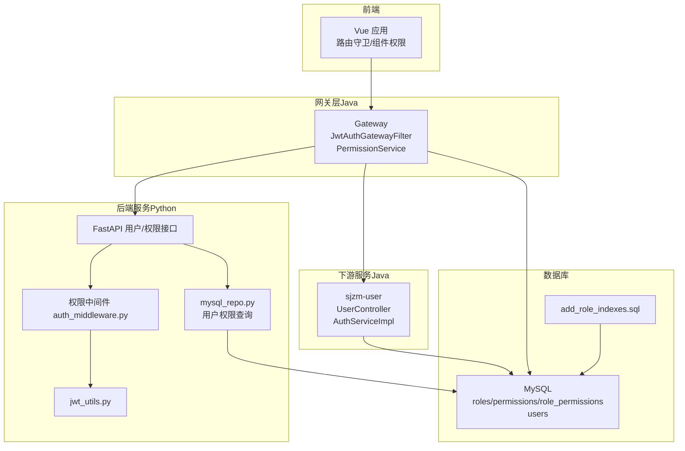
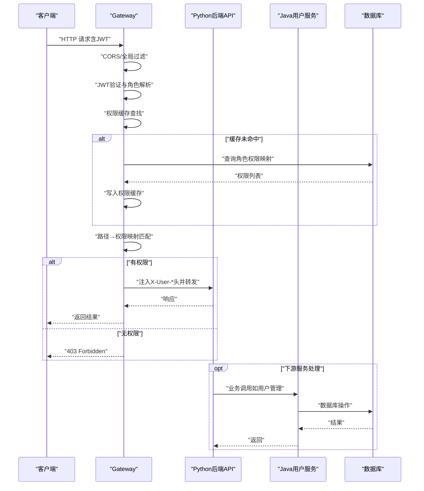
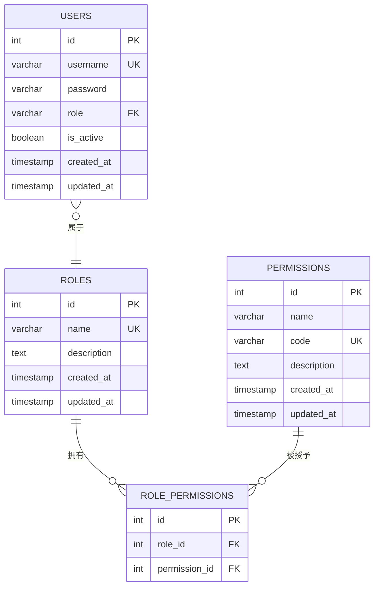
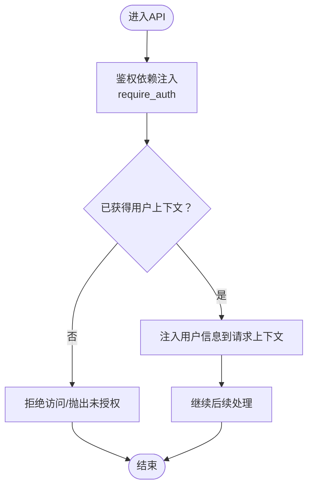
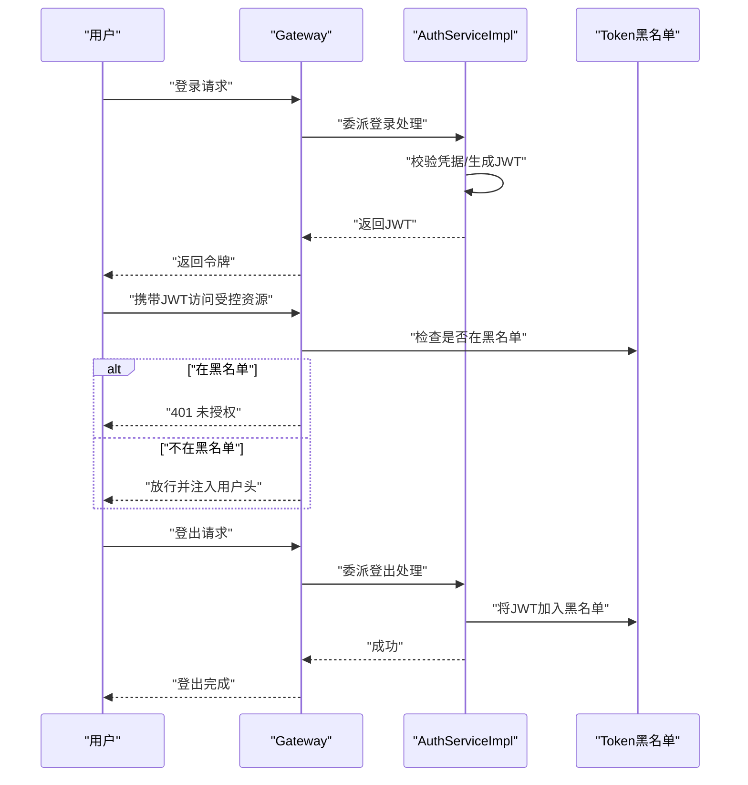
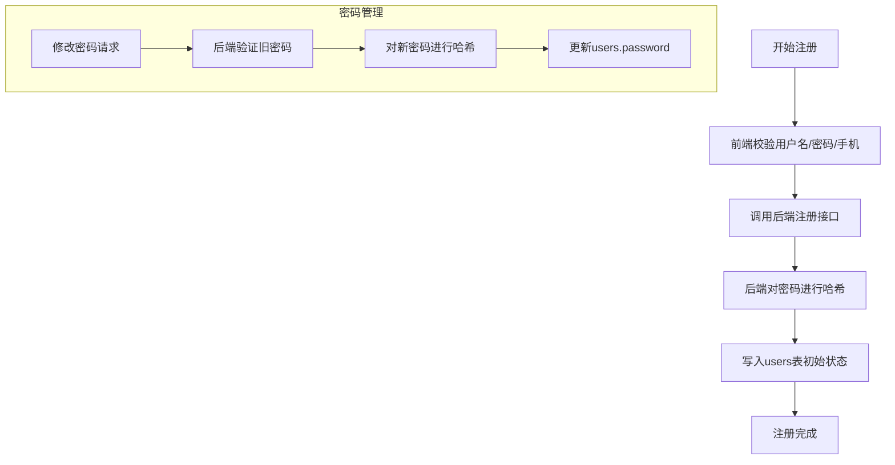
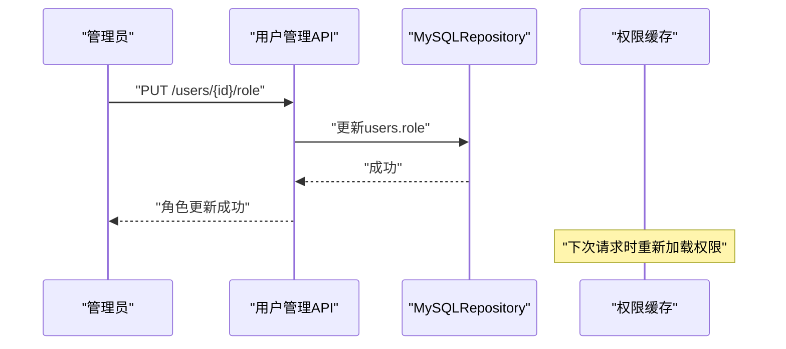
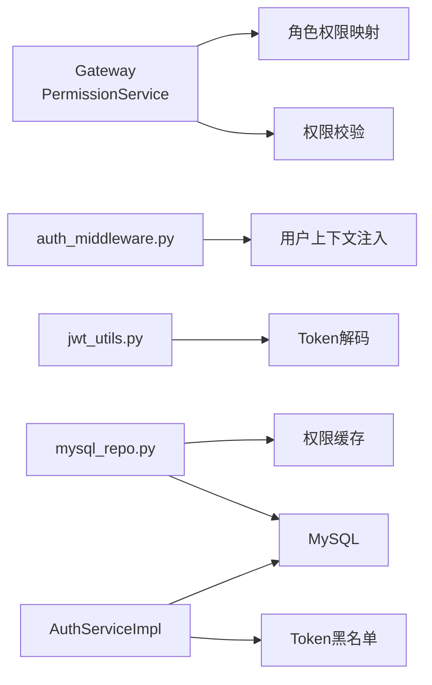

# 用户权限管理

<cite>
**本文引用的文件**
- [RBAC设计.md](file://docs/项目逻辑/RBAC设计.md)
- [PermissionService.java](file://java-backend/sjzm-gateway/src/main/java/com/sjzm/gateway/PermissionService.java)
- [auth_middleware.py](file://backend/app/middleware/auth_middleware.py)
- [jwt_utils.py](file://backend/app/utils/jwt_utils.py)
- [users.py](file://backend/app/api/v1/users.py)
- [auth.py](file://backend/app/api/v1/auth.py)
- [mysql_repo.py](file://backend/app/repositories/mysql_repo.py)
- [add_role_indexes.sql](file://backend/migrations/add_role_indexes.sql)
- [UserController.java](file://java-backend/sjzm-user/src/main/java/com/sjzm/user/controller/UserController.java)
- [AuthServiceImpl.java](file://java-backend/sjzm-user/src/main/java/com/sjzm/user/service/impl/AuthServiceImpl.java)
- [UserServiceImpl.java](file://java-backend/sjzm-user/src/main/java/com/sjzm/user/service/impl/UserServiceImpl.java)
- [user.ts](file://frontend/src/api/user.ts)
- [index.vue（注册页）](file://frontend/vue-admin-better/src/views/register/index.vue)
- [spec.md（认证强制要求）](file://openspec/changes/microservices-migration/specs/auth/spec.md)
</cite>

## 目录
1. [简介](#简介)
2. [项目结构](#项目结构)
3. [核心组件](#核心组件)
4. [架构总览](#架构总览)
5. [详细组件分析](#详细组件分析)
6. [依赖分析](#依赖分析)
7. [性能考虑](#性能考虑)
8. [故障排查指南](#故障排查指南)
9. [结论](#结论)
10. [附录](#附录)

## 简介
本技术文档围绕用户权限管理功能展开，重点阐述基于角色的访问控制（RBAC）模型在本项目中的实现方式，涵盖用户、角色、权限三者关系与继承机制；用户注册、账户激活、密码管理与账户状态控制；角色分配与动态权限调整；JWT Token的签发、验证、刷新与失效；会话管理（多设备登录、并发会话控制、安全退出）；权限中间件与请求拦截校验；前端路由守卫与组件级权限控制；以及完整的用户相关API接口定义与错误处理。

## 项目结构
权限体系涉及后端Python FastAPI服务、Java网关与下游服务、前端Vue应用以及数据库迁移脚本。整体采用“网关集中鉴权 + 下游服务无状态信任”的架构，确保权限判定在网关层完成，下游服务仅需信任注入的用户头信息。

图示来源
- [PermissionService.java:1-46](file://java-backend/sjzm-gateway/src/main/java/com/sjzm/gateway/PermissionService.java#L1-L46)
- [auth_middleware.py](file://backend/app/middleware/auth_middleware.py)
- [jwt_utils.py:1-29](file://backend/app/utils/jwt_utils.py#L1-L29)
- [users.py:87-172](file://backend/app/api/v1/users.py#L87-L172)
- [mysql_repo.py:1184-1319](file://backend/app/repositories/mysql_repo.py#L1184-L1319)
- [UserController.java:63-98](file://java-backend/sjzm-user/src/main/java/com/sjzm/user/controller/UserController.java#L63-L98)
- [AuthServiceImpl.java:1-40](file://java-backend/sjzm-user/src/main/java/com/sjzm/user/service/impl/AuthServiceImpl.java#L1-L40)
- [add_role_indexes.sql:1-16](file://backend/migrations/add_role_indexes.sql#L1-L16)

章节来源
- [RBAC设计.md:1-235](file://docs/项目逻辑/RBAC设计.md#L1-L235)
- [PermissionService.java:1-46](file://java-backend/sjzm-gateway/src/main/java/com/sjzm/gateway/PermissionService.java#L1-L46)
- [auth_middleware.py](file://backend/app/middleware/auth_middleware.py)
- [jwt_utils.py:1-29](file://backend/app/utils/jwt_utils.py#L1-L29)
- [users.py:87-172](file://backend/app/api/v1/users.py#L87-L172)
- [mysql_repo.py:1184-1319](file://backend/app/repositories/mysql_repo.py#L1184-L1319)
- [add_role_indexes.sql:1-16](file://backend/migrations/add_role_indexes.sql#L1-L16)

## 核心组件
- 网关权限服务：负责将请求路径映射到所需权限，并基于角色缓存快速判断是否具备权限。
- Python权限中间件：在后端API层进行基础鉴权与权限上下文注入。
- JWT工具：提供Token解码能力（不验证签名），供部分端点使用。
- 用户与权限API：提供用户CRUD、角色分配、密码更新等接口。
- MySQL权限查询：基于CTE递归查询用户完整权限集，并带缓存与过期清理。
- Java用户服务：登录、注册、角色更新等业务逻辑，配合网关鉴权。
- 前端用户管理与注册页面：调用后端API，展示用户列表与角色分配。

章节来源
- [RBAC设计.md:109-130](file://docs/项目逻辑/RBAC设计.md#L109-L130)
- [PermissionService.java:31-44](file://java-backend/sjzm-gateway/src/main/java/com/sjzm/gateway/PermissionService.java#L31-L44)
- [auth_middleware.py](file://backend/app/middleware/auth_middleware.py)
- [jwt_utils.py:19-29](file://backend/app/utils/jwt_utils.py#L19-L29)
- [users.py:87-172](file://backend/app/api/v1/users.py#L87-L172)
- [mysql_repo.py:1184-1319](file://backend/app/repositories/mysql_repo.py#L1184-L1319)
- [UserController.java:84-97](file://java-backend/sjzm-user/src/main/java/com/sjzm/user/controller/UserController.java#L84-L97)
- [AuthServiceImpl.java:34-40](file://java-backend/sjzm-user/src/main/java/com/sjzm/user/service/impl/AuthServiceImpl.java#L34-L40)

## 架构总览
系统采用“网关集中鉴权 + 下游服务无状态信任”的RBAC架构。请求到达网关后，先进行CORS与JWT验证，再根据路由映射检查所需权限，权限通过后注入用户信息头并转发至下游服务；下游服务不再重复鉴权，直接信任注入的用户信息。

图示来源
- [RBAC设计.md:109-130](file://docs/项目逻辑/RBAC设计.md#L109-L130)
- [PermissionService.java:31-44](file://java-backend/sjzm-gateway/src/main/java/com/sjzm/gateway/PermissionService.java#L31-L44)

章节来源
- [RBAC设计.md:109-130](file://docs/项目逻辑/RBAC设计.md#L109-L130)
- [spec.md（认证强制要求）:1-20](file://openspec/changes/microservices-migration/specs/auth/spec.md#L1-L20)

## 详细组件分析

### RBAC模型与数据结构
- 统一权限码格式：资源:动作（resource:action），与前端路由与API保持一致。
- 三张核心表：roles、permissions、role_permissions；users.role字段与roles.name关联。
- 不做角色继承：当前不需要，未来可通过parent_id扩展。
- 扩展路径：多人多角色、角色继承、数据级权限、临时权限、API限流等均可通过新增表或列实现，不破坏现有结构。

图示来源
- [RBAC设计.md:90-106](file://docs/项目逻辑/RBAC设计.md#L90-L106)

章节来源
- [RBAC设计.md:29-106](file://docs/项目逻辑/RBAC设计.md#L29-L106)

### 权限中间件与请求拦截
- Python中间件：在API入口处进行鉴权依赖注入，结合require_auth依赖获取当前用户上下文。
- 网关中间件：在Java网关层进行JWT解析与权限校验，避免下游服务重复鉴权。

图示来源
- [auth_middleware.py](file://backend/app/middleware/auth_middleware.py)

章节来源
- [auth_middleware.py](file://backend/app/middleware/auth_middleware.py)

### JWT Token生成、验证、刷新与失效
- 生成与验证：网关负责签发与验证JWT，Python后端仅使用解码工具解析payload（不验证签名）。
- 刷新与失效：Java侧维护简单内存黑名单（生产建议Redis），支持登出后将Token加入黑名单。

图示来源
- [jwt_utils.py:19-29](file://backend/app/utils/jwt_utils.py#L19-L29)
- [AuthServiceImpl.java:34-40](file://java-backend/sjzm-user/src/main/java/com/sjzm/user/service/impl/AuthServiceImpl.java#L34-L40)

章节来源
- [jwt_utils.py:1-29](file://backend/app/utils/jwt_utils.py#L1-L29)
- [AuthServiceImpl.java:31-33](file://java-backend/sjzm-user/src/main/java/com/sjzm/user/service/impl/AuthServiceImpl.java#L31-L33)

### 用户注册、账户激活、密码管理与状态控制
- 注册：前端注册页提交用户名、手机号、密码等，后端创建用户并进行密码哈希存储。
- 密码管理：后端提供更新密码接口；Java侧使用PasswordEncoder进行安全存储。
- 账户状态：users表包含is_active字段，可用于启用/禁用账户；网关与后端在鉴权时可结合该状态进行控制。

图示来源
- [index.vue（注册页）:35-150](file://frontend/vue-admin-better/src/views/register/index.vue#L35-L150)
- [users.py:126-172](file://backend/app/api/v1/users.py#L126-L172)
- [UserController.java:70-75](file://java-backend/sjzm-user/src/main/java/com/sjzm/user/controller/UserController.java#L70-L75)

章节来源
- [index.vue（注册页）:35-150](file://frontend/vue-admin-better/src/views/register/index.vue#L35-L150)
- [users.py:126-172](file://backend/app/api/v1/users.py#L126-L172)
- [UserController.java:70-75](file://java-backend/sjzm-user/src/main/java/com/sjzm/user/controller/UserController.java#L70-L75)

### 角色分配机制与动态权限调整
- 角色与权限映射：通过role_permissions表建立角色与权限的多对多关系。
- 动态调整：更新用户角色或权限映射后，网关缓存会在过期后重新加载最新权限。
- Java侧：提供更新用户角色的接口，校验合法角色集合。

图示来源
- [users.py:87-124](file://backend/app/api/v1/users.py#L87-L124)
- [UserController.java:84-97](file://java-backend/sjzm-user/src/main/java/com/sjzm/user/controller/UserController.java#L84-L97)
- [mysql_repo.py:1184-1281](file://backend/app/repositories/mysql_repo.py#L1184-L1281)

章节来源
- [users.py:87-124](file://backend/app/api/v1/users.py#L87-L124)
- [UserController.java:84-97](file://java-backend/sjzm-user/src/main/java/com/sjzm/user/controller/UserController.java#L84-L97)
- [mysql_repo.py:1184-1281](file://backend/app/repositories/mysql_repo.py#L1184-L1281)

### 会话管理：多设备登录、并发控制与安全退出
- 无状态：系统保持无状态，所有认证信息由JWT承载。
- 多设备登录：同一用户可在多设备持有有效Token。
- 并发会话控制：通过黑名单机制在登出时使Token失效，达到安全退出效果。
- 登出流程：后端将Token加入黑名单，后续请求被拒绝。

章节来源
- [spec.md（认证强制要求）:14-19](file://openspec/changes/microservices-migration/specs/auth/spec.md#L14-L19)
- [AuthServiceImpl.java:31-33](file://java-backend/sjzm-user/src/main/java/com/sjzm/user/service/impl/AuthServiceImpl.java#L31-L33)

### 前端路由守卫与组件级权限控制
- 路由守卫：在进入受控路由前检查本地权限与Token有效性。
- 组件级权限：根据用户权限数组动态渲染菜单项与按钮。
- 用户管理界面：提供用户列表、角色分配、密码更新等操作入口。

章节来源
- [RBAC设计.md:220-221](file://docs/项目逻辑/RBAC设计.md#L220-L221)
- [user.ts:58-95](file://frontend/src/api/user.ts#L58-L95)

### 用户相关API接口文档
- 获取用户详情
  - 方法与路径：GET /api/v1/users/{user_id}
  - 认证：需要有效JWT
  - 参数：user_id（路径参数）
  - 成功响应：用户信息（不含敏感字段）
  - 错误：404（用户不存在）、500（内部错误）

- 创建用户
  - 方法与路径：POST /api/v1/users
  - 认证：需要有效JWT
  - 请求体：username（必填）、password（必填）、role（可选，默认user）、developer（可选）
  - 成功响应：创建成功
  - 错误：400（缺少必要字段或重复用户名）、500（内部错误）

- 更新用户
  - 方法与路径：PUT /api/v1/users/{id}
  - 认证：需要有效JWT
  - 请求体：用户信息字段
  - 成功响应：更新成功
  - 错误：404（用户不存在）、500（内部错误）

- 删除用户
  - 方法与路径：DELETE /api/v1/users/{id}
  - 认证：需要有效JWT
  - 成功响应：删除成功
  - 错误：404（用户不存在）、500（内部错误）

- 更新用户角色
  - 方法与路径：PUT /api/v1/users/{id}/role
  - 认证：需要有效JWT
  - 请求体：role（必须，且在允许列表内）
  - 成功响应：角色更新成功
  - 错误：400（角色非法）、500（内部错误）

- 更新用户密码
  - 方法与路径：PUT /api/v1/users/{id}/password
  - 认证：需要有效JWT
  - 请求体：password（新密码）
  - 成功响应：密码更新成功
  - 错误：404（用户不存在）、500（内部错误）

章节来源
- [users.py:87-172](file://backend/app/api/v1/users.py#L87-L172)
- [user.ts:58-95](file://frontend/src/api/user.ts#L58-L95)
- [UserController.java:63-97](file://java-backend/sjzm-user/src/main/java/com/sjzm/user/controller/UserController.java#L63-L97)

## 依赖分析
- 网关依赖：PermissionService提供角色到权限的映射与校验；JwtAuthGatewayFilter负责JWT解析与权限检查。
- 后端依赖：auth_middleware.py提供鉴权依赖；jwt_utils.py提供Token解码；mysql_repo.py提供用户权限查询与缓存。
- Java用户服务：AuthServiceImpl负责登录/登出与Token黑名单；UserServiceImpl负责用户列表与详情。

图示来源
- [PermissionService.java:1-46](file://java-backend/sjzm-gateway/src/main/java/com/sjzm/gateway/PermissionService.java#L1-L46)
- [auth_middleware.py](file://backend/app/middleware/auth_middleware.py)
- [jwt_utils.py:1-29](file://backend/app/utils/jwt_utils.py#L1-L29)
- [mysql_repo.py:1184-1319](file://backend/app/repositories/mysql_repo.py#L1184-L1319)
- [AuthServiceImpl.java:31-33](file://java-backend/sjzm-user/src/main/java/com/sjzm/user/service/impl/AuthServiceImpl.java#L31-L33)

章节来源
- [PermissionService.java:1-46](file://java-backend/sjzm-gateway/src/main/java/com/sjzm/gateway/PermissionService.java#L1-L46)
- [auth_middleware.py](file://backend/app/middleware/auth_middleware.py)
- [jwt_utils.py:1-29](file://backend/app/utils/jwt_utils.py#L1-L29)
- [mysql_repo.py:1184-1319](file://backend/app/repositories/mysql_repo.py#L1184-L1319)
- [AuthServiceImpl.java:31-33](file://java-backend/sjzm-user/src/main/java/com/sjzm/user/service/impl/AuthServiceImpl.java#L31-L33)

## 性能考虑
- 索引优化：为roles、role_permissions、users、permissions表建立合适索引，提升权限查询性能。
- 权限缓存：Python侧缓存用户权限，定期清理过期键；网关侧缓存角色权限映射，降低数据库压力。
- 递归查询：使用CTE递归查询角色继承链，避免多次往返数据库。

章节来源
- [add_role_indexes.sql:1-16](file://backend/migrations/add_role_indexes.sql#L1-L16)
- [mysql_repo.py:1184-1319](file://backend/app/repositories/mysql_repo.py#L1184-L1319)

## 故障排查指南
- 401未授权：检查JWT是否有效、是否过期、是否在黑名单中。
- 403权限不足：确认用户角色是否具备所需权限，权限映射是否正确，缓存是否过期。
- 用户不存在：检查用户ID是否正确，数据库是否存在对应记录。
- 密码更新失败：确认旧密码校验通过，新密码符合安全策略。
- 登出无效：确认Token已被加入黑名单，且网关/后端未使用过期缓存。

章节来源
- [spec.md（认证强制要求）:6-12](file://openspec/changes/microservices-migration/specs/auth/spec.md#L6-L12)
- [AuthServiceImpl.java:31-33](file://java-backend/sjzm-user/src/main/java/com/sjzm/user/service/impl/AuthServiceImpl.java#L31-L33)
- [users.py:126-172](file://backend/app/api/v1/users.py#L126-L172)

## 结论
本项目采用“网关集中鉴权 + 下游服务无状态信任”的RBAC架构，通过统一的权限码格式与清晰的三张核心表，实现了可扩展、可维护的权限体系。配合JWT无状态会话、权限缓存与索引优化，系统在保证安全性的同时具备良好的性能与扩展性。未来如需多人多角色、角色继承或数据级权限，均可通过少量扩展表或列实现，无需重构现有结构。

## 附录
- 扩展路径（来自RBAC设计文档）：多人多角色、角色继承、数据级权限、临时权限、API限流等。
- 索引建议：roles、role_permissions、users、permissions表建立主键/唯一/外键索引，提升查询效率。

章节来源
- [RBAC设计.md:224-233](file://docs/项目逻辑/RBAC设计.md#L224-L233)
- [add_role_indexes.sql:1-16](file://backend/migrations/add_role_indexes.sql#L1-L16)