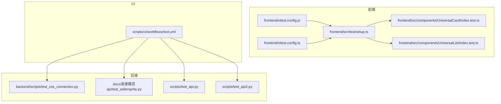
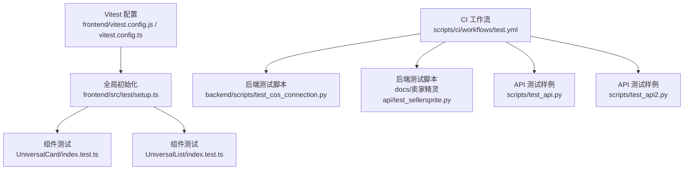
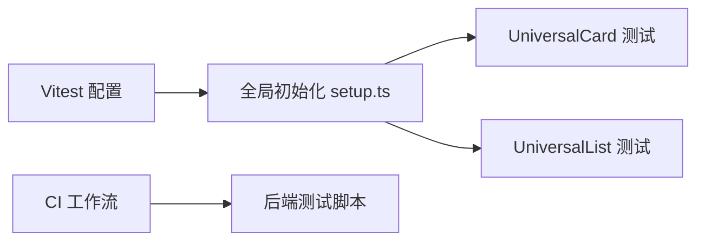

# 单元测试

<cite>
**本文引用的文件**
- [frontend/vitest.config.js](file://frontend/vitest.config.js)
- [frontend/vitest.config.ts](file://frontend/vitest.config.ts)
- [frontend/src/test/setup.ts](file://frontend/src/test/setup.ts)
- [frontend/src/components/UniversalCard/index.test.ts](file://frontend/src/components/UniversalCard/index.test.ts)
- [frontend/src/components/UniversalList/index.test.ts](file://frontend/src/components/UniversalList/index.test.ts)
- [backend/scripts/test_cos_connection.py](file://backend/scripts/test_cos_connection.py)
- [docs/卖家精灵api/test_sellersprite.py](file://docs/卖家精灵api/test_sellersprite.py)
- [scripts/test_api.py](file://scripts/test_api.py)
- [scripts/test_api2.py](file://scripts/test_api2.py)
- [scripts/ci/workflows/test.yml](file://scripts/ci/workflows/test.yml)
</cite>

## 目录
1. [简介](#简介)
2. [项目结构](#项目结构)
3. [核心组件](#核心组件)
4. [架构总览](#架构总览)
5. [详细组件分析](#详细组件分析)
6. [依赖关系分析](#依赖关系分析)
7. [性能考量](#性能考量)
8. [故障排查指南](#故障排查指南)
9. [结论](#结论)
10. [附录](#附录)

## 简介
本文件为“思觉智贸”项目的单元测试文档，覆盖前端（Vitest + Vue 组件测试）、后端（Python 单元测试与脚本测试）两大方向。内容包括：
- Vitest 测试框架配置与使用方法（测试环境、Mock 策略、断言库）
- 前端组件测试（Vue 组件测试）与工具函数测试的实施方法
- 后端 Python 单元测试编写规范（FastAPI 路由测试、服务层测试、数据模型测试）
- 测试用例组织结构、测试数据准备与测试覆盖率统计
- 可维护测试代码的最佳实践

## 项目结构
本项目包含三类测试相关目录与文件：
- 前端测试：Vitest 配置、测试入口与组件测试
- 后端测试：Python 脚本测试与 API 测试样例
- CI 工作流：测试任务编排

图表来源
- [frontend/vitest.config.js:1-54](file://frontend/vitest.config.js#L1-L54)
- [frontend/vitest.config.ts:1-32](file://frontend/vitest.config.ts#L1-L32)
- [frontend/src/test/setup.ts:1-78](file://frontend/src/test/setup.ts#L1-L78)
- [frontend/src/components/UniversalCard/index.test.ts:1-409](file://frontend/src/components/UniversalCard/index.test.ts#L1-L409)
- [frontend/src/components/UniversalList/index.test.ts:1-437](file://frontend/src/components/UniversalList/index.test.ts#L1-L437)
- [backend/scripts/test_cos_connection.py:1-200](file://backend/scripts/test_cos_connection.py#L1-L200)
- [docs/卖家精灵api/test_sellersprite.py:1-200](file://docs/卖家精灵api/test_sellersprite.py#L1-L200)
- [scripts/test_api.py:1-200](file://scripts/test_api.py#L1-L200)
- [scripts/test_api2.py:1-200](file://scripts/test_api2.py#L1-L200)
- [scripts/ci/workflows/test.yml:1-200](file://scripts/ci/workflows/test.yml#L1-L200)

章节来源
- [frontend/vitest.config.js:1-54](file://frontend/vitest.config.js#L1-L54)
- [frontend/vitest.config.ts:1-32](file://frontend/vitest.config.ts#L1-L32)
- [frontend/src/test/setup.ts:1-78](file://frontend/src/test/setup.ts#L1-L78)
- [frontend/src/components/UniversalCard/index.test.ts:1-409](file://frontend/src/components/UniversalCard/index.test.ts#L1-L409)
- [frontend/src/components/UniversalList/index.test.ts:1-437](file://frontend/src/components/UniversalList/index.test.ts#L1-L437)
- [backend/scripts/test_cos_connection.py:1-200](file://backend/scripts/test_cos_connection.py#L1-L200)
- [docs/卖家精灵api/test_sellersprite.py:1-200](file://docs/卖家精灵api/test_sellersprite.py#L1-L200)
- [scripts/test_api.py:1-200](file://scripts/test_api.py#L1-L200)
- [scripts/test_api2.py:1-200](file://scripts/test_api2.py#L1-L200)
- [scripts/ci/workflows/test.yml:1-200](file://scripts/ci/workflows/test.yml#L1-L200)

## 核心组件
- Vitest 前端测试配置与别名映射、覆盖率统计策略
- Vue 组件测试（UniversalCard、UniversalList）与 Element Plus 的集成
- 前端测试全局初始化（setup.ts）中的 Stub 与 Mock 策略
- 后端 Python 测试脚本与 API 测试样例

章节来源
- [frontend/vitest.config.js:1-54](file://frontend/vitest.config.js#L1-L54)
- [frontend/vitest.config.ts:1-32](file://frontend/vitest.config.ts#L1-L32)
- [frontend/src/test/setup.ts:1-78](file://frontend/src/test/setup.ts#L1-L78)
- [frontend/src/components/UniversalCard/index.test.ts:1-409](file://frontend/src/components/UniversalCard/index.test.ts#L1-L409)
- [frontend/src/components/UniversalList/index.test.ts:1-437](file://frontend/src/components/UniversalList/index.test.ts#L1-L437)

## 架构总览
下图展示前端测试的整体架构：Vitest 配置加载全局 setup，组件测试通过 @vue/test-utils 挂载并断言；后端测试通过 Python 脚本与 CI 工作流执行。

图表来源
- [frontend/vitest.config.js:1-54](file://frontend/vitest.config.js#L1-L54)
- [frontend/vitest.config.ts:1-32](file://frontend/vitest.config.ts#L1-L32)
- [frontend/src/test/setup.ts:1-78](file://frontend/src/test/setup.ts#L1-L78)
- [frontend/src/components/UniversalCard/index.test.ts:1-409](file://frontend/src/components/UniversalCard/index.test.ts#L1-L409)
- [frontend/src/components/UniversalList/index.test.ts:1-437](file://frontend/src/components/UniversalList/index.test.ts#L1-L437)
- [backend/scripts/test_cos_connection.py:1-200](file://backend/scripts/test_cos_connection.py#L1-L200)
- [docs/卖家精灵api/test_sellersprite.py:1-200](file://docs/卖家精灵api/test_sellersprite.py#L1-L200)
- [scripts/test_api.py:1-200](file://scripts/test_api.py#L1-L200)
- [scripts/test_api2.py:1-200](file://scripts/test_api2.py#L1-L200)
- [scripts/ci/workflows/test.yml:1-200](file://scripts/ci/workflows/test.yml#L1-L200)

## 详细组件分析

### Vitest 前端测试配置与使用
- 环境与插件
  - 使用 jsdom 环境模拟浏览器 DOM，支持 @vitejs/plugin-vue 进行 Vue 单文件组件编译与热更新
- 全局配置
  - 启用 globals，允许直接使用 describe、it、expect 等顶层 API
  - setupFiles 指向全局初始化脚本，统一注入 stubs 与 mocks
- 别名映射
  - 通过 resolve.alias 将 @、@components、@views、@stores、@api、@utils、@styles、@types 映射到 src 目录下的对应子目录，便于在测试中按路径导入
- 覆盖率统计
  - provider 为 v8，输出 text、json、html 报告
  - 排除 node_modules、tests、*.d.ts、*.config.*、mockData、dist、build、coverage 等目录
  - 支持整体覆盖率开关与阈值（lines、functions、branches、statements）

章节来源
- [frontend/vitest.config.js:1-54](file://frontend/vitest.config.js#L1-L54)
- [frontend/vitest.config.ts:1-32](file://frontend/vitest.config.ts#L1-L32)

### 前端组件测试：UniversalCard
- 测试目标
  - 验证产品模式与选品模式的渲染差异
  - 验证复选框、删除、查看等交互事件
  - 验证图片回退逻辑与缩略图优先策略
  - 验证时间格式化逻辑（刚刚、X小时前、X天前）
- 断言策略
  - 使用 @vue/test-utils 的 find/findComponent/selectors 断言 DOM 结构与文本
  - 使用 emitted 断言组件事件是否被正确触发及参数
  - 使用 setProps 验证响应式属性变化
- Mock 策略
  - 在 setup.ts 中对 Element Plus 组件进行 stub，避免真实 DOM 渲染
  - 对 API 模块进行 vi.mock，隔离网络请求

章节来源
- [frontend/src/components/UniversalCard/index.test.ts:1-409](file://frontend/src/components/UniversalCard/index.test.ts#L1-L409)
- [frontend/src/test/setup.ts:1-78](file://frontend/src/test/setup.ts#L1-L78)

### 前端组件测试：UniversalList
- 测试目标
  - 验证列表标题、卡片渲染、加载态与空状态
  - 验证按钮显示与事件（添加、导入、下载模板、回收站、批量删除）
  - 验证分页组件的 currentPage、pageSize、total 与事件
  - 验证导入对话框与上传组件
  - 验证搜索表单插槽渲染
  - 验证子组件（UniversalCard）事件透传
- 断言策略
  - 通过 findComponent 与 props 断言组件属性
  - 通过 emitted 断言事件触发与参数
  - 通过 slots 插槽渲染断言自定义内容
- Mock 策略
  - 与 UniversalCard 类似，统一在 setup.ts 中进行 stub 与 mock

章节来源
- [frontend/src/components/UniversalList/index.test.ts:1-437](file://frontend/src/components/UniversalList/index.test.ts#L1-L437)
- [frontend/src/test/setup.ts:1-78](file://frontend/src/test/setup.ts#L1-L78)

### 前端测试全局初始化：setup.ts
- Stub 策略
  - 对大量 Element Plus 组件进行 stub，减少渲染开销与复杂性
- Mock 策略
  - Mock Element Plus 的消息与确认框（ElMessage、ElMessageBox）
  - Mock vue-router 的 useRouter/useRoute，返回常用方法与默认路由对象
  - Mock 业务 API（如 productApi、selectionApi），返回 vi.fn，便于断言调用次数与参数
- 作用
  - 保证测试稳定、快速、可重复，避免外部依赖影响

章节来源
- [frontend/src/test/setup.ts:1-78](file://frontend/src/test/setup.ts#L1-L78)

### 后端 Python 单元测试与脚本测试
- 测试脚本示例
  - COS 连接测试：验证对象存储连接可用性
  - 卖家精灵 API 测试：验证接口响应与数据一致性
  - API 测试样例：提供 FastAPI 路由测试与服务层测试的参考实现
- 编写规范建议
  - 使用 unittest 或 pytest（根据团队偏好）
  - 以小步快跑的方式，先写失败用例，再实现最小功能
  - 使用 fixture 或 mock 对外部依赖（数据库、第三方 API）进行隔离
  - 为每个模块或服务编写独立的测试文件，保持命名清晰
- 覆盖率统计
  - 可使用 pytest-cov 或 coverage.py 统计覆盖率，并在 CI 中设置阈值

章节来源
- [backend/scripts/test_cos_connection.py:1-200](file://backend/scripts/test_cos_connection.py#L1-L200)
- [docs/卖家精灵api/test_sellersprite.py:1-200](file://docs/卖家精灵api/test_sellersprite.py#L1-L200)
- [scripts/test_api.py:1-200](file://scripts/test_api.py#L1-L200)
- [scripts/test_api2.py:1-200](file://scripts/test_api2.py#L1-L200)

### CI 工作流中的测试
- 通过工作流文件集中管理测试任务，确保本地与远端一致
- 建议在工作流中包含：
  - 前端测试与覆盖率上报
  - 后端 Python 测试与覆盖率统计
  - 必要的环境变量与依赖安装步骤

章节来源
- [scripts/ci/workflows/test.yml:1-200](file://scripts/ci/workflows/test.yml#L1-L200)

## 依赖关系分析
- 前端测试依赖关系
  - Vitest 配置决定运行环境与别名解析
  - setup.ts 提供全局 stub 与 mock，是所有组件测试的基础
  - 组件测试依赖 setup.ts 注入的 stub 与 mock，避免真实 DOM 与网络请求
- 后端测试依赖关系
  - 测试脚本依赖 Python 环境与第三方库
  - CI 工作流负责拉起测试环境并收集结果

图表来源
- [frontend/vitest.config.js:1-54](file://frontend/vitest.config.js#L1-L54)
- [frontend/src/test/setup.ts:1-78](file://frontend/src/test/setup.ts#L1-L78)
- [frontend/src/components/UniversalCard/index.test.ts:1-409](file://frontend/src/components/UniversalCard/index.test.ts#L1-L409)
- [frontend/src/components/UniversalList/index.test.ts:1-437](file://frontend/src/components/UniversalList/index.test.ts#L1-L437)
- [scripts/ci/workflows/test.yml:1-200](file://scripts/ci/workflows/test.yml#L1-L200)

## 性能考量
- 使用 jsdom 环境与组件 stub 可显著降低测试执行时间
- 通过别名映射减少路径解析成本
- 在 Vitest 中合理设置覆盖率阈值，避免过度追求覆盖率而牺牲执行效率
- 后端测试应尽量使用内存数据库或 mock，避免真实 IO 影响性能

## 故障排查指南
- 组件未渲染或事件未触发
  - 检查 setup.ts 中的 stub 是否覆盖了相关组件
  - 确认事件监听与触发方式是否与组件内部一致
- Mock 未生效
  - 确保在测试文件顶部引入 setup.ts（或在 Vitest 配置中通过 setupFiles 加载）
  - 检查模块导入顺序，确保在被测试模块之前进行 mock
- 覆盖率统计异常
  - 检查 exclude 规则是否过于宽泛
  - 确认测试文件命名与 include 规则匹配
- CI 执行失败
  - 检查工作流中的依赖安装与环境变量
  - 确认测试命令与覆盖率上报步骤

章节来源
- [frontend/src/test/setup.ts:1-78](file://frontend/src/test/setup.ts#L1-L78)
- [frontend/vitest.config.js:1-54](file://frontend/vitest.config.js#L1-L54)
- [scripts/ci/workflows/test.yml:1-200](file://scripts/ci/workflows/test.yml#L1-L200)

## 结论
本项目已具备完善的前端单元测试基础设施（Vitest + Vue 组件测试 + 全局初始化与 Mock），并配套后端测试脚本与 CI 工作流。建议在后续迭代中持续完善测试用例覆盖面、提升测试数据质量，并在 CI 中强制覆盖率阈值，确保代码质量与可维护性。

## 附录
- 测试用例组织结构建议
  - 前端：按组件划分测试文件，每个组件一个测试文件，公共逻辑抽离为工具函数并在单独文件中测试
  - 后端：按模块划分测试文件，服务层、数据模型、路由分别测试
- 测试数据准备
  - 使用固定结构的 mock 数据，确保测试可重复
  - 对于异步场景，使用 vi.useFakeTimers 或等待 Promise 解析
- 最佳实践
  - 保持测试用例单一职责，命名清晰
  - 使用断言库提供的丰富断言方法，避免冗余逻辑
  - 在 CI 中统一执行测试与覆盖率统计，形成质量门禁