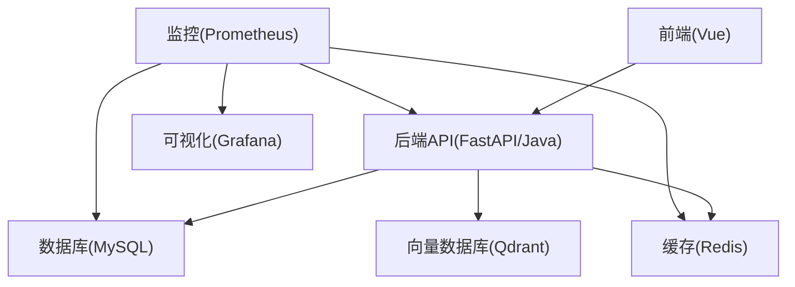
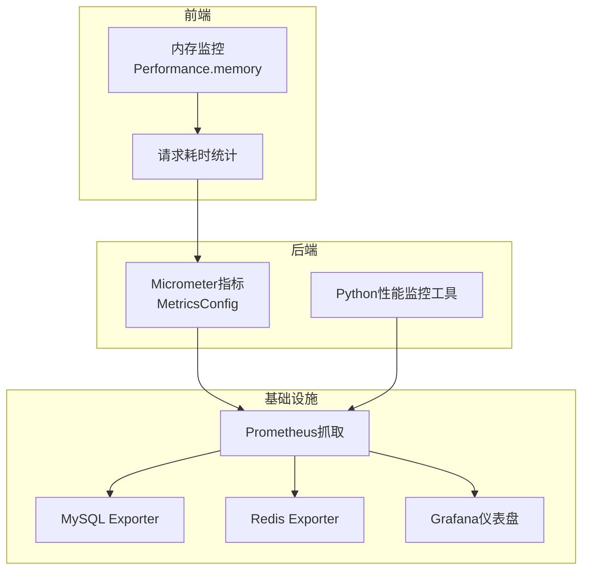
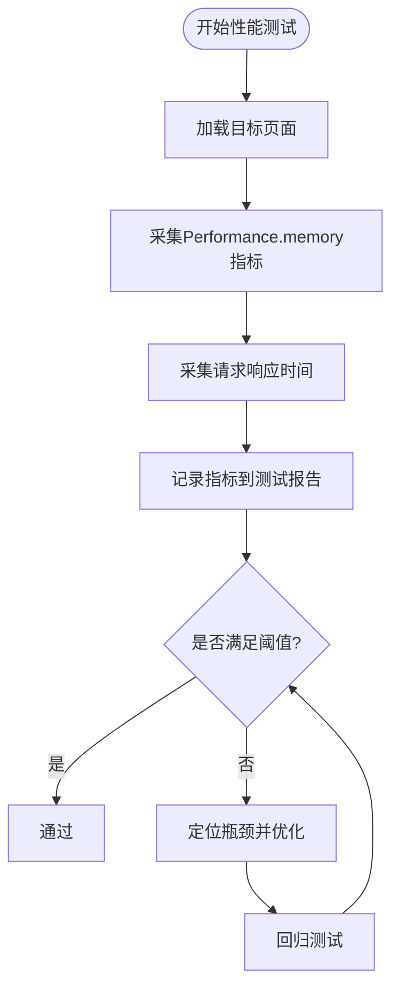
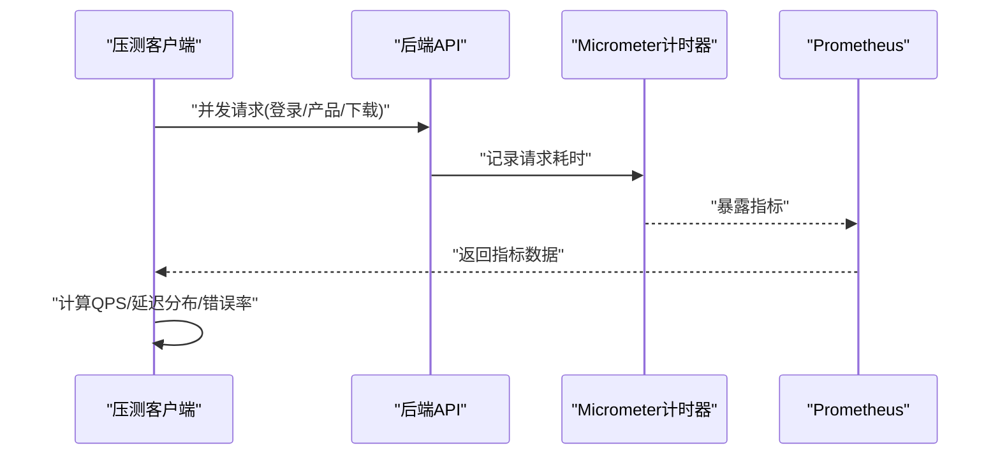
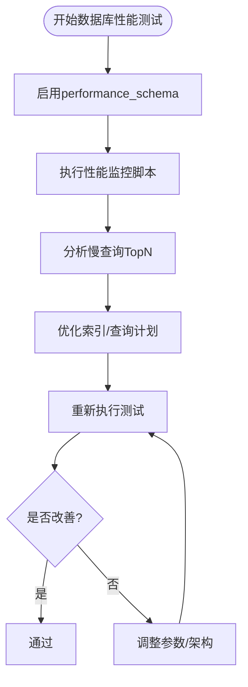
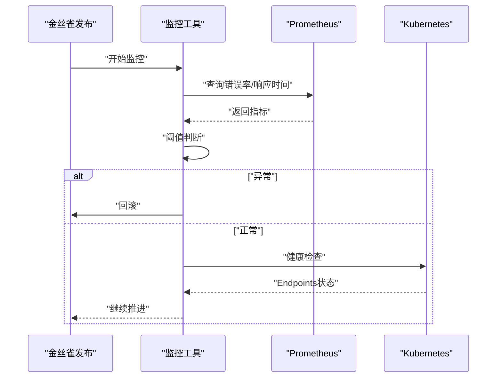
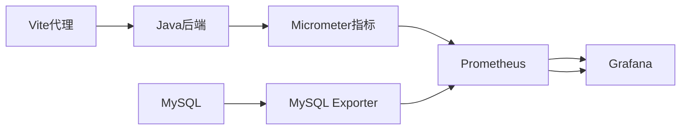

# 性能测试

<cite>
**本文引用的文件**
- [性能监控指标定义与采集](file://frontend/src/types/performance.d.ts)
- [后端API测试清单](file://docs/Java后端API测试清单.md)
- [Java后端指标配置](file://java-backend/src/main/java/com/sjzm/config/MetricsConfig.java)
- [Prometheus配置](file://prometheus/prometheus.yml)
- [数据库性能监控脚本](file://scripts/monitoring/performance_monitor.py)
- [部署监控工具](file://scripts/deployment/monitor_deployment.py)
- [金丝雀发布监控](file://scripts/deployment/canary_deployment.py)
- [Vite代理到Java后端](file://openspec/changes/verify-java-backend-completeness/specs/frontend-integration-verification/spec.md)
- [API端点审计](file://openspec/changes/verify-java-backend-completeness/specs/api-endpoint-audit/spec.md)
- [CI测试工作流](file://scripts/ci/workflows/test.yml)
</cite>

## 目录
1. [引言](#引言)
2. [项目结构](#项目结构)
3. [核心组件](#核心组件)
4. [架构总览](#架构总览)
5. [详细组件分析](#详细组件分析)
6. [依赖关系分析](#依赖关系分析)
7. [性能考虑](#性能考虑)
8. [故障排查指南](#故障排查指南)
9. [结论](#结论)
10. [附录](#附录)

## 引言
本性能测试文档面向“思觉智贸”项目，系统性阐述前端、后端API与数据库的性能测试方法论与实操方案，覆盖负载测试、压力测试与并发测试，并明确性能监控指标的定义与采集路径。文档同时给出基于Prometheus/Grafana的监控与告警实践建议，以及性能基准测试、瓶颈分析与优化建议，帮助团队建立可持续的性能保障体系。

## 项目结构
项目采用前后端分离架构，包含：
- 前端工程：Vue生态，包含多套UI框架适配与Mock能力
- 后端工程：Python FastAPI与Java Spring Boot双栈并行演进
- 数据库与中间件：MySQL、Redis、向量数据库等
- 监控与部署：Prometheus、Grafana、Kubernetes部署脚本与监控工具

## 核心组件
- 前端性能监控：通过扩展浏览器Performance接口以采集内存指标，结合页面渲染与请求耗时统计
- 后端性能监控：Java后端通过Micrometer暴露指标，Prometheus抓取；Python后端具备性能监控工具
- 数据库性能监控：通过MySQL性能模式与专用脚本采集慢查询与执行统计
- 部署与发布监控：金丝雀发布与部署监控工具集成错误率、响应时间等阈值判断

**章节来源**
- [性能监控指标定义与采集:1-29](file://frontend/src/types/performance.d.ts#L1-L29)
- [Java后端指标配置:45-75](file://java-backend/src/main/java/com/sjzm/config/MetricsConfig.java#L45-L75)
- [数据库性能监控脚本:117-149](file://scripts/monitoring/performance_monitor.py#L117-L149)
- [部署监控工具:172-319](file://scripts/deployment/monitor_deployment.py#L172-L319)
- [金丝雀发布监控:163-198](file://scripts/deployment/canary_deployment.py#L163-L198)

## 架构总览
下图展示性能测试与监控的关键交互路径，涵盖指标采集、传输与可视化：

**图表来源**
- [Java后端指标配置:45-75](file://java-backend/src/main/java/com/sjzm/config/MetricsConfig.java#L45-L75)
- [Prometheus配置:8-32](file://prometheus/prometheus.yml#L8-L32)
- [数据库性能监控脚本:117-149](file://scripts/monitoring/performance_monitor.py#L117-L149)

**章节来源**
- [Prometheus配置:1-32](file://prometheus/prometheus.yml#L1-L32)
- [Vite代理到Java后端:3-12](file://openspec/changes/verify-java-backend-completeness/specs/frontend-integration-verification/spec.md#L3-L12)

## 详细组件分析

### 前端性能测试
- 目标：评估页面渲染、资源加载、内存占用与交互响应时间
- 指标定义与采集
  - 内存使用：通过扩展的Performance接口获取JS堆大小、已用堆大小与堆上限
  - 页面首屏与交互延迟：结合浏览器导航与资源加载时间统计
- 实施要点
  - 在关键页面（如仪表盘、列表页）开启内存与请求耗时埋点
  - 使用自动化测试框架（如Vitest或Cypress）批量采集指标
  - 对比不同构建模式（开发/生产）与不同网络条件下的表现

**章节来源**
- [性能监控指标定义与采集:1-29](file://frontend/src/types/performance.d.ts#L1-L29)

### 后端API性能测试
- 目标：验证接口在不同并发与数据规模下的响应时间、吞吐量与稳定性
- 指标定义与采集
  - 响应时间：后端Micrometer计时器记录HTTP请求耗时
  - 吞吐量：QPS、P50/P95/P99延迟
  - 错误率：4xx/5xx错误占比
- 实施要点
  - 使用JMeter或k6对核心接口（登录、产品列表、下载任务等）进行并发压测
  - 通过Prometheus抓取后端指标，结合Grafana绘制趋势图
  - 对比Java与Python后端在同一场景下的表现差异

**图表来源**
- [Java后端指标配置:52-56](file://java-backend/src/main/java/com/sjzm/config/MetricsConfig.java#L52-L56)
- [Prometheus配置:9-16](file://prometheus/prometheus.yml#L9-L16)

**章节来源**
- [后端API测试清单:291-380](file://docs/Java后端API测试清单.md#L291-L380)
- [Java后端指标配置:45-75](file://java-backend/src/main/java/com/sjzm/config/MetricsConfig.java#L45-L75)

### 数据库性能测试
- 目标：识别慢查询、锁等待与索引缺失等问题，评估不同查询模式的性能影响
- 指标定义与采集
  - 慢查询：平均/最大延迟、执行次数
  - 连接数与缓冲池使用率
  - 事务回滚与锁等待事件
- 实施要点
  - 启用MySQL performance_schema，定期运行性能监控脚本
  - 对热点查询建立或优化索引，减少全表扫描
  - 通过MySQL Exporter与Prometheus持续观测关键指标

**图表来源**
- [数据库性能监控脚本:117-149](file://scripts/monitoring/performance_monitor.py#L117-L149)
- [Prometheus配置:18-28](file://prometheus/prometheus.yml#L18-L28)

**章节来源**
- [数据库性能监控脚本:117-149](file://scripts/monitoring/performance_monitor.py#L117-L149)
- [Prometheus配置:18-28](file://prometheus/prometheus.yml#L18-L28)

### 部署与发布性能监控
- 目标：在金丝雀发布与滚动更新过程中持续观测错误率与响应时间，确保变更质量
- 实施要点
  - 金丝雀阶段：周期性检查错误率与响应时间阈值，超限则回滚
  - 部署监控：对Pod资源使用率与应用指标进行持续巡检
  - 健康检查：通过Kubernetes Endpoints确认服务可用性

**图表来源**
- [金丝雀发布监控:163-198](file://scripts/deployment/canary_deployment.py#L163-L198)
- [部署监控工具:172-319](file://scripts/deployment/monitor_deployment.py#L172-L319)

**章节来源**
- [金丝雀发布监控:163-198](file://scripts/deployment/canary_deployment.py#L163-L198)
- [部署监控工具:172-319](file://scripts/deployment/monitor_deployment.py#L172-L319)

## 依赖关系分析
- 前端与后端：通过Vite代理转发至Java后端，确保开发环境与生产一致的API路径
- 后端与监控：Micrometer暴露指标，Prometheus定时抓取
- 数据库与监控：MySQL Exporter与性能监控脚本共同提供指标

**图表来源**
- [Vite代理到Java后端:3-12](file://openspec/changes/verify-java-backend-completeness/specs/frontend-integration-verification/spec.md#L3-L12)
- [Java后端指标配置:45-75](file://java-backend/src/main/java/com/sjzm/config/MetricsConfig.java#L45-L75)
- [Prometheus配置:8-32](file://prometheus/prometheus.yml#L8-L32)

**章节来源**
- [API端点审计:1-31](file://openspec/changes/verify-java-backend-completeness/specs/api-endpoint-audit/spec.md#L1-L31)
- [Vite代理到Java后端:3-12](file://openspec/changes/verify-java-backend-completeness/specs/frontend-integration-verification/spec.md#L3-L12)

## 性能考虑
- 指标定义与阈值
  - 响应时间：P95/P99延迟应控制在合理范围，避免长时间阻塞
  - 吞吐量：QPS随并发线程数呈非线性增长，需识别拐点
  - 错误率：4xx/5xx错误占比应保持在极低水平
  - 内存使用：JS堆大小与使用率应稳定，避免泄漏
- 基准测试
  - 在相同硬件与网络条件下，分别测试不同版本的性能表现，形成基线
  - 对比Java与Python后端在相同业务场景下的指标差异
- 瓶颈分析
  - 从前端到后端再到数据库逐层定位：页面渲染、接口处理、数据库查询
  - 关注慢查询与高延迟接口，结合调用链路进行优化
- 优化建议
  - 前端：资源压缩、懒加载、缓存策略、请求合并
  - 后端：连接池优化、异步处理、缓存命中率提升、数据库索引优化
  - 数据库：慢查询优化、分区与归档、只读副本分流

## 故障排查指南
- 指标异常
  - 错误率升高：检查后端日志与数据库连接状态，关注限流与熔断
  - 响应时间突增：排查数据库慢查询与缓存失效
  - 内存飙升：前端检查大对象引用与闭包泄漏，后端检查线程池与连接池
- 发布问题
  - 金丝雀失败：立即回滚，检查Prometheus告警与Kubernetes事件
  - 部署监控：核对Pod资源使用率与应用指标阈值，必要时扩容或降载

**章节来源**
- [部署监控工具:238-311](file://scripts/deployment/monitor_deployment.py#L238-L311)
- [金丝雀发布监控:163-198](file://scripts/deployment/canary_deployment.py#L163-L198)

## 结论
通过建立完善的性能测试与监控体系，结合前端、后端与数据库的多维度指标采集，能够有效识别瓶颈并指导优化。建议将性能测试纳入CI流程，持续产出性能报告，并配合Prometheus/Grafana实现可视化与告警，确保系统在高并发场景下的稳定性与可扩展性。

## 附录
- 测试工具与脚本
  - 前端：Vitest/Cypress自动化测试
  - 后端：JMeter/k6压测，Micrometer指标导出
  - 数据库：MySQL性能模式与监控脚本
- 监控与告警
  - Prometheus抓取后端与数据库指标
  - Grafana仪表盘展示关键KPI
  - 基于阈值的告警策略（错误率、响应时间、资源使用）

**章节来源**
- [CI测试工作流:1-60](file://scripts/ci/workflows/test.yml#L1-L60)
- [Prometheus配置:1-32](file://prometheus/prometheus.yml#L1-L32)