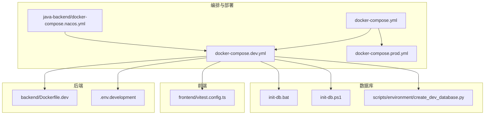
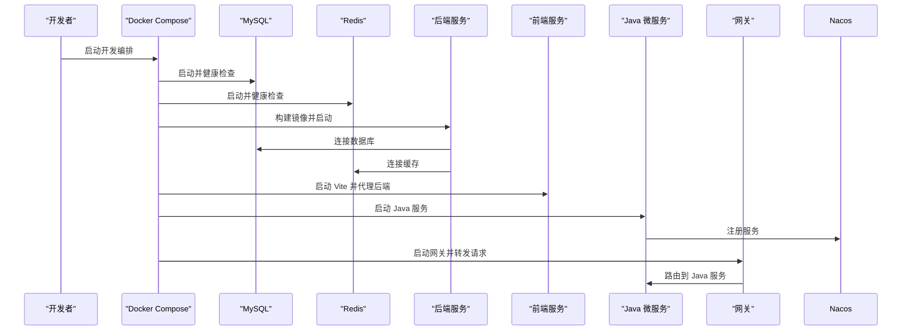
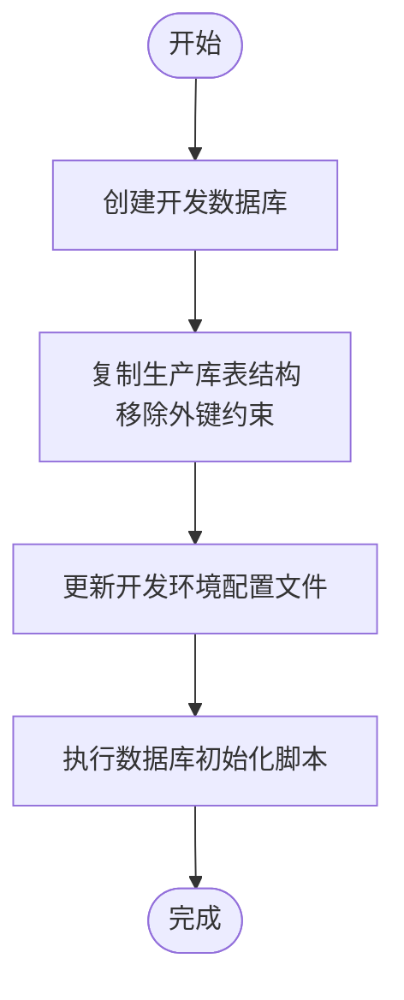
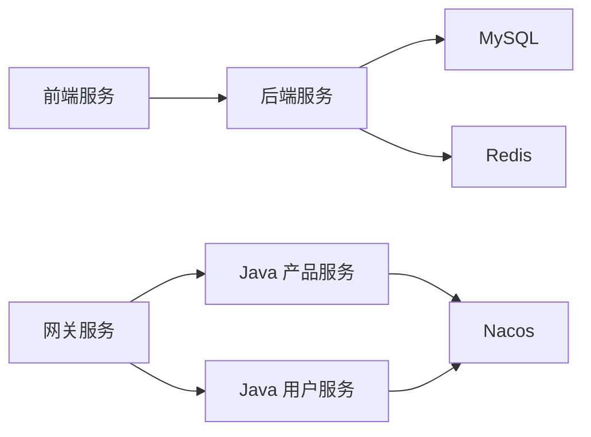

# 测试环境管理

<cite>
**本文引用的文件**
- [docker-compose.dev.yml](file://docker-compose.dev.yml)
- [docker-compose.yml](file://docker-compose.yml)
- [Dockerfile.dev](file://backend/Dockerfile.dev)
- [create_dev_database.py](file://scripts/environment/create_dev_database.py)
- [setup_dev_environment.py](file://scripts/environment/setup_dev_environment.py)
- [vitest.config.ts](file://frontend/vitest.config.ts)
- [.env.development](file://config/.env.development)
- [docker-compose.base.yml](file://docker-compose.base.yml)
- [docker-compose.prod.yml](file://docker-compose.prod.yml)
- [docker-compose.prod-simple.yml](file://docker-compose.prod-simple.yml)
- [init-db.bat](file://init-db.bat)
- [init-db.ps1](file://init-db.ps1)
- [ci.yml](file://.github/workflows/ci.yml)
- [docker-compose.nacos.yml](file://java-backend/docker-compose.nacos.yml)
</cite>

## 目录
1. [引言](#引言)
2. [项目结构](#项目结构)
3. [核心组件](#核心组件)
4. [架构总览](#架构总览)
5. [详细组件分析](#详细组件分析)
6. [依赖关系分析](#依赖关系分析)
7. [性能考虑](#性能考虑)
8. [故障排查指南](#故障排查指南)
9. [结论](#结论)
10. [附录](#附录)

## 引言
本文件面向“思觉智贸”项目的测试环境管理，目标是提供一套完整、可重复、可自动化的测试环境搭建与运维方案。内容涵盖：
- Docker 容器化测试环境的搭建与配置
- 数据库测试环境与数据隔离策略
- 外部服务 Mock 与依赖服务管理
- 测试数据生成、同步与清理策略
- 环境变量配置与环境隔离实施方案
- 自动化部署、环境切换与维护策略
- 稳定性与一致性保障方法

## 项目结构
测试环境相关的关键目录与文件：
- docker 编排：docker-compose.dev.yml、docker-compose.yml、docker-compose.prod.yml、docker-compose.prod-simple.yml、docker-compose.base.yml、java-backend/docker-compose.nacos.yml
- 后端镜像：backend/Dockerfile.dev
- 前端测试框架：frontend/vitest.config.ts
- 环境初始化与数据库隔离：scripts/environment/create_dev_database.py、scripts/environment/setup_dev_environment.py、config/.env.development
- 数据库初始化脚本：init-db.bat、init-db.ps1
- CI 流水线：.github/workflows/ci.yml



图表来源
- [docker-compose.dev.yml:1-224](file://docker-compose.dev.yml#L1-L224)
- [docker-compose.yml:1-36](file://docker-compose.yml#L1-L36)
- [Dockerfile.dev:1-11](file://backend/Dockerfile.dev#L1-L11)
- [vitest.config.ts:1-32](file://frontend/vitest.config.ts#L1-L32)
- [create_dev_database.py:1-104](file://scripts/environment/create_dev_database.py#L1-L104)
- [init-db.bat](file://init-db.bat)
- [init-db.ps1](file://init-db.ps1)
- [docker-compose.nacos.yml](file://java-backend/docker-compose.nacos.yml)

章节来源
- [docker-compose.dev.yml:1-224](file://docker-compose.dev.yml#L1-L224)
- [docker-compose.yml:1-36](file://docker-compose.yml#L1-L36)
- [Dockerfile.dev:1-11](file://backend/Dockerfile.dev#L1-L11)
- [vitest.config.ts:1-32](file://frontend/vitest.config.ts#L1-L32)
- [create_dev_database.py:1-104](file://scripts/environment/create_dev_database.py#L1-L104)
- [init-db.bat](file://init-db.bat)
- [init-db.ps1](file://init-db.ps1)
- [docker-compose.nacos.yml](file://java-backend/docker-compose.nacos.yml)

## 核心组件
- Docker Compose 编排：通过多文件叠加的方式，将基础设施模板与环境覆盖组合，形成开发/生产等不同运行形态。
- 后端开发镜像：基于基础镜像，启用健康检查与热重载，便于本地快速迭代。
- 前端测试框架：Vitest 配置用于单元测试与覆盖率统计，支持 jsdom 环境与别名路径。
- 数据库隔离与初始化：通过脚本创建独立数据库并复制表结构，同时更新环境变量以实现完全隔离。
- 外部服务与依赖：Nacos 注册中心、Java 微服务网关与业务服务，均在开发编排中统一管理。

章节来源
- [docker-compose.dev.yml:1-224](file://docker-compose.dev.yml#L1-L224)
- [Dockerfile.dev:1-11](file://backend/Dockerfile.dev#L1-L11)
- [vitest.config.ts:1-32](file://frontend/vitest.config.ts#L1-L32)
- [create_dev_database.py:1-104](file://scripts/environment/create_dev_database.py#L1-L104)

## 架构总览
下图展示了测试环境的容器化架构与服务交互关系，强调数据库、缓存、后端、前端以及 Java 微服务与网关之间的依赖与端口映射。

```mermaid
graph TB
subgraph "测试环境容器"
MySQL["MySQL 8.0<br/>端口: 3307 -> 3306"]
Redis["Redis 7<br/>端口: 6379"]
Backend["后端服务<br/>端口: 8090 -> 8090"]
Frontend["前端服务(Vite)<br/>端口: 8179"]
JavaProduct["Java 产品服务<br/>端口: 8002"]
JavaUser["Java 用户服务<br/>端口: 8001"]
Gateway["网关服务<br/>端口: 9000"]
Nacos["Nacos 注册中心<br/>端口: 8848/9848"]
end
MySQL <- --> Backend
Redis <- --> Backend
Backend <- --> Frontend
Backend <- --> JavaProduct
Backend <- --> JavaUser
JavaProduct <- --> Gateway
JavaUser <- --> Gateway
Gateway <- --> Nacos
Nacos <- --> JavaProduct
Nacos <- --> JavaUser
```

图表来源
- [docker-compose.dev.yml:6-224](file://docker-compose.dev.yml#L6-L224)

## 详细组件分析

### Docker 容器化测试环境
- 基础设施模板：基础编排文件定义了 MySQL 与 Redis 的通用配置，供开发/生产等环境叠加使用。
- 开发环境编排：在开发编排中，新增后端、前端、Java 微服务、网关与 Nacos，并通过 volumes 将源码与缓存持久化，便于热重载与数据保留。
- 端口与网络：开发环境为各服务分配独立宿主机端口，避免冲突；通过 depends_on 与健康检查保证启动顺序与可用性。
- Java 微服务与网关：通过 Maven 镜像直接运行 Spring Boot 应用，连接同一网络内的 MySQL/Redis/Nacos。



图表来源
- [docker-compose.dev.yml:40-224](file://docker-compose.dev.yml#L40-L224)

章节来源
- [docker-compose.yml:1-36](file://docker-compose.yml#L1-L36)
- [docker-compose.dev.yml:1-224](file://docker-compose.dev.yml#L1-L224)

### 数据库测试环境与隔离策略
- 独立数据库：通过脚本创建开发专用数据库，并复制生产库的表结构（移除外键约束），确保开发环境可独立演进。
- 环境变量更新：脚本自动修改开发环境配置文件中的数据库名称，实现完全的环境隔离。
- 初始化脚本：提供 Windows 批处理与 PowerShell 脚本，用于一键初始化数据库与迁移。



图表来源
- [create_dev_database.py:12-74](file://scripts/environment/create_dev_database.py#L12-L74)

章节来源
- [create_dev_database.py:1-104](file://scripts/environment/create_dev_database.py#L1-104)
- [init-db.bat](file://init-db.bat)
- [init-db.ps1](file://init-db.ps1)

### 外部服务与依赖服务管理
- Nacos 注册中心：在开发环境中启用，Java 微服务通过其进行注册与发现。
- 网关服务：开发环境关闭鉴权，便于联调；生产环境需按配置开启鉴权。
- 依赖声明：通过 depends_on 与健康检查确保 MySQL/Redis/Nacos 等依赖先于业务服务启动。

章节来源
- [docker-compose.dev.yml:105-213](file://docker-compose.dev.yml#L105-L213)
- [docker-compose.nacos.yml](file://java-backend/docker-compose.nacos.yml)

### 测试数据管理策略
- 生成：可在数据库初始化阶段或开发环境脚本中插入测试数据，确保测试场景覆盖。
- 同步：通过脚本从生产库复制表结构，保证测试环境与生产库结构一致（不含外键）。
- 清理：提供清理脚本与批量清理任务，定期清理测试数据与临时文件，避免污染。

章节来源
- [create_dev_database.py:34-62](file://scripts/environment/create_dev_database.py#L34-L62)
- [scripts/environment/setup_dev_environment.py:81-102](file://scripts/environment/setup_dev_environment.py#L81-L102)

### 环境变量配置与隔离
- 开发环境变量：在开发编排中显式设置数据库、缓存、密钥等环境变量，确保与生产隔离。
- 配置文件更新：脚本自动替换配置文件中的数据库名称，避免手动修改带来的错误。
- 端口与代理：前端通过环境变量代理后端地址，开发环境可直连后端或经网关转发。

章节来源
- [docker-compose.dev.yml:46-94](file://docker-compose.dev.yml#L46-L94)
- [create_dev_database.py:76-90](file://scripts/environment/create_dev_database.py#L76-L90)
- [vitest.config.ts:85-94](file://frontend/vitest.config.ts#L85-L94)

### 自动化部署、环境切换与维护
- 多环境叠加：通过基础编排与环境覆盖文件组合，实现开发/生产的快速切换。
- CI 集成：GitHub Actions 流水线可用于自动化测试与构建，建议扩展为包含测试环境部署的任务。
- 维护策略：定期清理卷与缓存、滚动更新镜像版本、监控健康检查状态。

章节来源
- [docker-compose.yml:1-36](file://docker-compose.yml#L1-L36)
- [docker-compose.dev.yml:1-24](file://docker-compose.dev.yml#L1-L24)
- [ci.yml](file://.github/workflows/ci.yml)

## 依赖关系分析
- 组件耦合：后端依赖 MySQL 与 Redis；前端依赖后端 API；Java 微服务依赖 Nacos 与数据库；网关作为统一入口。
- 直接依赖：后端与数据库、缓存；前端与后端；Java 服务与 Nacos。
- 外部依赖：Nacos 注册中心、MySQL、Redis、JVM 运行时。



图表来源
- [docker-compose.dev.yml:40-213](file://docker-compose.dev.yml#L40-L213)

章节来源
- [docker-compose.dev.yml:40-213](file://docker-compose.dev.yml#L40-L213)

## 性能考虑
- 热重载与开发体验：后端镜像启用 reload，前端使用 Vite，提升迭代效率。
- 资源限制：Java 微服务通过 JVM 参数限制内存，避免资源争用。
- 健康检查：对数据库与缓存设置健康检查，降低启动失败风险。
- 卷与缓存：持久化卷减少重复构建与数据丢失，但需定期清理。

章节来源
- [Dockerfile.dev:7-10](file://backend/Dockerfile.dev#L7-L10)
- [docker-compose.dev.yml:108-120](file://docker-compose.dev.yml#L108-L120)
- [docker-compose.dev.yml:20-38](file://docker-compose.dev.yml#L20-L38)

## 故障排查指南
- 数据库连接失败：检查开发编排中的数据库端口映射与环境变量是否正确，确认健康检查状态。
- 前端无法访问后端：确认前端代理配置与后端端口映射，检查 CORS 与网关路由。
- Java 服务启动异常：查看 Nacos 是否可用，确认数据库连接参数与 JVM 参数。
- 健康检查失败：查看容器日志，确认服务监听端口与启动命令。

章节来源
- [docker-compose.dev.yml:20-38](file://docker-compose.dev.yml#L20-L38)
- [docker-compose.dev.yml:108-120](file://docker-compose.dev.yml#L108-L120)

## 结论
本测试环境管理方案通过 Docker 多文件编排、独立数据库隔离、前端测试框架与外部服务统一管理，实现了可重复、可扩展且稳定的测试环境。配合自动化部署与维护策略，能够有效保障测试环境的一致性与可靠性。

## 附录
- 环境切换命令示例（基于编排文件组合）：开发环境与生产环境均可通过叠加基础模板与环境覆盖文件实现快速切换。
- 建议：在 CI 中增加测试环境部署步骤，结合健康检查与覆盖率报告，持续改进测试质量。