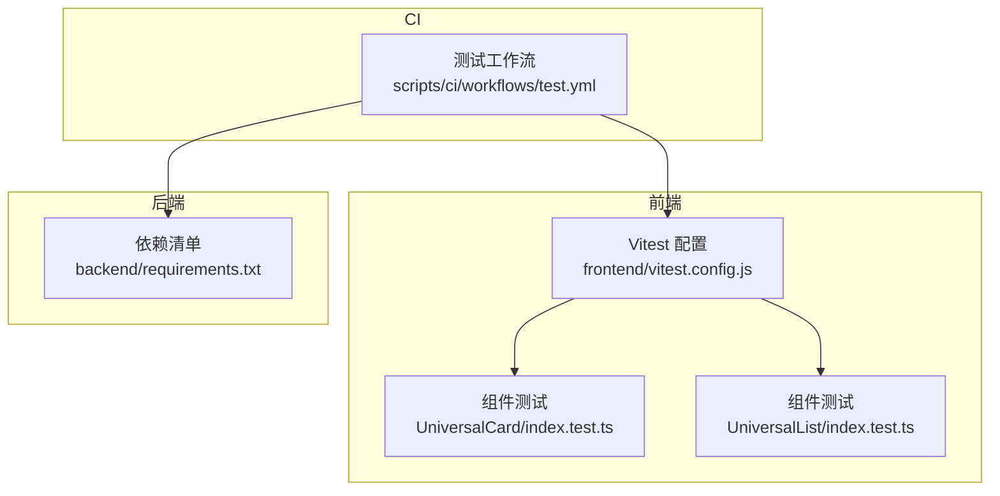
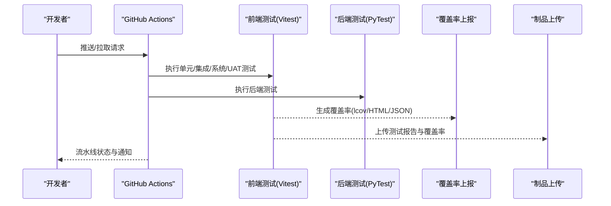
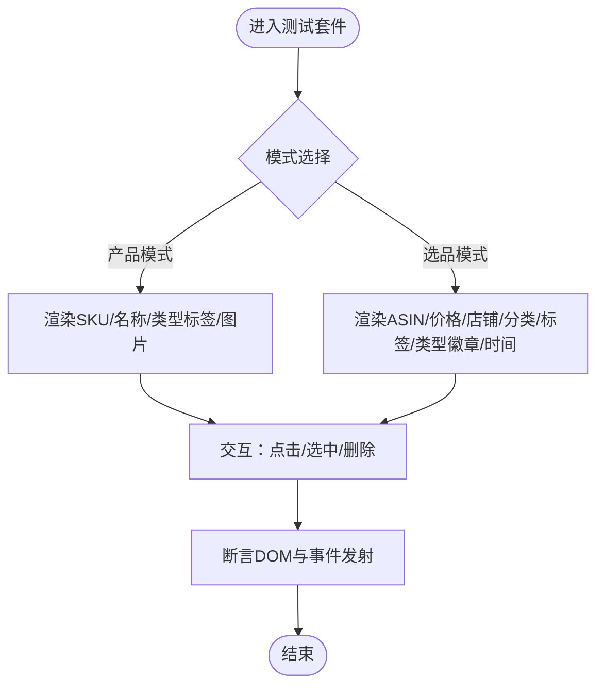
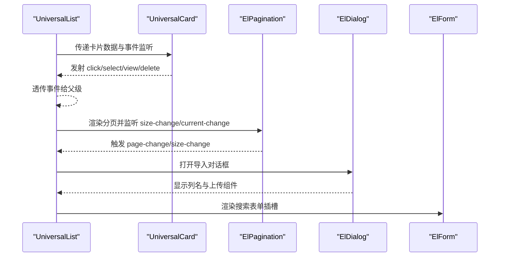
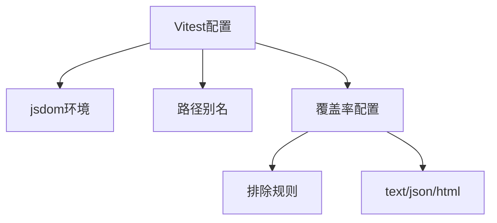
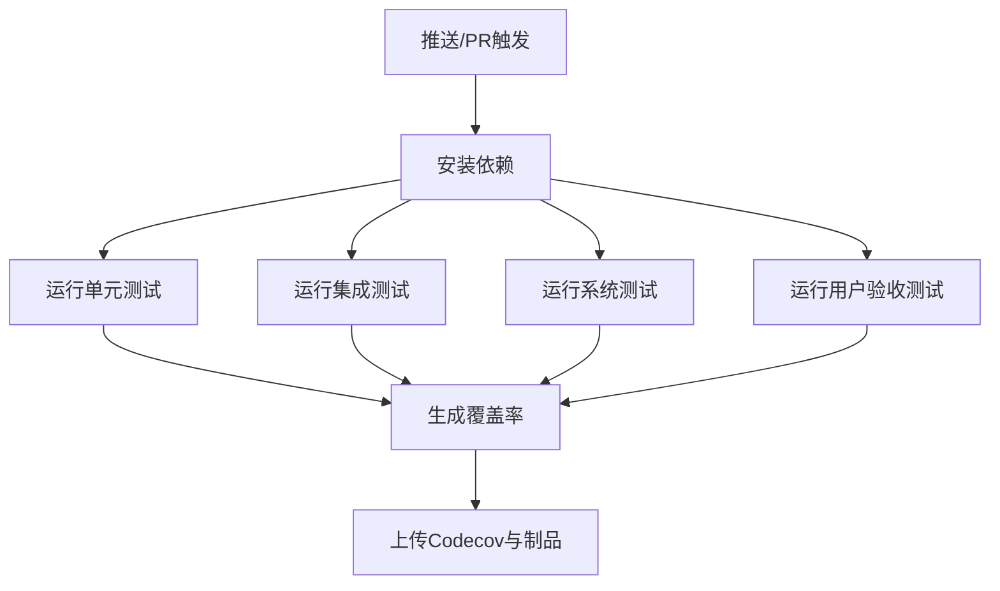
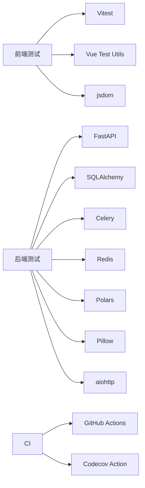

# 测试策略

<cite>
**本文引用的文件**
- [frontend/vitest.config.js](file://frontend/vitest.config.js)
- [frontend/vitest.config.ts](file://frontend/vitest.config.ts)
- [frontend/src/components/UniversalCard/index.test.ts](file://frontend/src/components/UniversalCard/index.test.ts)
- [frontend/src/components/UniversalList/index.test.ts](file://frontend/src/components/UniversalList/index.test.ts)
- [scripts/ci/workflows/test.yml](file://scripts/ci/workflows/test.yml)
- [backend/requirements.txt](file://backend/requirements.txt)
</cite>

## 目录
1. [引言](#引言)
2. [项目结构](#项目结构)
3. [核心组件](#核心组件)
4. [架构总览](#架构总览)
5. [详细组件分析](#详细组件分析)
6. [依赖分析](#依赖分析)
7. [性能考虑](#性能考虑)
8. [故障排查指南](#故障排查指南)
9. [结论](#结论)
10. [附录](#附录)

## 引言
本测试策略面向“思觉智贸”项目，覆盖前端单元测试、后端Python测试、数据库迁移脚本测试、以及CI流水线中的自动化测试与覆盖率上报。策略明确测试层级划分（单元、集成、系统、用户验收）、测试框架与配置（Vitest、PyTest等）、测试用例编写规范、Mock策略、API/UI/数据库测试实施方案，并给出持续集成中的自动化流程与覆盖率门槛建议。

## 项目结构
项目采用前后端分离架构，前端基于Vue生态与Vitest进行单元测试；后端以FastAPI为核心，配合Celery任务队列与MySQL/Redis/Qdrant等基础设施；CI通过GitHub Actions执行多阶段测试与覆盖率收集。

**图表来源**
- [frontend/vitest.config.js:1-54](file://frontend/vitest.config.js#L1-L54)
- [frontend/src/components/UniversalCard/index.test.ts:1-409](file://frontend/src/components/UniversalCard/index.test.ts#L1-L409)
- [frontend/src/components/UniversalList/index.test.ts:1-437](file://frontend/src/components/UniversalList/index.test.ts#L1-L437)
- [scripts/ci/workflows/test.yml:1-144](file://scripts/ci/workflows/test.yml#L1-L144)
- [backend/requirements.txt:1-35](file://backend/requirements.txt#L1-L35)

**章节来源**
- [frontend/vitest.config.js:1-54](file://frontend/vitest.config.js#L1-L54)
- [frontend/vitest.config.ts:1-32](file://frontend/vitest.config.ts#L1-L32)
- [scripts/ci/workflows/test.yml:1-144](file://scripts/ci/workflows/test.yml#L1-L144)
- [backend/requirements.txt:1-35](file://backend/requirements.txt#L1-L35)

## 核心组件
- 前端测试框架与配置
  - Vitest配置启用jsdom环境、全局钩子、别名路径与覆盖率统计，支持TypeScript与Vue组件测试。
  - 组件测试覆盖渲染、事件、交互、分页、导入弹窗、搜索插槽等场景。
- 后端测试与依赖
  - 后端依赖清单包含FastAPI、SQLAlchemy、Celery、Redis、Polars、Pillow等，为API与数据处理服务提供支撑。
- CI测试工作流
  - 覆盖单元、集成、系统、用户验收四类测试，收集覆盖率并上传至Codecov与制品库。

**章节来源**
- [frontend/vitest.config.js:1-54](file://frontend/vitest.config.js#L1-L54)
- [frontend/src/components/UniversalCard/index.test.ts:1-409](file://frontend/src/components/UniversalCard/index.test.ts#L1-L409)
- [frontend/src/components/UniversalList/index.test.ts:1-437](file://frontend/src/components/UniversalList/index.test.ts#L1-L437)
- [scripts/ci/workflows/test.yml:1-144](file://scripts/ci/workflows/test.yml#L1-L144)
- [backend/requirements.txt:1-35](file://backend/requirements.txt#L1-L35)

## 架构总览
下图展示从CI触发到测试执行、覆盖率与制品上传的整体流程。

**图表来源**
- [scripts/ci/workflows/test.yml:1-144](file://scripts/ci/workflows/test.yml#L1-L144)

## 详细组件分析

### 前端组件测试：UniversalCard
- 测试范围
  - 产品/选品两种模式下的渲染差异与数据绑定
  - 选中状态、点击事件、删除按钮事件、查看按钮事件
  - 图片回退与缩略图优先策略
  - 时间格式化（刚刚/小时前/天前）
  - 复选框选中/取消触发的事件
- Mock策略
  - 使用本地测试数据对象模拟产品/选品数据
  - 使用Vue Test Utils挂载组件并断言DOM与事件发射
- 覆盖度关注点
  - 分支覆盖：不同模式、按钮可见性、图片路径分支
  - 函数/语句覆盖：事件处理与格式化逻辑

**图表来源**
- [frontend/src/components/UniversalCard/index.test.ts:1-409](file://frontend/src/components/UniversalCard/index.test.ts#L1-L409)

**章节来源**
- [frontend/src/components/UniversalCard/index.test.ts:1-409](file://frontend/src/components/UniversalCard/index.test.ts#L1-L409)

### 前端组件测试：UniversalList
- 测试范围
  - 列表标题、卡片渲染、加载态、空态
  - 按钮显隐控制（添加/导入/下载/删除/回收站）
  - 分页组件currentPage/pageSize/total与事件
  - 导入对话框（列名说明、上传组件）
  - 搜索表单插槽渲染
  - 卡片事件透传（点击/选中/查看/删除）
- Mock策略
  - 使用本地数组模拟items，props注入分页与按钮开关
  - 通过$emit触发子组件事件并断言父组件事件发射
- 覆盖度关注点
  - 分页变更、按钮禁用条件、对话框打开与列名展示

**图表来源**
- [frontend/src/components/UniversalList/index.test.ts:1-437](file://frontend/src/components/UniversalList/index.test.ts#L1-L437)

**章节来源**
- [frontend/src/components/UniversalList/index.test.ts:1-437](file://frontend/src/components/UniversalList/index.test.ts#L1-L437)

### Vitest配置与覆盖率
- 环境与别名
  - jsdom环境、globals启用、setupFiles引入
  - 路径别名@/@components/@views/@stores/@api/@utils/@styles/@types
- 覆盖率
  - provider为v8，输出text/json/html
  - 排除node_modules/dist/build/coverage/tests等目录
  - 可配置lines/functions/branches/statements阈值（如需）

**图表来源**
- [frontend/vitest.config.js:1-54](file://frontend/vitest.config.js#L1-L54)
- [frontend/vitest.config.ts:1-32](file://frontend/vitest.config.ts#L1-L32)

**章节来源**
- [frontend/vitest.config.js:1-54](file://frontend/vitest.config.js#L1-L54)
- [frontend/vitest.config.ts:1-32](file://frontend/vitest.config.ts#L1-L32)

### CI测试工作流
- 触发条件
  - 推送到main/develop或手动触发
- 步骤
  - 检出代码、安装依赖、运行各类测试（单元/集成/系统/UAT）
  - 生成覆盖率并上传Codecov与制品（HTML/JSON）
  - 并行测试作业与环境一致性校验（Python脚本）
- 质量门禁建议
  - 覆盖率阈值：建议lines/functions/branches/statements均不低于80%
  - 失败即阻断（fail_ci_if_error: true）或严格模式（--strict）

**图表来源**
- [scripts/ci/workflows/test.yml:1-144](file://scripts/ci/workflows/test.yml#L1-L144)

**章节来源**
- [scripts/ci/workflows/test.yml:1-144](file://scripts/ci/workflows/test.yml#L1-L144)

## 依赖分析
- 前端测试依赖
  - Vitest、@vue/test-utils、jsdom、Element Plus组件库
- 后端测试依赖
  - FastAPI、SQLAlchemy、Celery、Redis、Polars、Pillow、aiohttp等
- CI依赖
  - GitHub Actions、Codecov Action、NPM/Pip依赖管理

**图表来源**
- [backend/requirements.txt:1-35](file://backend/requirements.txt#L1-L35)

**章节来源**
- [backend/requirements.txt:1-35](file://backend/requirements.txt#L1-L35)

## 性能考虑
- 前端测试
  - 使用jsdom避免真实浏览器开销；对复杂动画/滚动场景可采用虚拟化或简化渲染
  - 将重资源（图片）替换为占位符，减少挂载成本
- 后端测试
  - 使用内存数据库/测试专用实例，避免真实IO
  - 对外部服务（COS/Redis）使用Mock或本地替代
- CI
  - 并行作业拆分测试任务，缩短总时长
  - 缓存依赖（npm ci/pip install）提升构建速度

## 故障排查指南
- Vitest无法识别别名或路径
  - 检查resolve.alias配置是否与实际源码路径一致
  - 确认setupFiles正确加载全局环境
- 覆盖率报告缺失
  - 确认覆盖率provider与输出格式配置正确
  - 检查exclude规则是否误排除了源码
- CI测试失败
  - 查看Artifacts中的HTML报告定位失败用例
  - 在本地复现失败用例，逐步缩小问题范围
- 环境一致性校验失败
  - 按照后端requirements.txt安装依赖
  - 使用环境一致性脚本生成报告并修正差异

**章节来源**
- [frontend/vitest.config.js:1-54](file://frontend/vitest.config.js#L1-L54)
- [scripts/ci/workflows/test.yml:1-144](file://scripts/ci/workflows/test.yml#L1-L144)
- [backend/requirements.txt:1-35](file://backend/requirements.txt#L1-L35)

## 结论
本策略明确了“思觉智贸”项目的测试分层、框架与配置、用例编写规范、Mock策略、API/UI/数据库测试实施方案，以及CI自动化流程与覆盖率门槛。建议在现有基础上完善后端PyTest用例、数据库迁移脚本测试与E2E测试矩阵，并持续优化覆盖率与测试执行效率。

## 附录
- 测试用例编写规范（建议）
  - 命名：describe块描述组件/模块职责，it块描述具体行为与期望
  - 数据：使用最小必要数据构造，避免冗余字段
  - 断言：优先断言DOM与事件发射，其次断言函数调用次数
  - Mock：对外部依赖统一Mock，保持测试隔离
- 测试数据管理
  - 前端：在测试文件内构造本地数据对象，避免依赖真实API
  - 后端：使用测试数据库快照或内存数据库，按需初始化种子数据
- 回归测试策略
  - 关键功能（列表/卡片/分页/导入/搜索）优先回归
  - 每次重大变更后执行全量测试集
- 持续集成最佳实践
  - 并行执行不同测试集，缩短反馈周期
  - 严格覆盖率门槛，逐步提升阈值
  - 失败即阻断，确保主干稳定