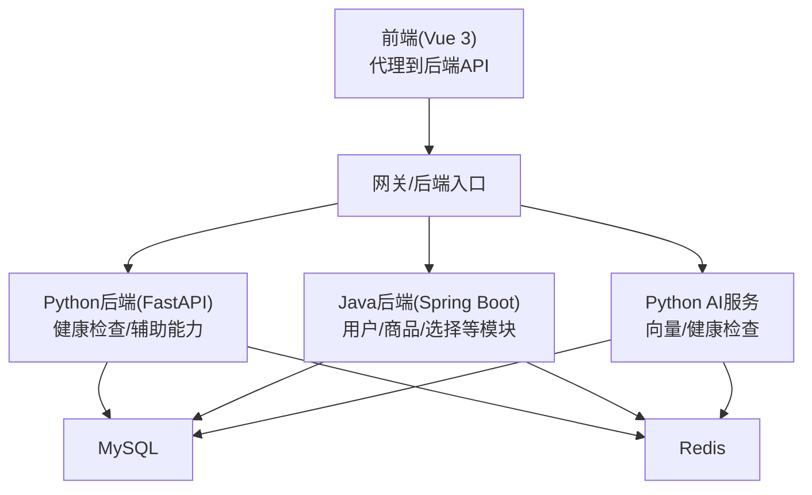
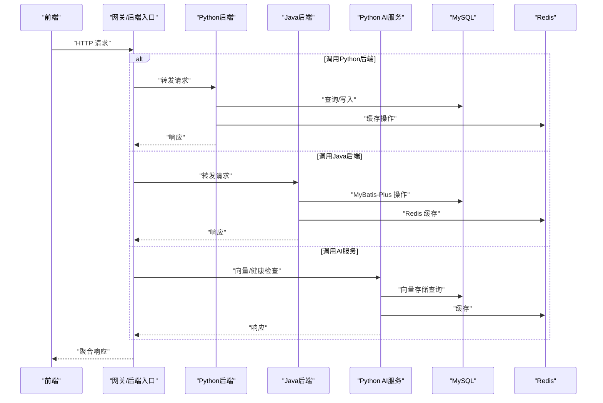
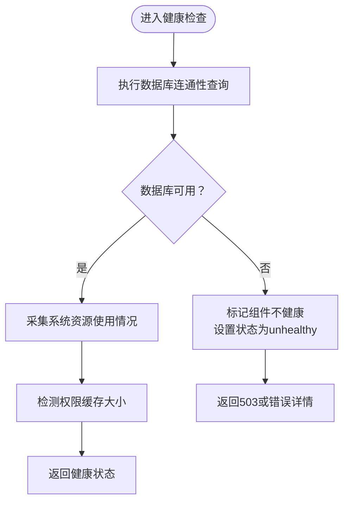
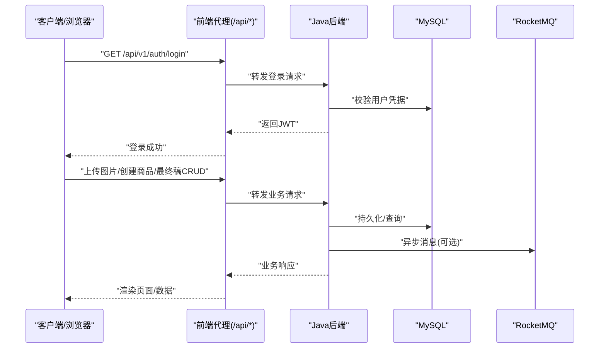
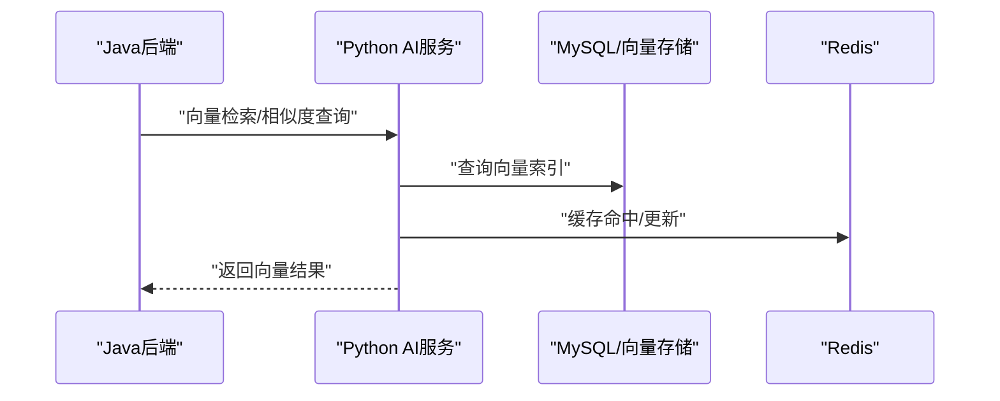
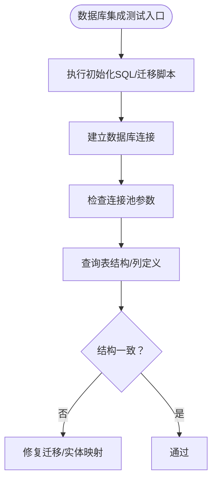
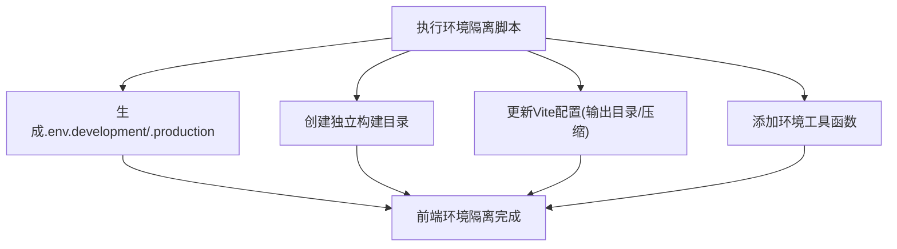
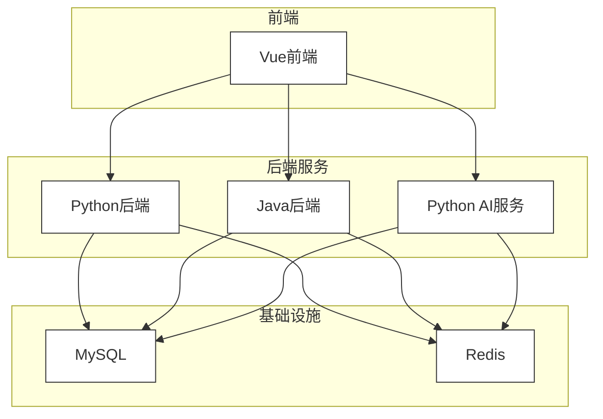

# 集成测试

<cite>
**本文引用的文件**
- [backend/app/api/v1/health.py](file://backend/app/api/v1/health.py)
- [java-backend/src/main/resources/application.yml](file://java-backend/src/main/resources/application.yml)
- [python-ai/app/main.py](file://python-ai/app/main.py)
- [docker-compose.yml](file://docker-compose.yml)
- [scripts/environment/setup_frontend_isolation.py](file://scripts/environment/setup_frontend_isolation.py)
- [openspec/changes/verify-java-backend-completeness/design.md](file://openspec/changes/verify-java-backend-completeness/design.md)
- [openspec/changes/microservices-migration/specs/independent-deployment/spec.md](file://openspec/changes/microservices-migration/specs/independent-deployment/spec.md)
- [scripts/environment/create_dev_database.py](file://scripts/environment/create_dev_database.py)
- [scripts/ci/workflows/test.yml](file://scripts/ci/workflows/test.yml)
</cite>

## 目录
1. [引言](#引言)
2. [项目结构](#项目结构)
3. [核心组件](#核心组件)
4. [架构总览](#架构总览)
5. [详细组件分析](#详细组件分析)
6. [依赖关系分析](#依赖关系分析)
7. [性能考量](#性能考量)
8. [故障排查指南](#故障排查指南)
9. [结论](#结论)
10. [附录](#附录)

## 引言
本文件面向“思觉智贸”项目的集成测试实践，覆盖后端服务（Python FastAPI）、Java微服务（Spring Boot）、AI服务（Python AI）以及数据库与外部系统的协同验证。文档目标是：
- 明确API集成测试、微服务间通信测试与数据库集成测试的实施方法
- 规范测试环境搭建、测试数据准备与外部服务Mock策略
- 给出后端服务、AI服务与Java微服务的集成测试实施方案
- 设计测试用例、测试数据同步与环境隔离策略
- 确保各服务模块协同工作的正确性

## 项目结构
项目采用多语言混合架构，包含：
- Python后端（FastAPI）：提供部分API与健康检查
- Java后端（Spring Boot）：作为主要业务服务，提供用户、商品、选择等模块
- Python AI服务：提供向量检索与健康检查
- 数据库与缓存：MySQL与Redis
- 前端：Vue 3 + Vite，通过代理访问后端API
- CI/CD：GitHub Actions工作流进行测试与环境一致性校验

图表来源
- [docker-compose.yml:7-36](file://docker-compose.yml#L7-L36)
- [java-backend/src/main/resources/application.yml:25-75](file://java-backend/src/main/resources/application.yml#L25-L75)
- [python-ai/app/main.py:11-26](file://python-ai/app/main.py#L11-L26)
- [backend/app/api/v1/health.py:19-120](file://backend/app/api/v1/health.py#L19-L120)

章节来源
- [docker-compose.yml:1-36](file://docker-compose.yml#L1-L36)
- [java-backend/src/main/resources/application.yml:1-258](file://java-backend/src/main/resources/application.yml#L1-L258)
- [python-ai/app/main.py:1-51](file://python-ai/app/main.py#L1-L51)
- [backend/app/api/v1/health.py:1-189](file://backend/app/api/v1/health.py#L1-L189)

## 核心组件
- Python后端健康检查API：用于验证数据库连通性与系统资源状态，便于集成测试中快速定位后端异常
- Java后端配置：集中管理数据库、缓存、限流、熔断、MQ、监控等，支撑微服务间通信与稳定性
- Python AI服务：提供向量检索与健康检查，支持与Java后端的AI能力集成
- 健康检查与数据库集成：通过统一的健康检查接口验证数据库可用性与响应时间
- 前端环境隔离：通过脚本生成不同环境的配置与构建产物，避免环境串扰

章节来源
- [backend/app/api/v1/health.py:37-120](file://backend/app/api/v1/health.py#L37-L120)
- [java-backend/src/main/resources/application.yml:25-120](file://java-backend/src/main/resources/application.yml#L25-L120)
- [python-ai/app/main.py:29-41](file://python-ai/app/main.py#L29-L41)
- [scripts/environment/setup_frontend_isolation.py:10-221](file://scripts/environment/setup_frontend_isolation.py#L10-L221)

## 架构总览
下图展示集成测试关注的关键交互路径：前端调用后端API，后端访问数据库与缓存；Java后端与Python AI服务通过配置互通；健康检查贯穿整体链路。

图表来源
- [java-backend/src/main/resources/application.yml:25-120](file://java-backend/src/main/resources/application.yml#L25-L120)
- [python-ai/app/main.py:11-26](file://python-ai/app/main.py#L11-L26)
- [backend/app/api/v1/health.py:70-83](file://backend/app/api/v1/health.py#L70-L83)

## 详细组件分析

### 后端服务集成测试（Python FastAPI）
- 测试目标
  - 验证健康检查接口对数据库连通性的探测能力
  - 验证API响应时间与错误回退逻辑
  - 验证系统资源监控（在具备psutil时）
- 关键点
  - 健康检查会执行简单SQL以确认数据库可用
  - 若数据库不可用，整体健康状态降级为不健康
  - 可扩展：在测试中注入模拟仓库以避免真实数据库依赖

图表来源
- [backend/app/api/v1/health.py:70-118](file://backend/app/api/v1/health.py#L70-L118)

章节来源
- [backend/app/api/v1/health.py:37-120](file://backend/app/api/v1/health.py#L37-L120)

### Java微服务集成测试
- 测试目标
  - 验证Java后端配置（数据库、缓存、限流、熔断、MQ、监控）在集成环境中的正确性
  - 验证登录链路与核心业务流程（上传图片→本地保存→DB记录URL）
  - 验证前端页面在代理模式下的API调用无错误
- 关键点
  - 应用配置集中于application.yml，包含数据源、Redis、JWT、RocketMQ、Actuator监控等
  - 通过CI工作流运行环境一致性检查，确保测试环境稳定
  - 建议使用独立数据库与环境隔离脚本，避免测试污染

图表来源
- [openspec/changes/verify-java-backend-completeness/design.md:34-44](file://openspec/changes/verify-java-backend-completeness/design.md#L34-L44)
- [java-backend/src/main/resources/application.yml:25-120](file://java-backend/src/main/resources/application.yml#L25-L120)

章节来源
- [openspec/changes/verify-java-backend-completeness/design.md:1-57](file://openspec/changes/verify-java-backend-completeness/design.md#L1-L57)
- [java-backend/src/main/resources/application.yml:1-258](file://java-backend/src/main/resources/application.yml#L1-L258)
- [scripts/ci/workflows/test.yml:110-143](file://scripts/ci/workflows/test.yml#L110-L143)

### AI服务集成测试（Python AI）
- 测试目标
  - 验证AI服务健康检查与向量检索能力
  - 验证与Java后端的交互（如向量服务调用）
- 关键点
  - AI服务通过配置项指向Python AI服务的URL
  - 建议在测试环境中启用Mock或本地向量存储，避免外部依赖波动

图表来源
- [python-ai/app/main.py:11-26](file://python-ai/app/main.py#L11-L26)
- [java-backend/src/main/resources/application.yml:246-251](file://java-backend/src/main/resources/application.yml#L246-L251)

章节来源
- [python-ai/app/main.py:1-51](file://python-ai/app/main.py#L1-L51)
- [java-backend/src/main/resources/application.yml:246-251](file://java-backend/src/main/resources/application.yml#L246-L251)

### 数据库集成测试
- 测试目标
  - 验证数据库连通性、连接池状态与表结构
  - 验证迁移脚本与初始化SQL的一致性
- 关键点
  - 健康检查会列出数据库表数量与名称，便于快速核对
  - 建议在测试前执行初始化SQL与迁移脚本，确保表结构一致

图表来源
- [backend/app/api/v1/health.py:152-175](file://backend/app/api/v1/health.py#L152-L175)

章节来源
- [backend/app/api/v1/health.py:131-179](file://backend/app/api/v1/health.py#L131-L179)

### 测试环境搭建与隔离
- 前端环境隔离
  - 通过脚本生成开发/生产环境的.env文件与构建目录
  - 支持独立的API基础URL与日志级别
- 开发数据库隔离
  - 自动创建独立数据库（如sijuelishi_dev），避免与生产数据冲突
- Docker编排
  - 使用Compose定义MySQL与Redis的健康检查，保障基础设施可用

图表来源
- [scripts/environment/setup_frontend_isolation.py:10-221](file://scripts/environment/setup_frontend_isolation.py#L10-L221)

章节来源
- [scripts/environment/setup_frontend_isolation.py:1-221](file://scripts/environment/setup_frontend_isolation.py#L1-L221)
- [scripts/environment/create_dev_database.py:73-104](file://scripts/environment/create_dev_database.py#L73-L104)
- [docker-compose.yml:7-36](file://docker-compose.yml#L7-L36)

### 测试数据准备与同步
- 建议策略
  - 使用初始化SQL与迁移脚本在测试数据库中预置基础数据
  - 对于需要向量数据的场景，准备小批量样本并注入向量存储
  - 使用独立数据库与环境变量区分开发/测试/生产数据
- 同步策略
  - 在CI中执行环境一致性检查，确保测试环境与预期一致
  - 对于前端，通过环境脚本自动切换API地址，避免手工配置误差

章节来源
- [scripts/environment/create_dev_database.py:73-104](file://scripts/environment/create_dev_database.py#L73-L104)
- [scripts/ci/workflows/test.yml:120-122](file://scripts/ci/workflows/test.yml#L120-L122)

### 外部服务Mock与降级
- 健康检查与降级
  - 当数据库不可用时，健康检查返回非健康状态，便于测试快速失败
- 前端Mock
  - 前端侧可通过Mock拦截API，模拟外部服务响应，降低对外部依赖的耦合
- AI服务降级
  - 在测试环境中启用Mock或本地向量存储，避免外部AI服务波动影响测试稳定性

章节来源
- [backend/app/api/v1/health.py:77-82](file://backend/app/api/v1/health.py#L77-L82)
- [python-ai/app/main.py:17-23](file://python-ai/app/main.py#L17-L23)

## 依赖关系分析
- 组件耦合
  - Java后端依赖数据库、缓存、消息队列与监控组件
  - Python后端与AI服务分别依赖数据库与缓存
  - 前端通过代理访问后端API，减少跨域与环境差异带来的复杂性
- 外部依赖
  - Docker Compose提供MySQL与Redis的健康检查
  - CI工作流负责环境一致性验证与测试结果上报

图表来源
- [docker-compose.yml:7-36](file://docker-compose.yml#L7-L36)
- [java-backend/src/main/resources/application.yml:25-120](file://java-backend/src/main/resources/application.yml#L25-L120)
- [python-ai/app/main.py:11-26](file://python-ai/app/main.py#L11-L26)

章节来源
- [docker-compose.yml:1-36](file://docker-compose.yml#L1-L36)
- [java-backend/src/main/resources/application.yml:1-258](file://java-backend/src/main/resources/application.yml#L1-L258)
- [python-ai/app/main.py:1-51](file://python-ai/app/main.py#L1-L51)

## 性能考量
- 健康检查响应时间
  - 健康检查会统计API与数据库的响应时间，可用于性能基线与回归对比
- 连接池与缓存
  - Java后端配置了连接池、缓存与限流参数，建议在集成测试中监控这些指标
- 并发与稳定性
  - 利用熔断器与限流器在高并发场景下保护系统，测试中应覆盖异常路径与恢复流程

章节来源
- [backend/app/api/v1/health.py:84-85](file://backend/app/api/v1/health.py#L84-L85)
- [java-backend/src/main/resources/application.yml:135-161](file://java-backend/src/main/resources/application.yml#L135-L161)

## 故障排查指南
- 健康检查失败
  - 检查数据库连通性与SQL执行是否报错
  - 查看系统资源监控日志（如具备psutil）
- Java后端异常
  - 检查应用配置（数据库、Redis、JWT、MQ、Actuator）
  - 关注CI工作流中的环境一致性检查结果
- 前端调用异常
  - 确认代理路径与API基础URL配置
  - 使用环境隔离脚本确保前后端端口与配置一致

章节来源
- [backend/app/api/v1/health.py:121-128](file://backend/app/api/v1/health.py#L121-L128)
- [java-backend/src/main/resources/application.yml:176-209](file://java-backend/src/main/resources/application.yml#L176-L209)
- [scripts/ci/workflows/test.yml:132-143](file://scripts/ci/workflows/test.yml#L132-L143)

## 结论
通过统一的健康检查、完善的Java后端配置、可扩展的Python AI服务与严格的环境隔离策略，本项目能够系统性地开展后端、AI与微服务的集成测试。建议在CI中持续运行环境一致性检查，并在测试中引入Mock与降级策略，以提升测试稳定性与效率。

## 附录
- 微服务独立部署与编排
  - 每个微服务拥有独立Docker镜像与Compose编排，支持独立扩展与健康检查
- 测试用例设计要点
  - 登录链路、文件上传与数据库记录、最终稿CRUD、素材/载体库批处理等核心流程
- 端到端验证
  - 前端页面导航与DevTools中API错误排查，确保无红字错误

章节来源
- [openspec/changes/microservices-migration/specs/independent-deployment/spec.md:1-23](file://openspec/changes/microservices-migration/specs/independent-deployment/spec.md#L1-L23)
- [openspec/changes/verify-java-backend-completeness/design.md:34-44](file://openspec/changes/verify-java-backend-completeness/design.md#L34-L44)