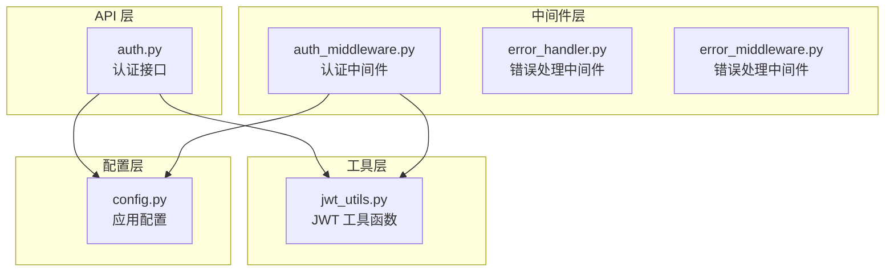
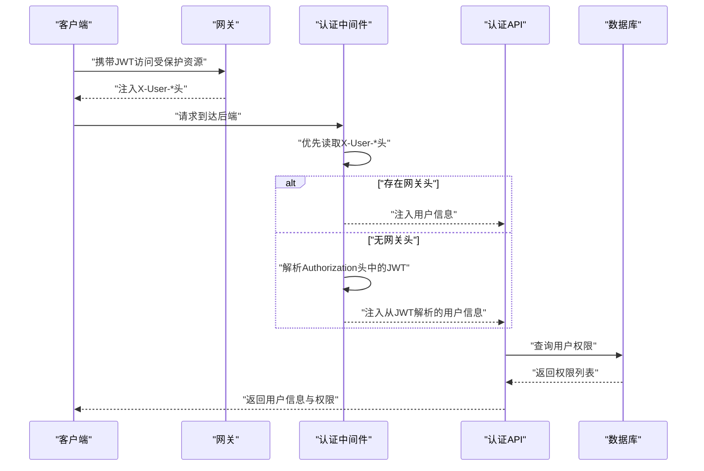
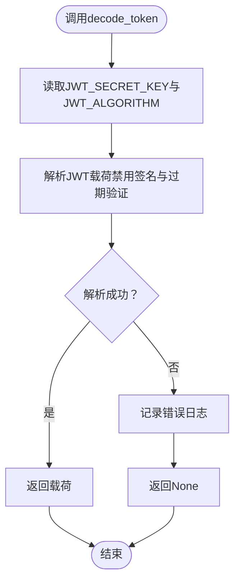
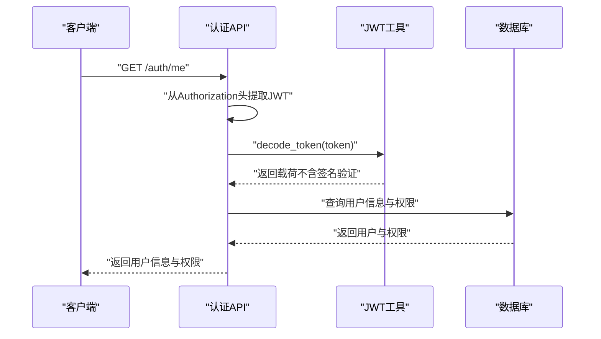
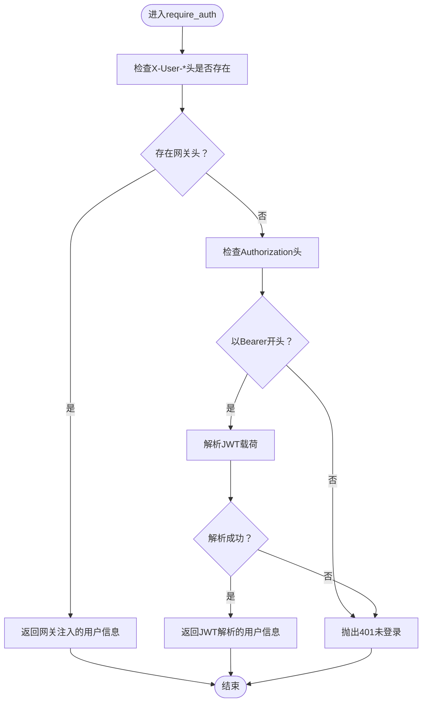
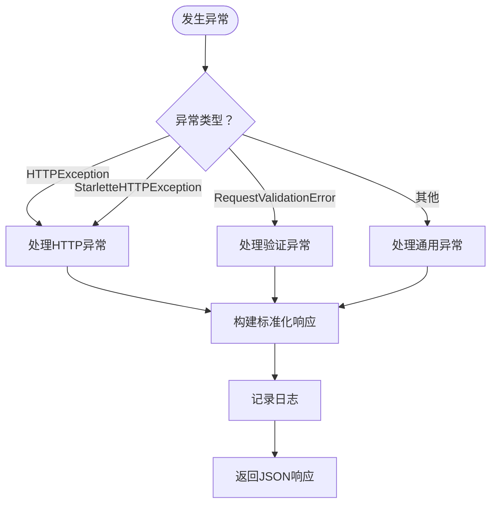
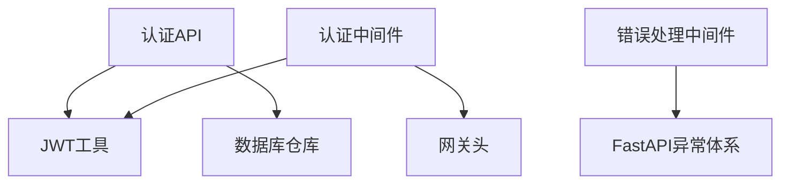

# 安全认证架构

<cite>
**本文档引用的文件**
- [jwt_utils.py](file://backend/app/utils/jwt_utils.py)
- [auth.py](file://backend/app/api/v1/auth.py)
- [auth_middleware.py](file://backend/app/middleware/auth_middleware.py)
- [error_handler.py](file://backend/app/middleware/error_handler.py)
- [error_middleware.py](file://backend/app/middleware/error_middleware.py)
</cite>

## 目录
1. [引言](#引言)
2. [项目结构](#项目结构)
3. [核心组件](#核心组件)
4. [架构概览](#架构概览)
5. [详细组件分析](#详细组件分析)
6. [依赖分析](#依赖分析)
7. [性能考虑](#性能考虑)
8. [故障排除指南](#故障排除指南)
9. [结论](#结论)
10. [附录](#附录)

## 引言
本文件针对思觉智贸系统的安全认证架构进行深入分析，重点覆盖以下方面：
- JWT 令牌认证机制：令牌生成、验证与刷新流程
- RBAC 权限模型：角色定义、权限分配与访问控制策略
- 中间件栈中的安全组件：认证中间件、权限检查与异常处理
- 会话管理、令牌黑名单与安全审计机制
- 安全配置最佳实践与常见安全威胁防护措施
- HTTPS 配置、CORS 策略与 CSRF 防护

本项目采用网关注入用户信息的架构设计，Python 后端通过 JWT 工具解析令牌并配合数据库查询完成用户信息与权限校验。

## 项目结构
后端安全相关的核心文件分布如下：
- 工具层：JWT 工具函数，负责令牌解析
- API 层：认证接口，提供用户信息查询与登出等能力
- 中间件层：认证中间件与错误处理中间件
- 配置层：应用配置与环境变量（如密钥）

**图表来源**
- [jwt_utils.py:1-30](file://backend/app/utils/jwt_utils.py#L1-L30)
- [auth.py:1-192](file://backend/app/api/v1/auth.py#L1-L192)
- [auth_middleware.py:1-40](file://backend/app/middleware/auth_middleware.py#L1-L40)
- [error_handler.py:1-100](file://backend/app/middleware/error_handler.py#L1-L100)
- [error_middleware.py:1-171](file://backend/app/middleware/error_middleware.py#L1-L171)

**章节来源**
- [jwt_utils.py:1-30](file://backend/app/utils/jwt_utils.py#L1-L30)
- [auth.py:1-192](file://backend/app/api/v1/auth.py#L1-L192)
- [auth_middleware.py:1-40](file://backend/app/middleware/auth_middleware.py#L1-L40)
- [error_handler.py:1-100](file://backend/app/middleware/error_handler.py#L1-L100)
- [error_middleware.py:1-171](file://backend/app/middleware/error_middleware.py#L1-L171)

## 核心组件
本节概述安全架构中的关键组件及其职责：
- JWT 工具函数：提供令牌解析能力，支持在 Python 后端解析 JWT 载荷（不验证签名）
- 认证 API：提供用户信息查询、登出等接口，依赖数据库获取用户权限
- 认证中间件：优先从网关注入的用户头获取用户信息；无网关头时回退到解析 Authorization 头中的 JWT
- 错误处理中间件：统一捕获与格式化异常，输出标准化错误响应

**章节来源**
- [jwt_utils.py:19-30](file://backend/app/utils/jwt_utils.py#L19-L30)
- [auth.py:112-192](file://backend/app/api/v1/auth.py#L112-L192)
- [auth_middleware.py:12-40](file://backend/app/middleware/auth_middleware.py#L12-L40)
- [error_handler.py:19-100](file://backend/app/middleware/error_handler.py#L19-L100)
- [error_middleware.py:18-171](file://backend/app/middleware/error_middleware.py#L18-L171)

## 架构概览
系统采用网关注入用户信息的认证模式：
- 网关负责 JWT 验证与签发，Python 后端仅解析令牌并进行必要的业务校验
- 认证中间件优先读取网关注入的 X-User-* 头；若不可用则解析 Authorization 头中的 JWT
- 认证 API 通过数据库查询用户权限，返回给前端以供前端进行权限控制

**图表来源**
- [auth_middleware.py:12-35](file://backend/app/middleware/auth_middleware.py#L12-L35)
- [auth.py:112-192](file://backend/app/api/v1/auth.py#L112-L192)

**章节来源**
- [auth_middleware.py:1-40](file://backend/app/middleware/auth_middleware.py#L1-L40)
- [auth.py:112-192](file://backend/app/api/v1/auth.py#L112-L192)

## 详细组件分析

### JWT 工具函数
- 功能概述
  - 提供令牌解析能力，支持在 Python 后端解析 JWT 载荷（不验证签名）
  - 支持从环境变量读取密钥与算法，默认密钥需在生产环境中替换
- 关键点
  - 解析选项禁用了签名验证与过期验证，仅用于解析载荷
  - 日志记录解析错误，便于排查问题
- 安全注意事项
  - 在 Python 后端不应执行签名验证，签名验证由网关负责
  - 默认密钥必须在生产环境替换，避免硬编码密钥

**图表来源**
- [jwt_utils.py:19-30](file://backend/app/utils/jwt_utils.py#L19-L30)

**章节来源**
- [jwt_utils.py:1-30](file://backend/app/utils/jwt_utils.py#L1-L30)

### 认证 API
- 功能概述
  - 提供用户信息查询接口，从 Authorization 头解析 JWT 并查询数据库获取用户权限
  - 登出接口记录日志并返回标准响应（令牌黑名单由网关维护）
- 关键点
  - 从 Authorization 头提取 JWT，移除 Bearer 前缀后调用解析函数
  - 从数据库查询用户信息与权限，组装返回体
  - 对执行时间进行监控，超时记录告警
- 安全注意事项
  - 登出时客户端需清除本地令牌，Python 侧不维护黑名单
  - 令牌解析不验证签名，签名验证由网关负责

**图表来源**
- [auth.py:112-192](file://backend/app/api/v1/auth.py#L112-L192)
- [jwt_utils.py:19-30](file://backend/app/utils/jwt_utils.py#L19-L30)

**章节来源**
- [auth.py:67-192](file://backend/app/api/v1/auth.py#L67-L192)

### 认证中间件
- 功能概述
  - 优先从网关注入的 X-User-* 头读取用户信息；无网关头时回退解析 Authorization 头中的 JWT
  - 提供基础的角色判断辅助函数
- 关键点
  - 优先级：X-User-* 头 > Authorization 头中的 JWT
  - 未登录时抛出 401 异常
- 安全注意事项
  - 网关负责签名验证与令牌有效性检查
  - Python 侧中间件不参与签名验证

**图表来源**
- [auth_middleware.py:12-35](file://backend/app/middleware/auth_middleware.py#L12-L35)

**章节来源**
- [auth_middleware.py:1-40](file://backend/app/middleware/auth_middleware.py#L1-L40)

### 错误处理中间件
- 功能概述
  - 统一捕获各类异常，输出标准化错误响应
  - 区分 HTTP 异常、验证异常与通用异常，分别处理
- 关键点
  - 开发环境可返回调试信息
  - 记录详细日志，便于问题定位
- 安全注意事项
  - 不泄露敏感信息（生产环境不返回堆栈）
  - 对客户端断开连接等场景进行特殊处理

**图表来源**
- [error_handler.py:25-85](file://backend/app/middleware/error_handler.py#L25-L85)
- [error_middleware.py:55-159](file://backend/app/middleware/error_middleware.py#L55-L159)

**章节来源**
- [error_handler.py:1-100](file://backend/app/middleware/error_handler.py#L1-L100)
- [error_middleware.py:1-171](file://backend/app/middleware/error_middleware.py#L1-L171)

## 依赖分析
- 组件耦合
  - 认证 API 依赖 JWT 工具与数据库仓库
  - 认证中间件依赖 JWT 工具与网关头
  - 错误处理中间件独立于业务逻辑，提供全局异常捕获
- 外部依赖
  - JWT 库用于解析令牌
  - FastAPI 异常体系用于统一错误处理
- 潜在风险
  - Python 侧不参与签名验证，需确保网关严格验证
  - 令牌黑名单由网关维护，Python 侧不重复维护

**图表来源**
- [auth.py:15-16](file://backend/app/api/v1/auth.py#L15-L16)
- [auth_middleware.py:22-26](file://backend/app/middleware/auth_middleware.py#L22-L26)
- [error_middleware.py:35-53](file://backend/app/middleware/error_middleware.py#L35-L53)

**章节来源**
- [auth.py:15-16](file://backend/app/api/v1/auth.py#L15-L16)
- [auth_middleware.py:22-26](file://backend/app/middleware/auth_middleware.py#L22-L26)
- [error_middleware.py:35-53](file://backend/app/middleware/error_middleware.py#L35-L53)

## 性能考虑
- 令牌解析成本低：仅解析载荷，不进行签名验证
- 数据库查询：用户信息与权限查询应建立索引，避免慢查询
- 执行时间监控：对 /auth/me 接口进行耗时统计，超阈值记录告警
- 缓存策略：可考虑对常用用户信息进行缓存，减少数据库压力

## 故障排除指南
- 未登录/401
  - 检查 Authorization 头是否正确传递
  - 确认网关是否注入 X-User-* 头
  - 验证 JWT 是否被网关正确签发与验证
- 令牌解析失败
  - 确认密钥与算法配置正确
  - 检查令牌是否被篡改或过期
- 登出无效
  - 确认客户端已清除本地令牌
  - 确认网关已将令牌加入黑名单
- 错误响应不一致
  - 检查错误处理中间件是否正确注册
  - 确认异常类型是否被正确识别与处理

**章节来源**
- [auth_middleware.py:12-35](file://backend/app/middleware/auth_middleware.py#L12-L35)
- [auth.py:125-141](file://backend/app/api/v1/auth.py#L125-L141)
- [error_handler.py:25-85](file://backend/app/middleware/error_handler.py#L25-L85)
- [error_middleware.py:55-159](file://backend/app/middleware/error_middleware.py#L55-L159)

## 结论
本项目的安全认证架构采用“网关负责签名验证与签发、后端负责解析与业务校验”的设计，具备以下特点：
- 简化的后端实现：不参与签名验证，降低复杂度
- 可靠的认证链路：网关统一处理令牌生命周期
- 统一的错误处理：标准化异常响应，便于运维与排错
建议在生产环境中强化密钥管理、完善令牌黑名单策略，并持续监控与审计安全事件。

## 附录
- 安全配置最佳实践
  - 强制使用 HTTPS，配置安全的 TLS 参数
  - CORS 策略最小化暴露，仅允许必要域名
  - CSRF 防护：启用 SameSite Cookie、CSRF Token 或 Origin 校验
  - 令牌安全：短有效期、定期刷新、严格的密钥轮换
  - 审计与监控：记录登录、登出、权限变更等关键事件
- 常见威胁与防护
  - 令牌泄露：缩短有效期、启用黑名单、强制重新认证
  - 中间人攻击：强制 HTTPS、HSTS、证书固定
  - 跨站脚本与跨域：严格的 CSP 与 CORS 策略
  - 暴力破解：速率限制、账户锁定与多因素认证