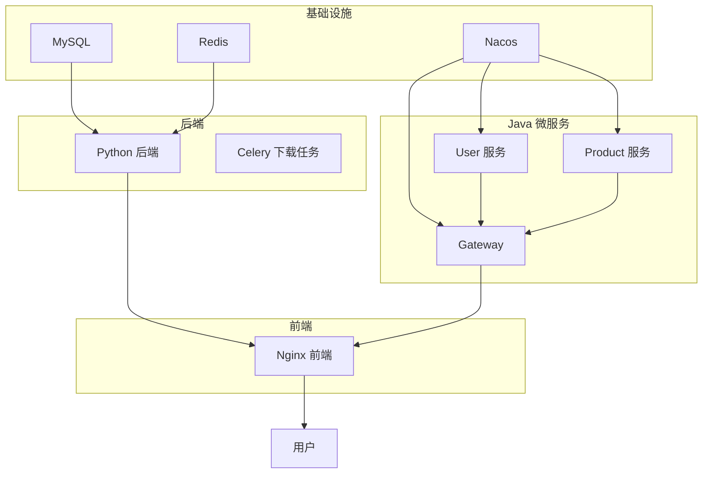
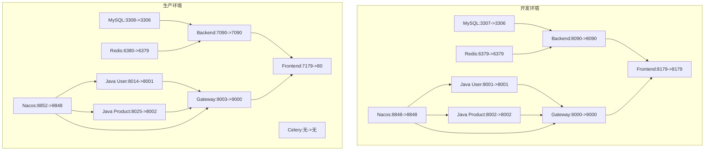
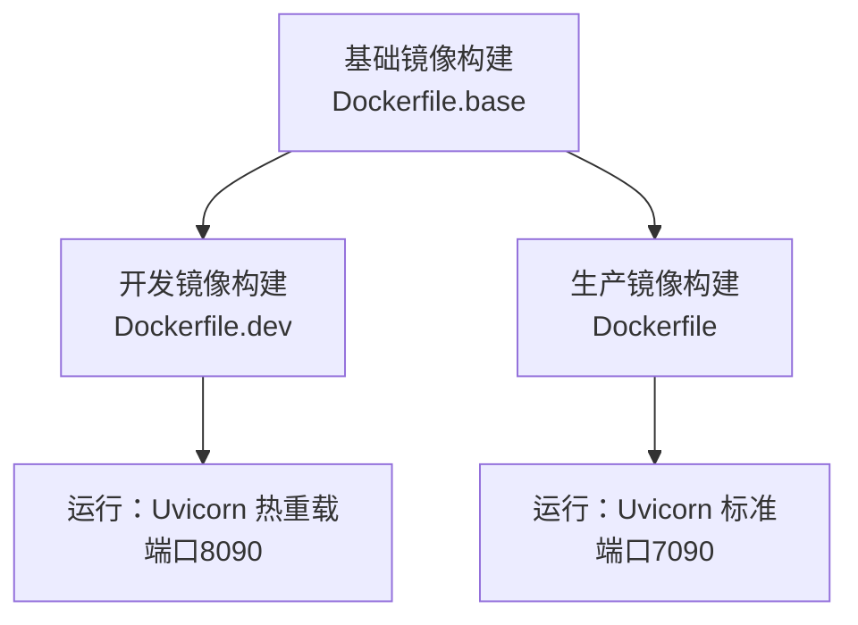
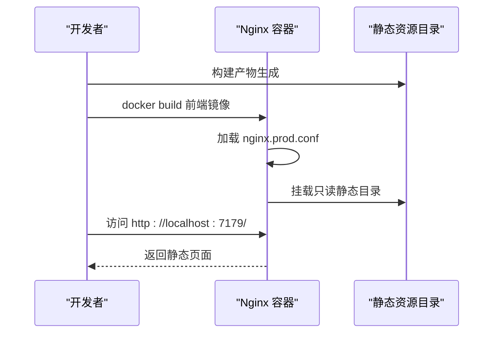
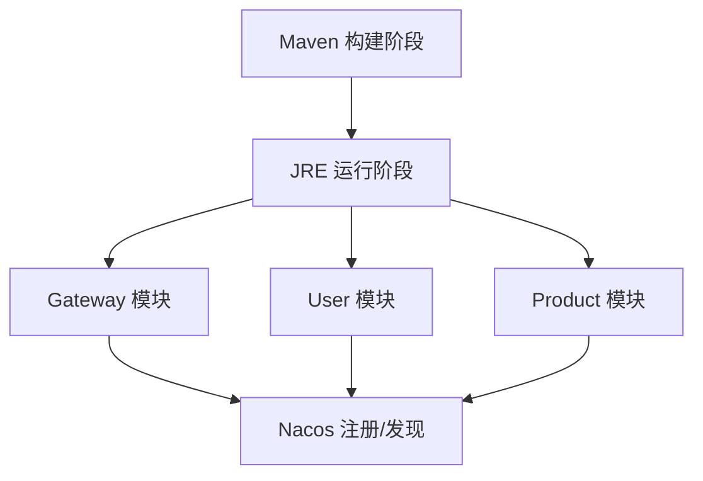
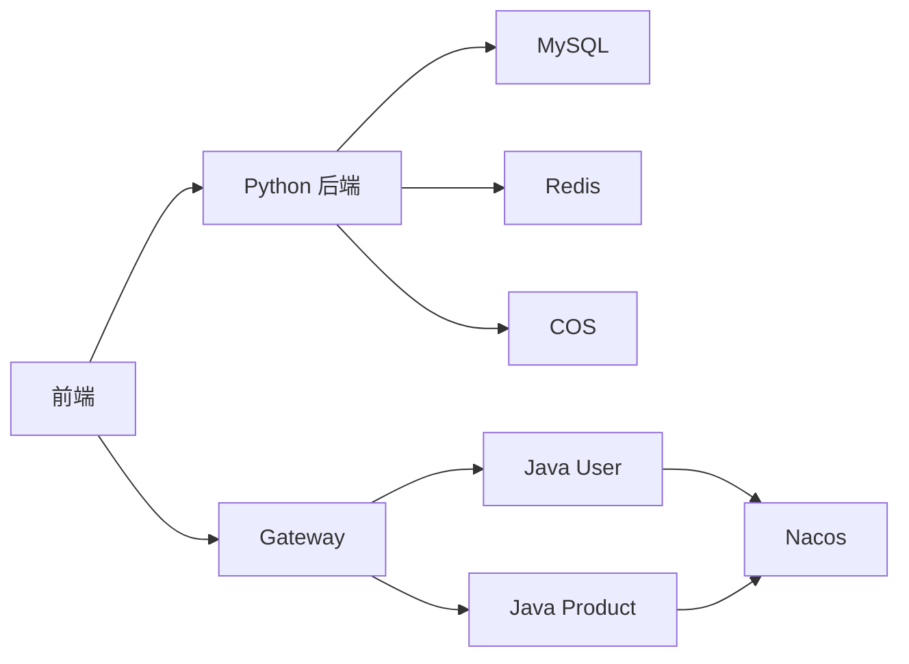

# Docker容器化

<cite>
**本文引用的文件**
- [backend/Dockerfile](file://backend/Dockerfile)
- [backend/Dockerfile.dev](file://backend/Dockerfile.dev)
- [backend/Dockerfile.base](file://backend/Dockerfile.base)
- [backend/requirements.txt](file://backend/requirements.txt)
- [frontend/Dockerfile](file://frontend/Dockerfile)
- [frontend/package.json](file://frontend/package.json)
- [java-backend/Dockerfile](file://java-backend/Dockerfile)
- [java-backend/Dockerfile.prod](file://java-backend/Dockerfile.prod)
- [java-backend/pom.xml](file://java-backend/pom.xml)
- [docker-compose.yml](file://docker-compose.yml)
- [docker-compose.base.yml](file://docker-compose.base.yml)
- [docker-compose.dev.yml](file://docker-compose.dev.yml)
- [docker-compose.prod.yml](file://docker-compose.prod.yml)
- [docker-compose.prod-simple.yml](file://docker-compose.prod-simple.yml)
- [prod.sh](file://prod.sh)
- [dev.sh](file://dev.sh)
</cite>

## 目录
1. [简介](#简介)
2. [项目结构](#项目结构)
3. [核心组件](#核心组件)
4. [架构总览](#架构总览)
5. [详细组件分析](#详细组件分析)
6. [依赖关系分析](#依赖关系分析)
7. [性能考虑](#性能考虑)
8. [故障排查指南](#故障排查指南)
9. [结论](#结论)
10. [附录](#附录)

## 简介
本文件面向“思觉智贸”系统的Docker容器化实践，围绕多阶段构建策略、Docker Compose编排（开发与生产）、服务间依赖与网络、数据卷策略、健康检查、资源限制与环境变量配置进行系统化文档化，并提供完整的构建、运行与调试流程说明，帮助团队在不同环境下稳定交付。

## 项目结构
系统采用多语言混合架构：Python后端（FastAPI/Uvicorn）、Vue.js前端（Nginx静态服务）、Java微服务（Spring Boot + Nacos），并通过Docker Compose进行统一编排。核心容器包括：
- 基础设施：MySQL、Redis、Nacos
- 后端服务：Python后端、Celery下载任务
- Java微服务：Gateway、User、Product
- 前端：Nginx静态站点

图表来源
- [docker-compose.prod-simple.yml:6-264](file://docker-compose.prod-simple.yml#L6-L264)
- [docker-compose.dev.yml:1-224](file://docker-compose.dev.yml#L1-L224)

章节来源
- [docker-compose.yml:1-36](file://docker-compose.yml#L1-L36)
- [docker-compose.base.yml:1-21](file://docker-compose.base.yml#L1-L21)
- [docker-compose.dev.yml:1-224](file://docker-compose.dev.yml#L1-L224)
- [docker-compose.prod.yml:1-77](file://docker-compose.prod.yml#L1-L77)
- [docker-compose.prod-simple.yml:1-264](file://docker-compose.prod-simple.yml#L1-L264)

## 核心组件
- Python后端镜像（生产/开发）
  - 生产镜像基于基础镜像，暴露7090端口，内置健康检查，启动Uvicorn。
  - 开发镜像基于基础镜像，暴露8090端口，启用热重载。
  - 基础镜像集中安装Python依赖，避免重复安装，提升构建效率。
- Vue.js前端镜像
  - 基于Nginx Alpine，拷贝构建产物到/usr/share/nginx/html，暴露80端口，内置健康检查。
- Java微服务镜像
  - 多阶段构建：Maven阶段下载依赖并打包；运行阶段仅含JRE，体积更小。
  - 生产镜像直接复制预编译jar，支持通过环境变量切换服务模块（gateway/user/product）。
- 基础设施与编排
  - MySQL/Redis/Nacos作为共享基础设施，通过Compose按需组合。
  - 开发与生产环境分别提供独立compose文件，实现差异化配置。

章节来源
- [backend/Dockerfile:1-13](file://backend/Dockerfile#L1-L13)
- [backend/Dockerfile.dev:1-11](file://backend/Dockerfile.dev#L1-L11)
- [backend/Dockerfile.base:1-26](file://backend/Dockerfile.base#L1-L26)
- [frontend/Dockerfile:1-12](file://frontend/Dockerfile#L1-L12)
- [java-backend/Dockerfile:1-40](file://java-backend/Dockerfile#L1-L40)
- [java-backend/Dockerfile.prod:1-20](file://java-backend/Dockerfile.prod#L1-L20)

## 架构总览
下图展示开发与生产两种编排模式下的服务交互与端口映射关系。

图表来源
- [docker-compose.dev.yml:1-224](file://docker-compose.dev.yml#L1-L224)
- [docker-compose.prod.yml:1-77](file://docker-compose.prod.yml#L1-L77)
- [docker-compose.prod-simple.yml:1-264](file://docker-compose.prod-simple.yml#L1-L264)

## 详细组件分析

### Python后端镜像（多阶段/基础镜像）
- 基础镜像（Python 3.11-slim，阿里云pip/apt源，gcc/mysqlclient/curl，预建依赖，创建静态/日志/模型缓存/上传/缩略图目录）
- 开发镜像（端口8090，健康检查，Uvicorn热重载）
- 生产镜像（端口7090，健康检查，Uvicorn标准启动）

图表来源
- [backend/Dockerfile.base:1-26](file://backend/Dockerfile.base#L1-L26)
- [backend/Dockerfile.dev:1-11](file://backend/Dockerfile.dev#L1-L11)
- [backend/Dockerfile:1-13](file://backend/Dockerfile#L1-L13)

章节来源
- [backend/Dockerfile.base:1-26](file://backend/Dockerfile.base#L1-L26)
- [backend/Dockerfile.dev:1-11](file://backend/Dockerfile.dev#L1-L11)
- [backend/Dockerfile:1-13](file://backend/Dockerfile#L1-L13)
- [backend/requirements.txt:1-35](file://backend/requirements.txt#L1-L35)

### Vue.js前端镜像（Nginx）
- 基于nginx:alpine，拷贝nginx.prod.conf与构建产物，暴露80端口，健康检查通过HTTP探测。
- 生产环境通过Compose将宿主静态资源以只读方式挂载到容器内数据目录，便于快速替换与回滚。

图表来源
- [frontend/Dockerfile:1-12](file://frontend/Dockerfile#L1-L12)
- [docker-compose.prod.yml:64-77](file://docker-compose.prod.yml#L64-L77)
- [docker-compose.prod-simple.yml:240-251](file://docker-compose.prod-simple.yml#L240-L251)

章节来源
- [frontend/Dockerfile:1-12](file://frontend/Dockerfile#L1-L12)
- [frontend/package.json:1-81](file://frontend/package.json#L1-L81)
- [docker-compose.prod.yml:64-77](file://docker-compose.prod.yml#L64-L77)
- [docker-compose.prod-simple.yml:240-251](file://docker-compose.prod-simple.yml#L240-L251)

### Java微服务镜像（多阶段构建）
- 多阶段构建：Maven阶段下载依赖并打包；运行阶段仅含JRE，减少镜像体积。
- 生产镜像直接复制预编译jar，通过环境变量SERVICE_MODULE切换模块（gateway/user/product）。
- 开发环境直接运行spring-boot:run，便于本地联调。

图表来源
- [java-backend/Dockerfile:1-40](file://java-backend/Dockerfile#L1-L40)
- [java-backend/Dockerfile.prod:1-20](file://java-backend/Dockerfile.prod#L1-L20)
- [docker-compose.dev.yml:106-200](file://docker-compose.dev.yml#L106-L200)
- [docker-compose.prod-simple.yml:150-234](file://docker-compose.prod-simple.yml#L150-L234)

章节来源
- [java-backend/Dockerfile:1-40](file://java-backend/Dockerfile#L1-L40)
- [java-backend/Dockerfile.prod:1-20](file://java-backend/Dockerfile.prod#L1-L20)
- [java-backend/pom.xml:1-263](file://java-backend/pom.xml#L1-L263)
- [docker-compose.dev.yml:106-200](file://docker-compose.dev.yml#L106-L200)
- [docker-compose.prod-simple.yml:150-234](file://docker-compose.prod-simple.yml#L150-L234)

### 健康检查与资源限制
- 健康检查
  - Python后端：对/health路径进行HTTP探测。
  - Nginx前端：对根路径进行HTTP探测。
  - MySQL/Redis/Nacos：使用各自CLI命令进行探测。
  - Celery：通过inspect ping进行健康检查。
- 资源限制（生产）
  - 后端容器设置CPU与内存上限，避免资源争抢。
- 环境变量
  - 开发/生产环境通过Compose注入数据库、Redis、COS、JWT等敏感参数，建议在生产中使用外部密钥管理或环境覆盖文件。

章节来源
- [backend/Dockerfile:9-10](file://backend/Dockerfile#L9-L10)
- [frontend/Dockerfile:8-9](file://frontend/Dockerfile#L8-L9)
- [docker-compose.yml:17-21](file://docker-compose.yml#L17-L21)
- [docker-compose.yml:27-31](file://docker-compose.yml#L27-L31)
- [docker-compose.dev.yml:75-79](file://docker-compose.dev.yml#L75-L79)
- [docker-compose.prod.yml:58-63](file://docker-compose.prod.yml#L58-L63)
- [docker-compose.prod-simple.yml:139-144](file://docker-compose.prod-simple.yml#L139-L144)

### 数据卷与持久化策略
- 开发环境
  - 后端：源码挂载+上传/静态/日志/备份/缩略图/模型缓存卷；产品数据目录只读挂载。
  - 前端：源码挂载+node_modules缓存卷。
  - Java：源码挂载+m2仓库缓存卷。
  - 基础设施：命名卷用于MySQL/Redis持久化。
- 生产环境
  - 后端：日志与模型缓存独立卷；产品数据目录只读挂载；Celery下载缓存独立卷。
  - 前端：静态资源卷与Nginx容器绑定。
  - 基础设施：独立命名卷，便于备份与迁移。

章节来源
- [docker-compose.dev.yml:64-74](file://docker-compose.dev.yml#L64-L74)
- [docker-compose.dev.yml:97-99](file://docker-compose.dev.yml#L97-L99)
- [docker-compose.dev.yml:113-115](file://docker-compose.dev.yml#L113-L115)
- [docker-compose.prod.yml:49-57](file://docker-compose.prod.yml#L49-L57)
- [docker-compose.prod-simple.yml:95-99](file://docker-compose.prod-simple.yml#L95-L99)
- [docker-compose.prod-simple.yml:131-133](file://docker-compose.prod-simple.yml#L131-L133)

### 网络与服务依赖
- 服务间通信
  - Python后端通过服务名访问MySQL/Redis。
  - Java微服务通过Nacos注册中心发现彼此，Gateway统一对外。
  - 前端通过Vite代理或Gateway代理访问后端与Java服务。
- 依赖顺序
  - 通过depends_on与健康检查条件确保数据库与缓存就绪后再启动应用。
  - Java服务依赖Nacos先启动。

章节来源
- [docker-compose.dev.yml:75-79](file://docker-compose.dev.yml#L75-L79)
- [docker-compose.dev.yml:134-140](file://docker-compose.dev.yml#L134-L140)
- [docker-compose.prod-simple.yml:100-104](file://docker-compose.prod-simple.yml#L100-L104)
- [docker-compose.prod-simple.yml:172-178](file://docker-compose.prod-simple.yml#L172-L178)

## 依赖关系分析
- 组件耦合
  - Python后端与MySQL/Redis强耦合；与Java微服务通过API/Gateway弱耦合。
  - Java微服务与Nacos耦合，实现服务发现与配置管理。
  - 前端与后端/Gateway通过HTTP接口耦合。
- 外部依赖
  - Python后端依赖MySQL、Redis、COS；前端依赖后端API。
  - Java微服务依赖MySQL、Redis、Nacos、COS。

图表来源
- [docker-compose.prod-simple.yml:66-105](file://docker-compose.prod-simple.yml#L66-L105)
- [docker-compose.prod-simple.yml:150-234](file://docker-compose.prod-simple.yml#L150-L234)
- [docker-compose.dev.yml:106-200](file://docker-compose.dev.yml#L106-L200)

章节来源
- [docker-compose.prod-simple.yml:66-105](file://docker-compose.prod-simple.yml#L66-L105)
- [docker-compose.prod-simple.yml:150-234](file://docker-compose.prod-simple.yml#L150-L234)
- [docker-compose.dev.yml:106-200](file://docker-compose.dev.yml#L106-L200)

## 性能考虑
- 镜像体积与启动速度
  - Java微服务采用多阶段构建与JRE运行时，显著降低镜像体积。
  - Python后端基础镜像集中安装依赖，避免重复安装。
- 资源限制
  - 生产环境对后端容器设置CPU与内存上限，防止资源争用。
- I/O与缓存
  - 日志、模型缓存、下载缓存独立卷，提升I/O隔离与恢复能力。
- 并发与队列
  - Celery下载任务独立容器，配合队列与并发参数，提高吞吐。

章节来源
- [java-backend/Dockerfile:21-39](file://java-backend/Dockerfile#L21-L39)
- [backend/Dockerfile.base:20-25](file://backend/Dockerfile.base#L20-L25)
- [docker-compose.prod.yml:58-63](file://docker-compose.prod.yml#L58-L63)
- [docker-compose.prod-simple.yml:107-144](file://docker-compose.prod-simple.yml#L107-L144)

## 故障排查指南
- 健康检查失败
  - 检查容器内部端口与健康检查命令是否匹配（如/health路径、HTTP探测）。
  - 查看依赖服务（MySQL/Redis/Nacos）是否健康。
- 端口冲突
  - 开发与生产环境端口映射不同，确认当前使用的compose文件与端口范围。
- 数据卷权限
  - 确认宿主目录权限与用户映射，避免容器内无法写入日志/缓存。
- Java服务启动异常
  - 检查Nacos连通性与服务注册状态；核对数据库与Redis连接参数。
- 前端无法访问后端
  - 确认Vite代理或Gateway代理配置正确，服务名解析正常。

章节来源
- [backend/Dockerfile:9-10](file://backend/Dockerfile#L9-L10)
- [frontend/Dockerfile:8-9](file://frontend/Dockerfile#L8-L9)
- [docker-compose.dev.yml:91-94](file://docker-compose.dev.yml#L91-L94)
- [docker-compose.prod-simple.yml:248-250](file://docker-compose.prod-simple.yml#L248-L250)

## 结论
本容器化方案通过多阶段构建与基础镜像复用，显著提升了构建效率与镜像一致性；通过Compose的开发/生产差异化配置，满足本地联调与生产部署的不同需求。健康检查、资源限制与数据卷策略共同保障了系统的稳定性与可维护性。建议在生产环境中进一步完善密钥管理、网络隔离与监控告警体系。

## 附录

### 构建与运行流程

- 开发环境
  - 构建基础镜像：使用docker-compose.base.yml构建Python与Node基础镜像。
  - 启动：docker compose -f docker-compose.yml -f docker-compose.dev.yml up -d
  - 访问：后端 http://localhost:8090，前端 http://localhost:8179，Gateway http://localhost:9000
  - 停止：docker compose -f docker-compose.yml -f docker-compose.dev.yml down

- 生产环境
  - 方式一：使用docker-compose.prod.yml
    - 启动：docker compose -f docker-compose.yml -f docker-compose.prod.yml up -d
    - 访问：后端 http://localhost:7090，前端 http://localhost:7179
  - 方式二：使用docker-compose.prod-simple.yml（完全隔离）
    - 启动：docker compose -f docker-compose.prod-simple.yml -p sijuelishi-prod up -d
    - 访问：后端 http://localhost:7093，前端 http://localhost:5173，Gateway http://localhost:9003

- 独立脚本
  - 开发脚本：./dev.sh 同时启动后端与前端，Ctrl+C停止。
  - 生产脚本：./prod.sh 启动后端（多worker），并输出服务地址与文档地址。

章节来源
- [docker-compose.base.yml:1-21](file://docker-compose.base.yml#L1-L21)
- [docker-compose.yml:1-5](file://docker-compose.yml#L1-L5)
- [docker-compose.dev.yml:1-4](file://docker-compose.dev.yml#L1-L4)
- [docker-compose.prod.yml:1-4](file://docker-compose.prod.yml#L1-L4)
- [docker-compose.prod-simple.yml:1-5](file://docker-compose.prod-simple.yml#L1-L5)
- [dev.sh:1-45](file://dev.sh#L1-L45)
- [prod.sh:1-58](file://prod.sh#L1-L58)