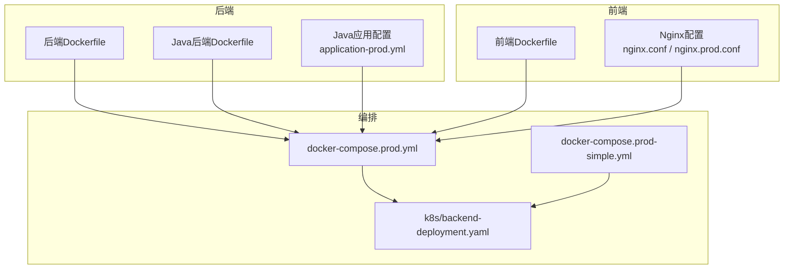
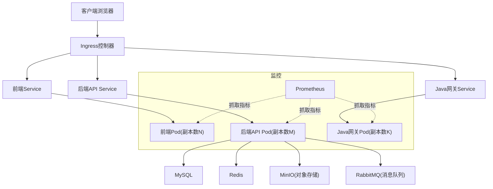
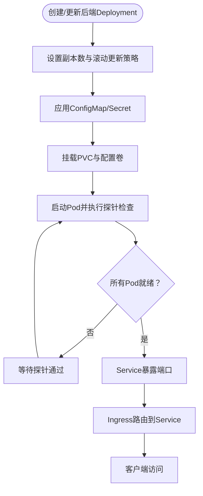
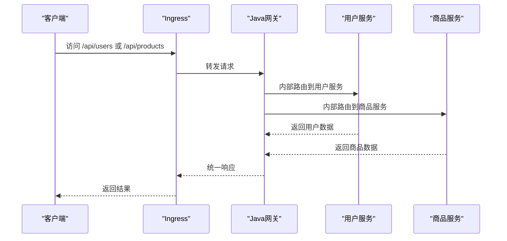
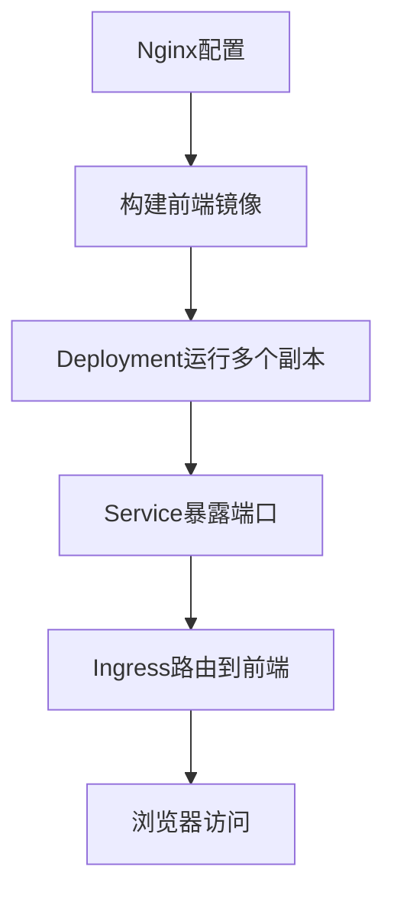
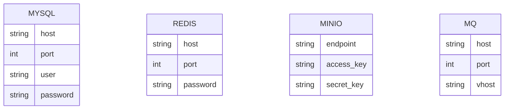
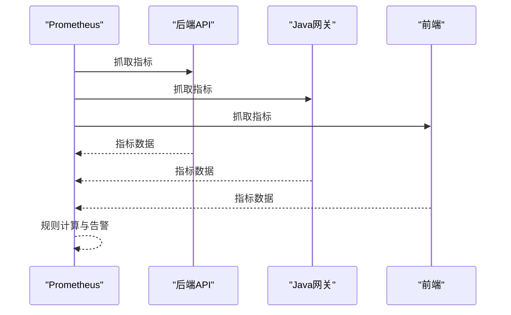
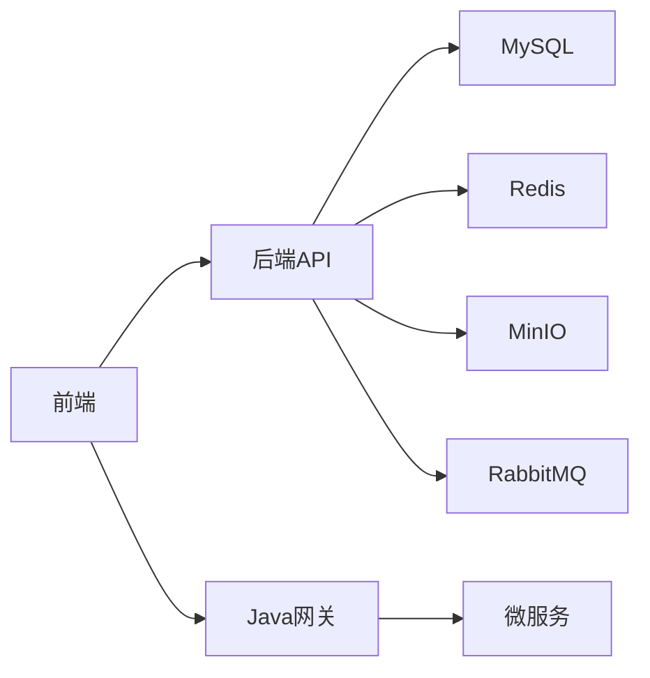

# Kubernetes部署

<cite>
**本文引用的文件**
- [backend-deployment.yaml](file://k8s/backend-deployment.yaml)
- [docker-compose.prod.yml](file://docker-compose.prod.yml)
- [docker-compose.prod-simple.yml](file://docker-compose.prod-simple.yml)
- [application-prod.yml](file://java-backend/src/main/resources/application-prod.yml)
- [nginx.conf](file://frontend/nginx.conf)
- [nginx.prod.conf](file://frontend/nginx.prod.conf)
- [Dockerfile](file://backend/Dockerfile)
- [Dockerfile](file://frontend/Dockerfile)
- [Dockerfile](file://java-backend/Dockerfile)
- [prometheus.yml](file://prometheus/prometheus.yml)
- [README.md](file://README.md)
</cite>

## 目录
1. [简介](#简介)
2. [项目结构](#项目结构)
3. [核心组件](#核心组件)
4. [架构概览](#架构概览)
5. [详细组件分析](#详细组件分析)
6. [依赖关系分析](#依赖关系分析)
7. [性能考虑](#性能考虑)
8. [故障排除指南](#故障排除指南)
9. [结论](#结论)
10. [附录](#附录)

## 简介
本文件为思觉智贸系统提供完整的Kubernetes部署指南，覆盖后端服务、前端应用、Java网关与微服务、数据库、消息队列、对象存储等全栈组件的部署与运维要点。文档重点说明以下方面：
- 资源配置：Deployment、Service、Ingress、ConfigMap、Secret、PersistentVolumeClaim
- Pod调度策略、副本管理与滚动更新
- 服务发现、负载均衡与网络策略
- 持久化存储、Secret管理与ConfigMap使用
- Prometheus监控集成与告警配置
- 命名空间管理、资源配额与安全策略
- 集群扩容、故障恢复与备份策略

## 项目结构
系统由多语言后端（Python、Java）、前端（Vue）组成，并通过Nginx进行反向代理与静态资源分发。容器镜像构建采用各自目录下的Dockerfile，生产环境编排通过docker-compose文件描述。

**图表来源**
- [docker-compose.prod.yml](file://docker-compose.prod.yml)
- [docker-compose.prod-simple.yml](file://docker-compose.prod-simple.yml)
- [backend-deployment.yaml](file://k8s/backend-deployment.yaml)
- [Dockerfile](file://backend/Dockerfile)
- [Dockerfile](file://frontend/Dockerfile)
- [Dockerfile](file://java-backend/Dockerfile)
- [application-prod.yml](file://java-backend/src/main/resources/application-prod.yml)
- [nginx.conf](file://frontend/nginx.conf)
- [nginx.prod.conf](file://frontend/nginx.prod.conf)

**章节来源**
- [docker-compose.prod.yml](file://docker-compose.prod.yml)
- [docker-compose.prod-simple.yml](file://docker-compose.prod-simple.yml)
- [backend-deployment.yaml](file://k8s/backend-deployment.yaml)

## 核心组件
- 后端服务（Python）：提供REST API、任务处理、AI向量检索等能力，容器镜像由后端Dockerfile构建。
- Java网关与微服务：统一入口与业务拆分，配置在application-prod.yml中，容器镜像由Java后端Dockerfile构建。
- 前端应用：Vue应用，通过Nginx提供静态资源与反向代理。
- 数据与中间件：MySQL、Redis、MinIO（对象存储）、RabbitMQ（消息队列）等，均通过docker-compose定义。
- 监控：Prometheus配置用于采集指标。

**章节来源**
- [Dockerfile](file://backend/Dockerfile)
- [Dockerfile](file://java-backend/Dockerfile)
- [application-prod.yml](file://java-backend/src/main/resources/application-prod.yml)
- [nginx.conf](file://frontend/nginx.conf)
- [nginx.prod.conf](file://frontend/nginx.prod.conf)
- [prometheus.yml](file://prometheus/prometheus.yml)

## 架构概览
下图展示生产环境的典型部署拓扑：前端通过Ingress暴露，后端服务（Python与Java）通过Service暴露，数据库与对象存储等通过外部或集群内服务访问，Prometheus负责指标采集。

**图表来源**
- [docker-compose.prod.yml](file://docker-compose.prod.yml)
- [prometheus.yml](file://prometheus/prometheus.yml)

## 详细组件分析

### 后端服务（Python）
- Deployment：定义容器镜像、副本数、滚动更新策略、探针、环境变量与挂载卷。
- Service：ClusterIP或LoadBalancer类型，暴露后端API端口。
- ConfigMap：存放非敏感配置（如日志级别、功能开关），通过环境变量或挂载方式注入。
- Secret：存放数据库密码、第三方密钥等敏感信息，通过环境变量或挂载方式注入。
- PVC：为MySQL、MinIO等持久化组件提供持久卷。
- 探针：健康检查与就绪检查，确保滚动更新期间流量切换平滑。

**图表来源**
- [backend-deployment.yaml](file://k8s/backend-deployment.yaml)

**章节来源**
- [backend-deployment.yaml](file://k8s/backend-deployment.yaml)

### Java网关与微服务
- 网关：统一入口，路由到各微服务；配置在application-prod.yml中，包含注册中心、限流、鉴权等参数。
- 微服务：按领域拆分（用户、商品等），通过网关内部路由访问。
- 镜像与部署：由Java后端Dockerfile构建，与后端服务类似，通过Deployment与Service暴露。

**图表来源**
- [application-prod.yml](file://java-backend/src/main/resources/application-prod.yml)

**章节来源**
- [application-prod.yml](file://java-backend/src/main/resources/application-prod.yml)
- [Dockerfile](file://java-backend/Dockerfile)

### 前端应用
- Nginx：提供静态资源服务与反向代理，nginx.prod.conf适用于生产环境。
- 部署：通过Deployment与Service暴露，Ingress统一入口。
- 配置：通过ConfigMap管理站点配置，Secret管理HTTPS证书等敏感信息。

**图表来源**
- [nginx.conf](file://frontend/nginx.conf)
- [nginx.prod.conf](file://frontend/nginx.prod.conf)

**章节来源**
- [nginx.conf](file://frontend/nginx.conf)
- [nginx.prod.conf](file://frontend/nginx.prod.conf)
- [Dockerfile](file://frontend/Dockerfile)

### 数据与中间件
- MySQL：初始化脚本位于mysql/init，通过docker-compose定义容器与卷。
- Redis：用于缓存与会话存储。
- MinIO：对象存储，用于图片与文件上传。
- RabbitMQ：消息队列，用于异步任务解耦。

**图表来源**
- [docker-compose.prod.yml](file://docker-compose.prod.yml)

**章节来源**
- [docker-compose.prod.yml](file://docker-compose.prod.yml)

### 监控与告警
- Prometheus：配置文件prometheus.yml定义抓取目标与规则。
- 指标采集：后端与网关暴露指标端点，Prometheus定期拉取。
- 告警：基于规则生成告警，推送至告警系统（如Alertmanager）。

**图表来源**
- [prometheus.yml](file://prometheus/prometheus.yml)

**章节来源**
- [prometheus.yml](file://prometheus/prometheus.yml)

## 依赖关系分析
- 后端服务依赖数据库、缓存、对象存储与消息队列。
- Java网关作为统一入口，依赖注册中心与各微服务。
- 前端通过Ingress访问后端API与网关。
- 所有组件通过ConfigMap与Secret进行配置与密钥管理。

**图表来源**
- [docker-compose.prod.yml](file://docker-compose.prod.yml)

**章节来源**
- [docker-compose.prod.yml](file://docker-compose.prod.yml)

## 性能考虑
- 副本数与水平扩展：根据CPU与内存使用率动态扩缩容，结合HPA实现自动伸缩。
- 资源限制与请求：为每个容器设置requests与limits，避免资源争抢。
- 连接池与超时：数据库连接池大小、Redis超时、HTTP客户端超时需合理配置。
- 缓存策略：利用Redis缓存热点数据，减少数据库压力。
- 存储IOPS：对象存储与数据库卷选择高IOPS磁盘，必要时启用SSD。
- 网络带宽：Ingress与Service的QoS策略，确保关键流量优先。

## 故障排除指南
- Pod频繁重启：检查探针配置与日志，确认健康检查端口与路径正确。
- 服务不可达：验证Service端口映射与Ingress路由规则，确认后端Pod就绪。
- 数据库连接失败：核对Secret中的数据库凭据，确认网络连通性与防火墙策略。
- 对象存储访问异常：检查MinIO的endpoint、access_key与secret_key是否正确。
- 监控无数据：确认Prometheus抓取地址与端口，检查后端指标端点是否暴露。

**章节来源**
- [backend-deployment.yaml](file://k8s/backend-deployment.yaml)
- [application-prod.yml](file://java-backend/src/main/resources/application-prod.yml)
- [prometheus.yml](file://prometheus/prometheus.yml)

## 结论
通过本部署文档，可在Kubernetes上稳定运行思觉智贸系统的全栈组件。建议以ConfigMap与Secret集中管理配置与密钥，结合HPA实现弹性伸缩，配合Prometheus完成可观测性建设，并制定完善的备份与灾难恢复策略，保障生产环境的高可用与可维护性。

## 附录
- 命名空间管理：为不同环境（开发、测试、生产）划分独立命名空间，隔离资源与权限。
- 资源配额：为命名空间设置ResourceQuota与LimitRange，防止资源滥用。
- 安全策略：启用NetworkPolicy限制入站/出站流量，使用RBAC控制访问权限。
- 集群扩容：根据业务增长趋势提前规划节点与存储扩容，确保容量冗余。
- 故障恢复：定期演练备份恢复流程，建立变更评审与回滚机制。
- 备份策略：数据库与对象存储定期快照，配置增量备份与异地容灾。