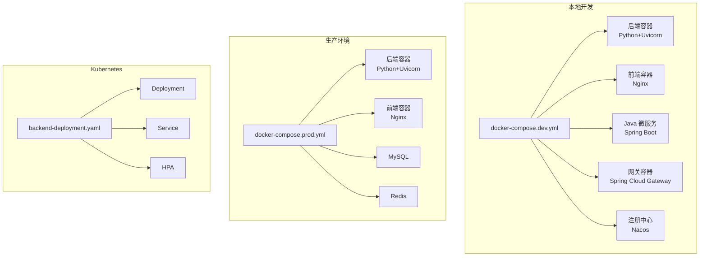
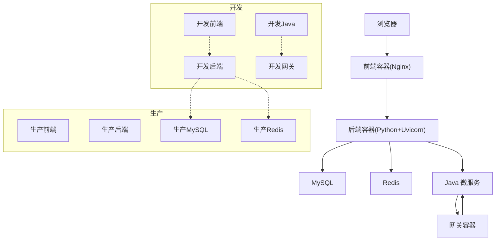
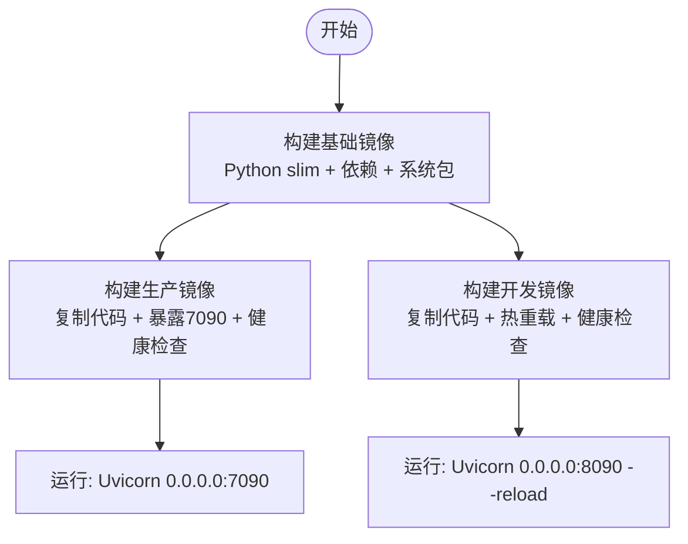
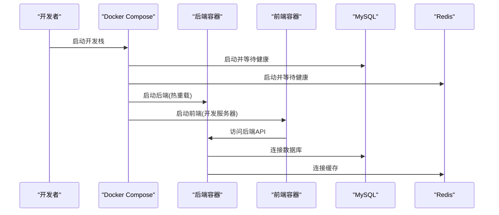
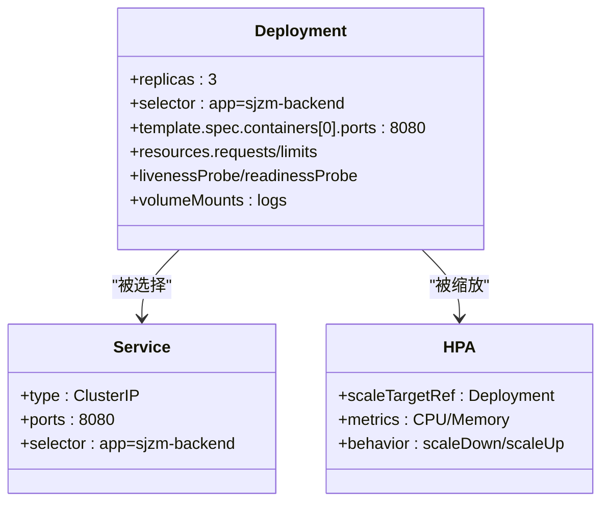
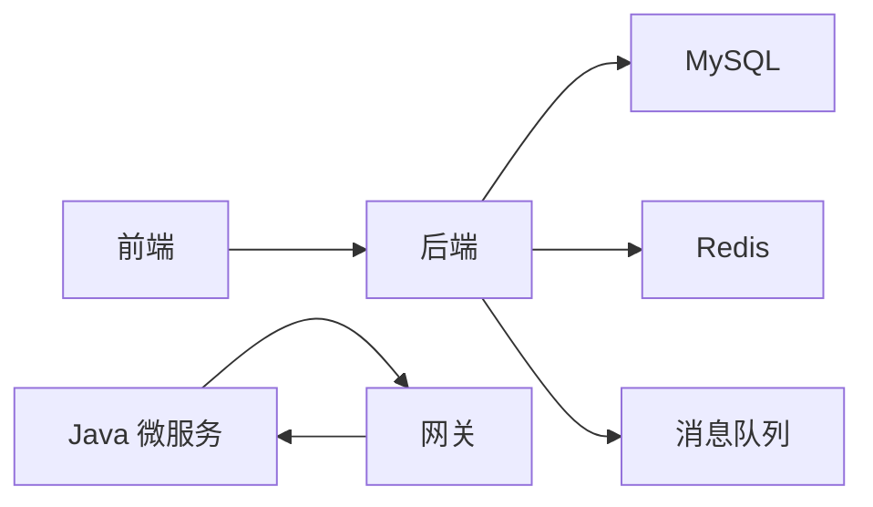

# 容器化部署

<cite>
**本文引用的文件**
- [backend/Dockerfile](file://backend/Dockerfile)
- [backend/Dockerfile.base](file://backend/Dockerfile.base)
- [backend/Dockerfile.dev](file://backend/Dockerfile.dev)
- [docker-compose.yml](file://docker-compose.yml)
- [docker-compose.prod.yml](file://docker-compose.prod.yml)
- [docker-compose.dev.yml](file://docker-compose.dev.yml)
- [frontend/Dockerfile](file://frontend/Dockerfile)
- [k8s/backend-deployment.yaml](file://k8s/backend-deployment.yaml)
- [.github/workflows/ci.yml](file://.github/workflows/ci.yml)
- [scripts/deployment/blue_green_deployment.py](file://scripts/deployment/blue_green_deployment.py)
- [scripts/deployment/canary_deployment.py](file://scripts/deployment/canary_deployment.py)
- [scripts/startup/start_prod_multiprocess.py](file://scripts/startup/start_prod_multiprocess.py)
- [prometheus/prometheus.yml](file://prometheus/prometheus.yml)
</cite>

## 目录
1. [引言](#引言)
2. [项目结构](#项目结构)
3. [核心组件](#核心组件)
4. [架构总览](#架构总览)
5. [详细组件分析](#详细组件分析)
6. [依赖分析](#依赖分析)
7. [性能考虑](#性能考虑)
8. [故障排查指南](#故障排查指南)
9. [结论](#结论)
10. [附录](#附录)

## 引言
本文件面向“思觉智贸”系统的容器化部署，系统性阐述Docker镜像构建策略（含多阶段与基础镜像复用）、Docker Compose编排配置（服务依赖、网络与卷挂载）、Kubernetes部署清单（Deployment、Service、HPA）以及容器安全、监控与日志收集策略。同时提供部署脚本与自动化流程说明，帮助团队在开发与生产环境中稳定、高效地交付系统。

## 项目结构
围绕容器化部署的关键文件分布如下：
- 后端应用：Python FastAPI 应用，提供健康检查与Uvicorn运行。
- 前端应用：Nginx 镜像承载静态页面。
- 数据与中间件：MySQL、Redis。
- 编排与编排：Docker Compose（开发/生产）、Kubernetes 清单。
- 自动化与脚本：CI 工作流、蓝绿与金丝雀发布脚本、生产启动脚本。
- 监控与日志：Prometheus 配置。

图表来源
- [docker-compose.dev.yml:1-224](file://docker-compose.dev.yml#L1-L224)
- [docker-compose.prod.yml:1-77](file://docker-compose.prod.yml#L1-L77)
- [k8s/backend-deployment.yaml:1-138](file://k8s/backend-deployment.yaml#L1-L138)

章节来源
- [docker-compose.yml:1-36](file://docker-compose.yml#L1-L36)
- [docker-compose.dev.yml:1-224](file://docker-compose.dev.yml#L1-L224)
- [docker-compose.prod.yml:1-77](file://docker-compose.prod.yml#L1-L77)
- [k8s/backend-deployment.yaml:1-138](file://k8s/backend-deployment.yaml#L1-L138)

## 核心组件
- 后端镜像（Python）
  - 基础镜像：基于 Python slim，预装依赖与常用系统包，统一构建缓存与加速源。
  - 生产镜像：继承基础镜像，暴露7090端口，内置健康检查，以Uvicorn运行。
  - 开发镜像：继承基础镜像，启用热重载，暴露8090端口，内置健康检查。
- 前端镜像（Nginx）
  - 基于 alpine 版 Nginx，拷贝生产配置与静态资源，暴露80端口并内置健康检查。
- 数据与中间件
  - MySQL：持久化数据卷，健康检查。
  - Redis：持久化数据卷，健康检查。
- 编排与编排
  - Compose 开发：自包含栈，包含后端、前端、Java 微服务、网关与 Nacos。
  - Compose 生产：后端与前端镜像构建，端口映射与资源限制。
  - Kubernetes：Deployment、Service、HPA，含探针与资源请求/限制。
- 自动化与脚本
  - CI 工作流：流水线任务定义。
  - 蓝绿与金丝雀：发布脚本。
  - 生产启动：多进程启动脚本。

章节来源
- [backend/Dockerfile.base:1-26](file://backend/Dockerfile.base#L1-L26)
- [backend/Dockerfile:1-13](file://backend/Dockerfile#L1-L13)
- [backend/Dockerfile.dev:1-11](file://backend/Dockerfile.dev#L1-L11)
- [frontend/Dockerfile:1-12](file://frontend/Dockerfile#L1-L12)
- [docker-compose.dev.yml:1-224](file://docker-compose.dev.yml#L1-L224)
- [docker-compose.prod.yml:1-77](file://docker-compose.prod.yml#L1-L77)
- [k8s/backend-deployment.yaml:1-138](file://k8s/backend-deployment.yaml#L1-L138)

## 架构总览
下图展示从浏览器到后端服务的典型链路，涵盖开发与生产两种编排方式：

图表来源
- [docker-compose.dev.yml:1-224](file://docker-compose.dev.yml#L1-L224)
- [docker-compose.prod.yml:1-77](file://docker-compose.prod.yml#L1-L77)

## 详细组件分析

### 后端镜像构建策略
- 基础镜像（复用与加速）
  - 使用统一的基础镜像，集中安装 Python 依赖与系统包，避免开发/生产重复安装，缩短构建时间。
  - 设置环境变量以禁用字节码写入、禁用缓冲、禁用pip缓存，提升一致性与镜像体积控制。
- 生产镜像
  - 继承基础镜像，复制应用代码，暴露7090端口，内置HTTP健康检查，通过Uvicorn以非localhost绑定方式运行。
- 开发镜像
  - 继承基础镜像，暴露8090端口，启用Uvicorn热重载，内置健康检查，便于本地调试。

图表来源
- [backend/Dockerfile.base:1-26](file://backend/Dockerfile.base#L1-L26)
- [backend/Dockerfile:1-13](file://backend/Dockerfile#L1-L13)
- [backend/Dockerfile.dev:1-11](file://backend/Dockerfile.dev#L1-L11)

章节来源
- [backend/Dockerfile.base:1-26](file://backend/Dockerfile.base#L1-L26)
- [backend/Dockerfile:1-13](file://backend/Dockerfile#L1-L13)
- [backend/Dockerfile.dev:1-11](file://backend/Dockerfile.dev#L1-L11)

### Docker Compose 编排配置
- 开发编排
  - 服务：mysql、redis、backend、frontend、java-*、gateway、nacos。
  - 依赖：后端/Java服务依赖数据库与缓存健康；前端依赖后端；网关依赖各Java服务。
  - 卷挂载：后端挂载源码、上传目录、静态资源、备份、缩略图、模型缓存、数据目录；前端挂载源码与node_modules；Java服务挂载源码与M2仓库；Nacos挂载日志与数据。
  - 端口映射：mysql、redis、backend、frontend、java-*、gateway、nacos。
  - 探针：mysql/redis健康检查。
- 生产编排
  - 服务：mysql、redis、backend、frontend。
  - 依赖：后端等待数据库与缓存健康；前端依赖后端。
  - 卷挂载：后端挂载日志、模型缓存与只读数据目录；前端镜像直接运行。
  - 资源限制：后端CPU/内存上限。
  - 端口映射：mysql、redis、backend、frontend。

图表来源
- [docker-compose.dev.yml:1-224](file://docker-compose.dev.yml#L1-L224)

章节来源
- [docker-compose.yml:1-36](file://docker-compose.yml#L1-L36)
- [docker-compose.dev.yml:1-224](file://docker-compose.dev.yml#L1-L224)
- [docker-compose.prod.yml:1-77](file://docker-compose.prod.yml#L1-L77)

### Kubernetes 部署配置
- Deployment
  - 多副本（3），选择器与标签匹配。
  - 环境变量：数据库、缓存、消息队列等连接参数。
  - 资源：requests/limits（CPU/内存）。
  - 探针：liveness/readiness 健康检查路径与周期。
  - 卷挂载：日志目录（emptyDir）。
- Service
  - ClusterIP 类型，暴露8080端口。
- HPA
  - 基于CPU与内存利用率的自动扩缩容策略，带回退抑制窗口与策略。

图表来源
- [k8s/backend-deployment.yaml:1-138](file://k8s/backend-deployment.yaml#L1-L138)

章节来源
- [k8s/backend-deployment.yaml:1-138](file://k8s/backend-deployment.yaml#L1-L138)

### 健康检查与资源限制
- 后端健康检查
  - Python 后端：HTTP 健康检查路径指向应用内部健康端点。
  - 前端 Nginx：HTTP 健康检查路径指向根。
  - MySQL/Redis：内置健康检查命令。
- 资源限制
  - Compose 生产：CPU/内存上限。
  - Kubernetes：requests/limits 明确资源边界。
- 探针策略
  - 初始延迟、周期、超时与失败阈值合理配置，避免冷启动误杀。

章节来源
- [backend/Dockerfile:1-13](file://backend/Dockerfile#L1-L13)
- [frontend/Dockerfile:1-12](file://frontend/Dockerfile#L1-L12)
- [docker-compose.prod.yml:58-63](file://docker-compose.prod.yml#L58-L63)
- [k8s/backend-deployment.yaml:58-73](file://k8s/backend-deployment.yaml#L58-L73)

### 安全与合规
- 凭据管理
  - 生产环境建议使用密钥管理（如Kubernetes Secret）注入敏感信息，避免硬编码在Compose/K8s清单中。
- 网络隔离
  - 使用自定义网络或命名空间隔离服务，限制不必要的端口暴露。
- 最小权限
  - 容器内用户与文件权限最小化，避免root写权限。
- 镜像安全
  - 固定基础镜像版本，定期扫描漏洞，启用只读根文件系统与drop capability。

（本节为通用最佳实践说明）

### 监控与日志
- 指标采集
  - Prometheus：配置抓取目标与规则，关注CPU/内存、QPS、错误率、数据库/缓存延迟。
- 日志聚合
  - 容器标准输出/错误输出接入日志收集系统，后端日志目录挂载至宿主机或集中存储。
- 健康可观测
  - 结合探针与指标，建立告警阈值与SLA。

章节来源
- [prometheus/prometheus.yml](file://prometheus/prometheus.yml)

### 部署脚本与自动化流程
- CI 工作流
  - 在CI中执行镜像构建、测试与推送，触发后续部署。
- 蓝绿与金丝雀发布
  - 蓝绿：新旧版本并行，切换流量。
  - 金丝雀：逐步放量，观察指标与错误率。
- 生产启动
  - 多进程启动脚本用于生产环境初始化与守护进程管理。

章节来源
- [.github/workflows/ci.yml](file://.github/workflows/ci.yml)
- [scripts/deployment/blue_green_deployment.py](file://scripts/deployment/blue_green_deployment.py)
- [scripts/deployment/canary_deployment.py](file://scripts/deployment/canary_deployment.py)
- [scripts/startup/start_prod_multiprocess.py](file://scripts/startup/start_prod_multiprocess.py)

## 依赖分析
- 组件耦合
  - 后端对数据库与缓存存在强依赖，需确保健康检查与启动顺序。
  - 前端依赖后端API；Java微服务通过网关统一入口。
- 外部依赖
  - MySQL、Redis、Nacos（开发）、Kubernetes API（生产）。
- 可能的循环依赖
  - 当前编排未见循环依赖；注意K8s Service与探针路径一致性。

图表来源
- [docker-compose.dev.yml:1-224](file://docker-compose.dev.yml#L1-L224)
- [k8s/backend-deployment.yaml:1-138](file://k8s/backend-deployment.yaml#L1-L138)

章节来源
- [docker-compose.dev.yml:1-224](file://docker-compose.dev.yml#L1-L224)
- [k8s/backend-deployment.yaml:1-138](file://k8s/backend-deployment.yaml#L1-L138)

## 性能考虑
- 镜像优化
  - 复用基础镜像，减少重复安装；禁用pip缓存与字节码写入，降低镜像体积与IO开销。
- 运行时优化
  - 合理设置Uvicorn工作进程数与并发；开启Gzip/静态资源缓存。
- 存储与I/O
  - 将日志、模型缓存、上传目录映射到高性能磁盘；避免频繁小文件写入。
- 网络与连接池
  - 控制数据库与缓存连接池大小，避免连接抖动。
- 资源规划
  - 根据峰值QPS与响应时间估算CPU/内存；K8s HPA按CPU/内存双指标动态扩容。

（本节为通用指导）

## 故障排查指南
- 健康检查失败
  - 检查后端健康端点是否可达；确认端口映射与容器绑定地址。
- 依赖服务不可达
  - 校验数据库/缓存连接参数与网络连通性；查看健康检查日志。
- 端口冲突
  - 修改映射端口或释放占用端口；在K8s中检查Service/Ingress。
- 权限与卷挂载
  - 确认宿主机目录权限与SELinux/AppArmor策略；检查只读/读写挂载。
- 日志定位
  - 查看容器日志与后端日志目录；结合指标与告警定位异常时段。

章节来源
- [backend/Dockerfile:1-13](file://backend/Dockerfile#L1-L13)
- [frontend/Dockerfile:1-12](file://frontend/Dockerfile#L1-L12)
- [docker-compose.dev.yml:1-224](file://docker-compose.dev.yml#L1-L224)
- [docker-compose.prod.yml:1-77](file://docker-compose.prod.yml#L1-L77)

## 结论
通过复用基础镜像、明确健康检查与资源限制、完善卷挂载与网络配置，以及引入K8s HPA与监控体系，“思觉智贸”可在开发与生产环境实现稳定、可观测、可扩展的容器化部署。建议持续完善密钥管理、网络隔离与镜像安全扫描，配合蓝绿/金丝雀发布策略，进一步提升交付质量与风险控制能力。

## 附录
- 快速启动
  - 开发：合并基础与开发编排文件启动。
  - 生产：合并基础与生产编排文件启动。
- 常用命令
  - Compose：指定多个YAML文件进行覆盖与合并。
  - Kubectl：apply/rollout/status/describe 等命令管理Deployment/Service/HPA。
- 参考路径
  - 后端镜像构建：[backend/Dockerfile.base](file://backend/Dockerfile.base)、[backend/Dockerfile](file://backend/Dockerfile)、[backend/Dockerfile.dev](file://backend/Dockerfile.dev)
  - 前端镜像构建：[frontend/Dockerfile](file://frontend/Dockerfile)
  - 编排文件：[docker-compose.yml](file://docker-compose.yml)、[docker-compose.dev.yml](file://docker-compose.dev.yml)、[docker-compose.prod.yml](file://docker-compose.prod.yml)
  - Kubernetes：[k8s/backend-deployment.yaml](file://k8s/backend-deployment.yaml)
  - 自动化与脚本：[.github/workflows/ci.yml](file://.github/workflows/ci.yml)、[scripts/deployment/blue_green_deployment.py](file://scripts/deployment/blue_green_deployment.py)、[scripts/deployment/canary_deployment.py](file://scripts/deployment/canary_deployment.py)、[scripts/startup/start_prod_multiprocess.py](file://scripts/startup/start_prod_multiprocess.py)
  - 监控：[prometheus/prometheus.yml](file://prometheus/prometheus.yml)