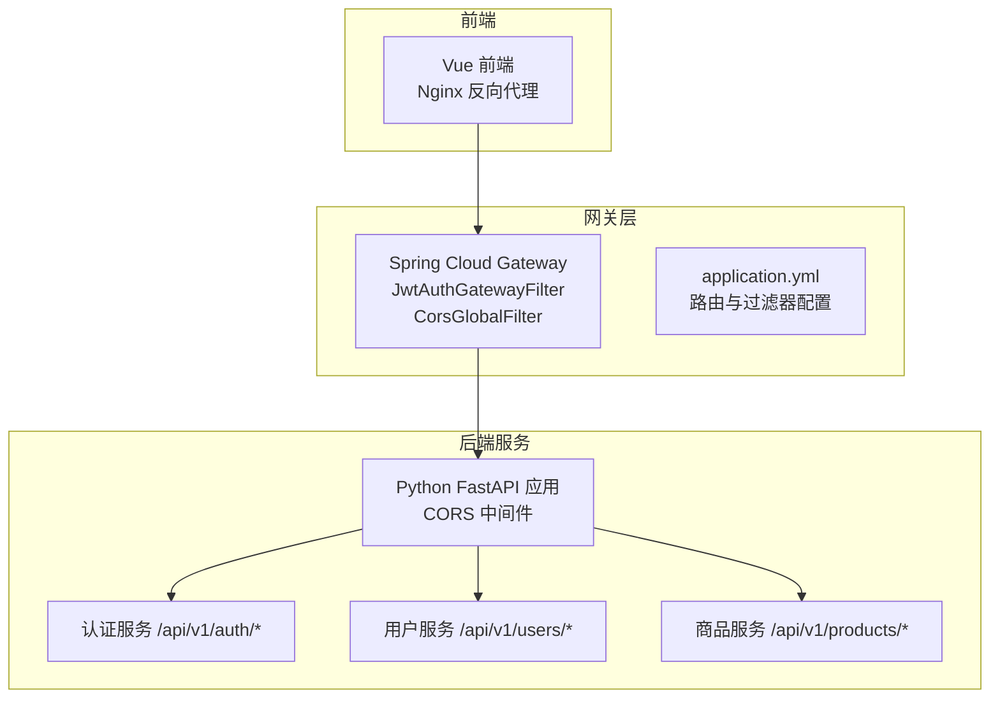
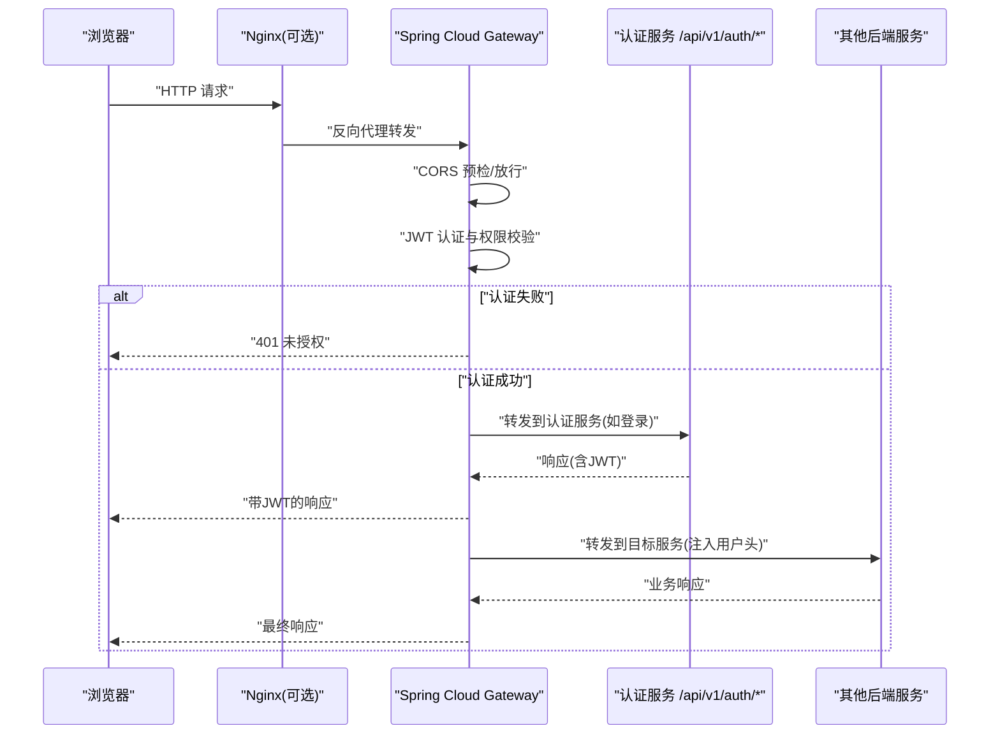
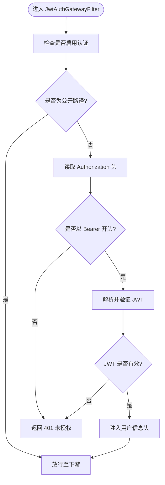
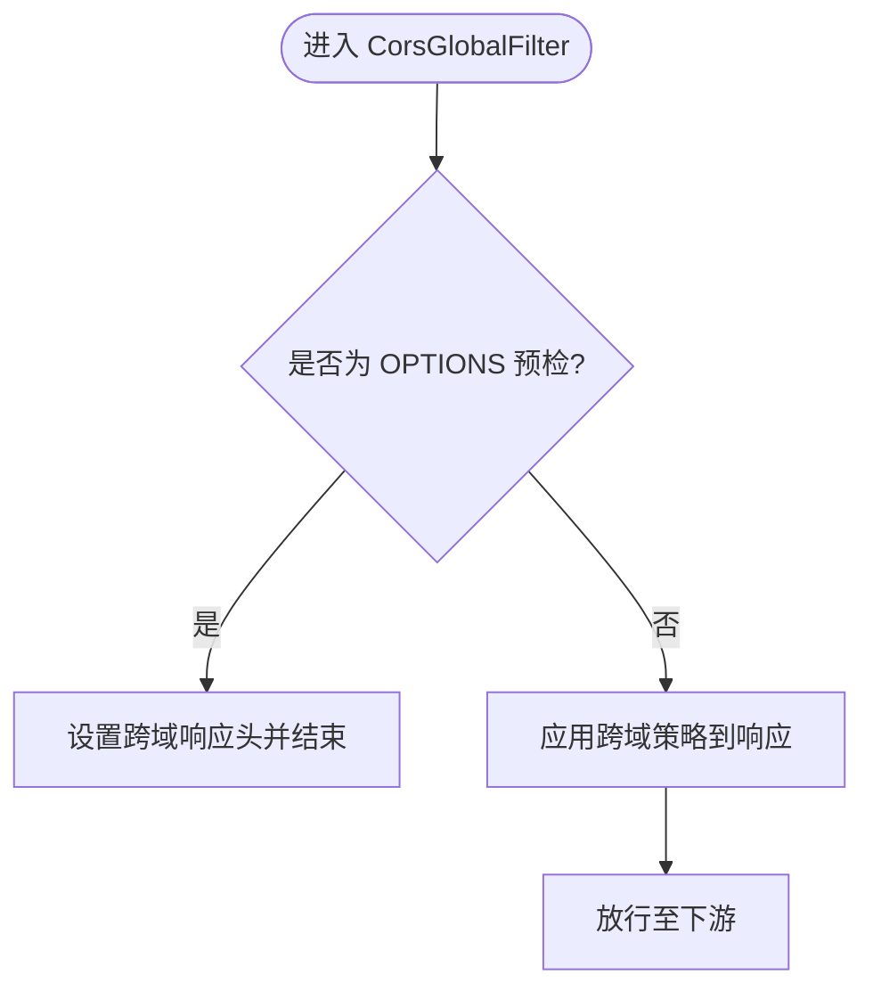
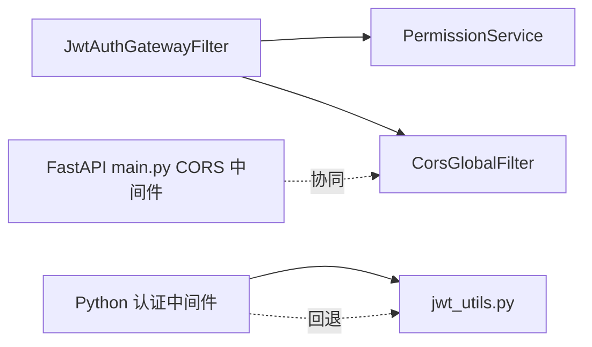

# API网关服务

<cite>
**本文引用的文件**
- [JwtAuthGatewayFilter.java](file://java-backend/sjzm-gateway/src/main/java/com/sjzm/gateway/JwtAuthGatewayFilter.java)
- [CorsGlobalFilter.java](file://java-backend/sjzm-gateway/src/main/java/com/sjzm/gateway/CorsGlobalFilter.java)
- [PermissionService.java](file://java-backend/sjzm-gateway/src/main/java/com/sjzm/gateway/PermissionService.java)
- [application.yml](file://java-backend/sjzm-gateway/src/main/resources/application.yml)
- [GatewayApplication.java](file://java-backend/sjzm-gateway/src/main/java/com/sjzm/gateway/GatewayApplication.java)
- [auth_middleware.py](file://backend/app/middleware/auth_middleware.py)
- [jwt_utils.py](file://backend/app/utils/jwt_utils.py)
- [main.py](file://backend/app/main.py)
- [config.py](file://backend/app/config.py)
- [auth.py](file://backend/app/api/v1/auth.py)
- [timeout.py](file://backend/app/middleware/timeout.py)
- [error_middleware.py](file://backend/app/middleware/error_middleware.py)
- [error_handler.py](file://backend/app/middleware/error_handler.py)
- [nginx.conf](file://frontend/nginx.conf)
- [nginx.prod.conf](file://frontend/nginx.prod.conf)
- [docker-compose.yml](file://docker-compose.yml)
- [docker-compose.prod.yml](file://docker-compose.prod.yml)
- [Dockerfile](file://java-backend/sjzm-gateway/Dockerfile)
- [Dockerfile.prod](file://java-backend/sjzm-gateway/Dockerfile.prod)
- [spec.md](file://openspec/changes/microservices-migration/specs/auth/spec.md)
- [spec.md](file://openspec/changes/microservices-migration/specs/distributed-auth/spec.md)
</cite>

## 目录
1. [简介](#简介)
2. [项目结构](#项目结构)
3. [核心组件](#核心组件)
4. [架构总览](#架构总览)
5. [详细组件分析](#详细组件分析)
6. [依赖关系分析](#依赖关系分析)
7. [性能考虑](#性能考虑)
8. [故障排查指南](#故障排查指南)
9. [结论](#结论)
10. [附录](#附录)

## 简介
本文件面向API网关服务，系统性阐述其在微服务架构中的职责与实现要点，重点覆盖以下方面：
- CORS跨域处理：全局过滤器对跨域请求的统一处理策略
- JWT认证过滤与权限控制：基于Spring Cloud Gateway的全局认证与权限校验
- 路由转发逻辑：请求进入网关后的处理链路与转发决策
- 请求拦截与响应处理：错误处理、超时控制与统一响应
- 安全配置：JWT密钥管理、令牌黑名单、会话无状态化
- 部署配置与性能优化：容器化部署、Nginx前置与生产级优化建议
- 与其他微服务的交互模式：前后端分离、服务间通信协议与头注入

## 项目结构
网关位于Java后端工程中，采用Spring Cloud Gateway作为核心框架，并与Python FastAPI后端共同构成整体系统。前端通过Nginx进行静态资源与反向代理配置。

图表来源
- [GatewayApplication.java](file://java-backend/sjzm-gateway/src/main/java/com/sjzm/gateway/GatewayApplication.java)
- [application.yml](file://java-backend/sjzm-gateway/src/main/resources/application.yml)
- [main.py](file://backend/app/main.py)

章节来源
- [GatewayApplication.java](file://java-backend/sjzm-gateway/src/main/java/com/sjzm/gateway/GatewayApplication.java)
- [application.yml](file://java-backend/sjzm-gateway/src/main/resources/application.yml)
- [main.py](file://backend/app/main.py)

## 核心组件
- 全局JWT认证过滤器：负责在请求进入下游服务前进行JWT校验与权限判定，支持白名单路径放行与开发环境开关
- 全局CORS过滤器：统一处理跨域请求，支持预检请求OPTIONS的快速返回
- 权限服务：与下游服务协作进行细粒度权限校验（如RBAC）
- Python后端CORS中间件：与网关协同处理跨域，确保浏览器端可直接访问
- 错误处理与超时中间件：统一异常与超时响应，避免泄露内部细节
- Nginx配置：前端静态资源与反向代理，生产环境负载均衡与健康检查

章节来源
- [JwtAuthGatewayFilter.java](file://java-backend/sjzm-gateway/src/main/java/com/sjzm/gateway/JwtAuthGatewayFilter.java)
- [CorsGlobalFilter.java](file://java-backend/sjzm-gateway/src/main/java/com/sjzm/gateway/CorsGlobalFilter.java)
- [PermissionService.java](file://java-backend/sjzm-gateway/src/main/java/com/sjzm/gateway/PermissionService.java)
- [main.py](file://backend/app/main.py)
- [error_middleware.py](file://backend/app/middleware/error_middleware.py)
- [timeout.py](file://backend/app/middleware/timeout.py)
- [nginx.conf](file://frontend/nginx.conf)

## 架构总览
下图展示从浏览器到后端服务的完整调用链，突出网关在认证、跨域与路由中的关键位置。

图表来源
- [JwtAuthGatewayFilter.java](file://java-backend/sjzm-gateway/src/main/java/com/sjzm/gateway/JwtAuthGatewayFilter.java)
- [CorsGlobalFilter.java](file://java-backend/sjzm-gateway/src/main/java/com/sjzm/gateway/CorsGlobalFilter.java)
- [auth.py](file://backend/app/api/v1/auth.py)

## 详细组件分析

### JWT认证过滤器（JwtAuthGatewayFilter）
- 功能定位：全局认证过滤器，在请求到达下游服务之前进行JWT校验与权限判定
- 白名单路径：对公开接口（如登录、注册、刷新、健康检查）直接放行
- 认证流程：
  - 从请求头提取Authorization并校验Bearer格式
  - 使用对称密钥解析JWT，提取用户标识与角色等声明
  - 将用户信息注入到请求头（如X-User-Id、X-Username、X-Role），供下游服务使用
  - 支持开发环境开关，便于本地联调
- 异常处理：缺失或无效令牌时直接返回401，避免继续转发

图表来源
- [JwtAuthGatewayFilter.java](file://java-backend/sjzm-gateway/src/main/java/com/sjzm/gateway/JwtAuthGatewayFilter.java)

章节来源
- [JwtAuthGatewayFilter.java](file://java-backend/sjzm-gateway/src/main/java/com/sjzm/gateway/JwtAuthGatewayFilter.java)

### CORS跨域过滤器（CorsGlobalFilter）
- 功能定位：统一处理跨域请求，支持预检请求OPTIONS的快速返回
- 配置要点：允许的源、方法、头、凭据等均在全局过滤器中集中管理
- 与后端CORS中间件配合：前端直连网关时，由网关处理跨域；若绕过网关直连后端，则由后端CORS中间件处理

图表来源
- [CorsGlobalFilter.java](file://java-backend/sjzm-gateway/src/main/java/com/sjzm/gateway/CorsGlobalFilter.java)
- [main.py](file://backend/app/main.py)

章节来源
- [CorsGlobalFilter.java](file://java-backend/sjzm-gateway/src/main/java/com/sjzm/gateway/CorsGlobalFilter.java)
- [main.py](file://backend/app/main.py)
- [config.py](file://backend/app/config.py)

### 权限服务（PermissionService）
- 功能定位：与下游服务协作进行细粒度权限校验（如RBAC），在必要时对特定路由进行额外鉴权
- 与认证过滤器配合：认证通过后，权限服务根据用户角色与目标资源进行授权判断

章节来源
- [PermissionService.java](file://java-backend/sjzm-gateway/src/main/java/com/sjzm/gateway/PermissionService.java)

### Python后端认证中间件（auth_middleware.py）
- 设计思想：优先从网关注入的X-User-*头读取用户信息；若无网关头则回退到Authorization头解析JWT
- 作用：保证在绕过网关直连后端时仍能识别用户身份，维持一致性

章节来源
- [auth_middleware.py](file://backend/app/middleware/auth_middleware.py)
- [jwt_utils.py](file://backend/app/utils/jwt_utils.py)

### 错误处理与超时控制
- 错误处理中间件：捕获异常并统一返回，避免泄露内部错误细节
- 超时中间件：对慢请求返回504，提升用户体验与系统稳定性

章节来源
- [error_middleware.py](file://backend/app/middleware/error_middleware.py)
- [error_handler.py](file://backend/app/middleware/error_handler.py)
- [timeout.py](file://backend/app/middleware/timeout.py)

## 依赖关系分析
- 组件耦合：
  - JwtAuthGatewayFilter依赖PermissionService进行权限判定
  - CorsGlobalFilter与后端FastAPI CORS中间件互补，分别处理网关与后端场景
  - Python后端中间件与网关头兼容，降低耦合风险
- 外部依赖：
  - JWT解析依赖对称密钥（application.yml中配置）
  - 令牌黑名单依赖Redis（在网关侧校验）

图表来源
- [JwtAuthGatewayFilter.java](file://java-backend/sjzm-gateway/src/main/java/com/sjzm/gateway/JwtAuthGatewayFilter.java)
- [PermissionService.java](file://java-backend/sjzm-gateway/src/main/java/com/sjzm/gateway/PermissionService.java)
- [CorsGlobalFilter.java](file://java-backend/sjzm-gateway/src/main/java/com/sjzm/gateway/CorsGlobalFilter.java)
- [auth_middleware.py](file://backend/app/middleware/auth_middleware.py)
- [jwt_utils.py](file://backend/app/utils/jwt_utils.py)
- [main.py](file://backend/app/main.py)

章节来源
- [JwtAuthGatewayFilter.java](file://java-backend/sjzm-gateway/src/main/java/com/sjzm/gateway/JwtAuthGatewayFilter.java)
- [PermissionService.java](file://java-backend/sjzm-gateway/src/main/java/com/sjzm/gateway/PermissionService.java)
- [CorsGlobalFilter.java](file://java-backend/sjzm-gateway/src/main/java/com/sjzm/gateway/CorsGlobalFilter.java)
- [auth_middleware.py](file://backend/app/middleware/auth_middleware.py)
- [main.py](file://backend/app/main.py)

## 性能考虑
- 过滤器顺序与短路：将CORS与JWT认证置于路由之前，减少无效转发
- 缓存与降级：对频繁访问的公开接口（如健康检查）可考虑缓存或降级策略
- 超时与重试：为下游服务设置合理超时与重试策略，避免级联阻塞
- 并发与线程：合理配置网关线程池与连接数，避免高并发下的资源争用
- 日志与监控：开启必要的访问日志与指标埋点，便于性能分析与问题定位

## 故障排查指南
- 401未授权：
  - 检查Authorization头格式是否为Bearer
  - 确认JWT未过期且签名有效
  - 核对开发环境开关是否导致跳过认证
- 403禁止访问：
  - 检查用户角色与目标资源的权限映射
  - 确认权限服务的判定逻辑
- CORS失败：
  - 确认预检请求OPTIONS已正确放行
  - 检查允许的源、方法、头与凭据配置
- 504网关超时：
  - 检查下游服务响应时间
  - 调整超时阈值与重试策略
- 令牌黑名单：
  - 确认Redis黑名单更新与查询逻辑

章节来源
- [JwtAuthGatewayFilter.java](file://java-backend/sjzm-gateway/src/main/java/com/sjzm/gateway/JwtAuthGatewayFilter.java)
- [CorsGlobalFilter.java](file://java-backend/sjzm-gateway/src/main/java/com/sjzm/gateway/CorsGlobalFilter.java)
- [error_middleware.py](file://backend/app/middleware/error_middleware.py)
- [timeout.py](file://backend/app/middleware/timeout.py)

## 结论
该网关通过全局JWT认证与CORS处理，实现了统一的安全边界与跨域支持；结合Python后端的认证中间件与CORS中间件，形成前后端协同的一致性体验。在微服务架构中，网关承担了“安全入口”与“路由中枢”的双重角色，既保障了安全性，也提升了系统的可维护性与扩展性。

## 附录

### 安全配置要点
- JWT密钥：在生产环境中务必使用强密钥并妥善保管
- 令牌黑名单：通过Redis实现登出即失效，网关侧进行校验
- 无状态会话：所有认证状态由JWT承载，避免服务端会话存储
- 开发环境开关：提供认证开关以便本地调试

章节来源
- [application.yml](file://java-backend/sjzm-gateway/src/main/resources/application.yml)
- [spec.md](file://openspec/changes/microservices-migration/specs/auth/spec.md)
- [spec.md](file://openspec/changes/microservices-migration/specs/distributed-auth/spec.md)

### 部署配置与容器化
- Docker镜像：提供开发与生产两套Dockerfile
- Compose编排：通过docker-compose.yml与docker-compose.prod.yml管理多环境
- Nginx：前端静态资源与反向代理，生产环境使用nginx.prod.conf

章节来源
- [Dockerfile](file://java-backend/sjzm-gateway/Dockerfile)
- [Dockerfile.prod](file://java-backend/sjzm-gateway/Dockerfile.prod)
- [docker-compose.yml](file://docker-compose.yml)
- [docker-compose.prod.yml](file://docker-compose.prod.yml)
- [nginx.conf](file://frontend/nginx.conf)
- [nginx.prod.conf](file://frontend/nginx.prod.conf)