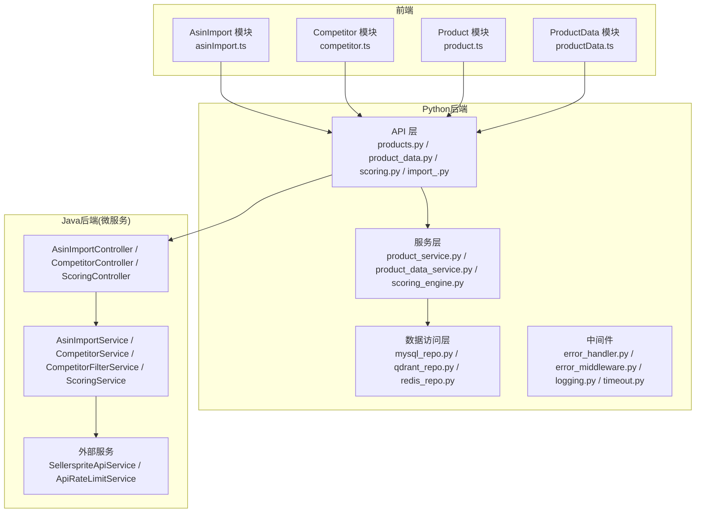
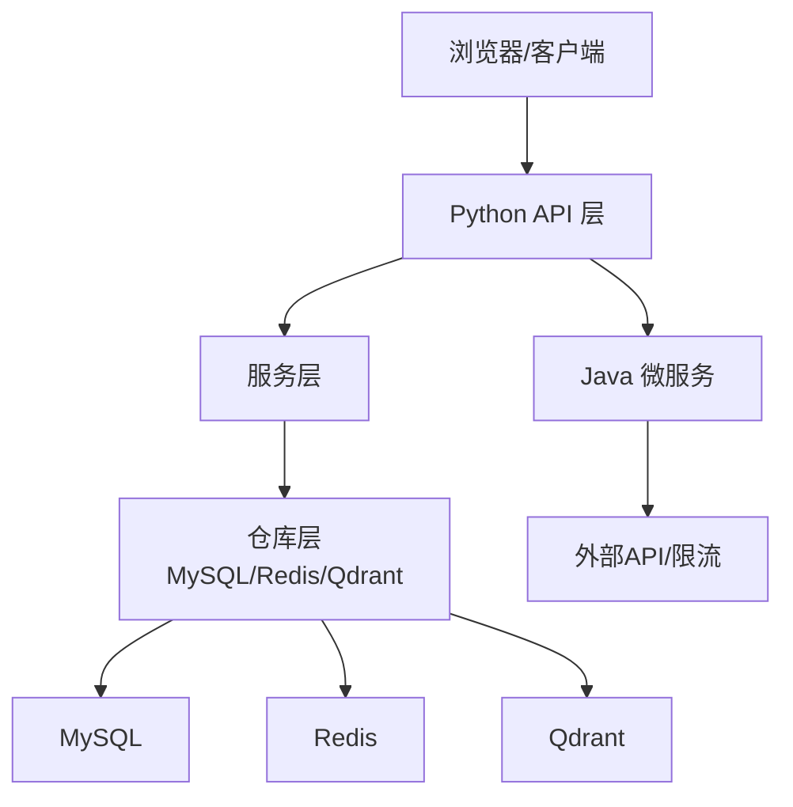
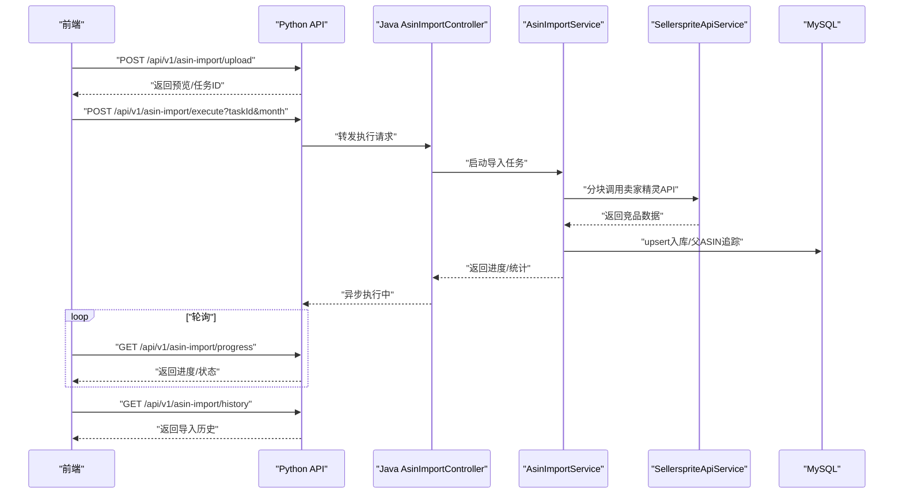
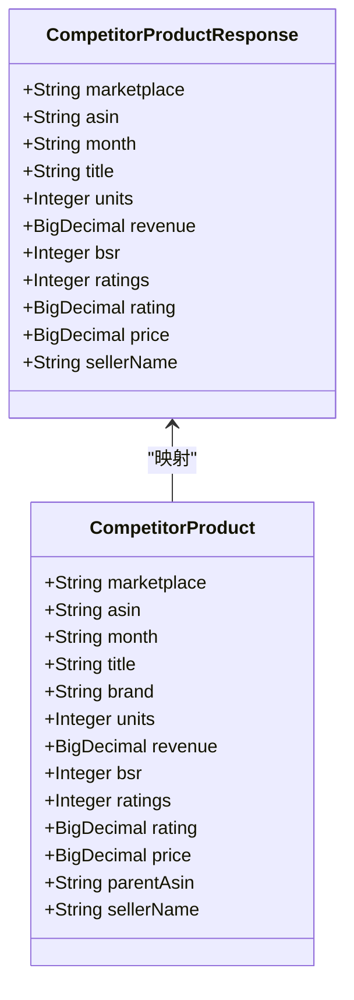
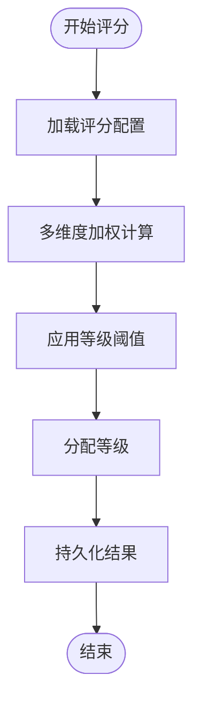
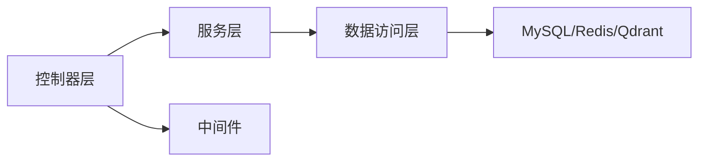

# 产品服务

<cite>
**本文引用的文件**
- [获取asin数据流程.md](file://docs/项目逻辑/选品/获取asin数据流程.md)
- [CompetitorProductResponse.java](file://java-backend/sjzm-product/src/main/java/com/sjzm/product/dto/CompetitorProductResponse.java)
- [CompetitorProduct.java](file://java-backend/sjzm-product/src/main/java/com/sjzm/product/entity/CompetitorProduct.java)
- [AsinImportController.java](file://java-backend/sjzm-product/src/main/java/com/sjzm/product/controller/AsinImportController.java)
- [CompetitorController.java](file://java-backend/sjzm-product/src/main/java/com/sjzm/product/controller/CompetitorController.java)
- [ScoringController.java](file://java-backend/sjzm-product/src/main/java/com/sjzm/product/controller/ScoringController.java)
- [AsinImportService.java](file://java-backend/sjzm-product/src/main/java/com/sjzm/product/service/AsinImportService.java)
- [CompetitorService.java](file://java-backend/sjzm-product/src/main/java/com/sjzm/product/service/CompetitorService.java)
- [CompetitorFilterService.java](file://java-backend/sjzm-product/src/main/java/com/sjzm/product/service/CompetitorFilterService.java)
- [ScoringService.java](file://java-backend/sjzm-product/src/main/java/com/sjzm/product/service/ScoringService.java)
- [SellerspriteApiService.java](file://java-backend/sjzm-product/src/main/java/com/sjzm/product/service/SellerspriteApiService.java)
- [ApiRateLimitService.java](file://java-backend/sjzm-product/src/main/java/com/sjzm/product/service/ApiRateLimitService.java)
- [asinImport.ts](file://frontend/src/api/asinImport.ts)
- [competitor.ts](file://frontend/src/api/competitor.ts)
- [product.ts](file://frontend/src/api/product.ts)
- [productData.ts](file://frontend/src/api/productData.ts)
- [products.py](file://backend/app/api/v1/products.py)
- [product_data.py](file://backend/app/api/v1/product_data.py)
- [scoring.py](file://backend/app/api/v1/scoring.py)
- [import_.py](file://backend/app/api/v1/import_.py)
- [product_service.py](file://backend/app/services/product_service.py)
- [product_data_service.py](file://backend/app/services/product_data_service.py)
- [scoring_engine.py](file://backend/app/services/scoring_engine.py)
- [mysql_repo.py](file://backend/app/repositories/mysql_repo.py)
- [qdrant_repo.py](file://backend/app/repositories/qdrant_repo.py)
- [redis_repo.py](file://backend/app/repositories/redis_repo.py)
- [error_handler.py](file://backend/app/middleware/error_handler.py)
- [error_middleware.py](file://backend/app/middleware/error_middleware.py)
- [logging.py](file://backend/app/middleware/logging.py)
- [timeout.py](file://backend/app/middleware/timeout.py)
- [jwt_utils.py](file://backend/app/utils/jwt_utils.py)
- [config.py](file://backend/app/config.py)
- [main.py](file://backend/app/main.py)
- [application.yml](file://java-backend/sjzm-product/src/main/resources/application.yml)
</cite>

## 目录
1. [简介](#简介)
2. [项目结构](#项目结构)
3. [核心组件](#核心组件)
4. [架构总览](#架构总览)
5. [详细组件分析](#详细组件分析)
6. [依赖关系分析](#依赖关系分析)
7. [性能考量](#性能考量)
8. [故障排查指南](#故障排查指南)
9. [结论](#结论)
10. [附录](#附录)

## 简介
本文件面向“产品服务”的完整技术文档，聚焦以下核心业务能力：
- ASIN导入：支持Excel/JSON上传、批量分块调用、进度跟踪、取消与历史查询。
- 竞品分析：基于卖家精灵API抓取竞品数据，进行去重入库、父ASIN追踪、子类目统计与30天新品追踪。
- 评分系统：评分引擎对竞品进行多维度加权计算，并支持评分等级阈值与动态配置。

同时，文档覆盖产品数据的CRUD、数据校验与业务规则；控制器层、服务层、数据访问层的设计模式；API接口定义（请求参数、响应格式、错误处理）；配置管理、事务与异常处理机制；以及与Java后端、AI向量服务等微服务的集成与数据同步策略。

## 项目结构
产品服务由前后端协同组成：
- 前端：负责用户交互与API调用封装（如ASIN导入、竞品查询、产品管理、评分配置）。
- 后端（Python）：提供REST API、服务编排、数据访问与中间件。
- Java后端（微服务）：提供ASIN导入、竞品查询、评分管理等专用服务，通过HTTP与Python后端协作。

图表来源
- [asinImport.ts](file://frontend/src/api/asinImport.ts)
- [competitor.ts](file://frontend/src/api/competitor.ts)
- [product.ts](file://frontend/src/api/product.ts)
- [productData.ts](file://frontend/src/api/productData.ts)
- [products.py](file://backend/app/api/v1/products.py)
- [product_data.py](file://backend/app/api/v1/product_data.py)
- [scoring.py](file://backend/app/api/v1/scoring.py)
- [import_.py](file://backend/app/api/v1/import_.py)
- [product_service.py](file://backend/app/services/product_service.py)
- [product_data_service.py](file://backend/app/services/product_data_service.py)
- [scoring_engine.py](file://backend/app/services/scoring_engine.py)
- [mysql_repo.py](file://backend/app/repositories/mysql_repo.py)
- [qdrant_repo.py](file://backend/app/repositories/qdrant_repo.py)
- [redis_repo.py](file://backend/app/repositories/redis_repo.py)
- [error_handler.py](file://backend/app/middleware/error_handler.py)
- [error_middleware.py](file://backend/app/middleware/error_middleware.py)
- [logging.py](file://backend/app/middleware/logging.py)
- [timeout.py](file://backend/app/middleware/timeout.py)
- [AsinImportController.java](file://java-backend/sjzm-product/src/main/java/com/sjzm/product/controller/AsinImportController.java)
- [CompetitorController.java](file://java-backend/sjzm-product/src/main/java/com/sjzm/product/controller/CompetitorController.java)
- [ScoringController.java](file://java-backend/sjzm-product/src/main/java/com/sjzm/product/controller/ScoringController.java)
- [AsinImportService.java](file://java-backend/sjzm-product/src/main/java/com/sjzm/product/service/AsinImportService.java)
- [CompetitorService.java](file://java-backend/sjzm-product/src/main/java/com/sjzm/product/service/CompetitorService.java)
- [CompetitorFilterService.java](file://java-backend/sjzm-product/src/main/java/com/sjzm/product/service/CompetitorFilterService.java)
- [ScoringService.java](file://java-backend/sjzm-product/src/main/java/com/sjzm/product/service/ScoringService.java)
- [SellerspriteApiService.java](file://java-backend/sjzm-product/src/main/java/com/sjzm/product/service/SellerspriteApiService.java)
- [ApiRateLimitService.java](file://java-backend/sjzm-product/src/main/java/com/sjzm/product/service/ApiRateLimitService.java)

章节来源
- [main.py](file://backend/app/main.py)
- [config.py](file://backend/app/config.py)

## 核心组件
- ASIN导入链路：前端上传文件 → Python后端接收并生成任务 → Java后端异步分块调用卖家精灵API → 数据入库与追踪 → 前端轮询进度与查看历史。
- 竞品分析：Java后端抓取竞品数据，入库并维护父ASIN追踪、子类目统计与30天新品追踪；前端提供查询与筛选。
- 评分系统：Java后端评分引擎根据配置进行加权计算，支持动态阈值与等级映射；Python后端提供评分配置与查询接口。

章节来源
- [获取asin数据流程.md](file://docs/项目逻辑/选品/获取asin数据流程.md)
- [AsinImportController.java](file://java-backend/sjzm-product/src/main/java/com/sjzm/product/controller/AsinImportController.java)
- [CompetitorController.java](file://java-backend/sjzm-product/src/main/java/com/sjzm/product/controller/CompetitorController.java)
- [ScoringController.java](file://java-backend/sjzm-product/src/main/java/com/sjzm/product/controller/ScoringController.java)

## 架构总览
产品服务采用“前后端分离 + 微服务协作”的架构：
- 前端通过HTTP调用Python后端API，Python后端再调用Java后端微服务完成复杂业务（ASIN导入、竞品抓取、评分）。
- 数据访问层抽象在Python侧，统一通过仓库模式对接MySQL、Redis与Qdrant。
- 中间件层提供统一错误处理、日志与超时控制。

图表来源
- [products.py](file://backend/app/api/v1/products.py)
- [product_data.py](file://backend/app/api/v1/product_data.py)
- [scoring.py](file://backend/app/api/v1/scoring.py)
- [import_.py](file://backend/app/api/v1/import_.py)
- [product_service.py](file://backend/app/services/product_service.py)
- [product_data_service.py](file://backend/app/services/product_data_service.py)
- [scoring_engine.py](file://backend/app/services/scoring_engine.py)
- [mysql_repo.py](file://backend/app/repositories/mysql_repo.py)
- [redis_repo.py](file://backend/app/repositories/redis_repo.py)
- [qdrant_repo.py](file://backend/app/repositories/qdrant_repo.py)
- [AsinImportController.java](file://java-backend/sjzm-product/src/main/java/com/sjzm/product/controller/AsinImportController.java)
- [CompetitorController.java](file://java-backend/sjzm-product/src/main/java/com/sjzm/product/controller/CompetitorController.java)
- [ScoringController.java](file://java-backend/sjzm-product/src/main/java/com/sjzm/product/controller/ScoringController.java)

## 详细组件分析

### ASIN导入组件
- 前端：封装上传、执行、进度轮询、取消与历史查询的API调用。
- Python后端：接收文件、生成任务、调度Java后端执行。
- Java后端：解析文件、分块调用卖家精灵API、去重入库、父ASIN追踪、统计与配额控制。

图表来源
- [asinImport.ts](file://frontend/src/api/asinImport.ts)
- [AsinImportController.java](file://java-backend/sjzm-product/src/main/java/com/sjzm/product/controller/AsinImportController.java)
- [AsinImportService.java](file://java-backend/sjzm-product/src/main/java/com/sjzm/product/service/AsinImportService.java)
- [SellerspriteApiService.java](file://java-backend/sjzm-product/src/main/java/com/sjzm/product/service/SellerspriteApiService.java)
- [获取asin数据流程.md](file://docs/项目逻辑/选品/获取asin数据流程.md)

章节来源
- [获取asin数据流程.md](file://docs/项目逻辑/选品/获取asin数据流程.md)
- [AsinImportController.java](file://java-backend/sjzm-product/src/main/java/com/sjzm/product/controller/AsinImportController.java)
- [AsinImportService.java](file://java-backend/sjzm-product/src/main/java/com/sjzm/product/service/AsinImportService.java)
- [SellerspriteApiService.java](file://java-backend/sjzm-product/src/main/java/com/sjzm/product/service/SellerspriteApiService.java)

### 竞品分析组件
- 数据模型：Java实体与DTO包含丰富的竞品指标（销量、BSR、评分、价格、利润、FBA等），用于入库与对外响应。
- 服务层：提供竞品查询、历史查询、父ASIN/变体识别、子类目统计与30天追踪。
- 前端：提供筛选、排序与详情展示。

图表来源
- [CompetitorProduct.java](file://java-backend/sjzm-product/src/main/java/com/sjzm/product/entity/CompetitorProduct.java)
- [CompetitorProductResponse.java](file://java-backend/sjzm-product/src/main/java/com/sjzm/product/dto/CompetitorProductResponse.java)

章节来源
- [CompetitorProduct.java](file://java-backend/sjzm-product/src/main/java/com/sjzm/product/entity/CompetitorProduct.java)
- [CompetitorProductResponse.java](file://java-backend/sjzm-product/src/main/java/com/sjzm/product/dto/CompetitorProductResponse.java)
- [CompetitorController.java](file://java-backend/sjzm-product/src/main/java/com/sjzm/product/controller/CompetitorController.java)
- [CompetitorService.java](file://java-backend/sjzm-product/src/main/java/com/sjzm/product/service/CompetitorService.java)

### 评分系统组件
- Java后端：评分服务根据配置进行加权计算，支持动态阈值与等级映射。
- Python后端：提供评分配置与查询接口，供前端配置与展示。

图表来源
- [ScoringService.java](file://java-backend/sjzm-product/src/main/java/com/sjzm/product/service/ScoringService.java)
- [ScoringController.java](file://java-backend/sjzm-product/src/main/java/com/sjzm/product/controller/ScoringController.java)
- [scoring_engine.py](file://backend/app/services/scoring_engine.py)
- [scoring.py](file://backend/app/api/v1/scoring.py)

章节来源
- [ScoringService.java](file://java-backend/sjzm-product/src/main/java/com/sjzm/product/service/ScoringService.java)
- [ScoringController.java](file://java-backend/sjzm-product/src/main/java/com/sjzm/product/controller/ScoringController.java)
- [scoring_engine.py](file://backend/app/services/scoring_engine.py)
- [scoring.py](file://backend/app/api/v1/scoring.py)

### 产品数据CRUD与校验
- CRUD：Python后端提供产品与产品数据的增删改查接口，配合仓库层实现MySQL/Redis/Qdrant的数据访问。
- 校验与规则：前端与后端共同进行输入校验；Java后端在导入与评分环节实施业务规则（如父ASIN追踪、去重、配额控制）。

章节来源
- [products.py](file://backend/app/api/v1/products.py)
- [product_data.py](file://backend/app/api/v1/product_data.py)
- [product_service.py](file://backend/app/services/product_service.py)
- [product_data_service.py](file://backend/app/services/product_data_service.py)
- [mysql_repo.py](file://backend/app/repositories/mysql_repo.py)
- [redis_repo.py](file://backend/app/repositories/redis_repo.py)
- [qdrant_repo.py](file://backend/app/repositories/qdrant_repo.py)

## 依赖关系分析
- 控制器层：承接前端请求，编排服务层，返回标准化响应。
- 服务层：封装业务逻辑，协调外部服务与数据访问。
- 数据访问层：统一抽象数据库与向量存储，屏蔽底层差异。
- 中间件：提供统一的错误处理、日志与超时控制，保障稳定性。

图表来源
- [products.py](file://backend/app/api/v1/products.py)
- [product_data.py](file://backend/app/api/v1/product_data.py)
- [scoring.py](file://backend/app/api/v1/scoring.py)
- [import_.py](file://backend/app/api/v1/import_.py)
- [product_service.py](file://backend/app/services/product_service.py)
- [product_data_service.py](file://backend/app/services/product_data_service.py)
- [scoring_engine.py](file://backend/app/services/scoring_engine.py)
- [mysql_repo.py](file://backend/app/repositories/mysql_repo.py)
- [redis_repo.py](file://backend/app/repositories/redis_repo.py)
- [qdrant_repo.py](file://backend/app/repositories/qdrant_repo.py)
- [error_handler.py](file://backend/app/middleware/error_handler.py)
- [error_middleware.py](file://backend/app/middleware/error_middleware.py)
- [logging.py](file://backend/app/middleware/logging.py)
- [timeout.py](file://backend/app/middleware/timeout.py)

## 性能考量
- 异步与分块：ASIN导入采用分块与异步执行，降低单次请求压力，提升吞吐。
- 缓存与索引：Redis用于热点数据与会话，MySQL建立必要索引以优化查询。
- 向量检索：Qdrant用于相似度检索与推荐场景，建议合理设置分区与索引参数。
- 超时与重试：中间件统一超时控制，避免慢请求拖垮系统；对外部API调用实施指数退避与熔断策略。

## 故障排查指南
- 错误处理：统一的错误中间件捕获异常并返回标准格式；日志中间件记录请求上下文，便于定位问题。
- 超时控制：对长耗时任务启用超时保护，防止资源泄露。
- 认证与授权：通过JWT工具进行令牌校验，确保接口安全。
- 配置检查：核对Java后端application.yml中的数据库、外部API密钥与限流配置。

章节来源
- [error_handler.py](file://backend/app/middleware/error_handler.py)
- [error_middleware.py](file://backend/app/middleware/error_middleware.py)
- [logging.py](file://backend/app/middleware/logging.py)
- [timeout.py](file://backend/app/middleware/timeout.py)
- [jwt_utils.py](file://backend/app/utils/jwt_utils.py)
- [application.yml](file://java-backend/sjzm-product/src/main/resources/application.yml)

## 结论
产品服务通过前后端协作与微服务拆分，实现了从ASIN导入、竞品抓取到评分管理的全链路闭环。通过仓库层抽象与中间件治理，系统具备良好的扩展性与稳定性。建议持续完善数据质量校验、限流与熔断策略，并加强监控与告警体系，以支撑业务高并发场景。

## 附录

### API 接口文档（Python后端）

- 产品管理
  - GET /api/v1/products
    - 查询参数：分页、筛选条件（如市场、ASIN、品牌等）
    - 响应：分页列表，包含基础属性
  - GET /api/v1/products/{id}
    - 响应：单个产品详情
  - POST /api/v1/products
    - 请求体：产品创建字段
    - 响应：创建后的完整产品信息
  - PUT /api/v1/products/{id}
    - 请求体：更新字段
    - 响应：更新后的完整产品信息
  - DELETE /api/v1/products/{id}
    - 响应：删除结果

- 产品数据
  - GET /api/v1/product-data
    - 查询参数：分页、筛选、排序
    - 响应：竞品数据列表（销量、BSR、评分、价格等）
  - GET /api/v1/product-data/{id}
    - 响应：单条产品数据详情
  - POST /api/v1/product-data/batch-save
    - 请求体：批量保存字段
    - 响应：批量保存结果

- 评分配置
  - GET /api/v1/scoring/config
    - 响应：评分维度与阈值配置
  - POST /api/v1/scoring/config
    - 请求体：配置更新
    - 响应：更新后的配置

- ASIN导入
  - POST /api/v1/asin-import/upload
    - 请求体：文件上传（Excel/JSON）
    - 响应：预览与任务ID
  - POST /api/v1/asin-import/execute
    - 查询参数：taskId, month
    - 响应：异步执行状态
  - GET /api/v1/asin-import/progress
    - 查询参数：taskId
    - 响应：进度与统计
  - POST /api/v1/asin-import/cancel
    - 查询参数：taskId
    - 响应：取消结果
  - GET /api/v1/asin-import/history
    - 查询参数：按月分组
    - 响应：导入历史

章节来源
- [products.py](file://backend/app/api/v1/products.py)
- [product_data.py](file://backend/app/api/v1/product_data.py)
- [scoring.py](file://backend/app/api/v1/scoring.py)
- [import_.py](file://backend/app/api/v1/import_.py)

### API 接口文档（Java后端微服务）

- ASIN导入
  - POST /api/v1/asin-import/upload
  - POST /api/v1/asin-import/execute
  - GET /api/v1/asin-import/progress
  - POST /api/v1/asin-import/cancel
  - GET /api/v1/asin-import/history

- 竞品查询
  - GET /api/v1/competitor/query
  - GET /api/v1/competitor/history
  - GET /api/v1/competitor/quota

- 评分管理
  - GET /api/v1/scoring/config
  - POST /api/v1/scoring/config
  - GET /api/v1/scoring/list

章节来源
- [AsinImportController.java](file://java-backend/sjzm-product/src/main/java/com/sjzm/product/controller/AsinImportController.java)
- [CompetitorController.java](file://java-backend/sjzm-product/src/main/java/com/sjzm/product/controller/CompetitorController.java)
- [ScoringController.java](file://java-backend/sjzm-product/src/main/java/com/sjzm/product/controller/ScoringController.java)

### 数据模型与字段说明（Java后端）

- 竞品实体（部分字段）
  - marketplace：市场
  - asin：ASIN
  - month：数据月份
  - title/brand：标题与品牌
  - units/revenue：销量与收入
  - bsr/ratings/rating：BSR与评价
  - price：价格
  - parentAsin：父ASIN
  - sellerName：店铺名

章节来源
- [CompetitorProduct.java](file://java-backend/sjzm-product/src/main/java/com/sjzm/product/entity/CompetitorProduct.java)
- [CompetitorProductResponse.java](file://java-backend/sjzm-product/src/main/java/com/sjzm/product/dto/CompetitorProductResponse.java)

### 集成与数据同步策略
- 与Java后端集成：Python后端通过HTTP调用Java微服务，实现ASIN导入、竞品抓取与评分管理。
- 与AI向量服务集成：Qdrant用于向量化检索与相似度匹配，建议定期同步竞品特征向量。
- 数据一致性：通过任务队列与幂等设计保证导入与评分过程的最终一致性；对关键写操作使用事务或补偿机制。

章节来源
- [qdrant_repo.py](file://backend/app/repositories/qdrant_repo.py)
- [AsinImportService.java](file://java-backend/sjzm-product/src/main/java/com/sjzm/product/service/AsinImportService.java)
- [CompetitorFilterService.java](file://java-backend/sjzm-product/src/main/java/com/sjzm/product/service/CompetitorFilterService.java)