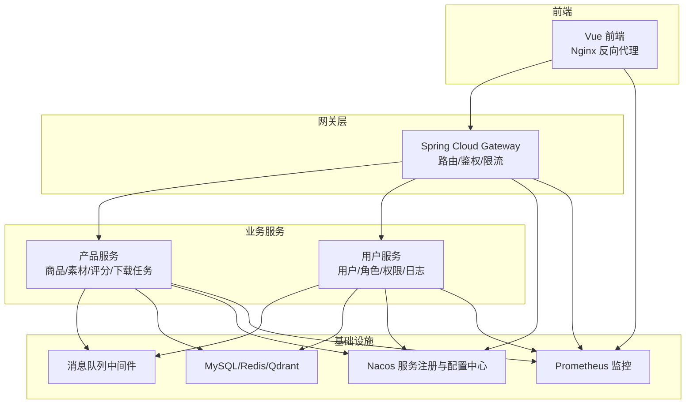
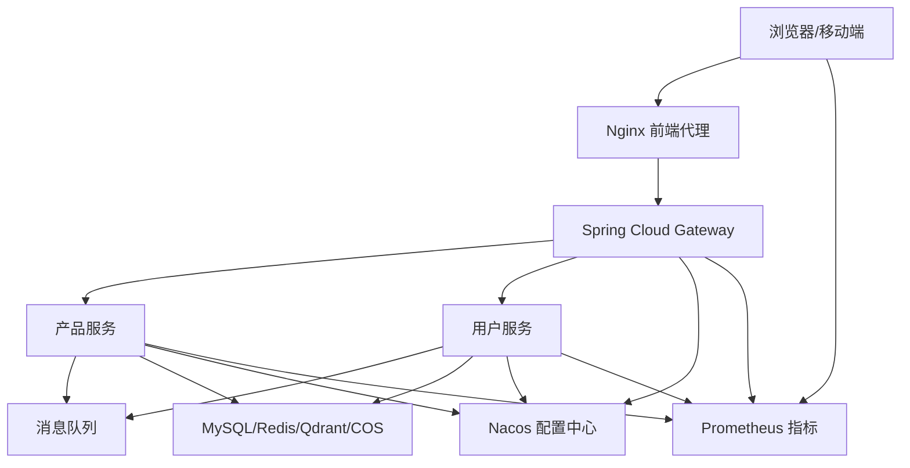
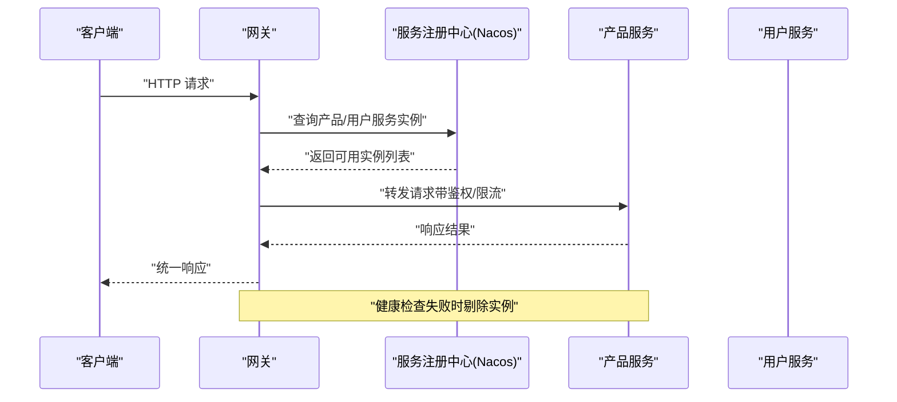
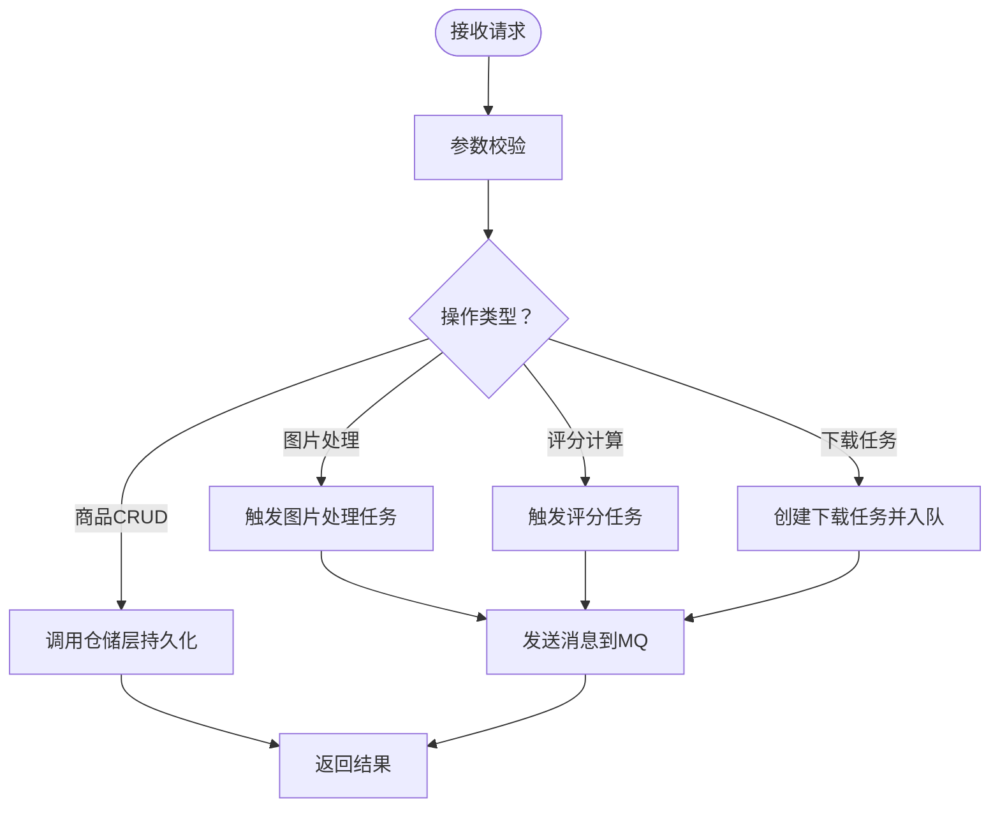
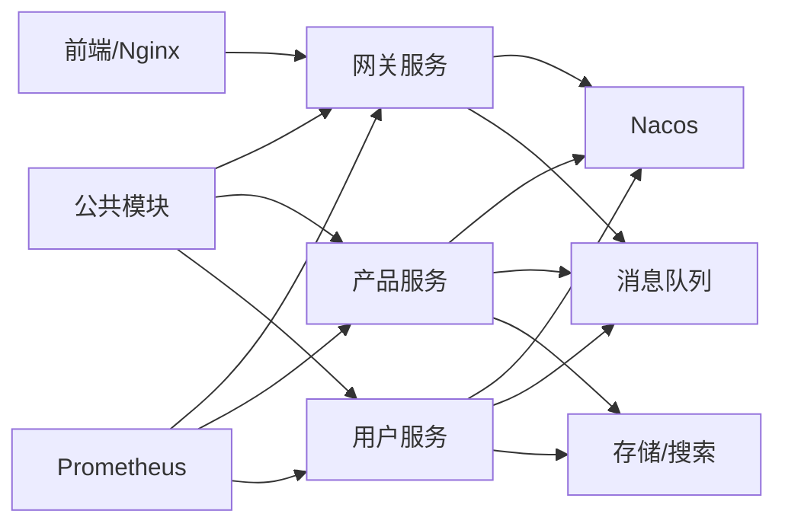

# 微服务架构

<cite>
**本文引用的文件**
- [pom.xml](file://java-backend/pom.xml)
- [GatewayApplication.java](file://java-backend/sjzm-gateway/src/main/java/com/sjzm/gateway/GatewayApplication.java)
- [ProductApplication.java](file://java-backend/sjzm-product/src/main/java/com/sjzm/product/ProductApplication.java)
- [UserApplication.java](file://java-backend/sjzm-user/src/main/java/com/sjzm/user/UserApplication.java)
- [application.yml（网关）](file://java-backend/sjzm-gateway/src/main/resources/application.yml)
- [application.yml（产品）](file://java-backend/sjzm-product/src/main/resources/application.yml)
- [application.yml（用户）](file://java-backend/sjzm-user/src/main/resources/application.yml)
- [application.yml（公共）](file://java-backend/src/main/resources/application.yml)
- [docker-compose.nacos.yml](file://java-backend/docker-compose.nacos.yml)
- [backend-deployment.yaml](file://k8s/backend-deployment.yaml)
- [prometheus.yml](file://prometheus/prometheus.yml)
- [README.md（架构设计文档-微服务分离方案）](file://docs/架构设计文档-微服务分离方案.md)
- [README.md（网关）](file://docs/网关.md)
- [README.md（Docker生产环境独立部署方案）](file://docs/架构/Docker生产环境独立部署方案.md)
- [README.md（架构分析与优化）](file://docs/架构/架构分析与优化.md)
- [README.md（端口）](file://docs/架构/端口.md)
- [nginx.conf](file://frontend/nginx.conf)
- [nginx.prod.conf](file://frontend/nginx.prod.conf)
- [openapi.json](file://frontend/openapi.json)
- [docker-compose.yml](file://docker-compose.yml)
- [docker-compose.dev.yml](file://docker-compose.dev.yml)
- [docker-compose.prod.yml](file://docker-compose.prod.yml)
- [docker-compose.prod-simple.yml](file://docker-compose.prod-simple.yml)
- [start_dev_java.bat](file://start_dev_java.bat)
- [start_vite_dev.py](file://backend/start_vite_dev.py)
- [start_celery.py](file://backend/start_celery.py)
- [requirements.txt](file://backend/requirements.txt)
- [config.py（后端）](file://backend/config.py)
- [config.py（Python-AI）](file://python-ai/config.py)
- [AGENTS.md](file://java-backend/AGENTS.md)
- [CLAUDE.md](file://java-backend/CLAUDE.md)
- [README.md（项目自检清单）](file://docs/项目自检清单.md)
- [README.md（生产部署检查清单）](file://docs/生产部署检查清单.md)
- [README.md（Docker部署问题报告_20260510）](file://docs/Docker部署问题报告_20260510.md)
- [README.md（问题记录）](file://docs/问题记录/生产环境图片加载失败-COS_BUCKET配置错误.md)
</cite>

## 目录
1. [引言](#引言)
2. [项目结构](#项目结构)
3. [核心组件](#核心组件)
4. [架构总览](#架构总览)
5. [详细组件分析](#详细组件分析)
6. [依赖分析](#依赖分析)
7. [性能考虑](#性能考虑)
8. [故障排查指南](#故障排查指南)
9. [结论](#结论)
10. [附录](#附录)

## 引言
本文件面向“思觉智贸”系统的Java微服务架构，系统性梳理服务拆分原则、服务边界、服务发现与负载均衡、API网关路由、服务间通信（REST与消息队列）、部署架构、配置管理与监控策略，并给出服务依赖关系图与服务拓扑结构。目标是帮助技术与非技术读者快速理解系统现状、运行方式与演进方向。

## 项目结构
后端采用多模块Maven工程组织，包含公共模块、网关服务、产品服务、用户服务等；前端通过Nginx进行静态资源与反向代理；容器编排支持Docker Compose与Kubernetes；Prometheus用于指标采集；OpenAPI定义了接口契约；脚本与CI/CD流程支撑开发与运维。

图表来源
- [application.yml（网关）](file://java-backend/sjzm-gateway/src/main/resources/application.yml)
- [application.yml（产品）](file://java-backend/sjzm-product/src/main/resources/application.yml)
- [application.yml（用户）](file://java-backend/sjzm-user/src/main/resources/application.yml)
- [docker-compose.nacos.yml](file://java-backend/docker-compose.nacos.yml)
- [prometheus.yml](file://prometheus/prometheus.yml)

章节来源
- [pom.xml](file://java-backend/pom.xml)
- [docker-compose.yml](file://docker-compose.yml)
- [docker-compose.prod.yml](file://docker-compose.prod.yml)
- [backend-deployment.yaml](file://k8s/backend-deployment.yaml)

## 核心组件
- 网关服务（Gateway）
  - 职责：统一入口、路由转发、鉴权校验、限流熔断、灰度发布、跨域处理、请求链路追踪。
  - 关键配置：路由规则、上游服务名、超时与重试、限流策略、健康检查路径。
- 产品服务（Product）
  - 职责：商品数据管理、素材库、评分体系、下载任务、最终稿、导入导出、图片处理、搜索引擎对接。
  - 关键配置：数据库连接、缓存策略、向量库（Qdrant）接入、第三方图像识别服务、COS对象存储。
- 用户服务（User）
  - 职责：用户管理、角色权限、系统配置、日志审计、筛选预设、登录认证。
  - 关键配置：数据库连接、Redis会话/缓存、安全相关参数、审计日志。
- 公共模块（Common）
  - 职责：通用注解、切面、拦截器、异常体系、MQ封装、工具类。
- 消息队列（MQ）
  - 职责：异步解耦、削峰填谷、事件驱动（如图片识别、下载任务、评分计算）。
- 配置中心（Nacos）
  - 职责：集中式配置管理、动态刷新、服务注册与发现。
- 监控（Prometheus + 前端埋点）
  - 职责：指标采集、告警、性能观测、用户体验监控。

章节来源
- [GatewayApplication.java](file://java-backend/sjzm-gateway/src/main/java/com/sjzm/gateway/GatewayApplication.java)
- [ProductApplication.java](file://java-backend/sjzm-product/src/main/java/com/sjzm/product/ProductApplication.java)
- [UserApplication.java](file://java-backend/sjzm-user/src/main/java/com/sjzm/user/UserApplication.java)
- [application.yml（公共）](file://java-backend/src/main/resources/application.yml)

## 架构总览
系统采用“前端+Nginx+网关+多微服务+消息队列+配置中心+监控”的整体架构。前端通过Nginx进行静态资源与反向代理，网关负责统一入口与路由；产品与用户服务分别承载业务能力；公共模块沉淀通用能力；Nacos提供服务治理；Prometheus采集指标；OpenAPI定义契约；Docker/K8s实现容器化部署。

图表来源
- [nginx.conf](file://frontend/nginx.conf)
- [nginx.prod.conf](file://frontend/nginx.prod.conf)
- [application.yml（网关）](file://java-backend/sjzm-gateway/src/main/resources/application.yml)
- [application.yml（产品）](file://java-backend/sjzm-product/src/main/resources/application.yml)
- [application.yml（用户）](file://java-backend/sjzm-user/src/main/resources/application.yml)
- [docker-compose.nacos.yml](file://java-backend/docker-compose.nacos.yml)
- [prometheus.yml](file://prometheus/prometheus.yml)

## 详细组件分析

### 网关服务（Gateway）
- 功能边界
  - 统一入口与路由转发：根据路径前缀或服务名将请求分发至产品/用户服务。
  - 安全与鉴权：基于JWT或会话进行身份验证与授权。
  - 限流与熔断：防止雪崩效应，保护下游服务。
  - 健康检查与可观测性：暴露健康检查端点，接入Prometheus。
- 路由转发逻辑
  - 基于服务名的负载均衡：网关通过服务注册中心获取实例列表，结合负载均衡策略（轮询/权重/响应时间）选择实例。
  - 路径匹配与重写：对特定路径进行前缀去除或重写，确保后端服务感知到干净的内部路径。
  - 超时与重试：针对慢请求设置超时与有限次数的重试，避免资源占用。
- 与服务发现的交互
  - 从Nacos拉取服务列表，动态更新路由表。
  - 健康检查失败时剔除实例，保障流量只投递到可用节点。
- 与消息队列的集成
  - 对外HTTP接口作为触发器，内部通过消息队列异步处理耗时任务（如图片识别、评分计算、下载任务）。

图表来源
- [application.yml（网关）](file://java-backend/sjzm-gateway/src/main/resources/application.yml)
- [docker-compose.nacos.yml](file://java-backend/docker-compose.nacos.yml)

章节来源
- [GatewayApplication.java](file://java-backend/sjzm-gateway/src/main/java/com/sjzm/gateway/GatewayApplication.java)
- [application.yml（网关）](file://java-backend/sjzm-gateway/src/main/resources/application.yml)
- [README.md（网关）](file://docs/网关.md)

### 产品服务（Product）
- 功能边界
  - 商品数据管理：增删改查、导入导出、回收站、筛选与统计。
  - 素材库与图片：上传、缩略图生成、离线缓存、COS对象存储。
  - 评分与选品：评分引擎、竞品分析、选品推荐。
  - 下载任务：批量下载、任务调度、状态跟踪。
  - 最终稿：定稿图片、版本管理、展示逻辑。
- 服务发现与负载均衡
  - 注册到Nacos，网关按策略选择实例。
- 与消息队列的集成
  - 图片识别、向量化、评分计算等异步任务通过MQ解耦。
- 数据与外部系统
  - MySQL持久化；Redis缓存热点数据；Qdrant向量检索；COS对象存储；第三方图像识别服务。

图表来源
- [application.yml（产品）](file://java-backend/sjzm-product/src/main/resources/application.yml)

章节来源
- [ProductApplication.java](file://java-backend/sjzm-product/src/main/java/com/sjzm/product/ProductApplication.java)
- [application.yml（产品）](file://java-backend/sjzm-product/src/main/resources/application.yml)

### 用户服务（User）
- 功能边界
  - 用户管理：用户增删改查、角色与权限、登录认证。
  - 系统配置：全局配置、筛选预设、日志审计。
  - 日志与统计：操作日志、访问日志、统计报表。
- 服务发现与负载均衡
  - 注册到Nacos，网关按策略选择实例。
- 与消息队列的集成
  - 审计日志、通知等异步任务通过MQ处理。

章节来源
- [UserApplication.java](file://java-backend/sjzm-user/src/main/java/com/sjzm/user/UserApplication.java)
- [application.yml（用户）](file://java-backend/sjzm-user/src/main/resources/application.yml)

### 公共模块（Common）
- 职责
  - 通用注解、切面（鉴权、日志、性能）、拦截器、异常处理、MQ封装、工具类。
- 作用
  - 降低重复代码，提升横切关注点的一致性与可维护性。

章节来源
- [application.yml（公共）](file://java-backend/src/main/resources/application.yml)

### 配置中心与服务发现（Nacos）
- 配置管理
  - 各服务从Nacos拉取配置，支持动态刷新，减少重启成本。
- 服务发现
  - 服务启动时注册，下线时注销；网关与服务通过Nacos获取实例列表。
- 健康检查
  - 定期健康检查，剔除不可用实例，保障流量正确投递。

章节来源
- [docker-compose.nacos.yml](file://java-backend/docker-compose.nacos.yml)
- [application.yml（网关）](file://java-backend/sjzm-gateway/src/main/resources/application.yml)
- [application.yml（产品）](file://java-backend/sjzm-product/src/main/resources/application.yml)
- [application.yml（用户）](file://java-backend/sjzm-user/src/main/resources/application.yml)

### 监控与可观测性
- 指标采集
  - Prometheus抓取各服务指标，前端页面埋点上报用户体验指标。
- 告警与可视化
  - 结合告警规则与仪表盘，实现故障预警与性能分析。
- 日志与追踪
  - 统一日志格式与链路追踪ID，便于定位问题。

章节来源
- [prometheus.yml](file://prometheus/prometheus.yml)
- [README.md（架构分析与优化）](file://docs/架构/架构分析与优化.md)

## 依赖分析
- 模块依赖
  - 网关、产品、用户服务均依赖公共模块；服务之间通过HTTP与消息队列交互。
- 外部依赖
  - Nacos（服务注册与配置）、消息队列（异步）、MySQL/Redis/Qdrant/COS（数据与存储）、Prometheus（监控）。
- 运行时依赖
  - Docker Compose/Kubernetes编排；Nginx反向代理；OpenAPI契约；CI/CD流水线。

图表来源
- [pom.xml](file://java-backend/pom.xml)
- [docker-compose.nacos.yml](file://java-backend/docker-compose.nacos.yml)
- [nginx.conf](file://frontend/nginx.conf)
- [prometheus.yml](file://prometheus/prometheus.yml)

章节来源
- [pom.xml](file://java-backend/pom.xml)
- [docker-compose.yml](file://docker-compose.yml)
- [docker-compose.prod.yml](file://docker-compose.prod.yml)

## 性能考虑
- 服务发现与负载均衡
  - 使用Nacos与网关内置负载均衡，结合健康检查剔除故障实例，提升可用性与吞吐。
- 缓存与异步
  - Redis缓存热点数据；MQ异步处理耗时任务，降低请求延迟。
- 存储与检索
  - Qdrant向量化检索加速；MySQL索引优化；COS对象存储降低数据库压力。
- 监控与容量规划
  - Prometheus指标驱动容量规划与性能优化；前端埋点辅助用户体验优化。

## 故障排查指南
- 登录失败（数据库密码hash不一致）
  - 检查用户服务数据库初始化与密码哈希一致性。
- 生产环境图片加载失败（COS_BUCKET配置错误）
  - 核对COS相关配置项，确认桶名与访问凭证。
- Docker部署问题
  - 参考部署问题报告与生产部署检查清单，逐项核对环境变量、端口映射、卷挂载。
- 网关路由规则问题
  - 检查网关路由配置与上游服务名是否一致，确认Nacos中服务已注册且健康。

章节来源
- [README.md（问题记录）](file://docs/问题记录/生产环境图片加载失败-COS_BUCKET配置错误.md)
- [README.md（Docker部署问题报告_20260510）](file://docs/Docker部署问题报告_20260510.md)
- [README.md（生产部署检查清单）](file://docs/生产部署检查清单.md)

## 结论
该微服务架构以“网关+多业务服务+公共模块+消息队列+配置中心+监控”为核心，实现了高内聚低耦合的服务拆分与清晰的职责边界。通过Nacos实现服务治理，通过MQ实现异步解耦，通过Prometheus实现可观测性，整体具备良好的扩展性与稳定性。建议持续完善契约管理、灰度发布与混沌工程演练，进一步提升系统韧性与交付效率。

## 附录
- 部署与运维
  - Docker Compose与Kubernetes部署方案参见对应文档与YAML。
  - 开发与生产环境差异配置参见compose文件与应用配置。
- 接口契约
  - 前端OpenAPI定义了接口规范，可用于前后端协同与自动化测试。
- 开发与测试
  - 启动脚本与依赖清单参见相应文件，确保本地开发环境一致性。

章节来源
- [README.md（Docker生产环境独立部署方案）](file://docs/架构/Docker生产环境独立部署方案.md)
- [backend-deployment.yaml](file://k8s/backend-deployment.yaml)
- [openapi.json](file://frontend/openapi.json)
- [docker-compose.dev.yml](file://docker-compose.dev.yml)
- [start_dev_java.bat](file://start_dev_java.bat)
- [start_vite_dev.py](file://backend/start_vite_dev.py)
- [start_celery.py](file://backend/start_celery.py)
- [requirements.txt](file://backend/requirements.txt)
- [config.py（后端）](file://backend/config.py)
- [config.py（Python-AI）](file://python-ai/config.py)
- [AGENTS.md](file://java-backend/AGENTS.md)
- [CLAUDE.md](file://java-backend/CLAUDE.md)
- [README.md（架构设计文档-微服务分离方案）](file://docs/架构设计文档-微服务分离方案.md)
- [README.md（端口）](file://docs/架构/端口.md)