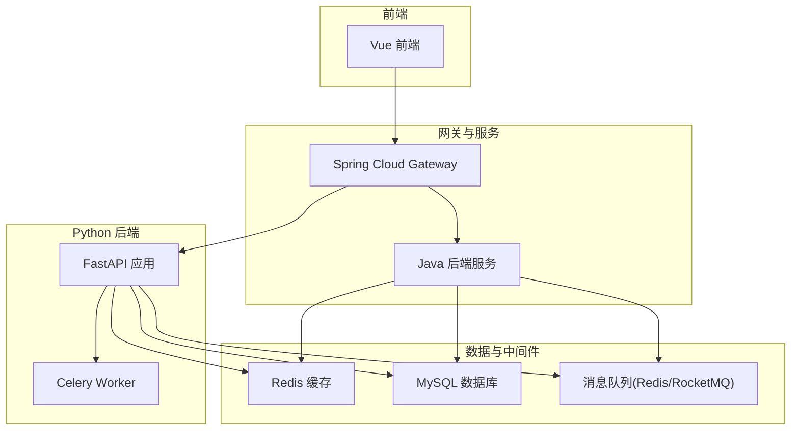
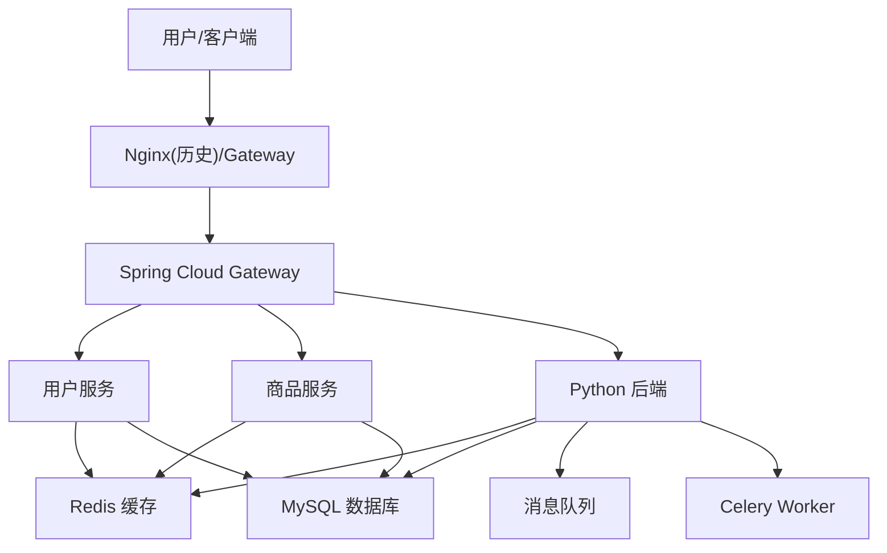
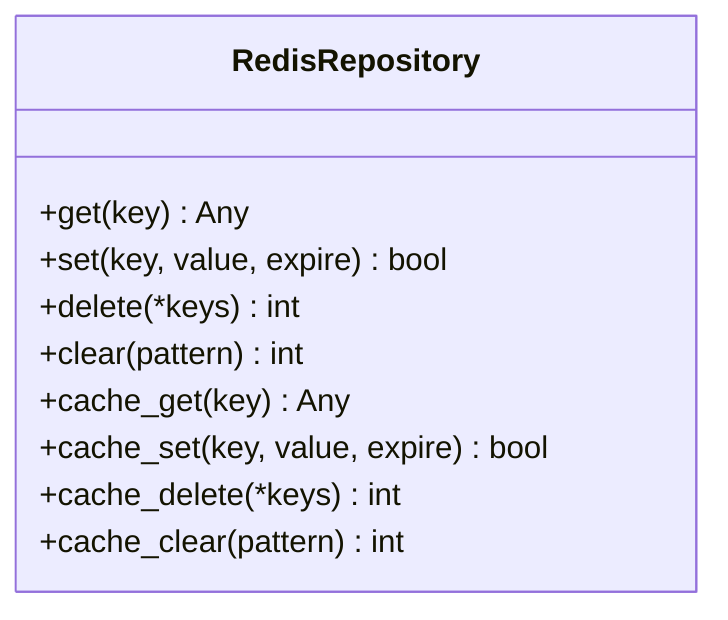
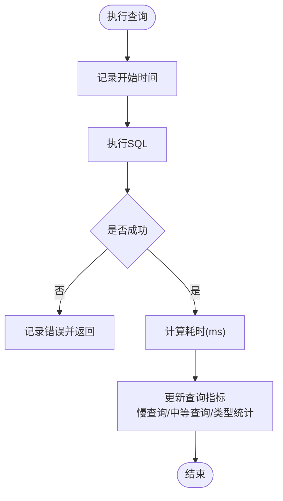
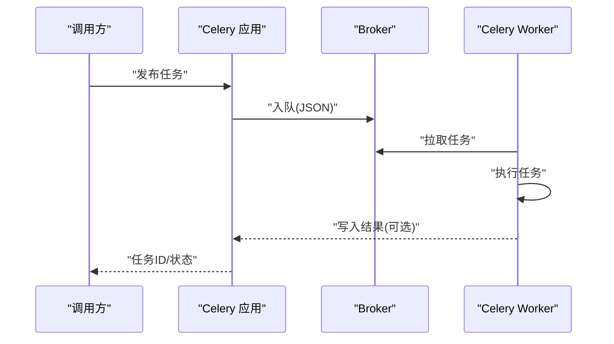
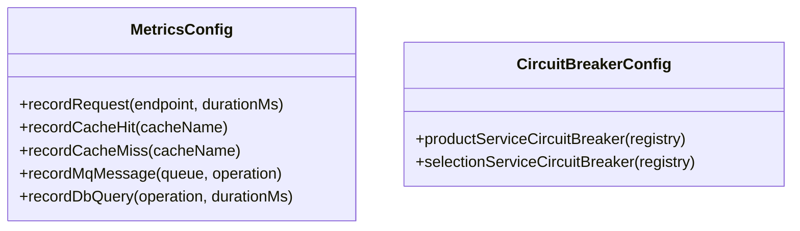
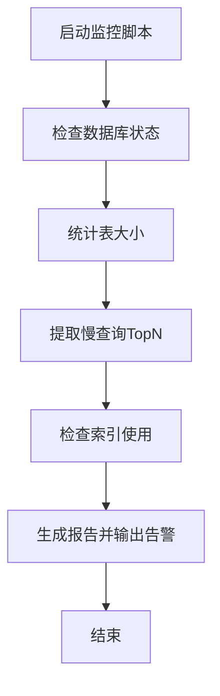
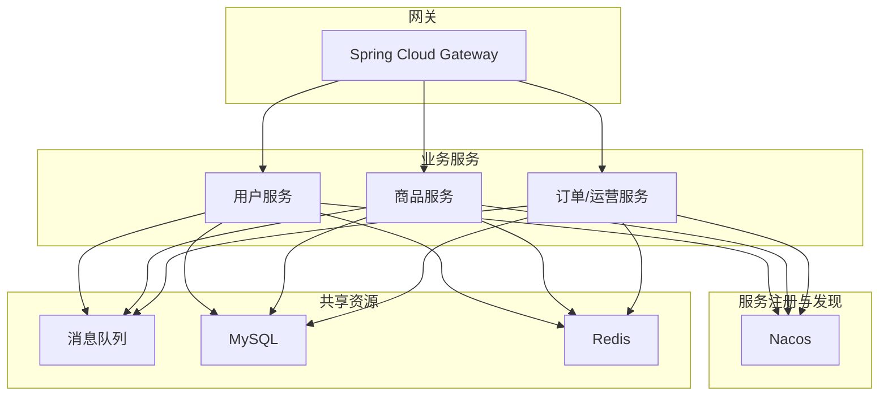
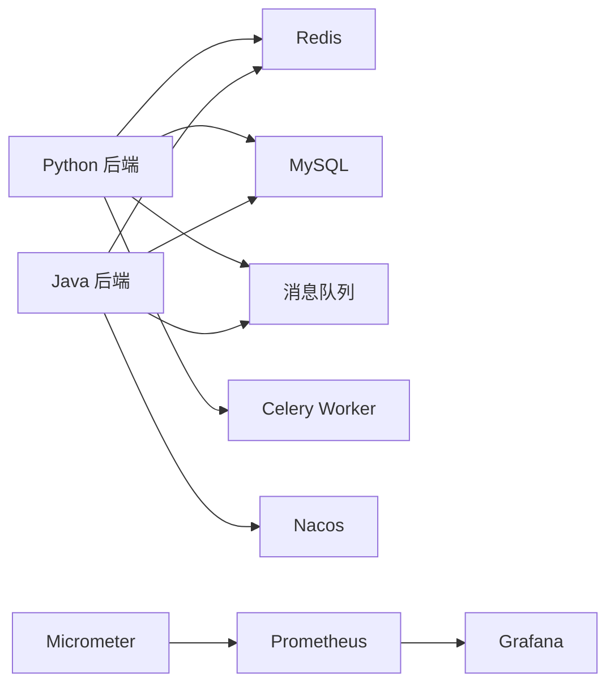

# 性能与可扩展性

<cite>
**本文引用的文件**
- [backend/app/repositories/mysql_repo.py](file://backend/app/repositories/mysql_repo.py)
- [backend/app/repositories/redis_repo.py](file://backend/app/repositories/redis_repo.py)
- [backend/app/tasks/celery_app.py](file://backend/app/tasks/celery_app.py)
- [backend/start_celery.py](file://backend/start_celery.py)
- [scripts/monitoring/performance_monitor.py](file://scripts/monitoring/performance_monitor.py)
- [java-backend/src/main/java/com/sjzm/config/MetricsConfig.java](file://java-backend/src/main/java/com/sjzm/config/MetricsConfig.java)
- [java-backend/src/main/java/com/sjzm/config/CircuitBreakerConfig.java](file://java-backend/src/main/java/com/sjzm/config/CircuitBreakerConfig.java)
- [openspec/changes/microservices-migration/design.md](file://openspec/changes/microservices-migration/design.md)
- [openspec/changes/microservices-migration/specs/independent-deployment/spec.md](file://openspec/changes/microservices-migration/specs/independent-deployment/spec.md)
- [openspec/changes/microservices-migration/tasks.md](file://openspec/changes/microservices-migration/tasks.md)
- [docs/生产部署检查清单.md](file://docs/生产部署检查清单.md)
- [prometheus/prometheus.yml](file://prometheus/prometheus.yml)
- [docker-compose.prod.yml](file://docker-compose.prod.yml)
</cite>

## 目录
1. [简介](#简介)
2. [项目结构](#项目结构)
3. [核心组件](#核心组件)
4. [架构总览](#架构总览)
5. [详细组件分析](#详细组件分析)
6. [依赖关系分析](#依赖关系分析)
7. [性能考量](#性能考量)
8. [故障排查指南](#故障排查指南)
9. [结论](#结论)
10. [附录](#附录)

## 简介
本文件聚焦于“思觉智贸系统”的性能与可扩展性设计与实践，覆盖以下主题：
- 性能优化策略：缓存机制、数据库优化、异步任务处理
- 可扩展性设计：水平扩展、负载均衡、微服务拆分
- 性能监控体系：指标采集、告警机制、性能分析工具
- 性能测试与容量规划：压力测试方法与容量评估
- 性能调优指南与常见瓶颈解决方案
- 高可用与灾难恢复策略

## 项目结构
系统采用多语言混合架构：Python FastAPI 后端负责主业务与AI向量化检索；Java Spring Boot 后端提供网关与部分业务服务；前后端分离；辅以 Celery 异步任务队列与 Redis 缓存；Prometheus/Grafana 监控；Docker Compose 生产编排。

图示来源
- [docker-compose.prod.yml](file://docker-compose.prod.yml)
- [backend/app/tasks/celery_app.py](file://backend/app/tasks/celery_app.py)
- [backend/app/repositories/redis_repo.py](file://backend/app/repositories/redis_repo.py)
- [backend/app/repositories/mysql_repo.py](file://backend/app/repositories/mysql_repo.py)

章节来源
- [docker-compose.prod.yml](file://docker-compose.prod.yml)

## 核心组件
- 缓存层：RedisRepository 提供统一异步缓存接口，支持多种数据结构与自动序列化，用于图片元数据、搜索结果、会话与限流等场景。
- 数据访问层：MySQLRepository 封装连接池、事务隔离级别设置与查询性能指标记录，便于识别慢查询与统计各类查询类型耗时。
- 异步任务：Celery 应用配置了任务序列化、结果过期、重试策略、并发与队列路由，并通过独立进程启动。
- Java 侧指标与弹性：MetricsConfig 注入 Micrometer 指标，记录 HTTP 请求、缓存命中/未命中、MQ 消息、数据库查询等；CircuitBreakerConfig 配置断路器参数，提升系统韧性。
- 监控与告警：脚本化 MySQL 性能监控工具扫描慢查询与索引使用；Prometheus 配置与生产部署检查清单提供告警规则与采集目标。

章节来源
- [backend/app/repositories/redis_repo.py:23-526](file://backend/app/repositories/redis_repo.py#L23-L526)
- [backend/app/repositories/mysql_repo.py:301-366](file://backend/app/repositories/mysql_repo.py#L301-L366)
- [backend/app/tasks/celery_app.py:1-54](file://backend/app/tasks/celery_app.py#L1-L54)
- [backend/start_celery.py:21-54](file://backend/start_celery.py#L21-L54)
- [java-backend/src/main/java/com/sjzm/config/MetricsConfig.java:40-75](file://java-backend/src/main/java/com/sjzm/config/MetricsConfig.java#L40-L75)
- [java-backend/src/main/java/com/sjzm/config/CircuitBreakerConfig.java:31-55](file://java-backend/src/main/java/com/sjzm/config/CircuitBreakerConfig.java#L31-L55)
- [scripts/monitoring/performance_monitor.py:117-236](file://scripts/monitoring/performance_monitor.py#L117-L236)
- [prometheus/prometheus.yml](file://prometheus/prometheus.yml)

## 架构总览
系统在“微服务拆分”目标下，Java 后端承担网关与部分业务域，Python 后端承载主业务与AI检索，二者通过网关统一对外提供服务。缓存与数据库作为共享资源，异步任务通过消息队列解耦。

图示来源
- [openspec/changes/microservices-migration/design.md:1-32](file://openspec/changes/microservices-migration/design.md#L1-L32)
- [docker-compose.prod.yml](file://docker-compose.prod.yml)

## 详细组件分析

### 缓存机制（RedisRepository）
- 设计要点
  - 异步连接池管理，支持字符串、哈希、列表、集合、有序集合等数据结构
  - JSON 自动序列化/反序列化，含日期时间编码器
  - 提供 cache_get/cache_set/cache_delete/cache_clear 等常用缓存操作
- 性能影响
  - 减少数据库压力，显著降低热点查询延迟
  - 需合理设置过期时间与内存淘汰策略，避免缓存雪崩与穿透
- 使用建议
  - 对高频读取的图片元数据、搜索结果、会话状态进行缓存
  - 为不同业务域设置命名空间前缀，便于清理与治理

图示来源
- [backend/app/repositories/redis_repo.py:23-526](file://backend/app/repositories/redis_repo.py#L23-L526)

章节来源
- [backend/app/repositories/redis_repo.py:23-526](file://backend/app/repositories/redis_repo.py#L23-L526)

### 数据库优化（MySQLRepository）
- 设计要点
  - 连接池管理与事务隔离级别设置（READ COMMITTED）
  - 查询性能指标记录：总请求数、平均耗时、慢查询比例、按查询类型的统计
  - 索引创建失败不影响启动，仅记录警告
- 性能影响
  - 通过慢查询统计与类型分布定位热点与异常SQL
  - 合理的隔离级别避免脏读，同时保持读取性能
- 使用建议
  - 基于慢查询报告与类型统计，针对性添加索引或重构查询
  - 结合脚本化监控工具定期巡检索引使用情况

图示来源
- [backend/app/repositories/mysql_repo.py:301-366](file://backend/app/repositories/mysql_repo.py#L301-L366)

章节来源
- [backend/app/repositories/mysql_repo.py:282-386](file://backend/app/repositories/mysql_repo.py#L282-L386)

### 异步任务处理（Celery）
- 设计要点
  - Broker/Backend 配置、时区与序列化
  - 任务结果过期、重试延迟与最大重试次数
  - Worker 并发与预取乘数、队列路由与任务限流
- 性能影响
  - 解耦耗时任务（如图像处理、下载），提升接口响应
  - 合理的并发与限流避免资源争用与下游过载
- 使用建议
  - 为不同类型任务划分队列，设置差异化并发与限流
  - 监控任务积压与失败率，动态调整 Worker 数量

图示来源
- [backend/app/tasks/celery_app.py:1-54](file://backend/app/tasks/celery_app.py#L1-L54)
- [backend/start_celery.py:21-54](file://backend/start_celery.py#L21-L54)

章节来源
- [backend/app/tasks/celery_app.py:1-54](file://backend/app/tasks/celery_app.py#L1-L54)
- [backend/start_celery.py:21-54](file://backend/start_celery.py#L21-L54)

### Java 指标与弹性（Micrometer + Resilience4j）
- 设计要点
  - Micrometer 注入指标记录：HTTP 请求耗时、缓存命中/未命中、MQ 消息、数据库查询
  - Resilience4j 断路器：失败率阈值、打开等待时长、半开许可数、滑动窗口大小
- 性能影响
  - 通过指标驱动优化与容量规划
  - 断路器保护下游故障不级联放大
- 使用建议
  - 为关键端点与外部依赖配置断路器
  - 结合 Grafana/Prometheus 可视化指标，建立 SLI/SLA 告警

图示来源
- [java-backend/src/main/java/com/sjzm/config/MetricsConfig.java:40-75](file://java-backend/src/main/java/com/sjzm/config/MetricsConfig.java#L40-L75)
- [java-backend/src/main/java/com/sjzm/config/CircuitBreakerConfig.java:31-55](file://java-backend/src/main/java/com/sjzm/config/CircuitBreakerConfig.java#L31-L55)

章节来源
- [java-backend/src/main/java/com/sjzm/config/MetricsConfig.java:40-75](file://java-backend/src/main/java/com/sjzm/config/MetricsConfig.java#L40-L75)
- [java-backend/src/main/java/com/sjzm/config/CircuitBreakerConfig.java:31-55](file://java-backend/src/main/java/com/sjzm/config/CircuitBreakerConfig.java#L31-L55)

### 监控与告警（MySQL 性能监控脚本与 Prometheus）
- MySQL 性能监控脚本
  - 检查数据库状态、表大小、慢查询、索引使用
  - 生成性能报告并输出告警
- Prometheus 告警规则
  - CPU/内存使用率、JVM 堆使用、API 延迟、错误率、服务宕机
- 使用建议
  - 定期运行脚本进行健康巡检
  - 在生产环境启用 Prometheus 抓取与告警规则

图示来源
- [scripts/monitoring/performance_monitor.py:117-236](file://scripts/monitoring/performance_monitor.py#L117-L236)

章节来源
- [scripts/monitoring/performance_monitor.py:117-236](file://scripts/monitoring/performance_monitor.py#L117-L236)
- [docs/生产部署检查清单.md:197-249](file://docs/生产部署检查清单.md#L197-L249)
- [prometheus/prometheus.yml](file://prometheus/prometheus.yml)

### 微服务拆分与可扩展性设计
- 目标与原则
  - 按业务边界拆分为独立可部署的微服务，统一鉴权与网关层
  - 服务间同步通信使用 Feign + Nacos，异步通信使用 RocketMQ
  - 先拆应用层，数据库暂不拆分，后续再评估
- 独立部署与扩容
  - 每个服务独立 Docker 镜像与 CI/CD
  - 通过 docker-compose 启动顺序与健康检查，支持独立扩缩容

图示来源
- [openspec/changes/microservices-migration/design.md:1-32](file://openspec/changes/microservices-migration/design.md#L1-L32)
- [openspec/changes/microservices-migration/specs/independent-deployment/spec.md:1-23](file://openspec/changes/microservices-migration/specs/independent-deployment/spec.md#L1-L23)

章节来源
- [openspec/changes/microservices-migration/design.md:1-32](file://openspec/changes/microservices-migration/design.md#L1-L32)
- [openspec/changes/microservices-migration/specs/independent-deployment/spec.md:1-23](file://openspec/changes/microservices-migration/specs/independent-deployment/spec.md#L1-L23)
- [openspec/changes/microservices-migration/tasks.md:68-75](file://openspec/changes/microservices-migration/tasks.md#L68-L75)

## 依赖关系分析
- Python 后端依赖 Redis、MySQL、消息队列与 Celery Worker
- Java 后端依赖 Nacos、MySQL、Redis、消息队列与网关
- 监控链路：应用指标 → Micrometer → Prometheus → Grafana
- 部署链路：Docker Compose 管理服务生命周期与依赖顺序

图示来源
- [backend/app/repositories/redis_repo.py:23-526](file://backend/app/repositories/redis_repo.py#L23-L526)
- [backend/app/repositories/mysql_repo.py:301-366](file://backend/app/repositories/mysql_repo.py#L301-L366)
- [backend/app/tasks/celery_app.py:1-54](file://backend/app/tasks/celery_app.py#L1-L54)
- [java-backend/src/main/java/com/sjzm/config/MetricsConfig.java:40-75](file://java-backend/src/main/java/com/sjzm/config/MetricsConfig.java#L40-L75)
- [prometheus/prometheus.yml](file://prometheus/prometheus.yml)

章节来源
- [backend/app/repositories/redis_repo.py:23-526](file://backend/app/repositories/redis_repo.py#L23-L526)
- [backend/app/repositories/mysql_repo.py:301-366](file://backend/app/repositories/mysql_repo.py#L301-L366)
- [backend/app/tasks/celery_app.py:1-54](file://backend/app/tasks/celery_app.py#L1-L54)
- [java-backend/src/main/java/com/sjzm/config/MetricsConfig.java:40-75](file://java-backend/src/main/java/com/sjzm/config/MetricsConfig.java#L40-L75)
- [prometheus/prometheus.yml](file://prometheus/prometheus.yml)

## 性能考量
- 缓存策略
  - 为热点数据设置 LRU/LFU 策略与合理 TTL
  - 使用命名空间与批量操作减少键管理成本
  - 对缓存未命中进行降级与快速失败
- 数据库优化
  - 基于慢查询与类型统计持续加索引与优化 SQL
  - 控制事务粒度与隔离级别，避免长事务锁竞争
  - 使用连接池上限与超时配置，防止资源耗尽
- 异步任务
  - 任务分类与队列隔离，设置差异化并发与限流
  - 监控任务积压与失败率，动态扩缩容 Worker
- 指标与弹性
  - 为关键路径埋点，建立 SLI/SLA 与告警阈值
  - 断路器保护外部依赖，避免级联故障
- 微服务与水平扩展
  - 独立镜像与编排，支持按服务独立扩缩容
  - 网关层统一鉴权与路由，配合服务发现实现负载均衡

## 故障排查指南
- 快速定位慢查询
  - 运行 MySQL 性能监控脚本，查看慢查询 TopN 与索引使用
  - 结合数据库性能视图与日志分析
- 缓存问题
  - 检查缓存命中率与过期策略，排查缓存穿透与击穿
  - 清理异常键空间，确认序列化一致性
- 数据库连接与锁
  - 检查连接池使用率与超时配置
  - 分析长事务与锁等待，必要时回滚或拆分事务
- 异步任务积压
  - 查看队列长度与 Worker 并发，调整限流与重试策略
  - 监控 Broker/Backend 存储容量与网络稳定性
- 指标与告警
  - 核对 Prometheus 抓取目标与告警规则
  - 结合 Grafana 仪表盘定位异常时段与异常端点

章节来源
- [scripts/monitoring/performance_monitor.py:117-236](file://scripts/monitoring/performance_monitor.py#L117-L236)
- [backend/app/repositories/redis_repo.py:23-526](file://backend/app/repositories/redis_repo.py#L23-L526)
- [backend/app/repositories/mysql_repo.py:301-366](file://backend/app/repositories/mysql_repo.py#L301-L366)
- [backend/app/tasks/celery_app.py:1-54](file://backend/app/tasks/celery_app.py#L1-L54)
- [docs/生产部署检查清单.md:197-249](file://docs/生产部署检查清单.md#L197-L249)

## 结论
通过“缓存优先、数据库优化、异步解耦、指标可观测、弹性保护、微服务拆分”的整体策略，系统可在高并发与大数据规模下保持稳定与高性能。建议持续完善监控与告警体系，结合容量规划与压力测试，不断迭代优化。

## 附录
- 性能测试与容量规划
  - 压力测试：基于 JMeter/Locust 的端到端场景压测，覆盖登录、搜索、上传、下载、导出等关键路径
  - 指标基线：QPS、P95/P99 延迟、错误率、缓存命中率、数据库慢查询率、Worker 积压
  - 容量规划：以峰值 QPS 与资源利用率阈值倒推节点数量，预留 30% 安全余量
- 高可用与灾备
  - 多副本与自动故障转移（数据库、Redis、消息队列）
  - 网关与服务多实例部署，结合 Nacos 健康检查与熔断降级
  - 定期备份与演练，确保 RTO/RPO 满足业务要求