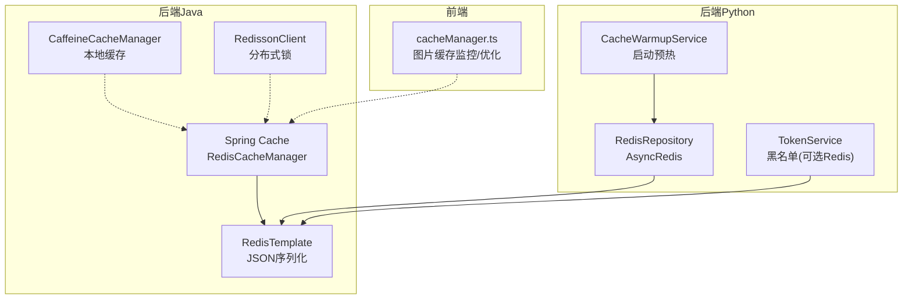
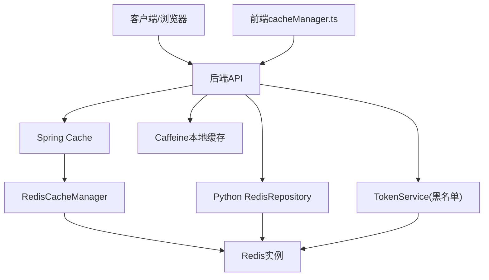
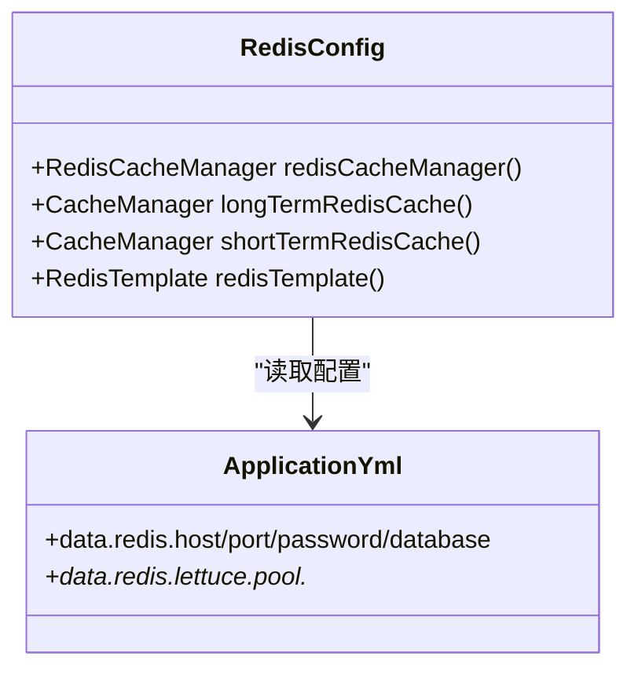
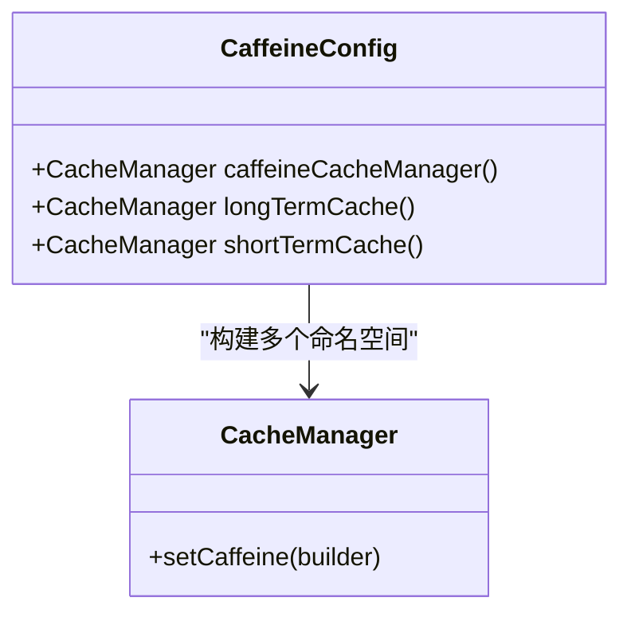
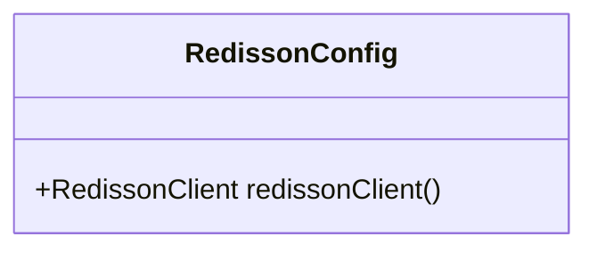
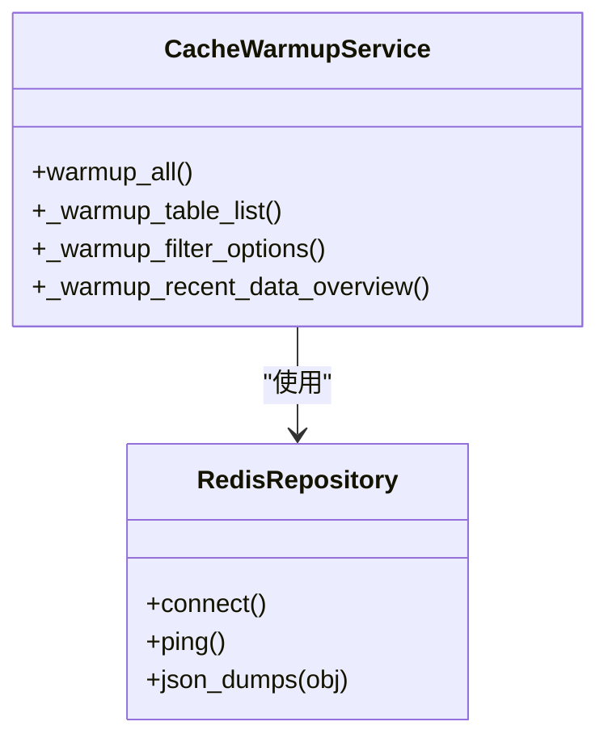
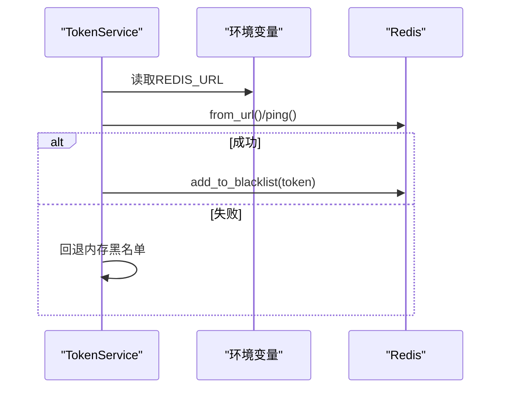
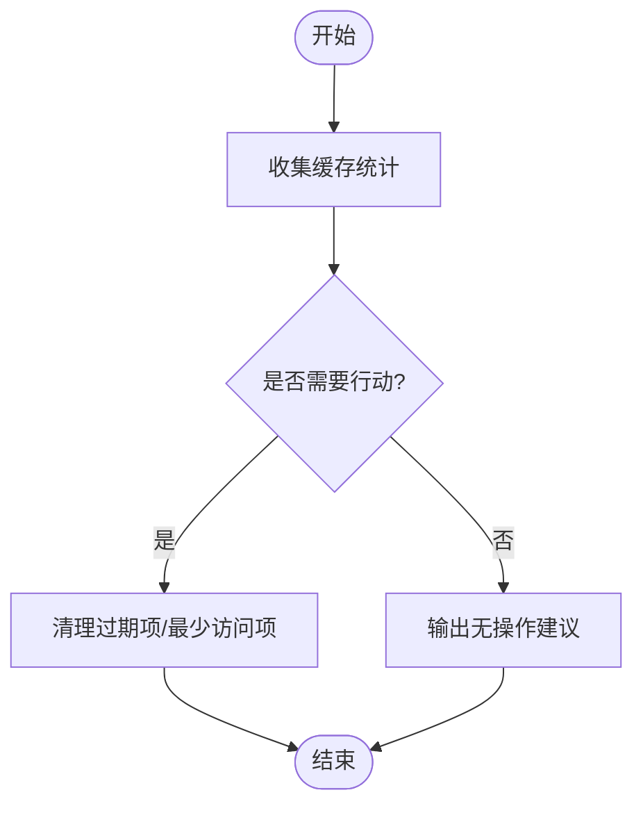
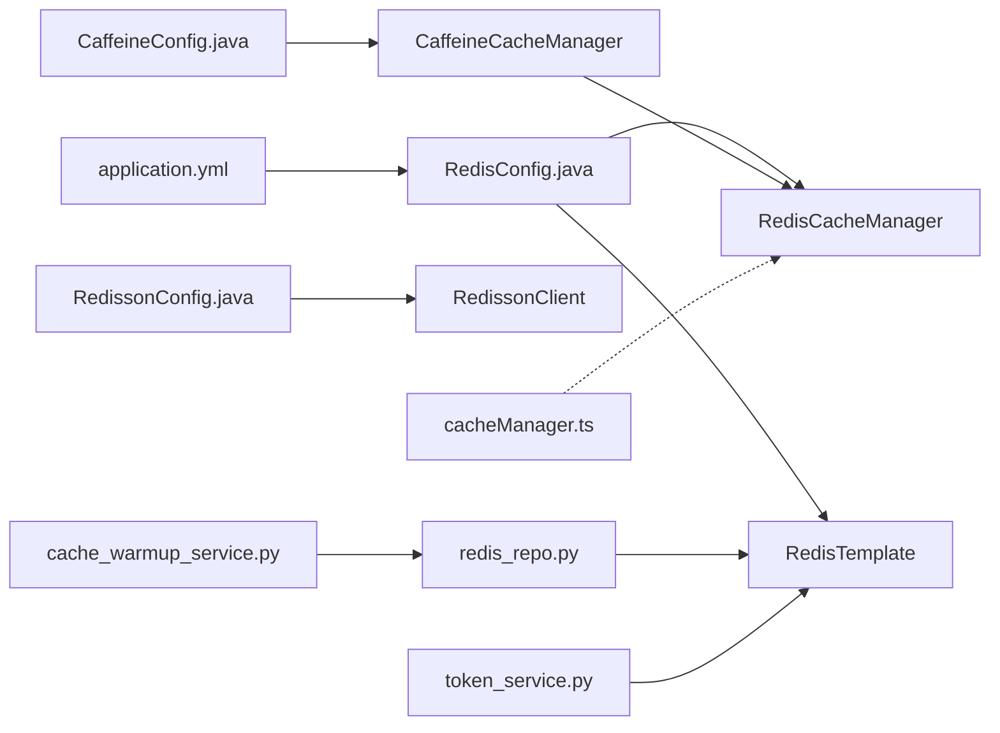

# NoSQL缓存系统

<cite>
**本文引用的文件**   
- [RedisConfig.java](file://java-backend/sjzm-common/src/main/java/com/sjzm/config/RedisConfig.java)
- [RedisConfig.java](file://java-backend/src/main/java/com/sjzm/config/RedisConfig.java)
- [RedissonConfig.java](file://java-backend/src/main/java/com/sjzm/config/RedissonConfig.java)
- [RedissonConfig.java](file://java-backend/sjzm-common/src/main/java/com/sjzm/config/RedissonConfig.java)
- [CaffeineConfig.java](file://java-backend/src/main/java/com/sjzm/config/CaffeineConfig.java)
- [CaffeineConfig.java](file://java-backend/sjzm-common/src/main/java/com/sjzm/config/CaffeineConfig.java)
- [MetricsConfig.java](file://java-backend/src/main/java/com/sjzm/config/MetricsConfig.java)
- [application.yml](file://java-backend/src/main/resources/application.yml)
- [redis_repo.py](file://backend/app/repositories/redis_repo.py)
- [cache_warmup_service.py](file://backend/app/services/cache_warmup_service.py)
- [token_service.py](file://backend/app/services/token_service.py)
- [cacheManager.ts](file://frontend/src/utils/cacheManager.ts)
- [final_drafts.py](file://backend/app/api/v1/final_drafts.py)
- [download_utils.py](file://backend/app/utils/download_utils.py)
- [ai_vector_processor.py](file://backend/app/services/ai_vector_processing/ai_vector_processor.py)
</cite>

## 目录
1. [简介](#简介)
2. [项目结构](#项目结构)
3. [核心组件](#核心组件)
4. [架构总览](#架构总览)
5. [组件详解](#组件详解)
6. [依赖关系分析](#依赖关系分析)
7. [性能考量](#性能考量)
8. [故障排查指南](#故障排查指南)
9. [结论](#结论)
10. [附录](#附录)

## 简介
本文件面向“思觉智贸系统”的NoSQL缓存体系，系统性梳理Redis在系统中的角色与策略，覆盖数据缓存、会话管理、分布式锁机制；明确缓存键命名规范、过期策略与内存管理；文档化缓存预热服务与失效策略；提供性能监控与调优建议；并给出缓存穿透、缓存雪崩、缓存击穿的防护措施；最后解释Redis集群与高可用部署思路及缓存数据结构与序列化方案。

## 项目结构
缓存系统横跨后端Java与Python两套实现，并在前端提供缓存监控与优化工具：
- Java侧：Spring Cache + RedisTemplate + Redisson 分布式锁；本地Caffeine缓存作为二级缓存
- Python侧：异步Redis客户端封装与缓存预热服务
- 前端：图片缓存监控与清理工具

图表来源
- [RedisConfig.java:49-94](file://java-backend/src/main/java/com/sjzm/config/RedisConfig.java#L49-L94)
- [RedissonConfig.java:31-50](file://java-backend/src/main/java/com/sjzm/config/RedissonConfig.java#L31-L50)
- [CaffeineConfig.java:61-90](file://java-backend/src/main/java/com/sjzm/config/CaffeineConfig.java#L61-L90)
- [redis_repo.py:23-54](file://backend/app/repositories/redis_repo.py#L23-L54)
- [cache_warmup_service.py:16-46](file://backend/app/services/cache_warmup_service.py#L16-L46)
- [token_service.py:18-42](file://backend/app/services/token_service.py#L18-L42)
- [cacheManager.ts:234-337](file://frontend/src/utils/cacheManager.ts#L234-L337)

章节来源
- [RedisConfig.java:49-94](file://java-backend/src/main/java/com/sjzm/config/RedisConfig.java#L49-L94)
- [redis_repo.py:23-54](file://backend/app/repositories/redis_repo.py#L23-L54)

## 核心组件
- Redis配置与缓存管理
  - Spring Cache + RedisCacheManager：统一的Redis缓存管理器，支持多命名空间与不同TTL
  - RedisTemplate：键值序列化策略（字符串键、JSON值），确保跨语言与类型安全
  - Redisson：单机模式配置，提供分布式锁能力
- 本地缓存（Caffeine）
  - 多个命名空间缓存管理器，分别用于短期、长期与默认场景
- Python侧缓存基础设施
  - 异步Redis仓库封装与连接池
  - 缓存预热服务：启动时批量预热常用数据
  - Token黑名单服务：可选Redis存储，否则回退内存
- 前端缓存监控与优化
  - 图片缓存统计、清理、推荐优化

章节来源
- [RedisConfig.java:49-94](file://java-backend/src/main/java/com/sjzm/config/RedisConfig.java#L49-L94)
- [RedissonConfig.java:31-50](file://java-backend/src/main/java/com/sjzm/config/RedissonConfig.java#L31-L50)
- [CaffeineConfig.java:61-90](file://java-backend/src/main/java/com/sjzm/config/CaffeineConfig.java#L61-L90)
- [redis_repo.py:23-54](file://backend/app/repositories/redis_repo.py#L23-L54)
- [cache_warmup_service.py:16-46](file://backend/app/services/cache_warmup_service.py#L16-L46)
- [token_service.py:18-42](file://backend/app/services/token_service.py#L18-L42)
- [cacheManager.ts:234-337](file://frontend/src/utils/cacheManager.ts#L234-L337)

## 架构总览
下图展示缓存系统在系统中的位置与交互：

图表来源
- [RedisConfig.java:49-94](file://java-backend/src/main/java/com/sjzm/config/RedisConfig.java#L49-L94)
- [CaffeineConfig.java:61-90](file://java-backend/src/main/java/com/sjzm/config/CaffeineConfig.java#L61-L90)
- [redis_repo.py:23-54](file://backend/app/repositories/redis_repo.py#L23-L54)
- [token_service.py:18-42](file://backend/app/services/token_service.py#L18-L42)
- [cacheManager.ts:234-337](file://frontend/src/utils/cacheManager.ts#L234-L337)

## 组件详解

### Redis配置与缓存策略
- 命名空间与TTL
  - 默认命名空间前缀：sjzm:
  - 长期缓存命名空间：sjzm:long:
  - 短期缓存命名空间：sjzm:short:
  - TTL策略：默认30分钟、长期2小时、短期5分钟
- 序列化
  - 键：StringRedisSerializer
  - 值：GenericJackson2JsonRedisSerializer（含JavaTimeModule）
- 事务与空值
  - 禁用缓存空值，开启事务感知
- 连接与池化
  - application.yml中配置Lettuce连接池参数（最大空闲、最大活跃、最大等待、关闭超时）

图表来源
- [RedisConfig.java:49-94](file://java-backend/src/main/java/com/sjzm/config/RedisConfig.java#L49-L94)
- [application.yml:62-75](file://java-backend/src/main/resources/application.yml#L62-L75)

章节来源
- [RedisConfig.java:49-94](file://java-backend/src/main/java/com/sjzm/config/RedisConfig.java#L49-L94)
- [application.yml:62-75](file://java-backend/src/main/resources/application.yml#L62-L75)

### 本地缓存（Caffeine）策略
- 多命名空间缓存管理器
  - 默认：500容量，10-15分钟随机过期
  - 长期：1000容量，30-45分钟随机过期
  - 短期：2000容量，1-2分钟随机过期
- 随机抖动：避免同时过期导致的缓存雪崩
- 统计记录：便于监控命中率与淘汰情况

图表来源
- [CaffeineConfig.java:61-90](file://java-backend/src/main/java/com/sjzm/config/CaffeineConfig.java#L61-L90)

章节来源
- [CaffeineConfig.java:61-90](file://java-backend/src/main/java/com/sjzm/config/CaffeineConfig.java#L61-L90)

### 分布式锁（Redisson）
- 单机模式配置：连接池大小、最小空闲、超时与重试
- 适用于高冲突场景的互斥控制，如库存扣减、订单幂等

图表来源
- [RedissonConfig.java:31-50](file://java-backend/src/main/java/com/sjzm/config/RedissonConfig.java#L31-L50)

章节来源
- [RedissonConfig.java:31-50](file://java-backend/src/main/java/com/sjzm/config/RedissonConfig.java#L31-L50)

### Python侧Redis仓库与预热
- 异步Redis仓库
  - 连接池：max_connections、encoding、decode_responses
  - ping测试连接，日志记录连接状态
  - JSON序列化器：自定义DateTimeEncoder处理日期时间
- 缓存预热服务
  - 启动时批量预热常用数据（表列表、筛选选项、近期概览）
  - 记录耗时与异常

图表来源
- [redis_repo.py:23-54](file://backend/app/repositories/redis_repo.py#L23-L54)
- [cache_warmup_service.py:16-46](file://backend/app/services/cache_warmup_service.py#L16-L46)

章节来源
- [redis_repo.py:23-54](file://backend/app/repositories/redis_repo.py#L23-L54)
- [cache_warmup_service.py:16-46](file://backend/app/services/cache_warmup_service.py#L16-L46)

### 会话管理与Token黑名单
- Token黑名单服务
  - 优先使用Redis存储黑名单，失败回退内存
  - 通过环境变量REDIS_URL连接Redis，ping测试连通性

图表来源
- [token_service.py:18-42](file://backend/app/services/token_service.py#L18-L42)

章节来源
- [token_service.py:18-42](file://backend/app/services/token_service.py#L18-L42)

### 前端缓存监控与优化
- 统计缓存状态（命中、未命中、缓存项数量）
- 推荐清理过期项与最少访问图片
- 提供监控周期性回调与停止监控

图表来源
- [cacheManager.ts:234-337](file://frontend/src/utils/cacheManager.ts#L234-L337)

章节来源
- [cacheManager.ts:234-337](file://frontend/src/utils/cacheManager.ts#L234-L337)

### 缓存键命名规范、过期策略与内存管理
- 命名规范
  - 默认：sjzm:<业务域>:<key>
  - 长期：sjzm:long:<业务域>:<key>
  - 短期：sjzm:short:<业务域>:<key>
- 过期策略
  - Spring Cache：默认30分钟，长期2小时，短期5分钟
  - Caffeine：按命名空间设定容量与随机过期窗口
  - 局部场景：图片缓存5分钟（秒级TTL示例）
- 内存管理
  - Redis：合理设置TTL与序列化体积，避免大对象堆积
  - Caffeine：基于容量与过期淘汰，配合随机抖动降低雪崩概率

章节来源
- [RedisConfig.java:49-94](file://java-backend/src/main/java/com/sjzm/config/RedisConfig.java#L49-L94)
- [CaffeineConfig.java:61-90](file://java-backend/src/main/java/com/sjzm/config/CaffeineConfig.java#L61-L90)
- [final_drafts.py:146-153](file://backend/app/api/v1/final_drafts.py#L146-L153)
- [download_utils.py:55-61](file://backend/app/utils/download_utils.py#L55-L61)

### 缓存预热与失效策略
- 预热策略
  - 启动阶段批量写入高频访问数据，减少冷启动抖动
  - 预热完成后记录耗时，异常时快速失败
- 失效策略
  - 基于TTL的自然过期
  - 对关键数据采用“写后失效”或“版本号”机制（需业务侧配合）
  - 前端定期清理过期与最少访问项

章节来源
- [cache_warmup_service.py:16-46](file://backend/app/services/cache_warmup_service.py#L16-L46)
- [cacheManager.ts:234-337](file://frontend/src/utils/cacheManager.ts#L234-L337)

### 缓存性能监控与调优
- 指标采集
  - HTTP请求时延、缓存命中/未命中计数、数据库查询时延、消息队列消息计数
- 调优建议
  - 适当提高连接池上限与空闲阈值
  - 为热点键设置更短TTL并引入随机抖动
  - 本地Caffeine命中率低时调整容量与过期策略
  - 前端定期清理图片缓存，避免内存峰值

章节来源
- [MetricsConfig.java:40-74](file://java-backend/src/main/java/com/sjzm/config/MetricsConfig.java#L40-L74)

### 缓存穿透、缓存雪崩、缓存击穿的防护
- 缓存穿透
  - 空值缓存：对不存在的结果也写入空值并设置短TTL
  - 唯一索引：对非法输入进行校验与拦截
- 缓存雪崩
  - 随机抖动：Caffeine过期时间加入随机偏移
  - 多级缓存：本地Caffeine兜底，降低Redis压力
- 缓存击穿
  - 热点键互斥：使用Redisson分布式锁保护首次加载
  - 双写策略：读取失败时异步重建缓存

章节来源
- [CaffeineConfig.java:61-90](file://java-backend/src/main/java/com/sjzm/config/CaffeineConfig.java#L61-L90)
- [RedissonConfig.java:31-50](file://java-backend/src/main/java/com/sjzm/config/RedissonConfig.java#L31-L50)

### Redis集群与高可用部署策略
- 当前实现
  - 单机Redis配置（Redisson单机模式）
- 高可用建议
  - 使用Redis Sentinel或Redis Cluster提升可用性与扩展性
  - 配置主从复制与自动故障转移
  - 连接池参数根据实例规模动态调整

章节来源
- [RedissonConfig.java:31-50](file://java-backend/src/main/java/com/sjzm/config/RedissonConfig.java#L31-L50)

### 缓存数据结构设计与序列化方案
- 数据结构
  - 字符串：通用键值缓存
  - 哈希：对象分段存储，降低序列化成本
  - 列表/集合：用于集合型数据与去重
- 序列化
  - 键：字符串
  - 值：JSON（含时间类型），确保跨语言一致性
  - Python侧：自定义JSON编码器处理datetime/date

章节来源
- [redis_repo.py:11-21](file://backend/app/repositories/redis_repo.py#L11-L21)
- [RedisConfig.java:29-42](file://java-backend/src/main/java/com/sjzm/config/RedisConfig.java#L29-L42)

## 依赖关系分析

图表来源
- [application.yml:62-75](file://java-backend/src/main/resources/application.yml#L62-L75)
- [RedisConfig.java:49-94](file://java-backend/src/main/java/com/sjzm/config/RedisConfig.java#L49-L94)
- [CaffeineConfig.java:61-90](file://java-backend/src/main/java/com/sjzm/config/CaffeineConfig.java#L61-L90)
- [RedissonConfig.java:31-50](file://java-backend/src/main/java/com/sjzm/config/RedissonConfig.java#L31-L50)
- [redis_repo.py:23-54](file://backend/app/repositories/redis_repo.py#L23-L54)
- [cache_warmup_service.py:16-46](file://backend/app/services/cache_warmup_service.py#L16-L46)
- [token_service.py:18-42](file://backend/app/services/token_service.py#L18-L42)
- [cacheManager.ts:234-337](file://frontend/src/utils/cacheManager.ts#L234-L337)

章节来源
- [application.yml:62-75](file://java-backend/src/main/resources/application.yml#L62-L75)
- [RedisConfig.java:49-94](file://java-backend/src/main/java/com/sjzm/config/RedisConfig.java#L49-L94)
- [CaffeineConfig.java:61-90](file://java-backend/src/main/java/com/sjzm/config/CaffeineConfig.java#L61-L90)
- [RedissonConfig.java:31-50](file://java-backend/src/main/java/com/sjzm/config/RedissonConfig.java#L31-L50)
- [redis_repo.py:23-54](file://backend/app/repositories/redis_repo.py#L23-L54)
- [cache_warmup_service.py:16-46](file://backend/app/services/cache_warmup_service.py#L16-L46)
- [token_service.py:18-42](file://backend/app/services/token_service.py#L18-L42)
- [cacheManager.ts:234-337](file://frontend/src/utils/cacheManager.ts#L234-L337)

## 性能考量
- 连接池与超时
  - 调整最大空闲、最大活跃、最大等待与关闭超时，避免阻塞
- 序列化开销
  - 控制JSON体积，必要时拆分为哈希结构
- 命中率优化
  - 识别热点键，缩短TTL并增加随机抖动
  - 本地Caffeine作为第一级缓存，降低Redis压力
- 前端图片缓存
  - 定期清理过期与最少访问项，避免内存峰值

## 故障排查指南
- 连接失败
  - 检查Redis地址、端口、密码与数据库索引
  - 查看连接池配置与超时设置
- 缓存未生效
  - 核对命名空间前缀与TTL
  - 确认序列化器与键值类型匹配
- 分布式锁无效
  - 检查Redisson连接参数与锁超时
- 前端缓存异常
  - 使用监控接口查看统计与建议，执行清理与优化

章节来源
- [application.yml:62-75](file://java-backend/src/main/resources/application.yml#L62-L75)
- [RedisConfig.java:49-94](file://java-backend/src/main/java/com/sjzm/config/RedisConfig.java#L49-L94)
- [RedissonConfig.java:31-50](file://java-backend/src/main/java/com/sjzm/config/RedissonConfig.java#L31-L50)
- [cacheManager.ts:234-337](file://frontend/src/utils/cacheManager.ts#L234-L337)

## 结论
本缓存体系以Spring Cache + Redis为主干，辅以Redisson分布式锁与Caffeine本地缓存，形成多级缓存与可靠互斥控制。通过命名空间、TTL与随机抖动策略有效缓解雪崩风险；通过预热与前端监控实现稳定运行。建议在高并发场景下引入Redis集群与Sentinel，并持续优化序列化与热点键策略。

## 附录
- 关键实现路径
  - Redis配置与缓存管理：[RedisConfig.java:49-94](file://java-backend/src/main/java/com/sjzm/config/RedisConfig.java#L49-L94)
  - 分布式锁：[RedissonConfig.java:31-50](file://java-backend/src/main/java/com/sjzm/config/RedissonConfig.java#L31-L50)
  - 本地缓存：[CaffeineConfig.java:61-90](file://java-backend/src/main/java/com/sjzm/config/CaffeineConfig.java#L61-L90)
  - Python Redis仓库：[redis_repo.py:23-54](file://backend/app/repositories/redis_repo.py#L23-L54)
  - 缓存预热：[cache_warmup_service.py:16-46](file://backend/app/services/cache_warmup_service.py#L16-L46)
  - Token黑名单：[token_service.py:18-42](file://backend/app/services/token_service.py#L18-L42)
  - 前端缓存监控：[cacheManager.ts:234-337](file://frontend/src/utils/cacheManager.ts#L234-L337)
  - 图片缓存TTL示例：[final_drafts.py:146-153](file://backend/app/api/v1/final_drafts.py#L146-L153)、[download_utils.py:55-61](file://backend/app/utils/download_utils.py#L55-L61)
  - AI向量缓存TTL：[ai_vector_processor.py](file://backend/app/services/ai_vector_processing/ai_vector_processor.py#L604)