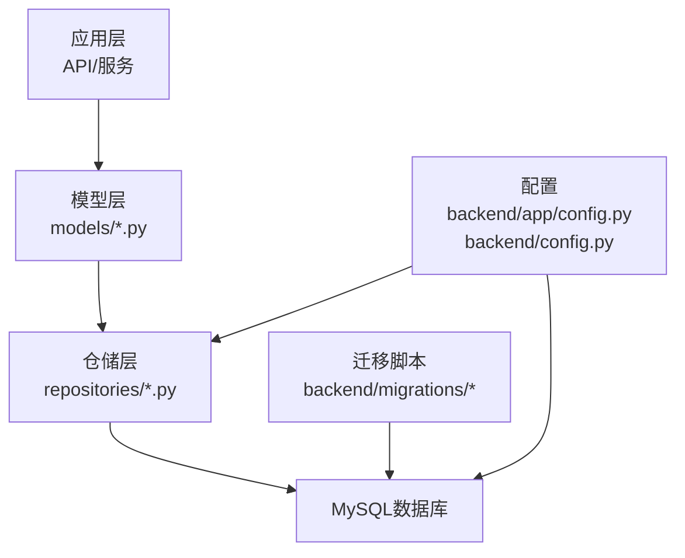
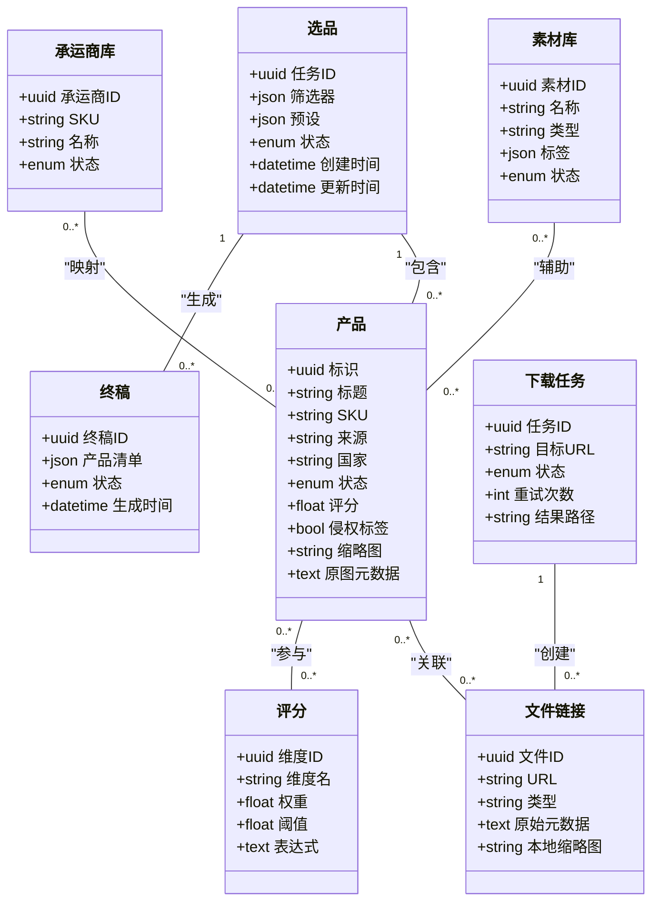
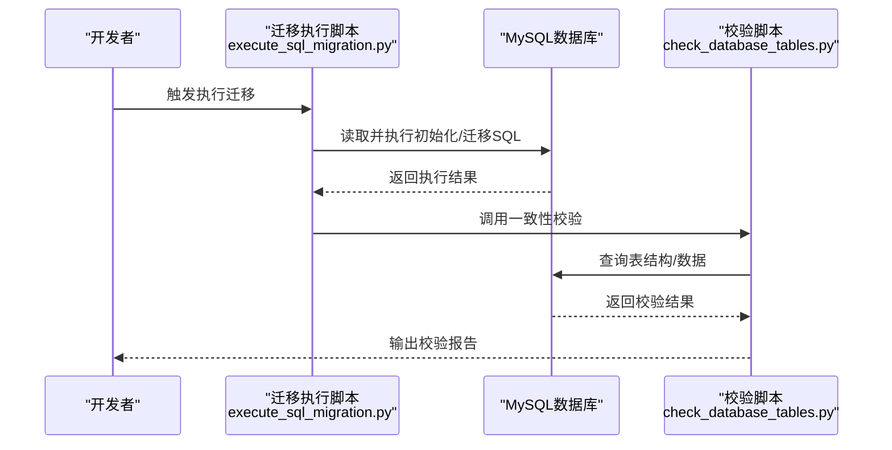
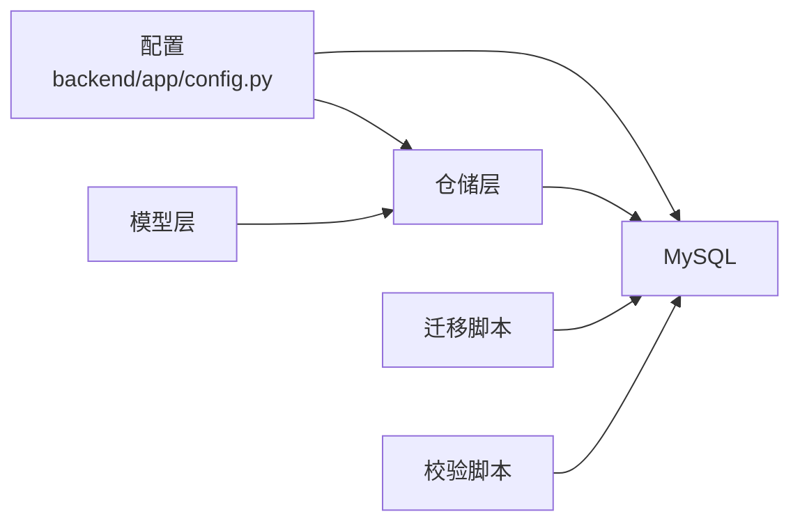

# 关系型数据库设计

<cite>
**本文引用的文件**
- [init_database.sql](file://backend/migrations/init_database.sql)
- [init_database_dev.sql](file://backend/migrations/init_database_dev.sql)
- [create_final_drafts_table.sql](file://backend/app/db/migrations/create_final_drafts_table.sql)
- [create_scoring_tables.sql](file://backend/migrations/create_scoring_tables.sql)
- [create_material_carrier_tables.sql](file://backend/migrations/create_material_carrier_tables.sql)
- [add_images_index.sql](file://backend/migrations/add_images_index.sql)
- [add_role_indexes.sql](file://backend/migrations/add_role_indexes.sql)
- [add_scoring_fields.sql](file://backend/migrations/add_scoring_fields.sql)
- [add_grade_fields.sql](file://backend/migrations/add_grade_fields.sql)
- [add_country_and_filter_mode.sql](file://backend/migrations/add_country_and_filter_mode.sql)
- [add_download_tasks_table.sql](file://backend/migrations/add_download_tasks_table.sql)
- [add_missing_fields.sql](file://backend/migrations/add_missing_fields.sql)
- [add_original_image_metadata.sql](file://backend/migrations/add_original_image_metadata.sql)
- [add_original_zip_fields.sql](file://backend/migrations/add_original_zip_fields.sql)
- [add_thumbnail_columns.sql](file://backend/migrations/add_thumbnail_columns.sql)
- [add_infringement_label.sql](file://backend/migrations/add_infringement_label.sql)
- [system_log_tables.sql](file://backend/migrations/system_log_tables.sql)
- [check_data.sql](file://backend/migrations/check_data.sql)
- [check_product_type.sql](file://backend/migrations/check_product_type.sql)
- [check_source.sql](file://backend/migrations/check_source.sql)
- [check_uk_source.sql](file://backend/migrations/check_uk_source.sql)
- [fix_carrier_sku.sql](file://backend/migrations/fix_carrier_sku.sql)
- [remove_carrier_sku.sql](file://backend/migrations/remove_carrier_sku.sql)
- [update_existing_data.sql](file://backend/migrations/update_existing_data.sql)
- [execute_sql_migration.py](file://scripts/execute_sql_migration.py)
- [check_database_tables.py](file://scripts/check_database_tables.py)
- [product.py](file://backend/app/models/product.py)
- [selection.py](file://backend/app/models/selection.py)
- [scoring.py](file://backend/app/models/scoring.py)
- [final_draft.py](file://backend/app/models/final_draft.py)
- [file_link.py](file://backend/app/models/file_link.py)
- [download_task.py](file://backend/app/models/download_task.py)
- [carrier_library.py](file://backend/app/models/carrier_library.py)
- [material_library.py](file://backend/app/models/material_library.py)
- [mysql_repo.py](file://backend/app/repositories/mysql_repo.py)
- [migrate_products_table.py](file://backend/app/repositories/migrate_products_table.py)
- [create_selection_tables.py](file://backend/app/repositories/create_selection_tables.py)
- [create_file_link_tables.py](file://backend/app/repositories/create_file_link_tables.py)
- [config.py](file://backend/app/config.py)
- [config.py](file://backend/config.py)
- [01-init.sql](file://mysql/init/01-init.sql)
</cite>

## 目录
1. [简介](#简介)
2. [项目结构](#项目结构)
3. [核心组件](#核心组件)
4. [架构总览](#架构总览)
5. [详细组件分析](#详细组件分析)
6. [依赖分析](#依赖分析)
7. [性能考虑](#性能考虑)
8. [故障排查指南](#故障排查指南)
9. [结论](#结论)
10. [附录](#附录)

## 简介
本文件面向“思觉智贸系统”的关系型数据库设计，聚焦MySQL数据库的整体架构与表结构设计，围绕核心业务表（产品、用户、选品、素材库、评分、终稿、下载任务、文件链接等）进行建模与关系映射，明确主键、外键与索引策略，并给出初始化脚本与版本管理策略、数据完整性与并发控制建议、以及查询与索引优化实践。文档同时梳理了Python迁移脚本与数据库一致性校验工具，帮助读者理解从开发到生产的数据库演进路径。

## 项目结构
数据库相关资源主要分布在以下位置：
- 初始化与迁移脚本：backend/migrations 与 backend/app/db/migrations
- 数据模型定义：backend/app/models
- 仓储层与迁移工具：backend/app/repositories
- 运行时配置：backend/app/config.py 与 backend/config.py
- MySQL初始化脚本：mysql/init/01-init.sql
- 数据库一致性与迁移执行脚本：scripts/

```mermaid
graph TB
subgraph "数据库脚本"
INIT["初始化脚本<br/>init_database.sql / init_database_dev.sql"]
MIG["迁移脚本<br/>create_* / add_* / update_*"]
APPMIG["应用迁移<br/>create_final_drafts_table.sql"]
end
subgraph "模型与仓储"
MODELS["数据模型<br/>models/*.py"]
REPOS["仓储层<br/>repositories/*.py"]
end
subgraph "运行配置"
CFG1["后端配置<br/>backend/app/config.py"]
CFG2["通用配置<br/>backend/config.py"]
end
subgraph "MySQL初始化"
MYSQLINIT["mysql/init/01-init.sql"]
end
INIT --> MIG
MIG --> MODELS
MODELS --> REPOS
CFG1 --> REPOS
CFG2 --> REPOS
MYSQLINIT --> INIT
```

图表来源
- [init_database.sql](file://backend/migrations/init_database.sql)
- [create_final_drafts_table.sql](file://backend/app/db/migrations/create_final_drafts_table.sql)
- [product.py](file://backend/app/models/product.py)
- [mysql_repo.py](file://backend/app/repositories/mysql_repo.py)
- [config.py](file://backend/app/config.py)
- [config.py](file://backend/config.py)
- [01-init.sql](file://mysql/init/01-init.sql)

章节来源
- [init_database.sql](file://backend/migrations/init_database.sql)
- [init_database_dev.sql](file://backend/migrations/init_database_dev.sql)
- [create_final_drafts_table.sql](file://backend/app/db/migrations/create_final_drafts_table.sql)
- [product.py](file://backend/app/models/product.py)
- [mysql_repo.py](file://backend/app/repositories/mysql_repo.py)
- [config.py](file://backend/app/config.py)
- [config.py](file://backend/config.py)
- [01-init.sql](file://mysql/init/01-init.sql)

## 核心组件
本节概述数据库中与业务密切相关的表与职责边界，涵盖产品、选品、评分、终稿、下载任务、文件链接、素材库与承运商库等。

- 产品表（products）
  - 职责：承载商品基础信息、状态、来源、国家、评分字段等。
  - 关键字段：唯一标识、标题、SKU、品牌、分类、来源、国家、状态、评分相关字段、侵权标签、缩略图与原图元数据等。
  - 索引：按国家、来源、状态、评分字段建立复合或单列索引以支撑筛选与排序。

- 选品表（selection）
  - 职责：保存选品任务、筛选条件、预设、状态与关联的产品集合。
  - 关键字段：任务标识、筛选器配置、预设、状态、创建/更新时间、关联产品ID列表等。
  - 索引：按任务ID、状态、创建时间建立索引。

- 评分表（scoring_*）
  - 职责：维护评分维度、权重、阈值与计算结果，支持多维打分与动态调整。
  - 关键字段：维度、权重、阈值、计算表达式、结果集等。
  - 索引：按维度、任务ID建立索引。

- 终稿表（final_drafts）
  - 职责：保存最终选品结果、导出清单、状态与元数据。
  - 关键字段：终稿标识、产品清单、导出状态、生成时间、备注等。
  - 索引：按状态、生成时间、任务ID建立索引。

- 下载任务表（download_tasks）
  - 职责：记录下载任务的发起、状态、进度与结果。
  - 关键字段：任务ID、目标URL、状态、重试次数、结果文件路径等。
  - 索引：按状态、创建时间建立索引。

- 文件链接表（file_links）
  - 职责：管理产品图片、压缩包等文件的链接与元数据。
  - 关键字段：文件标识、URL、类型、原始元数据、本地缩略图路径等。
  - 索引：按URL去重、类型、创建时间建立索引。

- 素材库表（material_library）
  - 职责：存储可复用的视觉素材、文案素材等。
  - 关键字段：素材标识、名称、类型、标签、状态、创建时间等。
  - 索引：按类型、标签、状态建立索引。

- 承运商库表（carrier_library）
  - 职责：存储承运商信息与SKU映射。
  - 关键字段：承运商标识、SKU、名称、状态等。
  - 索引：按SKU、名称建立索引。

- 系统日志表（system_log_*）
  - 职责：记录系统运行日志、审计与异常信息。
  - 关键字段：日志标识、级别、消息、上下文、时间戳等。
  - 索引：按时间戳、级别建立索引。

章节来源
- [init_database.sql](file://backend/migrations/init_database.sql)
- [create_scoring_tables.sql](file://backend/migrations/create_scoring_tables.sql)
- [create_final_drafts_table.sql](file://backend/app/db/migrations/create_final_drafts_table.sql)
- [add_download_tasks_table.sql](file://backend/migrations/add_download_tasks_table.sql)
- [create_material_carrier_tables.sql](file://backend/migrations/create_material_carrier_tables.sql)
- [system_log_tables.sql](file://backend/migrations/system_log_tables.sql)

## 架构总览
下图展示数据库层与应用层的交互关系，包括模型、仓储、迁移脚本与配置的协作方式。

图表来源
- [product.py](file://backend/app/models/product.py)
- [selection.py](file://backend/app/models/selection.py)
- [scoring.py](file://backend/app/models/scoring.py)
- [final_draft.py](file://backend/app/models/final_draft.py)
- [file_link.py](file://backend/app/models/file_link.py)
- [download_task.py](file://backend/app/models/download_task.py)
- [carrier_library.py](file://backend/app/models/carrier_library.py)
- [material_library.py](file://backend/app/models/material_library.py)
- [mysql_repo.py](file://backend/app/repositories/mysql_repo.py)
- [config.py](file://backend/app/config.py)
- [config.py](file://backend/config.py)

## 详细组件分析

### 数据模型类图
下图展示核心数据模型之间的关系，体现一对一、一对多与多对多映射。

图表来源
- [product.py](file://backend/app/models/product.py)
- [selection.py](file://backend/app/models/selection.py)
- [scoring.py](file://backend/app/models/scoring.py)
- [final_draft.py](file://backend/app/models/final_draft.py)
- [file_link.py](file://backend/app/models/file_link.py)
- [download_task.py](file://backend/app/models/download_task.py)
- [material_library.py](file://backend/app/models/material_library.py)
- [carrier_library.py](file://backend/app/models/carrier_library.py)

章节来源
- [product.py](file://backend/app/models/product.py)
- [selection.py](file://backend/app/models/selection.py)
- [scoring.py](file://backend/app/models/scoring.py)
- [final_draft.py](file://backend/app/models/final_draft.py)
- [file_link.py](file://backend/app/models/file_link.py)
- [download_task.py](file://backend/app/models/download_task.py)
- [material_library.py](file://backend/app/models/material_library.py)
- [carrier_library.py](file://backend/app/models/carrier_library.py)

### 初始化与迁移流程
数据库初始化与版本化迁移通过SQL脚本与Python脚本协同完成，确保在不同环境（开发/生产）的一致性。

图表来源
- [execute_sql_migration.py](file://scripts/execute_sql_migration.py)
- [check_database_tables.py](file://scripts/check_database_tables.py)
- [init_database.sql](file://backend/migrations/init_database.sql)
- [init_database_dev.sql](file://backend/migrations/init_database_dev.sql)

章节来源
- [execute_sql_migration.py](file://scripts/execute_sql_migration.py)
- [check_database_tables.py](file://scripts/check_database_tables.py)
- [init_database.sql](file://backend/migrations/init_database.sql)
- [init_database_dev.sql](file://backend/migrations/init_database_dev.sql)

### 数据完整性与并发控制
- 主键与唯一性
  - 使用UUID作为主键，避免分布式场景下的冲突；对高频查询字段（如SKU、URL、任务ID）建立唯一索引，保证业务唯一性。
- 外键约束
  - 在存在强依赖关系的表之间建立外键，例如“终稿”依赖“选品”，“文件链接”依赖“产品”，以保障引用完整性。
- 事务与并发
  - 对批量更新（如评分、状态切换）采用显式事务，确保原子性；对高并发写入场景使用行级锁与重试机制，必要时引入乐观锁版本号字段。
- 并发控制策略
  - 对热点表（如产品、文件链接）采用读写分离与连接池限流；对写密集操作进行分批提交与幂等设计。

章节来源
- [add_missing_fields.sql](file://backend/migrations/add_missing_fields.sql)
- [add_original_image_metadata.sql](file://backend/migrations/add_original_image_metadata.sql)
- [add_original_zip_fields.sql](file://backend/migrations/add_original_zip_fields.sql)
- [add_thumbnail_columns.sql](file://backend/migrations/add_thumbnail_columns.sql)
- [add_infringement_label.sql](file://backend/migrations/add_infringement_label.sql)
- [add_country_and_filter_mode.sql](file://backend/migrations/add_country_and_filter_mode.sql)
- [add_scoring_fields.sql](file://backend/migrations/add_scoring_fields.sql)
- [add_grade_fields.sql](file://backend/migrations/add_grade_fields.sql)

### 查询与索引优化
- 索引策略
  - 复合索引：按“国家+来源+状态”、“任务ID+状态+创建时间”等组合建立，提升筛选与排序效率。
  - 单列索引：对SKU、URL、任务ID等高选择性字段建立索引。
  - 唯一索引：对SKU、URL、任务ID等唯一约束字段建立唯一索引。
- 查询优化
  - 使用EXPLAIN分析慢查询，避免全表扫描；对大结果集分页查询，限制返回字段。
  - 将频繁过滤的维度下沉到索引覆盖，减少回表。
- 分区策略
  - 按时间字段（如创建时间、生成时间）对大表进行范围分区，便于归档与清理。

章节来源
- [add_images_index.sql](file://backend/migrations/add_images_index.sql)
- [add_role_indexes.sql](file://backend/migrations/add_role_indexes.sql)
- [check_data.sql](file://backend/migrations/check_data.sql)
- [check_product_type.sql](file://backend/migrations/check_product_type.sql)
- [check_source.sql](file://backend/migrations/check_source.sql)
- [check_uk_source.sql](file://backend/migrations/check_uk_source.sql)

### 版本管理与演进策略
- 版本命名
  - 初始脚本：init_database.sql、init_database_dev.sql
  - 功能扩展：create_*、add_*、update_*、remove_* 等前缀的迁移脚本
- 执行顺序
  - 严格按脚本命名顺序执行，先初始化再增量演进；对破坏性变更（如删除列）使用备份与回滚脚本。
- 一致性校验
  - 通过Python脚本对表结构与数据进行校验，确保迁移前后一致性。
- 回滚与修复
  - 对关键变更保留修复脚本（如fix_*），用于快速恢复。

章节来源
- [init_database.sql](file://backend/migrations/init_database.sql)
- [init_database_dev.sql](file://backend/migrations/init_database_dev.sql)
- [create_scoring_tables.sql](file://backend/migrations/create_scoring_tables.sql)
- [create_material_carrier_tables.sql](file://backend/migrations/create_material_carrier_tables.sql)
- [fix_carrier_sku.sql](file://backend/migrations/fix_carrier_sku.sql)
- [remove_carrier_sku.sql](file://backend/migrations/remove_carrier_sku.sql)
- [update_existing_data.sql](file://backend/migrations/update_existing_data.sql)

## 依赖分析
数据库层与应用层的耦合关系如下：

图表来源
- [config.py](file://backend/app/config.py)
- [mysql_repo.py](file://backend/app/repositories/mysql_repo.py)
- [product.py](file://backend/app/models/product.py)
- [execute_sql_migration.py](file://scripts/execute_sql_migration.py)
- [check_database_tables.py](file://scripts/check_database_tables.py)

章节来源
- [config.py](file://backend/app/config.py)
- [mysql_repo.py](file://backend/app/repositories/mysql_repo.py)
- [product.py](file://backend/app/models/product.py)
- [execute_sql_migration.py](file://scripts/execute_sql_migration.py)
- [check_database_tables.py](file://scripts/check_database_tables.py)

## 性能考虑
- 查询性能
  - 优先使用覆盖索引，减少回表；对聚合查询使用物化视图或汇总表（如按天/周统计）。
- 写入性能
  - 批量插入与更新，避免逐条写入；对高并发写入启用队列与异步处理。
- 存储与归档
  - 对历史数据进行冷热分离与分区归档，降低在线表规模。
- 监控与诊断
  - 建立慢查询日志与执行计划监控，定期分析热点表与索引失效情况。

## 故障排查指南
- 常见问题
  - 表结构不一致：使用校验脚本比对当前库与期望结构，定位缺失索引或列。
  - 迁移失败：查看迁移脚本执行日志，确认事务回滚点与错误原因。
  - 数据异常：使用校验脚本检查数据完整性（如重复SKU、无效URL、空评分）。
- 快速恢复
  - 对关键变更保留回滚脚本；对误删表可通过备份恢复并重新执行迁移。
- 并发冲突
  - 对写密集操作增加重试与幂等设计；对热点字段使用队列削峰。

章节来源
- [check_database_tables.py](file://scripts/check_database_tables.py)
- [check_data.sql](file://backend/migrations/check_data.sql)
- [check_product_type.sql](file://backend/migrations/check_product_type.sql)
- [check_source.sql](file://backend/migrations/check_source.sql)
- [check_uk_source.sql](file://backend/migrations/check_uk_source.sql)

## 结论
本设计以“可演进、可治理、可扩展”为目标，通过清晰的表结构与索引策略支撑核心业务，配合Python迁移与校验脚本实现数据库版本化管理与一致性保障。建议在生产环境中持续监控性能与数据质量，定期优化索引与查询计划，并完善备份与回滚机制，确保系统稳定与可维护性。

## 附录
- 初始化脚本说明
  - 初始化脚本负责创建核心表、索引与基础数据，适用于全新环境部署。
  - 开发环境初始化脚本包含示例数据，便于本地调试。
- 迁移脚本清单
  - 包含评分系统初始化、素材与承运商库创建、索引增强、字段补充、状态与国家字段添加、下载任务表、侵权标签、缩略图与原图元数据、系统日志表等。
- 运行配置
  - 数据库连接参数、超时与重试策略在配置文件中集中管理，确保各环境一致性。

章节来源
- [init_database.sql](file://backend/migrations/init_database.sql)
- [init_database_dev.sql](file://backend/migrations/init_database_dev.sql)
- [create_scoring_tables.sql](file://backend/migrations/create_scoring_tables.sql)
- [create_material_carrier_tables.sql](file://backend/migrations/create_material_carrier_tables.sql)
- [add_images_index.sql](file://backend/migrations/add_images_index.sql)
- [add_role_indexes.sql](file://backend/migrations/add_role_indexes.sql)
- [add_scoring_fields.sql](file://backend/migrations/add_scoring_fields.sql)
- [add_grade_fields.sql](file://backend/migrations/add_grade_fields.sql)
- [add_country_and_filter_mode.sql](file://backend/migrations/add_country_and_filter_mode.sql)
- [add_download_tasks_table.sql](file://backend/migrations/add_download_tasks_table.sql)
- [add_missing_fields.sql](file://backend/migrations/add_missing_fields.sql)
- [add_original_image_metadata.sql](file://backend/migrations/add_original_image_metadata.sql)
- [add_original_zip_fields.sql](file://backend/migrations/add_original_zip_fields.sql)
- [add_thumbnail_columns.sql](file://backend/migrations/add_thumbnail_columns.sql)
- [add_infringement_label.sql](file://backend/migrations/add_infringement_label.sql)
- [system_log_tables.sql](file://backend/migrations/system_log_tables.sql)
- [config.py](file://backend/app/config.py)
- [config.py](file://backend/config.py)
- [01-init.sql](file://mysql/init/01-init.sql)