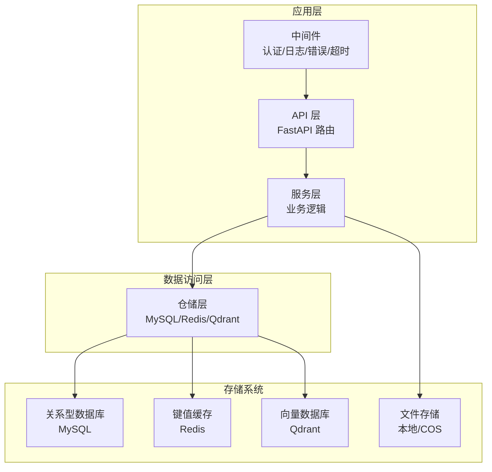
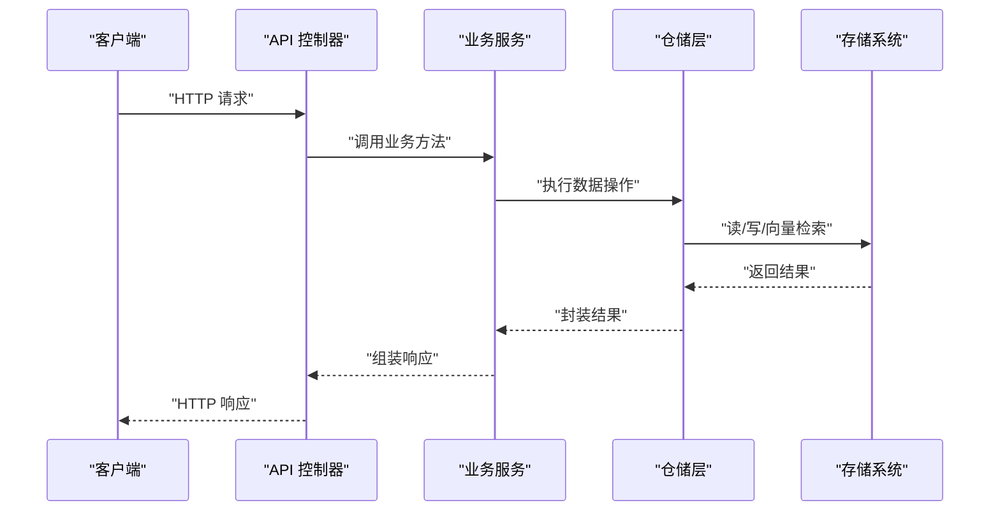
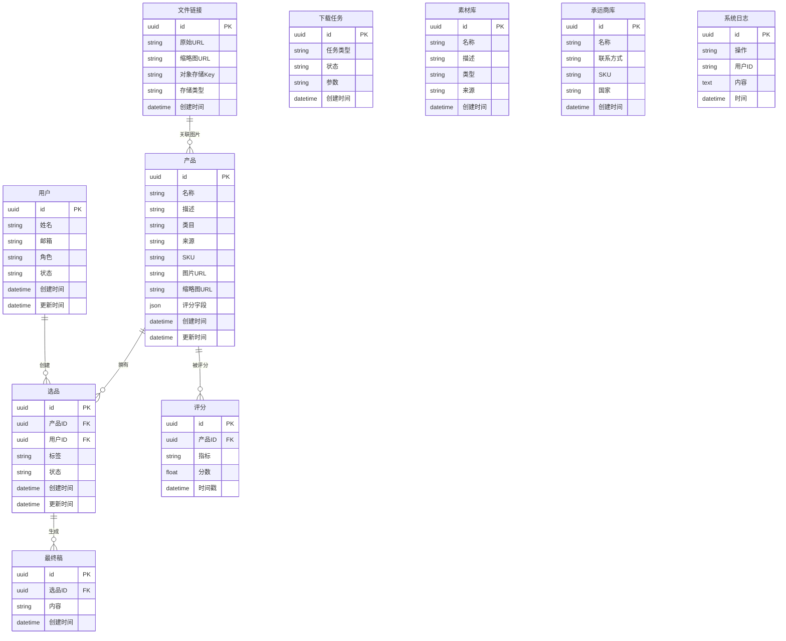
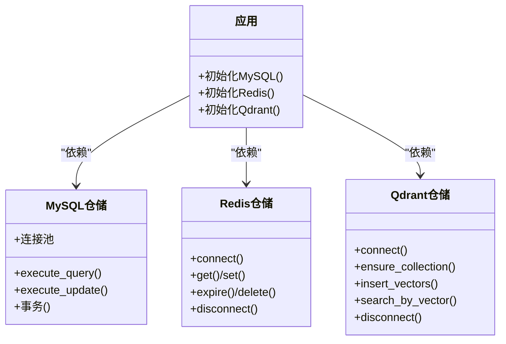
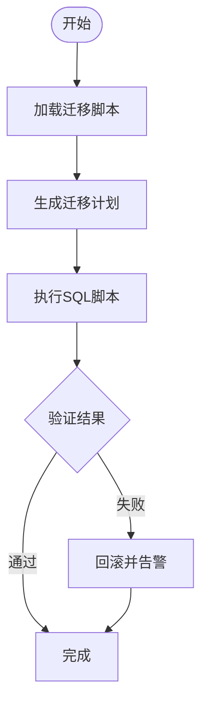
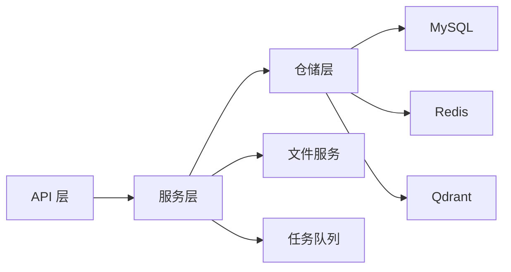

# 数据存储架构

<cite>
**本文引用的文件**
- [backend/app/main.py](file://backend/app/main.py)
- [backend/app/config.py](file://backend/app/config.py)
- [backend/app/repositories/__init__.py](file://backend/app/repositories/__init__.py)
- [backend/app/repositories/mysql_repo.py](file://backend/app/repositories/mysql_repo.py)
- [backend/app/repositories/redis_repo.py](file://backend/app/repositories/redis_repo.py)
- [backend/app/repositories/qdrant_repo.py](file://backend/app/repositories/qdrant_repo.py)
- [python-ai/app/repositories/qdrant_repo.py](file://python-ai/app/repositories/qdrant_repo.py)
- [backend/app/models/product.py](file://backend/app/models/product.py)
- [backend/app/models/selection.py](file://backend/app/models/selection.py)
- [backend/app/api/v1/products.py](file://backend/app/api/v1/products.py)
- [backend/app/api/v1/selection.py](file://backend/app/api/v1/selection.py)
- [backend/app/services/product_service.py](file://backend/app/services/product_service.py)
- [backend/app/services/selection_service.py](file://backend/app/services/selection_service.py)
- [backend/migrations/init_database.sql](file://backend/migrations/init_database.sql)
- [backend/migrations/create_final_drafts_table.sql](file://backend/migrations/create_final_drafts_table.sql)
- [backend/migrations/add_images_index.sql](file://backend/migrations/add_images_index.sql)
- [backend/migrations/add_role_indexes.sql](file://backend/migrations/add_role_indexes.sql)
- [backend/scripts/data_migration.py](file://backend/scripts/data_migration.py)
- [backend/scripts/cleanup.py](file://backend/scripts/cleanup.py)
- [backend/app/services/backup_service.py](file://backend/app/services/backup_service.py)
- [backend/app/utils/performance_monitor.py](file://backend/app/utils/performance_monitor.py)
- [backend/app/utils/jwt_utils.py](file://backend/app/utils/jwt_utils.py)
- [backend/app/api/v1/auth.py](file://backend/app/api/v1/auth.py)
- [backend/app/api/v1/users.py](file://backend/app/api/v1/users.py)
- [backend/app/api/v1/file_links.py](file://backend/app/api/v1/file_links.py)
- [backend/app/services/file_link_service.py](file://backend/app/services/file_link_service.py)
- [backend/app/repositories/file_link_repository.py](file://backend/app/repositories/file_link_repository.py)
- [backend/app/models/file_link.py](file://backend/app/models/file_link.py)
- [backend/app/api/v1/images.py](file://backend/app/api/v1/images.py)
- [backend/app/services/image_service.py](file://backend/app/services/image_service.py)
- [backend/app/services/local_file_service.py](file://backend/app/services/local_file_service.py)
- [backend/app/services/cos_service.py](file://backend/app/services/cos_service.py)
- [backend/app/tasks/download_tasks.py](file://backend/app/tasks/download_tasks.py)
- [backend/app/tasks/image_tasks.py](file://backend/app/tasks/image_tasks.py)
- [backend/app/middleware/logging.py](file://backend/app/middleware/logging.py)
- [backend/app/middleware/error_middleware.py](file://backend/app/middleware/error_middleware.py)
- [backend/app/middleware/auth_middleware.py](file://backend/app/middleware/auth_middleware.py)
- [backend/app/middleware/timeout.py](file://backend/app/middleware/timeout.py)
- [backend/app/api/v1/logs.py](file://backend/app/api/v1/logs.py)
- [backend/app/services/system_log_service.py](file://backend/app/services/system_log_service.py)
- [backend/app/models/system_log.py](file://backend/app/models/system_log.py)
- [backend/migrations/system_log_tables.sql](file://backend/migrations/system_log_tables.sql)
- [backend/migrations/001_create_backup_records_table.sql](file://backend/migrations/001_create_backup_records_table.sql)
- [backend/app/api/v1/scoring.py](file://backend/app/api/v1/scoring.py)
- [backend/app/models/scoring.py](file://backend/app/models/scoring.py)
- [backend/app/services/scoring_engine.py](file://backend/app/services/scoring_engine.py)
- [backend/app/api/v1/material_library.py](file://backend/app/api/v1/material_library.py)
- [backend/app/models/material_library.py](file://backend/app/models/material_library.py)
- [backend/app/api/v1/carrier_library.py](file://backend/app/api/v1/carrier_library.py)
- [backend/app/models/carrier_library.py](file://backend/app/models/carrier_library.py)
- [backend/app/api/v1/final_drafts.py](file://backend/app/api/v1/final_drafts.py)
- [backend/app/models/final_draft.py](file://backend/app/models/final_draft.py)
- [backend/app/api/v1/download_tasks.py](file://backend/app/api/v1/download_tasks.py)
- [backend/app/models/download_task.py](file://backend/app/models/download_task.py)
- [backend/app/services/download_task_service.py](file://backend/app/services/download_task_service.py)
- [backend/app/tasks/celery_app.py](file://backend/app/tasks/celery_app.py)
- [backend/app/api/v1/statistics.py](file://backend/app/api/v1/statistics.py)
- [backend/app/services/polars_data_service.py](file://backend/app/services/polars_data_service.py)
- [backend/scripts/monitoring/performance_monitor.py](file://backend/scripts/monitoring/performance_monitor.py)
- [backend/app/utils/search/product_search.py](file://backend/app/utils/search/product_search.py)
</cite>

## 目录
1. [简介](#简介)
2. [项目结构](#项目结构)
3. [核心组件](#核心组件)
4. [架构总览](#架构总览)
5. [详细组件分析](#详细组件分析)
6. [依赖分析](#依赖分析)
7. [性能考虑](#性能考虑)
8. [故障排查指南](#故障排查指南)
9. [结论](#结论)
10. [附录](#附录)

## 简介
本文件系统性梳理思觉智贸系统的数据存储架构，覆盖多数据存储策略：关系型数据库（MySQL）、NoSQL 缓存（Redis）、向量数据库（Qdrant）以及文件存储系统（本地文件、对象存储）。文档从数据模型设计、实体关系映射、数据访问层（Repository 模式）到迁移与备份、性能优化、索引与查询优化、一致性与并发控制等方面进行深入解析，并提供可视化图示帮助理解。

## 项目结构
后端采用 Python FastAPI 应用，通过中间件、服务层、仓储层与多类存储交互；同时存在独立的 Python AI 子系统，负责向量检索与处理。数据库迁移脚本集中管理，文件存储涉及本地与云端对象存储（COS）。

图表来源
- [backend/app/main.py](file://backend/app/main.py)
- [backend/app/repositories/__init__.py](file://backend/app/repositories/__init__.py)
- [backend/app/repositories/mysql_repo.py](file://backend/app/repositories/mysql_repo.py)
- [backend/app/repositories/redis_repo.py](file://backend/app/repositories/redis_repo.py)
- [backend/app/repositories/qdrant_repo.py](file://backend/app/repositories/qdrant_repo.py)

章节来源
- [backend/app/main.py](file://backend/app/main.py)
- [backend/app/config.py](file://backend/app/config.py)

## 核心组件
- 关系型数据库（MySQL）
  - 通过 MySQLRepository 统一执行 SQL 查询与更新，支持连接池与事务封装。
  - 数据模型以 ORM 映射为核心实体，如产品、选品、用户、文件链接、最终稿、下载任务、评分、素材库、承运商库等。
- NoSQL 缓存（Redis）
  - 通过 RedisRepository 提供键值缓存、会话存储、限流与轻量状态管理。
- 向量数据库（Qdrant）
  - 通过 QdrantRepository 提供向量集合管理、相似度检索与批量写入。
- 文件存储系统
  - 本地文件服务与对象存储（COS）服务协同，支持图片上传、缩略图生成、URL 管理与清理。

章节来源
- [backend/app/repositories/mysql_repo.py](file://backend/app/repositories/mysql_repo.py)
- [backend/app/repositories/redis_repo.py](file://backend/app/repositories/redis_repo.py)
- [backend/app/repositories/qdrant_repo.py](file://backend/app/repositories/qdrant_repo.py)
- [python-ai/app/repositories/qdrant_repo.py](file://python-ai/app/repositories/qdrant_repo.py)

## 架构总览
系统通过依赖注入在应用启动阶段初始化各存储连接，并在 API 层通过服务层调用仓储层完成数据操作。中间件贯穿请求生命周期，确保认证、日志、错误处理与超时控制。

图表来源
- [backend/app/main.py](file://backend/app/main.py)
- [backend/app/api/v1/products.py](file://backend/app/api/v1/products.py)
- [backend/app/services/product_service.py](file://backend/app/services/product_service.py)
- [backend/app/repositories/mysql_repo.py](file://backend/app/repositories/mysql_repo.py)

## 详细组件分析

### 数据模型与实体关系映射
核心实体围绕“产品”“选品”“用户”“文件”展开，辅以“评分”“素材库”“承运商库”“最终稿”“下载任务”“系统日志”等支撑实体。

图表来源
- [backend/app/models/product.py](file://backend/app/models/product.py)
- [backend/app/models/selection.py](file://backend/app/models/selection.py)
- [backend/app/models/file_link.py](file://backend/app/models/file_link.py)
- [backend/app/models/final_draft.py](file://backend/app/models/final_draft.py)
- [backend/app/models/download_task.py](file://backend/app/models/download_task.py)
- [backend/app/models/scoring.py](file://backend/app/models/scoring.py)
- [backend/app/models/material_library.py](file://backend/app/models/material_library.py)
- [backend/app/models/carrier_library.py](file://backend/app/models/carrier_library.py)
- [backend/app/models/system_log.py](file://backend/app/models/system_log.py)

章节来源
- [backend/app/models/product.py](file://backend/app/models/product.py)
- [backend/app/models/selection.py](file://backend/app/models/selection.py)
- [backend/app/models/file_link.py](file://backend/app/models/file_link.py)
- [backend/app/models/final_draft.py](file://backend/app/models/final_draft.py)
- [backend/app/models/download_task.py](file://backend/app/models/download_task.py)
- [backend/app/models/scoring.py](file://backend/app/models/scoring.py)
- [backend/app/models/material_library.py](file://backend/app/models/material_library.py)
- [backend/app/models/carrier_library.py](file://backend/app/models/carrier_library.py)
- [backend/app/models/system_log.py](file://backend/app/models/system_log.py)

### 数据访问层与 Repository 模式
- 初始化与依赖注入
  - 应用启动时分别初始化 MySQL、Redis、Qdrant 连接，并挂载到应用状态，API 层通过依赖注入获取仓储实例。
- MySQL 仓储
  - 封装连接池、事务、查询与更新，统一异常处理与日志记录。
- Redis 仓储
  - 提供键值读写、过期设置、批量操作与连接管理。
- Qdrant 仓储
  - 提供集合创建/存在性检查、向量插入、过滤检索、分页与元数据管理。

图表来源
- [backend/app/main.py](file://backend/app/main.py)
- [backend/app/repositories/mysql_repo.py](file://backend/app/repositories/mysql_repo.py)
- [backend/app/repositories/redis_repo.py](file://backend/app/repositories/redis_repo.py)
- [backend/app/repositories/qdrant_repo.py](file://backend/app/repositories/qdrant_repo.py)

章节来源
- [backend/app/main.py](file://backend/app/main.py)
- [backend/app/repositories/__init__.py](file://backend/app/repositories/__init__.py)
- [backend/app/repositories/mysql_repo.py](file://backend/app/repositories/mysql_repo.py)
- [backend/app/repositories/redis_repo.py](file://backend/app/repositories/redis_repo.py)
- [backend/app/repositories/qdrant_repo.py](file://backend/app/repositories/qdrant_repo.py)

### 数据迁移策略
- 迁移脚本
  - 初始数据库与开发库初始化脚本、评分系统初始化脚本、素材/载体库表结构变更脚本、下载任务表、系统日志表等。
- 数据迁移工具
  - 提供数据迁移脚本入口与执行工具，支持增量与全量迁移。
- 清理与维护
  - 提供定时清理脚本，维护数据库健康与磁盘空间。

图表来源
- [backend/migrations/init_database.sql](file://backend/migrations/init_database.sql)
- [backend/migrations/init_scoring_system.sql](file://backend/migrations/init_scoring_system.sql)
- [backend/migrations/create_material_carrier_tables.sql](file://backend/migrations/create_material_carrier_tables.sql)
- [backend/migrations/add_download_tasks_table.sql](file://backend/migrations/add_download_tasks_table.sql)
- [backend/migrations/system_log_tables.sql](file://backend/migrations/system_log_tables.sql)
- [backend/scripts/data_migration.py](file://backend/scripts/data_migration.py)
- [backend/scripts/cleanup.py](file://backend/scripts/cleanup.py)

章节来源
- [backend/migrations/init_database.sql](file://backend/migrations/init_database.sql)
- [backend/migrations/init_scoring_system.sql](file://backend/migrations/init_scoring_system.sql)
- [backend/migrations/create_material_carrier_tables.sql](file://backend/migrations/create_material_carrier_tables.sql)
- [backend/migrations/add_download_tasks_table.sql](file://backend/migrations/add_download_tasks_table.sql)
- [backend/migrations/system_log_tables.sql](file://backend/migrations/system_log_tables.sql)
- [backend/scripts/data_migration.py](file://backend/scripts/data_migration.py)
- [backend/scripts/cleanup.py](file://backend/scripts/cleanup.py)

### 备份与恢复机制
- 备份服务
  - 提供备份记录表与备份触发机制，支持定期备份与手动触发。
- 恢复脚本
  - 提供数据库恢复脚本入口，配合备份记录进行恢复验证。

章节来源
- [backend/app/services/backup_service.py](file://backend/app/services/backup_service.py)
- [backend/migrations/001_create_backup_records_table.sql](file://backend/migrations/001_create_backup_records_table.sql)

### 性能优化与索引设计
- 索引策略
  - 图片字段索引、角色字段索引等，提升查询效率。
- 查询优化
  - 使用分页、条件过滤、必要字段投影；对高频查询引入 Redis 缓存。
- 向量检索优化
  - 合理设置向量维度与距离度量，批量插入与分页检索。
- 文件访问优化
  - 缩略图预生成、CDN/对象存储直链、懒加载与离线缓存。

章节来源
- [backend/migrations/add_images_index.sql](file://backend/migrations/add_images_index.sql)
- [backend/migrations/add_role_indexes.sql](file://backend/migrations/add_role_indexes.sql)
- [backend/app/utils/performance_monitor.py](file://backend/app/utils/performance_monitor.py)
- [backend/scripts/monitoring/performance_monitor.py](file://backend/scripts/monitoring/performance_monitor.py)

### 一致性、事务与并发控制
- 事务处理
  - MySQL 仓储封装事务，保证写入一致性；对高并发场景建议使用悲观锁或乐观锁策略。
- 并发控制
  - Redis 提供分布式锁与计数器，用于限流与幂等控制。
- 认证与授权
  - 中间件负责鉴权与权限校验，JWT 工具提供令牌生成与校验。

章节来源
- [backend/app/repositories/mysql_repo.py](file://backend/app/repositories/mysql_repo.py)
- [backend/app/repositories/redis_repo.py](file://backend/app/repositories/redis_repo.py)
- [backend/app/middleware/auth_middleware.py](file://backend/app/middleware/auth_middleware.py)
- [backend/app/utils/jwt_utils.py](file://backend/app/utils/jwt_utils.py)

### 文件存储与图片处理
- 本地文件服务
  - 支持本地文件读写、缩略图生成与清理。
- 对象存储（COS）
  - 提供上传、删除、URL 管理与镜像代理。
- 图片服务
  - 统一图片处理流程，支持懒加载与缓存优化。

章节来源
- [backend/app/services/local_file_service.py](file://backend/app/services/local_file_service.py)
- [backend/app/services/cos_service.py](file://backend/app/services/cos_service.py)
- [backend/app/services/image_service.py](file://backend/app/services/image_service.py)
- [backend/app/api/v1/images.py](file://backend/app/api/v1/images.py)

### 任务与异步处理
- Celery 异步任务
  - 下载任务、图片处理任务等异步执行，降低主请求延迟。
- 任务编排
  - 任务模块与服务层解耦，便于扩展与监控。

章节来源
- [backend/app/tasks/celery_app.py](file://backend/app/tasks/celery_app.py)
- [backend/app/tasks/download_tasks.py](file://backend/app/tasks/download_tasks.py)
- [backend/app/tasks/image_tasks.py](file://backend/app/tasks/image_tasks.py)
- [backend/app/services/download_task_service.py](file://backend/app/services/download_task_service.py)

### 日志与监控
- 系统日志
  - 统一日志表结构与写入服务，支持审计与问题追踪。
- 中间件
  - 日志、错误、超时与认证中间件贯穿请求链路。

章节来源
- [backend/app/models/system_log.py](file://backend/app/models/system_log.py)
- [backend/app/services/system_log_service.py](file://backend/app/services/system_log_service.py)
- [backend/app/middleware/logging.py](file://backend/app/middleware/logging.py)
- [backend/app/middleware/error_middleware.py](file://backend/app/middleware/error_middleware.py)
- [backend/app/middleware/timeout.py](file://backend/app/middleware/timeout.py)

## 依赖分析
- 组件耦合
  - API 层仅依赖服务层接口，服务层依赖仓储层接口，仓储层依赖具体存储实现，形成清晰的分层依赖。
- 外部依赖
  - MySQL、Redis、Qdrant、对象存储（COS）与 Celery 任务队列。
- 可能的循环依赖
  - 当前结构通过接口与依赖注入避免循环依赖。

图表来源
- [backend/app/api/v1/products.py](file://backend/app/api/v1/products.py)
- [backend/app/services/product_service.py](file://backend/app/services/product_service.py)
- [backend/app/repositories/mysql_repo.py](file://backend/app/repositories/mysql_repo.py)
- [backend/app/repositories/redis_repo.py](file://backend/app/repositories/redis_repo.py)
- [backend/app/repositories/qdrant_repo.py](file://backend/app/repositories/qdrant_repo.py)

章节来源
- [backend/app/api/v1/products.py](file://backend/app/api/v1/products.py)
- [backend/app/services/product_service.py](file://backend/app/services/product_service.py)
- [backend/app/repositories/mysql_repo.py](file://backend/app/repositories/mysql_repo.py)
- [backend/app/repositories/redis_repo.py](file://backend/app/repositories/redis_repo.py)
- [backend/app/repositories/qdrant_repo.py](file://backend/app/repositories/qdrant_repo.py)

## 性能考虑
- 数据库层面
  - 合理建立索引，避免全表扫描；对热点数据使用 Redis 缓存；批量写入减少往返。
- 向量检索
  - 控制向量维度与距离度量，批量插入与分页检索，避免一次性返回过多结果。
- 文件访问
  - 缩略图与 CDN 结合，懒加载与离线缓存，减少主站带宽压力。
- 监控与诊断
  - 性能监控工具与慢查询日志，持续优化热点路径。

## 故障排查指南
- 连接失败
  - 检查配置项与网络连通性；查看中间件错误日志定位异常。
- 事务冲突
  - 检查并发写入与锁策略；必要时启用重试与幂等控制。
- 向量检索异常
  - 确认集合存在性与向量维度匹配；检查 Qdrant 连接与超时设置。
- 文件访问失败
  - 核对本地路径与对象存储配置；确认缩略图生成与缓存策略。

章节来源
- [backend/app/middleware/error_middleware.py](file://backend/app/middleware/error_middleware.py)
- [backend/app/repositories/qdrant_repo.py](file://backend/app/repositories/qdrant_repo.py)
- [backend/app/services/local_file_service.py](file://backend/app/services/local_file_service.py)
- [backend/app/services/cos_service.py](file://backend/app/services/cos_service.py)

## 结论
本架构通过清晰的分层与 Repository 模式，将业务逻辑与存储细节解耦，实现了 MySQL、Redis、Qdrant 与文件存储的统一接入。配合完善的迁移、备份与性能优化策略，能够满足系统在高并发与大规模数据场景下的稳定性与可扩展性需求。

## 附录
- 关键实体与服务映射
  - 产品：产品模型与产品服务
  - 选品：选品模型与选品服务
  - 用户：用户相关 API 与认证中间件
  - 文件：文件链接模型与文件链接服务
  - 最终稿：最终稿模型与相关 API
  - 下载任务：下载任务模型与任务服务
  - 评分：评分模型与评分引擎
  - 素材库/承运商库：素材与载体模型与相关 API
  - 系统日志：日志模型与日志服务

章节来源
- [backend/app/api/v1/products.py](file://backend/app/api/v1/products.py)
- [backend/app/services/product_service.py](file://backend/app/services/product_service.py)
- [backend/app/api/v1/selection.py](file://backend/app/api/v1/selection.py)
- [backend/app/services/selection_service.py](file://backend/app/services/selection_service.py)
- [backend/app/api/v1/users.py](file://backend/app/api/v1/users.py)
- [backend/app/api/v1/auth.py](file://backend/app/api/v1/auth.py)
- [backend/app/api/v1/file_links.py](file://backend/app/api/v1/file_links.py)
- [backend/app/services/file_link_service.py](file://backend/app/services/file_link_service.py)
- [backend/app/repositories/file_link_repository.py](file://backend/app/repositories/file_link_repository.py)
- [backend/app/api/v1/final_drafts.py](file://backend/app/api/v1/final_drafts.py)
- [backend/app/models/final_draft.py](file://backend/app/models/final_draft.py)
- [backend/app/api/v1/download_tasks.py](file://backend/app/api/v1/download_tasks.py)
- [backend/app/models/download_task.py](file://backend/app/models/download_task.py)
- [backend/app/services/download_task_service.py](file://backend/app/services/download_task_service.py)
- [backend/app/api/v1/scoring.py](file://backend/app/api/v1/scoring.py)
- [backend/app/models/scoring.py](file://backend/app/models/scoring.py)
- [backend/app/services/scoring_engine.py](file://backend/app/services/scoring_engine.py)
- [backend/app/api/v1/material_library.py](file://backend/app/api/v1/material_library.py)
- [backend/app/models/material_library.py](file://backend/app/models/material_library.py)
- [backend/app/api/v1/carrier_library.py](file://backend/app/api/v1/carrier_library.py)
- [backend/app/models/carrier_library.py](file://backend/app/models/carrier_library.py)
- [backend/app/api/v1/statistics.py](file://backend/app/api/v1/statistics.py)
- [backend/app/services/polars_data_service.py](file://backend/app/services/polars_data_service.py)
- [backend/app/utils/search/product_search.py](file://backend/app/utils/search/product_search.py)