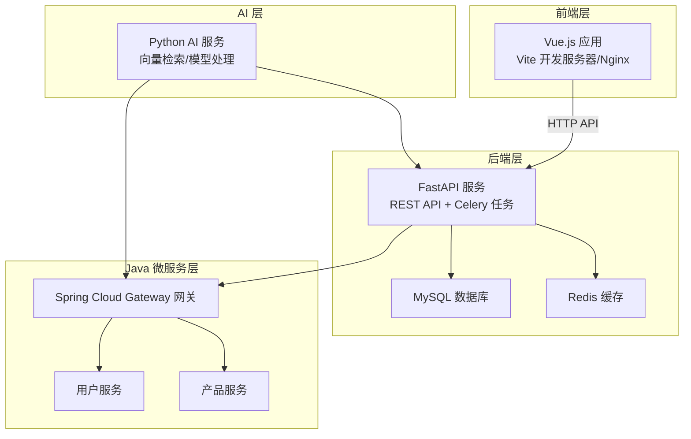
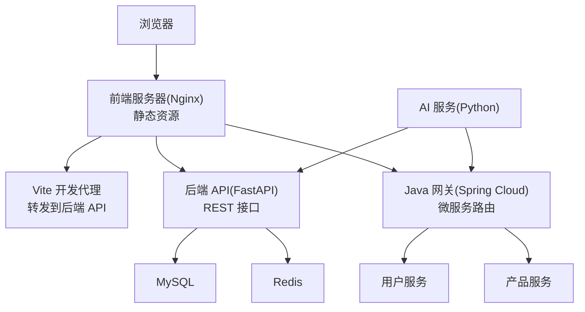
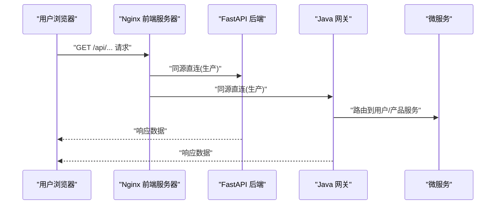
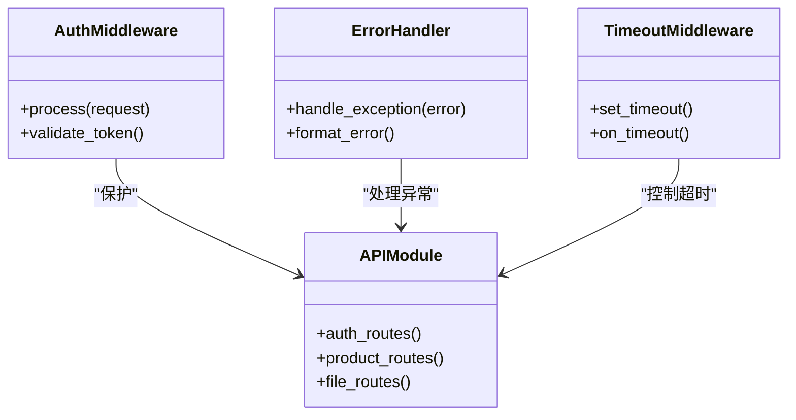
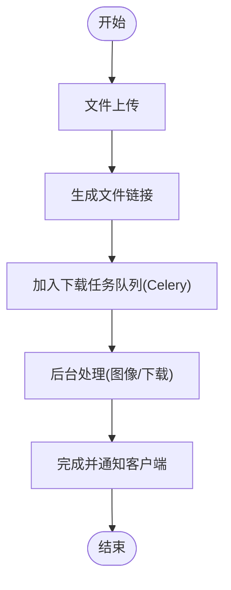
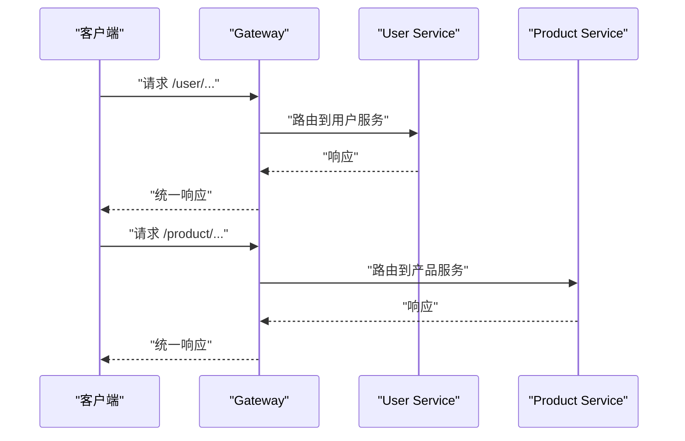
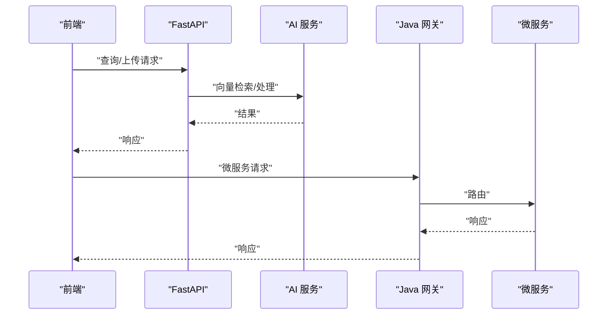
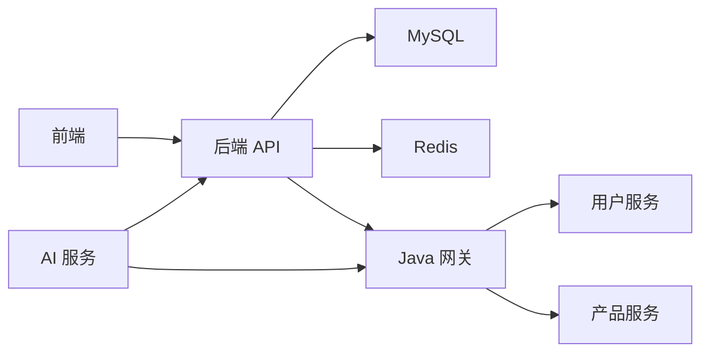

# 整体架构设计

<cite>
**本文引用的文件**
- [docker-compose.yml](file://docker-compose.yml)
- [docker-compose.dev.yml](file://docker-compose.dev.yml)
- [docker-compose.prod.yml](file://docker-compose.prod.yml)
- [nginx.conf](file://frontend/nginx.conf)
- [nginx.prod.conf](file://frontend/nginx.prod.conf)
- [vite.config.js](file://frontend/vite.config.js)
- [backend/main.py](file://backend/app/main.py)
- [backend/config.py](file://backend/app/config.py)
- [backend/middleware/auth_middleware.py](file://backend/app/middleware/auth_middleware.py)
- [backend/middleware/error_handler.py](file://backend/app/middleware/error_handler.py)
- [backend/api/v1/auth.py](file://backend/app/api/v1/auth.py)
- [backend/api/v1/products.py](file://backend/app/api/v1/products.py)
- [backend/api/v1/file_links.py](file://backend/app/api/v1/file_links.py)
- [backend/services/file_upload_service.py](file://backend/app/services/file_upload_service.py)
- [backend/services/image_service.py](file://backend/app/services/image_service.py)
- [backend/repositories/mysql_repo.py](file://backend/app/repositories/mysql_repo.py)
- [backend/repositories/redis_repo.py](file://backend/app/repositories/redis_repo.py)
- [backend/tasks/celery_app.py](file://backend/app/tasks/celery_app.py)
- [backend/tasks/download_tasks.py](file://backend/app/tasks/download_tasks.py)
- [java-backend/src/main/resources/application.yml](file://java-backend/src/main/resources/application.yml)
- [java-backend/sjzm-gateway/src/main/java/com/sjzm/gateway/GatewayApplication.java](file://java-backend/sjzm-gateway/src/main/java/com/sjzm/gateway/GatewayApplication.java)
- [java-backend/sjzm-product/src/main/java/com/sjzm/product/ProductApplication.java](file://java-backend/sjzm-product/src/main/java/com/sjzm/product/ProductApplication.java)
- [java-backend/sjzm-user/src/main/java/com/sjzm/user/UserApplication.java](file://java-backend/sjzm-user/src/main/java/com/sjzm/user/UserApplication.java)
- [python-ai/main.py](file://python-ai/app/main.py)
- [python-ai/config.py](file://python-ai/app/config.py)
- [python-ai/clients/java_api_client.py](file://python-ai/app/clients/java_api_client.py)
- [python-ai/services/vector_service.py](file://python-ai/app/services/vector_service.py)
- [config/ports.json](file://config/ports.json)
- [backend/start_vite_dev.py](file://backend/start_vite_dev.py)
- [backend/start_java_dev.py](file://backend/start_java_dev.py)
- [docs/架构/ARCHITECTURE.md](file://docs/架构/ARCHITECTURE.md)
- [docs/架构/网关.md](file://docs/架构/网关.md)
- [docs/架构/后续优化.md](file://docs/架构/后续优化.md)
- [docs/架构/Docker生产环境独立部署方案.md](file://docs/架构/Docker生产环境独立部署方案.md)
- [docs/项目逻辑/微服务/Gateway.md](file://docs/项目逻辑/微服务/Gateway.md)
- [docs/架构设计文档-微服务分离方案.md](file://docs/架构设计文档-微服务分离方案.md)
</cite>

## 目录
1. [引言](#引言)
2. [项目结构](#项目结构)
3. [核心组件](#核心组件)
4. [架构总览](#架构总览)
5. [详细组件分析](#详细组件分析)
6. [依赖分析](#依赖分析)
7. [性能考虑](#性能考虑)
8. [故障排查指南](#故障排查指南)
9. [结论](#结论)
10. [附录](#附录)

## 引言
本架构设计文档面向“思觉智贸系统”，系统采用三层架构模式：前端 Vue.js 应用、后端 FastAPI 服务以及 Java 微服务。系统遵循同源架构设计原则，在开发模式下通过 Vite 代理实现跨域请求转发，在生产模式下通过 Nginx 实现同源直连，确保前后端通信的一致性与安全性。系统组件间通过 HTTP API 调用、WebSocket 实时通信（用于任务状态推送）以及文件上传下载等机制协同工作。本文档还阐述了技术栈选择的原因、各组件职责划分、架构决策的技术考量与权衡。

## 项目结构
系统由四个主要子系统组成：
- 前端子系统：基于 Vue.js 的单页应用，使用 Vite 进行开发与构建，Nginx 作为静态资源服务器。
- 后端子系统：基于 FastAPI 的 Python 服务，提供 REST API、任务调度与数据处理。
- Java 微服务子系统：基于 Spring Boot 的多模块微服务，通过网关统一对外暴露。
- AI 子系统：Python 向量检索与 AI 处理服务，与 Java 微服务进行交互。

图表来源
- [docker-compose.yml](file://docker-compose.yml)
- [backend/main.py](file://backend/app/main.py)
- [java-backend/sjzm-gateway/src/main/java/com/sjzm/gateway/GatewayApplication.java](file://java-backend/sjzm-gateway/src/main/java/com/sjzm/gateway/GatewayApplication.java)
- [python-ai/main.py](file://python-ai/app/main.py)

章节来源
- [docker-compose.yml](file://docker-compose.yml)
- [frontend/nginx.conf](file://frontend/nginx.conf)
- [backend/config.py](file://backend/app/config.py)
- [java-backend/src/main/resources/application.yml](file://java-backend/src/main/resources/application.yml)

## 核心组件
- 前端 Vue.js 应用
  - 使用 Vite 进行开发与构建，开发模式下通过代理解决跨域；生产模式下通过 Nginx 提供静态资源并实现同源直连。
  - 组件化架构，模块化组织业务页面与通用组件，统一的 API 请求封装与状态管理。
- 后端 FastAPI 服务
  - 提供 REST API，包含认证、产品管理、文件链接、下载任务、统计报表等接口。
  - 中间件体系：认证、错误处理、超时控制、日志记录。
  - 任务系统：Celery 异步任务处理下载与图像处理等耗时操作。
  - 数据访问：MySQL 与 Redis 双存储，支持缓存预热与性能监控。
- Java 微服务
  - Spring Cloud Gateway 作为统一入口，路由到用户服务与产品服务。
  - 服务拆分清晰，便于扩展与独立部署。
- AI 子系统
  - 向量检索与 AI 处理服务，与 Java 微服务交互，支持向量相似度检索与模型缓存。

章节来源
- [frontend/vite.config.js](file://frontend/vite.config.js)
- [backend/main.py](file://backend/app/main.py)
- [backend/middleware/auth_middleware.py](file://backend/app/middleware/auth_middleware.py)
- [backend/middleware/error_handler.py](file://backend/app/middleware/error_handler.py)
- [backend/tasks/celery_app.py](file://backend/app/tasks/celery_app.py)
- [java-backend/sjzm-gateway/src/main/java/com/sjzm/gateway/GatewayApplication.java](file://java-backend/sjzm-gateway/src/main/java/com/sjzm/gateway/GatewayApplication.java)
- [java-backend/sjzm-user/src/main/java/com/sjzm/user/UserApplication.java](file://java-backend/sjzm-user/src/main/java/com/sjzm/user/UserApplication.java)
- [java-backend/sjzm-product/src/main/java/com/sjzm/product/ProductApplication.java](file://java-backend/sjzm-product/src/main/java/com/sjzm/product/ProductApplication.java)
- [python-ai/main.py](file://python-ai/app/main.py)

## 架构总览
系统采用同源架构设计，确保开发与生产环境的一致性体验。开发模式通过 Vite 代理将前端请求转发至后端 API，避免 CORS 问题；生产模式通过 Nginx 将前端静态资源与后端 API 同源部署，提升安全性和性能。

图表来源
- [frontend/nginx.conf](file://frontend/nginx.conf)
- [frontend/nginx.prod.conf](file://frontend/nginx.prod.conf)
- [frontend/vite.config.js](file://frontend/vite.config.js)
- [backend/main.py](file://backend/app/main.py)
- [java-backend/sjzm-gateway/src/main/java/com/sjzm/gateway/GatewayApplication.java](file://java-backend/sjzm-gateway/src/main/java/com/sjzm/gateway/GatewayApplication.java)
- [python-ai/main.py](file://python-ai/app/main.py)

## 详细组件分析

### 前端架构与同源设计
- 开发模式
  - Vite 代理将前端请求转发到后端 API，避免跨域问题，保证开发体验一致性。
- 生产模式
  - Nginx 同源部署，前端静态资源与后端 API 在同一域名下，减少网络往返与安全风险。
- 文件下载与大文件传输
  - 支持断点续传与进度反馈，结合后端下载任务队列与文件链接服务，保障大文件传输稳定性。

图表来源
- [frontend/nginx.prod.conf](file://frontend/nginx.prod.conf)
- [backend/main.py](file://backend/app/main.py)
- [java-backend/sjzm-gateway/src/main/java/com/sjzm/gateway/GatewayApplication.java](file://java-backend/sjzm-gateway/src/main/java/com/sjzm/gateway/GatewayApplication.java)

章节来源
- [frontend/vite.config.js](file://frontend/vite.config.js)
- [frontend/nginx.conf](file://frontend/nginx.conf)
- [frontend/nginx.prod.conf](file://frontend/nginx.prod.conf)

### 后端 API 设计与中间件体系
- 认证中间件
  - 统一鉴权与权限校验，确保 API 调用的安全性。
- 错误处理中间件
  - 规范化异常处理与错误返回格式，提升可观测性与调试效率。
- 超时与日志中间件
  - 控制请求超时与统一日志输出，保障系统稳定性。
- API 分层
  - v1 版本接口清晰，涵盖认证、产品、文件链接、下载任务、统计等模块。
- 数据访问与缓存
  - MySQL 与 Redis 双存储，支持缓存预热与性能监控。

图表来源
- [backend/middleware/auth_middleware.py](file://backend/app/middleware/auth_middleware.py)
- [backend/middleware/error_handler.py](file://backend/app/middleware/error_handler.py)
- [backend/api/v1/auth.py](file://backend/app/api/v1/auth.py)
- [backend/api/v1/products.py](file://backend/app/api/v1/products.py)
- [backend/api/v1/file_links.py](file://backend/app/api/v1/file_links.py)

章节来源
- [backend/middleware/auth_middleware.py](file://backend/app/middleware/auth_middleware.py)
- [backend/middleware/error_handler.py](file://backend/app/middleware/error_handler.py)
- [backend/api/v1/auth.py](file://backend/app/api/v1/auth.py)
- [backend/api/v1/products.py](file://backend/app/api/v1/products.py)
- [backend/api/v1/file_links.py](file://backend/app/api/v1/file_links.py)

### 任务系统与文件传输
- Celery 异步任务
  - 下载任务与图像处理等耗时操作异步执行，提升用户体验与系统吞吐。
- 文件上传与链接
  - 文件上传服务与文件链接服务配合，支持多文件上传、链接生成与下载管理。
- 图像处理
  - 图像服务与图像分析服务协同，支持缩略图生成、元数据提取与识别。

图表来源
- [backend/tasks/celery_app.py](file://backend/app/tasks/celery_app.py)
- [backend/tasks/download_tasks.py](file://backend/app/tasks/download_tasks.py)
- [backend/services/file_upload_service.py](file://backend/app/services/file_upload_service.py)
- [backend/services/image_service.py](file://backend/app/services/image_service.py)

章节来源
- [backend/tasks/celery_app.py](file://backend/app/tasks/celery_app.py)
- [backend/tasks/download_tasks.py](file://backend/app/tasks/download_tasks.py)
- [backend/services/file_upload_service.py](file://backend/app/services/file_upload_service.py)
- [backend/services/image_service.py](file://backend/app/services/image_service.py)

### Java 微服务与网关
- 网关统一入口
  - Spring Cloud Gateway 路由到用户服务与产品服务，集中处理鉴权、限流与监控。
- 服务拆分
  - 用户服务负责用户相关业务，产品服务负责产品相关业务，职责清晰。
- 配置与部署
  - 通过 application.yml 配置服务注册与路由规则，支持容器化部署。

图表来源
- [java-backend/sjzm-gateway/src/main/java/com/sjzm/gateway/GatewayApplication.java](file://java-backend/sjzm-gateway/src/main/java/com/sjzm/gateway/GatewayApplication.java)
- [java-backend/sjzm-user/src/main/java/com/sjzm/user/UserApplication.java](file://java-backend/sjzm-user/src/main/java/com/sjzm/user/UserApplication.java)
- [java-backend/sjzm-product/src/main/java/com/sjzm/product/ProductApplication.java](file://java-backend/sjzm-product/src/main/java/com/sjzm/product/ProductApplication.java)

章节来源
- [java-backend/src/main/resources/application.yml](file://java-backend/src/main/resources/application.yml)
- [java-backend/sjzm-gateway/src/main/java/com/sjzm/gateway/GatewayApplication.java](file://java-backend/sjzm-gateway/src/main/java/com/sjzm/gateway/GatewayApplication.java)

### AI 子系统与集成
- 向量检索与 AI 处理
  - Python AI 服务提供向量检索与模型处理能力，支持与 Java 微服务交互。
- 与后端协作
  - 通过 HTTP 客户端与后端 API 交互，实现数据同步与任务编排。

图表来源
- [python-ai/main.py](file://python-ai/app/main.py)
- [python-ai/clients/java_api_client.py](file://python-ai/app/clients/java_api_client.py)
- [backend/main.py](file://backend/app/main.py)
- [java-backend/sjzm-gateway/src/main/java/com/sjzm/gateway/GatewayApplication.java](file://java-backend/sjzm-gateway/src/main/java/com/sjzm/gateway/GatewayApplication.java)

章节来源
- [python-ai/main.py](file://python-ai/app/main.py)
- [python-ai/config.py](file://python-ai/app/config.py)
- [python-ai/clients/java_api_client.py](file://python-ai/app/clients/java_api_client.py)
- [python-ai/services/vector_service.py](file://python-ai/app/services/vector_service.py)

## 依赖分析
- 组件耦合
  - 前端与后端通过 REST API 通信，耦合度低；Java 网关作为统一入口降低微服务耦合。
  - AI 子系统与后端及网关通过 HTTP 客户端交互，保持独立演进能力。
- 外部依赖
  - MySQL 与 Redis 提供数据持久化与缓存；Nginx 提供静态资源与反向代理。
- 部署依赖
  - Docker Compose 支持本地开发与生产部署，端口配置集中管理。

图表来源
- [docker-compose.yml](file://docker-compose.yml)
- [backend/repositories/mysql_repo.py](file://backend/app/repositories/mysql_repo.py)
- [backend/repositories/redis_repo.py](file://backend/app/repositories/redis_repo.py)
- [java-backend/sjzm-gateway/src/main/java/com/sjzm/gateway/GatewayApplication.java](file://java-backend/sjzm-gateway/src/main/java/com/sjzm/gateway/GatewayApplication.java)

章节来源
- [docker-compose.yml](file://docker-compose.yml)
- [config/ports.json](file://config/ports.json)

## 性能考虑
- 前端性能
  - 使用 Nginx 压缩与缓存策略，减少带宽消耗；组件懒加载与虚拟列表优化长列表渲染。
- 后端性能
  - Redis 缓存热点数据，MySQL 索引优化查询；Celery 异步处理耗时任务。
- 微服务性能
  - 网关统一限流与熔断，服务间通过轻量协议通信，避免重复计算。
- AI 性能
  - 模型缓存与向量索引优化检索速度，批量处理与并发控制提升吞吐。

## 故障排查指南
- 常见问题定位
  - 前端无法访问后端：检查 Nginx 配置与代理规则；确认开发代理是否正确转发。
  - 认证失败：检查认证中间件与 Token 生成逻辑；核对用户权限。
  - 任务未执行：检查 Celery 队列与 Worker 进程状态；查看下载任务日志。
  - 数据库连接异常：核对 MySQL 连接参数与网络连通性；检查慢查询与索引。
- 日志与监控
  - 统一日志输出与错误处理中间件，结合 Prometheus/Grafana 进行指标监控。
- 回滚与恢复
  - Docker 部署支持蓝绿/金丝雀发布；数据库迁移脚本支持版本回退。

章节来源
- [backend/middleware/error_handler.py](file://backend/app/middleware/error_handler.py)
- [backend/tasks/celery_app.py](file://backend/app/tasks/celery_app.py)
- [backend/repositories/mysql_repo.py](file://backend/app/repositories/mysql_repo.py)

## 结论
本架构以“同源设计”为核心，结合 Vite 代理与 Nginx 同源直连，实现了开发与生产的无缝衔接。三层架构清晰划分职责：前端专注用户体验，后端提供稳定 API 与任务处理，Java 微服务通过网关实现高内聚低耦合的服务治理，AI 子系统提供智能化能力增强。通过合理的中间件体系、缓存与异步任务设计，系统在性能、可维护性与可扩展性方面取得良好平衡。建议持续完善监控告警、灰度发布与灾备方案，进一步提升系统韧性。

## 附录
- 技术栈选择原因
  - 前端：Vue.js 生态成熟、组件化开发高效；Vite 构建速度快；Nginx 静态资源与反向代理能力强。
  - 后端：FastAPI 类型安全与自动文档；中间件体系完善；Celery 异步任务成熟稳定。
  - Java 微服务：Spring Cloud 生态完善；Gateway 提供统一路由与安全控制；易于容器化部署。
  - AI：Python 生态丰富；向量检索与模型处理工具链完善。
- 架构决策与权衡
  - 同源设计简化了跨域与安全策略，但需要在 Nginx 与代理配置上投入更多精力。
  - 微服务拆分提升了扩展性，但也增加了运维复杂度，需配套完善的网关与监控体系。
  - 异步任务提升了吞吐，但需要关注任务幂等与重试策略，避免数据不一致。

章节来源
- [docs/架构/ARCHITECTURE.md](file://docs/架构/ARCHITECTURE.md)
- [docs/架构/网关.md](file://docs/架构/网关.md)
- [docs/架构/后续优化.md](file://docs/架构/后续优化.md)
- [docs/架构/Docker生产环境独立部署方案.md](file://docs/架构/Docker生产环境独立部署方案.md)
- [docs/项目逻辑/微服务/Gateway.md](file://docs/项目逻辑/微服务/Gateway.md)
- [docs/架构设计文档-微服务分离方案.md](file://docs/架构设计文档-微服务分离方案.md)