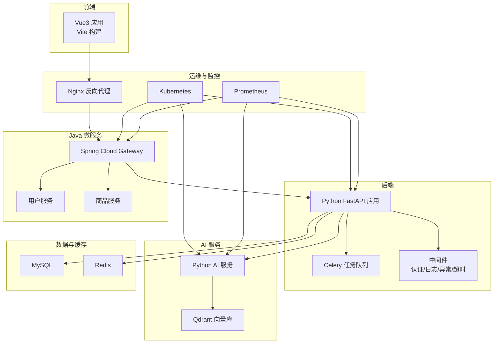
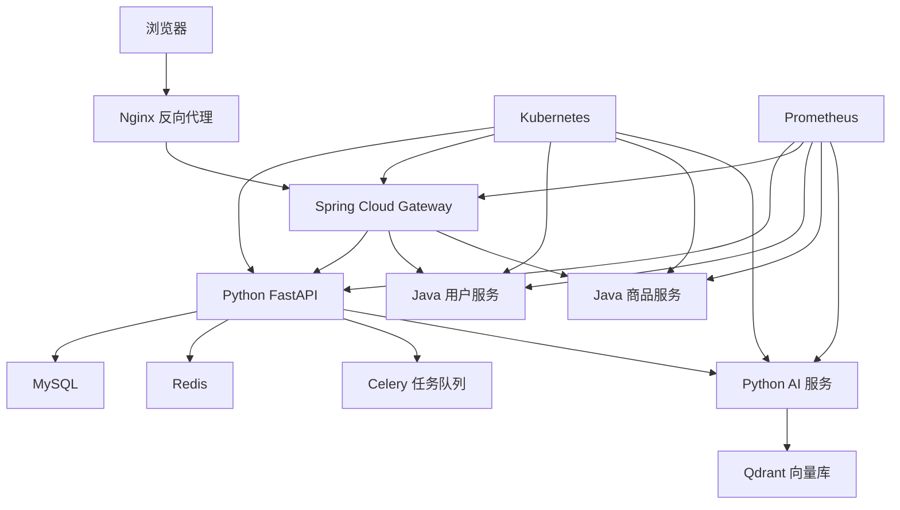
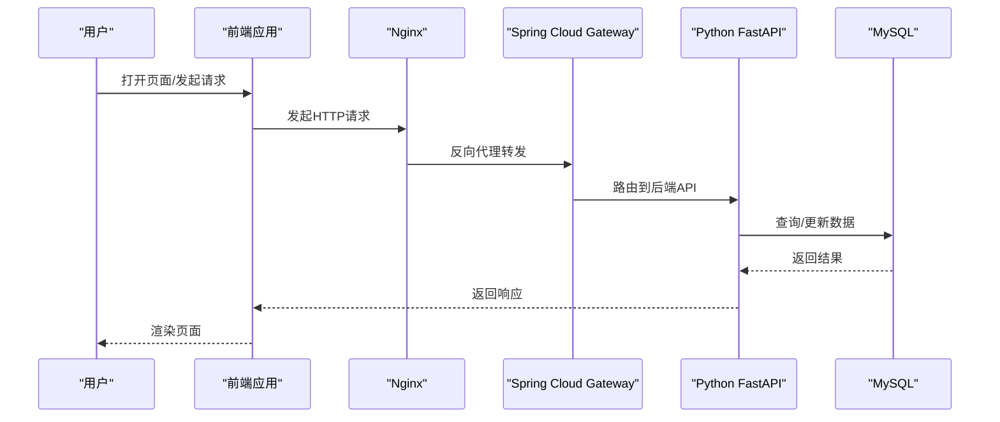
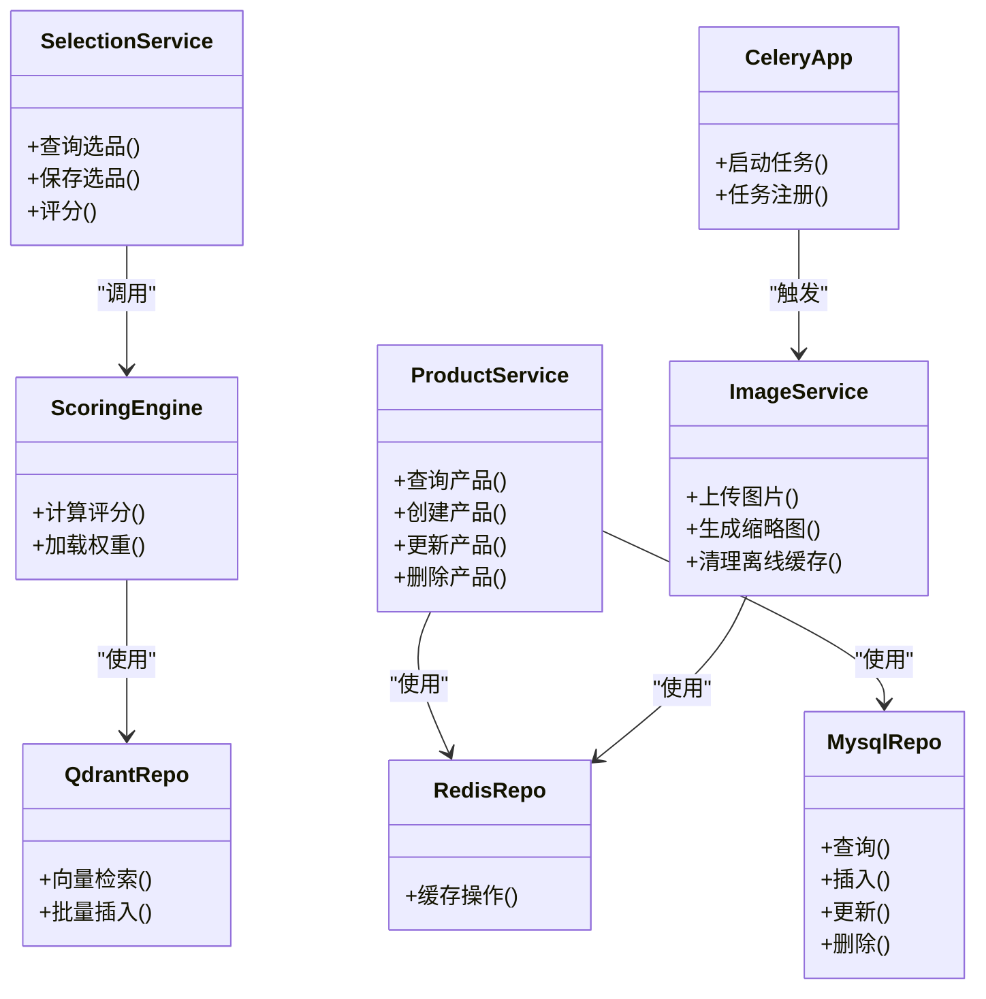
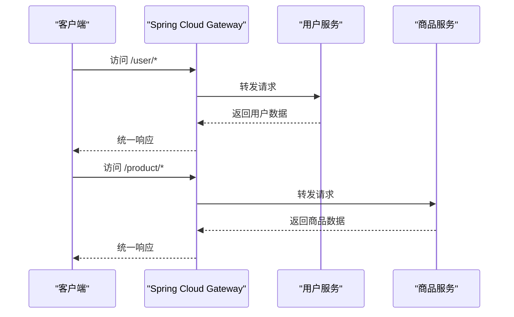
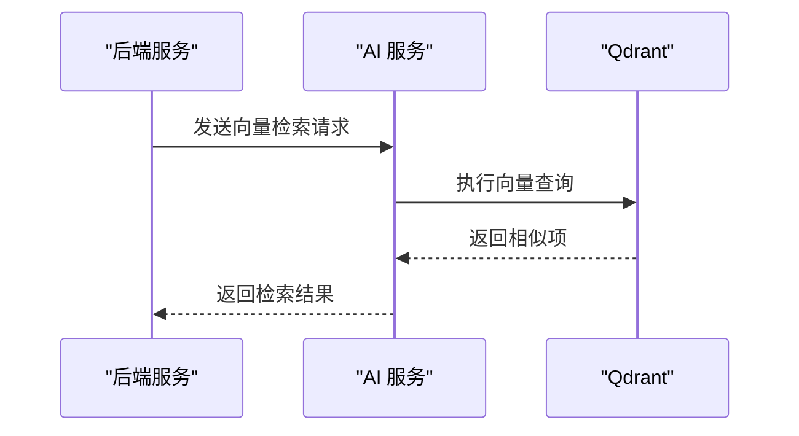
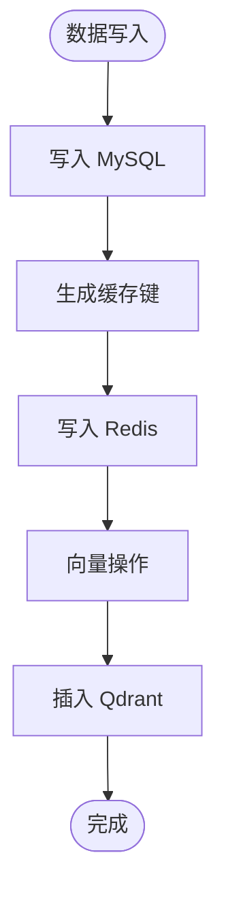
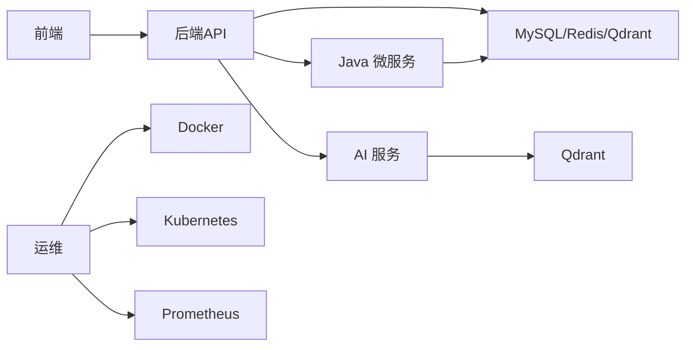

# 系统架构

<cite>
**本文引用的文件**
- [README.md](file://README.md)
- [backend/main.py](file://backend/main.py)
- [backend/config.py](file://backend/config.py)
- [backend/app/middleware/auth_middleware.py](file://backend/app/middleware/auth_middleware.py)
- [backend/app/middleware/error_handler.py](file://backend/app/middleware/error_handler.py)
- [backend/app/services/product_service.py](file://backend/app/services/product_service.py)
- [backend/app/services/image_service.py](file://backend/app/services/image_service.py)
- [backend/app/services/selection_service.py](file://backend/app/services/selection_service.py)
- [backend/app/services/scoring_engine.py](file://backend/app/services/scoring_engine.py)
- [backend/app/repositories/mysql_repo.py](file://backend/app/repositories/mysql_repo.py)
- [backend/app/repositories/qdrant_repo.py](file://backend/app/repositories/qdrant_repo.py)
- [backend/app/repositories/redis_repo.py](file://backend/app/repositories/redis_repo.py)
- [backend/tasks/celery_app.py](file://backend/tasks/celery_app.py)
- [backend/tasks/download_tasks.py](file://backend/tasks/download_tasks.py)
- [backend/tasks/image_tasks.py](file://backend/tasks/image_tasks.py)
- [backend/app/services/ai_vector_processing/ai_vector_processor.py](file://backend/app/services/ai_vector_processing/ai_vector_processor.py)
- [backend/app/services/baidu_image_recognition_service.py](file://backend/app/services/baidu_image_recognition_service.py)
- [backend/app/services/tencent_image_recognition_service.py](file://backend/app/services/tencent_image_recognition_service.py)
- [backend/app/services/tencent_image_search_service.py](file://backend/app/services/tencent_image_search_service.py)
- [backend/app/services/tencent_llm_vision_service.py](file://backend/app/services/tencent_llm_vision_service.py)
- [backend/app/utils/jwt_utils.py](file://backend/app/utils/jwt_utils.py)
- [backend/app/utils/performance_monitor.py](file://backend/app/utils/performance_monitor.py)
- [frontend/src/main.ts](file://frontend/src/main.ts)
- [frontend/vite.config.js](file://frontend/vite.config.js)
- [frontend/nginx.conf](file://frontend/nginx.conf)
- [frontend/src/utils/request.ts](file://frontend/src/utils/request.ts)
- [frontend/src/router/index.ts](file://frontend/src/router/index.ts)
- [frontend/src/stores/user.ts](file://frontend/src/stores/user.ts)
- [frontend/src/stores/settings.ts](file://frontend/src/stores/settings.ts)
- [frontend/src/views/Login/index.vue](file://frontend/src/views/Login/index.vue)
- [frontend/src/views/Home/index.vue](file://frontend/src/views/Home/index.vue)
- [frontend/src/views/ProductManagement/index.vue](file://frontend/src/views/ProductManagement/index.vue)
- [frontend/src/views/SelectionDetail/index.vue](file://frontend/src/views/SelectionDetail/index.vue)
- [frontend/src/views/FinalDraft/index.vue](file://frontend/src/views/FinalDraft/index.vue)
- [frontend/src/views/Statistics/index.vue](file://frontend/src/views/Statistics/index.vue)
- [frontend/src/views/ReportViewer/index.vue](file://frontend/src/views/ReportViewer/index.vue)
- [frontend/src/views/UserManagement/index.vue](file://frontend/src/views/UserManagement/index.vue)
- [frontend/src/components/LazyImage/index.vue](file://frontend/src/components/LazyImage/index.vue)
- [frontend/src/components/UniversalCard/index.vue](file://frontend/src/components/UniversalCard/index.vue)
- [frontend/src/components/FilterConfigPanel/index.vue](file://frontend/src/components/FilterConfigPanel/index.vue)
- [frontend/src/modules/zheng-shop-analysis/index.vue](file://frontend/src/modules/zheng-shop-analysis/index.vue)
- [java-backend/src/main/java/com/sjzm/SjzmBackendApplication.java](file://java-backend/src/main/java/com/sjzm/SjzmBackendApplication.java)
- [java-backend/sjzm-gateway/src/main/java/com/sjzm/gateway/GatewayApplication.java](file://java-backend/sjzm-gateway/src/main/java/com/sjzm/gateway/GatewayApplication.java)
- [java-backend/sjzm-product/src/main/java/com/sjzm/product/ProductApplication.java](file://java-backend/sjzm-product/src/main/java/com/sjzm/product/ProductApplication.java)
- [java-backend/sjzm-user/src/main/java/com/sjzm/user/UserApplication.java](file://java-backend/sjzm-user/src/main/java/com/sjzm/user/UserApplication.java)
- [java-backend/src/main/resources/application.yml](file://java-backend/src/main/resources/application.yml)
- [java-backend/Dockerfile](file://java-backend/Dockerfile)
- [java-backend/Dockerfile.prod](file://java-backend/Dockerfile.prod)
- [python-ai/main.py](file://python-ai/main.py)
- [python-ai/config.py](file://python-ai/config.py)
- [python-ai/repositories/qdrant_repo.py](file://python-ai/repositories/qdrant_repo.py)
- [python-ai/services/vector_service.py](file://python-ai/services/vector_service.py)
- [python-ai/services/qdrant_service.py](file://python-ai/services/qdrant_service.py)
- [docker-compose.yml](file://docker-compose.yml)
- [docker-compose.prod.yml](file://docker-compose.prod.yml)
- [docker-compose.base.yml](file://docker-compose.base.yml)
- [k8s/backend-deployment.yaml](file://k8s/backend-deployment.yaml)
- [prometheus/prometheus.yml](file://prometheus/prometheus.yml)
- [mysql/init/01-init.sql](file://mysql/init/01-init.sql)
- [docs/架构/ARCHITECTURE.md](file://docs/架构/ARCHITECTURE.md)
- [docs/架构/Docker生产环境独立部署方案.md](file://docs/架构/Docker生产环境独立部署方案.md)
- [docs/架构/后续优化.md](file://docs/架构/后续优化.md)
- [docs/架构/架构分析与优化.md](file://docs/架构/架构分析与优化.md)
- [docs/架构/端口.md](file://docs/架构/端口.md)
- [docs/架构/简历可写.md](file://docs/架构/简历可写.md)
- [docs/架构/网关.md](file://docs/架构/网关.md)
- [docs/docker使用经验/README.md](file://docs/docker使用经验/README.md)
- [docs/docker使用经验/MySQL跨环境数据复制.md](file://docs/docker使用经验/MySQL跨环境数据复制.md)
- [docs/docker使用经验/docker命令经验.md](file://docs/docker使用经验/docker命令经验.md)
- [docs/项目逻辑/微服务/ Gateway.md](file://docs/项目逻辑/微服务/Gateway.md)
- [docs/项目逻辑/RBAC设计.md](file://docs/项目逻辑/RBAC设计.md)
- [docs/问题记录/生产数据库误删事故.md](file://docs/问题记录/生产数据库误删事故.md)
- [docs/问题记录/生产环境图片加载失败-COS_BUCKET配置错误.md](file://docs/问题记录/生产环境图片加载失败-COS_BUCKET配置错误.md)
- [docs/问题记录/生产环境登录失败-数据库密码hash不一致.md](file://docs/问题记录/生产环境登录失败-数据库密码hash不一致.md)
- [scripts/deployment/blue_green_deployment.py](file://scripts/deployment/blue_green_deployment.py)
- [scripts/deployment/canary_deployment.py](file://scripts/deployment/canary_deployment.py)
- [scripts/monitoring/performance_monitor.py](file://scripts/monitoring/performance_monitor.py)
- [backend/requirements.txt](file://backend/requirements.txt)
- [python-ai/requirements.txt](file://python-ai/requirements.txt)
- [frontend/package.json](file://frontend/package.json)
- [java-backend/pom.xml](file://java-backend/pom.xml)
</cite>

## 目录
1. [引言](#引言)
2. [项目结构](#项目结构)
3. [核心组件](#核心组件)
4. [架构总览](#架构总览)
5. [详细组件分析](#详细组件分析)
6. [依赖分析](#依赖分析)
7. [性能考虑](#性能考虑)
8. [故障排查指南](#故障排查指南)
9. [结论](#结论)
10. [附录](#附录)

## 引言
本架构文档面向“思觉智贸系统”，系统采用前后端分离与多语言微服务架构，融合AI向量检索与图像识别能力，覆盖商品管理、选品分析、定稿与统计报表等核心业务。文档从系统设计、技术栈选择、组件交互、容器化与K8s编排、性能与可扩展性、安全与监控、灾难恢复等方面进行系统化阐述，并提供部署拓扑与组件分解说明。

## 项目结构
系统由以下主要子系统构成：
- 前端（Vue3 + Vite）：负责用户界面、状态管理、路由与API调用封装。
- 后端（Python FastAPI）：提供REST API、任务队列、中间件、服务层与数据访问层。
- Java微服务（Spring Boot + 网关）：以网关为中心的多模块微服务，按领域拆分用户与商品服务。
- AI服务（Python FastAPI + Qdrant）：向量化检索与图像识别服务，支撑智能选品与相似图搜索。
- 数据与缓存：MySQL（持久化）、Redis（缓存/会话）、Qdrant（向量检索）。
- 运维与监控：Docker Compose/Kubernetes 编排、Prometheus、Nginx 反向代理。
- 文档与脚本：架构文档、部署脚本、迁移与监控工具。

图表来源
- [backend/main.py](file://backend/main.py)
- [java-backend/sjzm-gateway/src/main/java/com/sjzm/gateway/GatewayApplication.java](file://java-backend/sjzm-gateway/src/main/java/com/sjzm/gateway/GatewayApplication.java)
- [python-ai/main.py](file://python-ai/main.py)
- [docker-compose.yml](file://docker-compose.yml)
- [k8s/backend-deployment.yaml](file://k8s/backend-deployment.yaml)

章节来源
- [README.md](file://README.md)
- [docs/架构/ARCHITECTURE.md](file://docs/架构/ARCHITECTURE.md)

## 核心组件
- 前端应用：基于 Vue3 + Vite，通过请求封装统一调用后端API；路由与状态管理模块化组织；组件体系支持懒加载与虚拟列表提升性能。
- Python后端：FastAPI提供REST接口，中间件实现认证、日志、异常处理与超时控制；服务层封装业务逻辑；仓库层对接MySQL、Redis与Qdrant；Celery异步任务处理下载与图像处理。
- Java微服务：以Spring Cloud Gateway作为统一入口，用户与商品服务按领域拆分，便于独立演进与扩展。
- AI服务：提供向量检索与图像识别能力，与后端服务协同完成智能选品与相似图搜索。
- 数据与缓存：MySQL承载主业务数据，Redis用于缓存与会话，Qdrant支撑向量检索。
- 运维与监控：Docker Compose/Kubernetes 编排，Nginx反向代理，Prometheus指标采集。

章节来源
- [frontend/src/main.ts](file://frontend/src/main.ts)
- [backend/main.py](file://backend/main.py)
- [java-backend/sjzm-gateway/src/main/java/com/sjzm/gateway/GatewayApplication.java](file://java-backend/sjzm-gateway/src/main/java/com/sjzm/gateway/GatewayApplication.java)
- [python-ai/main.py](file://python-ai/main.py)

## 架构总览
系统采用“前端 + 后端API + 微服务 + AI服务 + 数据与缓存”的分层架构。前端通过Nginx反向代理访问Spring Cloud Gateway，再路由到Python后端或Java微服务；AI服务独立部署并与后端通过HTTP交互。所有服务均支持容器化与Kubernetes编排，Prometheus统一采集指标。

图表来源
- [docker-compose.yml](file://docker-compose.yml)
- [k8s/backend-deployment.yaml](file://k8s/backend-deployment.yaml)
- [java-backend/src/main/resources/application.yml](file://java-backend/src/main/resources/application.yml)

## 详细组件分析

### 前端组件分析
- 应用入口与构建：应用入口负责初始化全局状态、插件与路由；Vite配置提供开发与生产构建参数。
- 路由与视图：路由集中管理，视图组件覆盖登录、首页、商品管理、选品详情、定稿、统计、报表与用户管理等页面。
- 组件体系：通用组件如LazyImage、UniversalCard、FilterConfigPanel等，支持懒加载与虚拟列表，提升大列表渲染性能。
- 模块化：模块化加载“正店分析”等业务模块，便于按需加载与维护。
- 请求封装：统一的请求工具对API调用进行拦截、鉴权与错误处理，支持下载任务与文件链接管理。

图表来源
- [frontend/src/main.ts](file://frontend/src/main.ts)
- [frontend/src/utils/request.ts](file://frontend/src/utils/request.ts)
- [frontend/nginx.conf](file://frontend/nginx.conf)
- [java-backend/sjzm-gateway/src/main/java/com/sjzm/gateway/GatewayApplication.java](file://java-backend/sjzm-gateway/src/main/java/com/sjzm/gateway/GatewayApplication.java)
- [backend/main.py](file://backend/main.py)

章节来源
- [frontend/src/main.ts](file://frontend/src/main.ts)
- [frontend/vite.config.js](file://frontend/vite.config.js)
- [frontend/src/router/index.ts](file://frontend/src/router/index.ts)
- [frontend/src/views/Login/index.vue](file://frontend/src/views/Login/index.vue)
- [frontend/src/views/Home/index.vue](file://frontend/src/views/Home/index.vue)
- [frontend/src/views/ProductManagement/index.vue](file://frontend/src/views/ProductManagement/index.vue)
- [frontend/src/views/SelectionDetail/index.vue](file://frontend/src/views/SelectionDetail/index.vue)
- [frontend/src/views/FinalDraft/index.vue](file://frontend/src/views/FinalDraft/index.vue)
- [frontend/src/views/Statistics/index.vue](file://frontend/src/views/Statistics/index.vue)
- [frontend/src/views/ReportViewer/index.vue](file://frontend/src/views/ReportViewer/index.vue)
- [frontend/src/views/UserManagement/index.vue](file://frontend/src/views/UserManagement/index.vue)
- [frontend/src/components/LazyImage/index.vue](file://frontend/src/components/LazyImage/index.vue)
- [frontend/src/components/UniversalCard/index.vue](file://frontend/src/components/UniversalCard/index.vue)
- [frontend/src/components/FilterConfigPanel/index.vue](file://frontend/src/components/FilterConfigPanel/index.vue)
- [frontend/src/modules/zheng-shop-analysis/index.vue](file://frontend/src/modules/zheng-shop-analysis/index.vue)
- [frontend/src/utils/request.ts](file://frontend/src/utils/request.ts)

### 后端组件分析
- 应用入口与配置：应用入口定义API路由与生命周期；配置文件集中管理数据库、缓存与AI服务地址。
- 中间件体系：认证中间件、日志中间件、异常处理中间件与超时中间件，保障请求链路的稳定性与可观测性。
- 服务层：产品、选品、评分引擎、图片与文件上传等服务封装业务逻辑；AI向量处理服务负责模型缓存与向量化。
- 仓库层：MySQL、Redis与Qdrant仓库分别承担关系型数据、缓存与向量检索。
- 任务队列：Celery异步执行下载与图像处理任务，降低请求延迟并提升吞吐。

图表来源
- [backend/app/services/product_service.py](file://backend/app/services/product_service.py)
- [backend/app/services/selection_service.py](file://backend/app/services/selection_service.py)
- [backend/app/services/image_service.py](file://backend/app/services/image_service.py)
- [backend/app/services/scoring_engine.py](file://backend/app/services/scoring_engine.py)
- [backend/app/repositories/mysql_repo.py](file://backend/app/repositories/mysql_repo.py)
- [backend/app/repositories/redis_repo.py](file://backend/app/repositories/redis_repo.py)
- [backend/app/repositories/qdrant_repo.py](file://backend/app/repositories/qdrant_repo.py)
- [backend/tasks/celery_app.py](file://backend/tasks/celery_app.py)

章节来源
- [backend/main.py](file://backend/main.py)
- [backend/config.py](file://backend/config.py)
- [backend/app/middleware/auth_middleware.py](file://backend/app/middleware/auth_middleware.py)
- [backend/app/middleware/error_handler.py](file://backend/app/middleware/error_handler.py)
- [backend/app/services/product_service.py](file://backend/app/services/product_service.py)
- [backend/app/services/selection_service.py](file://backend/app/services/selection_service.py)
- [backend/app/services/image_service.py](file://backend/app/services/image_service.py)
- [backend/app/services/scoring_engine.py](file://backend/app/services/scoring_engine.py)
- [backend/app/repositories/mysql_repo.py](file://backend/app/repositories/mysql_repo.py)
- [backend/app/repositories/redis_repo.py](file://backend/app/repositories/redis_repo.py)
- [backend/app/repositories/qdrant_repo.py](file://backend/app/repositories/qdrant_repo.py)
- [backend/tasks/celery_app.py](file://backend/tasks/celery_app.py)

### Java微服务组件分析
- 网关：统一入口，负责路由、限流、鉴权与协议转换。
- 用户服务：用户管理、权限与RBAC相关接口。
- 商品服务：商品数据、库存与销售相关接口。
- 配置：集中配置文件管理环境变量与服务注册发现。

图表来源
- [java-backend/sjzm-gateway/src/main/java/com/sjzm/gateway/GatewayApplication.java](file://java-backend/sjzm-gateway/src/main/java/com/sjzm/gateway/GatewayApplication.java)
- [java-backend/sjzm-user/src/main/java/com/sjzm/user/UserApplication.java](file://java-backend/sjzm-user/src/main/java/com/sjzm/user/UserApplication.java)
- [java-backend/sjzm-product/src/main/java/com/sjzm/product/ProductApplication.java](file://java-backend/sjzm-product/src/main/java/com/sjzm/product/ProductApplication.java)
- [java-backend/src/main/resources/application.yml](file://java-backend/src/main/resources/application.yml)

章节来源
- [java-backend/sjzm-gateway/src/main/java/com/sjzm/gateway/GatewayApplication.java](file://java-backend/sjzm-gateway/src/main/java/com/sjzm/gateway/GatewayApplication.java)
- [java-backend/sjzm-user/src/main/java/com/sjzm/user/UserApplication.java](file://java-backend/sjzm-user/src/main/java/com/sjzm/user/UserApplication.java)
- [java-backend/sjzm-product/src/main/java/com/sjzm/product/ProductApplication.java](file://java-backend/sjzm-product/src/main/java/com/sjzm/product/ProductApplication.java)
- [java-backend/src/main/resources/application.yml](file://java-backend/src/main/resources/application.yml)

### AI服务组件分析
- 应用入口与配置：AI服务提供向量检索与图像识别能力，配置文件管理Qdrant与外部AI服务地址。
- 服务层：向量服务与Qdrant服务封装检索与索引操作；向量处理器负责模型缓存与向量化预处理。
- 与后端集成：后端通过HTTP调用AI服务，完成相似图搜索与文本/图像向量化。

图表来源
- [python-ai/main.py](file://python-ai/main.py)
- [python-ai/config.py](file://python-ai/config.py)
- [python-ai/repositories/qdrant_repo.py](file://python-ai/repositories/qdrant_repo.py)
- [python-ai/services/vector_service.py](file://python-ai/services/vector_service.py)
- [python-ai/services/qdrant_service.py](file://python-ai/services/qdrant_service.py)
- [backend/app/services/ai_vector_processing/ai_vector_processor.py](file://backend/app/services/ai_vector_processing/ai_vector_processor.py)

章节来源
- [python-ai/main.py](file://python-ai/main.py)
- [python-ai/config.py](file://python-ai/config.py)
- [python-ai/repositories/qdrant_repo.py](file://python-ai/repositories/qdrant_repo.py)
- [python-ai/services/vector_service.py](file://python-ai/services/vector_service.py)
- [python-ai/services/qdrant_service.py](file://python-ai/services/qdrant_service.py)
- [backend/app/services/ai_vector_processing/ai_vector_processor.py](file://backend/app/services/ai_vector_processing/ai_vector_processor.py)

### 数据与缓存组件分析
- MySQL：初始化SQL脚本创建基础表结构，迁移脚本支持增量演进。
- Redis：缓存热点数据与会话，提升读写性能。
- Qdrant：向量检索，支撑相似图搜索与智能选品。

图表来源
- [mysql/init/01-init.sql](file://mysql/init/01-init.sql)
- [backend/app/repositories/mysql_repo.py](file://backend/app/repositories/mysql_repo.py)
- [backend/app/repositories/redis_repo.py](file://backend/app/repositories/redis_repo.py)
- [backend/app/repositories/qdrant_repo.py](file://backend/app/repositories/qdrant_repo.py)

章节来源
- [mysql/init/01-init.sql](file://mysql/init/01-init.sql)
- [backend/app/repositories/mysql_repo.py](file://backend/app/repositories/mysql_repo.py)
- [backend/app/repositories/redis_repo.py](file://backend/app/repositories/redis_repo.py)
- [backend/app/repositories/qdrant_repo.py](file://backend/app/repositories/qdrant_repo.py)

## 依赖分析
- 技术栈与版本兼容性：
  - 前端：Vue3、Vite、Element Plus、Axios、Pinia等，版本在package.json中声明。
  - 后端：Python 3.x、FastAPI、Pydantic、Celery、SQLAlchemy、Qdrant-client等，依赖在requirements.txt中声明。
  - Java：Spring Boot、Spring Cloud、Gateway、MyBatis/JPAs等，依赖在pom.xml中声明。
  - AI服务：Python 3.x、FastAPI、Qdrant-client、NumPy、Pillow等，依赖在requirements.txt中声明。
- 组件耦合与内聚：后端服务层高内聚、仓库层低耦合；前端通过API与后端解耦；Java微服务通过网关统一接入；AI服务独立部署，通过HTTP接口集成。
- 外部依赖：MySQL、Redis、Qdrant、Nginx、Prometheus、Docker/K8s。

图表来源
- [frontend/package.json](file://frontend/package.json)
- [backend/requirements.txt](file://backend/requirements.txt)
- [python-ai/requirements.txt](file://python-ai/requirements.txt)
- [java-backend/pom.xml](file://java-backend/pom.xml)
- [docker-compose.yml](file://docker-compose.yml)
- [k8s/backend-deployment.yaml](file://k8s/backend-deployment.yaml)
- [prometheus/prometheus.yml](file://prometheus/prometheus.yml)

章节来源
- [frontend/package.json](file://frontend/package.json)
- [backend/requirements.txt](file://backend/requirements.txt)
- [python-ai/requirements.txt](file://python-ai/requirements.txt)
- [java-backend/pom.xml](file://java-backend/pom.xml)

## 性能考虑
- 前端性能：组件懒加载、虚拟列表、图片懒加载与离线缓存优化；请求合并与防抖减少网络压力。
- 后端性能：中间件统一处理异常与超时，避免慢请求拖垮系统；Redis缓存热点数据；Celery异步处理耗时任务。
- AI检索性能：Qdrant向量索引与批量插入；向量处理器缓存模型与预处理结果。
- 数据库性能：索引优化与查询优化；分页与投影减少传输量。
- 微服务性能：网关限流与熔断；服务拆分降低单点压力。
- 监控与告警：Prometheus指标采集与告警策略，结合日志与APM进行全链路观测。

## 故障排查指南
- 登录失败：检查数据库密码hash一致性与用户状态。
- 图片加载失败：检查COS_BUCKET配置与对象存储权限。
- 数据库误删：核对备份策略与恢复流程，必要时回滚到最近备份。
- 部署问题：参考Docker部署经验与生产环境独立部署方案，确保端口与环境变量正确。

章节来源
- [docs/问题记录/生产数据库误删事故.md](file://docs/问题记录/生产数据库误删事故.md)
- [docs/问题记录/生产环境图片加载失败-COS_BUCKET配置错误.md](file://docs/问题记录/生产环境图片加载失败-COS_BUCKET配置错误.md)
- [docs/问题记录/生产环境登录失败-数据库密码hash不一致.md](file://docs/问题记录/生产环境登录失败-数据库密码hash不一致.md)
- [docs/docker使用经验/README.md](file://docs/docker使用经验/README.md)
- [docs/架构/Docker生产环境独立部署方案.md](file://docs/架构/Docker生产环境独立部署方案.md)

## 结论
系统通过前后端分离与多语言微服务架构实现了清晰的职责划分与良好的可扩展性；AI服务的引入显著提升了选品与相似图搜索的能力；容器化与Kubernetes编排提供了稳定的部署与弹性伸缩能力；完善的监控与运维实践保障了系统的可靠性与可维护性。建议持续优化向量检索与缓存策略，完善灰度发布与灾备演练，进一步提升系统性能与韧性。

## 附录
- 部署拓扑图：包含Nginx、Spring Cloud Gateway、Python后端、Java微服务、AI服务、数据库与缓存、Kubernetes与Prometheus。
- 组件分解说明：前端模块、后端服务与仓库、Java微服务模块、AI服务模块、数据与缓存模块、运维与监控模块。
- 安全与合规：认证中间件、JWT工具、RBAC设计、日志与审计、敏感信息加密与最小权限原则。
- 监控与可观测性：指标采集、日志聚合、告警策略、链路追踪与容量规划。
- 灾难恢复：备份策略、快照与归档、跨环境数据复制、蓝绿/金丝雀发布与回滚。