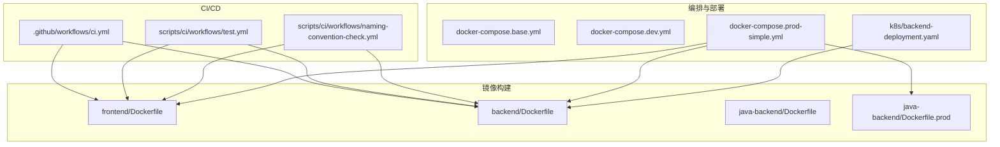
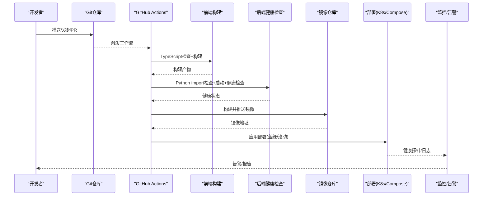
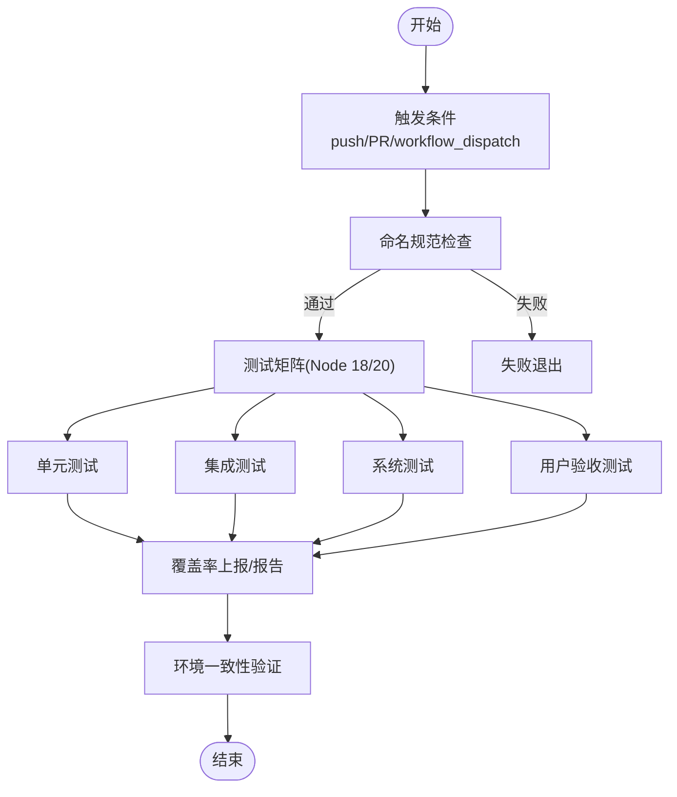
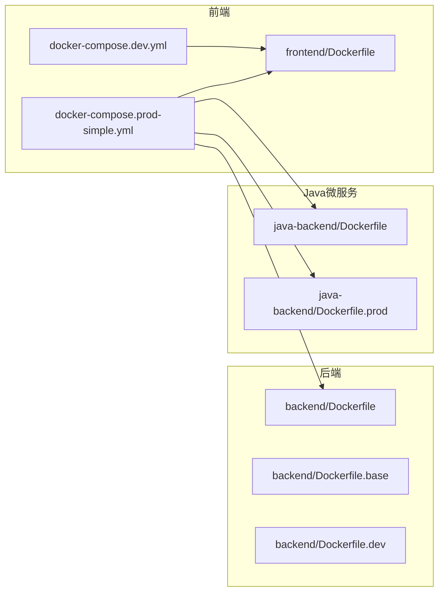
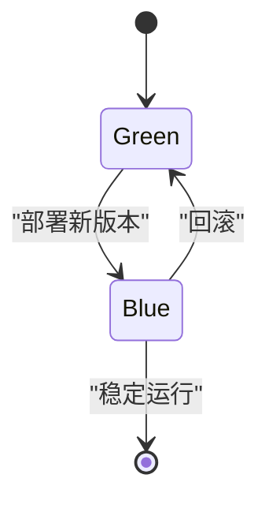
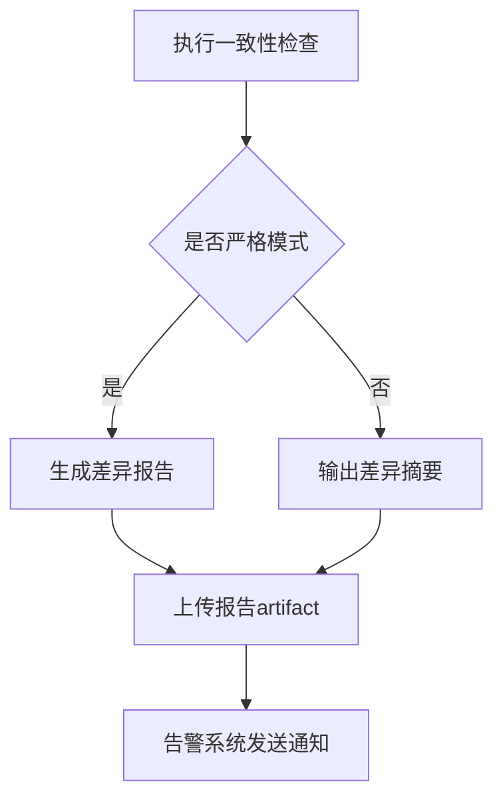
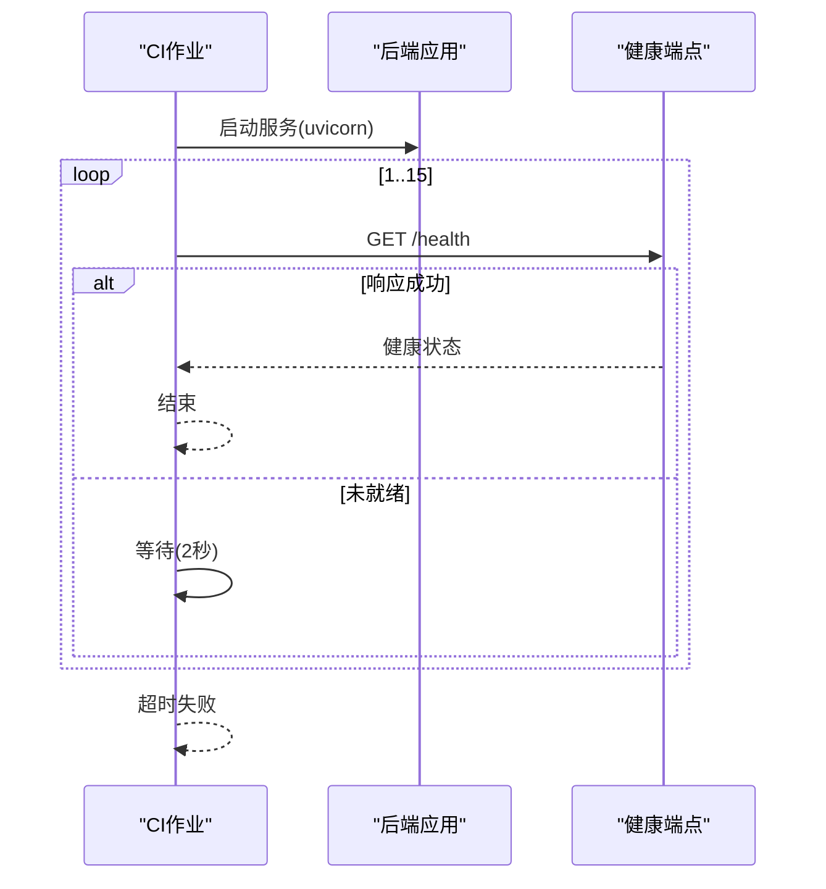
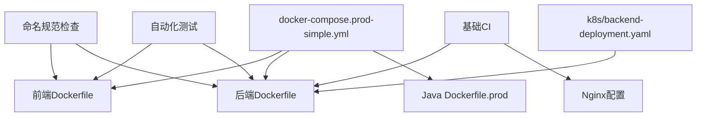

# CI/CD流水线

<cite>
**本文引用的文件**
- [.github/workflows/ci.yml](file://.github/workflows/ci.yml)
- [scripts/ci/workflows/naming-convention-check.yml](file://scripts/ci/workflows/naming-convention-check.yml)
- [scripts/ci/workflows/test.yml](file://scripts/ci/workflows/test.yml)
- [backend/Dockerfile](file://backend/Dockerfile)
- [backend/Dockerfile.base](file://backend/Dockerfile.base)
- [backend/Dockerfile.dev](file://backend/Dockerfile.dev)
- [frontend/Dockerfile](file://frontend/Dockerfile)
- [java-backend/Dockerfile](file://java-backend/Dockerfile)
- [java-backend/Dockerfile.prod](file://java-backend/Dockerfile.prod)
- [docker-compose.base.yml](file://docker-compose.base.yml)
- [docker-compose.dev.yml](file://docker-compose.dev.yml)
- [docker-compose.prod-simple.yml](file://docker-compose.prod-simple.yml)
- [docker-compose.prod.yml](file://docker-compose.prod.yml)
- [k8s/backend-deployment.yaml](file://k8s/backend-deployment.yaml)
- [scripts/deployment/blue_green_deployment.py](file://scripts/deployment/blue_green_deployment.py)
- [scripts/deployment/sync_dev_to_prod.py](file://scripts/deployment/sync_dev_to_prod.py)
- [scripts/environment/setup_dev_environment.py](file://scripts/environment/setup_dev_environment.py)
- [scripts/env_consistency/validate_env_consistency.py](file://scripts/env_consistency/validate_env_consistency.py)
- [scripts/env_consistency/alert_system.py](file://scripts/env_consistency/alert_system.py)
- [backend/app/api/v1/health.py](file://backend/app/api/v1/health.py)
- [backend/start_celery.py](file://backend/start_celery.py)
- [backend/start_java_dev.py](file://backend/start_java_dev.py)
- [backend/start_vite_dev.py](file://backend/start_vite_dev.py)
- [java-backend/src/main/resources/application.yml](file://java-backend/src/main/resources/application.yml)
- [java-backend/src/main/resources/application-prod.yml](file://java-backend/src/main/resources/application-prod.yml)
- [frontend/nginx.conf](file://frontend/nginx.conf)
- [frontend/nginx.prod.conf](file://frontend/nginx.prod.conf)
- [README.md](file://README.md)
</cite>

## 目录
1. [简介](#简介)
2. [项目结构](#项目结构)
3. [核心组件](#核心组件)
4. [架构总览](#架构总览)
5. [详细组件分析](#详细组件分析)
6. [依赖关系分析](#依赖关系分析)
7. [性能考虑](#性能考虑)
8. [故障排查指南](#故障排查指南)
9. [结论](#结论)
10. [附录](#附录)

## 简介
本指南面向“思觉智贸系统”的CI/CD流水线建设，覆盖以下目标：
- GitHub Actions工作流：代码质量检查、单元测试、集成测试、系统测试与覆盖率上报
- Docker镜像构建与推送：多阶段构建、镜像优化与缓存策略
- 自动化部署：蓝绿部署、滚动更新与回滚机制
- 环境管理：开发、测试、生产环境的自动部署与一致性校验
- 变更触发与分支策略：PR触发、分支保护与合并策略
- 部署前后健康检查与验证流程
- 故障排查与性能优化建议

## 项目结构
该仓库采用多模块架构，包含前端、后端（Python）、Java微服务、Kubernetes部署与脚本工具集。CI/CD相关的关键位置如下：
- GitHub Actions工作流：`.github/workflows/`
- 前端与后端Dockerfile与compose文件：`frontend/`、`backend/`、`java-backend/`
- Kubernetes部署：`k8s/`
- CI脚本与测试工作流：`scripts/ci/workflows/`
- 环境一致性与部署脚本：`scripts/env_consistency/`、`scripts/deployment/`、`scripts/environment/`

图表来源
- [.github/workflows/ci.yml:1-81](file://.github/workflows/ci.yml#L1-L81)
- [scripts/ci/workflows/naming-convention-check.yml:1-55](file://scripts/ci/workflows/naming-convention-check.yml#L1-L55)
- [scripts/ci/workflows/test.yml:1-143](file://scripts/ci/workflows/test.yml#L1-L143)
- [frontend/Dockerfile](file://frontend/Dockerfile)
- [backend/Dockerfile](file://backend/Dockerfile)
- [java-backend/Dockerfile.prod](file://java-backend/Dockerfile.prod)
- [docker-compose.prod-simple.yml](file://docker-compose.prod-simple.yml)

章节来源
- [.github/workflows/ci.yml:1-81](file://.github/workflows/ci.yml#L1-L81)
- [scripts/ci/workflows/naming-convention-check.yml:1-55](file://scripts/ci/workflows/naming-convention-check.yml#L1-L55)
- [scripts/ci/workflows/test.yml:1-143](file://scripts/ci/workflows/test.yml#L1-L143)

## 核心组件
- GitHub Actions工作流
  - 基础CI：前端TypeScript检查+构建、后端Python import检查+健康检查
  - 命名规范检查：基于Python watchdog的增量命名规范检查
  - 自动化测试：单元/集成/系统/UAT测试矩阵、覆盖率上报与报告归档
- Docker镜像与编排
  - 前端/后端/Java微服务各自Dockerfile与多阶段构建策略
  - docker-compose用于本地开发与简化生产部署
- 部署与环境管理
  - 蓝绿部署脚本、开发到生产的同步脚本
  - 环境一致性校验与告警系统
- 健康检查与验证
  - 后端健康端点、启动超时重试与curl探测
  - Nginx配置在开发与生产环境的差异

章节来源
- [.github/workflows/ci.yml:15-81](file://.github/workflows/ci.yml#L15-L81)
- [scripts/ci/workflows/naming-convention-check.yml:9-55](file://scripts/ci/workflows/naming-convention-check.yml#L9-L55)
- [scripts/ci/workflows/test.yml:10-143](file://scripts/ci/workflows/test.yml#L10-L143)

## 架构总览
下图展示从代码提交到部署的端到端流水线，涵盖质量门禁、测试矩阵、镜像构建与部署策略。

图表来源
- [.github/workflows/ci.yml:3-13](file://.github/workflows/ci.yml#L3-L13)
- [scripts/ci/workflows/test.yml:3-8](file://scripts/ci/workflows/test.yml#L3-L8)
- [scripts/ci/workflows/naming-convention-check.yml:3-7](file://scripts/ci/workflows/naming-convention-check.yml#L3-L7)

## 详细组件分析

### GitHub Actions 工作流
- 基础CI（ci.yml）
  - 触发条件：push排除master；PR进入master
  - 并发控制：同一ref仅保留一个进行中的工作流
  - 前端任务：Node 20 + npm ci + vue-tsc + 构建 + 产物确认
  - 后端任务：Python 3.14 + pip安装 + import检查 + 启动uvicorn + 健康检查（15次*2秒轮询）
- 命名规范检查（naming-convention-check.yml）
  - 触发：push/PR至main/develop
  - 步骤：Python 3.13 + watchdog安装 + 增量检查 + 报告上传 + 结果判定
- 自动化测试（test.yml）
  - 触发：push/PR/workflow_dispatch
  - 测试矩阵：Node 18/20并行
  - 测试类型：单元/集成/系统/UAT
  - 覆盖率：Codecov上报 + HTML报告归档
  - 环境一致性：Python依赖安装 + 环境一致性验证 + 报告归档

图表来源
- [scripts/ci/workflows/test.yml:3-143](file://scripts/ci/workflows/test.yml#L3-L143)
- [scripts/ci/workflows/naming-convention-check.yml:3-55](file://scripts/ci/workflows/naming-convention-check.yml#L3-L55)

章节来源
- [.github/workflows/ci.yml:3-13](file://.github/workflows/ci.yml#L3-L13)
- [scripts/ci/workflows/naming-convention-check.yml:1-55](file://scripts/ci/workflows/naming-convention-check.yml#L1-L55)
- [scripts/ci/workflows/test.yml:1-143](file://scripts/ci/workflows/test.yml#L1-L143)

### Docker镜像构建与推送
- 前端镜像
  - Dockerfile位于frontend/，用于生产Nginx静态资源服务
  - 开发环境可使用docker-compose.dev.yml或Dockerfile.dev
- 后端镜像
  - Dockerfile位于backend/，支持多阶段构建与缓存优化
  - Dockerfile.base定义基础层，Dockerfile.dev用于开发
- Java微服务镜像
  - Dockerfile用于Spring Boot应用
  - Dockerfile.prod用于统一的多模块生产镜像（通过SERVICE_MODULE区分模块）
- docker-compose
  - base/dev/prod-simple/prod用于不同环境的快速编排
  - prod-simple.yml中包含前端、后端、Java微服务的容器编排与Dockerfile路径映射

图表来源
- [frontend/Dockerfile](file://frontend/Dockerfile)
- [backend/Dockerfile](file://backend/Dockerfile)
- [backend/Dockerfile.base](file://backend/Dockerfile.base)
- [backend/Dockerfile.dev](file://backend/Dockerfile.dev)
- [java-backend/Dockerfile.prod](file://java-backend/Dockerfile.prod)
- [docker-compose.dev.yml](file://docker-compose.dev.yml)
- [docker-compose.prod-simple.yml](file://docker-compose.prod-simple.yml)

章节来源
- [frontend/Dockerfile](file://frontend/Dockerfile)
- [backend/Dockerfile](file://backend/Dockerfile)
- [backend/Dockerfile.base](file://backend/Dockerfile.base)
- [backend/Dockerfile.dev](file://backend/Dockerfile.dev)
- [java-backend/Dockerfile.prod](file://java-backend/Dockerfile.prod)
- [docker-compose.dev.yml](file://docker-compose.dev.yml)
- [docker-compose.prod-simple.yml](file://docker-compose.prod-simple.yml)

### 自动化部署策略
- 蓝绿部署
  - 使用脚本实现流量切换与回滚，确保零停机与快速恢复
- 滚动更新
  - 通过Kubernetes Deployment的滚动策略实现平滑升级
- 回滚机制
  - 通过版本标签与镜像回滚策略实现一键回滚
- 开发到生产的同步
  - 提供脚本将开发环境变更同步至生产环境

图表来源
- [scripts/deployment/blue_green_deployment.py](file://scripts/deployment/blue_green_deployment.py)
- [k8s/backend-deployment.yaml](file://k8s/backend-deployment.yaml)

章节来源
- [scripts/deployment/blue_green_deployment.py](file://scripts/deployment/blue_green_deployment.py)
- [k8s/backend-deployment.yaml](file://k8s/backend-deployment.yaml)

### 环境管理与一致性
- 环境一致性验证
  - Python脚本对配置文件、依赖版本、环境变量进行严格比对
  - 支持严格模式与报告输出，便于审计与告警
- 开发环境初始化
  - 提供脚本创建数据库、隔离前端等开发环境准备
- 告警系统
  - 将不一致项转化为告警消息，便于运维响应

图表来源
- [scripts/env_consistency/validate_env_consistency.py](file://scripts/env_consistency/validate_env_consistency.py)
- [scripts/env_consistency/alert_system.py](file://scripts/env_consistency/alert_system.py)
- [scripts/environment/setup_dev_environment.py](file://scripts/environment/setup_dev_environment.py)

章节来源
- [scripts/env_consistency/validate_env_consistency.py](file://scripts/env_consistency/validate_env_consistency.py)
- [scripts/env_consistency/alert_system.py](file://scripts/env_consistency/alert_system.py)
- [scripts/environment/setup_dev_environment.py](file://scripts/environment/setup_dev_environment.py)

### 健康检查与验证流程
- 后端健康检查
  - 启动uvicorn服务后，循环探测/health端点，最多15次，每次间隔2秒
  - 成功则打印健康状态，失败则终止进程并返回错误码
- 前端Nginx配置
  - 开发与生产分别使用nginx.conf与nginx.prod.conf，确保静态资源与代理规则正确
- Java应用配置
  - application.yml与application-prod.yml区分开发与生产环境参数

图表来源
- [.github/workflows/ci.yml:61-81](file://.github/workflows/ci.yml#L61-L81)
- [backend/app/api/v1/health.py](file://backend/app/api/v1/health.py)

章节来源
- [.github/workflows/ci.yml:61-81](file://.github/workflows/ci.yml#L61-L81)
- [frontend/nginx.conf](file://frontend/nginx.conf)
- [frontend/nginx.prod.conf](file://frontend/nginx.prod.conf)
- [java-backend/src/main/resources/application.yml](file://java-backend/src/main/resources/application.yml)
- [java-backend/src/main/resources/application-prod.yml](file://java-backend/src/main/resources/application-prod.yml)

### 代码变更触发机制与分支保护
- 触发机制
  - 基础CI：push排除master；PR进入master
  - 命名规范与测试：push/PR至main/develop，或手动触发
- 分支保护与合并策略
  - 建议在仓库设置中启用分支保护规则：要求PR审查、CI通过、禁止直接push到受保护分支
  - 合并策略：squash/merge或rebase以保持历史整洁

章节来源
- [.github/workflows/ci.yml:3-9](file://.github/workflows/ci.yml#L3-L9)
- [scripts/ci/workflows/naming-convention-check.yml:3-7](file://scripts/ci/workflows/naming-convention-check.yml#L3-L7)
- [scripts/ci/workflows/test.yml:3-8](file://scripts/ci/workflows/test.yml#L3-L8)

## 依赖关系分析
- 工作流与构建产物
  - 命名规范检查与测试工作流均依赖于前端/后端Dockerfile与requirements.txt
  - 基础CI工作流依赖后端健康端点与Nginx配置
- 编排与部署
  - docker-compose.prod-simple.yml集中管理各模块镜像与Dockerfile路径
  - Kubernetes部署文件与后端镜像配合实现滚动更新与探活

图表来源
- [scripts/ci/workflows/naming-convention-check.yml:1-55](file://scripts/ci/workflows/naming-convention-check.yml#L1-L55)
- [scripts/ci/workflows/test.yml:1-143](file://scripts/ci/workflows/test.yml#L1-L143)
- [.github/workflows/ci.yml:1-81](file://.github/workflows/ci.yml#L1-L81)
- [docker-compose.prod-simple.yml](file://docker-compose.prod-simple.yml)
- [k8s/backend-deployment.yaml](file://k8s/backend-deployment.yaml)

章节来源
- [scripts/ci/workflows/naming-convention-check.yml:1-55](file://scripts/ci/workflows/naming-convention-check.yml#L1-L55)
- [scripts/ci/workflows/test.yml:1-143](file://scripts/ci/workflows/test.yml#L1-L143)
- [.github/workflows/ci.yml:1-81](file://.github/workflows/ci.yml#L1-L81)
- [docker-compose.prod-simple.yml](file://docker-compose.prod-simple.yml)
- [k8s/backend-deployment.yaml](file://k8s/backend-deployment.yaml)

## 性能考虑
- 缓存优化
  - 前端：Node缓存使用package-lock.json路径
  - 后端：Python缓存使用requirements.txt路径
- 并行化
  - 测试工作流使用Node版本矩阵并行执行
  - 建议在后续扩展中引入并行测试套件与工件缓存
- 镜像体积
  - 使用多阶段构建减少最终镜像大小
  - 在Dockerfile中合理组织依赖安装顺序以利用缓存
- 健康检查与超时
  - 控制启动超时与重试次数，避免长时间占用CI资源

## 故障排查指南
- 健康检查失败
  - 现象：后端启动超时
  - 排查：检查端口占用、依赖安装、配置文件；查看健康端点返回
  - 参考：基础CI工作流中的健康检查步骤
- 测试覆盖率缺失
  - 现象：覆盖率报告未生成
  - 排查：确认测试命令生成覆盖率文件；检查Codecov上传路径
  - 参考：测试工作流中的覆盖率上报步骤
- 环境不一致
  - 现象：配置文件/依赖版本/环境变量不一致
  - 排查：运行环境一致性验证脚本，查看差异报告并修正
  - 参考：环境一致性验证与告警系统
- 镜像构建失败
  - 现象：Dockerfile构建报错
  - 排查：检查基础镜像可用性、缓存层、依赖安装顺序
  - 参考：对应模块的Dockerfile与compose文件

章节来源
- [.github/workflows/ci.yml:61-81](file://.github/workflows/ci.yml#L61-L81)
- [scripts/ci/workflows/test.yml:65-73](file://scripts/ci/workflows/test.yml#L65-L73)
- [scripts/env_consistency/validate_env_consistency.py](file://scripts/env_consistency/validate_env_consistency.py)
- [scripts/env_consistency/alert_system.py](file://scripts/env_consistency/alert_system.py)

## 结论
本指南基于现有仓库文件，给出了完整的CI/CD流水线配置思路与落地要点。通过命名规范检查、测试矩阵、健康检查与环境一致性验证，结合多阶段Docker构建与Kubernetes/Compose部署，可实现高质量、可追溯、可回滚的自动化交付体系。建议在实际落地中补充分支保护规则、制品库权限与密钥管理，并持续优化缓存与并行度以提升吞吐。

## 附录
- 快速参考
  - 基础CI：前端TypeScript检查+构建、后端import检查+健康检查
  - 命名规范：Python watchdog增量检查，报告上传
  - 测试：Node 18/20矩阵、单元/集成/系统/UAT、覆盖率上报
  - 部署：蓝绿/滚动更新、K8s部署文件、开发到生产的同步脚本
  - 环境：一致性验证与告警、开发环境初始化

章节来源
- [.github/workflows/ci.yml:15-81](file://.github/workflows/ci.yml#L15-L81)
- [scripts/ci/workflows/naming-convention-check.yml:29-55](file://scripts/ci/workflows/naming-convention-check.yml#L29-L55)
- [scripts/ci/workflows/test.yml:102-143](file://scripts/ci/workflows/test.yml#L102-L143)
- [k8s/backend-deployment.yaml](file://k8s/backend-deployment.yaml)
- [scripts/deployment/sync_dev_to_prod.py](file://scripts/deployment/sync_dev_to_prod.py)
- [scripts/environment/setup_dev_environment.py](file://scripts/environment/setup_dev_environment.py)