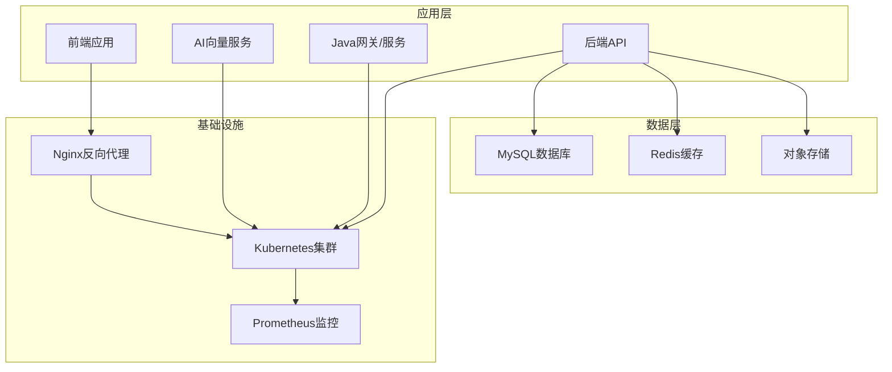
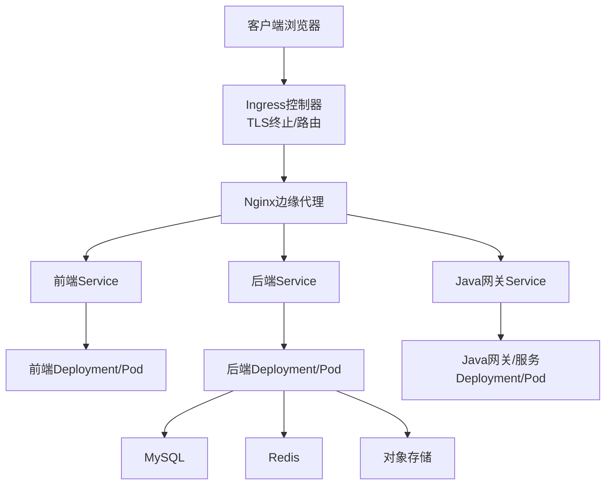
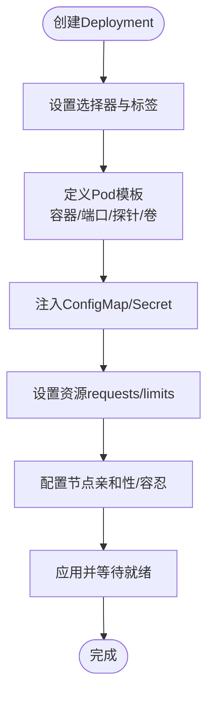
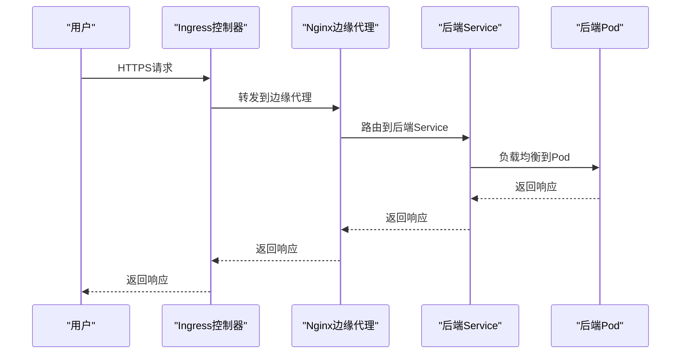
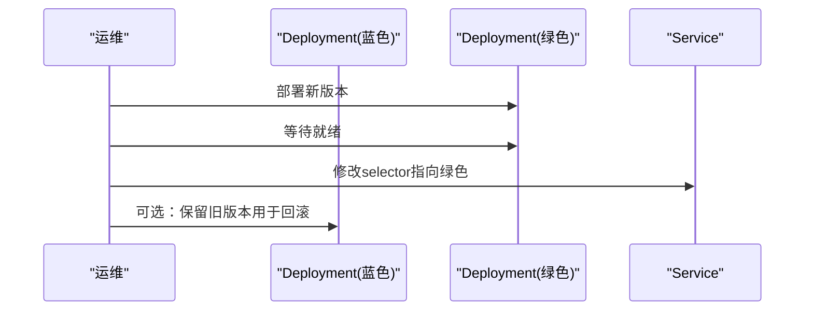
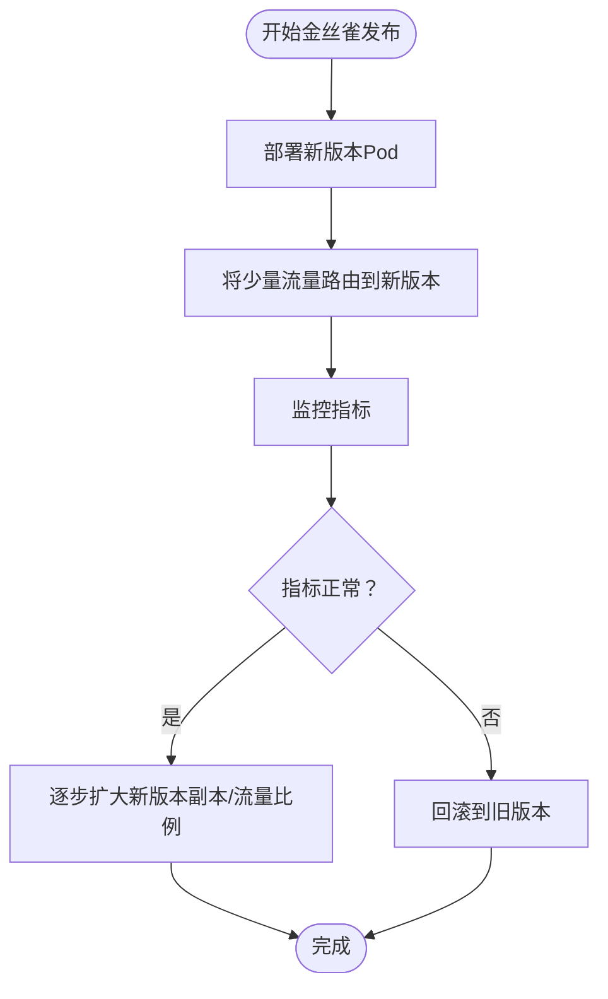
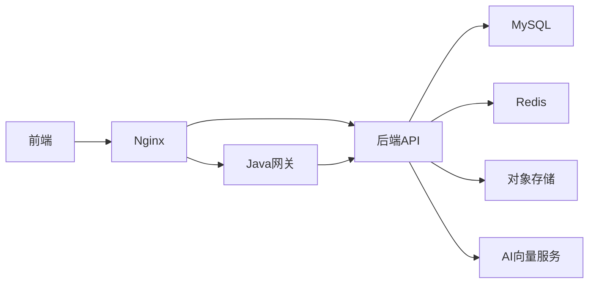

# Kubernetes集群部署

<cite>
**本文引用的文件**
- [backend-deployment.yaml](file://k8s/backend-deployment.yaml)
- [docker-compose.prod.yml](file://docker-compose.prod.yml)
- [docker-compose.prod-simple.yml](file://docker-compose.prod-simple.yml)
- [application-prod.yml](file://java-backend/src/main/resources/application-prod.yml)
- [blue_green_deployment.py](file://scripts/deployment/blue_green_deployment.py)
- [canary_deployment.py](file://scripts/deployment/canary_deployment.py)
- [monitor_deployment.py](file://scripts/deployment/monitor_deployment.py)
- [prometheus.yml](file://prometheus/prometheus.yml)
- [nginx.conf](file://nginx.conf)
- [nginx.prod.conf](file://nginx.prod.conf)
- [Dockerfile](file://backend/Dockerfile)
- [Dockerfile](file://frontend/Dockerfile)
- [Dockerfile](file://java-backend/Dockerfile)
- [prod.sh](file://prod.sh)
- [start_dev_java.bat](file://start_dev_java.bat)
- [README.md](file://README.md)
</cite>

## 目录
1. [简介](#简介)
2. [项目结构](#项目结构)
3. [核心组件](#核心组件)
4. [架构总览](#架构总览)
5. [详细组件分析](#详细组件分析)
6. [依赖关系分析](#依赖关系分析)
7. [性能考虑](#性能考虑)
8. [故障排查指南](#故障排查指南)
9. [结论](#结论)
10. [附录](#附录)

## 简介
本指南面向“思觉智贸系统”的Kubernetes集群部署，覆盖Pod、Deployment、Service、ConfigMap、Secret等核心资源的配置要点；解释命名空间管理、资源限制与节点亲和性；提供Ingress控制器、负载均衡与TLS证书管理的实施建议；阐述滚动更新、蓝绿发布与金丝雀发布的策略；介绍Helm Charts的使用与自定义模板思路；并给出集群监控、日志聚合与故障恢复机制，以及kubectl命令行操作与维护最佳实践。

## 项目结构
系统由后端（Python）、前端（Vue）、Java网关与产品服务、数据库（MySQL）及AI向量服务组成。现有仓库提供了Docker Compose生产环境编排与基础Nginx配置，K8s目录包含后端Deployment示例，脚本目录提供蓝绿与金丝雀部署实现与监控脚本。

**章节来源**
- [docker-compose.prod.yml:1-200](file://docker-compose.prod.yml#L1-L200)
- [docker-compose.prod-simple.yml:1-150](file://docker-compose.prod-simple.yml#L1-L150)
- [nginx.conf:1-200](file://nginx.conf#L1-L200)
- [nginx.prod.conf:1-200](file://nginx.prod.conf#L1-L200)

## 核心组件
- Pod：容器运行的基本单元，承载单个或少量紧密耦合的容器实例。
- Deployment：声明式控制器，用于管理Pod副本与滚动更新。
- Service：为Pod提供稳定的网络访问入口，支持ClusterIP、NodePort、LoadBalancer类型。
- ConfigMap：存放非机密配置数据，如环境变量或配置文件。
- Secret：存放敏感信息，如数据库密码、API密钥等。
- Ingress：暴露HTTP/HTTPS路由，配合Ingress Controller实现外部访问与TLS终止。
- 命名空间：隔离资源，便于多环境（dev/staging/prod）与多团队管理。
- 资源限制：通过requests/limits控制CPU与内存，保障集群稳定性。
- 节点亲和性：通过nodeAffinity、tolerations与污点策略实现调度约束。

**章节来源**
- [backend-deployment.yaml:1-150](file://k8s/backend-deployment.yaml#L1-L150)
- [docker-compose.prod.yml:1-200](file://docker-compose.prod.yml#L1-L200)

## 架构总览
下图展示从客户端到应用、数据库与外部存储的整体路径，以及Ingress与Nginx在边缘层的作用。

**图表来源**
- [backend-deployment.yaml:1-150](file://k8s/backend-deployment.yaml#L1-L150)
- [nginx.conf:1-200](file://nginx.conf#L1-L200)
- [nginx.prod.conf:1-200](file://nginx.prod.conf#L1-L200)

## 详细组件分析

### 命名空间管理
- 建议按环境划分命名空间：default（开发）、staging（预发布）、prod（生产），并在CI/CD中限定kubectl上下文与命名空间。
- 在K8s中通过kubectl create namespace或YAML创建命名空间，并在部署清单中显式指定namespace字段。

**章节来源**
- [backend-deployment.yaml:1-50](file://k8s/backend-deployment.yaml#L1-L50)

### 资源限制与节点亲和性
- 资源限制：为每个容器设置requests与limits，避免资源争用导致级联故障。
- 节点亲和性：对数据库、缓存等关键组件使用nodeAffinity绑定到特定节点；对有GPU需求的AI服务配置taints/tolerations。
- PodDisruptionBudget：为关键服务配置最小可用副本，确保滚动更新期间的服务连续性。

**章节来源**
- [backend-deployment.yaml:1-150](file://k8s/backend-deployment.yaml#L1-L150)
- [docker-compose.prod.yml:1-200](file://docker-compose.prod.yml#L1-L200)

### Pod与Deployment配置
- Deployment应包含：
  - 选择器与模板（labels）
  - 副本数与滚动更新策略（maxUnavailable/maxSurge）
  - Pod模板：容器镜像、端口、环境变量、卷挂载、健康检查探针
- 健康检查：livenessProbe/readinessProbe/exec/httpGet/tcpSocket
- 环境变量与配置：通过ConfigMap注入非敏感配置，通过Secret注入敏感信息。

**图表来源**
- [backend-deployment.yaml:1-150](file://k8s/backend-deployment.yaml#L1-L150)

**章节来源**
- [backend-deployment.yaml:1-150](file://k8s/backend-deployment.yaml#L1-L150)

### Service与Ingress
- Service：
  - ClusterIP：默认，仅集群内部访问
  - NodePort：在所有节点开放端口
  - LoadBalancer：云厂商负载均衡器
- Ingress：
  - 使用Ingress Controller（如Nginx、Traefik、Contour）
  - 配置TLS证书（Secret）与路径转发规则
  - 将域名映射到对应Service

**图表来源**
- [nginx.conf:1-200](file://nginx.conf#L1-L200)
- [nginx.prod.conf:1-200](file://nginx.prod.conf#L1-L200)
- [backend-deployment.yaml:80-150](file://k8s/backend-deployment.yaml#L80-L150)

**章节来源**
- [backend-deployment.yaml:80-150](file://k8s/backend-deployment.yaml#L80-L150)
- [nginx.conf:1-200](file://nginx.conf#L1-L200)
- [nginx.prod.conf:1-200](file://nginx.prod.conf#L1-L200)

### ConfigMap与Secret
- ConfigMap：存放应用配置（如日志级别、功能开关、第三方API地址）
- Secret：存放数据库密码、令牌、证书私钥等敏感数据
- 注入方式：环境变量或挂载为文件

**章节来源**
- [backend-deployment.yaml:1-150](file://k8s/backend-deployment.yaml#L1-L150)
- [docker-compose.prod.yml:1-200](file://docker-compose.prod.yml#L1-L200)

### 滚动更新策略
- Deployment滚动更新参数：
  - maxUnavailable：更新过程中允许不可用副本的最大数量
  - maxSurge：更新过程中允许超出期望副本数的最大数量
- 结合readinessProbe确保新Pod完全就绪后再替换旧Pod，避免流量中断

**章节来源**
- [backend-deployment.yaml:1-150](file://k8s/backend-deployment.yaml#L1-L150)

### 蓝绿部署
- 通过两套相同规模的Deployment与不同标签区分新旧版本
- 通过Service selector切换流量至新版本
- 回滚时只需切换回旧版本标签

**图表来源**
- [blue_green_deployment.py:78-140](file://scripts/deployment/blue_green_deployment.py#L78-L140)

**章节来源**
- [blue_green_deployment.py:74-140](file://scripts/deployment/blue_green_deployment.py#L74-L140)

### 金丝雀发布
- 通过不同副本数或权重将部分流量引入新版本
- 结合监控指标（成功率、延迟、错误率）决定是否扩大流量或回滚

**图表来源**
- [canary_deployment.py:1-200](file://scripts/deployment/canary_deployment.py#L1-L200)

**章节来源**
- [canary_deployment.py:1-200](file://scripts/deployment/canary_deployment.py#L1-L200)

### Helm Charts使用与自定义模板
- 使用Helm管理复杂应用栈，将ConfigMap、Secret、Deployment、Service、Ingress等封装为Chart
- 自定义模板：通过values.yaml传递环境变量与资源限制，使用条件判断与列表渲染实现多环境适配
- 最佳实践：将敏感配置放入Secret，非敏感配置放入ConfigMap；为每个Release设置版本标签与注释

**章节来源**
- [backend-deployment.yaml:1-150](file://k8s/backend-deployment.yaml#L1-L150)

## 依赖关系分析
系统组件间存在明确的依赖链：前端通过Nginx与Ingress访问后端；后端依赖数据库、缓存与对象存储；Java网关负责对外接口聚合；AI服务提供向量化检索能力。

**图表来源**
- [docker-compose.prod.yml:1-200](file://docker-compose.prod.yml#L1-L200)
- [nginx.conf:1-200](file://nginx.conf#L1-L200)

**章节来源**
- [docker-compose.prod.yml:1-200](file://docker-compose.prod.yml#L1-L200)
- [nginx.conf:1-200](file://nginx.conf#L1-L200)

## 性能考虑
- 资源规划：根据历史峰值与P95/P99延迟设定requests/limits，避免过度分配导致资源浪费，或不足导致频繁驱逐。
- 连接池与超时：数据库连接池大小、Redis连接数、HTTP客户端超时需与Service/Ingress超时协调。
- 缓存策略：利用Redis缓存热点数据，减少后端压力；对静态资源启用长缓存与CDN。
- 存储IO：MySQL与AI向量存储使用SSD与合适的IOPS规格；定期清理临时文件与日志。

## 故障排查指南
- 部署状态监控：使用监控脚本查询Deployment与Service状态，确认副本数、就绪状态与端口暴露情况。
- 日志采集：为每个容器配置标准输出日志，结合集中式日志系统（如ELK/Fluentd+Loki）收集与检索。
- 健康检查：确保livenessProbe/readinessProbe配置合理，避免“假阳性”导致误杀或“假阴性”导致流量异常。
- 回滚策略：蓝绿与金丝雀发布均需准备快速回滚方案，确保在异常情况下能迅速恢复。

**章节来源**
- [monitor_deployment.py:75-107](file://scripts/deployment/monitor_deployment.py#L75-L107)

## 结论
通过合理的命名空间隔离、资源限制与节点亲和性配置，结合Ingress与负载均衡，以及滚动更新、蓝绿与金丝雀发布策略，思觉智贸系统可在Kubernetes上实现高可用、可扩展且可控的交付。配合完善的监控与日志体系，能够快速定位问题并进行恢复。

## 附录

### kubectl常用命令
- 应用清单：kubectl apply -f <文件>
- 查看资源：kubectl get pods/services/deployments/ingress -n <命名空间>
- 查看日志：kubectl logs -f <pod名称> -n <命名空间>
- 执行命令：kubectl exec -it <pod名称> -n <命名空间> -- <命令>
- 查看事件：kubectl describe pod <pod名称> -n <命名空间>
- 扩缩容：kubectl scale deployment <名称> --replicas=<数量> -n <命名空间>
- 回滚：kubectl rollout undo deployment/<名称> -n <命名空间>

### 集群维护最佳实践
- 版本升级：先在staging验证，再在prod执行蓝绿或金丝雀发布。
- 配置管理：所有环境统一通过Helm values管理，避免手工修改。
- 安全加固：最小权限原则、只读根文件系统、禁用不必要的Capabilities。
- 备份与演练：定期备份数据库与关键配置，进行故障演练提升恢复速度。