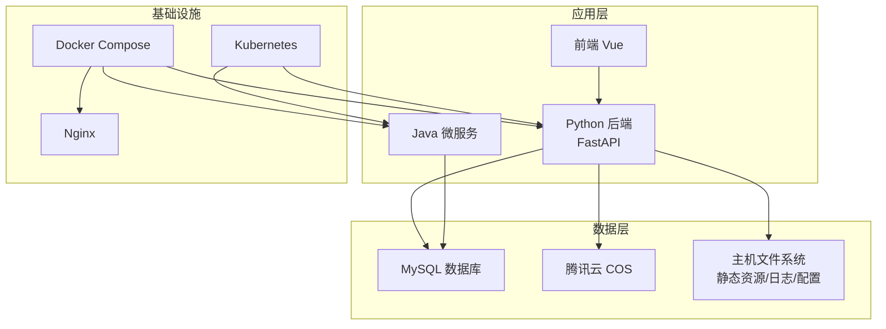
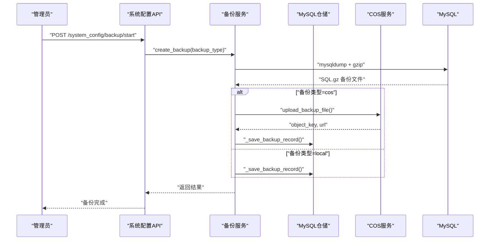
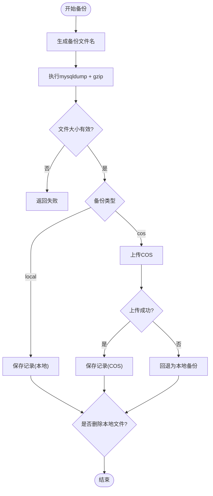
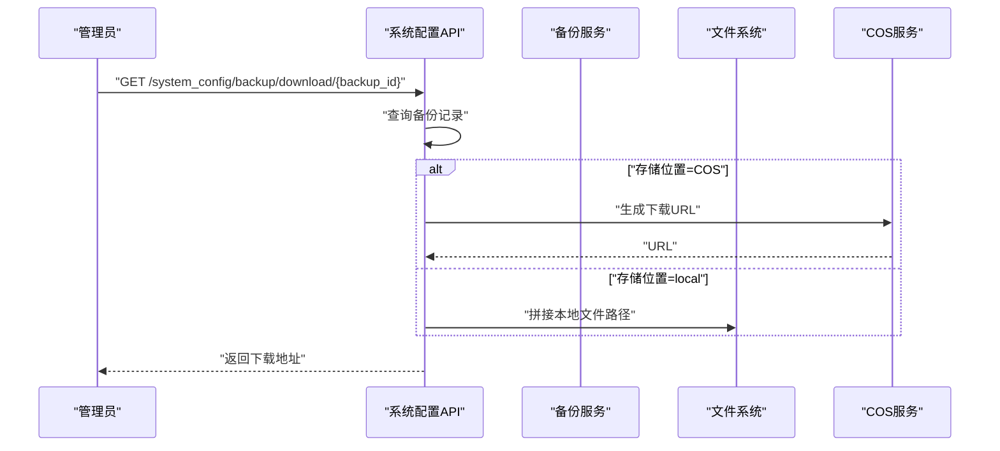
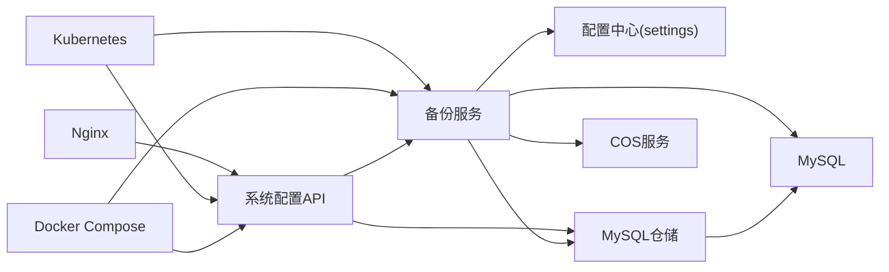

# 备份与恢复

<cite>
**本文引用的文件**
- [backup_service.py](file://backend/app/services/backup_service.py)
- [system_config.py](file://backend/app/api/v1/system_config.py)
- [001_create_backup_records_table.sql](file://backend/migrations/001_create_backup_records_table.sql)
- [cos_service.py](file://backend/app/services/cos_service.py)
- [mysql_repo.py](file://backend/app/repositories/mysql_repo.py)
- [config.py](file://backend/app/config.py)
- [docker-compose.prod.yml](file://docker-compose.prod.yml)
- [docker-compose.prod-simple.yml](file://docker-compose.prod-simple.yml)
- [restore_dev.sh](file://scripts/restore_dev.sh)
- [import_db.sh](file://scripts/import_db.sh)
- [prod.sh](file://prod.sh)
- [init-db.ps1](file://init-db.ps1)
- [init-db.bat](file://init-db.bat)
- [nginx.conf](file://nginx.conf)
- [nginx.prod.conf](file://nginx.prod.conf)
- [Dockerfile](file://backend/Dockerfile)
- [Dockerfile.prod](file://java-backend/Dockerfile.prod)
- [backend-deployment.yaml](file://k8s/backend-deployment.yaml)
- [README.md](file://README.md)
- [生产环境启动计划.md](file://documents/生产环境启动计划.md)
- [生产部署检查清单.md](file://docs/生产部署检查清单.md)
- [Docker生产环境独立部署方案.md](file://docs/架构/Docker生产环境独立部署方案.md)
- [MySQL跨环境数据复制.md](file://docs/docker使用经验/MySQL跨环境数据复制.md)
- [生产环境图片加载失败-COS_BUCKET配置错误.md](file://docs/问题记录/生产环境图片加载失败-COS_BUCKET配置错误.md)
- [生产数据库误删事故.md](file://docs/问题记录/生产数据库误删事故.md)
</cite>

## 目录
1. [引言](#引言)
2. [项目结构](#项目结构)
3. [核心组件](#核心组件)
4. [架构概览](#架构概览)
5. [详细组件分析](#详细组件分析)
6. [依赖关系分析](#依赖关系分析)
7. [性能考虑](#性能考虑)
8. [故障排查指南](#故障排查指南)
9. [结论](#结论)
10. [附录](#附录)

## 引言
本文件为“思觉智贸系统”制定全面的备份与恢复策略文档，覆盖数据库备份（全量/增量/实时）、文件系统备份（静态资源/日志/配置）、备份数据的加密、压缩与归档管理、自动化备份任务与调度策略、数据恢复流程（点-in-time/部分恢复）、灾难恢复计划（RTO/RPO）、备份验证与恢复测试、故障演练方法，以及备份存储容量规划与成本优化策略。本文所有技术方案均基于仓库现有实现与文档进行提炼与扩展。

## 项目结构
系统采用多语言混合架构：后端主服务为 Python（FastAPI），配合 Java 微服务网关与业务模块；数据库为 MySQL；前端为 Vue；容器化部署通过 Docker Compose 和 Kubernetes；对象存储使用腾讯云 COS。备份能力由 Python 后端的备份服务实现，并通过 API 对外提供备份与恢复能力。

图示来源
- [docker-compose.prod.yml](file://docker-compose.prod.yml)
- [backend-deployment.yaml](file://k8s/backend-deployment.yaml)
- [nginx.conf](file://nginx.conf)
- [nginx.prod.conf](file://nginx.prod.conf)

章节来源
- [docker-compose.prod.yml](file://docker-compose.prod.yml)
- [backend-deployment.yaml](file://k8s/backend-deployment.yaml)
- [nginx.conf](file://nginx.conf)
- [nginx.prod.conf](file://nginx.prod.conf)

## 核心组件
- 备份服务：负责数据库全量备份、本地与云端（COS）存储、备份记录持久化、备份文件清理等。
- 备份 API：提供启动备份、查询备份记录、下载备份、删除备份等接口。
- 对象存储服务：封装腾讯云 COS 的上传与访问能力。
- 数据库迁移：包含备份记录表的建表脚本，用于持久化备份元数据。
- 配置中心：集中管理备份目录、数据库连接参数、COS 配置、是否删除本地备份等开关。
- 运维脚本：提供数据库导入/恢复脚本、生产启动脚本、初始化脚本等。

章节来源
- [backup_service.py](file://backend/app/services/backup_service.py)
- [system_config.py](file://backend/app/api/v1/system_config.py)
- [cos_service.py](file://backend/app/services/cos_service.py)
- [001_create_backup_records_table.sql](file://backend/migrations/001_create_backup_records_table.sql)
- [config.py](file://backend/app/config.py)
- [import_db.sh](file://scripts/import_db.sh)
- [restore_dev.sh](file://scripts/restore_dev.sh)
- [prod.sh](file://prod.sh)
- [init-db.ps1](file://init-db.ps1)
- [init-db.bat](file://init-db.bat)

## 架构概览
备份与恢复的整体架构围绕“备份服务 + API + 存储（本地/COS）+ 记录表”的闭环展开。备份服务通过 mysqldump 生成 SQL 文件并进行 gzip 压缩，随后根据配置决定上传至 COS 或仅保留本地文件。备份记录被持久化到 backup_records 表中，便于查询与管理。

图示来源
- [system_config.py](file://backend/app/api/v1/system_config.py)
- [backup_service.py](file://backend/app/services/backup_service.py)
- [cos_service.py](file://backend/app/services/cos_service.py)
- [mysql_repo.py](file://backend/app/repositories/mysql_repo.py)

## 详细组件分析

### 备份服务（BackupService）
- 功能职责
  - 全量数据库备份：调用 mysqldump 生成 SQL 文件并 gzip 压缩。
  - 本地与云端备份：支持本地存储与腾讯云 COS 上传；上传失败时自动回退到本地。
  - 备份记录管理：将备份名称、大小、类型、状态、存储位置、创建时间等写入 backup_records 表。
  - 本地文件清理：可按配置在上传成功后删除本地备份文件，节省空间。
- 关键流程
  - 生成带时间戳的备份文件名，执行备份命令，校验文件大小。
  - 判断备份类型，若为 COS，则调用 COS 服务上传；上传成功则可选择删除本地文件。
  - 将备份记录持久化到数据库。
- 错误处理
  - 备份失败返回错误信息。
  - COS 上传失败时记录错误并回退为本地备份。
  - COS 未启用时自动降级为本地备份。

图示来源
- [backup_service.py](file://backend/app/services/backup_service.py)

章节来源
- [backup_service.py](file://backend/app/services/backup_service.py)

### 备份 API（系统配置接口）
- 接口能力
  - 启动备份：支持本地与 COS 两种类型。
  - 查询备份记录：分页查询备份列表。
  - 下载备份：支持从 COS 下载或从本地目录下载。
  - 删除备份：删除指定备份记录及对应文件。
- 设计要点
  - 通过 Path/Body 参数接收备份类型与 ID。
  - 调用备份服务执行具体操作。
  - 对 COS 类型的备份，提供预签名 URL 或本地文件路径。

图示来源
- [system_config.py](file://backend/app/api/v1/system_config.py)

章节来源
- [system_config.py](file://backend/app/api/v1/system_config.py)

### 对象存储服务（COS）
- 能力概述
  - 上传备份文件至腾讯云 COS。
  - 返回对象键与可访问 URL。
  - 提供启用状态判断，用于降级逻辑。
- 使用场景
  - 在备份服务中作为云端存储后端。
  - 支持跨地域容灾与长期归档。

章节来源
- [cos_service.py](file://backend/app/services/cos_service.py)

### 数据库迁移（备份记录表）
- 表结构
  - 包含备份名称、类型、大小、状态、存储位置、创建时间、COS 对象键与 URL 等字段。
- 作用
  - 为备份服务提供持久化记录，支撑查询、下载、删除等管理操作。

章节来源
- [001_create_backup_records_table.sql](file://backend/migrations/001_create_backup_records_table.sql)

### 配置中心（settings）
- 关键配置项
  - 备份目录 BACKUP_DIR
  - 数据库连接参数（主机、端口、用户、密码、库名）
  - COS 上传开关与删除本地文件开关
- 影响范围
  - 决定备份文件存放位置、是否上传云端、是否清理本地文件。

章节来源
- [config.py](file://backend/app/config.py)

### 文件系统备份策略
- 静态资源
  - 前端构建产物位于前端工程 public 目录，建议定期打包并归档至对象存储或专用备份盘。
  - 可结合 CI/CD 在发布后自动上传至 COS 并打版本标签。
- 日志文件
  - 应用日志与 Nginx 访问日志建议集中收集并压缩归档，保留周期依据合规要求设定。
  - 可使用 rsync/s3cmd 等工具定期同步至远端存储。
- 配置文件
  - Docker Compose、Nginx、Kubernetes 配置文件应纳入版本管理与异地备份。
  - 关键密钥与敏感配置需加密存储，避免明文泄露。

章节来源
- [nginx.conf](file://nginx.conf)
- [nginx.prod.conf](file://nginx.prod.conf)
- [docker-compose.prod.yml](file://docker-compose.prod.yml)
- [docker-compose.prod-simple.yml](file://docker-compose.prod-simple.yml)
- [backend-deployment.yaml](file://k8s/backend-deployment.yaml)

### 备份数据的加密、压缩与归档
- 加密
  - 传输加密：使用 HTTPS/TLS 保护 API 与 COS 上传通道。
  - 静态加密：对备份文件进行加密后再上传对象存储。
- 压缩
  - 备份服务已使用 gzip 压缩 SQL 文件；建议对静态资源与日志也进行压缩归档。
- 归档
  - 采用分层归档策略：近期热数据本地/近线存储，历史数据迁移到低频/归档存储。
  - 对象存储生命周期策略：设置不同阶段的转储与删除规则。

章节来源
- [backup_service.py](file://backend/app/services/backup_service.py)
- [cos_service.py](file://backend/app/services/cos_service.py)

### 自动化备份任务与调度策略
- 调度方式
  - 容器内定时任务：在后端容器中使用 cron 定时触发备份服务 API。
  - 外部调度器：使用 Kubernetes CronJob 或外部调度平台（如 Airflow）统一编排。
- 策略建议
  - 全量备份：每日一次（业务低峰期）。
  - 增量/实时备份：当前代码未实现增量/二进制日志实时备份，建议引入 MySQL binlog + 统一日志采集方案（如 Percona XtraBackup + LVM 快照或 MySQL Shell + MySQL Router）。
  - 备份窗口：避开业务高峰期，确保不影响在线服务。
  - 失败重试与告警：失败自动重试 N 次并发送通知。

章节来源
- [system_config.py](file://backend/app/api/v1/system_config.py)
- [backup_service.py](file://backend/app/services/backup_service.py)

### 数据恢复流程
- 全量恢复
  - 从备份记录选择目标备份，下载至本地或直接从 COS 下载。
  - 使用数据库导入脚本执行恢复（参考仓库提供的导入脚本）。
- 点-in-time 恢复（建议）
  - 当前代码未实现 binlog 实时备份，建议后续引入 MySQL binlog 持久化与回放机制，实现更细粒度的恢复。
- 部分数据恢复
  - 通过 SQL 文件筛选与条件导出，仅恢复特定表或时间段的数据。
- 回滚与验证
  - 恢复后进行数据一致性校验与关键业务功能验证。

章节来源
- [import_db.sh](file://scripts/import_db.sh)
- [restore_dev.sh](file://scripts/restore_dev.sh)
- [system_config.py](file://backend/app/api/v1/system_config.py)

### 灾难恢复计划（RTO/RPO）
- RTO（恢复时间目标）
  - 本地备份：RTO 低，适合快速恢复。
  - 云端备份：跨区域容灾，RTO 取决于网络与对象存储可用性。
- RPO（恢复点目标）
  - 全量+增量/实时备份组合可将 RPO 控制在分钟级。
  - 当前实现为全量备份，建议引入增量/实时备份以降低 RPO。
- 地域与副本
  - 在不同可用区/地域部署副本，实现跨区域容灾。

章节来源
- [cos_service.py](file://backend/app/services/cos_service.py)
- [MySQL跨环境数据复制.md](file://docs/docker使用经验/MySQL跨环境数据复制.md)

### 备份验证、恢复测试与故障演练
- 备份验证
  - 校验备份文件完整性（解压/解析 SQL 文件）。
  - 校验备份记录表中的元数据与实际文件一致。
- 恢复测试
  - 在隔离环境中执行完整恢复流程，验证业务可用性。
- 故障演练
  - 定期进行“模拟故障-恢复-验证”演练，覆盖数据库、对象存储、文件系统等场景。

章节来源
- [backup_service.py](file://backend/app/services/backup_service.py)
- [system_config.py](file://backend/app/api/v1/system_config.py)

### 备份存储容量规划与成本优化
- 容量估算
  - 基于数据库增长趋势与备份频率，计算月度/年度存储需求。
  - 考虑压缩比与去重策略，合理评估实际占用。
- 成本优化
  - 分层存储：热数据本地/近线，冷数据归档/低频存储。
  - 生命周期策略：自动转低频与删除过期备份。
  - 批量上传与断点续传：减少带宽与时间成本。

章节来源
- [cos_service.py](file://backend/app/services/cos_service.py)
- [backup_service.py](file://backend/app/services/backup_service.py)

## 依赖关系分析
- 组件耦合
  - 备份服务依赖配置中心、MySQL 仓储、COS 服务。
  - 备份 API 依赖备份服务与 MySQL 仓储。
  - 备份记录表为备份服务与 API 的共享契约。
- 外部依赖
  - Docker Compose/Kubernetes 用于部署与扩缩容。
  - Nginx 用于反向代理与静态资源服务。
  - 腾讯云 COS 用于对象存储与跨区域容灾。

图示来源
- [system_config.py](file://backend/app/api/v1/system_config.py)
- [backup_service.py](file://backend/app/services/backup_service.py)
- [cos_service.py](file://backend/app/services/cos_service.py)
- [mysql_repo.py](file://backend/app/repositories/mysql_repo.py)
- [docker-compose.prod.yml](file://docker-compose.prod.yml)
- [backend-deployment.yaml](file://k8s/backend-deployment.yaml)
- [nginx.conf](file://nginx.conf)

章节来源
- [system_config.py](file://backend/app/api/v1/system_config.py)
- [backup_service.py](file://backend/app/services/backup_service.py)
- [cos_service.py](file://backend/app/services/cos_service.py)
- [mysql_repo.py](file://backend/app/repositories/mysql_repo.py)
- [docker-compose.prod.yml](file://docker-compose.prod.yml)
- [backend-deployment.yaml](file://k8s/backend-deployment.yaml)
- [nginx.conf](file://nginx.conf)

## 性能考虑
- 备份窗口与资源占用
  - 全量备份应在业务低峰期执行，避免影响在线服务。
  - 压缩与上传过程会消耗 CPU、IO 与网络带宽，建议限速与队列化。
- 并发与可靠性
  - 多实例部署时，确保备份任务互斥执行，避免重复备份。
  - 上传失败自动重试与断点续传，提升成功率。
- 存储性能
  - 本地备份优先使用高性能磁盘；云端备份选择就近可用区与高吞吐线路。

## 故障排查指南
- 备份失败
  - 检查数据库连接参数与权限。
  - 查看备份服务日志与错误返回。
  - 确认备份目录权限与磁盘空间。
- COS 上传失败
  - 检查 COS 服务启用状态与凭证配置。
  - 核对对象键与 URL 生成逻辑。
- 备份记录异常
  - 校验 backup_records 表字段与备份服务记录写入逻辑。
- 生产事故参考
  - 参考“生产数据库误删事故”文档，完善备份策略与权限控制。

章节来源
- [backup_service.py](file://backend/app/services/backup_service.py)
- [system_config.py](file://backend/app/api/v1/system_config.py)
- [生产数据库误删事故.md](file://docs/问题记录/生产数据库误删事故.md)

## 结论
本策略以现有备份服务为基础，结合对象存储与运维脚本，形成“全量备份 + 云端归档 + 记录管理 + API 管理”的闭环。建议尽快引入增量/实时备份能力，完善点-in-time 恢复与灾难演练体系，持续优化存储成本与恢复效率，确保系统在各类故障下具备高可靠与可恢复能力。

## 附录
- 参考文档与脚本
  - 生产部署与启动：参阅生产环境启动计划与部署检查清单。
  - 数据库导入/恢复：参考导入与恢复脚本。
  - 容器化部署：参考 Docker 与 Kubernetes 配置文件。
  - 环境经验：参考跨环境数据复制与问题记录文档。

章节来源
- [README.md](file://README.md)
- [生产环境启动计划.md](file://documents/生产环境启动计划.md)
- [生产部署检查清单.md](file://docs/生产部署检查清单.md)
- [Docker生产环境独立部署方案.md](file://docs/架构/Docker生产环境独立部署方案.md)
- [MySQL跨环境数据复制.md](file://docs/docker使用经验/MySQL跨环境数据复制.md)
- [import_db.sh](file://scripts/import_db.sh)
- [restore_dev.sh](file://scripts/restore_dev.sh)
- [docker-compose.prod.yml](file://docker-compose.prod.yml)
- [backend-deployment.yaml](file://k8s/backend-deployment.yaml)
- [Dockerfile](file://backend/Dockerfile)
- [Dockerfile.prod](file://java-backend/Dockerfile.prod)