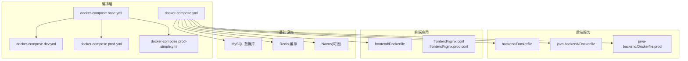
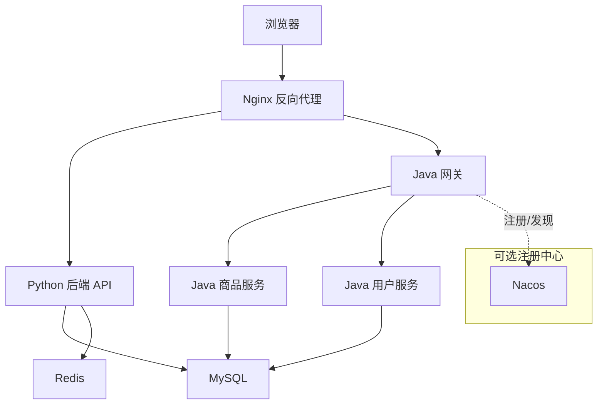
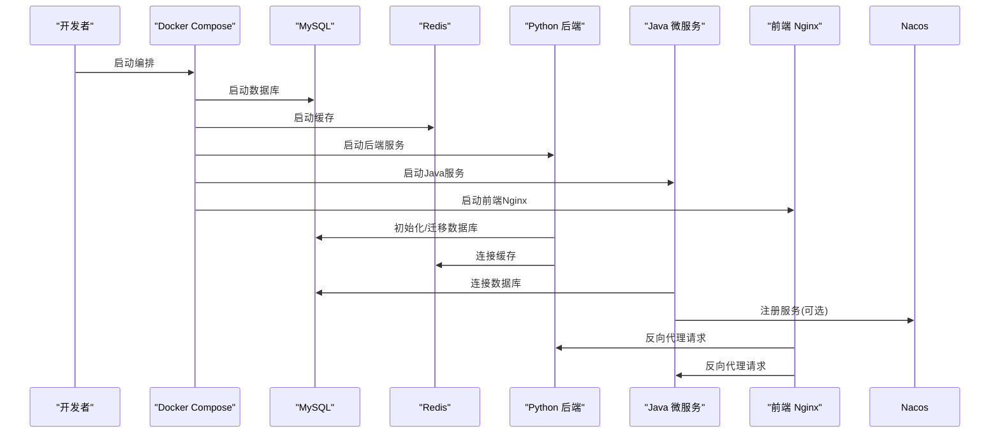

# 容器化部署

<cite>
**本文引用的文件**
- [docker-compose.yml](file://docker-compose.yml)
- [docker-compose.base.yml](file://docker-compose.base.yml)
- [docker-compose.dev.yml](file://docker-compose.dev.yml)
- [docker-compose.prod.yml](file://docker-compose.prod.yml)
- [docker-compose.prod-simple.yml](file://docker-compose.prod-simple.yml)
- [backend/Dockerfile](file://backend/Dockerfile)
- [backend/Dockerfile.dev](file://backend/Dockerfile.dev)
- [backend/Dockerfile.base](file://backend/Dockerfile.base)
- [frontend/Dockerfile](file://frontend/Dockerfile)
- [java-backend/Dockerfile](file://java-backend/Dockerfile)
- [java-backend/Dockerfile.prod](file://java-backend/Dockerfile.prod)
- [java-backend/jvm-config/jvm-options.env](file://java-backend/jvm-config/jvm-options.env)
- [mysql/init/01-init.sql](file://mysql/init/01-init.sql)
- [DOCKE_DEPLOY.md](file://DOCKE_DEPLOY.md)
- [docs/架构/Docker生产环境独立部署方案.md](file://docs/架构/Docker生产环境独立部署方案.md)
- [docs/docker使用经验/README.md](file://docs/docker使用经验/README.md)
- [docs/docker使用经验/MySQL跨环境数据复制.md](file://docs/docker使用经验/MySQL跨环境数据复制.md)
- [docs/项目逻辑/Docker部署踩坑总结.md](file://docs/项目逻辑/Docker部署踩坑总结.md)
- [docs/生产部署检查清单.md](file://docs/生产部署检查清单.md)
- [scripts/startup/start_prod_multiprocess.py](file://scripts/startup/start_prod_multiprocess.py)
- [backend/main.py](file://backend/main.py)
- [backend/config.py](file://backend/config.py)
- [frontend/nginx.conf](file://frontend/nginx.conf)
- [frontend/nginx.prod.conf](file://frontend/nginx.prod.conf)
- [java-backend/src/main/resources/application.yml](file://java-backend/src/main/resources/application.yml)
- [java-backend/src/main/resources/application-prod.yml](file://java-backend/src/main/resources/application-prod.yml)
</cite>

## 目录
1. [简介](#简介)
2. [项目结构](#项目结构)
3. [核心组件](#核心组件)
4. [架构总览](#架构总览)
5. [详细组件分析](#详细组件分析)
6. [依赖关系分析](#依赖关系分析)
7. [性能考虑](#性能考虑)
8. [故障排查指南](#故障排查指南)
9. [结论](#结论)
10. [附录](#附录)

## 简介
本文件面向思觉智贸系统的容器化部署，围绕Docker Compose编排配置进行深入说明，覆盖MySQL、Redis、后端服务（Python FastAPI）、前端应用（Vue）以及Java微服务（Spring Boot Gateway/Product/User）等容器配置。文档同时阐述开发与生产环境的差异化配置文件使用方式，明确容器健康检查、数据卷挂载、网络配置与环境变量设置，并提供从初始化数据库、构建镜像到启动服务的完整部署步骤。最后给出容器间依赖关系与服务发现机制的解释，以及常见部署问题的排查与解决方案。

## 项目结构
该仓库采用多模块并行的容器化架构：后端Python服务、前端Vue应用、Java微服务（网关与业务模块）、MySQL数据库与Redis缓存。Docker Compose通过多个YAML文件实现环境隔离与灵活编排，配合各模块的Dockerfile完成镜像构建。

图表来源
- [docker-compose.yml](file://docker-compose.yml)
- [docker-compose.base.yml](file://docker-compose.base.yml)
- [docker-compose.dev.yml](file://docker-compose.dev.yml)
- [docker-compose.prod.yml](file://docker-compose.prod.yml)
- [docker-compose.prod-simple.yml](file://docker-compose.prod-simple.yml)
- [backend/Dockerfile](file://backend/Dockerfile)
- [frontend/Dockerfile](file://frontend/Dockerfile)
- [java-backend/Dockerfile](file://java-backend/Dockerfile)
- [java-backend/Dockerfile.prod](file://java-backend/Dockerfile.prod)

章节来源
- [docker-compose.yml](file://docker-compose.yml)
- [docker-compose.base.yml](file://docker-compose.base.yml)
- [docker-compose.dev.yml](file://docker-compose.dev.yml)
- [docker-compose.prod.yml](file://docker-compose.prod.yml)
- [docker-compose.prod-simple.yml](file://docker-compose.prod-simple.yml)

## 核心组件
- MySQL：持久化存储，提供初始化SQL脚本，支持开发与生产环境的数据准备。
- Redis：缓存与会话存储，支撑后端与Java服务的高并发访问。
- Python后端服务：基于FastAPI，提供REST API与任务队列（Celery），容器内以多进程方式启动。
- 前端应用：Vue应用，通过Nginx对外提供静态资源服务，区分开发与生产配置。
- Java微服务：Spring Boot应用（网关与业务模块），支持独立镜像构建与JVM参数配置。

章节来源
- [backend/main.py](file://backend/main.py)
- [backend/config.py](file://backend/config.py)
- [frontend/nginx.conf](file://frontend/nginx.conf)
- [frontend/nginx.prod.conf](file://frontend/nginx.prod.conf)
- [java-backend/src/main/resources/application.yml](file://java-backend/src/main/resources/application.yml)
- [java-backend/src/main/resources/application-prod.yml](file://java-backend/src/main/resources/application-prod.yml)

## 架构总览
下图展示容器间的交互关系与数据流向：前端通过Nginx反向代理访问后端API；后端服务连接MySQL与Redis；Java微服务通过网关统一接入，必要时与Nacos进行注册发现（可选）。

图表来源
- [docker-compose.yml](file://docker-compose.yml)
- [backend/main.py](file://backend/main.py)
- [java-backend/src/main/resources/application.yml](file://java-backend/src/main/resources/application.yml)

## 详细组件分析

### MySQL 容器配置
- 数据卷挂载：将初始化SQL脚本挂载至容器初始化路径，确保首次启动自动执行建库建表与基础数据插入。
- 环境变量：通过环境变量设置数据库根密码、默认字符集与时区，避免硬编码在脚本中。
- 健康检查：使用内置健康检查探针，检测端口可达性与数据库可用性。
- 网络：默认桥接网络，容器间通过服务名相互访问。

章节来源
- [mysql/init/01-init.sql](file://mysql/init/01-init.sql)
- [docker-compose.yml](file://docker-compose.yml)

### Redis 容器配置
- 数据卷挂载：持久化Redis数据目录，防止容器重建导致数据丢失。
- 环境变量：可通过环境变量调整内存上限、密码保护等策略。
- 健康检查：通过TCP端口探测确认服务状态。
- 网络：与后端服务同网段，便于低延迟访问。

章节来源
- [docker-compose.yml](file://docker-compose.yml)

### Python 后端服务（FastAPI）
- 镜像构建：使用多阶段构建，基础镜像复用，开发镜像启用热重载与调试工具。
- 启动方式：容器内以多进程方式启动主服务与任务队列，满足并发与异步需求。
- 健康检查：提供健康检查接口，供Compose探活。
- 环境变量：数据库连接、Redis连接、日志级别、CORS等通过环境变量注入。
- 网络：与MySQL、Redis在同一网络，服务名作为主机名解析。

章节来源
- [backend/Dockerfile](file://backend/Dockerfile)
- [backend/Dockerfile.dev](file://backend/Dockerfile.dev)
- [backend/Dockerfile.base](file://backend/Dockerfile.base)
- [backend/main.py](file://backend/main.py)
- [backend/config.py](file://backend/config.py)
- [scripts/startup/start_prod_multiprocess.py](file://scripts/startup/start_prod_multiprocess.py)

### 前端应用（Vue + Nginx）
- 镜像构建：基于Nginx官方镜像，构建完成后仅保留dist静态资源。
- 配置文件：开发与生产分别使用不同Nginx配置，生产配置包含缓存、Gzip与安全头。
- 端口映射：对外暴露HTTP端口，反向代理后端API。
- 环境变量：通过构建参数或运行时注入API地址等前端配置。

章节来源
- [frontend/Dockerfile](file://frontend/Dockerfile)
- [frontend/nginx.conf](file://frontend/nginx.conf)
- [frontend/nginx.prod.conf](file://frontend/nginx.prod.conf)

### Java 微服务（Spring Boot 网关与业务模块）
- 镜像构建：提供标准与生产两种Dockerfile，生产镜像优化体积与启动性能。
- JVM 参数：通过环境变量或外部挂载文件注入JVM选项，控制堆大小与GC策略。
- 配置文件：application.yml与application-prod.yml区分开发与生产环境的数据库、注册中心与日志配置。
- 服务发现：可选集成Nacos，实现服务注册与动态路由。

章节来源
- [java-backend/Dockerfile](file://java-backend/Dockerfile)
- [java-backend/Dockerfile.prod](file://java-backend/Dockerfile.prod)
- [java-backend/jvm-config/jvm-options.env](file://java-backend/jvm-config/jvm-options.env)
- [java-backend/src/main/resources/application.yml](file://java-backend/src/main/resources/application.yml)
- [java-backend/src/main/resources/application-prod.yml](file://java-backend/src/main/resources/application-prod.yml)

### Compose 编排文件与环境差异
- docker-compose.yml：核心编排入口，定义所有服务与默认网络、卷。
- docker-compose.base.yml：公共配置抽取，如网络、卷、环境变量模板。
- docker-compose.dev.yml：开发环境叠加，启用热重载、调试端口映射与开发专用卷。
- docker-compose.prod.yml：生产环境叠加，启用健康检查、资源限制与只读文件系统。
- docker-compose.prod-simple.yml：简化版生产编排，适合单机部署或演示环境。

章节来源
- [docker-compose.yml](file://docker-compose.yml)
- [docker-compose.base.yml](file://docker-compose.base.yml)
- [docker-compose.dev.yml](file://docker-compose.dev.yml)
- [docker-compose.prod.yml](file://docker-compose.prod.yml)
- [docker-compose.prod-simple.yml](file://docker-compose.prod-simple.yml)

## 依赖关系分析
- 服务启动顺序：MySQL与Redis先于后端与Java服务启动，后端再启动前端Nginx。
- 服务发现：容器间通过服务名（compose服务名称）互相访问，无需硬编码IP。
- 数据依赖：后端与Java服务均依赖MySQL与Redis；前端通过Nginx代理访问后端API。
- 可选依赖：Java微服务可选集成Nacos进行注册发现。

图表来源
- [docker-compose.yml](file://docker-compose.yml)
- [backend/main.py](file://backend/main.py)
- [java-backend/src/main/resources/application.yml](file://java-backend/src/main/resources/application.yml)

## 性能考虑
- 资源限制：生产环境建议对后端与Java服务设置CPU/内存限制，避免资源争抢。
- 缓存策略：Redis持久化与淘汰策略需根据业务峰值调优；Nginx开启Gzip与静态缓存。
- 并发模型：后端采用多进程启动，合理设置进程数；Java服务根据负载选择合适的线程池与连接池。
- 存储IO：MySQL与Redis数据卷使用高性能磁盘；避免频繁重启导致的缓存失效。

## 故障排查指南
- 数据库未初始化
  - 症状：后端启动报数据库连接异常或表不存在。
  - 排查：确认初始化SQL已挂载且权限正确；查看容器日志中是否执行了初始化脚本。
  - 解决：重新构建镜像或修复挂载路径，确保脚本可执行。
  
  章节来源
  - [mysql/init/01-init.sql](file://mysql/init/01-init.sql)
  - [docker-compose.yml](file://docker-compose.yml)

- 健康检查失败
  - 症状：容器反复重启或被标记为不健康。
  - 排查：检查健康检查探针配置与端口；查看服务内部健康接口返回。
  - 解决：修正探针路径与超时参数；确保服务监听正确的端口与协议。

  章节来源
  - [docker-compose.yml](file://docker-compose.yml)
  - [backend/main.py](file://backend/main.py)

- 前端无法访问后端API
  - 症状：页面白屏或接口404。
  - 排查：确认Nginx反向代理配置；核对后端服务名与端口；检查CORS与跨域设置。
  - 解决：修正Nginx配置与后端环境变量；确保服务间网络互通。

  章节来源
  - [frontend/nginx.conf](file://frontend/nginx.conf)
  - [frontend/nginx.prod.conf](file://frontend/nginx.prod.conf)
  - [backend/config.py](file://backend/config.py)

- Java服务启动慢或OOM
  - 症状：启动卡顿或频繁GC/崩溃。
  - 排查：检查JVM参数与堆大小；核对容器资源限制。
  - 解决：调整jvm-options.env中的参数；提升容器内存限制。

  章节来源
  - [java-backend/jvm-config/jvm-options.env](file://java-backend/jvm-config/jvm-options.env)
  - [java-backend/Dockerfile.prod](file://java-backend/Dockerfile.prod)

- 生产部署检查清单
  - 建议按清单逐项核对：镜像版本、环境变量、健康检查、数据卷、网络与防火墙、备份策略与监控告警。

  章节来源
  - [docs/生产部署检查清单.md](file://docs/生产部署检查清单.md)

## 结论
通过分层的Docker Compose编排与多阶段Dockerfile构建，思觉智贸系统实现了开发与生产的清晰分离。MySQL与Redis提供稳定的数据基础设施，Python后端与Java微服务分别承担业务逻辑与网关聚合，前端通过Nginx统一对外提供服务。遵循本文档的部署步骤与最佳实践，可显著降低部署复杂度与运维风险。

## 附录

### 部署步骤（含初始化数据库、构建镜像与启动服务）
- 准备工作
  - 确认Docker与Docker Compose已安装并可用。
  - 准备环境变量文件与密钥（如数据库密码、Redis密码、JWT密钥等）。
- 初始化数据库
  - 将初始化SQL脚本挂载至MySQL容器的初始化路径，确保首次启动自动执行。
- 构建镜像
  - 后端：使用后端目录下的Dockerfile构建镜像。
  - 前端：使用前端目录下的Dockerfile构建Nginx镜像。
  - Java：使用Java后端目录下的Dockerfile或Dockerfile.prod构建镜像。
- 启动服务
  - 开发环境：使用开发编排文件启动，启用热重载与调试端口。
  - 生产环境：使用生产编排文件启动，启用健康检查与资源限制。
- 访问验证
  - 打开浏览器访问前端服务，确认页面加载正常；调用后端健康接口与Java网关接口，确认服务可用。

章节来源
- [mysql/init/01-init.sql](file://mysql/init/01-init.sql)
- [backend/Dockerfile](file://backend/Dockerfile)
- [frontend/Dockerfile](file://frontend/Dockerfile)
- [java-backend/Dockerfile](file://java-backend/Dockerfile)
- [docker-compose.dev.yml](file://docker-compose.dev.yml)
- [docker-compose.prod.yml](file://docker-compose.prod.yml)

### 环境变量与配置要点
- 数据库连接：主机名使用Compose服务名，端口与凭据通过环境变量注入。
- 缓存连接：Redis连接字符串与密码通过环境变量配置。
- 日志与监控：日志级别、采样率与监控地址通过环境变量控制。
- CORS与反向代理：前端Nginx的CORS与后端API的跨域策略需保持一致。

章节来源
- [backend/config.py](file://backend/config.py)
- [java-backend/src/main/resources/application.yml](file://java-backend/src/main/resources/application.yml)
- [frontend/nginx.conf](file://frontend/nginx.conf)

### 常见问题与解决方案速查
- 数据库初始化失败：检查SQL脚本路径与权限，确认容器内执行用户具备权限。
- 健康检查失败：核对探针路径与超时，确保服务监听端口与协议正确。
- 前端跨域问题：统一前后端CORS策略，确保Origin与Header匹配。
- Java内存不足：调整JVM参数与容器内存限制，避免频繁Full GC。

章节来源
- [docs/项目逻辑/Docker部署踩坑总结.md](file://docs/项目逻辑/Docker部署踩坑总结.md)
- [docs/docker使用经验/MySQL跨环境数据复制.md](file://docs/docker使用经验/MySQL跨环境数据复制.md)
- [docs/docker使用经验/README.md](file://docs/docker使用经验/README.md)