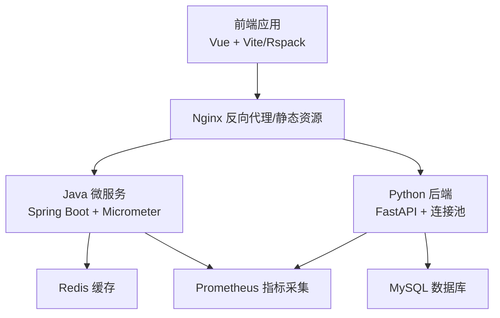
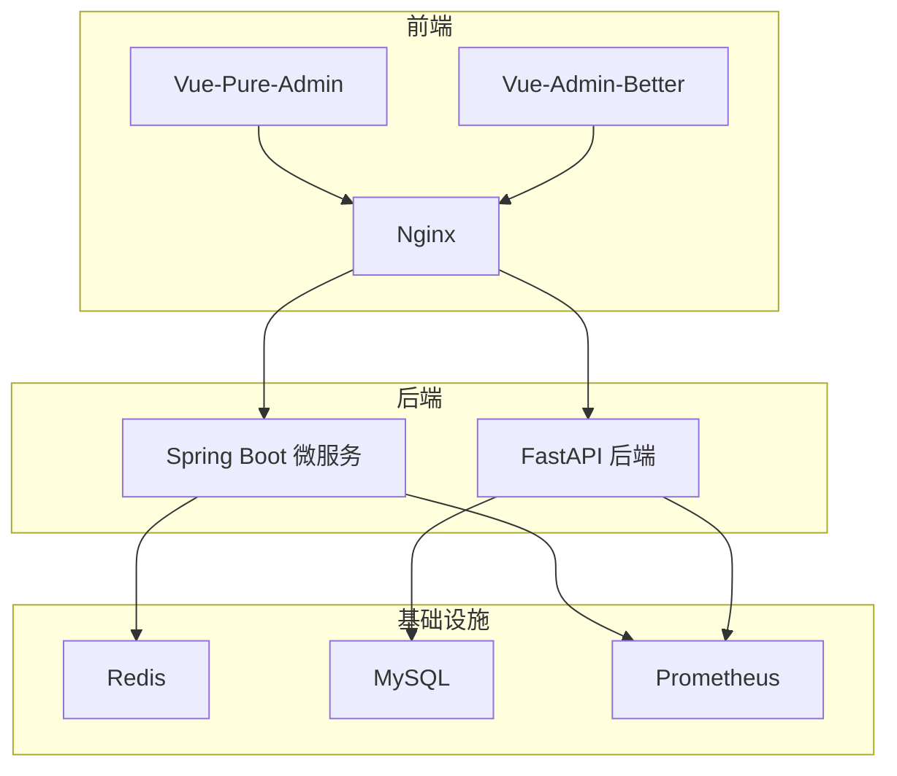
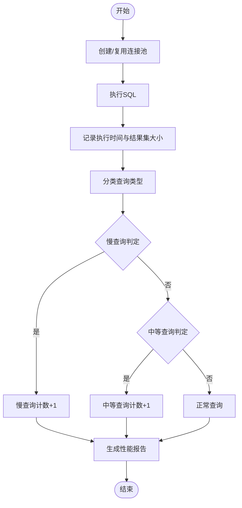
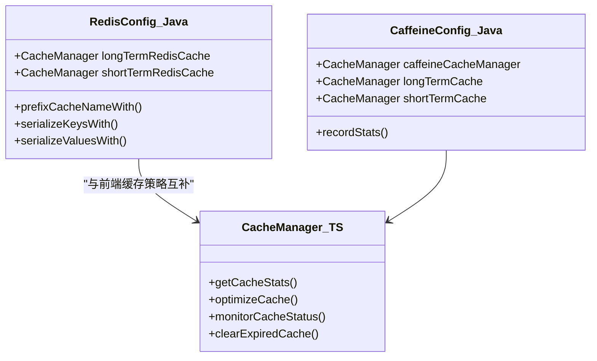
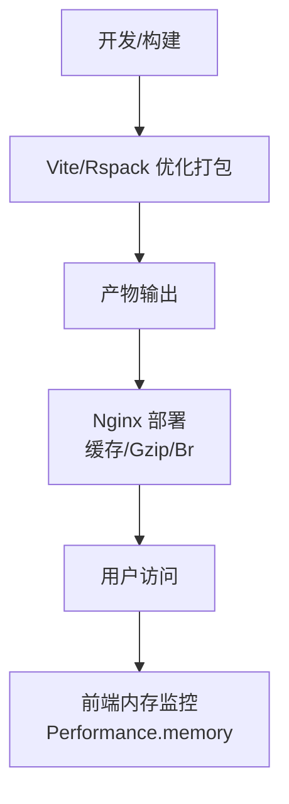
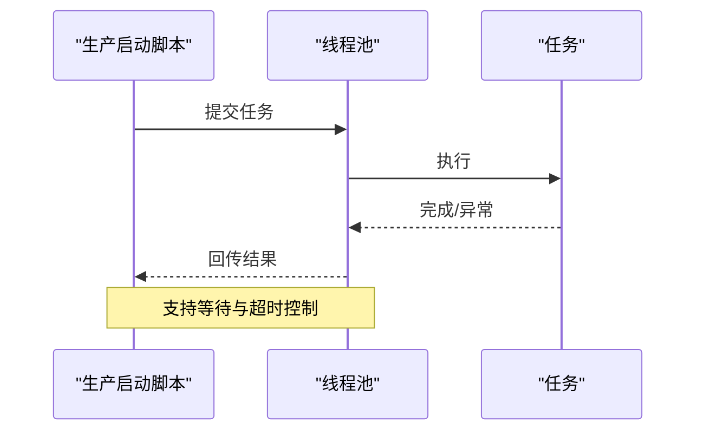
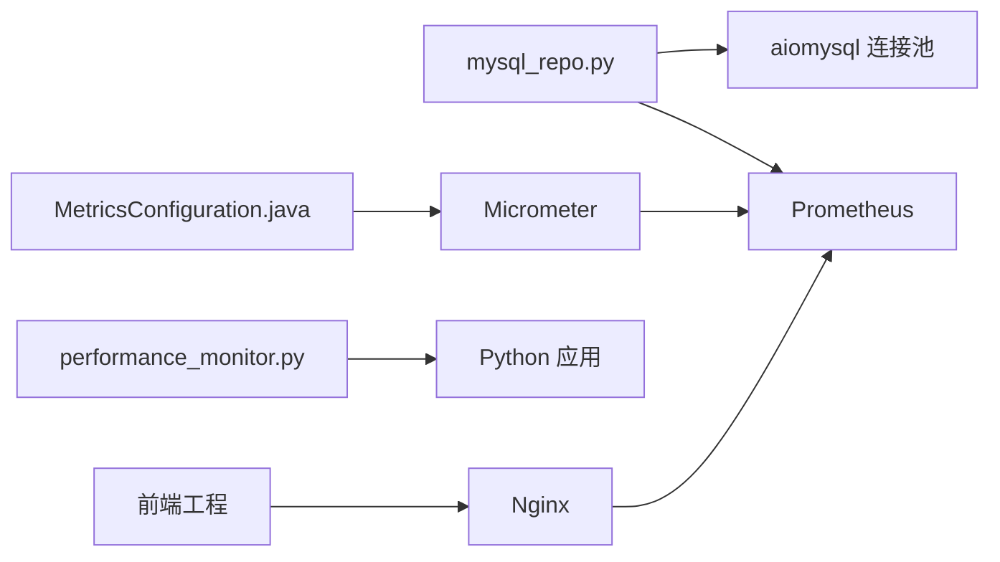

# 性能优化

<cite>
**本文引用的文件**
- [MetricsConfiguration.java](file://java-backend/src/main/java/com/sjzm/config/MetricsConfiguration.java)
- [MetricsConfig.java](file://java-backend/src/main/java/com/sjzm/config/MetricsConfig.java)
- [RedisConfig.java（Java通用）](file://java-backend/sjzm-common/src/main/java/com/sjzm/config/RedisConfig.java)
- [RedisConfig.java（后端实现）](file://java-backend/src/main/java/com/sjzm/config/RedisConfig.java)
- [CaffeineConfig.java（Java通用）](file://java-backend/sjzm-common/src/main/java/com/sjzm/config/CaffeineConfig.java)
- [CaffeineConfig.java（后端实现）](file://java-backend/src/main/java/com/sjzm/config/CaffeineConfig.java)
- [jvm-options.env](file://java-backend/jvm-config/jvm-options.env)
- [mysql_repo.py](file://backend/app/repositories/mysql_repo.py)
- [add_performance_indexes.py](file://scripts/database/add_performance_indexes.py)
- [cacheManager.ts](file://frontend/src/utils/cacheManager.ts)
- [performance.d.ts](file://frontend/src/types/performance.d.ts)
- [rspack.config.js（vue-admin-better）](file://frontend/vue-admin-better/rspack.config.js)
- [vite.config.ts（vue-pure-admin）](file://frontend/vue-pure-admin/vite.config.ts)
- [performance_monitor.py](file://backend/app/utils/performance_monitor.py)
- [start_prod_multiprocess.py](file://scripts/startup/start_prod_multiprocess.py)
- [monitor_deployment.py](file://scripts/deployment/monitor_deployment.py)
- [prometheus.yml](file://prometheus/prometheus.yml)
- [nginx.conf](file://frontend/nginx.conf)
- [nginx.prod.conf](file://frontend/nginx.prod.conf)
</cite>

## 目录
1. [简介](#简介)
2. [项目结构](#项目结构)
3. [核心组件](#核心组件)
4. [架构总览](#架构总览)
5. [详细组件分析](#详细组件分析)
6. [依赖关系分析](#依赖关系分析)
7. [性能考量](#性能考量)
8. [故障排查指南](#故障排查指南)
9. [结论](#结论)
10. [附录](#附录)

## 简介
本指南面向“思觉智贸系统”，围绕应用性能监控与瓶颈识别、数据库性能优化、缓存策略优化、前端性能优化、后端性能调优、并发与内存管理、负载与压力测试以及性能指标与基线建立等方面，提供系统化的优化方法论与实操建议。文档基于仓库现有实现与脚本进行提炼，并给出可落地的改进方向。

## 项目结构
系统采用前后端分离架构，后端由Python FastAPI与Java微服务共同组成，前端包含两套Vue工程，配合Nginx与Prometheus进行部署与监控。关键性能相关位置如下：
- 后端性能监控与指标：Micrometer + Actuator（Java），自研性能监控工具（Python）
- 数据库：MySQL连接池与索引优化脚本
- 缓存：Redis（Java）与前端本地/内存缓存
- 前端构建与运行：Vite/Rspack配置与Nginx静态资源优化
- 监控与可观测性：Prometheus配置与部署监控脚本

图示来源
- [MetricsConfiguration.java:1-35](file://java-backend/src/main/java/com/sjzm/config/MetricsConfiguration.java#L1-L35)
- [mysql_repo.py:51-386](file://backend/app/repositories/mysql_repo.py#L51-L386)
- [RedisConfig.java（Java通用）:55-84](file://java-backend/sjzm-common/src/main/java/com/sjzm/config/RedisConfig.java#L55-L84)
- [vite.config.ts（vue-pure-admin）:1-43](file://frontend/vue-pure-admin/vite.config.ts#L1-L43)
- [nginx.conf](file://frontend/nginx.conf)
- [prometheus.yml](file://prometheus/prometheus.yml)

章节来源
- [MetricsConfiguration.java:1-35](file://java-backend/src/main/java/com/sjzm/config/MetricsConfiguration.java#L1-L35)
- [mysql_repo.py:51-386](file://backend/app/repositories/mysql_repo.py#L51-L386)
- [RedisConfig.java（Java通用）:55-84](file://java-backend/sjzm-common/src/main/java/com/sjzm/config/RedisConfig.java#L55-L84)
- [vite.config.ts（vue-pure-admin）:1-43](file://frontend/vue-pure-admin/vite.config.ts#L1-L43)
- [nginx.conf](file://frontend/nginx.conf)

## 核心组件
- 指标与监控
  - Java侧：Micrometer + Actuator，统一标签与@Timed切面，便于暴露指标供Prometheus抓取
  - Python侧：自研性能监控器，支持函数/异步函数耗时测量与阶段计时
- 数据库
  - 异步MySQL连接池封装，内置慢查询与查询类型统计
  - 索引优化脚本，自动分析表并批量创建索引
- 缓存
  - Java：Redis缓存管理器（多命名空间TTL），Caffeine本地缓存（多命名空间）
  - 前端：localStorage + 内存图片缓存，带统计与清理策略
- 前端构建与运行
  - Vite/Rspack优化：分包、Tree Shaking、产物压缩、预热
  - Nginx：静态资源缓存、Gzip/Br压缩、健康检查
- JVM与GC
  - JVM参数文件：G1GC、停顿目标、容器支持、OOM Dump等

章节来源
- [MetricsConfiguration.java:1-35](file://java-backend/src/main/java/com/sjzm/config/MetricsConfiguration.java#L1-L35)
- [performance_monitor.py:1-157](file://backend/app/utils/performance_monitor.py#L1-L157)
- [mysql_repo.py:51-386](file://backend/app/repositories/mysql_repo.py#L51-L386)
- [add_performance_indexes.py:110-157](file://scripts/database/add_performance_indexes.py#L110-L157)
- [RedisConfig.java（Java通用）:55-84](file://java-backend/sjzm-common/src/main/java/com/sjzm/config/RedisConfig.java#L55-L84)
- [CaffeineConfig.java（Java通用）:39-95](file://java-backend/sjzm-common/src/main/java/com/sjzm/config/CaffeineConfig.java#L39-L95)
- [cacheManager.ts:57-104](file://frontend/src/utils/cacheManager.ts#L57-L104)
- [vite.config.ts（vue-pure-admin）:1-43](file://frontend/vue-pure-admin/vite.config.ts#L1-L43)
- [nginx.conf](file://frontend/nginx.conf)
- [jvm-options.env:1-76](file://java-backend/jvm-config/jvm-options.env#L1-L76)

## 架构总览
系统通过Nginx统一入口，后端Java微服务负责业务与缓存，Python后端负责数据与任务处理，数据库与缓存作为共享存储。指标体系通过Micrometer与Prometheus统一采集，结合部署监控脚本进行健康与性能评估。

图示来源
- [nginx.conf](file://frontend/nginx.conf)
- [prometheus.yml](file://prometheus/prometheus.yml)

## 详细组件分析

### 数据库性能优化（MySQL）
- 连接池与隔离级别
  - 使用异步连接池封装，设置事务隔离级别为READ COMMITTED，确保读取最新提交数据
  - 支持连接池参数配置（大小、回收、超时、溢出），并提供连接获取上下文管理器
- 查询性能统计
  - 统计慢查询（>500ms）、中等查询（>100ms）、按查询类型聚合，支持导出性能报告与重置指标
- 索引优化
  - 提供索引创建脚本，自动分析表并批量创建索引，失败不阻塞启动

图示来源
- [mysql_repo.py:301-356](file://backend/app/repositories/mysql_repo.py#L301-L356)

章节来源
- [mysql_repo.py:51-386](file://backend/app/repositories/mysql_repo.py#L51-L386)
- [add_performance_indexes.py:110-157](file://scripts/database/add_performance_indexes.py#L110-L157)

### 缓存策略优化（Redis与本地缓存）
- Java侧缓存
  - Redis：多命名空间缓存管理器（短/长TTL），键名前缀统一，JSON序列化，事务感知
  - Caffeine：多命名空间本地缓存（短期/长期/默认），随机过期抖动，统计命中率
- 前端缓存
  - localStorage + 内存图片缓存，统计总量、内存使用、localStorage使用，支持清理过期与最少访问项
  - 提供监控与优化接口（定期清理、建议提示）

图示来源
- [RedisConfig.java（Java通用）:55-84](file://java-backend/sjzm-common/src/main/java/com/sjzm/config/RedisConfig.java#L55-L84)
- [CaffeineConfig.java（Java通用）:39-95](file://java-backend/sjzm-common/src/main/java/com/sjzm/config/CaffeineConfig.java#L39-L95)
- [cacheManager.ts:57-104](file://frontend/src/utils/cacheManager.ts#L57-L104)

章节来源
- [RedisConfig.java（Java通用）:55-84](file://java-backend/sjzm-common/src/main/java/com/sjzm/config/RedisConfig.java#L55-L84)
- [RedisConfig.java（后端实现）:55-84](file://java-backend/src/main/java/com/sjzm/config/RedisConfig.java#L55-L84)
- [CaffeineConfig.java（Java通用）:39-95](file://java-backend/sjzm-common/src/main/java/com/sjzm/config/CaffeineConfig.java#L39-L95)
- [CaffeineConfig.java（后端实现）:39-95](file://java-backend/src/main/java/com/sjzm/config/CaffeineConfig.java#L39-L95)
- [cacheManager.ts:234-337](file://frontend/src/utils/cacheManager.ts#L234-L337)

### 前端性能优化（构建与运行）
- 构建优化
  - Vite：目标ES2015、禁用SourceMap、启用Tree Shaking、依赖预优化
  - Rspack（vue-admin-better）：分包策略、样式拆分、产物压缩、入口预热
- 运行优化
  - Nginx：静态资源缓存、Gzip/Br压缩、健康检查、CDN友好配置
  - 内存监控：扩展Performance.memory接口，辅助前端内存瓶颈定位

图示来源
- [vite.config.ts（vue-pure-admin）:1-43](file://frontend/vue-pure-admin/vite.config.ts#L1-L43)
- [rspack.config.js（vue-admin-better）:200-256](file://frontend/vue-admin-better/rspack.config.js#L200-L256)
- [nginx.conf](file://frontend/nginx.conf)
- [performance.d.ts:1-29](file://frontend/src/types/performance.d.ts#L1-L29)

章节来源
- [vite.config.ts（vue-pure-admin）:1-43](file://frontend/vue-pure-admin/vite.config.ts#L1-L43)
- [rspack.config.js（vue-admin-better）:200-256](file://frontend/vue-admin-better/rspack.config.js#L200-L256)
- [nginx.conf](file://frontend/nginx.conf)
- [nginx.prod.conf](file://frontend/nginx.prod.conf)
- [performance.d.ts:1-29](file://frontend/src/types/performance.d.ts#L1-L29)

### 后端性能调优（并发、内存、GC）
- 并发与任务
  - 多进程/线程池启动脚本，支持任务等待与超时控制，便于生产环境并发调度
- JVM与GC
  - G1GC配置、停顿目标、容器支持、OOM Dump、DNS/TCP超时优化
- 指标与监控
  - Micrometer统一标签与@Timed切面，便于暴露指标；部署监控脚本输出CPU/内存/错误率/响应时间/QPS/P50/P95/P99

图示来源
- [start_prod_multiprocess.py:505-544](file://scripts/startup/start_prod_multiprocess.py#L505-L544)

章节来源
- [start_prod_multiprocess.py:505-544](file://scripts/startup/start_prod_multiprocess.py#L505-L544)
- [jvm-options.env:1-76](file://java-backend/jvm-config/jvm-options.env#L1-L76)
- [MetricsConfiguration.java:1-35](file://java-backend/src/main/java/com/sjzm/config/MetricsConfiguration.java#L1-L35)
- [monitor_deployment.py:238-262](file://scripts/deployment/monitor_deployment.py#L238-L262)

## 依赖关系分析
- 指标与监控
  - Java：MetricsConfiguration/Config 注册MeterRegistry与@Timed切面
  - Python：performance_monitor 提供装饰器与阶段计时
- 数据库与缓存
  - mysql_repo.py 依赖aiomysql连接池；Redis与Caffeine配置位于Java侧
- 前端
  - Vue工程通过Vite/Rspack构建，Nginx提供静态资源与缓存
- 监控采集
  - Prometheus抓取Java与Python指标，部署监控脚本输出应用指标

图示来源
- [mysql_repo.py:51-386](file://backend/app/repositories/mysql_repo.py#L51-L386)
- [MetricsConfiguration.java:1-35](file://java-backend/src/main/java/com/sjzm/config/MetricsConfiguration.java#L1-L35)
- [performance_monitor.py:1-157](file://backend/app/utils/performance_monitor.py#L1-L157)
- [nginx.conf](file://frontend/nginx.conf)
- [prometheus.yml](file://prometheus/prometheus.yml)

章节来源
- [mysql_repo.py:51-386](file://backend/app/repositories/mysql_repo.py#L51-L386)
- [MetricsConfiguration.java:1-35](file://java-backend/src/main/java/com/sjzm/config/MetricsConfiguration.java#L1-L35)
- [performance_monitor.py:1-157](file://backend/app/utils/performance_monitor.py#L1-L157)
- [nginx.conf](file://frontend/nginx.conf)
- [prometheus.yml](file://prometheus/prometheus.yml)

## 性能考量
- 响应时间
  - 后端：通过@Timed与自定义监控器记录函数/异步函数耗时；部署监控脚本输出P50/P95/P99延迟
  - 前端：Nginx缓存与压缩减少首屏与二次加载时间；内存监控辅助定位前端内存峰值
- 吞吐量
  - 数据库：连接池参数调优（pool_size、max_overflow、pool_timeout）；索引优化降低扫描成本
  - 缓存：Redis/Caffeine多级缓存，合理TTL与键前缀，提升命中率
  - 前端：分包与Tree Shaking减少首屏体积；CDN与Gzip/Br提升传输效率
- 资源利用率
  - JVM：G1GC停顿目标与容器内存限制；GC日志与OOM Dump辅助分析
  - 前端：内存监控与缓存清理策略，避免内存泄漏与峰值过高

## 故障排查指南
- 指标与告警
  - 检查Prometheus抓取目标与标签一致性；关注错误率、响应时间、QPS与延迟分位数
- 数据库
  - 关注慢查询比率与查询类型分布；必要时调整索引或查询计划
- 缓存
  - Redis：检查TTL与键前缀；Caffeine：观察命中率与过期策略
- 前端
  - Nginx：确认缓存与压缩配置生效；前端内存监控辅助定位异常峰值
- JVM
  - 查看GC日志与堆转储，结合容器内存限制定位内存压力

章节来源
- [monitor_deployment.py:238-262](file://scripts/deployment/monitor_deployment.py#L238-L262)
- [mysql_repo.py:331-356](file://backend/app/repositories/mysql_repo.py#L331-L356)
- [RedisConfig.java（Java通用）:55-84](file://java-backend/sjzm-common/src/main/java/com/sjzm/config/RedisConfig.java#L55-L84)
- [CaffeineConfig.java（Java通用）:39-95](file://java-backend/sjzm-common/src/main/java/com/sjzm/config/CaffeineConfig.java#L39-L95)
- [nginx.conf](file://frontend/nginx.conf)
- [jvm-options.env:40-53](file://java-backend/jvm-config/jvm-options.env#L40-L53)

## 结论
本指南基于仓库现有实现，给出了数据库、缓存、前端与后端的性能优化路径与实践要点。建议在生产环境中持续采集指标、建立性能基线、定期进行负载与压力测试，并结合监控脚本与JVM参数进行精细化调优，以获得稳定且高性能的系统表现。

## 附录
- 性能监控指标定义（建议）
  - 响应时间：P50/P95/P99（毫秒）
  - 吞吐量：QPS（每秒请求数）
  - 错误率：错误请求占比（百分比）
  - 资源利用率：CPU使用率、内存使用率、GC停顿时间
  - 数据库：慢查询率、平均查询时间、连接池活跃数
  - 缓存：命中率、过期率、总项数、内存使用
- 性能基线建立
  - 在标准负载下采集上述指标，形成基线区间；异常波动时触发告警与回滚
- 负载与压力测试方法
  - 使用压测工具对关键路径（商品查询、评分计算、图片加载）施压，观察指标与延迟分位数变化，逐步逼近系统极限并记录拐点